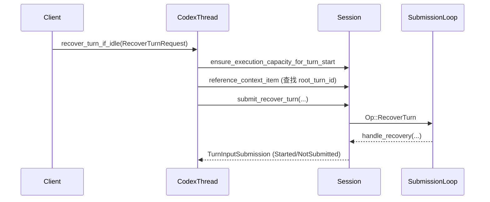
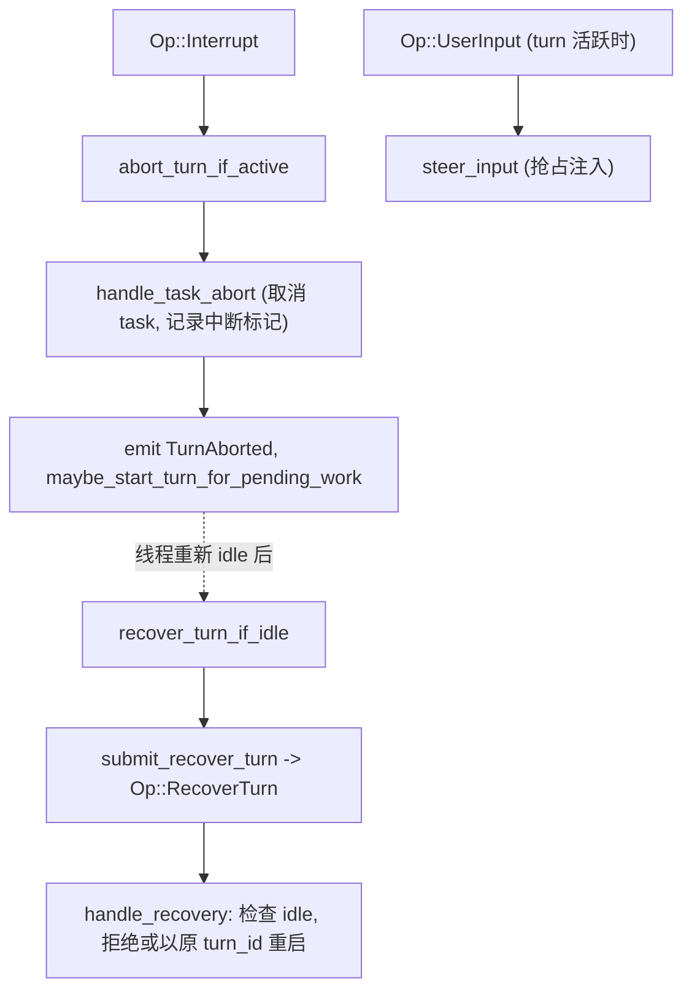
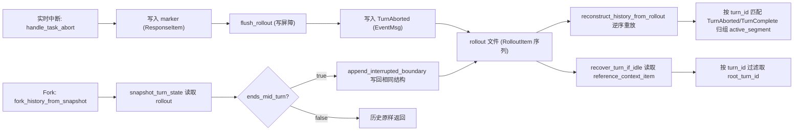

> Source: 用户提供的 DeepWiki Q&A 导出文本（未提供原问答 URL 或源码 commit）
> Context: [AI Agent中断恢复设计](chatgpt-conversation://6ab1064b-9118-83e9-8f4e-e5407f6ee504)（关联讨论，不是本导出文本的来源 URL）
> Collected: 2026-09-21
> Published: Unknown
> Original filename: 已粘贴的文本.txt

# DeepWiki Q&A with Code Context for Repository: openai/codex
## Q1
中断恢复功能
### Answer
## 概要

"中断恢复功能"（Interrupt Recovery）在 Codex 中体现在多个层面，最核心的是 `codex-core` 中恢复被中断的 turn，以及 `codex-exec-server` 中恢复断线的进程会话。此外 TUI 层也有连接层面的重连恢复逻辑。

---

## 1. Turn 级别的中断恢复（codex-core）

`CodexThread::recover_turn_if_idle` 用于在线程空闲时恢复一个被中断的常规 turn，它不会提交新的用户输入，而是保留原有的 `turn_id` 继续执行 codex:345-390 。

它的调用流程：
1. 先确认线程有执行容量（`ensure_execution_capacity_for_turn_start`）。
2. 查找该 `turn_id` 对应的 `root_turn_id`。
3. 通过 `submit_recover_turn` 提交恢复请求，返回 `Started`/`NotSubmitted` 状态 codex:349-389 。

在测试中可以看到实际使用场景：先创建一个被中断的 turn，然后用新的 runtime `resume`，再调用 `recover_turn_if_idle` 恢复未完成的 turn codex:176-196 。

与之相关，`thread_manager.rs` 中的 `append_interrupted_boundary` 负责在 fork 快照中记录同样的"中断边界"（`TurnAbortReason::Interrupted`），确保历史记录一致，供后续恢复时读取 codex:2319-2350 。

## 2. Exec Server 的会话/进程恢复（codex-exec-server）

这是另一套独立但同名概念的"恢复"机制，用于处理执行服务器与客户端之间 WebSocket 断线后的进程状态恢复。

- `SessionState::recover_events` 处理断线重连后接收到的 `ReadResponse`，按序号合并缺失的输出/退出事件 codex:94-147 。
- `Inner::recover` 是重连主循环：等待进程启动、按 `reconnect_strategy` 循环尝试 `resume_once`，超时则失败 codex:364-429 。
- `resume_once` 建立新的 RPC 连接后调用 `recover_processes`，对每个可恢复的会话调用 `process/read`（`EXEC_READ_METHOD`）拉取遗漏的输出，再交给 `recover_events` 处理 codex:472-555 。

这套机制保证了远程沙盒执行环境在网络抖动后依然能续传输出流，而不必重启进程。

## 3. TUI 层的连接恢复（reconnect）

TUI 也有针对 App Server 连接断开的恢复逻辑，与上面两者是不同的系统层次（UI 侧重连，而非 turn 或进程状态恢复）：

- `reconnect()` 函数负责重新连接 App Server 并 `resume_thread`，带指数退避重试 codex:29-120 。
- 恢复后会将旧连接的输入状态（如队列中的消息、collaboration mode）迁移到新连接上,通过 `restore_thread_input_state` 完成 codex:468-524 ，并在 `finish_reconnect` 中切换事件通道、恢复 UI 状态 codex:221-253 。

## Notes

- 这三套"恢复"逻辑分属不同子系统：`codex-core` 的 turn 恢复关注 agent 执行状态；`codex-exec-server` 的恢复关注进程/网络会话；TUI 的 `reconnect` 关注 App Server 连接层，三者并非直接调用关系，但共同构成 Codex 的"断点续传"体验。
- 若你想了解的是具体某一层（例如 CLI/TUI 意外崩溃后的本地数据库恢复），也有相关代码如 `run_tui_with_recovery`（处理本地状态库损坏后的自动备份重建） codex:2769-2819 ，但这与"中断恢复"（turn/进程恢复）是不同的概念，请告诉我具体想深入哪一层。

Wiki pages you might want to explore:
- [Core Agent System (codex-core) (openai/codex)](/wiki/openai/codex#3)
- [Exec Server (openai/codex)](/wiki/openai/codex#4.7)
### Citations
**File:** codex-rs/core/src/codex_thread.rs (L345-390)
```rust
    /// Resumes an interrupted regular turn only when the thread is idle.
    ///
    /// Recovery starts no new user input and preserves the turn ID that was
    /// already recorded for the interrupted turn.
    pub async fn recover_turn_if_idle(
        &self,
        request: RecoverTurnRequest,
    ) -> CodexResult<StartIfIdleSubmission> {
        self.session
            .services
            .agent_control
            .ensure_execution_capacity_for_turn_start(self)
            .await?;
        let RecoverTurnRequest {
            turn_id,
            thread_settings,
            trace,
            cyber_access_program,
        } = request;
        let root_turn_id = self
            .session
            .reference_context_item()
            .await
            .filter(|context| context.turn_id.as_deref() == Some(turn_id.as_str()))
            .and_then(|context| context.root_turn_id);
        let start_options = TurnStartOptions {
            cyber_access_program,
            root_turn_id,
            ..Default::default()
        };
        match self
            .io
            .submit_recover_turn(thread_settings, start_options, trace, turn_id)
            .await?
        {
            TurnInputSubmission::Started { turn_id } => {
                Ok(StartIfIdleSubmission::Started { turn_id })
            }
            TurnInputSubmission::NotSubmitted { reason } => {
                Ok(StartIfIdleSubmission::NotSubmitted { reason })
            }
            TurnInputSubmission::Steered { .. } => {
                unreachable!("recovered turn submission cannot steer")
            }
        }
    }
```
**File:** codex-rs/core/tests/suite/abort_tasks.rs (L176-196)
```rust
    let resumed = test_codex()
        .with_model("gpt-5.4")
        .resume(&recovery_server, Arc::clone(&test.home), rollout_path)
        .await
        .expect("resume the suspended root on a replacement runtime");

    assert_eq!(
        resumed
            .codex
            .recover_turn_if_idle(codex_core::RecoverTurnRequest {
                turn_id: turn_id.clone(),
                thread_settings: Default::default(),
                trace: None,
                cyber_access_program: None,
            })
            .await
            .expect("recover the unfinished turn"),
        codex_core::StartIfIdleSubmission::Started {
            turn_id: turn_id.clone(),
        },
    );
```
**File:** codex-rs/core/src/thread_manager.rs (L2319-2350)
```rust
/// Append the same persisted interrupt boundary used by the live interrupt path
/// to an existing fork snapshot after the source thread has been confirmed to
/// be mid-turn.
fn append_interrupted_boundary(
    history: InitialHistory,
    turn_id: Option<String>,
    started_at: Option<i64>,
    interrupted_marker: InterruptedTurnHistoryMarker,
) -> InitialHistory {
    let aborted_event = RolloutItem::EventMsg(EventMsg::TurnAborted(TurnAbortedEvent {
        turn_id,
        reason: TurnAbortReason::Interrupted,
        started_at,
        completed_at: None,
        duration_ms: None,
    }));

    match history {
        InitialHistory::New | InitialHistory::Cleared => {
            let mut history = Vec::new();
            if let Some(marker) = interrupted_turn_history_marker(interrupted_marker) {
                history.push(RolloutItem::ResponseItem(marker.into()));
            }
            history.push(aborted_event);
            InitialHistory::Forked(history)
        }
        InitialHistory::Forked(mut history) => {
            if let Some(marker) = interrupted_turn_history_marker(interrupted_marker) {
                history.push(RolloutItem::ResponseItem(marker.into()));
            }
            history.push(aborted_event);
            InitialHistory::Forked(history)
```
**File:** codex-rs/exec-server/src/client_recovery.rs (L94-147)
```rust
    fn recover_events(&self, response: ReadResponse) -> Result<bool, ExecServerError> {
        let ReadResponse {
            chunks,
            next_seq,
            exited,
            exit_code,
            closed,
            failure,
            sandbox_denied,
        } = response;
        if let Some(message) = failure {
            return Err(ExecServerError::Protocol(format!(
                "process failed while recovering: {message}"
            )));
        }

        let target_seq = next_seq.saturating_sub(1);
        let published_closed = {
            let mut ordered_events = self
                .ordered_events
                .lock()
                .unwrap_or_else(std::sync::PoisonError::into_inner);
            if ordered_events.failure.is_some()
                || ordered_events.closed_published
                || target_seq <= ordered_events.last_published_seq
            {
                return Ok(false);
            }
            let pending_exit = ordered_events.pending.range_mut(..=target_seq).find_map(
                |(_, event)| match event {
                    ExecProcessEvent::Exited {
                        sandbox_denied: pending_sandbox_denied,
                        ..
                    } => Some(pending_sandbox_denied),
                    _ => None,
                },
            );
            let exit_pending = pending_exit.is_some();
            if let Some(pending_sandbox_denied) = pending_exit {
                *pending_sandbox_denied =
                    Some(pending_sandbox_denied.unwrap_or(false) || sandbox_denied);
            }
            let mut exit_known = ordered_events.exit_published || exit_pending;
            if closed
                && (matches!(
                    ordered_events.pending.get(&target_seq),
                    Some(event) if !matches!(event, ExecProcessEvent::Closed { .. })
                ) || chunks.iter().any(|chunk| chunk.seq == target_seq))
            {
                return Err(ExecServerError::Protocol(format!(
                    "process close sequence {target_seq} conflicts with recovered output"
                )));
            }
            let mut published_closed = false;
```
**File:** codex-rs/exec-server/src/client_recovery.rs (L364-429)
```rust
    async fn recover(self: &Arc<Self>, disconnect_message: String) {
        let deadline = Instant::now() + SESSION_RECOVERY_TIMEOUT;
        self.fail_all_http_body_streams(disconnect_message.clone())
            .await;
        if timeout_at(deadline, self.wait_for_process_starts())
            .await
            .is_err()
        {
            let message = format!(
                "{disconnect_message}; failed to resume exec-server session: recovery timed out after {SESSION_RECOVERY_TIMEOUT:?}"
            );
            self.fail(message).await;
            return;
        }
        if self.reconnect_strategy.is_none() {
            self.fail(disconnect_message).await;
            return;
        }

        let Some(session_id) = self.session_id.get().cloned() else {
            let message = format!(
                "{disconnect_message}; failed to resume exec-server session: missing session id"
            );
            self.fail(message).await;
            return;
        };
        let uses_registry_backoff = matches!(
            self.reconnect_strategy.as_ref(),
            Some(ExecServerReconnectStrategy::NoiseRendezvous { .. })
        );
        let mut registry_retry_attempt = 0;
        let last_error = loop {
            match timeout_at(deadline, self.resume_once(&session_id)).await {
                Ok(Ok((rpc_client, _attempt))) => {
                    if !rpc_client.is_disconnected() && self.install_recovered_client(rpc_client) {
                        return;
                    }
                }
                Ok(Err(error)) if !is_retryable_recovery_error(&error) => {
                    break error.to_string();
                }
                Ok(Err(_)) => {}
                Err(_) => {
                    break format!("recovery timed out after {SESSION_RECOVERY_TIMEOUT:?}");
                }
            }

            let retry_delay = if uses_registry_backoff {
                let delay = registry_recovery_retry_delay(&session_id, registry_retry_attempt);
                registry_retry_attempt = registry_retry_attempt.saturating_add(1);
                delay
            } else {
                SESSION_RECOVERY_RETRY_INTERVAL
            };

            let now = Instant::now();
            if now >= deadline {
                break format!("recovery timed out after {SESSION_RECOVERY_TIMEOUT:?}");
            }
            sleep(retry_delay.min(deadline - now)).await;
        };

        let message =
            format!("{disconnect_message}; failed to resume exec-server session: {last_error}");
        self.fail(message).await;
    }
```
**File:** codex-rs/exec-server/src/client_recovery.rs (L472-555)
```rust
    async fn resume_once(
        self: &Arc<Self>,
        session_id: &str,
    ) -> Result<(Arc<RpcClient>, Option<tokio::sync::OwnedSemaphorePermit>), ExecServerError> {
        let reconnect_strategy = self
            .reconnect_strategy
            .as_ref()
            .ok_or_else(|| ExecServerError::Protocol("missing reconnect strategy".to_string()))?;
        let attempt = reconnect_strategy.resume(session_id).await?;
        let (connection, options, attempt_permit, noise_context) = attempt.into_parts();
        let (rpc_client, events_rx) = RpcClient::new(connection);
        let rpc_client = Arc::new(rpc_client);
        let client = ExecServerClient {
            inner: Arc::clone(self),
            recovery_policy: RecoveryPolicy::Wait,
        };
        // Resuming a session redirects notifications from its running processes
        // to this connection during initialize. Drain them immediately so a
        // burst cannot fill the bounded event channel and block the initialize
        // response behind it.
        client.spawn_rpc_reader(&rpc_client, events_rx);
        client
            .initialize_rpc(&rpc_client, options, noise_context)
            .await?;

        self.recover_processes(&rpc_client).await?;
        Ok((rpc_client, attempt_permit))
    }

    async fn recover_processes(
        self: &Arc<Self>,
        rpc_client: &RpcClient,
    ) -> Result<(), ExecServerError> {
        let sessions = self.sessions.load_full();
        for (process_id, session) in sessions.iter() {
            if !session.recoverable.load(Ordering::Acquire) {
                continue;
            }
            let response = rpc_client
                .call::<_, ReadResponse>(
                    EXEC_READ_METHOD,
                    &ReadParams {
                        process_id: process_id.clone(),
                        after_seq: Some(session.last_published_seq()),
                        max_bytes: None,
                        wait_ms: Some(0),
                    },
                )
                .await
                .map_err(ExecServerError::from);
            let recovered = match response {
                Ok(response) => session.recover_events(response),
                Err(error) if is_transport_closed_error(&error) => return Err(error),
                Err(error) => Err(error),
            };
            match recovered {
                Ok(true) => self.remove_session_if(process_id, session),
                Ok(false) => {}
                Err(error) => {
                    session
                        .network_policy
                        .cancellation
                        .record(NetworkRequestCancellationReason::ProcessCancelled);
                    let terminated: Result<TerminateResponse, ExecServerError> = rpc_client
                        .call_for_cleanup(
                            EXEC_TERMINATE_METHOD,
                            &TerminateParams {
                                process_id: process_id.clone(),
                            },
                        )
                        .await
                        .map_err(ExecServerError::from);
                    if let Err(terminate_error) = terminated
                        && is_transport_closed_error(&terminate_error)
                    {
                        return Err(terminate_error);
                    }
                    self.remove_session_if(process_id, session);
                    session.set_failure(format!("failed to recover process {process_id}: {error}"));
                }
            }
        }
        Ok(())
    }
```
**File:** codex-rs/tui/src/app/reconnect.rs (L29-120)
```rust
pub(super) async fn reconnect(
    target: AppServerTarget,
    config: Config,
    local_settings: crate::local_settings::LocalSettings,
    thread_id: Option<ThreadId>,
    remote_cwd: Option<PathBuf>,
    task_tools: ThreadToolTransport,
    presentation: ReconnectPresentation,
) -> Result<Reconnected> {
    let mode = target.thread_params_mode();
    if matches!(target, AppServerTarget::Embedded) {
        color_eyre::eyre::bail!("in-process sessions have no connection to restore");
    }
    if let ThreadToolTransport::Mcp(server) = &task_tools {
        server.suspend();
    }
    if presentation == ReconnectPresentation::Conversation && thread_id.is_none() {
        color_eyre::eyre::bail!(
            "The initial thread may have been created, but its ID was not received. Nothing was retried. Your prompt is editable; inspect your tasks before relaunching."
        );
    }
    // Connecting already has transport deadlines. Give healthy history/inventory hydration one
    // shared budget instead of repeatedly discarding its progress on a short per-attempt timer.
    let deadline = tokio::time::Instant::now() + Duration::from_secs(/*secs*/ 120);
    for delay in [0, 1, 2, 4, 8] {
        let attempt = async {
            tokio::time::sleep(Duration::from_secs(delay)).await;
            let client = crate::app_server_connection::connect(&target).await?;
            let mut session = AppServerSession::new(client, mode)
                .with_startup_config(&config)
                .with_remote_cwd_override(remote_cwd.clone())
                .with_thread_tool_transport(task_tools.clone());
            let bootstrap = session.bootstrap(&config).await?;
            let thread = if let Some(thread_id) = thread_id {
                match session
                    .resume_thread(
                        &local_settings,
                        config.clone(),
                        thread_id,
                        ResumeModelSettings::PreserveExistingThread,
                    )
                    .await
                {
                    Ok(thread) => Some(thread),
                    Err(error)
                        if matches!(
                            error.downcast_ref::<TypedRequestError>(),
                            Some(TypedRequestError::Transport { .. })
                        ) =>
                    {
                        return Err(error);
                    }
                    // Unloading threads use the same code as unavailable conversations, but
                    // ordinary resume can reattach once the unload finishes.
                    Err(error)
                        if matches!(
                            error.downcast_ref::<TypedRequestError>(),
                            Some(TypedRequestError::Server { method, source })
                                if method == "thread/resume" && source.code == -32600
                                    && source.message.starts_with(&format!("thread {thread_id} is closing;"))
                        ) =>
                    {
                        return Err(error);
                    }
                    Err(error)
                        if matches!(
                            error.downcast_ref::<TypedRequestError>(),
                            Some(TypedRequestError::Server { source, .. }) if source.code == -32600
                        ) || presentation == ReconnectPresentation::Overview =>
                    {
                        None
                    }
                    Err(error) => return Err(error),
                }
            } else {
                None
            };
            Ok::<_, color_eyre::Report>(Reconnected {
                session,
                bootstrap,
                thread,
            })
        };
        let result = tokio::time::timeout_at(deadline, attempt).await;
        match result {
            Ok(Ok(connected)) => return Ok(connected),
            Ok(Err(_)) => {}
            Err(_) => break,
        }
        // Transport errors can contain endpoint credentials. Do not render or log them.
    }
    color_eyre::eyre::bail!("app-server session could not be restored")
```
**File:** codex-rs/tui/src/app/reconnect.rs (L221-253)
```rust
    ) -> Result<()> {
        let Reconnected {
            mut session,
            bootstrap,
            thread,
        } = connected;
        let selected = self
            .chat_widget
            .selected_index_for_present_view(agents_overview::AGENTS_OVERVIEW_VIEW_ID)
            .and_then(|index| self.agents_overview.visible_thread_ids.get(index).copied());
        let displayed = self.current_displayed_thread_id();
        let mut input = self.chat_widget.capture_thread_input_state();
        if let Some(input) = input.as_mut() {
            input.recovered_queue = true;
        }
        self.store_active_thread_receiver().await;
        // Old request handles stay attached to the dead connection. Rotating the event channel
        // prevents their late completions from submitting follow-up operations on the new one.
        let (tx, rx) = mpsc::unbounded_channel();
        self.app_event_tx = AppEventSender::new(tx);
        *app_event_rx = rx;
        self.agent_navigation.picker_refresh = None;
        self.last_subagent_backfill_attempt = None;
        self.rate_limit_refresh_state.invalidate_recovery();
        session.inherit_task_tool_capabilities(app_server);
        *app_server = session;
        self.chat_widget.cyber_policy_notice = Default::default();
        self.chat_widget.requires_openai_auth = bootstrap.requires_openai_auth;
        self.chat_widget.remote_connection =
            crate::status::remote_connection::remote_connection_status_value(
                &self.app_server_target,
                app_server.server_version(),
            );
```
**File:** codex-rs/tui/src/chatwidget/input_restore.rs (L468-524)
```rust
    pub(crate) fn restore_thread_input_state(
        &mut self,
        input_state: Option<ThreadInputState>,
        restore_mode: ThreadInputStateRestoreMode,
    ) {
        let preserve_in_flight_turn = restore_mode.preserve_in_flight_turn;
        let restored_task_running =
            preserve_in_flight_turn && input_state.as_ref().is_some_and(|state| state.task_running);
        if let Some(input_state) = input_state {
            self.input_queue.recovered_queue = input_state.recovered_queue;
            self.current_collaboration_mode = input_state.current_collaboration_mode;
            self.active_collaboration_mask = input_state.active_collaboration_mask;
            self.safety_buffering_prompt = input_state.safety_buffering_prompt;
            self.turn_lifecycle.restore_running(
                preserve_in_flight_turn && input_state.agent_turn_running,
                Instant::now(),
            );
            self.input_queue.user_turn_pending_start =
                preserve_in_flight_turn && input_state.user_turn_pending_start;
            self.input_queue.submit_pending_steers_after_interrupt =
                preserve_in_flight_turn && input_state.submit_pending_steers_after_interrupt;
            self.update_collaboration_mode_indicator();
            self.refresh_model_dependent_surfaces();
            self.restore_composer_state(input_state.composer.unwrap_or_default());
            let pending_steers = input_state.pending_steers;
            let mut queued_user_messages = input_state.queued_user_messages;
            let mut queued_user_message_history_records =
                input_state.queued_user_message_history_records;
            if preserve_in_flight_turn {
                self.input_queue.pending_steers = pending_steers;
            } else {
                self.input_queue.pending_steers.clear();
                for pending in pending_steers.into_iter().rev() {
                    queued_user_messages.push_front(pending.user_message.into());
                    queued_user_message_history_records.push_front(pending.history_record);
                }
            }
            self.input_queue.rejected_steers_queue = input_state.rejected_steers_queue;
            self.input_queue.rejected_steer_history_records =
                input_state.rejected_steer_history_records;
            self.input_queue.rejected_steer_history_records.resize(
                self.input_queue.rejected_steers_queue.len(),
                UserMessageHistoryRecord::UserMessageText,
            );
            self.input_queue.queued_user_messages = queued_user_messages;
            self.input_queue.queued_user_message_history_records =
                queued_user_message_history_records;
            self.input_queue.queued_user_message_history_records.resize(
                self.input_queue.queued_user_messages.len(),
                UserMessageHistoryRecord::UserMessageText,
            );
        } else {
            self.turn_lifecycle
                .restore_running(/*running*/ false, Instant::now());
            self.safety_buffering_prompt = None;
            self.input_queue.clear();
            self.restore_composer_state(Default::default());
```
**File:** codex-rs/cli/src/main.rs (L2769-2819)
```rust
async fn run_tui_with_recovery<F, Fut>(
    mut start_tui: F,
    remote_auth_token_env: Option<&str>,
) -> std::io::Result<AppExitInfo>
where
    F: FnMut() -> Fut,
    Fut: std::future::Future<Output = std::io::Result<AppExitInfo>>,
{
    let mut attempted_backups = HashSet::new();
    loop {
        // Keep the large TUI future out of the CLI dispatcher's stack frame.
        let err = match Box::pin(start_tui()).await {
            Ok(mut exit_info) => {
                if let Some(disconnect) = &mut exit_info.disconnect_info
                    && let Some(env_var) = remote_auth_token_env
                {
                    disconnect
                        .command
                        .extend(["--remote-auth-token-env".to_string(), env_var.to_string()]);
                }
                return Ok(exit_info);
            }
            Err(err) => err,
        };
        let Some(startup_error) = local_state_db::startup_error(&err) else {
            return Err(err);
        };
        if local_state_db::is_locked(startup_error.detail()) {
            local_state_db::print_locked_guidance(startup_error);
            return Ok(AppExitInfo::fatal(startup_error.to_string()));
        }
        if !local_state_db::is_auto_backup_recoverable(startup_error) {
            local_state_db::print_diagnostic_guidance(startup_error);
            return Ok(AppExitInfo::fatal(startup_error.to_string()));
        }
        if !attempted_backups.insert(startup_error.database_path().to_path_buf()) {
            local_state_db::print_diagnostic_guidance(startup_error);
            return Ok(AppExitInfo::fatal(startup_error.to_string()));
        }

        local_state_db::print_auto_backup_start(startup_error);
        match local_state_db::backup_files_for_fresh_start(startup_error).await {
            Ok(backups) => local_state_db::confirm_fresh_start_rebuild(startup_error, &backups)?,
            Err(backup_err) => {
                local_state_db::print_diagnostic_guidance(startup_error);
                return Ok(AppExitInfo::fatal(format!(
                    "failed to move damaged Codex local database files into a backup folder automatically: {backup_err}"
                )));
            }
        }
    }
```
## Q2
Turn 级别的中断恢复
### Answer
## 概要

Turn 级别的中断恢复指的是 `codex-core` 中 `CodexThread::recover_turn_if_idle` 这条路径,让被中断的 turn 在线程重新变为 idle 后,以相同的 `turn_id` 继续执行,而不是重新提交用户输入。

---

## 调用链



### 1. 入口：`CodexThread::recover_turn_if_idle`

该函数先确保执行容量,再从 `RecoverTurnRequest` 中取出 `turn_id`、`thread_settings`、`trace`、`cyber_access_program`,查找该 `turn_id` 对应的 `root_turn_id`,最终调用 `submit_recover_turn` 提交 codex:345-390 。

返回值映射为 `StartIfIdleSubmission::Started` 或 `NotSubmitted`;`Steered` 分支不可达,因为恢复的 turn 不会被 steer。

### 2. `Session::submit_recover_turn` 提交 `Op::RecoverTurn`

`submit_recover_turn` 用原始 `turn_id` 作为提交 ID,构造 `Op::RecoverTurn { thread_settings, start_options, reply }`,通过 `submit_with_id` 送入 submission loop,并等待 `reply_rx` 返回结果 codex:914-935 。

### 3. 空闲检查:`handle_recovery`

只有当线程真正空闲(没有活跃 turn)时才允许恢复;若已有活跃 turn 在运行,恢复会被拒绝为 `NotSubmittedReason::NotIdle`,且不会注入内容或应用设置 —— 测试 `recovery_rejects_active_turn_without_injecting_or_applying_settings` 验证了这一行为 codex:249-306 。

### 4. 历史/Fork 中的中断边界

当线程被 fork 且源线程恰好处于中断状态时,`thread_manager.rs` 中的 `append_interrupted_boundary` 会在 fork 快照里追加与实时中断路径相同的 `EventMsg::TurnAborted(reason: TurnAbortReason::Interrupted)` 边界,确保 fork 出来的历史与恢复逻辑读取的历史一致 codex:2319-2361 ,对应单测在 codex:2283-2335 。

### 5. 端到端测试验证

- `abort_tasks.rs` 测试:中断一个 turn 后,用新 runtime `resume`,再调用 `recover_turn_if_idle`,断言返回 `Started { turn_id }` 并等待其正常完成 codex:176-196 。
- `turn_input_submission.rs` 测试:`recover_turn_if_idle` 保留原 `turn_id`,同时可通过 `thread_settings` 恢复到 Plan 协作模式,验证请求中携带的 `turn_metadata` header 里 `turn_trigger` 为 `"retry"` codex:128-196 。

## Notes

- "Turn 级别中断恢复"专属于 `codex-core`,与我上一轮提到的 `codex-exec-server`(进程/连接恢复)和 TUI 的 `reconnect`(App Server 连接恢复)属于不同层次,这里不再重复涉及。
- `handle_recovery` 的具体代码正文没有直接展示在检索结果中,但其行为可从测试 codex:269-286  明确推断:拒绝在 active turn 存在时恢复。若你需要看到 `handle_recovery` 完整实现,建议启动一个 Devin session 直接查阅 `codex-rs/core/src/session/mod.rs` 或相关文件的全文。

Wiki pages you might want to explore:
- [Codex Interface and Session Lifecycle (openai/codex)](/wiki/openai/codex#3.1)
### Citations
**File:** codex-rs/core/src/codex_thread.rs (L345-390)
```rust
    /// Resumes an interrupted regular turn only when the thread is idle.
    ///
    /// Recovery starts no new user input and preserves the turn ID that was
    /// already recorded for the interrupted turn.
    pub async fn recover_turn_if_idle(
        &self,
        request: RecoverTurnRequest,
    ) -> CodexResult<StartIfIdleSubmission> {
        self.session
            .services
            .agent_control
            .ensure_execution_capacity_for_turn_start(self)
            .await?;
        let RecoverTurnRequest {
            turn_id,
            thread_settings,
            trace,
            cyber_access_program,
        } = request;
        let root_turn_id = self
            .session
            .reference_context_item()
            .await
            .filter(|context| context.turn_id.as_deref() == Some(turn_id.as_str()))
            .and_then(|context| context.root_turn_id);
        let start_options = TurnStartOptions {
            cyber_access_program,
            root_turn_id,
            ..Default::default()
        };
        match self
            .io
            .submit_recover_turn(thread_settings, start_options, trace, turn_id)
            .await?
        {
            TurnInputSubmission::Started { turn_id } => {
                Ok(StartIfIdleSubmission::Started { turn_id })
            }
            TurnInputSubmission::NotSubmitted { reason } => {
                Ok(StartIfIdleSubmission::NotSubmitted { reason })
            }
            TurnInputSubmission::Steered { .. } => {
                unreachable!("recovered turn submission cannot steer")
            }
        }
    }
```
**File:** codex-rs/core/src/session/mod.rs (L914-935)
```rust
    pub(crate) async fn submit_recover_turn(
        &self,
        thread_settings: ThreadSettingsOverrides,
        start_options: TurnStartOptions,
        trace: Option<W3cTraceContext>,
        turn_id: String,
    ) -> CodexResult<TurnInputSubmission> {
        let (reply_tx, reply_rx) = oneshot::channel();
        self.submit_with_id(Submission {
            id: turn_id,
            op: Op::RecoverTurn {
                thread_settings,
                start_options,
                reply: reply_tx,
            },
            trace,
            parent_turn_id: None,
            root_turn_id: None,
        })
        .await?;
        reply_rx.await.unwrap_or(Err(CodexErr::InternalAgentDied))
    }
```
**File:** codex-rs/core/src/session/turn_input_tests.rs (L249-306)
```rust
#[tokio::test]
async fn recovery_rejects_active_turn_without_injecting_or_applying_settings() {
    let (session, turn_context, _rx) = make_session_and_context_with_rx().await;
    let original_approval_policy = session
        .get_config()
        .await
        .permissions
        .approval_policy
        .value();
    session
        .spawn_task(
            Arc::clone(&turn_context),
            Vec::new(),
            NeverEndingTask {
                kind: TaskKind::Regular,
                listen_to_cancellation_token: true,
            },
        )
        .await;

    let submission = handle_recovery(
        &session,
        ThreadSettingsOverrides {
            approval_policy: Some(AskForApproval::Never),
            ..Default::default()
        },
        TurnStartOptions::default(),
        "recovered-turn".to_string(),
    )
    .await
    .expect("recovery should return a typed rejection");

    assert_eq!(
        submission,
        TurnInputSubmission::NotSubmitted {
            reason: NotSubmittedReason::NotIdle,
        }
    );
    assert_eq!(
        session
            .get_config()
            .await
            .permissions
            .approval_policy
            .value(),
        original_approval_policy
    );
    assert_eq!(
        session
            .input_queue
            .get_pending_input(&session.active_turn)
            .await
            .0,
        Vec::<TurnInput>::new()
    );

    session.abort_all_tasks(TurnAbortReason::Interrupted).await;
}
```
**File:** codex-rs/core/src/thread_manager.rs (L2319-2361)
```rust
/// Append the same persisted interrupt boundary used by the live interrupt path
/// to an existing fork snapshot after the source thread has been confirmed to
/// be mid-turn.
fn append_interrupted_boundary(
    history: InitialHistory,
    turn_id: Option<String>,
    started_at: Option<i64>,
    interrupted_marker: InterruptedTurnHistoryMarker,
) -> InitialHistory {
    let aborted_event = RolloutItem::EventMsg(EventMsg::TurnAborted(TurnAbortedEvent {
        turn_id,
        reason: TurnAbortReason::Interrupted,
        started_at,
        completed_at: None,
        duration_ms: None,
    }));

    match history {
        InitialHistory::New | InitialHistory::Cleared => {
            let mut history = Vec::new();
            if let Some(marker) = interrupted_turn_history_marker(interrupted_marker) {
                history.push(RolloutItem::ResponseItem(marker.into()));
            }
            history.push(aborted_event);
            InitialHistory::Forked(history)
        }
        InitialHistory::Forked(mut history) => {
            if let Some(marker) = interrupted_turn_history_marker(interrupted_marker) {
                history.push(RolloutItem::ResponseItem(marker.into()));
            }
            history.push(aborted_event);
            InitialHistory::Forked(history)
        }
        InitialHistory::Resumed(resumed) => {
            let mut history = Arc::unwrap_or_clone(resumed.history);
            if let Some(marker) = interrupted_turn_history_marker(interrupted_marker) {
                history.push(RolloutItem::ResponseItem(marker.into()));
            }
            history.push(aborted_event);
            InitialHistory::Forked(history)
        }
    }
}
```
**File:** codex-rs/core/src/thread_manager_tests.rs (L2283-2335)
```rust
#[test]
fn interrupted_fork_snapshot_appends_interrupt_boundary() {
    let committed_history =
        InitialHistory::Forked(vec![RolloutItem::ResponseItem(user_msg("hello").into())]);

    assert_eq!(
        serde_json::to_value(
            append_interrupted_boundary(
                committed_history,
                /*turn_id*/ None,
                /*started_at*/ None,
                InterruptedTurnHistoryMarker::ContextualUser,
            )
            .get_rollout_items()
        )
        .expect("serialize interrupted fork history"),
        serde_json::to_value(vec![
            RolloutItem::ResponseItem(user_msg("hello").into()),
            RolloutItem::ResponseItem(contextual_user_interrupted_marker().into()),
            RolloutItem::EventMsg(EventMsg::TurnAborted(TurnAbortedEvent {
                turn_id: None,
                started_at: None,
                reason: TurnAbortReason::Interrupted,
                completed_at: None,
                duration_ms: None,
            })),
        ])
        .expect("serialize expected interrupted fork history"),
    );
    assert_eq!(
        serde_json::to_value(
            append_interrupted_boundary(
                InitialHistory::New,
                /*turn_id*/ None,
                /*started_at*/ None,
                InterruptedTurnHistoryMarker::ContextualUser,
            )
            .get_rollout_items()
        )
        .expect("serialize interrupted empty fork history"),
        serde_json::to_value(vec![
            RolloutItem::ResponseItem(contextual_user_interrupted_marker().into()),
            RolloutItem::EventMsg(EventMsg::TurnAborted(TurnAbortedEvent {
                turn_id: None,
                started_at: None,
                reason: TurnAbortReason::Interrupted,
                completed_at: None,
                duration_ms: None,
            })),
        ])
        .expect("serialize expected interrupted empty history"),
    );
}
```
**File:** codex-rs/core/tests/suite/abort_tasks.rs (L176-196)
```rust
    let resumed = test_codex()
        .with_model("gpt-5.4")
        .resume(&recovery_server, Arc::clone(&test.home), rollout_path)
        .await
        .expect("resume the suspended root on a replacement runtime");

    assert_eq!(
        resumed
            .codex
            .recover_turn_if_idle(codex_core::RecoverTurnRequest {
                turn_id: turn_id.clone(),
                thread_settings: Default::default(),
                trace: None,
                cyber_access_program: None,
            })
            .await
            .expect("recover the unfinished turn"),
        codex_core::StartIfIdleSubmission::Started {
            turn_id: turn_id.clone(),
        },
    );
```
**File:** codex-rs/core/tests/suite/turn_input_submission.rs (L128-196)
```rust
#[tokio::test]
async fn recover_turn_if_idle_preserves_id_and_resumes_plan_mode() {
    let server = responses::start_mock_server().await;
    let response_mock =
        responses::mount_sse_once(&server, responses::sse_completed("resp-1")).await;
    let test = test_codex()
        .build_with_auto_env(&server)
        .await
        .expect("build recovered turn session");
    let turn_id = "durable-recovered-turn";

    let submission = test
        .codex
        .recover_turn_if_idle(RecoverTurnRequest {
            turn_id: turn_id.to_string(),
            thread_settings: ThreadSettingsOverrides {
                collaboration_mode: Some(CollaborationMode {
                    mode: ModeKind::Plan,
                    settings: Settings {
                        model: test.session_configured.model.clone(),
                        reasoning_effort: None,
                        developer_instructions: None,
                    },
                }),
                ..Default::default()
            },
            trace: None,
            cyber_access_program: None,
        })
        .await
        .expect("recovered turn should start");
    assert_eq!(
        submission,
        StartIfIdleSubmission::Started {
            turn_id: turn_id.to_string(),
        }
    );
    assert_eq!(
        test.codex.config_snapshot().await.collaboration_mode.mode,
        ModeKind::Plan
    );

    let started = wait_for_event(&test.codex, |event| {
        matches!(event, EventMsg::TurnStarted(_))
    })
    .await;
    let EventMsg::TurnStarted(started) = started else {
        unreachable!("wait_for_event returned unexpected event");
    };
    assert_eq!(started.turn_id, turn_id);
    wait_for_event(&test.codex, |event| {
        matches!(event, EventMsg::TurnComplete(_))
    })
    .await;

    let request = response_mock.single_request();
    let turn_metadata: Value = serde_json::from_str(
        request
            .header("x-codex-turn-metadata")
            .as_deref()
            .expect("recovered turn should include turn metadata"),
    )
    .expect("recovered turn metadata should be valid JSON");
    assert_eq!(turn_metadata["turn_trigger"].as_str(), Some("retry"));
    let user_input_groups = request.message_input_text_groups("user");
    assert_eq!(user_input_groups.len(), 1);
    assert_eq!(user_input_groups[0].len(), 1);
    assert!(user_input_groups[0][0].starts_with("<environment_context>"));
}
```
## Q3
turn 中的中断、抢占、恢复是怎么实现的
### Answer
## 概要

Turn 的中断(interrupt)、抢占(preemption/steer)、恢复(recovery)在 `codex-core` 中由三条互相配合的路径实现:中断通过 `abort_turn_if_active`/`handle_task_abort` 取消当前任务;抢占通过 `steer_input` 向活跃 turn 注入新输入;恢复通过 `recover_turn_if_idle` 在线程空闲后以原 `turn_id` 续跑。

---

## 1. 中断(Interrupt)

`abort_turn_if_active` 是中断入口:检查 `active_turn` 中运行的 task 是否匹配给定 `turn_id`,若是,则取出该 task,标记会话为 interrupted,调用 `handle_task_abort` 执行实际取消,并清理挂起的输入队列 codex:543-589 。

`handle_task_abort` 是取消的核心逻辑:
- 通过 `task.cancellation_token.cancel()` 触发取消信号,若启用了 `Feature::CodeModeInterrupt` 则同时中断 code-mode 活跃 cell codex:903-927 。
- 在 `GRACEFULL_INTERRUPTION_TIMEOUT_MS`(100ms)超时窗口内等待任务优雅结束,超时则强制 `task.handle.abort()` codex:933-945 。
- 若中断原因是 `TurnAbortReason::Interrupted`,会记录一个模型可见的中断标记(`interrupted_turn_history_marker`)到对话历史,并 flush rollout,确保客户端读到该标记后再收到 `TurnAborted` 事件 codex:947-965 。
- 最终触发 `run_turn_interrupt_hooks`,并发送 `EventMsg::TurnAborted` 事件通知客户端 codex:967-994 。

## 2. 抢占(Steer)

当有新输入到达但 turn 仍活跃时,`start_or_steer_turn` 走 `TurnInputMode::StartOrSteer` 路径,底层由 `steer_input` 实现——将额外用户输入直接注入到正在运行的 active turn,而不中断它,返回被接受的 `turn_id` codex:546-553 。这与"中断+重新提交"是不同的抢占策略:抢占保留了正在进行的模型调用,把新内容合并进去。

对应地,`CodexThread::start_or_steer_turn` 是公共入口,区别于只在 idle 时启动的 `start_turn_if_idle` codex:308-343 。

## 3. 恢复(Recovery)

`recover_turn_if_idle` 只在线程空闲时恢复被中断的 turn,保留原 `turn_id`,不注入新用户输入 codex:345-390 ,底层通过 `Session::submit_recover_turn` 提交 `Op::RecoverTurn` codex:914-935 。

若此时已存在活跃 turn(即尚未真正 idle),恢复请求会被拒绝为 `NotSubmittedReason::NotIdle`,不会修改任何配置或注入输入,测试 `recovery_rejects_active_turn_without_injecting_or_applying_settings` 验证了这点 codex:249-306 。

## 4. Turn 收尾与状态清理(与中断/恢复相关)

无论 turn 正常完成还是被中断,都会走统一的收尾逻辑:计算 `idle_cause`(Interrupted/Failed/Completed),发出 `TurnAborted` 或 `TurnComplete` 事件,清空 `active_turn`,并调用 `maybe_start_turn_for_pending_work` 尝试启动排队中的下一个 turn codex:775-869 。这一步是中断之后能否自动衔接下一个 turn(包括恢复流程触发的新 turn)的关键。

## 5. 历史一致性:Fork 时的中断边界

当从一个"中途中断"的线程 fork 出新线程时,`fork_history_from_snapshot`/`append_interrupted_boundary` 会在 fork 快照中补上与实时中断路径相同的 `TurnAborted(reason: Interrupted)` 边界及可选的中断标记,以保证 fork 出来的历史与真实中断历史语义一致 codex:2286-2361 ,并有单测覆盖 codex:2283-2335 。

---

## 调用关系图



## Notes

- `steer_input` 的完整实现体没有在检索结果中出现(只看到函数签名附近),若需要看完整逻辑建议启动 Devin session 查看 `codex-rs/core/src/session/turn_input.rs` 全文。
- 三条路径(中断/抢占/恢复)都汇聚到同一个 `active_turn: Mutex<Option<ActiveTurn>>` 状态上,靠它们互相协调避免并发冲突,但检索结果中未展示 `ActiveTurn`/`TurnState` 的完整定义。

Wiki pages you might want to explore:
- [Codex Interface and Session Lifecycle (openai/codex)](/wiki/openai/codex#3.1)
### Citations
**File:** codex-rs/core/src/tasks/mod.rs (L543-589)
```rust
    pub(crate) async fn abort_turn_if_active(
        self: &Arc<Self>,
        turn_id: &str,
        reason: TurnAbortReason,
    ) -> bool {
        let active_turn = {
            let mut active = self.active_turn.lock().await;
            if active
                .as_ref()
                .and_then(|active_turn| active_turn.task.as_ref())
                .is_some_and(|task| task.turn_context.sub_id == turn_id)
            {
                if matches!(
                    reason,
                    TurnAbortReason::Interrupted | TurnAbortReason::BudgetLimited
                ) {
                    self.mark_interrupted();
                }
                active.take()
            } else {
                None
            }
        };
        let Some(mut active_turn) = active_turn else {
            return false;
        };

        let task = active_turn.task.take();
        let turn_context = task.as_ref().map(|task| Arc::clone(&task.turn_context));
        if let Some(task) = task {
            self.handle_task_abort(task, reason.clone(), &active_turn.turn_state)
                .await;
        }
        if let Some(turn_context) = turn_context.as_deref() {
            self.emit_turn_abort_lifecycle(reason.clone(), turn_context.extension_data.as_ref())
                .await;
        }
        // Let interrupted tasks observe cancellation before dropping pending approvals, or an
        // in-flight approval wait can surface as a model-visible rejection before TurnAborted.
        self.input_queue.clear_pending(&active_turn).await;

        if reason == TurnAbortReason::Interrupted {
            self.maybe_start_turn_for_pending_work().await;
        }

        true
    }
```
**File:** codex-rs/core/src/tasks/mod.rs (L775-869)
```rust
        }
        emit_turn_memory_metric(
            &self.services.session_telemetry,
            turn_context.config.features.enabled(Feature::MemoryTool),
            turn_context.config.memories.use_memories,
            turn_had_memory_citation,
        );
        self.services.session_telemetry.counter(
            TURN_UNIFIED_EXEC_RUNNING_PROCESSES_METRIC,
            i64::try_from(self.list_background_terminals().await.len()).unwrap_or(i64::MAX),
            &[],
        );
        let started_at = turn_context.turn_timing_state.started_at_unix_secs().await;
        let (completed_at, duration_ms, profile) = turn_context
            .turn_timing_state
            .complete_profile_and_duration_ms()
            .await;
        self.services
            .analytics_events_client
            .track_turn_profile(TurnProfileFact {
                turn_id: turn_context.sub_id.clone(),
                profile,
            });
        let idle_cause = if matches!(
            abort_reason.as_ref(),
            Some(TurnAbortReason::Interrupted | TurnAbortReason::BudgetLimited)
        ) {
            ThreadIdleCause::Interrupted
        } else if abort_reason.is_none() && turn_context.terminal_error.lock().await.is_some() {
            ThreadIdleCause::Failed
        } else {
            ThreadIdleCause::Completed
        };
        let event = if let Some(reason) = abort_reason {
            if reason == TurnAbortReason::Interrupted {
                run_turn_interrupt_hooks(self, &turn_context, &turn_state).await;
            }
            self.emit_turn_abort_lifecycle(reason.clone(), turn_context.extension_data.as_ref())
                .await;
            EventMsg::TurnAborted(TurnAbortedEvent {
                turn_id: Some(turn_context.sub_id.clone()),
                reason,
                started_at,
                completed_at,
                duration_ms,
            })
        } else {
            let time_to_first_token_ms = turn_context
                .turn_timing_state
                .time_to_first_token_ms()
                .await;
            let error = turn_context.terminal_error.lock().await.clone();
            self.emit_turn_stop_lifecycle(turn_context.extension_data.as_ref())
                .await;
            EventMsg::TurnComplete(TurnCompleteEvent {
                turn_id: turn_context.sub_id.clone(),
                last_agent_message,
                error,
                started_at,
                completed_at,
                duration_ms,
                time_to_first_token_ms,
            })
        };
        self.send_event(turn_context.as_ref(), event).await;
        self.services
            .guardian_rejection_circuit_breaker
            .lock()
            .await
            .clear_turn(&turn_context.sub_id);

        let cleared_active_turn = {
            let mut active = self.active_turn.lock().await;
            if let Some(active_turn) = active.as_ref()
                && active_turn.task.is_none()
                && Arc::ptr_eq(&active_turn.turn_state, &turn_state)
            {
                *active = None;
                true
            } else {
                false
            }
        };
        if cleared_active_turn {
            self.emit_thread_idle_lifecycle_if_idle(idle_cause).await;
        }
        // Regular items were flushed before this terminal event was appended; buffering
        // thread writers may not flush it without another explicit barrier.
        if let Err(err) = self.flush_rollout().await {
            warn!("failed to flush rollout after emitting terminal turn event: {err}");
        }
        if cleared_active_turn {
            self.maybe_start_turn_for_pending_work().await;
        }
    }
```
**File:** codex-rs/core/src/tasks/mod.rs (L903-927)
```rust
    async fn handle_task_abort(
        self: &Arc<Self>,
        task: RunningTask,
        reason: TurnAbortReason,
        turn_state: &Mutex<TurnState>,
    ) {
        let sub_id = task.turn_context.sub_id.clone();
        if task.cancellation_token.is_cancelled() {
            return;
        }

        trace!(task_kind = ?task.kind, sub_id, "aborting running task");
        task.cancellation_token.cancel();
        if reason == TurnAbortReason::Interrupted
            && task
                .turn_context
                .config
                .features
                .enabled(Feature::CodeModeInterrupt)
        {
            self.services
                .code_mode_service
                .interrupt_active_cells()
                .await;
        }
```
**File:** codex-rs/core/src/tasks/mod.rs (L933-945)
```rust
        select! {
            _ = task.done.notified() => {
            },
            _ = tokio::time::sleep(Duration::from_millis(GRACEFULL_INTERRUPTION_TIMEOUT_MS)) => {
                warn!("task {sub_id} didn't complete gracefully after {}ms", GRACEFULL_INTERRUPTION_TIMEOUT_MS);
            }
        }

        task.handle.abort();

        session_task
            .abort(Arc::clone(self), Arc::clone(&task.turn_context))
            .await;
```
**File:** codex-rs/core/src/tasks/mod.rs (L947-965)
```rust
        if reason == TurnAbortReason::Interrupted
            && let Some(marker) = interrupted_turn_history_marker(
                InterruptedTurnHistoryMarker::from_config_and_version(
                    task.turn_context.config.as_ref(),
                    task.turn_context.multi_agent_version,
                ),
            )
        {
            self.record_conversation_items(
                task.turn_context.as_ref(),
                std::slice::from_ref(&marker),
            )
            .await;
            // Ensure the marker is durably visible before emitting TurnAborted: some clients
            // synchronously re-read the rollout on receipt of the abort event.
            if let Err(err) = self.flush_rollout().await {
                warn!("failed to flush interrupted-turn marker before emitting TurnAborted: {err}");
            }
        }
```
**File:** codex-rs/core/src/tasks/mod.rs (L967-994)
```rust
        if reason == TurnAbortReason::Interrupted {
            run_turn_interrupt_hooks(self, &task.turn_context, turn_state).await;
        }

        let started_at = task
            .turn_context
            .turn_timing_state
            .started_at_unix_secs()
            .await;
        let (completed_at, duration_ms, profile) = task
            .turn_context
            .turn_timing_state
            .complete_profile_and_duration_ms()
            .await;
        self.services
            .analytics_events_client
            .track_turn_profile(TurnProfileFact {
                turn_id: task.turn_context.sub_id.clone(),
                profile,
            });
        let event = EventMsg::TurnAborted(TurnAbortedEvent {
            turn_id: Some(task.turn_context.sub_id.clone()),
            reason,
            started_at,
            completed_at,
            duration_ms,
        });
        self.send_event(task.turn_context.as_ref(), event).await;
```
**File:** codex-rs/core/src/session/turn_input.rs (L546-553)
```rust
    /// Inject additional user input or a standalone tool output into the active turn.
    ///
    /// Returns the active turn id when accepted.
    #[expect(
        clippy::await_holding_invalid_type,
        reason = "active turn checks and turn state updates must remain atomic"
    )]
    async fn steer_input(
```
**File:** codex-rs/core/src/codex_thread.rs (L308-343)
```rust
    /// Submits turn input without requiring the caller to inspect thread state.
    ///
    /// The result describes whether Core started a turn, steered an active
    /// turn, or declined it without recording or enqueueing the input.
    /// User input and named standalone function-call outputs are accepted.
    pub async fn start_or_steer_turn(
        &self,
        request: TurnInputRequest,
    ) -> CodexResult<TurnInputSubmission> {
        self.submit_turn_input_with_mode(request, TurnInputMode::StartOrSteer)
            .await
    }

    /// Starts a regular turn only when the thread is idle.
    ///
    /// Core declines the input without recording or enqueueing it when idle
    /// work cannot start.
    pub async fn start_turn_if_idle(
        &self,
        request: TurnInputRequest,
    ) -> CodexResult<StartIfIdleSubmission> {
        match self
            .submit_turn_input_with_mode(request, TurnInputMode::StartIfIdle)
            .await?
        {
            TurnInputSubmission::Started { turn_id } => {
                Ok(StartIfIdleSubmission::Started { turn_id })
            }
            TurnInputSubmission::NotSubmitted { reason } => {
                Ok(StartIfIdleSubmission::NotSubmitted { reason })
            }
            TurnInputSubmission::Steered { .. } => {
                unreachable!("start-if-idle submission cannot steer")
            }
        }
    }
```
**File:** codex-rs/core/src/codex_thread.rs (L345-390)
```rust
    /// Resumes an interrupted regular turn only when the thread is idle.
    ///
    /// Recovery starts no new user input and preserves the turn ID that was
    /// already recorded for the interrupted turn.
    pub async fn recover_turn_if_idle(
        &self,
        request: RecoverTurnRequest,
    ) -> CodexResult<StartIfIdleSubmission> {
        self.session
            .services
            .agent_control
            .ensure_execution_capacity_for_turn_start(self)
            .await?;
        let RecoverTurnRequest {
            turn_id,
            thread_settings,
            trace,
            cyber_access_program,
        } = request;
        let root_turn_id = self
            .session
            .reference_context_item()
            .await
            .filter(|context| context.turn_id.as_deref() == Some(turn_id.as_str()))
            .and_then(|context| context.root_turn_id);
        let start_options = TurnStartOptions {
            cyber_access_program,
            root_turn_id,
            ..Default::default()
        };
        match self
            .io
            .submit_recover_turn(thread_settings, start_options, trace, turn_id)
            .await?
        {
            TurnInputSubmission::Started { turn_id } => {
                Ok(StartIfIdleSubmission::Started { turn_id })
            }
            TurnInputSubmission::NotSubmitted { reason } => {
                Ok(StartIfIdleSubmission::NotSubmitted { reason })
            }
            TurnInputSubmission::Steered { .. } => {
                unreachable!("recovered turn submission cannot steer")
            }
        }
    }
```
**File:** codex-rs/core/src/session/mod.rs (L914-935)
```rust
    pub(crate) async fn submit_recover_turn(
        &self,
        thread_settings: ThreadSettingsOverrides,
        start_options: TurnStartOptions,
        trace: Option<W3cTraceContext>,
        turn_id: String,
    ) -> CodexResult<TurnInputSubmission> {
        let (reply_tx, reply_rx) = oneshot::channel();
        self.submit_with_id(Submission {
            id: turn_id,
            op: Op::RecoverTurn {
                thread_settings,
                start_options,
                reply: reply_tx,
            },
            trace,
            parent_turn_id: None,
            root_turn_id: None,
        })
        .await?;
        reply_rx.await.unwrap_or(Err(CodexErr::InternalAgentDied))
    }
```
**File:** codex-rs/core/src/thread_manager.rs (L2286-2361)
```rust
fn fork_history_from_snapshot(
    snapshot: ForkSnapshot,
    history: InitialHistory,
    interrupted_marker: InterruptedTurnHistoryMarker,
) -> InitialHistory {
    let snapshot_state = snapshot_turn_state(&history);
    match snapshot {
        ForkSnapshot::TruncateBeforeNthUserMessage(nth_user_message) => {
            truncate_before_nth_user_message(history, nth_user_message, &snapshot_state)
        }
        ForkSnapshot::Interrupted => {
            let history = match history {
                InitialHistory::New => InitialHistory::New,
                InitialHistory::Cleared => InitialHistory::Cleared,
                InitialHistory::Forked(history) => InitialHistory::Forked(history),
                InitialHistory::Resumed(resumed) => {
                    InitialHistory::Forked(Arc::unwrap_or_clone(resumed.history))
                }
            };
            if snapshot_state.ends_mid_turn {
                append_interrupted_boundary(
                    history,
                    snapshot_state.active_turn_id,
                    snapshot_state.active_turn_started_at,
                    interrupted_marker,
                )
            } else {
                history
            }
        }
    }
}

/// Append the same persisted interrupt boundary used by the live interrupt path
/// to an existing fork snapshot after the source thread has been confirmed to
/// be mid-turn.
fn append_interrupted_boundary(
    history: InitialHistory,
    turn_id: Option<String>,
    started_at: Option<i64>,
    interrupted_marker: InterruptedTurnHistoryMarker,
) -> InitialHistory {
    let aborted_event = RolloutItem::EventMsg(EventMsg::TurnAborted(TurnAbortedEvent {
        turn_id,
        reason: TurnAbortReason::Interrupted,
        started_at,
        completed_at: None,
        duration_ms: None,
    }));

    match history {
        InitialHistory::New | InitialHistory::Cleared => {
            let mut history = Vec::new();
            if let Some(marker) = interrupted_turn_history_marker(interrupted_marker) {
                history.push(RolloutItem::ResponseItem(marker.into()));
            }
            history.push(aborted_event);
            InitialHistory::Forked(history)
        }
        InitialHistory::Forked(mut history) => {
            if let Some(marker) = interrupted_turn_history_marker(interrupted_marker) {
                history.push(RolloutItem::ResponseItem(marker.into()));
            }
            history.push(aborted_event);
            InitialHistory::Forked(history)
        }
        InitialHistory::Resumed(resumed) => {
            let mut history = Arc::unwrap_or_clone(resumed.history);
            if let Some(marker) = interrupted_turn_history_marker(interrupted_marker) {
                history.push(RolloutItem::ResponseItem(marker.into()));
            }
            history.push(aborted_event);
            InitialHistory::Forked(history)
        }
    }
}
```
**File:** codex-rs/core/src/thread_manager_tests.rs (L2283-2335)
```rust
#[test]
fn interrupted_fork_snapshot_appends_interrupt_boundary() {
    let committed_history =
        InitialHistory::Forked(vec![RolloutItem::ResponseItem(user_msg("hello").into())]);

    assert_eq!(
        serde_json::to_value(
            append_interrupted_boundary(
                committed_history,
                /*turn_id*/ None,
                /*started_at*/ None,
                InterruptedTurnHistoryMarker::ContextualUser,
            )
            .get_rollout_items()
        )
        .expect("serialize interrupted fork history"),
        serde_json::to_value(vec![
            RolloutItem::ResponseItem(user_msg("hello").into()),
            RolloutItem::ResponseItem(contextual_user_interrupted_marker().into()),
            RolloutItem::EventMsg(EventMsg::TurnAborted(TurnAbortedEvent {
                turn_id: None,
                started_at: None,
                reason: TurnAbortReason::Interrupted,
                completed_at: None,
                duration_ms: None,
            })),
        ])
        .expect("serialize expected interrupted fork history"),
    );
    assert_eq!(
        serde_json::to_value(
            append_interrupted_boundary(
                InitialHistory::New,
                /*turn_id*/ None,
                /*started_at*/ None,
                InterruptedTurnHistoryMarker::ContextualUser,
            )
            .get_rollout_items()
        )
        .expect("serialize interrupted empty fork history"),
        serde_json::to_value(vec![
            RolloutItem::ResponseItem(contextual_user_interrupted_marker().into()),
            RolloutItem::EventMsg(EventMsg::TurnAborted(TurnAbortedEvent {
                turn_id: None,
                started_at: None,
                reason: TurnAbortReason::Interrupted,
                completed_at: None,
                duration_ms: None,
            })),
        ])
        .expect("serialize expected interrupted empty history"),
    );
}
```
## Q4
turn 中的中断、抢占、恢复是怎么实现的
## Turn 中断、抢占、恢复机制
梳理 codex-core 中 turn 的三种状态转换路径:抢占(steer)将新输入合并进活跃 turn 而不打断模型调用;中断(interrupt)取消正在运行的任务并记录中断边界;恢复(recovery)在线程重新空闲后以原 turn_id 续跑被中断的 turn。三者共享同一把 active_turn 锁进行协调。快速跳转: 抢占入口[1b],中断核心[3b],恢复入口[2a]。
### 1. 抢占(Steer):新输入合并进活跃 turn
codex-core session 层;当有新用户输入到达且已有 turn 在运行时,不中断当前任务,而是把输入直接注入正在进行的 turn。
### 1a. handle() 按模式分发 (`turn_input.rs:206`)
所有 turn 输入操作的统一入口,根据 TurnInputMode 决定走 start_or_steer/start_if_idle/steer
```text
TurnInputMode::StartOrSteer => start_or_steer(session, request, submission_id).await,
```
### 1b. start_or_steer 尝试抢占 (`turn_input.rs:271`)
先尝试注入活跃 turn;若无活跃 turn(NoActiveTurn)则转为新建 turn
```text
match session.steer_input(&mut input, additional_context.clone(), /*expected_turn_id*/ None, ...)
```
### 1c. steer_input 检查活跃 turn (`turn_input.rs:563`)
锁定 active_turn,校验是否存在可抢占任务及 turn_id/kind 是否匹配
```text
let Some(active_turn) = active.as_mut() else { return Err(NotSubmittedReason::NoActiveTurn); };
```
### 1d. 限制可抢占的任务类型 (`turn_input.rs:583`)
只有 Regular 任务可被抢占,Review/Compact 任务拒绝抢占
```text
crate::state::TaskKind::Review => { return Err(NotSubmittedReason::ActiveTurnNotSteerable { ... }) }
```
### 1e. 输入合并进 pending_input 队列 (`turn_input.rs:642`)
新输入被塞进当前 turn 的 TurnState.pending_input,由正在运行的模型循环下一轮消费
```text
self.input_queue.extend_pending_input_and_accept_mailbox_delivery_for_turn_state(active_turn.turn_state.as_ref(), pending_input).await;
```
### 1f. 抢占成功,应用持久设置 (`turn_input.rs:282`)
抢占成功后仅应用持久化的 thread settings(不像 Started 那样应用 start-only 选项)
```text
Ok(turn_id) => { settings.apply_steered(session, submission_id).await?; Ok(TurnInputSubmission::Steered { turn_id }) }
```
### 2. 恢复(Recovery):线程空闲后以原 turn_id 续跑
codex-core session 层;当线程重新变为 idle 后,恢复被中断的 turn,保留原 turn_id 不注入新用户输入。
### 2a. handle_recovery 构造恢复请求 (`turn_input.rs:224`)
以空用户输入 + turn_trigger='retry' 调用 start_if_idle,标记 TurnStartKind::Recovery
```text
pub(super) async fn handle_recovery(session: &Arc<Session>, thread_settings: ..., start_options: ..., submission_id: String)
```
### 2b. 空闲检查:拒绝在活跃 turn 时恢复 (`turn_input.rs:360`)
只有 active_turn 为空(线程真正 idle)才允许恢复,否则拒绝并不修改任何状态
```text
let mut active_turn = session.active_turn.lock().await; if active_turn.is_some() { return Ok(TurnInputSubmission::NotSubmitted { reason: NotSubmittedReason::NotIdle }); }
```
### 2c. 恢复不注入新消息 (`turn_input.rs:441`)
与 Automatic/User 分支不同,Recovery 不往 task_input 塞任何新输入,只续跑原 turn
```text
TurnStartKind::Recovery => { // Recovery resumes an existing turn without a new empty user message. }
```
### 2d. 以原 submission_id (turn_id) 启动任务 (`turn_input.rs:446`)
submission_id 复用了原 turn_id,新 TurnContext 沿用相同 sub_id,实现'续跑'语义
```text
session.start_task(turn_context, task_input, RegularTask::new()).await;
```
### 2e. CodexThread 公共入口 (`codex_thread.rs:349`)
客户端调用点:检查执行容量、查找 root_turn_id,再调用 submit_recover_turn 提交 Op::RecoverTurn
```text
pub async fn recover_turn_if_idle(&self, request: RecoverTurnRequest) -> CodexResult<StartIfIdleSubmission>
```
### 2f. 提交 Op::RecoverTurn 到 submission loop (`mod.rs:922`)
以原 turn_id 作为 Submission.id,经 oneshot channel 等待 handle_recovery 的处理结果
```text
op: Op::RecoverTurn { thread_settings, start_options, reply: reply_tx },
```
### 3. 中断(Interrupt):取消活跃任务并记录边界
codex-core tasks 层;通过 CancellationToken 优雅/强制取消正在运行的任务,持久化中断标记,并尝试自动衔接下一个排队的 turn。
### 3a. 中断入口:匹配并取出活跃任务 (`mod.rs:543`)
锁定 active_turn,确认目标 turn_id 匹配后 take() 出任务,若是 Interrupted/BudgetLimited 则标记 session 为 interrupted
```text
pub(crate) async fn abort_turn_if_active(self: &Arc<Self>, turn_id: &str, reason: TurnAbortReason) -> bool
```
### 3b. handle_task_abort 触发取消信号 (`mod.rs:910`)
取消 token 传播给正在执行的任务逻辑;若启用 CodeModeInterrupt 特性还会中断 code-mode 活跃 cell
```text
task.cancellation_token.cancel();
```
### 3c. 优雅等待超时后强制 abort (`mod.rs:936`)
在 100ms 窗口内等待任务自然结束,超时则 task.handle.abort() 强制终止
```text
_ = tokio::time::sleep(Duration::from_millis(GRACEFULL_INTERRUPTION_TIMEOUT_MS)) => { warn!("task {sub_id} didn't complete gracefully..."); }
```
### 3d. 记录中断标记并 flush rollout (`mod.rs:957`)
在发出 TurnAborted 事件前先持久化中断标记,确保客户端重读 rollout 时能看到该标记
```text
self.record_conversation_items(task.turn_context.as_ref(), std::slice::from_ref(&marker)).await;
```
### 3e. 发出 TurnAborted 事件 (`mod.rs:985`)
通知客户端该 turn 已中止,携带完整的时间/时长信息
```text
let event = EventMsg::TurnAborted(TurnAbortedEvent { turn_id: Some(task.turn_context.sub_id.clone()), reason, started_at, completed_at, duration_ms });
```
### 3f. 自动衔接排队中的下一个 turn (`mod.rs:582`)
中断后清空 active_turn,若有排队工作则自动启动,实现中断到恢复/下一turn的无缝过渡
```text
if reason == TurnAbortReason::Interrupted { self.maybe_start_turn_for_pending_work().await; }
```
### 4. Fork 快照中的中断边界一致性
codex-core thread_manager 层;当从一个中途被中断的线程 fork 出新线程时,保证历史记录中包含与实时中断路径相同的边界标记,供后续恢复正确读取。
### 4a. fork_history_from_snapshot 判断是否中途中断 (`thread_manager.rs:2296`)
检查 snapshot_state.ends_mid_turn,只有确实处于中断状态时才追加中断边界
```text
ForkSnapshot::Interrupted => { let history = match history { ... }; if snapshot_state.ends_mid_turn { append_interrupted_boundary(...) } else { history } }
```
### 4b. 构造与实时中断路径一致的 TurnAborted 事件 (`thread_manager.rs:2330`)
append_interrupted_boundary 复用与 tasks/mod.rs 中相同的事件结构,保证 fork 历史与真实中断历史语义一致
```text
let aborted_event = RolloutItem::EventMsg(EventMsg::TurnAborted(TurnAbortedEvent { turn_id, reason: TurnAbortReason::Interrupted, ... }));
```
### 4c. 追加中断标记与终止事件到历史 (`thread_manager.rs:2341`)
无论源历史是 New/Forked/Resumed,都统一追加中断标记 + TurnAborted 事件后转为 InitialHistory::Forked
```text
history.push(RolloutItem::ResponseItem(marker.into())); ... history.push(aborted_event);
```
### 4d. 单测验证边界追加正确性 (`thread_manager_tests.rs:2288`)
验证 Forked 历史和空历史(New)两种情况下追加的中断边界内容完全符合预期
```text
assert_eq!(serde_json::to_value(append_interrupted_boundary(committed_history, ...).get_rollout_items())...
```
## Q5
不是只看流程，而是看底层存储和边界节点怎么处理，来实现整套的中断恢复功能
### Answer
## 回答

底层存储上,中断/恢复功能依赖 **rollout(会话历史持久化文件)** 中的 `RolloutItem` 序列,核心是一个统一的"边界标记"(`EventMsg::TurnAborted` + 可选的模型可见 marker),无论是**实时中断**还是**事后从快照 fork**,都写入完全相同结构的边界,供后续任何读取历史的逻辑(恢复、重放、fork)一致处理。

---

## 详细说明

### 1. 存储层:中断边界的两个组成部分

真实中断发生时,`handle_task_abort` 向 rollout 写入两类条目:

- **模型可见 marker**(可选,受 `agent_interrupt_message_enabled` 配置控制):通过 `record_conversation_items` 写入一个 `ResponseItem`(`ContextualUser` 或 `Developer` 角色),让模型在下一次采样时知道"这里发生过中断" codex:947-965 。
- **终止事件**:`EventMsg::TurnAborted(TurnAbortedEvent{ turn_id, reason: Interrupted, started_at, completed_at, duration_ms })`,通过 `send_event` 发出并落盘 codex:985-994 。

关键的持久化顺序保证:marker 必须先 `flush_rollout()` 落盘,再发出 `TurnAborted` 事件,因为部分客户端在收到中断事件后会**同步重读** rollout 文件 codex:960-965 。这是一个显式的"写屏障"(barrier)设计,确保存储与事件通知的顺序一致性。

`InterruptedTurnHistoryMarker` 枚举定义了三种 marker 形态(`Disabled`/`ContextualUser`/`Developer`),由 `interrupted_turn_history_marker` 函数统一转换为 `ResponseItem` codex:99-117 ——这个函数被**实时中断路径**和 **fork 快照补边界路径**共同复用,是保证两条路径存储格式一致的关键。

### 2. 边界检测:如何从存储中判断"是否处于中断中途"

`snapshot_turn_state` 是从 rollout 历史反推"当前是否卡在 turn 中途"的核心函数:

- 先用 `ThreadHistoryBuilder` 扫描 rollout items,若能找到显式 `active_turn_id` 且该 turn 状态为 `InProgress`,则判定 `ends_mid_turn: true`,并记录 `active_turn_id`、`active_turn_started_at`、`active_turn_start_index` codex:2229-2256 。
- 若没有显式 turn 状态(遗留/合成历史),则退化为:找到最后一条 user message 的位置,若其后没有 `TurnComplete`/`TurnAborted` 事件,也判定为 mid-turn codex:2258-2284 。

这说明存储层用**边界事件的有无**作为唯一判据——`TurnComplete` 或 `TurnAborted` 任一存在即视为该 turn 已"封口"。

### 3. Fork/恢复时对存储的写入:`append_interrupted_boundary`

当从一个 mid-turn 快照 fork 新线程时,`fork_history_from_snapshot` 调用 `append_interrupted_boundary`,针对 `InitialHistory` 的三种底层存储形态(`New`/`Cleared`、`Forked`、`Resumed`)分别处理,但都执行相同操作:push marker(如果启用) + push `aborted_event`,最终统一转成 `InitialHistory::Forked` codex:2319-2361 。这里 `turn_id`/`started_at` 直接取自 `snapshot_state.active_turn_id`/`active_turn_started_at`,即从存储反推出的边界信息被原样写回新的存储里 codex:2296-2317 。

单测验证了这套写入逻辑在空历史、已有历史两种情况下产出的 JSON 结构完全符合预期(marker + TurnAborted 事件的精确顺序) codex:2283-2335 ,并且当源历史本身携带显式 `turn_id`(如 `"turn-explicit"`)时,该 `turn_id` 会被原样保留到 fork 出的 `TurnAborted` 事件里,而不是被合成新的值 codex:2701-2712 。对没有显式 `turn_id` 的遗留历史,fork 出的边界则不会凭空合成 `turn_id`,保持为 `None` codex:2578-2587 。

### 4. 重放(Reconstruction)层如何消费这些边界

在真正把 rollout 重新加载进内存 session 时,`reconstruct_history_from_rollout` 会**逆序**扫描 `RolloutItem`,遇到 `EventMsg::TurnAborted` 时,会尝试用其 `turn_id` 去匹配/初始化正在构建的 `active_segment`(用于把某个 turn 的若干 rollout item 归组) codex:220-230 。这与 `TurnComplete` 事件的处理方式对称 codex:211-219 ——两者都是"turn 结束"的存储标记,只是 `reason` 字段(`Interrupted` vs 正常完成)不同,重放逻辑并不需要区分。

### 5. 恢复读取存储中的 root_turn_id

`recover_turn_if_idle` 在提交恢复请求前,会读取 `reference_context_item()`(即当前会话最新的 `TurnContext` 存储项),按 `turn_id` 过滤匹配后取出 `root_turn_id`,用于在 `TurnStartOptions` 中还原该 turn 的父子关系 codex:358-368 。这是恢复路径唯一直接读取存储元数据(而非仅靠内存状态)的地方,保证恢复出的 turn 在存储层面(如多智能体场景下)与原 turn 处于同一个 turn 树结构。

---

## 存储流转示意



## Notes

- 存储的基本单位是 `RolloutItem` 枚举(`ResponseItem`/`EventMsg`/`TurnContext`/`Compacted`/`SessionMeta` 等),中断/恢复只涉及其中的 `ResponseItem`(marker)和 `EventMsg::TurnAborted` 两类,具体的 `RolloutItem` 全量定义未在检索结果中出现,如需查看完整枚举建议启动 Devin session 查阅协议定义文件(可能在 `codex-rs/protocol` 下)。
- `ThreadHistoryBuilder` 的完整实现(如何从 rollout item 累积构建 turn 状态)也未在本次检索结果中出现,只看到了它被 `snapshot_turn_state` 调用的方式 codex:2229-2256 。

Wiki pages you might want to explore:
- [Codex Interface and Session Lifecycle (openai/codex)](/wiki/openai/codex#3.1)
### Citations
**File:** codex-rs/core/src/tasks/mod.rs (L99-117)
```rust
/// Shared model-visible marker used by both the real interrupt path and
/// interrupted fork snapshots.
pub(crate) fn interrupted_turn_history_marker(
    marker: InterruptedTurnHistoryMarker,
) -> Option<ResponseItem> {
    match marker {
        InterruptedTurnHistoryMarker::Disabled => None,
        InterruptedTurnHistoryMarker::ContextualUser => Some(ContextualUserFragment::into(
            crate::context::TurnAborted::new(crate::context::TurnAborted::INTERRUPTED_GUIDANCE),
        )),
        InterruptedTurnHistoryMarker::Developer => {
            let marker = crate::context::TurnAborted::new(
                crate::context::TurnAborted::INTERRUPTED_DEVELOPER_GUIDANCE,
            );
            let (_, content) = marker.render_fragment().into_parts();
            Some(RenderedFragment::new("developer", content).into())
        }
    }
}
```
**File:** codex-rs/core/src/tasks/mod.rs (L947-965)
```rust
        if reason == TurnAbortReason::Interrupted
            && let Some(marker) = interrupted_turn_history_marker(
                InterruptedTurnHistoryMarker::from_config_and_version(
                    task.turn_context.config.as_ref(),
                    task.turn_context.multi_agent_version,
                ),
            )
        {
            self.record_conversation_items(
                task.turn_context.as_ref(),
                std::slice::from_ref(&marker),
            )
            .await;
            // Ensure the marker is durably visible before emitting TurnAborted: some clients
            // synchronously re-read the rollout on receipt of the abort event.
            if let Err(err) = self.flush_rollout().await {
                warn!("failed to flush interrupted-turn marker before emitting TurnAborted: {err}");
            }
        }
```
**File:** codex-rs/core/src/tasks/mod.rs (L985-994)
```rust
                profile,
            });
        let event = EventMsg::TurnAborted(TurnAbortedEvent {
            turn_id: Some(task.turn_context.sub_id.clone()),
            reason,
            started_at,
            completed_at,
            duration_ms,
        });
        self.send_event(task.turn_context.as_ref(), event).await;
```
**File:** codex-rs/core/src/thread_manager.rs (L2229-2256)
```rust
fn snapshot_turn_state(history: &InitialHistory) -> SnapshotTurnState {
    let rollout_items = history.get_rollout_items();
    let mut builder = ThreadHistoryBuilder::new();
    for item in rollout_items {
        builder.handle_rollout_item(item);
    }
    let active_turn_id = builder.active_turn_id_if_explicit();
    if builder.has_active_turn() && active_turn_id.is_some() {
        let active_turn_snapshot = builder.active_turn_snapshot();
        if active_turn_snapshot
            .as_ref()
            .is_some_and(|turn| turn.status != TurnStatus::InProgress)
        {
            return SnapshotTurnState {
                ends_mid_turn: false,
                active_turn_id: None,
                active_turn_started_at: None,
                active_turn_start_index: None,
            };
        }

        return SnapshotTurnState {
            ends_mid_turn: true,
            active_turn_id,
            active_turn_started_at: active_turn_snapshot.and_then(|turn| turn.started_at),
            active_turn_start_index: builder.active_turn_start_index(),
        };
    }
```
**File:** codex-rs/core/src/thread_manager.rs (L2258-2284)
```rust
    let Some(last_user_position) = truncation::user_message_positions_in_rollout(rollout_items)
        .last()
        .copied()
    else {
        return SnapshotTurnState {
            ends_mid_turn: false,
            active_turn_id: None,
            active_turn_started_at: None,
            active_turn_start_index: None,
        };
    };

    // Synthetic fork/resume histories can contain user/assistant response items
    // without explicit turn lifecycle events. If the persisted snapshot has no
    // terminating boundary after its last user message, treat it as mid-turn.
    SnapshotTurnState {
        ends_mid_turn: !rollout_items[last_user_position + 1..].iter().any(|item| {
            matches!(
                item,
                RolloutItem::EventMsg(EventMsg::TurnComplete(_) | EventMsg::TurnAborted(_))
            )
        }),
        active_turn_id: None,
        active_turn_started_at: None,
        active_turn_start_index: None,
    }
}
```
**File:** codex-rs/core/src/thread_manager.rs (L2296-2317)
```rust
        ForkSnapshot::Interrupted => {
            let history = match history {
                InitialHistory::New => InitialHistory::New,
                InitialHistory::Cleared => InitialHistory::Cleared,
                InitialHistory::Forked(history) => InitialHistory::Forked(history),
                InitialHistory::Resumed(resumed) => {
                    InitialHistory::Forked(Arc::unwrap_or_clone(resumed.history))
                }
            };
            if snapshot_state.ends_mid_turn {
                append_interrupted_boundary(
                    history,
                    snapshot_state.active_turn_id,
                    snapshot_state.active_turn_started_at,
                    interrupted_marker,
                )
            } else {
                history
            }
        }
    }
}
```
**File:** codex-rs/core/src/thread_manager.rs (L2319-2361)
```rust
/// Append the same persisted interrupt boundary used by the live interrupt path
/// to an existing fork snapshot after the source thread has been confirmed to
/// be mid-turn.
fn append_interrupted_boundary(
    history: InitialHistory,
    turn_id: Option<String>,
    started_at: Option<i64>,
    interrupted_marker: InterruptedTurnHistoryMarker,
) -> InitialHistory {
    let aborted_event = RolloutItem::EventMsg(EventMsg::TurnAborted(TurnAbortedEvent {
        turn_id,
        reason: TurnAbortReason::Interrupted,
        started_at,
        completed_at: None,
        duration_ms: None,
    }));

    match history {
        InitialHistory::New | InitialHistory::Cleared => {
            let mut history = Vec::new();
            if let Some(marker) = interrupted_turn_history_marker(interrupted_marker) {
                history.push(RolloutItem::ResponseItem(marker.into()));
            }
            history.push(aborted_event);
            InitialHistory::Forked(history)
        }
        InitialHistory::Forked(mut history) => {
            if let Some(marker) = interrupted_turn_history_marker(interrupted_marker) {
                history.push(RolloutItem::ResponseItem(marker.into()));
            }
            history.push(aborted_event);
            InitialHistory::Forked(history)
        }
        InitialHistory::Resumed(resumed) => {
            let mut history = Arc::unwrap_or_clone(resumed.history);
            if let Some(marker) = interrupted_turn_history_marker(interrupted_marker) {
                history.push(RolloutItem::ResponseItem(marker.into()));
            }
            history.push(aborted_event);
            InitialHistory::Forked(history)
        }
    }
}
```
**File:** codex-rs/core/src/thread_manager_tests.rs (L2283-2335)
```rust
#[test]
fn interrupted_fork_snapshot_appends_interrupt_boundary() {
    let committed_history =
        InitialHistory::Forked(vec![RolloutItem::ResponseItem(user_msg("hello").into())]);

    assert_eq!(
        serde_json::to_value(
            append_interrupted_boundary(
                committed_history,
                /*turn_id*/ None,
                /*started_at*/ None,
                InterruptedTurnHistoryMarker::ContextualUser,
            )
            .get_rollout_items()
        )
        .expect("serialize interrupted fork history"),
        serde_json::to_value(vec![
            RolloutItem::ResponseItem(user_msg("hello").into()),
            RolloutItem::ResponseItem(contextual_user_interrupted_marker().into()),
            RolloutItem::EventMsg(EventMsg::TurnAborted(TurnAbortedEvent {
                turn_id: None,
                started_at: None,
                reason: TurnAbortReason::Interrupted,
                completed_at: None,
                duration_ms: None,
            })),
        ])
        .expect("serialize expected interrupted fork history"),
    );
    assert_eq!(
        serde_json::to_value(
            append_interrupted_boundary(
                InitialHistory::New,
                /*turn_id*/ None,
                /*started_at*/ None,
                InterruptedTurnHistoryMarker::ContextualUser,
            )
            .get_rollout_items()
        )
        .expect("serialize interrupted empty fork history"),
        serde_json::to_value(vec![
            RolloutItem::ResponseItem(contextual_user_interrupted_marker().into()),
            RolloutItem::EventMsg(EventMsg::TurnAborted(TurnAbortedEvent {
                turn_id: None,
                started_at: None,
                reason: TurnAbortReason::Interrupted,
                completed_at: None,
                duration_ms: None,
            })),
        ])
        .expect("serialize expected interrupted empty history"),
    );
}
```
**File:** codex-rs/core/src/thread_manager_tests.rs (L2578-2587)
```rust
    let interrupted_abort_json = serde_json::to_value(RolloutItem::EventMsg(
        EventMsg::TurnAborted(TurnAbortedEvent {
            turn_id: expected_turn_id,
            started_at: None,
            reason: TurnAbortReason::Interrupted,
            completed_at: None,
            duration_ms: None,
        }),
    ))
    .expect("serialize interrupted abort event");
```
**File:** codex-rs/core/src/thread_manager_tests.rs (L2701-2712)
```rust
    assert!(rollout_items.iter().any(|item| {
        matches!(
            item,
            RolloutItem::EventMsg(EventMsg::TurnAborted(TurnAbortedEvent {
                turn_id: Some(turn_id),
                started_at: None,
                reason: TurnAbortReason::Interrupted,
            completed_at: None,
            duration_ms: None,
            })) if turn_id == "turn-explicit"
        )
    }));
```
**File:** codex-rs/core/src/session/rollout_reconstruction.rs (L211-219)
```rust
                RolloutItem::EventMsg(EventMsg::TurnComplete(event)) => {
                    let active_segment =
                        active_segment.get_or_insert_with(ActiveReplaySegment::default);
                    // Reverse replay often sees `TurnComplete` before any turn-scoped metadata.
                    // Capture the turn id early so later `TurnContext` / abort items can match it.
                    if active_segment.turn_id.is_none() {
                        active_segment.turn_id = Some(event.turn_id.clone());
                    }
                }
```
**File:** codex-rs/core/src/session/rollout_reconstruction.rs (L220-230)
```rust
                RolloutItem::EventMsg(EventMsg::TurnAborted(event)) => {
                    if let Some(active_segment) = active_segment.as_mut() {
                        if active_segment.turn_id.is_none()
                            && let Some(turn_id) = &event.turn_id
                        {
                            active_segment.turn_id = Some(turn_id.clone());
                        }
                    } else if let Some(turn_id) = &event.turn_id {
                        active_segment = Some(ActiveReplaySegment {
                            turn_id: Some(turn_id.clone()),
                            ..Default::default()
```
## Q6
不是只看流程，而是看底层存储和边界节点怎么处理，来实现整套的中断恢复功能
## 中断恢复功能的底层存储与边界节点处理
聚焦 codex-core 中断/恢复功能依赖的持久化存储层(rollout JSONL)和边界事件(TurnStarted/TurnAborted/TurnComplete)的写入与消费逻辑,而非仅调用流程。快速跳转: 存储写入队列[1b],中断写屏障[2c],边界状态机[3b],Fork补边界[4c],恢复读取存储[5a]。
### 1. Rollout 存储层:RolloutRecorder 的异步写入队列
codex-rollout crate;所有 turn 的中断/恢复状态最终落地为这里持久化的 JSONL 文件,是整套功能的物理存储基础
### 1a. 启动后台 writer task (`recorder.rs:943`)
RolloutRecorder::new 时 spawn 一个独立 tokio task 专门负责串行写盘,主线程通过 mpsc channel 与其通信
```text
let handle = tokio::task::spawn(async move { let result = rollout_writer(state, rx).await; ... });
```
### 1b. record_canonical_items 入队待写条目 (`recorder.rs:975`)
所有 RolloutItem(包括 TurnAborted 事件和中断 marker)先进入内存队列,再由 writer task 异步落盘
```text
self.tx.send(RolloutCmd::AddItems(items.to_vec())).await
```
### 1c. flush() 提供持久化屏障 (`recorder.rs:1009`)
通过 oneshot channel 等待 writer task 确认所有排队写入已提交,是中断路径'先落盘再发事件'依赖的关键原语
```text
pub async fn flush(&self) -> std::io::Result<()> { let (tx, rx) = oneshot::channel(); self.tx.send(RolloutCmd::Flush { ack: tx }).await
```
### 1d. 恢复时从磁盘逐行读回 (`recorder.rs:1026`)
resume/recovery 路径读取 rollout 文件时,逐行 JSON 反序列化重建 RolloutItem 序列,供后续状态机重放
```text
pub async fn load_rollout_items(path: &Path) -> std::io::Result<(Vec<RolloutItem>, Option<ThreadId>, usize)>
```
### 1e. 存储的最小单元:RolloutItemWire (`rollout_payload.rs:24`)
定义了磁盘上 JSONL 每一行的 tagged-union 结构;中断/恢复只用到其中的 ResponseItem(marker) 和 EventMsg(TurnAborted/TurnComplete/TurnStarted) 两种变体
```text
pub(super) enum RolloutItemWire<'a> { SessionMeta {..}, ResponseItem {..}, Compacted {..}, TurnContext {..}, EventMsg { payload: Cow<'a, EventMsg> }, .. }
```
### 2. 中断边界的实时写入:marker + 写屏障 + TurnAborted 事件
codex-core tasks 层;定义了'中断'这个边界节点在存储上具体落地的三个步骤,顺序不可颠倒
### 2a. 触发取消信号 (`mod.rs:910`)
handle_task_abort 中第一步,仅发出信号,正在运行的任务需要在下一个 await 点主动响应
```text
task.cancellation_token.cancel();
```
### 2b. 写入模型可见的中断 marker (`mod.rs:957`)
把 InterruptedTurnHistoryMarker 转换成的 ResponseItem 记入对话历史,让模型下次采样时'看到'这里发生过中断
```text
self.record_conversation_items(task.turn_context.as_ref(), std::slice::from_ref(&marker)).await;
```
### 2c. 显式写屏障:先落盘再发事件 (`mod.rs:962`)
确保 marker 持久化可见后才发出 TurnAborted,因为部分客户端收到中断事件会同步重读 rollout 文件
```text
if let Err(err) = self.flush_rollout().await { warn!("failed to flush interrupted-turn marker before emitting TurnAborted: {err}"); }
```
### 2d. 构造终止边界事件 (`mod.rs:987`)
TurnAborted 事件本身就是存储中标记'这个 turn_id 在此中断'的边界节点,turn_id 字段是后续所有恢复/重放逻辑匹配的关键
```text
let event = EventMsg::TurnAborted(TurnAbortedEvent { turn_id: Some(task.turn_context.sub_id.clone()), reason, started_at, completed_at, duration_ms });
```
### 2e. 发送并落盘 TurnAborted (`mod.rs:993`)
该事件既通知客户端也会被写入 rollout,成为存储层可被后续状态机识别的边界标记
```text
self.send_event(task.turn_context.as_ref(), event).await;
```
### 3. 边界节点的消费:ThreadHistoryBuilder 状态机
app-server-protocol 层;把 rollout 中的 TurnStarted/TurnAborted/TurnComplete 三类边界事件转换成 PendingTurn 状态转移,是判断'是否处于中断中途'的唯一依据来源
### 3a. 逐条重放 rollout item (`thread_history.rs:389`)
恢复/重放时把磁盘读回的 RolloutItem 序列逐条喂给状态机,EventMsg 分支再按具体事件类型分发
```text
pub fn handle_rollout_item(&mut self, item: &RolloutItem) { .. match item { RolloutItem::EventMsg(event) => self.handle_event(event), ..
```
### 3b. TurnStarted 边界:开启新 turn (`thread_history.rs:1243`)
先 finish_current_turn 关闭上一个 turn,再以显式 turn_id 开启 InProgress 状态的新 PendingTurn
```text
let turn = self.new_turn(Some(payload.turn_id.clone())).with_status(TurnStatus::InProgress).with_started_at(payload.started_at).opened_explicitly();
```
### 3c. TurnAborted 边界:置为 Interrupted (`thread_history.rs:1218`)
按 turn_id 精确匹配当前活跃 turn(或历史 turn 列表),把状态改写为 TurnStatus::Interrupted 并记录 completed_at/duration_ms
```text
if let Some(turn) = self.current_turn.as_mut().filter(|turn| turn.id == turn_id) { let changed_turn = apply_abort(turn); ..
```
### 3d. TurnComplete 边界:正常收尾 (`thread_history.rs:1263`)
与 TurnAborted 对称的另一种终止边界,二者共同构成'turn 是否已封口'的判据
```text
} else if matches!(turn.status, TurnStatus::Completed | TurnStatus::InProgress) { turn.status = TurnStatus::Completed; }
```
### 3e. 关闭当前 turn 落入历史列表 (`thread_history.rs:1344`)
current_turn 从'活跃单槛'转移进 turns 数组,之后任何对该 turn_id 的查找都从这个已定型的历史结构里进行
```text
fn finish_current_turn(&mut self) { if let Some(turn) = self.current_turn.take() { .. self.turns.push(turn); } }
```
### 4. Fork/快照场景:反向探测边界并补写
codex-core thread_manager 层;当从一个中途中断的线程 fork 时,必须先读存储反推出 mid-turn 状态,再手工补写与实时路径完全同构的边界
### 4a. 复用状态机反向探测边界 (`thread_manager.rs:2230`)
snapshot_turn_state 把整段 fork 快照历史喂给同一套 ThreadHistoryBuilder,借它的状态转移结果判断是否 mid-turn
```text
let rollout_items = history.get_rollout_items(); let mut builder = ThreadHistoryBuilder::new(); for item in rollout_items { builder.handle_rollout_item(item); }
```
### 4b. 读取存储中的 turn 状态判定 (`thread_manager.rs:2238`)
只有状态机汇报的活跃 turn 状态恰为 InProgress(即没有终止边界)时才判定 ends_mid_turn:true
```text
if active_turn_snapshot.as_ref().is_some_and(|turn| turn.status != TurnStatus::InProgress) { return SnapshotTurnState { ends_mid_turn: false, .. } }
```
### 4c. 触发边界补写 (`thread_manager.rs:2307`)
fork_history_from_snapshot 一旦确认源线程卡在 turn 中途,就调用补写函数,把 turn_id/started_at 原样带入
```text
if snapshot_state.ends_mid_turn { append_interrupted_boundary(history, snapshot_state.active_turn_id, snapshot_state.active_turn_started_at, interrupted_marker) }
```
### 4d. 构造与实时路径同构的边界事件 (`thread_manager.rs:2330`)
append_interrupted_boundary 复用与 tasks/mod.rs 完全相同的 TurnAborted 结构,保证事后补写的存储条目和实时写入的不可区分
```text
let aborted_event = RolloutItem::EventMsg(EventMsg::TurnAborted(TurnAbortedEvent { turn_id, reason: TurnAbortReason::Interrupted, .. }));
```
### 4e. 写入 marker + 事件,统一转成 Forked (`thread_manager.rs:2341`)
无论源存储形态是 New/Cleared/Forked/Resumed,补边界后都统一收敛为 InitialHistory::Forked,消除底层存储形态差异
```text
history.push(RolloutItem::ResponseItem(marker.into())); .. history.push(aborted_event); InitialHistory::Forked(history)
```
### 4f. 单测验证补写结果的存储结构 (`thread_manager_tests.rs:2288`)
直接断言序列化后的 JSON 结构(marker + TurnAborted)与预期完全一致,保证边界补写在存储格式层面可验证
```text
assert_eq!(serde_json::to_value(append_interrupted_boundary(committed_history, ..).get_rollout_items())..
```
### 5. 恢复时读取存储元数据:root_turn_id 与 idle 门槛
codex-core session 层;recover_turn_if_idle 是唯一直接读取存储中 TurnContext 元数据(而非仅内存状态)来还原 turn 树结构的路径
### 5a. 从存储的 TurnContext 读取 root_turn_id (`codex_thread.rs:358`)
reference_context_item 读取最近持久化的 TurnContextItem,按 turn_id 过滤匹配后取出父子关系,恢复出的 turn 才能挂回正确的 turn 树位置
```text
let root_turn_id = self.session.reference_context_item().await.filter(|context| context.turn_id.as_deref() == Some(turn_id.as_str())).and_then(|context| context.root_turn_id);
```
### 5b. 以原 turn_id 提交恢复请求 (`mod.rs:922`)
submit_recover_turn 复用原始 turn_id 作为 Submission.id,这是'续跑同一个 turn'而非新建 turn 的存储层身份标识
```text
self.tx.send(RolloutCmd::AddItems ... ) -- via submit_with_id(Submission { id: turn_id, op: Op::RecoverTurn { thread_settings, start_options, reply: reply_tx }, .. })
```
### 5c. idle 门槛检查 (`turn_input.rs:360`)
恢复前必须确认内存中 active_turn 为空,即没有别的活跃任务占用槛位,否则拒绝恢复且不触碰任何存储/配置
```text
let mut active_turn = session.active_turn.lock().await; if active_turn.is_some() { return Ok(TurnInputSubmission::NotSubmitted { reason: NotSubmittedReason::NotIdle }); }
```
### 5d. 恢复分支不注入新输入 (`turn_input.rs:441`)
与 User/Automatic 分支不同,Recovery 不往 task_input 塞任何新内容,只是让同一个 turn_id 的任务重新跑起来
```text
TurnStartKind::Recovery => { // Recovery resumes an existing turn without a new empty user message. }
```
### 5e. 以复用的 turn_id 启动任务 (`turn_input.rs:446`)
新 TurnContext 沿用相同 sub_id(即原 turn_id),对存储/模型而言这看起来是同一个 turn 在继续,而不是新 turn
```text
session.start_task(turn_context, task_input, RegularTask::new()).await;
```
## Q7
持久化文件是什么格式，存储的具体美容是什么
### Answer
## 回答

持久化文件是 **JSONL(换行分隔 JSON)格式**,每一行是一个 `RolloutLine`,包含 `timestamp`、可选的 `ordinal`(单调序号),以及被 `#[serde(flatten)]` 展平进同一行的 `RolloutItem` codex:253-260 。文件存放在 `~/.codex/sessions/YYYY/MM/DD/rollout-<timestamp>-<uuid>.jsonl`,由 `RolloutRecorder` 后台异步写入 codex:77-90 。

---

## 详细说明

### 1. 文件级结构:`RolloutLine`

```rust
pub struct RolloutLine {
    pub timestamp: String,       // RFC3339
    pub ordinal: Option<u64>,    // 单调序号
    pub item: RolloutItem,       // flatten 到同一行
}
``` codex:249-260 

`RolloutItem` 序列化时并非直接输出这个 enum,而是通过 `RolloutItemWire` 转成一个 **tagged union**(带 `type` 字段的标签联合体),这样磁盘上每一行都带有 `type` 字段用于反序列化时区分变体 codex:136-152 。实际写盘例子(测试代码里能看到真实 JSON 形态):`{"timestamp": ..., "type": "session_meta", "payload": {...}}`、`{"timestamp": ..., "type": "response_item", "payload": {...}}` codex:270-320 。

### 2. `RolloutItem` 枚举:存储的具体内容种类

```rust
pub enum RolloutItem {
    SessionMeta(SessionMetaLine),
    ResponseItem(ResponseItemEnvelope),
    InterAgentCommunication(InterAgentCommunication),
    InterAgentCommunicationMetadata { trigger_turn: bool },
    Compacted(CompactedItem),
    TurnContext(TurnContextItem),
    TokenUsageRecord(TokenUsageRecord),
    WorldState(WorldStateItem),
    SecurityRiskScore(SecurityRiskScore),
    RetainedContext(RetainedContextEvent),
    EventMsg(EventMsg),
    RealtimeItem(RealtimeItem),
}
``` codex:116-134 

各变体存储的内容:

| 变体 | 内容 | 与中断恢复的关系 |
|------|------|------------------|
| `SessionMeta` | 会话 id、cwd、originator、cli_version、git 信息等 | 记录会话身份,`forked_from_id` 用于 fork 溯源 |
| `ResponseItem` | 原始模型消息/工具调用(`ResponseItemEnvelope` 包装) | 中断 marker(`ContextualUser`/`Developer`)就是以此形态写入 |
| `TurnContext` | 该 turn 的 model/approval_policy/sandbox_policy 快照 | `recover_turn_if_idle` 读取它来还原 `root_turn_id` |
| `EventMsg` | 协议级事件(`TurnStarted`/`TurnComplete`/`TurnAborted`/`UserMessage`/`TokenCount` 等) | `TurnAborted(reason: Interrupted)` 就是中断的核心边界标记 |
| `Compacted` | 历史压缩后的摘要及 `replacement_history` | — |
| `TokenUsageRecord` | token 用量记录 | — |
| `WorldState` | agent 环境快照 | — |
| `RealtimeItem` | 稀疏、模型不可见的实时展示重建数据 | — |

具体的字段级取值,可参考录制/测试代码里构造的真实 `SessionMetaLine`(含 `session_id`、`cwd`、`originator`、`cli_version`、`source`、`history_mode` 等字段) codex:675-703 ,以及 TUI 里手写的一份最小 rollout 示例(`session_meta` + `response_item` + `event_msg`) codex:2195-2221 。

### 3. 反序列化路径

写入端序列化用 `RolloutItemWire::from(self)`;读取端 `Deserialize` 实现反向调用 `RolloutItemWire::deserialize(...).map(Into::into)`,保证写读两端共享同一份 wire 格式定义,不需要额外的版本转换逻辑 codex:136-152 。

### 4. 压缩与冷存储

为节省空间,较旧的 rollout 文件会被压缩为 `.zst` 格式;读取时 `open_rollout_line_reader` 透明处理压缩/未压缩两种情况,恢复追加写入时会先解压回 `.jsonl`(`materialize_rollout_for_append`)。这部分细节主要来自 wiki 背景资料,具体实现文件是 `codex-rs/rollout/src/compression.rs`(未在本轮检索片段中直接展示全文,如需查看请启动 Devin session 阅读该文件)。

### 5. 与中断/恢复的对应关系(承接上文)

- 中断时写入的 marker 本质是一条 `RolloutItem::ResponseItem`,边界事件是一条 `RolloutItem::EventMsg(EventMsg::TurnAborted{...})`——都遵循上面这套 JSONL 行格式。
- Fork 补边界(`append_interrupted_boundary`)、恢复读取 `root_turn_id`(读 `RolloutItem::TurnContext`)都是在这同一套 `RolloutItem`/`RolloutLine` 存储格式上操作,只是消费/生产的变体不同。

## Notes

- `RolloutItemWire` 的完整字段定义(每种 variant 对应的 `type` 字符串和 `payload` 结构)未在本次检索到的片段中完整展示,只能看到它被使用的方式;如果你需要逐字段核对 wire 格式,建议启动 Devin session 查阅 `codex-rs/history/src/rollout_payload.rs`。
- 单测 `rollout_item_schema_matches_tagged_payload_and_sibling_metadata` 确认了当前一共有 **12 种** `RolloutItem` 变体的 schema,且每个变体都要求 `type` 与 `payload` 字段 codex:520-532 ,这可作为你核对完整变体清单的入口。

Wiki pages you might want to explore:
- [Rollout Persistence and Replay (openai/codex)](/wiki/openai/codex#3.5.2)
- [User Interfaces (openai/codex)](/wiki/openai/codex#4)
### Citations
**File:** codex-rs/history/src/lib.rs (L116-134)
```rust
/// Persisted rollout item used by core history and rollout storage.
#[derive(Debug, Clone)]
pub enum RolloutItem {
    SessionMeta(SessionMetaLine),
    ResponseItem(ResponseItemEnvelope),
    InterAgentCommunication(InterAgentCommunication),
    InterAgentCommunicationMetadata {
        trigger_turn: bool,
    },
    Compacted(CompactedItem),
    TurnContext(TurnContextItem),
    TokenUsageRecord(TokenUsageRecord),
    WorldState(WorldStateItem),
    SecurityRiskScore(SecurityRiskScore),
    RetainedContext(RetainedContextEvent),
    EventMsg(EventMsg),
    /// Sparse, model-invisible facts used to reconstruct realtime presentation.
    RealtimeItem(RealtimeItem),
}
```
**File:** codex-rs/history/src/lib.rs (L136-152)
```rust
impl Serialize for RolloutItem {
    fn serialize<S>(&self, serializer: S) -> Result<S::Ok, S::Error>
    where
        S: Serializer,
    {
        rollout_payload::RolloutItemWire::from(self).serialize(serializer)
    }
}

impl<'de> Deserialize<'de> for RolloutItem {
    fn deserialize<D>(deserializer: D) -> Result<Self, D::Error>
    where
        D: Deserializer<'de>,
    {
        rollout_payload::RolloutItemWire::deserialize(deserializer).map(Into::into)
    }
}
```
**File:** codex-rs/history/src/lib.rs (L249-260)
```rust
/// One persisted rollout JSONL record.
///
/// This intentionally does not implement Deserialize: JSONL readers must use
/// codex_rollout's canonical parser so nested decimal values survive the flattened envelope.
#[derive(Serialize, Clone, JsonSchema)]
pub struct RolloutLine {
    pub timestamp: String,
    #[serde(default, skip_serializing_if = "Option::is_none")]
    pub ordinal: Option<u64>,
    #[serde(flatten)]
    pub item: RolloutItem,
}
```
**File:** codex-rs/rollout/src/recorder.rs (L77-90)
```rust
/// Writes canonical session rollout items to JSONL.
///
/// Rollouts are recorded as JSONL and can be inspected with tools such as:
///
/// ```ignore
/// $ jq -C . ~/.codex/sessions/rollout-2025-05-07T17-24-21-5973b6c0-94b8-487b-a530-2aeb6098ae0e.jsonl
/// $ fx ~/.codex/sessions/rollout-2025-05-07T17-24-21-5973b6c0-94b8-487b-a530-2aeb6098ae0e.jsonl
/// ```
#[derive(Clone)]
pub struct RolloutRecorder {
    tx: Sender<RolloutCmd>,
    writer_task: Arc<RolloutWriterTask>,
    pub(crate) rollout_path: PathBuf,
}
```
**File:** codex-rs/rollout/src/recorder_tests.rs (L270-320)
```rust
    writeln!(
        file,
        "{}",
        serde_json::json!({
            "timestamp": ts,
            "type": "session_meta",
            "payload": {
                "id": thread_id,
                "timestamp": ts,
                "cwd": ".",
                "originator": "test_originator",
                "cli_version": "test_version",
                "source": "cli",
                "model_provider": "test-provider",
            },
        })
    )?;
    writeln!(
        file,
        "{}",
        serde_json::json!({
            "timestamp": ts,
            "type": "response_item",
            "payload": {
                "type": "ghost_snapshot",
                "ghost_commit": {
                    "id": "deadbeef",
                    "preexisting_untracked_dirs": [],
                    "preexisting_untracked_files": [],
                },
            },
        })
    )?;
    writeln!(
        file,
        "{}",
        serde_json::json!({
            "timestamp": ts,
            "type": "response_item",
            "payload": {
                "type": "message",
                "role": "assistant",
                "content": [
                    {
                        "type": "output_text",
                        "text": "hello",
                    }
                ],
            },
        })
    )?;
```
**File:** codex-rs/rollout/src/compression_tests.rs (L675-703)
```rust
    let session_meta_line = SessionMetaLine {
        meta: SessionMeta {
            session_id: thread_id.into(),
            id: thread_id,
            forked_from_id: None,
            forked_from_ordinal_exclusive: None,
            parent_thread_id: None,
            timestamp: "2025-01-03T12:00:00Z".to_string(),
            cwd: parent.to_path_buf(),
            originator: "test".to_string(),
            cli_version: "test".to_string(),
            source: SessionSource::Cli,
            thread_source: None,
            agent_path: None,
            agent_nickname: None,
            agent_role: None,
            model_provider: None,
            base_instructions: None,
            dynamic_tools: None,
            selected_capability_roots: Vec::new(),
            memory_mode: None,
            history_mode: Default::default(),
            history_base: None,
            subagent_history_start_ordinal: None,
            multi_agent_version: None,
            context_window: None,
        },
        git: None,
    };
```
**File:** codex-rs/tui/src/lib.rs (L2195-2221)
```rust
        let lines = [
            serde_json::json!({
                "timestamp": meta_rfc3339,
                "type": "session_meta",
                "payload": session_meta,
            })
            .to_string(),
            serde_json::json!({
                "timestamp": meta_rfc3339,
                "type": "response_item",
                "payload": {
                    "type": "message",
                    "role": "user",
                    "content": [{"type": "input_text", "text": preview}],
                },
            })
            .to_string(),
            serde_json::json!({
                "timestamp": meta_rfc3339,
                "type": "event_msg",
                "payload": {
                    "type": "user_message",
                    "message": preview,
                    "kind": "plain",
                },
            })
            .to_string(),
```
**File:** codex-rs/history/src/tests.rs (L520-532)
```rust
#[test]
/// Keeps the generated schema aligned with each variant's actual persisted shape.
fn rollout_item_schema_matches_tagged_payload_and_sibling_metadata() -> Result<()> {
    let schema = serde_json::to_value(schemars::schema_for!(RolloutItem))?;
    let variants = schema["oneOf"].as_array().expect("rollout variants");
    assert_eq!(variants.len(), 12);

    for variant in variants {
        let required = variant["required"].as_array().expect("required fields");
        assert!(required.contains(&json!("type")), "schema: {variant}");
        assert!(required.contains(&json!("payload")), "schema: {variant}");
    }

```
## Q8
rolloutitem 和普通的消息持久化是同一个东西吗
### Answer
## 直接回答

是同一个东西。`RolloutItem` 就是 Codex 里唯一的持久化统一格式——无论是普通的用户/助手消息、工具调用,还是 turn 边界事件(`TurnStarted`/`TurnAborted`/`TurnComplete`),全部都被包装成 `RolloutItem` 的某个变体写入同一份 rollout JSONL 文件,并没有另外一套单独的"消息持久化"机制。

---

## 详细说明

### 1. 普通消息走的是哪个变体

普通的用户/助手对话消息在存储时对应 `RolloutItem::ResponseItem`(原始模型消息)或 `RolloutItem::EventMsg`(如 `UserMessage`/`AgentMessage` 协议事件),这与中断标记(`ResponseItem` 里的 `ContextualUser`/`Developer` marker)、`TurnAborted` 事件(`EventMsg`)用的是**完全同一个枚举、同一套变体**,没有区分"普通消息"和"系统事件"两条独立的存储路径 codex:116-134 。

测试代码可以直观验证:普通用户消息可以以 `RolloutItem::ResponseItem(ResponseItem::Message{role:"user",...})` 形式写入,也可以以 `RolloutItem::EventMsg(EventMsg::UserMessage(...))` 形式写入,二者是同一持久化系统里的不同变体,分别服务不同用途(前者是模型可见的原始输入,后者是协议层展示事件) codex:216-258 。

### 2. 是否所有消息都会被持久化:`policy.rs` 的过滤逻辑

不是所有 `RolloutItem` 都会写盘。`is_persisted_rollout_item` 针对不同变体决定是否持久化:`ResponseItem` 要看 `should_persist_response_item`(比如 `Message`/`FunctionCall`/`Reasoning` 等会持久化,而 `AdditionalTools`/`CompactionTrigger`/`Other` 不会);`EventMsg` 要看 `should_persist_event_msg`,并且受 `ThreadHistoryMode`(`Legacy` 还是 `Paginated`)影响——例如 `UserMessage`/`AgentMessage` 这些"传统可见事件"只在 Legacy 模式下才落盘,而新的 Paginated 模式改用 `ItemCompleted` 事件承载同样的信息 codex:10-136 。

这说明:普通消息的持久化和中断边界(`TurnAborted`/`TurnStarted`/`TurnComplete`)持久化用的是**同一套过滤函数、同一套 `RolloutItem` 枚举**——`TurnAborted`/`TurnStarted`/`TurnComplete`/`TokenCount` 等被硬编码为始终持久化 codex:113-119 ,和普通消息共享写入管道(`RolloutRecorder`)。

### 3. 消费端同样统一处理

在重建线程历史(`ThreadHistoryBuilder::handle_rollout_item`)时,无论是 `EventMsg`(含普通消息事件和 `TurnAborted` 等边界)、`ResponseItem`(含普通消息和中断 marker),还是 `Compacted`,都走同一个 `match` 分派入口,普通消息(`handle_response_item`/事件里的 `handle_event`)与边界事件在代码结构上被同等对待,只是各自的处理函数不同 codex:389-406 。

## 结论

| 角度 | 普通消息 | 中断/恢复边界 |
|---|---|---|
| 枚举类型 | `RolloutItem::ResponseItem` / `RolloutItem::EventMsg` | `RolloutItem::ResponseItem`(marker)/ `RolloutItem::EventMsg(TurnAborted)` |
| 文件格式 | 同一份 JSONL,同一个 `RolloutLine` 结构 | 同上 |
| 持久化过滤 | `is_persisted_rollout_item` 统一裁决 | 同一函数,始终持久化 |
| 重放/重建消费 | `handle_rollout_item` 统一分派 | 同上 |

所以两者不是并行的两套系统,而是**同一个 `RolloutItem`/rollout 持久化体系下的不同数据种类**。

## Notes

- 之前讨论的中断 marker 本质就是普通 `ResponseItem`(角色为 `ContextualUser`/`Developer`),只是内容特殊,存储机制与普通用户消息完全一致。
- `ThreadHistoryMode`(`Legacy` vs `Paginated`)会影响哪些"普通消息事件"被持久化,这是历史演进带来的兼容性分支,如果你想深入了解这两种模式的差异,可以进一步提问。

Wiki pages you might want to explore:
- [Architecture Overview (openai/codex)](/wiki/openai/codex#1.3)
- [Rollout Persistence and Replay (openai/codex)](/wiki/openai/codex#3.5.2)
### Citations
**File:** codex-rs/history/src/lib.rs (L116-134)
```rust
/// Persisted rollout item used by core history and rollout storage.
#[derive(Debug, Clone)]
pub enum RolloutItem {
    SessionMeta(SessionMetaLine),
    ResponseItem(ResponseItemEnvelope),
    InterAgentCommunication(InterAgentCommunication),
    InterAgentCommunicationMetadata {
        trigger_turn: bool,
    },
    Compacted(CompactedItem),
    TurnContext(TurnContextItem),
    TokenUsageRecord(TokenUsageRecord),
    WorldState(WorldStateItem),
    SecurityRiskScore(SecurityRiskScore),
    RetainedContext(RetainedContextEvent),
    EventMsg(EventMsg),
    /// Sparse, model-invisible facts used to reconstruct realtime presentation.
    RealtimeItem(RealtimeItem),
}
```
**File:** codex-rs/state/src/extract.rs (L216-258)
```rust
    #[test]
    fn response_item_user_messages_do_not_set_title_or_first_user_message() {
        let mut metadata = metadata_for_test();
        let item = RolloutItem::ResponseItem(
            ResponseItem::Message {
                id: None,
                role: "user".to_string(),
                content: vec![ContentItem::InputText {
                    text: "hello from response item".to_string(),
                }],
                phase: None,
                internal_chat_message_metadata_passthrough: None,
            }
            .into(),
        );

        apply_rollout_item(&mut metadata, &item, "test-provider");

        assert_eq!(metadata.first_user_message, None);
        assert_eq!(metadata.preview, None);
        assert_eq!(metadata.title, "");
    }

    #[test]
    fn event_msg_user_messages_set_title_and_first_user_message() {
        let mut metadata = metadata_for_test();
        let item = RolloutItem::EventMsg(EventMsg::UserMessage(UserMessageEvent {
            client_id: None,
            message: format!("{USER_MESSAGE_BEGIN} actual user request"),
            images: Some(vec![]),
            local_images: vec![],
            text_elements: vec![],
            ..Default::default()
        }));

        apply_rollout_item(&mut metadata, &item, "test-provider");

        assert_eq!(
            metadata.first_user_message.as_deref(),
            Some("actual user request")
        );
        assert_eq!(metadata.preview.as_deref(), Some("actual user request"));
        assert_eq!(metadata.title, "actual user request");
```
**File:** codex-rs/rollout/src/policy.rs (L10-136)
```rust
pub fn is_persisted_rollout_item(item: &RolloutItem, history_mode: ThreadHistoryMode) -> bool {
    match item {
        RolloutItem::ResponseItem(item) => should_persist_response_item(&item.item),
        RolloutItem::InterAgentCommunication(_)
        | RolloutItem::InterAgentCommunicationMetadata { .. } => true,
        RolloutItem::EventMsg(ev) => should_persist_event_msg(ev, history_mode),
        RolloutItem::RealtimeItem(_) => matches!(history_mode, ThreadHistoryMode::Paginated),
        // Persist Codex executive markers so we can analyze flows (e.g., compaction, API turns).
        RolloutItem::Compacted(_)
        | RolloutItem::TurnContext(_)
        | RolloutItem::TokenUsageRecord(_)
        | RolloutItem::WorldState(_)
        | RolloutItem::RetainedContext(_)
        | RolloutItem::SecurityRiskScore(_)
        | RolloutItem::SessionMeta(_) => true,
    }
}

/// Return the rollout items that should be persisted for a live append.
pub fn persisted_rollout_items(
    items: &[RolloutItem],
    history_mode: ThreadHistoryMode,
) -> Vec<RolloutItem> {
    let mut persisted = Vec::new();
    for item in items {
        if is_persisted_rollout_item(item, history_mode) {
            persisted.push(item.clone());
        }
    }
    persisted
}

/// Whether a `ResponseItem` should be persisted in rollout files.
#[inline]
pub fn should_persist_response_item(item: &ResponseItem) -> bool {
    match item {
        ResponseItem::Message { .. }
        | ResponseItem::AgentMessage { .. }
        | ResponseItem::Reasoning { .. }
        | ResponseItem::LocalShellCall { .. }
        | ResponseItem::FunctionCall { .. }
        | ResponseItem::ToolSearchCall { .. }
        | ResponseItem::FunctionCallOutput { .. }
        | ResponseItem::ToolSearchOutput { .. }
        | ResponseItem::CustomToolCall { .. }
        | ResponseItem::CustomToolCallOutput { .. }
        | ResponseItem::WebSearchCall { .. }
        | ResponseItem::ImageGenerationCall { .. }
        | ResponseItem::ConfigurationUpdate { .. }
        | ResponseItem::Compaction { .. }
        | ResponseItem::ContextCompaction { .. } => true,
        ResponseItem::AdditionalTools { .. }
        | ResponseItem::CompactionTrigger { .. }
        | ResponseItem::Other => false,
    }
}

/// Whether a `ResponseItem` should be persisted for the memories.
#[inline]
pub fn should_persist_response_item_for_memories(item: &ResponseItem) -> bool {
    match item {
        ResponseItem::Message { role, .. } => role != "developer",
        ResponseItem::AgentMessage { .. }
        | ResponseItem::LocalShellCall { .. }
        | ResponseItem::FunctionCall { .. }
        | ResponseItem::ToolSearchCall { .. }
        | ResponseItem::FunctionCallOutput { .. }
        | ResponseItem::ToolSearchOutput { .. }
        | ResponseItem::CustomToolCall { .. }
        | ResponseItem::CustomToolCallOutput { .. }
        | ResponseItem::WebSearchCall { .. } => true,
        ResponseItem::AdditionalTools { .. }
        | ResponseItem::Reasoning { .. }
        | ResponseItem::ConfigurationUpdate { .. }
        | ResponseItem::ImageGenerationCall { .. }
        | ResponseItem::Compaction { .. }
        | ResponseItem::CompactionTrigger { .. }
        | ResponseItem::ContextCompaction { .. }
        | ResponseItem::Other => false,
    }
}

/// Whether an `EventMsg` should be persisted in rollout files.
#[inline]
pub fn should_persist_event_msg(ev: &EventMsg, history_mode: ThreadHistoryMode) -> bool {
    match ev {
        EventMsg::ItemCompleted(event) => {
            // Paginated rollouts store TurnItems.
            // Legacy rollouts keep only items with no lossless raw ResponseItem or legacy
            // equivalent.
            matches!(history_mode, ThreadHistoryMode::Paginated)
                || matches!(
                    event.item,
                    TurnItem::FunctionCallOutput(_)
                        | TurnItem::Plan(_)
                        | TurnItem::Extension(ExtensionItem::Sleep(_))
                )
                || matches!(
                    &event.item,
                    TurnItem::SubAgentActivity(item)
                        if item.kind == SubAgentActivityKind::Completed
                )
        }
        EventMsg::TokenCount(_)
        | EventMsg::ThreadGoalUpdated(_)
        | EventMsg::ThreadRolledBack(_)
        | EventMsg::TurnAborted(_)
        | EventMsg::TurnStarted(_)
        | EventMsg::TurnComplete(_)
        | EventMsg::ThreadSettingsApplied(_) => true,

        // Only persist these legacy events when the thread's history mode is Legacy.
        // New, paginated rollouts persist ItemCompleted events with TurnItems.
        EventMsg::UserMessage(_)
        | EventMsg::AgentMessage(_)
        | EventMsg::AgentReasoning(_)
        | EventMsg::AgentReasoningRawContent(_)
        | EventMsg::EnteredReviewMode(_)
        | EventMsg::ExitedReviewMode(_)
        | EventMsg::PatchApplyEnd(_)
        | EventMsg::ContextCompacted(_)
        | EventMsg::McpToolCallEnd(_)
        | EventMsg::WebSearchEnd(_)
        | EventMsg::ImageGenerationEnd(_) => {
            matches!(history_mode, ThreadHistoryMode::Legacy)
        }
        EventMsg::SubAgentActivity(event) => {
```
**File:** codex-rs/app-server-protocol/src/protocol/thread_history.rs (L389-406)
```rust
    pub fn handle_rollout_item(&mut self, item: &RolloutItem) {
        self.current_rollout_index = self.next_rollout_index;
        self.next_rollout_index += 1;
        match item {
            RolloutItem::EventMsg(event) => self.handle_event(event),
            RolloutItem::Compacted(payload) => self.handle_compacted(payload),
            RolloutItem::ResponseItem(item) => self.handle_response_item(&item.item),
            RolloutItem::InterAgentCommunication(_)
            | RolloutItem::InterAgentCommunicationMetadata { .. }
            | RolloutItem::TurnContext(_)
            | RolloutItem::TokenUsageRecord(_)
            | RolloutItem::WorldState(_)
            | RolloutItem::RealtimeItem(_)
            | RolloutItem::RetainedContext(_)
            | RolloutItem::SecurityRiskScore(_)
            | RolloutItem::SessionMeta(_) => {}
        }
    }
```
## Q9
那持久化文件不仅要存储用户和模型的对话， 还要存储所有 turn 执行过程中产生的中间内容吗
### Answer
## 直接回答

是的。持久化文件不仅存储用户/模型的对话消息,还会存储 turn 执行过程中产生的绝大部分中间内容——工具调用、推理过程、函数调用输出、turn 上下文快照、token 用量、world state 等——只是具体存或不存,由 `codex-rs/rollout/src/policy.rs` 中的过滤规则精确控制,并非全部无条件落盘。

---

## 详细说明

### 1. `ResponseItem` 侧:哪些"中间内容"会被持久化

`should_persist_response_item` 决定原始模型消息/工具调用是否落盘:`Message`、`AgentMessage`、`Reasoning`(推理过程)、`LocalShellCall`、`FunctionCall`/`FunctionCallOutput`、`ToolSearchCall`/`ToolSearchOutput`、`CustomToolCall`/`CustomToolCallOutput`、`WebSearchCall`、`ImageGenerationCall`、`ConfigurationUpdate`、`Compaction`/`ContextCompaction` 都会持久化;只有 `AdditionalTools`、`CompactionTrigger`、`Other` 这几种纯粹的运行时中间态不会 codex:42-65 。

这说明像"模型的推理过程"(`Reasoning`)、"工具调用的输入输出"(`FunctionCall`/`FunctionCallOutput`)这些 turn 执行过程中的中间产物,确实会被完整存进 rollout 文件,而不仅是最终的用户/助手消息文本。

### 2. `EventMsg` 侧:协议事件级的中间内容

`should_persist_event_msg` 里,`TokenCount`、`ThreadGoalUpdated`、`ThreadRolledBack`、`TurnAborted`、`TurnStarted`、`TurnComplete`、`ThreadSettingsApplied` 这些**始终持久化**,不受 `ThreadHistoryMode` 影响 codex:113-119 。

`ItemCompleted` 事件(封装 `TurnItem`,如 `FunctionCallOutput`、`Plan`、`SubAgentActivity` 等 turn 中间产出)在 Paginated 模式下全部持久化,在 Legacy 模式下只挑选无法从 `ResponseItem` 无损还原的部分(如 `FunctionCallOutput`、`Plan`、`Sleep` 扩展项、已完成的子智能体活动) codex:95-112 。

而大量**瞬时、非持久**的过程性事件明确被排除,比如流式增量(`AgentMessageContentDelta`、`ReasoningContentDelta`、`PlanDelta`)、执行过程通知(`ExecCommandBegin`、`ExecCommandOutputDelta`、`McpToolCallBegin`)、审批请求(`ExecApprovalRequest`、`ApplyPatchApprovalRequest`)等,这些属于"实时展示用"的瞬态信号,不落盘 codex:141-204 。

### 3. 其他非对话类型的中间状态

除了消息/事件外,`RolloutItem` 还有专门的变体记录 turn 执行相关的元数据,均被 `is_persisted_rollout_item` 标记为**始终持久化**:`TurnContext`(model/approval_policy/sandbox_policy 快照)、`TokenUsageRecord`(token 用量)、`WorldState`(环境快照)、`Compacted`(历史压缩摘要)、`SecurityRiskScore`(安全风险评分)、`RetainedContext` codex:9-26 。

例如 `record_context_updates_and_set_reference_context_item` 在每个 turn 里会持久化 `WorldStateItem`(world state 的增量/全量)和 `TurnContextItem`(供 resume/恢复读取) codex:4334-4346 ——这正是"turn 执行过程中产生的中间内容"落盘的实例。

### 4. 用量测量:持久化前后的字节统计

`measure_and_filter_rollout_items` 会对每批待写入的 `RolloutItem` 逐条判断 `is_persisted_rollout_item`,统计 kept/dropped 的字节量,可用于监控实际落盘了多少"中间内容" codex:98-128 。测试中可见:同一批 turn 数据里,`turn_started`/`retained_message`/`turn_complete`/`turn_aborted` 混杂在一起统一测量与过滤 codex:156-183 ;而 `ItemCompleted` 事件是否持久化则显式依赖 `ThreadHistoryMode`(Legacy 丢弃、Paginated 保留) codex:252-289 。

---

## 总结表

| 中间内容类型 | 是否持久化 | 依据 |
|---|---|---|
| 推理过程(`Reasoning`) | 是 | `should_persist_response_item` |
| 工具调用/输出(`FunctionCall(Output)`, `CustomToolCall(Output)`) | 是 | 同上 |
| turn 边界(`TurnStarted`/`TurnAborted`/`TurnComplete`) | 是(始终) | `should_persist_event_msg` |
| token 用量、world state、turn 上下文快照 | 是(始终) | `is_persisted_rollout_item` |
| 流式增量(`*ContentDelta`)、执行过程通知(`Exec*Begin/Delta`) | 否 | `should_persist_event_msg` 明确排除 |
| `AdditionalTools`/`CompactionTrigger`/`Other` | 否 | `should_persist_response_item` |

## Notes

- 是否持久化并非固定不变,还受 `ThreadHistoryMode`(`Legacy` vs `Paginated`)影响,同一事件在两种模式下的持久化结果可能不同,这是历史演进兼容性设计,前面已讨论过。
- 实际写入路径(`live_writer.rs`)在追加条目前也会用 `is_persisted_rollout_item` 过滤 codex:321-326 ,确保运行时产生的所有中间事件都经过统一策略裁剪,而不是随意全量落盘。

Wiki pages you might want to explore:
- [Architecture Overview (openai/codex)](/wiki/openai/codex#1.3)
- [Rollout Persistence and Replay (openai/codex)](/wiki/openai/codex#3.5.2)
- [Thread and Turn Management API (openai/codex)](/wiki/openai/codex#4.5.2)
### Citations
**File:** codex-rs/rollout/src/policy.rs (L9-26)
```rust
/// Whether a rollout `item` should be persisted in rollout files.
pub fn is_persisted_rollout_item(item: &RolloutItem, history_mode: ThreadHistoryMode) -> bool {
    match item {
        RolloutItem::ResponseItem(item) => should_persist_response_item(&item.item),
        RolloutItem::InterAgentCommunication(_)
        | RolloutItem::InterAgentCommunicationMetadata { .. } => true,
        RolloutItem::EventMsg(ev) => should_persist_event_msg(ev, history_mode),
        RolloutItem::RealtimeItem(_) => matches!(history_mode, ThreadHistoryMode::Paginated),
        // Persist Codex executive markers so we can analyze flows (e.g., compaction, API turns).
        RolloutItem::Compacted(_)
        | RolloutItem::TurnContext(_)
        | RolloutItem::TokenUsageRecord(_)
        | RolloutItem::WorldState(_)
        | RolloutItem::RetainedContext(_)
        | RolloutItem::SecurityRiskScore(_)
        | RolloutItem::SessionMeta(_) => true,
    }
}
```
**File:** codex-rs/rollout/src/policy.rs (L42-65)
```rust
/// Whether a `ResponseItem` should be persisted in rollout files.
#[inline]
pub fn should_persist_response_item(item: &ResponseItem) -> bool {
    match item {
        ResponseItem::Message { .. }
        | ResponseItem::AgentMessage { .. }
        | ResponseItem::Reasoning { .. }
        | ResponseItem::LocalShellCall { .. }
        | ResponseItem::FunctionCall { .. }
        | ResponseItem::ToolSearchCall { .. }
        | ResponseItem::FunctionCallOutput { .. }
        | ResponseItem::ToolSearchOutput { .. }
        | ResponseItem::CustomToolCall { .. }
        | ResponseItem::CustomToolCallOutput { .. }
        | ResponseItem::WebSearchCall { .. }
        | ResponseItem::ImageGenerationCall { .. }
        | ResponseItem::ConfigurationUpdate { .. }
        | ResponseItem::Compaction { .. }
        | ResponseItem::ContextCompaction { .. } => true,
        ResponseItem::AdditionalTools { .. }
        | ResponseItem::CompactionTrigger { .. }
        | ResponseItem::Other => false,
    }
}
```
**File:** codex-rs/rollout/src/policy.rs (L95-112)
```rust
    match ev {
        EventMsg::ItemCompleted(event) => {
            // Paginated rollouts store TurnItems.
            // Legacy rollouts keep only items with no lossless raw ResponseItem or legacy
            // equivalent.
            matches!(history_mode, ThreadHistoryMode::Paginated)
                || matches!(
                    event.item,
                    TurnItem::FunctionCallOutput(_)
                        | TurnItem::Plan(_)
                        | TurnItem::Extension(ExtensionItem::Sleep(_))
                )
                || matches!(
                    &event.item,
                    TurnItem::SubAgentActivity(item)
                        if item.kind == SubAgentActivityKind::Completed
                )
        }
```
**File:** codex-rs/rollout/src/policy.rs (L113-119)
```rust
        EventMsg::TokenCount(_)
        | EventMsg::ThreadGoalUpdated(_)
        | EventMsg::ThreadRolledBack(_)
        | EventMsg::TurnAborted(_)
        | EventMsg::TurnStarted(_)
        | EventMsg::TurnComplete(_)
        | EventMsg::ThreadSettingsApplied(_) => true,
```
**File:** codex-rs/rollout/src/policy.rs (L141-204)
```rust
        // Transient, non-durable events.
        EventMsg::Error(_)
        | EventMsg::ThreadQueueChanged(_)
        | EventMsg::GuardianAssessment(_)
        | EventMsg::ExecCommandEnd(_)
        | EventMsg::ViewImageToolCall(_)
        | EventMsg::CollabAgentSpawnEnd(_)
        | EventMsg::CollabAgentInteractionEnd(_)
        | EventMsg::CollabWaitingEnd(_)
        | EventMsg::CollabCloseEnd(_)
        | EventMsg::CollabResumeEnd(_)
        | EventMsg::DynamicToolCallRequest(_)
        | EventMsg::DynamicToolCallResponse(_)
        | EventMsg::Warning(_)
        | EventMsg::AuthRecoveryStarted(_)
        | EventMsg::AuthRecoveryCompleted(_)
        | EventMsg::GuardianWarning(_)
        | EventMsg::RealtimeConversationStarted(_)
        | EventMsg::RealtimeConversationSdp(_)
        | EventMsg::RealtimeConversationRealtime(_)
        | EventMsg::RealtimeConversationClosed(_)
        | EventMsg::SafetyBuffering(_)
        | EventMsg::ModelReroute(_)
        | EventMsg::ModelVerification(_)
        | EventMsg::TurnModerationMetadata(_)
        | EventMsg::AgentReasoningSectionBreak(_)
        | EventMsg::RawResponseItem(_)
        | EventMsg::RawResponseCompleted(_)
        | EventMsg::SessionConfigured(_)
        | EventMsg::EnvironmentConnected(_)
        | EventMsg::EnvironmentDisconnected(_)
        | EventMsg::McpToolCallBegin(_)
        | EventMsg::ExecCommandBegin(_)
        | EventMsg::TerminalInteraction(_)
        | EventMsg::ExecCommandOutputDelta(_)
        | EventMsg::ExecApprovalRequest(_)
        | EventMsg::RequestPermissions(_)
        | EventMsg::RequestUserInput(_)
        | EventMsg::ElicitationRequest(_)
        | EventMsg::ApplyPatchApprovalRequest(_)
        | EventMsg::StreamError(_)
        | EventMsg::PatchApplyBegin(_)
        | EventMsg::PatchApplyUpdated(_)
        | EventMsg::TurnDiff(_)
        | EventMsg::RealtimeConversationListVoicesResponse(_)
        | EventMsg::McpStartupUpdate(_)
        | EventMsg::McpStartupComplete(_)
        | EventMsg::WebSearchBegin(_)
        | EventMsg::PlanUpdate(_)
        | EventMsg::ShutdownComplete
        | EventMsg::DeprecationNotice(_)
        | EventMsg::ItemStarted(_)
        | EventMsg::HookStarted(_)
        | EventMsg::HookCompleted(_)
        | EventMsg::AgentMessageContentDelta(_)
        | EventMsg::PlanDelta(_)
        | EventMsg::ReasoningContentDelta(_)
        | EventMsg::ReasoningRawContentDelta(_)
        | EventMsg::ImageGenerationBegin(_)
        | EventMsg::CollabAgentSpawnBegin(_)
        | EventMsg::CollabAgentInteractionBegin(_)
        | EventMsg::CollabWaitingBegin(_)
        | EventMsg::CollabCloseBegin(_)
        | EventMsg::CollabResumeBegin(_) => false,
```
**File:** codex-rs/core/src/session/mod.rs (L4334-4346)
```rust
        // Persist state only after any model-visible context generated from it.
        if let Some(world_state_item) = world_state_item {
            self.persist_rollout_items(&[RolloutItem::WorldState(world_state_item)])
                .await;
        }
        // A snapshot-only change does not require a duplicate TurnContext record.
        if only_world_state_changed {
            return Ok(world_state);
        }
        // Persist one `TurnContextItem` per real user turn so resume/lazy replay can recover the
        // latest durable baseline even when this turn emitted no model-visible context diffs.
        self.persist_rollout_items(&[RolloutItem::TurnContext(turn_context_item.clone())])
            .await;
```
**File:** codex-rs/rollout/src/persistence_metrics.rs (L98-128)
```rust
pub fn measure_and_filter_rollout_items(
    items: &[RolloutItem],
    history_mode: ThreadHistoryMode,
) -> (Vec<RolloutItem>, RolloutPersistenceBatchMeasurement) {
    let mut persisted = Vec::new();
    let mut measurement = RolloutPersistenceBatchMeasurement {
        items: Vec::with_capacity(items.len()),
        ..Default::default()
    };

    for item in items {
        let kept = is_persisted_rollout_item(item, history_mode);
        let decision = if kept {
            PersistenceDecision::Kept
        } else {
            PersistenceDecision::Dropped
        };
        let payload_bytes = serialized_len(item).ok();
        add_to_totals(&mut measurement.pre_filter, payload_bytes);
        if kept {
            add_to_totals(&mut measurement.post_filter, payload_bytes);
            persisted.push(item.clone());
        }
        measurement.items.push(RolloutItemMeasurement {
            decision,
            rollout_item_type: rollout_item_type(item),
            payload_bytes,
        });
    }

    (persisted, measurement)
```
**File:** codex-rs/rollout/src/persistence_metrics_tests.rs (L156-183)
```rust
fn turn_measurements_span_batches_and_include_items_before_start() {
    let first_turn = vec![
        retained_message("first prompt"),
        turn_started("turn-1"),
        retained_message("first response"),
        RolloutItem::ResponseItem(ResponseItemEnvelope::new(ResponseItem::Other)),
        turn_complete("turn-1"),
    ];
    let second_turn = vec![
        retained_message("second prompt"),
        turn_started("turn-2"),
        retained_message("second response"),
        turn_aborted("turn-2"),
    ];
    let (_, first_expected) =
        measure_and_filter_rollout_items(&first_turn, ThreadHistoryMode::Legacy);
    let (_, second_expected) =
        measure_and_filter_rollout_items(&second_turn, ThreadHistoryMode::Legacy);
    let batches = [
        first_turn[..1].to_vec(),
        first_turn[1..3].to_vec(),
        vec![
            first_turn[3].clone(),
            first_turn[4].clone(),
            second_turn[0].clone(),
        ],
        second_turn[1..].to_vec(),
    ];
```
**File:** codex-rs/rollout/src/persistence_metrics_tests.rs (L252-289)
```rust
#[test]
fn item_completion_persistence_depends_on_history_mode() {
    let item = RolloutItem::EventMsg(EventMsg::ItemCompleted(ItemCompletedEvent {
        thread_id: ThreadId::default(),
        turn_id: "turn".to_string(),
        item: TurnItem::UserMessage(UserMessageItem {
            id: "item".to_string(),
            client_id: None,
            content: Vec::new(),
        }),
        started_at_ms: Some(0),
        completed_at_ms: 0,
    }));

    let (_, legacy_measurement) =
        measure_and_filter_rollout_items(std::slice::from_ref(&item), ThreadHistoryMode::Legacy);

    assert_eq!(
        legacy_measurement.items[0].rollout_item_type,
        "event.item_completed.user_message"
    );
    assert_eq!(
        legacy_measurement.items[0].decision,
        super::PersistenceDecision::Dropped
    );

    let (persisted, paginated_measurement) =
        measure_and_filter_rollout_items(std::slice::from_ref(&item), ThreadHistoryMode::Paginated);

    assert_eq!(
        serde_json::to_value(persisted).expect("serialize persisted items"),
        serde_json::to_value([item]).expect("serialize expected items")
    );
    assert_eq!(
        paginated_measurement.items[0].decision,
        super::PersistenceDecision::Kept
    );
}
```
**File:** codex-rs/thread-store/src/local/live_writer.rs (L321-326)
```rust
        RolloutWriteOp::AppendItems(mut items) => {
            items.retain(|item| is_persisted_rollout_item(item, history_mode));
            if items.is_empty() {
                return Ok(());
            }
            RolloutWriteOp::AppendItems(items)
```
## Q10
如果持久化存储了这么多内容，当用户发起一轮新的 turn 的时候，上下文携带哪些内容呢，是所有（如果上下文窗口允许），还是会剔除中间结果
### Answer
## 直接回答

不是"全部持久化内容+窗口允许就带上",而是**主动裁剪**:发给模型的上下文来自内存中的 `ContextManager`,它只保留 model-visible 的历史,并通过**压缩(compaction)**机制在窗口压力下重建为精简基线;即使是 resume/fork 场景重建历史,也是通过有界反向扫描找到最近的压缩 checkpoint 后只重放其之后的内容,而非把 rollout 文件里存的所有中间产物都塞回上下文。

---

## 详细说明

### 1. 实际参与模型调用的是 `ContextManager`,不是 rollout 全集

`ContextManager` 在内存中维护 `items: Arc<Vec<ResponseItemEnvelope>>`,这才是每轮 turn 真正发给模型的历史 codex:60-91 。它与磁盘上的 rollout 文件(存储了推理过程、工具调用等所有被 `should_persist_response_item` 判定为持久化的中间内容)是两个独立但相关的概念——rollout 是"审计/恢复用的超集存储",`ContextManager` 是"当前实际会发给模型的那一份"。

### 2. 压缩机制:上下文窗口压力下主动重建、丢弃旧内容

当上下文窗口需要新的压缩窗口时,`start_new_context_window` 会构建全新的初始上下文,并调用 `replace_compacted_history` 把历史整体替换为压缩后的版本(`CompactedItem`,含 `replacement_history`),旧的完整历史不会无限累积带入新 turn codex:4207-4258 codex:3761-3839 。

这说明:即使磁盘上保留了所有中间结果,内存里参与下一轮 turn 的上下文早已被压缩重写,不是原样的全部历史。

### 3. 新 turn 只携带"上下文差异"而非全量重注入

`record_context_updates_and_set_reference_context_item` 是每个正常 turn 开始前建立上下文的路径:如果已有 `reference_context_item` 基线,新 turn 只注入相对基线的**差异**(`context_items`/world state diff),而非重新灌入全部历史;只有当基线缺失(`reference_context_item.is_none()`)时才会全量注入初始上下文 codex:4279-4353 。

### 4. Resume/Fork 场景:有界扫描,不是"能装多少装多少"

即便是从 rollout 恢复历史,系统也不会把文件中所有持久化条目原样重放进上下文。`ModelContextScan` 做的是**反向有界扫描**:只要找到了一次带 `replacement_history` 的压缩(`saw_compaction`)和一个完整的 turn context 基线(`saw_completed_turn_context`),就停止继续往更早的历史扫描,直接把这段"边界之后"的内容作为要重建的上下文 codex:18-80 。

`reconstruct_history_from_rollout` 同样遵循这套逆序扫描 + 从最新 `base_compaction` checkpoint 开始重放 suffix 的逻辑,而非重放整份 rollout codex:133-171 codex:341-358 。重建结果最终通过 `apply_rollout_reconstruction` 写回 `ContextManager` 的 `state.history`,替换掉之前的内存历史 codex:1541-1591 。

### 5. 主动裁剪的例子:回滚(rollback)

`drop_last_n_user_turns` 展示了另一种主动删减历史的手段——按用户轮次边界直接从 `ContextManager.items` 里裁掉最近 N 轮,而不是靠窗口限制被动截断 codex:562-653 。

---

## 总结

| 层面 | 内容 | 是否等于"全部持久化内容" |
|---|---|---|
| Rollout 持久化文件 | 推理、工具调用、边界事件等中间产物的超集 | 是超集,但只是磁盘审计/恢复用 |
| `ContextManager`(运行时) | 实际发给模型的历史 | 否,经过压缩/diff/裁剪 |
| 新 turn 注入 | 相对 `reference_context_item` 基线的差异 | 否,通常只是增量 |
| Resume/Fork 重建 | 从最新 compaction checkpoint 之后重放 | 否,有界扫描,主动停止早期历史 |

所以核心结论是:Codex **不依赖"窗口够大就全部塞进去"**,而是通过 compaction、增量注入、有界重放等多重机制,系统性地把发给模型的上下文控制在一个经过压缩/精简的基线之上,持久化文件里保存的丰富中间内容主要服务于审计、调试和精确恢复,而非直接原样进入下一轮模型请求。

## Notes

- 这与此前讨论的"持久化过滤策略"(`is_persisted_rollout_item`)是不同的层面:那是"写不写盘",这里是"发不发给模型"。两者独立但有交集——只有被持久化的东西才可能在 resume 时被重放进上下文。
- 具体的 compaction 触发时机(何时判定需要 `start_new_context_window`)未在本轮检索到,如需了解触发条件建议进一步提问。

Wiki pages you might want to explore:
- [Architecture Overview (openai/codex)](/wiki/openai/codex#1.3)
- [Rollout Persistence and Replay (openai/codex)](/wiki/openai/codex#3.5.2)
### Citations
**File:** codex-rs/core/src/context_manager/history.rs (L60-91)
```rust
/// Transcript of thread history
#[derive(Debug, Clone, Default)]
pub(crate) struct ContextManager {
    /// The oldest items are at the beginning of the vector. Snapshots share the vector until a
    /// caller needs to mutate it, avoiding deep copies for read-only history consumers.
    items: Arc<Vec<ResponseItemEnvelope>>,
    /// Legacy-only history, started at first compaction. Thread-owned mode reads parent context.
    review_history: Option<TranscriptHistory>,
    /// Host facts independent of the model window; snapshots share immutable state.
    retained_context: Arc<RetainedContext>,
    /// Live and replay instruction capture are enabled together by the session feature flag.
    retain_user_messages: bool,
    /// Bumped whenever history is rewritten, such as compaction or rollback.
    history_version: u64,
    /// Monotonic user-input/reset revision, independent of compaction's history generation.
    user_message_revision: u64,
    token_info: Option<TokenUsageInfo>,
    /// Reference context snapshot used for diffing and producing model-visible
    /// settings update items.
    ///
    /// This is the baseline for the next regular model turn, and may already
    /// match the current turn after context updates are persisted.
    ///
    /// When this is `None`, settings diffing treats the next turn as having no
    /// baseline and emits a full reinjection of context state. Rollback may
    /// also clear this when it trims a mixed initial-context developer bundle
    /// whose non-diff fragments no longer exist in the surviving history.
    reference_context_item: Option<TurnContextItem>,
    /// World state most recently appended to model-visible history.
    world_state_baseline: Option<WorldStateSnapshot>,
}

```
**File:** codex-rs/core/src/context_manager/history.rs (L562-653)
```rust
    pub(crate) fn drop_last_n_user_turns(&mut self, num_turns: u32) {
        if num_turns == 0 {
            return;
        }

        let snapshot = self.items.clone();
        let user_positions = user_message_positions(&snapshot);
        let Some(&first_instruction_turn_idx) = user_positions.first() else {
            let retained_context = Arc::clone(&self.retained_context);
            self.replace_annotated(Arc::unwrap_or_clone(snapshot));
            self.retained_context = retained_context;
            return;
        };

        let n_from_end = usize::try_from(num_turns).unwrap_or(usize::MAX);
        let mut cut_idx = if n_from_end >= user_positions.len() {
            first_instruction_turn_idx
        } else {
            user_positions[user_positions.len() - n_from_end]
        };

        let first_removed_message_id = snapshot[cut_idx]
            .id()
            .map(codex_protocol::ResponseItemId::as_str);
        let acceptance_order = snapshot[cut_idx]
            .metadata
            .as_ref()
            .and_then(|metadata| metadata.user_input_order);
        let mut review_history = self.review_history.take();
        if let Some(history) = &mut review_history {
            history.truncate_before(&snapshot[cut_idx].item);
        }

        cut_idx =
            self.trim_pre_turn_context_updates(&snapshot, first_instruction_turn_idx, cut_idx);

        let mut retained_items = snapshot[..cut_idx].to_vec();
        if cut_idx == first_instruction_turn_idx
            && let Some(first_turn_id) = snapshot[first_instruction_turn_idx].turn_id()
        {
            retained_items.retain_mut(|item| {
                if item.turn_id() == Some(first_turn_id)
                    && matches!(&item.item, ResponseItem::Message { role, .. } if role == "developer")
                {
                    let Some(mut content) = to_annotated_content(&mut item.item) else {
                        return false;
                    };
                    content.retain(|content| {
                        // Rebuild these from the next step's model and effort after rollback.
                        !matches!(
                            content.content(),
                            ContentItem::InputText { text }
                                if ModelSwitchInstructions::matches_text(text)
                                    || PersistentModeState::matches_text(text)
                        )
                    });
                    !content.is_empty() && set_annotated_content(&mut item.item, content).is_some()
                } else {
                    true
                }
            });
        }

        let mut retained_context = Arc::clone(&self.retained_context);
        let removed_turns = snapshot[cut_idx..]
            .iter()
            .filter_map(|item| item.turn_id())
            .collect::<Vec<_>>();
        if self.retain_user_messages {
            Arc::make_mut(&mut retained_context).rollback(
                &removed_turns,
                first_removed_message_id,
                acceptance_order,
            );
        } else {
            Arc::make_mut(&mut retained_context).retain_answers(|answer| {
                // Legacy answers follow their original call, not later steers in the same turn.
                if let Some(source_index) = snapshot.iter().rposition(|item| {
                    item.turn_id() == Some(answer.turn_id.as_str())
                        && matches!(&item.item, ResponseItem::FunctionCall { call_id, .. }
                            if call_id == &answer.call_id)
                }) {
                    return source_index < cut_idx;
                }
                !removed_turns.contains(&answer.turn_id.as_str())
            });
        }
        self.replace_annotated(retained_items);
        self.retained_context = retained_context;
        self.review_history = review_history;
    }

```
**File:** codex-rs/core/src/session/mod.rs (L1541-1591)
```rust
    async fn apply_rollout_reconstruction(
        &self,
        turn_context: &TurnContext,
        rollout_items: &[RolloutItem],
    ) -> Option<PreviousTurnSettings> {
        let rollout_reconstruction::RolloutReconstruction {
            mut history,
            retained_context,
            guardian_history,
            previous_turn_settings,
            reference_context_item,
            world_state_baseline,
            window_number,
            first_window_id,
            previous_window_id,
            window_id,
        } = self
            .reconstruct_history_from_rollout(turn_context, rollout_items)
            .await;
        // Keep the recorded rollout unchanged. Prepare its reconstructed history before
        // installing it, so legacy media is processed once for this resume or fork and
        // will be processed again if the rollout is reconstructed in a future session.
        // Replay disables image-resize notices, so media preparation remains one-to-one. Keep
        // the prior batch behavior and carry history-only metadata in a positional sidecar.
        let (mut prepared_history, metadata): (Vec<_>, Vec<_>) = history
            .into_iter()
            .map(|envelope| (envelope.item, envelope.metadata))
            .unzip();
        let _ = prepare_image_response_items(
            &mut prepared_history,
            ImagePreparationMode::DetailBased,
            ImageResizeNoticeMode::Disabled,
        );
        prepare_audio_response_items(&mut prepared_history);
        assert_eq!(
            prepared_history.len(),
            metadata.len(),
            "replay media preparation must remain one-to-one when resize notices are disabled"
        );
        history = prepared_history
            .into_iter()
            .zip(metadata)
            .map(|(item, metadata)| ResponseItemEnvelope { item, metadata })
            .collect();
        {
            let mut state = self.state.lock().await;
            state.replace_annotated_history(
                history,
                reference_context_item,
                HistoryReplacement::Reset,
            );
```
**File:** codex-rs/core/src/session/mod.rs (L3761-3839)
```rust
    pub(crate) async fn replace_compacted_history(
        &self,
        mut items: Vec<ResponseItemEnvelope>,
        reference_context_item: Option<TurnContextItem>,
        world_state_baseline: Option<Arc<WorldState>>,
        metadata: CompactedHistoryMetadata,
    ) {
        for envelope in &mut items {
            Self::assign_missing_response_item_id(&mut envelope.item);
        }
        if self.enabled(Feature::GuardianThreadContext)
            && let Some(checkpoint) = items.iter_mut().rev().find(|envelope| {
                matches!(
                    envelope.item,
                    ResponseItem::Compaction { .. } | ResponseItem::ContextCompaction { .. }
                )
            })
        {
            checkpoint
                .metadata
                .get_or_insert_default()
                .compaction_model_hash = metadata.compaction_model_hash;
        }
        let mut compacted_item = CompactedItem {
            message: metadata.message,
            replacement_history: Some(items.clone()),
            retained_context: None,
            guardian_history: None,
            mcp_resource_origins: self.services.mcp_runtime.resource_origin_checkpoint(),
            window_number: Some(metadata.window_number),
            first_window_id: Some(metadata.window_ids.first_window_id.to_string()),
            previous_window_id: metadata
                .window_ids
                .previous_window_id
                .map(|id| id.to_string()),
            window_id: Some(metadata.window_ids.window_id.to_string()),
            compaction_response_id: metadata.compaction_response_id,
            latest_token_usage_record: self.state.lock().await.latest_token_usage_record.clone(),
        };
        // Wait for accepted updates to finish persisting, then keep later updates from
        // overtaking the current settings snapshot while its checkpoint is written.
        let _settings_guard = thread_settings::acquire_persistence_lock(self).await;
        // Compaction starts a new history window, so its WorldState baseline must be full.
        let mut world_state_item = None;
        {
            let mut state = self.state.lock().await;
            state.replace_annotated_history(
                items,
                reference_context_item.clone(),
                HistoryReplacement::Compaction,
            );
            compacted_item.guardian_history = state.history.guardian_history_checkpoint();
            compacted_item.retained_context = Some(state.history.retained_context().clone());
            if let Some(world_state) = world_state_baseline {
                let snapshot = world_state.snapshot();
                world_state_item = Some(WorldStateItem::full(snapshot.clone().into_object()));
                state.history.set_world_state_baseline(snapshot);
            }
        }

        let mut rollout_items = vec![RolloutItem::Compacted(compacted_item)];
        // Persist the baseline after the replacement history that established it.
        if let Some(world_state_item) = world_state_item {
            rollout_items.push(RolloutItem::WorldState(world_state_item));
        }
        if let Some(turn_context_item) = reference_context_item {
            rollout_items.push(RolloutItem::TurnContext(turn_context_item));
        }
        // The frozen turn context must not override current settings in persisted metadata.
        rollout_items.push(RolloutItem::EventMsg(
            thread_settings::applied_event(self).await,
        ));
        self.persist_rollout_items(&rollout_items).await;
        {
            let mut state = self.state.lock().await;
            state.queue_pending_session_start_source(codex_hooks::SessionStartSource::Compact);
        }
    }

```
**File:** codex-rs/core/src/session/mod.rs (L4207-4258)
```rust
    pub(crate) async fn start_new_context_window(
        &self,
        step_context: &StepContext,
        world_state: Arc<WorldState>,
    ) -> u64 {
        let turn_context = step_context.turn.as_ref();
        let retained_client_developer_messages =
            if self.enabled(Feature::RetainClientDeveloperMessages) {
                let history = self.clone_history().await;
                crate::compact_remote_v2::truncate_retained_messages_for_remote_compaction(
                    history
                        .annotated_items()
                        .iter()
                        .filter(|item| {
                            crate::compact_remote_v2::is_client_authored_developer_message(item)
                        })
                        .cloned()
                        .collect(),
                    crate::compact_remote_v2::RETAINED_MESSAGE_TOKEN_BUDGET,
                )
            } else {
                Vec::new()
            };
        let window = {
            let mut state = self.state.lock().await;
            state.start_new_context_window()
        };
        let (window_number, window_ids) = window;
        let context_items = self
            .build_initial_context_with_world_state(turn_context, world_state.as_ref())
            .await
            .into_iter()
            .map(ResponseItemEnvelope::new)
            .chain(retained_client_developer_messages)
            .collect();
        let turn_context_item = turn_context.to_turn_context_item();
        self.replace_compacted_history(
            context_items,
            Some(turn_context_item),
            Some(world_state),
            CompactedHistoryMetadata {
                message: String::new(),
                window_number,
                window_ids,
                compaction_response_id: None,
                compaction_model_hash: None,
            },
        )
        .await;
        self.recompute_token_usage(turn_context).await;
        window_number
    }
```
**File:** codex-rs/core/src/session/mod.rs (L4279-4353)
```rust
    pub(crate) async fn record_context_updates_and_set_reference_context_item(
        &self,
        step_context: &StepContext,
    ) -> CodexResult<Arc<WorldState>> {
        let turn_context = step_context.turn.as_ref();
        let reference_context_item = {
            let state = self.state.lock().await;
            state.reference_context_item()
        };
        let turn_context_item = turn_context.to_turn_context_item();
        let turn_context_changed = reference_context_item.as_ref() != Some(&turn_context_item);
        let should_inject_full_context = reference_context_item.is_none();
        let world_state = Arc::new(self.build_world_state_for_step(step_context).await?);
        // Full initial context resets the baseline; later turns persist only its changes.
        let (mut context_items, world_state_item) = if should_inject_full_context {
            let context_items = self
                .build_initial_context_with_world_state(turn_context, world_state.as_ref())
                .await;
            let snapshot = world_state.snapshot();
            self.state
                .lock()
                .await
                .history
                .set_world_state_baseline(snapshot.clone());
            (
                context_items,
                Some(WorldStateItem::full(snapshot.into_object())),
            )
        } else {
            let (world_state_items, world_state_item) = {
                let mut state = self.state.lock().await;
                let (fragments, rollout_item) =
                    state.history.update_world_state(world_state.as_ref());
                (
                    crate::context_manager::updates::merge_contextual_fragments(fragments),
                    rollout_item,
                )
            };
            (world_state_items, world_state_item)
        };
        if !should_inject_full_context && turn_context_changed {
            context_items.extend(
                self.build_turn_context_contribution_items(step_context)
                    .await,
            );
        }
        // A snapshot can change without producing model-visible or TurnContext updates.
        let only_world_state_changed = !turn_context_changed && context_items.is_empty();
        if only_world_state_changed && world_state_item.is_none() {
            return Ok(world_state);
        }
        if !context_items.is_empty() {
            self.record_conversation_items(turn_context, &context_items)
                .await;
        }
        // Persist state only after any model-visible context generated from it.
        if let Some(world_state_item) = world_state_item {
            self.persist_rollout_items(&[RolloutItem::WorldState(world_state_item)])
                .await;
        }
        // A snapshot-only change does not require a duplicate TurnContext record.
        if only_world_state_changed {
            return Ok(world_state);
        }
        // Persist one `TurnContextItem` per real user turn so resume/lazy replay can recover the
        // latest durable baseline even when this turn emitted no model-visible context diffs.
        self.persist_rollout_items(&[RolloutItem::TurnContext(turn_context_item.clone())])
            .await;

        // Advance the persisted-settings baseline even when this turn emitted no model-visible
        // context items.
        let mut state = self.state.lock().await;
        state.set_reference_context_item(Some(turn_context_item));
        Ok(world_state)
    }
```
**File:** codex-rs/rollout/src/model_context.rs (L18-80)
```rust
/// Accumulates newest-to-oldest rollout items until they are sufficient to reconstruct the latest
/// model context.
///
/// Storage implementations own how they fetch older items. Local JSONL readers and future
/// reverse-paged cloud readers can both feed their items through this scan to share the cutoff
/// rules and chronological replay assembly.
///
/// The scan stops once it has both:
///
/// - `saw_compaction`: a `CompactedItem` with `replacement_history` and `window_number`;
/// - `saw_completed_turn_context`: a completed turn with a compatible `TurnContextItem` and a
///   durable context baseline.
///
/// If the scan reaches the beginning before finding a bounded cutoff, it has already collected
/// the complete replay and so we can return that directly.
///
/// A turn establishes a context baseline with a user-turn boundary (a paginated
/// `ItemCompleted(UserMessage)` marker, agent message, or inter-agent message), or a full
/// `WorldState` snapshot newer than that turn's latest compaction. The snapshot also lets turns
/// with empty input supply resume metadata, matching rollout reconstruction. Without either,
/// the scan continues to older turns. A raw `role=user` response item is not sufficient because
/// contextual user fragments use that role but do not count as turn boundaries during reconstruction.
/// The compaction restores model-visible items; the turn context restores previous settings
/// (`model`, `comp_hash`, and `realtime_active`) and the reference baseline.
///
/// These paginated shapes disable the bounded cutoff:
///
/// - compaction without `replacement_history` or `window_number`;
/// - rollback markers;
///
/// When one appears, the scanner continues to the beginning and returns the complete replay.
#[derive(Debug, Default)]
pub struct ModelContextScan {
    items_newest_first: Vec<RolloutItem>,
    saw_compaction: bool,
    saw_completed_turn_context: bool,
    must_scan_to_start: bool,
    active_segment: ActiveTurnSegment,
}

impl ModelContextScan {
    /// Adds the next newest-to-oldest rollout item and reports whether the reader can stop.
    pub fn push(&mut self, item: RolloutItem) -> ModelContextScanProgress {
        let progress = self.observe(&item);
        self.items_newest_first.push(item);
        progress
    }

    /// Returns the collected items in chronological order with canonical head metadata.
    ///
    /// Call this after the reader reaches the beginning of its source or after [`Self::push`]
    /// returns [`ModelContextScanProgress::Complete`].
    pub fn finish(mut self, session_meta: SessionMetaLine) -> Vec<RolloutItem> {
        self.items_newest_first.reverse();
        if self.has_bounded_cutoff() {
            // A bounded scan stops before reaching the head. Prepend the separately loaded head
            // SessionMeta, which remains canonical when copied fork history contains later
            // metadata.
            self.items_newest_first
                .insert(0, RolloutItem::SessionMeta(session_meta));
        }
        self.items_newest_first
    }
```
**File:** codex-rs/core/src/session/rollout_reconstruction.rs (L133-171)
```rust
    pub(super) async fn reconstruct_history_from_rollout(
        &self,
        turn_context: &TurnContext,
        rollout_items: &[RolloutItem],
    ) -> RolloutReconstruction {
        // Replay metadata should already match the shape of the future lazy reverse loader, even
        // while history materialization still uses an eager bridge. Scan newest-to-oldest,
        // stopping once a surviving replacement-history checkpoint and the required resume metadata
        // are both known; then replay only the buffered surviving tail forward to preserve exact
        // history semantics.
        let has_legacy_compaction_without_window_number =
            rollout_items.iter().any(|item| {
                matches!(item, RolloutItem::Compacted(compacted) if compacted.window_number.is_none())
            });
        let initial_window = if has_legacy_compaction_without_window_number {
            None
        } else {
            rollout_items.iter().find_map(|item| match item {
                RolloutItem::SessionMeta(session_meta) => session_meta
                    .meta
                    .context_window
                    .as_ref()
                    .and_then(reconstructed_window_from_session_context_window),
                _ => None,
            })
        };
        let mut base_compaction = None;
        let mut previous_turn_settings = None;
        let mut reference_context_item = TurnReferenceContextItem::NeverSet;
        let mut world_state_replay = Vec::new();
        let mut window = None;
        // Rollback is "drop the newest N user turns". While scanning in reverse, that becomes
        // "skip the next N user-turn segments we finalize".
        let mut pending_rollback_turns = 0usize;
        // Reverse replay accumulates rollout items into the newest in-progress turn segment until
        // we hit its matching `TurnStarted`, at which point the segment can be finalized.
        let mut active_segment: Option<ActiveReplaySegment<'_>> = None;

        for (index, item) in rollout_items.iter().enumerate().rev() {
```
**File:** codex-rs/core/src/session/rollout_reconstruction.rs (L341-358)
```rust
        let mut history = ContextManager::new();
        if self.enabled(Feature::GuardianThreadContext) {
            history.enable_user_message_retention();
        }
        let mut saw_legacy_compaction_without_replacement_history = false;
        if let Some(checkpoint) = base_compaction
            && let Some(items) = &checkpoint.compacted.replacement_history
        {
            history.replace_annotated(items.clone());
            history.restore_review_context(
                checkpoint.compacted.retained_context.as_ref(),
                checkpoint.compacted.guardian_history.as_ref(),
            );
        }
        // Materialize exact history semantics from the replay-derived suffix. The eventual lazy
        // design should keep this same replay shape, but drive it from a resumable reverse source
        // instead of an eagerly loaded `&[RolloutItem]`.
        let rollout_suffix = base_compaction.map_or(rollout_items, |checkpoint| checkpoint.suffix);
```
## Q11
我理解会有压缩，我的关注点在于，一轮 turn 的中间结果，会在下一轮 turn 中被携带吗
### Answer
## 直接回答

会的。在同一个会话内,`ContextManager` 的 `items` 向量是持续累积的——除非发生压缩(compaction)或回滚(rollback),否则上一轮 turn 产生的所有中间结果(工具调用、函数输出、推理片段等,取决于模型的 truncation policy)都会保留在内存历史里,并被下一轮 turn 完整携带进模型请求。也就是说,"携带"是默认行为,压缩/裁剪只是在**特定条件触发时**才会主动做减法,不是每轮都会重新过滤。

---

## 详细说明

### 1. `ContextManager.items` 是跨 turn 持续累积的

`ContextManager` 维护 `items: Arc<Vec<ResponseItemEnvelope>>`,注释明确写着"最老的条目在开头",这是一个跨多轮 turn 持续增长的向量,而不是每轮重建 codex:60-91 。

新一轮 turn 开始时,并不会清空或重新过滤这个历史——它只在两种情况下被主动改写:
- **压缩(compaction)**:通过 `replace_compacted_history` 整体替换为精简版本 codex:3761-3839 。
- **回滚(rollback)**:通过 `drop_last_n_user_turns` 主动删掉最近 N 轮 codex:562-653 。

除此之外,上一轮 turn 里记录的所有 `ResponseItem`(包括 `FunctionCall`/`FunctionCallOutput`/`Reasoning`/`Message` 等——即"中间结果")会一直留在 `items` 里,自然被后续每一轮 turn 的模型调用带上,这与是否被持久化到 rollout 文件是两条独立但通常同步发生的路径(这点我们之前讨论过)。

### 2. 新 turn 只是"增量注入上下文说明",不是重新过滤历史消息

你可能会联想到之前提到的"新 turn 只携带上下文差异"——那指的是 **`TurnContextItem`/世界状态(world state)差异**这一类**环境说明性**上下文,不是对话消息历史本身。`record_context_updates_and_set_reference_context_item` 处理的是 model/approval_policy/sandbox 等设置变化,以及 world state 的增量,只在有变化时才注入一段新的说明性 `ResponseItem` codex:4279-4353 。这与"上一轮 turn 的工具调用输出会不会保留"是两件独立的事——后者默认就是保留的,由 `ContextManager.items` 的持续累积语义决定。

### 3. 什么时候才会真正把中间结果"剔除"

只有以下几种主动触发的场景,才会让上一轮 turn 的中间结果不再出现在后续 turn 的上下文里:

| 触发场景 | 效果 |
|---|---|
| 压缩(compaction),如 `replace_compacted_history` | 用摘要 `CompactedItem.replacement_history` 整体替换旧历史 codex:3784-3811  |
| 回滚(rollback),`drop_last_n_user_turns` | 按用户轮次边界裁掉最近 N 轮 codex:562-653  |
| Resume/Fork 时的历史重建 | `reconstruct_history_from_rollout` 从最新 compaction checkpoint 之后重放 suffix,checkpoint 之前的中间结果不会重新载入内存 codex:341-358  |

除了这几种情况,正常连续对话中(未 resume、未压缩)的每一轮 turn,上一轮的中间结果都会原样保留在 `ContextManager.items`,并随下一轮请求一起发给模型。

## Notes

- 是否所有 `ResponseItem` 类型都无损保留还依赖模型的 truncation policy(如 `history.record_items` 调用时传入的 `truncation_policy`),但这属于截断策略的范畴,与"压缩/回滚"是不同的机制,如果你想深入这块可以进一步提问。
- 之前讨论的"持久化到 rollout 文件"与这里说的"保留在内存 ContextManager"是两个独立的存储层,但正常情况下二者是同步演进的:没被主动裁剪掉的内容,既留在磁盘 rollout,也留在内存历史里。

Wiki pages you might want to explore:
- [Architecture Overview (openai/codex)](/wiki/openai/codex#1.3)
- [Rollout Persistence and Replay (openai/codex)](/wiki/openai/codex#3.5.2)
### Citations
**File:** codex-rs/core/src/session/mod.rs (L3761-3839)
```rust
    pub(crate) async fn replace_compacted_history(
        &self,
        mut items: Vec<ResponseItemEnvelope>,
        reference_context_item: Option<TurnContextItem>,
        world_state_baseline: Option<Arc<WorldState>>,
        metadata: CompactedHistoryMetadata,
    ) {
        for envelope in &mut items {
            Self::assign_missing_response_item_id(&mut envelope.item);
        }
        if self.enabled(Feature::GuardianThreadContext)
            && let Some(checkpoint) = items.iter_mut().rev().find(|envelope| {
                matches!(
                    envelope.item,
                    ResponseItem::Compaction { .. } | ResponseItem::ContextCompaction { .. }
                )
            })
        {
            checkpoint
                .metadata
                .get_or_insert_default()
                .compaction_model_hash = metadata.compaction_model_hash;
        }
        let mut compacted_item = CompactedItem {
            message: metadata.message,
            replacement_history: Some(items.clone()),
            retained_context: None,
            guardian_history: None,
            mcp_resource_origins: self.services.mcp_runtime.resource_origin_checkpoint(),
            window_number: Some(metadata.window_number),
            first_window_id: Some(metadata.window_ids.first_window_id.to_string()),
            previous_window_id: metadata
                .window_ids
                .previous_window_id
                .map(|id| id.to_string()),
            window_id: Some(metadata.window_ids.window_id.to_string()),
            compaction_response_id: metadata.compaction_response_id,
            latest_token_usage_record: self.state.lock().await.latest_token_usage_record.clone(),
        };
        // Wait for accepted updates to finish persisting, then keep later updates from
        // overtaking the current settings snapshot while its checkpoint is written.
        let _settings_guard = thread_settings::acquire_persistence_lock(self).await;
        // Compaction starts a new history window, so its WorldState baseline must be full.
        let mut world_state_item = None;
        {
            let mut state = self.state.lock().await;
            state.replace_annotated_history(
                items,
                reference_context_item.clone(),
                HistoryReplacement::Compaction,
            );
            compacted_item.guardian_history = state.history.guardian_history_checkpoint();
            compacted_item.retained_context = Some(state.history.retained_context().clone());
            if let Some(world_state) = world_state_baseline {
                let snapshot = world_state.snapshot();
                world_state_item = Some(WorldStateItem::full(snapshot.clone().into_object()));
                state.history.set_world_state_baseline(snapshot);
            }
        }

        let mut rollout_items = vec![RolloutItem::Compacted(compacted_item)];
        // Persist the baseline after the replacement history that established it.
        if let Some(world_state_item) = world_state_item {
            rollout_items.push(RolloutItem::WorldState(world_state_item));
        }
        if let Some(turn_context_item) = reference_context_item {
            rollout_items.push(RolloutItem::TurnContext(turn_context_item));
        }
        // The frozen turn context must not override current settings in persisted metadata.
        rollout_items.push(RolloutItem::EventMsg(
            thread_settings::applied_event(self).await,
        ));
        self.persist_rollout_items(&rollout_items).await;
        {
            let mut state = self.state.lock().await;
            state.queue_pending_session_start_source(codex_hooks::SessionStartSource::Compact);
        }
    }

```
**File:** codex-rs/core/src/session/mod.rs (L4279-4353)
```rust
    pub(crate) async fn record_context_updates_and_set_reference_context_item(
        &self,
        step_context: &StepContext,
    ) -> CodexResult<Arc<WorldState>> {
        let turn_context = step_context.turn.as_ref();
        let reference_context_item = {
            let state = self.state.lock().await;
            state.reference_context_item()
        };
        let turn_context_item = turn_context.to_turn_context_item();
        let turn_context_changed = reference_context_item.as_ref() != Some(&turn_context_item);
        let should_inject_full_context = reference_context_item.is_none();
        let world_state = Arc::new(self.build_world_state_for_step(step_context).await?);
        // Full initial context resets the baseline; later turns persist only its changes.
        let (mut context_items, world_state_item) = if should_inject_full_context {
            let context_items = self
                .build_initial_context_with_world_state(turn_context, world_state.as_ref())
                .await;
            let snapshot = world_state.snapshot();
            self.state
                .lock()
                .await
                .history
                .set_world_state_baseline(snapshot.clone());
            (
                context_items,
                Some(WorldStateItem::full(snapshot.into_object())),
            )
        } else {
            let (world_state_items, world_state_item) = {
                let mut state = self.state.lock().await;
                let (fragments, rollout_item) =
                    state.history.update_world_state(world_state.as_ref());
                (
                    crate::context_manager::updates::merge_contextual_fragments(fragments),
                    rollout_item,
                )
            };
            (world_state_items, world_state_item)
        };
        if !should_inject_full_context && turn_context_changed {
            context_items.extend(
                self.build_turn_context_contribution_items(step_context)
                    .await,
            );
        }
        // A snapshot can change without producing model-visible or TurnContext updates.
        let only_world_state_changed = !turn_context_changed && context_items.is_empty();
        if only_world_state_changed && world_state_item.is_none() {
            return Ok(world_state);
        }
        if !context_items.is_empty() {
            self.record_conversation_items(turn_context, &context_items)
                .await;
        }
        // Persist state only after any model-visible context generated from it.
        if let Some(world_state_item) = world_state_item {
            self.persist_rollout_items(&[RolloutItem::WorldState(world_state_item)])
                .await;
        }
        // A snapshot-only change does not require a duplicate TurnContext record.
        if only_world_state_changed {
            return Ok(world_state);
        }
        // Persist one `TurnContextItem` per real user turn so resume/lazy replay can recover the
        // latest durable baseline even when this turn emitted no model-visible context diffs.
        self.persist_rollout_items(&[RolloutItem::TurnContext(turn_context_item.clone())])
            .await;

        // Advance the persisted-settings baseline even when this turn emitted no model-visible
        // context items.
        let mut state = self.state.lock().await;
        state.set_reference_context_item(Some(turn_context_item));
        Ok(world_state)
    }
```
**File:** codex-rs/core/src/session/rollout_reconstruction.rs (L341-358)
```rust
        let mut history = ContextManager::new();
        if self.enabled(Feature::GuardianThreadContext) {
            history.enable_user_message_retention();
        }
        let mut saw_legacy_compaction_without_replacement_history = false;
        if let Some(checkpoint) = base_compaction
            && let Some(items) = &checkpoint.compacted.replacement_history
        {
            history.replace_annotated(items.clone());
            history.restore_review_context(
                checkpoint.compacted.retained_context.as_ref(),
                checkpoint.compacted.guardian_history.as_ref(),
            );
        }
        // Materialize exact history semantics from the replay-derived suffix. The eventual lazy
        // design should keep this same replay shape, but drive it from a resumable reverse source
        // instead of an eagerly loaded `&[RolloutItem]`.
        let rollout_suffix = base_compaction.map_or(rollout_items, |checkpoint| checkpoint.suffix);
```
## Q12
前面的中断提到了检查点，什么是检查点
### Answer
## 直接回答

"检查点"(checkpoint)指的是 **压缩检查点(compaction checkpoint)**,即 `CompactedItem`——每次上下文压缩(compaction)发生时写入 rollout 的一条记录,标记"历史从这里开始被替换为精简版本"的边界点。它是 `ContextManager` 历史重建时的**锚点**:恢复/fork/重放时只需要找到最新的一个检查点,就能知道从哪里开始重放,而不必回溯到会话最初。

---

## 详细说明

### 1. 检查点的存储结构:`CompactedItem`

检查点在 rollout 中以 `RolloutItem::Compacted(CompactedItem)` 的形式持久化,核心字段包括:

```rust
pub struct CompactedItem {
    pub message: String,
    pub replacement_history: Option<Vec<ResponseItemEnvelope>>,
    pub guardian_history: Option<GuardianHistoryCheckpoint>,
    pub retained_context: Option<RetainedContext>,
    pub window_number: Option<u64>,
    pub first_window_id: Option<String>,
    pub previous_window_id: Option<String>,
    pub window_id: Option<String>,
    pub compaction_response_id: Option<String>,
    pub latest_token_usage_record: Option<TokenUsageRecord>,
}
``` codex:181-199 

- `replacement_history`:压缩后精简化的对话历史,是这个检查点"重建"出来的完整上下文起点。
- `window_number`/`window_id`/`previous_window_id`/`first_window_id`:标识这是第几个"压缩窗口"(auto-compact window),形成一条窗口链。
- `latest_token_usage_record`:让 resume 时可以直接恢复 token 用量总数,而不必扫描更早的历史。

### 2. 检查点是如何写入的:`replace_compacted_history`

每次触发压缩(无论是本地压缩还是远程压缩服务),都会调用 `Session::replace_compacted_history`,它构造一个新的 `compacted_item`(即检查点),并把内存里的 `ContextManager` 历史整体替换为 `items`(精简版),同时把这个检查点连同可能的 `WorldState`/`TurnContext` 一起持久化到 rollout codex:3761-3833 。

本地压缩(`compact.rs`)和远程压缩(`compact_remote.rs`/`compact_remote_v2.rs`)都最终调用这同一个函数落地检查点,比如远程压缩 v2 路径 codex:345-358 。

### 3. 检查点作为重建/恢复的锚点

在 resume/fork 时,`reconstruct_history_from_rollout` 会**逆序扫描** rollout,一旦找到最新的一个带 `replacement_history` 的检查点(`base_compaction`),就停止往更早历史扫描,直接以这个检查点的 `replacement_history` 作为新历史的起点,再重放其之后(`suffix`)的内容 codex:341-358 。这正是你之前问到的"有界扫描"机制的核心——检查点就是那个扫描停止的边界。

同样,轻量级的 `ModelContextScan`(用于流式/分页读取场景)也以"看到一个带 `replacement_history` 和 `window_number` 的 `CompactedItem`"作为终止扫描的条件之一(`saw_compaction`) codex:26-48 。

### 4. 检查点与中断/恢复的关系

回到你最初问的"中断恢复":检查点本身与中断标记(`TurnAborted`)是两种不同的边界标记,但机制类似——两者都是 rollout 里的"结构化断点",供重建逻辑识别。测试 `start_new_context_window_persists_checkpoint_state` 展示了检查点如何在 rollout 中被找到并验证其 `replacement_history`/`compaction_response_id`/`latest_token_usage_record` 字段 codex:3465-3540 。

另外,若压缩发生在一个正被中断的 turn 上下文中,检查点的 `replacement_history` 也会成为后续"中断边界补写"(`append_interrupted_boundary`)所依赖的历史基础——即 fork 一个中途中断的线程时,若它已经过压缩,fork 出的历史同样是"从最新检查点重放 + 补上中断边界"的组合。

### 5. 并发安全:等待设置持久化后才落地检查点

`replace_compacted_history` 里有一个 `_settings_guard = thread_settings::acquire_persistence_lock(self).await`,确保检查点写入时不会被并发的设置更新覆盖当前快照 codex:3800-3802 ,这在测试 `compaction_checkpoint_waits_for_accepted_settings_persistence` 中有直接验证 codex:5908-5959 。

## Notes

- "检查点"这个词在这里专指**压缩检查点**(`CompactedItem`),不是数据库/分布式系统里常见的"周期性快照"概念,而是"history rewrite boundary"——只在压缩发生时才产生,不是定时产生的。
- 与之前讨论的"中断边界"(`TurnAborted`)是姐妹概念:一个标记"history 被压缩替换"的位置,一个标记"turn 被中断"的位置,二者都服务于同一套 rollout 重建/恢复机制,但触发条件不同。

Wiki pages you might want to explore:
- [Glossary (openai/codex)](/wiki/openai/codex#10)
- [Conversation History Management (openai/codex)](/wiki/openai/codex#3.5)
- [Rollout Persistence and Replay (openai/codex)](/wiki/openai/codex#3.5.2)
### Citations
**File:** codex-rs/history/src/lib.rs (L181-199)
```rust
#[derive(Clone, Debug, PartialEq)]
pub struct CompactedItem {
    pub message: String,
    pub replacement_history: Option<Vec<ResponseItemEnvelope>>,
    pub guardian_history: Option<GuardianHistoryCheckpoint>,
    pub retained_context: Option<RetainedContext>,
    pub mcp_resource_origins: Option<McpResourceOriginCheckpoint>,
    pub window_number: Option<u64>,
    pub first_window_id: Option<String>,
    pub previous_window_id: Option<String>,
    pub window_id: Option<String>,
    /// Responses API ID for the model-backed compaction request, when one exists.
    pub compaction_response_id: Option<String>,
    /// Snapshot of the latest reachable token usage record when this compaction was written.
    ///
    /// `thread/resume` can restore token usage totals from this field without scanning arbitrarily
    /// far past the compaction.
    pub latest_token_usage_record: Option<TokenUsageRecord>,
}
```
**File:** codex-rs/core/src/session/mod.rs (L3761-3833)
```rust
    pub(crate) async fn replace_compacted_history(
        &self,
        mut items: Vec<ResponseItemEnvelope>,
        reference_context_item: Option<TurnContextItem>,
        world_state_baseline: Option<Arc<WorldState>>,
        metadata: CompactedHistoryMetadata,
    ) {
        for envelope in &mut items {
            Self::assign_missing_response_item_id(&mut envelope.item);
        }
        if self.enabled(Feature::GuardianThreadContext)
            && let Some(checkpoint) = items.iter_mut().rev().find(|envelope| {
                matches!(
                    envelope.item,
                    ResponseItem::Compaction { .. } | ResponseItem::ContextCompaction { .. }
                )
            })
        {
            checkpoint
                .metadata
                .get_or_insert_default()
                .compaction_model_hash = metadata.compaction_model_hash;
        }
        let mut compacted_item = CompactedItem {
            message: metadata.message,
            replacement_history: Some(items.clone()),
            retained_context: None,
            guardian_history: None,
            mcp_resource_origins: self.services.mcp_runtime.resource_origin_checkpoint(),
            window_number: Some(metadata.window_number),
            first_window_id: Some(metadata.window_ids.first_window_id.to_string()),
            previous_window_id: metadata
                .window_ids
                .previous_window_id
                .map(|id| id.to_string()),
            window_id: Some(metadata.window_ids.window_id.to_string()),
            compaction_response_id: metadata.compaction_response_id,
            latest_token_usage_record: self.state.lock().await.latest_token_usage_record.clone(),
        };
        // Wait for accepted updates to finish persisting, then keep later updates from
        // overtaking the current settings snapshot while its checkpoint is written.
        let _settings_guard = thread_settings::acquire_persistence_lock(self).await;
        // Compaction starts a new history window, so its WorldState baseline must be full.
        let mut world_state_item = None;
        {
            let mut state = self.state.lock().await;
            state.replace_annotated_history(
                items,
                reference_context_item.clone(),
                HistoryReplacement::Compaction,
            );
            compacted_item.guardian_history = state.history.guardian_history_checkpoint();
            compacted_item.retained_context = Some(state.history.retained_context().clone());
            if let Some(world_state) = world_state_baseline {
                let snapshot = world_state.snapshot();
                world_state_item = Some(WorldStateItem::full(snapshot.clone().into_object()));
                state.history.set_world_state_baseline(snapshot);
            }
        }

        let mut rollout_items = vec![RolloutItem::Compacted(compacted_item)];
        // Persist the baseline after the replacement history that established it.
        if let Some(world_state_item) = world_state_item {
            rollout_items.push(RolloutItem::WorldState(world_state_item));
        }
        if let Some(turn_context_item) = reference_context_item {
            rollout_items.push(RolloutItem::TurnContext(turn_context_item));
        }
        // The frozen turn context must not override current settings in persisted metadata.
        rollout_items.push(RolloutItem::EventMsg(
            thread_settings::applied_event(self).await,
        ));
        self.persist_rollout_items(&rollout_items).await;
```
**File:** codex-rs/core/src/compact_remote_v2.rs (L345-358)
```rust
    sess.replace_compacted_history(
        new_history,
        reference_context_item,
        world_state_baseline,
        CompactedHistoryMetadata {
            message: String::new(),
            window_number: new_window_number,
            window_ids: new_window_ids,
            compaction_response_id: Some(compaction_response_id),
            compaction_model_hash: compaction_turn_context.model_info().comp_hash.clone(),
        },
    )
    .await;
    sess.recompute_token_usage(compaction_turn_context).await;
```
**File:** codex-rs/core/src/session/rollout_reconstruction.rs (L341-358)
```rust
        let mut history = ContextManager::new();
        if self.enabled(Feature::GuardianThreadContext) {
            history.enable_user_message_retention();
        }
        let mut saw_legacy_compaction_without_replacement_history = false;
        if let Some(checkpoint) = base_compaction
            && let Some(items) = &checkpoint.compacted.replacement_history
        {
            history.replace_annotated(items.clone());
            history.restore_review_context(
                checkpoint.compacted.retained_context.as_ref(),
                checkpoint.compacted.guardian_history.as_ref(),
            );
        }
        // Materialize exact history semantics from the replay-derived suffix. The eventual lazy
        // design should keep this same replay shape, but drive it from a resumable reverse source
        // instead of an eagerly loaded `&[RolloutItem]`.
        let rollout_suffix = base_compaction.map_or(rollout_items, |checkpoint| checkpoint.suffix);
```
**File:** codex-rs/rollout/src/model_context.rs (L26-48)
```rust
///
/// - `saw_compaction`: a `CompactedItem` with `replacement_history` and `window_number`;
/// - `saw_completed_turn_context`: a completed turn with a compatible `TurnContextItem` and a
///   durable context baseline.
///
/// If the scan reaches the beginning before finding a bounded cutoff, it has already collected
/// the complete replay and so we can return that directly.
///
/// A turn establishes a context baseline with a user-turn boundary (a paginated
/// `ItemCompleted(UserMessage)` marker, agent message, or inter-agent message), or a full
/// `WorldState` snapshot newer than that turn's latest compaction. The snapshot also lets turns
/// with empty input supply resume metadata, matching rollout reconstruction. Without either,
/// the scan continues to older turns. A raw `role=user` response item is not sufficient because
/// contextual user fragments use that role but do not count as turn boundaries during reconstruction.
/// The compaction restores model-visible items; the turn context restores previous settings
/// (`model`, `comp_hash`, and `realtime_active`) and the reference baseline.
///
/// These paginated shapes disable the bounded cutoff:
///
/// - compaction without `replacement_history` or `window_number`;
/// - rollback markers;
///
/// When one appears, the scanner continues to the beginning and returns the complete replay.
```
**File:** codex-rs/core/src/session/tests.rs (L3465-3540)
```rust
#[tokio::test]
async fn start_new_context_window_persists_checkpoint_state() {
    let (mut session, turn_context, _rx) = make_session_and_context_with_auth_and_config_and_rx(
        CodexAuth::from_api_key("Test API Key"),
        Vec::new(),
        |_| {},
    )
    .await;
    let rollout_path =
        attach_thread_persistence(Arc::get_mut(&mut session).expect("unique session")).await;
    let thread_id = ThreadId::new();
    let token_usage_record = TokenUsageRecord {
        thread_id,
        turn_id: "turn-1".to_string(),
        session_id: SessionId::from(thread_id),
        root_turn_id: "turn-1".to_string(),
        response_id: "response-1".to_string(),
        usage: TokenUsage::default(),
        turn_token_usage: TokenUsage::default(),
        thread_token_usage: TokenUsage::default(),
    };
    session.state.lock().await.latest_token_usage_record = Some(token_usage_record.clone());
    let step_context = session
        .capture_step_context(Arc::clone(&turn_context), &CancellationToken::new())
        .await
        .expect("a fresh cancellation token cannot be cancelled");
    let world_state = Arc::new(
        session
            .build_world_state_for_step(&step_context)
            .await
            .expect("world state should build"),
    );

    session
        .start_new_context_window(&step_context, world_state)
        .await;

    let live_history = session.clone_history().await;
    assert!(live_history.raw_items().next().is_some());
    assert!(live_history.raw_items().all(|item| item.id().is_some()));

    session.flush_rollout().await.expect("rollout should flush");
    let InitialHistory::Resumed(resumed) = RolloutRecorder::get_rollout_history(&rollout_path)
        .await
        .expect("read rollout history")
    else {
        panic!("expected resumed rollout history");
    };
    let persisted_compacted = resumed.history.iter().rev().find_map(|item| match item {
        RolloutItem::Compacted(compacted) => Some(compacted),
        RolloutItem::SessionMeta(_)
        | RolloutItem::ResponseItem(_)
        | RolloutItem::InterAgentCommunication(_)
        | RolloutItem::InterAgentCommunicationMetadata { .. }
        | RolloutItem::TurnContext(_)
        | RolloutItem::WorldState(_)
        | RolloutItem::RetainedContext(_)
        | RolloutItem::SecurityRiskScore(_)
        | RolloutItem::TokenUsageRecord(_)
        | RolloutItem::RealtimeItem(_)
        | RolloutItem::EventMsg(_) => None,
    });
    assert_eq!(
        persisted_compacted.and_then(|compacted| compacted.replacement_history.clone()),
        Some(live_history.annotated_items().to_vec())
    );
    assert_eq!(
        persisted_compacted.map(|compacted| {
            (
                compacted.compaction_response_id.as_deref(),
                compacted.latest_token_usage_record.as_ref(),
            )
        }),
        Some((None, Some(&token_usage_record)))
    );
}
```
**File:** codex-rs/core/src/session/tests.rs (L5908-5959)
```rust
#[tokio::test]
async fn compaction_checkpoint_waits_for_accepted_settings_persistence() {
    let (mut session, _turn_context, _rx) = make_session_and_context_with_auth_and_config_and_rx(
        CodexAuth::from_api_key("Test API Key"),
        Vec::new(),
        |config| {
            config
                .permissions
                .set_permission_profile(PermissionProfile::workspace_write())
                .expect("set initial permission profile");
        },
    )
    .await;
    let rollout_path =
        attach_thread_persistence(Arc::get_mut(&mut session).expect("unique session")).await;
    let refresh_guard = session
        .managed_network_proxy_refresh_lock
        .acquire()
        .await
        .expect("network refresh lock");
    let mut update = Box::pin(tokio::task::unconstrained(thread_settings::apply_update(
        &session,
        "settings".to_string(),
        SessionSettingsUpdate {
            step_settings: StepSettingsUpdate {
                service_tier: Some(Some(ServiceTier::Fast.request_value().to_string())),
                ..Default::default()
            },
            permission_profile: Some(PermissionProfile::read_only()),
            ..Default::default()
        },
    )));
    // Pause after committing settings but before their accepted snapshot is persisted.
    assert!(futures::poll!(update.as_mut()).is_pending());
    let committed = session.thread_settings_snapshot().await;
    let history_before = session.clone_history().await;
    let (window_number, window_ids) = session.advance_auto_compact_window().await;
    let mut checkpoint = Box::pin(tokio::task::unconstrained(
        session.replace_compacted_history(
            vec![ResponseItemEnvelope::new(user_message("compacted history"))],
            /*reference_context_item*/ None,
            /*world_state_baseline*/ None,
            CompactedHistoryMetadata {
                message: "summary".to_string(),
                window_number,
                window_ids,
                compaction_response_id: None,
                compaction_model_hash: None,
            },
        ),
    ));
    assert!(futures::poll!(checkpoint.as_mut()).is_pending());
```
## Q13
我想问的就是中断边界的检查点
### Answer
## 直接回答

"中断边界的检查点"指的不是压缩检查点(`CompactedItem`),而是 `SnapshotTurnState` 中的 `active_turn_start_index`/`active_turn_id`——这是 `snapshot_turn_state` 函数从 rollout 历史中定位出的"当前中断/中途 turn 的起始位置",充当中断边界的锚点,供 `append_interrupted_boundary` 在这个位置之后补写 `TurnAborted` 标记。

---

## 详细说明

### 1. 中断边界的"检查点"是什么:`SnapshotTurnState`

`snapshot_turn_state` 扫描 rollout 中的 `RolloutItem`,用 `ThreadHistoryBuilder` 累积状态,判断历史是否"卡在 turn 中途"(`ends_mid_turn`),并记录这个未完成 turn 的起始锚点:`active_turn_id`(turn 的标识)、`active_turn_started_at`(开始时间)、`active_turn_start_index`(在 rollout 序列里的起始下标) codex:2221-2256 。

这套判定有两条路径:
- **显式路径**:如果 `builder` 能找到显式的 `active_turn_id` 且状态为 `InProgress`,直接把这个 turn 的元数据作为检查点 codex:2236-2256 。
- **隐式/兼容路径**:对于没有显式 turn 生命周期事件的遗留/合成历史,退化为"找最后一条 user message,看它之后是否有 `TurnComplete`/`TurnAborted`"来判断是否 mid-turn codex:2258-2284 。

可以把 `SnapshotTurnState` 理解为"中断边界检查点"的数据结构本身——它标记了"从哪里开始,这段历史是一个未完结的 turn"。

### 2. 检查点如何被用来补写中断边界

`fork_history_from_snapshot` 拿到 `snapshot_state` 后,如果 `ends_mid_turn` 为真,就调用 `append_interrupted_boundary`,把 `snapshot_state.active_turn_id`/`active_turn_started_at` 直接传进去,构造出与实时中断路径完全相同结构的 `EventMsg::TurnAborted(reason: Interrupted)` 事件,追加到历史末尾 codex:2286-2317 。

也就是说,`SnapshotTurnState` 这个检查点的作用是:**告诉 `append_interrupted_boundary` 应该在哪个 turn_id/哪个时间点上补一个"中断"边界**,而不是从零开始猜。

### 3. 单测验证:检查点信息(`turn_id`)被精确保留

- 当源历史带有显式 `TurnStarted{turn_id: "turn-explicit"}` 事件时,`snapshot_turn_state` 检测到 `active_turn_id: Some("turn-explicit")`,fork 补写的 `TurnAborted` 事件会精确带上这个 `turn_id`,而不是凭空生成 codex:2611-2712 。
- 当源历史是没有显式 turn 事件的遗留合成历史(只有裸的 `ResponseItem`)时,检查点判定出的 `active_turn_id` 为 `None`,补写的 `TurnAborted` 事件的 `turn_id` 也保持 `None`,不会强行合成一个假 id codex:2497-2568 。

### 4. 与压缩检查点的区分

| | 压缩检查点(`CompactedItem`) | 中断边界检查点(`SnapshotTurnState`) |
|---|---|---|
| 触发条件 | 上下文窗口压缩(compaction) | fork/恢复时判断历史是否 mid-turn |
| 存储形态 | 持久化为 `RolloutItem::Compacted` | 不直接持久化,是扫描 rollout 后**运行时计算**出的临时结构体 |
| 作用 | 标记"从这里开始历史被替换为精简版",作为重放起点 | 标记"这里是当前未完成 turn 的起始位置",作为补写 `TurnAborted` 的锚点 |
| 核心字段 | `replacement_history`/`window_number` | `active_turn_id`/`active_turn_started_at`/`active_turn_start_index` |

两者都服务于同一套 rollout 重建体系,但是完全不同的"检查点"概念——前者是持久化的压缩边界,后者是运行时判定的中断边界定位信息。

## Notes

- `SnapshotTurnState` 本身**不会**被写入 rollout 文件,它只是 `fork_history_from_snapshot`/`snapshot_turn_state` 内部的临时计算结果,每次 fork/判断时重新扫描得出 codex:2229-2256 。
- 若你想深入 `ThreadHistoryBuilder`(负责从 rollout item 累积出 `active_turn_id`/状态)的具体实现,这部分内容目前检索结果里没有完整展示,如需查看建议启动 Devin session 查阅相关文件。

Wiki pages you might want to explore:
- [Codex Interface and Session Lifecycle (openai/codex)](/wiki/openai/codex#3.1)
- [Rollout Persistence and Replay (openai/codex)](/wiki/openai/codex#3.5.2)
### Citations
**File:** codex-rs/core/src/thread_manager.rs (L2221-2256)
```rust
#[derive(Debug, Eq, PartialEq)]
struct SnapshotTurnState {
    ends_mid_turn: bool,
    active_turn_id: Option<String>,
    active_turn_started_at: Option<i64>,
    active_turn_start_index: Option<usize>,
}

fn snapshot_turn_state(history: &InitialHistory) -> SnapshotTurnState {
    let rollout_items = history.get_rollout_items();
    let mut builder = ThreadHistoryBuilder::new();
    for item in rollout_items {
        builder.handle_rollout_item(item);
    }
    let active_turn_id = builder.active_turn_id_if_explicit();
    if builder.has_active_turn() && active_turn_id.is_some() {
        let active_turn_snapshot = builder.active_turn_snapshot();
        if active_turn_snapshot
            .as_ref()
            .is_some_and(|turn| turn.status != TurnStatus::InProgress)
        {
            return SnapshotTurnState {
                ends_mid_turn: false,
                active_turn_id: None,
                active_turn_started_at: None,
                active_turn_start_index: None,
            };
        }

        return SnapshotTurnState {
            ends_mid_turn: true,
            active_turn_id,
            active_turn_started_at: active_turn_snapshot.and_then(|turn| turn.started_at),
            active_turn_start_index: builder.active_turn_start_index(),
        };
    }
```
**File:** codex-rs/core/src/thread_manager.rs (L2258-2284)
```rust
    let Some(last_user_position) = truncation::user_message_positions_in_rollout(rollout_items)
        .last()
        .copied()
    else {
        return SnapshotTurnState {
            ends_mid_turn: false,
            active_turn_id: None,
            active_turn_started_at: None,
            active_turn_start_index: None,
        };
    };

    // Synthetic fork/resume histories can contain user/assistant response items
    // without explicit turn lifecycle events. If the persisted snapshot has no
    // terminating boundary after its last user message, treat it as mid-turn.
    SnapshotTurnState {
        ends_mid_turn: !rollout_items[last_user_position + 1..].iter().any(|item| {
            matches!(
                item,
                RolloutItem::EventMsg(EventMsg::TurnComplete(_) | EventMsg::TurnAborted(_))
            )
        }),
        active_turn_id: None,
        active_turn_started_at: None,
        active_turn_start_index: None,
    }
}
```
**File:** codex-rs/core/src/thread_manager.rs (L2286-2317)
```rust
fn fork_history_from_snapshot(
    snapshot: ForkSnapshot,
    history: InitialHistory,
    interrupted_marker: InterruptedTurnHistoryMarker,
) -> InitialHistory {
    let snapshot_state = snapshot_turn_state(&history);
    match snapshot {
        ForkSnapshot::TruncateBeforeNthUserMessage(nth_user_message) => {
            truncate_before_nth_user_message(history, nth_user_message, &snapshot_state)
        }
        ForkSnapshot::Interrupted => {
            let history = match history {
                InitialHistory::New => InitialHistory::New,
                InitialHistory::Cleared => InitialHistory::Cleared,
                InitialHistory::Forked(history) => InitialHistory::Forked(history),
                InitialHistory::Resumed(resumed) => {
                    InitialHistory::Forked(Arc::unwrap_or_clone(resumed.history))
                }
            };
            if snapshot_state.ends_mid_turn {
                append_interrupted_boundary(
                    history,
                    snapshot_state.active_turn_id,
                    snapshot_state.active_turn_started_at,
                    interrupted_marker,
                )
            } else {
                history
            }
        }
    }
}
```
**File:** codex-rs/core/src/thread_manager_tests.rs (L2497-2568)
```rust
#[tokio::test]
async fn interrupted_fork_snapshot_does_not_synthesize_turn_id_for_legacy_history() {
    let temp_dir = tempdir().expect("tempdir");
    let mut config = test_config().await;
    config.codex_home = temp_dir.path().join("codex-home").abs();
    config.cwd = config.codex_home.abs();
    std::fs::create_dir_all(&config.codex_home).expect("create codex home");

    let auth_manager =
        AuthManager::from_auth_for_testing(CodexAuth::create_dummy_chatgpt_auth_for_testing());
    let state_db = init_state_db(&config).await;
    let manager = ThreadManager::new(
        &config,
        auth_manager.clone(),
        build_models_manager(&config, auth_manager.clone()),
        crate::CodexAppsToolsCache::default(),
        SessionSource::Exec,
        Arc::new(codex_exec_server::EnvironmentManager::default_for_tests()),
        empty_extension_registry(),
        Arc::new(crate::test_support::EmptyUserInstructionsProvider),
        /*analytics_events_client*/ None,
        passthrough_image_store(),
        thread_store_from_config(&config, state_db.clone()),
        local_agent_graph_store_from_state_db(state_db.as_ref()),
        TEST_INSTALLATION_ID.to_string(),
        /*attestation_provider*/ None,
        /*external_time_provider*/ None,
    );

    let source = manager
        .resume_thread_with_history(
            config.clone(),
            InitialHistory::Forked(vec![
                RolloutItem::ResponseItem(user_msg("hello").into()),
                RolloutItem::ResponseItem(assistant_msg("partial").into()),
            ]),
            auth_manager,
            /*parent_trace*/ None,
            ClientMcpExtensions::default(),
        )
        .await
        .expect("create source thread from completed history");
    let source_path = source
        .thread
        .rollout_path()
        .expect("source rollout path should exist");
    let source_history = RolloutRecorder::get_rollout_history(&source_path)
        .await
        .expect("read source rollout history");
    let source_snapshot_state = snapshot_turn_state(&source_history);
    assert!(source_snapshot_state.ends_mid_turn);
    let expected_turn_id = source_snapshot_state.active_turn_id.clone();
    assert_eq!(expected_turn_id, None);

    let forked = manager
        .fork_thread(
            ForkSnapshot::Interrupted,
            config.clone(),
            source_path,
            /*thread_source*/ None,
            /*parent_trace*/ None,
        )
        .await
        .expect("fork interrupted snapshot");
    let forked_path = forked
        .thread
        .rollout_path()
        .expect("forked rollout path should exist");
    let history = RolloutRecorder::get_rollout_history(&forked_path)
        .await
        .expect("read forked rollout history");
    assert!(!snapshot_turn_state(&history).ends_mid_turn);
```
**File:** codex-rs/core/src/thread_manager_tests.rs (L2611-2712)
```rust
#[tokio::test]
async fn interrupted_fork_snapshot_preserves_explicit_turn_id() {
    let temp_dir = tempdir().expect("tempdir");
    let mut config = test_config().await;
    config.codex_home = temp_dir.path().join("codex-home").abs();
    config.cwd = config.codex_home.abs();
    std::fs::create_dir_all(&config.codex_home).expect("create codex home");

    let auth_manager =
        AuthManager::from_auth_for_testing(CodexAuth::create_dummy_chatgpt_auth_for_testing());
    let state_db = init_state_db(&config).await;
    let manager = ThreadManager::new(
        &config,
        auth_manager.clone(),
        build_models_manager(&config, auth_manager.clone()),
        crate::CodexAppsToolsCache::default(),
        SessionSource::Exec,
        Arc::new(codex_exec_server::EnvironmentManager::default_for_tests()),
        empty_extension_registry(),
        Arc::new(crate::test_support::EmptyUserInstructionsProvider),
        /*analytics_events_client*/ None,
        passthrough_image_store(),
        thread_store_from_config(&config, state_db.clone()),
        local_agent_graph_store_from_state_db(state_db.as_ref()),
        TEST_INSTALLATION_ID.to_string(),
        /*attestation_provider*/ None,
        /*external_time_provider*/ None,
    );

    let source = manager
        .resume_thread_with_history(
            config.clone(),
            InitialHistory::Forked(vec![
                RolloutItem::EventMsg(EventMsg::TurnStarted(TurnStartedEvent {
                    turn_id: "turn-explicit".to_string(),
                    trace_id: None,
                    started_at: None,
                    model_context_window: None,
                    collaboration_mode_kind: Default::default(),
                })),
                RolloutItem::ResponseItem(user_msg("hello").into()),
                RolloutItem::ResponseItem(assistant_msg("partial").into()),
            ]),
            auth_manager,
            /*parent_trace*/ None,
            ClientMcpExtensions::default(),
        )
        .await
        .expect("create source thread from explicit partial history");
    let source_path = source
        .thread
        .rollout_path()
        .expect("source rollout path should exist");
    let source_history = RolloutRecorder::get_rollout_history(&source_path)
        .await
        .expect("read source rollout history");
    let source_snapshot_state = snapshot_turn_state(&source_history);
    assert_eq!(
        source_snapshot_state,
        SnapshotTurnState {
            ends_mid_turn: true,
            active_turn_id: Some("turn-explicit".to_string()),
            active_turn_started_at: None,
            active_turn_start_index: Some(1),
        },
    );

    let forked = manager
        .fork_thread(
            ForkSnapshot::Interrupted,
            config.clone(),
            source_path,
            /*thread_source*/ None,
            /*parent_trace*/ None,
        )
        .await
        .expect("fork interrupted snapshot");
    let forked_path = forked
        .thread
        .rollout_path()
        .expect("forked rollout path should exist");
    let history = RolloutRecorder::get_rollout_history(&forked_path)
        .await
        .expect("read forked rollout history");
    let rollout_items: Vec<_> = history
        .get_rollout_items()
        .iter()
        .filter(|item| !matches!(item, RolloutItem::SessionMeta(_)))
        .collect();

    assert!(rollout_items.iter().any(|item| {
        matches!(
            item,
            RolloutItem::EventMsg(EventMsg::TurnAborted(TurnAbortedEvent {
                turn_id: Some(turn_id),
                started_at: None,
                reason: TurnAbortReason::Interrupted,
            completed_at: None,
            duration_ms: None,
            })) if turn_id == "turn-explicit"
        )
    }));
```
## Q14
我还是不能理解这个检查点是什么，是执行工具前后、调用模型前后的一个时间节点吗
### Answer
## 直接回答

不是。这个"检查点"(`SnapshotTurnState`)**不是**在执行工具前后、调用模型前后触发的一个运行时事件/钩子,而是**事后从已持久化的 rollout 数据里扫描分析出来的一个逻辑位置标记**——一个数组下标 + 一些元数据,告诉你"历史记录里从这一条开始,存在一个没有正常结束的 turn"。

---

## 详细说明

### 1. 它不是"时间节点",而是"数据里的下标"

`snapshot_turn_state` 函数的输入是**已经写好的** rollout 历史(`InitialHistory`),不是实时执行流程中的某个 hook。它做的事情是:把这一串 `RolloutItem` 从头到尾(或反过来)扫一遍,用 `ThreadHistoryBuilder` 累积状态,最后判断"最后一个 turn 有没有正常收尾" codex:2229-2256 。

它产出的 `SnapshotTurnState` 结构体里的字段说明了这一点:

```rust
struct SnapshotTurnState {
    ends_mid_turn: bool,              // 历史是否停在一个未完成的 turn 中
    active_turn_id: Option<String>,   // 那个未完成 turn 的 id(如果有显式记录)
    active_turn_started_at: Option<i64>,
    active_turn_start_index: Option<usize>,  // 这个 turn 在 rollout 数组里的起始下标
}
``` codex:2221-2227 

`active_turn_start_index` 就是那个"下标"——它不对应任何时钟时间,而是对应 rollout 文件里第几条记录。

### 2. 判断依据:是否有"收尾事件",不是执行时机

具体判断逻辑分两种情况:

- **有显式 turn 生命周期事件**(`TurnStarted`)时:检查这个 turn 的状态是不是 `InProgress`(即没见到与之对应的 `TurnComplete`/`TurnAborted`) codex:2236-2256 。
- **没有显式事件的历史**(遗留/合成数据)时:退化为"看最后一条用户消息之后,是否存在 `TurnComplete`/`TurnAborted`",没有就认为是 mid-turn codex:2258-2284 。

这两种判断都是**纯粹基于已存储数据里"有没有某类记录"**,和"工具执行前后"、"模型调用前后"这些运行时时机没有关系——它是**离线/事后的静态分析**,而非在线的执行时机钩子。

### 3. 与真正"运行时时机"的对比

你可能联想到的"工具执行前后"、"模型调用前后"的时机点,在真实执行路径里确实存在,但那对应的是像 `handle_task_abort` 里 `task.cancellation_token.cancel()` 这样的**运行时取消动作**,发生在 turn 正在执行的进程里 codex:908-945 。中断结束后,才会把 `EventMsg::TurnAborted` 事件写入 rollout(通过 `send_event`) codex:987-994 。

而 `SnapshotTurnState`/"检查点"是在这之**后**,当你 fork/resume 一个线程时,重新读取这份已经写好的 rollout 文件,去判断"这份历史看起来是不是卡在中途"——它是对已发生事实的**回顾性判定**,不是执行过程中的一个新的时间点。

### 4. 一个具体例子

测试里能看到这个"检查点"完全是从静态数据算出来的:给定一段包含 `TurnStarted{turn_id: "turn-2"}` 但没有对应 `TurnComplete`/`TurnAborted` 的 rollout 数组,`snapshot_turn_state` 直接算出 `active_turn_start_index: Some(2)`(即该 `TurnStarted` 在数组里的位置) codex:563-588 ——这个计算过程不涉及任何"正在执行"的工具调用或模型请求,纯粹是数组下标运算。

## 总结

| 你以为的"检查点" | 实际的"检查点"(`SnapshotTurnState`) |
|---|---|
| 执行工具/调用模型前后的时间钩子 | 扫描已持久化 rollout 数据后计算出的数组下标+元数据 |
| 运行时触发 | 事后(fork/resume 时)按需计算,不持久化 |
| 与执行时机绑定 | 与"turn 是否有收尾事件"这一存储事实绑定 |

## Notes

- 真正在"运行时时间点"发生动作的是中断执行本身(`handle_task_abort`),而"检查点"只是后续读取这份历史文件时,对"哪里断了"的判定结果,二者不是同一层面的概念。

Wiki pages you might want to explore:
- [Codex Interface and Session Lifecycle (openai/codex)](/wiki/openai/codex#3.1)
### Citations
**File:** codex-rs/core/src/thread_manager.rs (L2221-2227)
```rust
#[derive(Debug, Eq, PartialEq)]
struct SnapshotTurnState {
    ends_mid_turn: bool,
    active_turn_id: Option<String>,
    active_turn_started_at: Option<i64>,
    active_turn_start_index: Option<usize>,
}
```
**File:** codex-rs/core/src/thread_manager.rs (L2229-2256)
```rust
fn snapshot_turn_state(history: &InitialHistory) -> SnapshotTurnState {
    let rollout_items = history.get_rollout_items();
    let mut builder = ThreadHistoryBuilder::new();
    for item in rollout_items {
        builder.handle_rollout_item(item);
    }
    let active_turn_id = builder.active_turn_id_if_explicit();
    if builder.has_active_turn() && active_turn_id.is_some() {
        let active_turn_snapshot = builder.active_turn_snapshot();
        if active_turn_snapshot
            .as_ref()
            .is_some_and(|turn| turn.status != TurnStatus::InProgress)
        {
            return SnapshotTurnState {
                ends_mid_turn: false,
                active_turn_id: None,
                active_turn_started_at: None,
                active_turn_start_index: None,
            };
        }

        return SnapshotTurnState {
            ends_mid_turn: true,
            active_turn_id,
            active_turn_started_at: active_turn_snapshot.and_then(|turn| turn.started_at),
            active_turn_start_index: builder.active_turn_start_index(),
        };
    }
```
**File:** codex-rs/core/src/thread_manager.rs (L2258-2284)
```rust
    let Some(last_user_position) = truncation::user_message_positions_in_rollout(rollout_items)
        .last()
        .copied()
    else {
        return SnapshotTurnState {
            ends_mid_turn: false,
            active_turn_id: None,
            active_turn_started_at: None,
            active_turn_start_index: None,
        };
    };

    // Synthetic fork/resume histories can contain user/assistant response items
    // without explicit turn lifecycle events. If the persisted snapshot has no
    // terminating boundary after its last user message, treat it as mid-turn.
    SnapshotTurnState {
        ends_mid_turn: !rollout_items[last_user_position + 1..].iter().any(|item| {
            matches!(
                item,
                RolloutItem::EventMsg(EventMsg::TurnComplete(_) | EventMsg::TurnAborted(_))
            )
        }),
        active_turn_id: None,
        active_turn_started_at: None,
        active_turn_start_index: None,
    }
}
```
**File:** codex-rs/core/src/tasks/mod.rs (L908-945)
```rust
    ) {
        let sub_id = task.turn_context.sub_id.clone();
        if task.cancellation_token.is_cancelled() {
            return;
        }

        trace!(task_kind = ?task.kind, sub_id, "aborting running task");
        task.cancellation_token.cancel();
        if reason == TurnAbortReason::Interrupted
            && task
                .turn_context
                .config
                .features
                .enabled(Feature::CodeModeInterrupt)
        {
            self.services
                .code_mode_service
                .interrupt_active_cells()
                .await;
        }
        task.turn_context
            .turn_metadata_state
            .cancel_git_enrichment_task();
        let session_task = task.task;

        select! {
            _ = task.done.notified() => {
            },
            _ = tokio::time::sleep(Duration::from_millis(GRACEFULL_INTERRUPTION_TIMEOUT_MS)) => {
                warn!("task {sub_id} didn't complete gracefully after {}ms", GRACEFULL_INTERRUPTION_TIMEOUT_MS);
            }
        }

        task.handle.abort();

        session_task
            .abort(Arc::clone(self), Arc::clone(&task.turn_context))
            .await;
```
**File:** codex-rs/core/src/tasks/mod.rs (L987-994)
```rust
        let event = EventMsg::TurnAborted(TurnAbortedEvent {
            turn_id: Some(task.turn_context.sub_id.clone()),
            reason,
            started_at,
            completed_at,
            duration_ms,
        });
        self.send_event(task.turn_context.as_ref(), event).await;
```
**File:** codex-rs/core/src/thread_manager_tests.rs (L563-588)
```rust
#[test]
fn out_of_range_truncation_drops_pre_user_active_turn_prefix() {
    let items = vec![
        RolloutItem::ResponseItem(user_msg("u1").into()),
        RolloutItem::ResponseItem(assistant_msg("a1").into()),
        RolloutItem::EventMsg(EventMsg::TurnStarted(TurnStartedEvent {
            turn_id: "turn-2".to_string(),
            trace_id: None,
            started_at: None,
            model_context_window: None,
            collaboration_mode_kind: Default::default(),
        })),
        RolloutItem::ResponseItem(user_msg("u2").into()),
        RolloutItem::ResponseItem(assistant_msg("partial").into()),
    ];

    let snapshot_state = snapshot_turn_state(&InitialHistory::Forked(items.clone()));
    assert_eq!(
        snapshot_state,
        SnapshotTurnState {
            ends_mid_turn: true,
            active_turn_id: Some("turn-2".to_string()),
            active_turn_started_at: None,
            active_turn_start_index: Some(2),
        },
    );
```
## Q15
一条 rolloutitem 长什么样，包含哪些字段
### Answer
## 直接回答

一条 `RolloutItem` 是一个 Rust enum,共有 **12 个变体**,每个变体承载不同类型的持久化数据;序列化到磁盘时,外层包一层 `RolloutLine`(带 `timestamp`/`ordinal`),内层通过 `RolloutItemWire` 转成 `{"type": "...", "payload": {...}}` 的 tagged JSON 结构。

---

## 1. `RolloutItem` 枚举定义 codex:116-134 

```rust
pub enum RolloutItem {
    SessionMeta(SessionMetaLine),
    ResponseItem(ResponseItemEnvelope),
    InterAgentCommunication(InterAgentCommunication),
    InterAgentCommunicationMetadata { trigger_turn: bool },
    Compacted(CompactedItem),
    TurnContext(TurnContextItem),
    TokenUsageRecord(TokenUsageRecord),
    WorldState(WorldStateItem),
    SecurityRiskScore(SecurityRiskScore),
    RetainedContext(RetainedContextEvent),
    EventMsg(EventMsg),
    RealtimeItem(RealtimeItem),
}
```

## 2. 外层包装:`RolloutLine`

每一行 JSONL 记录实际上是 `RolloutLine`,`item` 字段通过 `#[serde(flatten)]` 展平进同一行:

```rust
pub struct RolloutLine {
    pub timestamp: String,        // RFC3339
    pub ordinal: Option<u64>,     // 单调序号
    pub item: RolloutItem,        // flatten
}
``` codex:253-260 

## 3. 各变体的字段(逐一列出)

### `SessionMeta`
承载 `SessionMetaLine{ meta: SessionMeta, git: Option<...> }`。测试里构造的完整示例包含 `session_id`/`id`/`forked_from_id`/`cwd`/`originator`/`cli_version`/`source`/`thread_source`/`agent_path`/`model_provider`/`history_mode`/`multi_agent_version`/`context_window` 等字段: codex:675-703 

### `ResponseItem`
包装 `ResponseItemEnvelope{ item: ResponseItem, metadata: Option<CodexHarnessMetadata> }`,序列化时 `metadata` 与 `payload` 平级而非嵌套在里面: codex:70-119 

### `Compacted`
`CompactedItem` 字段:`message`、`replacement_history`、`guardian_history`、`retained_context`、`mcp_resource_origins`、`window_number`、`first_window_id`、`previous_window_id`、`window_id`、`compaction_response_id`、`latest_token_usage_record`: codex:181-199 

### `TurnContext`
真实例子中的字段包括 `turn_id`、`root_turn_id`、`cwd`、`workspace_roots`、`approval_policy`、`sandbox_policy`、`model`、`comp_hash`、`personality`、`collaboration_mode`、`multi_agent_version`、`effort`、`summary` 等: codex:719-749 

### `TokenUsageRecord` / `WorldState` / `SecurityRiskScore` / `RetainedContext` / `EventMsg` / `RealtimeItem` / `InterAgentCommunication*`
这些变体在 schema 一致性测试中都有对应的真实 JSON fixture,例如 `token_usage_record`(含 `thread_id`/`turn_id`/`usage`/`turn_token_usage`/`thread_token_usage`)、`world_state`(`full`/`state`)、`security_risk_score`(`scores` map)、`retained_context`(`verified_answer` 类型的 `questions`)、`realtime_item`(`transcript_segment`)等,完整逐个列出: codex:393-518 

## 4. 磁盘上真实的字节形态

反序列化不走标准 Serde flatten buffer(避免精度问题),而是自定义 `decode_rollout_line`,将 `timestamp`/`ordinal` 剥出来,剩余字段整体交给 `RolloutItem` 反序列化: codex:48-70 

一行真实 JSONL 记录的样子(测试里用真实字符串验证过 round-trip):
```json
{"timestamp":"2025-01-03T12:00:00.000Z","ordinal":7,"type":"event_msg","payload":{"type":"token_count", ...}}
``` codex:53-58 

写入端对应的结构 `RolloutLineRef`(带 `&RolloutItem` 引用,避免克隆),字段与 `RolloutLine` 完全一致(`timestamp`/`ordinal`/flatten 的 `item`): codex:1963-1974 

## 5. Schema 层面的通用约束

单测确认所有 12 个变体的 JSON Schema 都要求同时存在 `type` 和 `payload` 字段(即 tagged union 的统一约束),`response_item` 变体额外允许一个平级的 `metadata` 字段: codex:520-556 

## Notes

- 逐字段的完整 wire 格式转换逻辑在 `codex-rs/history/src/rollout_payload.rs`(`RolloutItemWire`)中,本轮检索未拿到该文件全文,如需逐字段核对可启动 Devin session 查阅。
- 之前讨论过的中断标记(`ResponseItem` 变体里的 `ContextualUser`/`Developer` marker)和 `TurnAborted`(`EventMsg` 变体)都是这 12 个变体中的具体实例,复用同一套字段结构。

Wiki pages you might want to explore:
- [Rollout Persistence and Replay (openai/codex)](/wiki/openai/codex#3.5.2)
- [User Interfaces (openai/codex)](/wiki/openai/codex#4)
- [Testing Infrastructure (openai/codex)](/wiki/openai/codex#9.2)
### Citations
**File:** codex-rs/history/src/lib.rs (L116-134)
```rust
/// Persisted rollout item used by core history and rollout storage.
#[derive(Debug, Clone)]
pub enum RolloutItem {
    SessionMeta(SessionMetaLine),
    ResponseItem(ResponseItemEnvelope),
    InterAgentCommunication(InterAgentCommunication),
    InterAgentCommunicationMetadata {
        trigger_turn: bool,
    },
    Compacted(CompactedItem),
    TurnContext(TurnContextItem),
    TokenUsageRecord(TokenUsageRecord),
    WorldState(WorldStateItem),
    SecurityRiskScore(SecurityRiskScore),
    RetainedContext(RetainedContextEvent),
    EventMsg(EventMsg),
    /// Sparse, model-invisible facts used to reconstruct realtime presentation.
    RealtimeItem(RealtimeItem),
}
```
**File:** codex-rs/history/src/lib.rs (L181-199)
```rust
#[derive(Clone, Debug, PartialEq)]
pub struct CompactedItem {
    pub message: String,
    pub replacement_history: Option<Vec<ResponseItemEnvelope>>,
    pub guardian_history: Option<GuardianHistoryCheckpoint>,
    pub retained_context: Option<RetainedContext>,
    pub mcp_resource_origins: Option<McpResourceOriginCheckpoint>,
    pub window_number: Option<u64>,
    pub first_window_id: Option<String>,
    pub previous_window_id: Option<String>,
    pub window_id: Option<String>,
    /// Responses API ID for the model-backed compaction request, when one exists.
    pub compaction_response_id: Option<String>,
    /// Snapshot of the latest reachable token usage record when this compaction was written.
    ///
    /// `thread/resume` can restore token usage totals from this field without scanning arbitrarily
    /// far past the compaction.
    pub latest_token_usage_record: Option<TokenUsageRecord>,
}
```
**File:** codex-rs/history/src/lib.rs (L253-260)
```rust
#[derive(Serialize, Clone, JsonSchema)]
pub struct RolloutLine {
    pub timestamp: String,
    #[serde(default, skip_serializing_if = "Option::is_none")]
    pub ordinal: Option<u64>,
    #[serde(flatten)]
    pub item: RolloutItem,
}
```
**File:** codex-rs/rollout/src/compression_tests.rs (L675-703)
```rust
    let session_meta_line = SessionMetaLine {
        meta: SessionMeta {
            session_id: thread_id.into(),
            id: thread_id,
            forked_from_id: None,
            forked_from_ordinal_exclusive: None,
            parent_thread_id: None,
            timestamp: "2025-01-03T12:00:00Z".to_string(),
            cwd: parent.to_path_buf(),
            originator: "test".to_string(),
            cli_version: "test".to_string(),
            source: SessionSource::Cli,
            thread_source: None,
            agent_path: None,
            agent_nickname: None,
            agent_role: None,
            model_provider: None,
            base_instructions: None,
            dynamic_tools: None,
            selected_capability_roots: Vec::new(),
            memory_mode: None,
            history_mode: Default::default(),
            history_base: None,
            subagent_history_start_ordinal: None,
            multi_agent_version: None,
            context_window: None,
        },
        git: None,
    };
```
**File:** codex-rs/history/src/tests.rs (L70-119)
```rust
#[test]
/// Keeps harness metadata beside, rather than inside, response-item payloads.
fn response_item_envelope_stores_metadata_beside_rollout_payload() -> Result<()> {
    let response_item = response_message("developer");
    let line = RolloutLine {
        timestamp: "2025-01-03T12:00:00.000Z".to_string(),
        ordinal: Some(7),
        item: RolloutItem::ResponseItem(ResponseItemEnvelope {
            item: response_item.clone(),
            metadata: Some(CodexHarnessMetadata {
                client_authored: true,
                fallback_token_limit_override: Some(20_000),
                inherited_user_message: true,
                ..Default::default()
            }),
        }),
    };
    let serialized = serde_json::to_value(&line)?;

    assert_eq!(
        serialized,
        json!({
            "timestamp": "2025-01-03T12:00:00.000Z",
            "ordinal": 7,
            "type": "response_item",
            "payload": response_item,
            "metadata": {
                "client_authored": true,
                "fallback_token_limit_override": 20_000,
                "inherited_user_message": true,
            },
        })
    );
    assert_eq!(serialized["payload"].get("metadata"), None);

    let restored = serde_json::from_value(serialized)?;
    let RolloutItem::ResponseItem(envelope) = restored else {
        panic!("expected response item");
    };
    assert_eq!(
        envelope.metadata,
        Some(CodexHarnessMetadata {
            client_authored: true,
            fallback_token_limit_override: Some(20_000),
            inherited_user_message: true,
            ..Default::default()
        })
    );
    Ok(())
}
```
**File:** codex-rs/history/src/tests.rs (L393-518)
```rust
#[test]
/// Preserves the established tagged payload representation for every rollout variant.
fn rollout_item_variants_preserve_existing_payload_shapes() -> Result<()> {
    let cwd = std::env::current_dir()?;
    let fixtures = [
        json!({
            "type": "session_meta",
            "payload": SessionMetaLine {
                meta: SessionMeta::default(),
                git: None,
            },
        }),
        json!({
            "type": "response_item",
            "payload": response_message("user"),
        }),
        json!({
            "type": "inter_agent_communication",
            "payload": {
                "author": "/root",
                "recipient": "/root/child",
                "other_recipients": [],
                "content": "hello",
                "trigger_turn": false,
            },
        }),
        json!({
            "type": "inter_agent_communication_metadata",
            "payload": { "trigger_turn": true },
        }),
        json!({
            "type": "compacted",
            "payload": {
                "message": "summary",
                "compaction_response_id": null,
                "latest_token_usage_record": null,
            },
        }),
        json!({
            "type": "turn_context",
            "payload": {
                "cwd": cwd,
                "approval_policy": "never",
                "sandbox_policy": { "type": "danger-full-access" },
                "model": "gpt-5",
                "summary": "auto",
            },
        }),
        json!({
            "type": "token_usage_record",
            "payload": {
                "thread_id": "0195cda5-433d-7f9a-9d7b-a9f15b60c2e2",
                "turn_id": "turn-1",
                "session_id": "0195cda5-433d-7f9a-9d7b-a9f15b60c2e2",
                "root_turn_id": "turn-1",
                "response_id": "response-1",
                "usage": {
                    "input_tokens": 10,
                    "cached_input_tokens": 2,
                    "cache_write_input_tokens": 0,
                    "output_tokens": 3,
                    "reasoning_output_tokens": 1,
                    "total_tokens": 13,
                },
                "turn_token_usage": {
                    "input_tokens": 10,
                    "cached_input_tokens": 2,
                    "cache_write_input_tokens": 0,
                    "output_tokens": 3,
                    "reasoning_output_tokens": 1,
                    "total_tokens": 13,
                },
                "thread_token_usage": {
                    "input_tokens": 10,
                    "cached_input_tokens": 2,
                    "cache_write_input_tokens": 0,
                    "output_tokens": 3,
                    "reasoning_output_tokens": 1,
                    "total_tokens": 13,
                },
            },
        }),
        json!({
            "type": "world_state",
            "payload": { "full": true, "state": { "cwd": "/tmp" } },
        }),
        json!({
            "type": "security_risk_score",
            "payload": {
                "scores": {
                    "action_risk": 0.92,
                    "data_exfiltration": 0.31,
                },
            },
        }),
        json!({
            "type": "event_msg",
            "payload": { "type": "warning", "message": "heads up" },
        }),
        json!({
            "type": "retained_context",
            "payload": {
                "type": "verified_answer",
                "turn_id": "turn-1",
                "call_id": "ask-1",
                "questions": [{"question": "Publish?", "answer": "Only privately."}],
            },
        }),
        json!({
            "type": "realtime_item",
            "payload": {
                "id": "segment-1",
                "realtime_session_id": "session-1",
                "type": "transcript_segment",
                "role": "assistant",
                "text": "hello",
            },
        }),
    ];

    for expected in fixtures {
        let item = serde_json::from_value::<RolloutItem>(expected.clone())?;
        assert_eq!(serde_json::to_value(item)?, expected);
    }
    Ok(())
}
```
**File:** codex-rs/history/src/tests.rs (L520-556)
```rust
#[test]
/// Keeps the generated schema aligned with each variant's actual persisted shape.
fn rollout_item_schema_matches_tagged_payload_and_sibling_metadata() -> Result<()> {
    let schema = serde_json::to_value(schemars::schema_for!(RolloutItem))?;
    let variants = schema["oneOf"].as_array().expect("rollout variants");
    assert_eq!(variants.len(), 12);

    for variant in variants {
        let required = variant["required"].as_array().expect("required fields");
        assert!(required.contains(&json!("type")), "schema: {variant}");
        assert!(required.contains(&json!("payload")), "schema: {variant}");
    }

    let response_item = variants
        .iter()
        .find(|variant| variant["properties"]["type"]["enum"] == json!(["response_item"]))
        .expect("response item schema");
    assert!(response_item["properties"].get("metadata").is_some());
    assert_eq!(
        response_item["properties"]["payload"]["$ref"],
        json!("#/definitions/ResponseItem")
    );

    let compacted = &schema["definitions"]["CompactedItem"];
    assert_eq!(
        compacted["properties"]["replacement_history"]["items"]["$ref"],
        json!("#/definitions/ResponseItem")
    );
    assert_eq!(
        compacted["properties"]["replacement_history_metadata"]["items"]["$ref"],
        json!("#/definitions/CodexHarnessMetadata")
    );
    let required = compacted["required"].as_array().expect("required fields");
    assert!(!required.contains(&json!("replacement_history")));
    assert!(!required.contains(&json!("replacement_history_metadata")));
    Ok(())
}
```
**File:** codex-rs/app-server/src/request_processors/feedback_processor.rs (L719-749)
```rust
        lines.extend(turns.iter().map(|(turn_id, model, effort)| {
            RolloutLine {
                timestamp: "2026-07-24T00:00:01Z".to_string(),
                ordinal: None,
                item: RolloutItem::TurnContext(TurnContextItem {
                    turn_id: Some((*turn_id).to_string()),
                    root_turn_id: None,
                    cwd: AbsolutePathBuf::from_absolute_path(tempdir.path())
                        .expect("absolute feedback rollout directory"),
                    workspace_roots: None,
                    current_date: None,
                    timezone: None,
                    approval_policy: codex_protocol::protocol::AskForApproval::Never,
                    approvals_reviewer: None,
                    sandbox_policy: codex_protocol::protocol::SandboxPolicy::new_read_only_policy(),
                    permission_profile: None,
                    active_permission_profile: None,
                    network: None,
                    file_system_sandbox_policy: None,
                    model: (*model).to_string(),
                    comp_hash: None,
                    personality: None,
                    collaboration_mode: None,
                    multi_agent_version: None,
                    multi_agent_mode: None,
                    realtime_active: None,
                    cyber_access_program: None,
                    effort: effort.clone(),
                    summary: ReasoningSummary::Auto,
                }),
            }
```
**File:** codex-rs/rollout/src/lib.rs (L48-70)
```rust
pub fn decode_rollout_line(value: Value) -> serde_json::Result<RolloutLine> {
    let Value::Object(mut fields) = value else {
        return Err(serde_json::Error::custom(
            "rollout line must be a JSON object",
        ));
    };
    let timestamp = fields
        .remove("timestamp")
        .ok_or_else(|| serde_json::Error::missing_field("timestamp"))
        .and_then(serde_json::from_value)?;
    let ordinal = fields
        .remove("ordinal")
        .map(serde_json::from_value::<Option<u64>>)
        .transpose()?
        .flatten();
    let item = serde_json::from_value(Value::Object(fields))?;

    Ok(RolloutLine {
        timestamp,
        ordinal,
        item,
    })
}
```
**File:** codex-rs/rollout/src/tests.rs (L53-58)
```rust
fn rollout_line_decoder_preserves_canonical_json_compatibility() -> Result<()> {
    let cases = [
        r#"{"timestamp":"2025-01-03T12:00:00.000Z","ordinal":7,"type":"event_msg","payload":{"type":"token_count","info":null,"rate_limits":{"limit_id":null,"limit_name":null,"primary":{"used_percent":0.0,"window_minutes":60,"resets_at":1800000000},"secondary":{"used_percent":12.5,"window_minutes":10080,"resets_at":1800100000},"credits":null,"individual_limit":null,"spend_control_reached":null,"plan_type":null,"rate_limit_reached_type":null}}}"#,
        r#"{"metadata":{"client_authored":true},"payload":{"type":"message","role":"developer","content":[{"type":"input_text","text":"hello"}]},"type":"response_item","ordinal":9,"timestamp":"2025-01-03T12:00:00.000Z"}"#,
        r#"{"timestamp":"2025-01-03T12:00:00.000Z","ordinal":10,"type":"event_msg","payload":{"type":"warning","message":"hello"},"metadata":"ignored"}"#,
    ];
```
**File:** codex-rs/rollout/src/recorder.rs (L1963-1974)
```rust
struct JsonlWriter {
    file: tokio::fs::File,
}

#[derive(serde::Serialize)]
struct RolloutLineRef<'a> {
    timestamp: String,
    #[serde(skip_serializing_if = "Option::is_none")]
    ordinal: Option<u64>,
    #[serde(flatten)]
    item: &'a RolloutItem,
}
```
## Q16
那哪些类似是中断恢复功能关心的
### Answer
## 直接回答

中断/恢复功能只关心 `RolloutItem` 12 个变体中的 **4 类**:`EventMsg`(尤其 `TurnStarted`/`TurnComplete`/`TurnAborted`/`UserMessage`)、`ResponseItem`(中断 marker 及普通对话)、`TurnContext`(root_turn_id 溯源)、`Compacted`(压缩边界会影响中断边界的定位起点)。其余变体(`SessionMeta`/`TokenUsageRecord`/`WorldState`/`SecurityRiskScore`/`RetainedContext`/`RealtimeItem`/`InterAgentCommunication*`)在这套逻辑里被显式忽略。

---

## 详细说明

### 1. `snapshot_turn_state` 只关心哪些变体

判断"历史是否卡在 mid-turn"的核心函数只处理 `TurnComplete`/`TurnAborted` 作为收尾标志,以及用最后一条 `user message` 位置作为兼容路径的锚点 codex:2258-2284 。而显式路径依赖 `ThreadHistoryBuilder`(内部消费 `TurnStarted`/`TurnComplete`/`TurnAborted`)判断 `active_turn_id`/`InProgress` 状态 codex:2229-2256 。

### 2. 补边界(`append_interrupted_boundary`)只写两类变体

Fork/恢复时补写的中断边界只涉及:
- `RolloutItem::ResponseItem`(中断 marker,可选)
- `RolloutItem::EventMsg(TurnAborted)` codex:2319-2361 

### 3. 实时中断(`handle_task_abort`)写入的变体

真实中断路径同样只写这两类:先落 marker(`ResponseItem`),`flush_rollout` 后再发 `TurnAborted`(`EventMsg`) codex:947-994 。

### 4. 重放/重建(`reconstruct_history_from_rollout`)关心的变体更多一些

因为重建历史不仅要判断中断边界,还要恢复完整上下文,所以逆序扫描时额外关心:
- `Compacted`(找压缩检查点,决定重放起点)
- `TurnContext`(恢复 `previous_turn_settings`/`reference_context_item`)
- `WorldState`(world state 基线)
- `ThreadRolledBack`(回滚计数)

其余变体(`RealtimeItem`/`RetainedContext` 部分/`SecurityRiskScore`/`TokenUsageRecord`/`SessionMeta`/`InterAgentCommunicationMetadata`)在这个循环里被明确 no-op 掉 codex:290-308 。第二轮正向重放(materialize)阶段同样只处理 `ResponseItem`/`InterAgentCommunication`/`Compacted`/`ThreadRolledBack`/`RetainedContext`,其余(`TurnContext`/`EventMsg`/`WorldState`/`SecurityRiskScore`/`TokenUsageRecord`/`SessionMeta`)被跳过 codex:360-421 。

### 5. `recover_turn_if_idle` 只关心 `TurnContext`

恢复入口通过 `reference_context_item()` 只读取 `RolloutItem::TurnContext` 里的 `root_turn_id`,不关心其他任何变体 codex:358-368 。

### 6. 类似 `ModelContextScan` 中的中断相关变体

轻量扫描(用于分页/流式场景)同样只对 `Compacted`、`ThreadRolledBack`、`ItemCompleted`、`TurnComplete`、`TurnAborted`、`TurnStarted`、`TurnContext`、`ResponseItem`、`UserMessage`、`WorldState` 做实质处理,其余为空分支 codex:82-166 。

---

## 总结表

| 变体 | 中断/恢复相关用途 |
|---|---|
| `EventMsg(TurnStarted/TurnComplete/TurnAborted)` | 判定是否 mid-turn、补写/发出中断边界 |
| `EventMsg(UserMessage)` | 兼容路径定位最后一条用户消息 |
| `EventMsg(ThreadRolledBack)` | 影响重放时应跳过的 turn 数 |
| `ResponseItem` | 中断 marker,以及普通对话(被重放进上下文) |
| `TurnContext` | `root_turn_id`/设置基线恢复 |
| `Compacted` | 决定重建起点(checkpoint),间接影响中断边界定位范围 |
| `WorldState` | 重建时的环境状态基线 |
| `SessionMeta`/`TokenUsageRecord`/`SecurityRiskScore`/`RetainedContext`/`RealtimeItem`/`InterAgentCommunication*` | 中断/恢复逻辑中被明确忽略(no-op) |

## Notes

- 这里的"忽略"是针对**中断/恢复这一条逻辑路径**而言,这些变体在其他子系统(如审计、记忆提取)中仍有各自用途,并非全局无用。

Wiki pages you might want to explore:
- [Codex Interface and Session Lifecycle (openai/codex)](/wiki/openai/codex#3.1)
- [Rollout Persistence and Replay (openai/codex)](/wiki/openai/codex#3.5.2)
### Citations
**File:** codex-rs/core/src/thread_manager.rs (L2229-2256)
```rust
fn snapshot_turn_state(history: &InitialHistory) -> SnapshotTurnState {
    let rollout_items = history.get_rollout_items();
    let mut builder = ThreadHistoryBuilder::new();
    for item in rollout_items {
        builder.handle_rollout_item(item);
    }
    let active_turn_id = builder.active_turn_id_if_explicit();
    if builder.has_active_turn() && active_turn_id.is_some() {
        let active_turn_snapshot = builder.active_turn_snapshot();
        if active_turn_snapshot
            .as_ref()
            .is_some_and(|turn| turn.status != TurnStatus::InProgress)
        {
            return SnapshotTurnState {
                ends_mid_turn: false,
                active_turn_id: None,
                active_turn_started_at: None,
                active_turn_start_index: None,
            };
        }

        return SnapshotTurnState {
            ends_mid_turn: true,
            active_turn_id,
            active_turn_started_at: active_turn_snapshot.and_then(|turn| turn.started_at),
            active_turn_start_index: builder.active_turn_start_index(),
        };
    }
```
**File:** codex-rs/core/src/thread_manager.rs (L2258-2284)
```rust
    let Some(last_user_position) = truncation::user_message_positions_in_rollout(rollout_items)
        .last()
        .copied()
    else {
        return SnapshotTurnState {
            ends_mid_turn: false,
            active_turn_id: None,
            active_turn_started_at: None,
            active_turn_start_index: None,
        };
    };

    // Synthetic fork/resume histories can contain user/assistant response items
    // without explicit turn lifecycle events. If the persisted snapshot has no
    // terminating boundary after its last user message, treat it as mid-turn.
    SnapshotTurnState {
        ends_mid_turn: !rollout_items[last_user_position + 1..].iter().any(|item| {
            matches!(
                item,
                RolloutItem::EventMsg(EventMsg::TurnComplete(_) | EventMsg::TurnAborted(_))
            )
        }),
        active_turn_id: None,
        active_turn_started_at: None,
        active_turn_start_index: None,
    }
}
```
**File:** codex-rs/core/src/thread_manager.rs (L2319-2361)
```rust
/// Append the same persisted interrupt boundary used by the live interrupt path
/// to an existing fork snapshot after the source thread has been confirmed to
/// be mid-turn.
fn append_interrupted_boundary(
    history: InitialHistory,
    turn_id: Option<String>,
    started_at: Option<i64>,
    interrupted_marker: InterruptedTurnHistoryMarker,
) -> InitialHistory {
    let aborted_event = RolloutItem::EventMsg(EventMsg::TurnAborted(TurnAbortedEvent {
        turn_id,
        reason: TurnAbortReason::Interrupted,
        started_at,
        completed_at: None,
        duration_ms: None,
    }));

    match history {
        InitialHistory::New | InitialHistory::Cleared => {
            let mut history = Vec::new();
            if let Some(marker) = interrupted_turn_history_marker(interrupted_marker) {
                history.push(RolloutItem::ResponseItem(marker.into()));
            }
            history.push(aborted_event);
            InitialHistory::Forked(history)
        }
        InitialHistory::Forked(mut history) => {
            if let Some(marker) = interrupted_turn_history_marker(interrupted_marker) {
                history.push(RolloutItem::ResponseItem(marker.into()));
            }
            history.push(aborted_event);
            InitialHistory::Forked(history)
        }
        InitialHistory::Resumed(resumed) => {
            let mut history = Arc::unwrap_or_clone(resumed.history);
            if let Some(marker) = interrupted_turn_history_marker(interrupted_marker) {
                history.push(RolloutItem::ResponseItem(marker.into()));
            }
            history.push(aborted_event);
            InitialHistory::Forked(history)
        }
    }
}
```
**File:** codex-rs/core/src/tasks/mod.rs (L947-994)
```rust
        if reason == TurnAbortReason::Interrupted
            && let Some(marker) = interrupted_turn_history_marker(
                InterruptedTurnHistoryMarker::from_config_and_version(
                    task.turn_context.config.as_ref(),
                    task.turn_context.multi_agent_version,
                ),
            )
        {
            self.record_conversation_items(
                task.turn_context.as_ref(),
                std::slice::from_ref(&marker),
            )
            .await;
            // Ensure the marker is durably visible before emitting TurnAborted: some clients
            // synchronously re-read the rollout on receipt of the abort event.
            if let Err(err) = self.flush_rollout().await {
                warn!("failed to flush interrupted-turn marker before emitting TurnAborted: {err}");
            }
        }

        if reason == TurnAbortReason::Interrupted {
            run_turn_interrupt_hooks(self, &task.turn_context, turn_state).await;
        }

        let started_at = task
            .turn_context
            .turn_timing_state
            .started_at_unix_secs()
            .await;
        let (completed_at, duration_ms, profile) = task
            .turn_context
            .turn_timing_state
            .complete_profile_and_duration_ms()
            .await;
        self.services
            .analytics_events_client
            .track_turn_profile(TurnProfileFact {
                turn_id: task.turn_context.sub_id.clone(),
                profile,
            });
        let event = EventMsg::TurnAborted(TurnAbortedEvent {
            turn_id: Some(task.turn_context.sub_id.clone()),
            reason,
            started_at,
            completed_at,
            duration_ms,
        });
        self.send_event(task.turn_context.as_ref(), event).await;
```
**File:** codex-rs/core/src/session/rollout_reconstruction.rs (L290-308)
```rust
                RolloutItem::ResponseItem(response_item) => {
                    let active_segment =
                        active_segment.get_or_insert_with(ActiveReplaySegment::default);
                    active_segment.counts_as_user_turn |=
                        is_user_turn_boundary(&response_item.item);
                }
                RolloutItem::InterAgentCommunication(_) => {
                    let active_segment =
                        active_segment.get_or_insert_with(ActiveReplaySegment::default);
                    active_segment.counts_as_user_turn = true;
                }
                RolloutItem::EventMsg(_)
                | RolloutItem::SessionMeta(_)
                | RolloutItem::RealtimeItem(_)
                | RolloutItem::RetainedContext(_)
                | RolloutItem::SecurityRiskScore(_)
                | RolloutItem::TokenUsageRecord(_)
                | RolloutItem::InterAgentCommunicationMetadata { .. } => {}
            }
```
**File:** codex-rs/core/src/session/rollout_reconstruction.rs (L360-421)
```rust
            match item {
                RolloutItem::RetainedContext(event) => {
                    history.record_retained_context(event);
                }
                RolloutItem::ResponseItem(response_item) => {
                    history.record_annotated_items(
                        std::slice::from_ref(response_item),
                        turn_context.model_info().truncation_policy.into(),
                    );
                }
                RolloutItem::InterAgentCommunication(communication) => {
                    let response_item = communication.to_model_input_item();
                    history.record_items(
                        std::iter::once(&response_item),
                        turn_context.model_info().truncation_policy.into(),
                    );
                }
                RolloutItem::InterAgentCommunicationMetadata { .. } => {}
                RolloutItem::Compacted(compacted) => {
                    // Reverse replay already chose the newest surviving checkpoint. Any newer
                    // replacement checkpoint belongs to a rolled-back turn; replay its original
                    // items so the rollback can still find the removed user boundary.
                    if compacted.replacement_history.is_none() {
                        saw_legacy_compaction_without_replacement_history = true;
                        // Legacy rollouts without `replacement_history` should rebuild the
                        // historical TurnContext at the correct insertion point from persisted
                        // `TurnContextItem`s. These are rare enough that we currently just clear
                        // `reference_context_item`, reinject canonical context at the end of the
                        // resumed conversation, and accept the temporary out-of-distribution
                        // prompt shape.
                        // TODO(ccunningham): if we drop support for None replacement_history compaction items,
                        // we can get rid of this second loop entirely and just build `history` directly in the first loop.
                        let identity = if self.enabled(Feature::GuardianThreadContext) {
                            compact::CompactedMessageIdentity::Preserve
                        } else {
                            compact::CompactedMessageIdentity::Regenerate
                        };
                        let user_messages = compact::collect_annotated_user_messages(
                            history.annotated_items(),
                            identity,
                        );
                        let rebuilt = compact::build_compacted_history(
                            Vec::new(),
                            &user_messages,
                            &compacted.message,
                        );
                        let retained_context = history.retained_context().clone();
                        history.replace_annotated(rebuilt);
                        history.restore_retained_context(Some(&retained_context));
                    }
                }
                RolloutItem::EventMsg(EventMsg::ThreadRolledBack(rollback)) => {
                    history.drop_last_n_user_turns(rollback.num_turns);
                }
                RolloutItem::EventMsg(_)
                | RolloutItem::TurnContext(_)
                | RolloutItem::RealtimeItem(_)
                | RolloutItem::WorldState(_)
                | RolloutItem::SecurityRiskScore(_)
                | RolloutItem::TokenUsageRecord(_)
                | RolloutItem::SessionMeta(_) => {}
            }
```
**File:** codex-rs/rollout/src/model_context.rs (L82-166)
```rust
    fn observe(&mut self, item: &RolloutItem) -> ModelContextScanProgress {
        if self.must_scan_to_start {
            return ModelContextScanProgress::Continue;
        }

        match item {
            RolloutItem::Compacted(compacted)
                if compacted.replacement_history.is_none() || compacted.window_number.is_none() =>
            {
                self.must_scan_to_start = true;
            }
            RolloutItem::Compacted(_) => {
                self.saw_compaction = true;
                self.active_segment.saw_compaction = true;
            }
            RolloutItem::EventMsg(EventMsg::ThreadRolledBack(_)) => {
                // Paginated threads reject rollback. Keep old rollouts correct rather than
                // duplicating rollback survival semantics in this bounded selector.
                self.must_scan_to_start = true;
            }
            RolloutItem::EventMsg(EventMsg::ItemCompleted(event)) => {
                if self.active_segment.turn_id.is_none() {
                    self.active_segment.turn_id = Some(event.turn_id.clone());
                }
                if turn_ids_are_compatible(
                    self.active_segment.turn_id.as_deref(),
                    Some(event.turn_id.as_str()),
                ) {
                    self.active_segment.has_user_turn |=
                        matches!(&event.item, TurnItem::UserMessage(_));
                }
            }
            RolloutItem::EventMsg(EventMsg::TurnComplete(event)) => {
                self.active_segment
                    .turn_id
                    .get_or_insert_with(|| event.turn_id.clone());
            }
            RolloutItem::EventMsg(EventMsg::TurnAborted(event)) => {
                if let Some(turn_id) = &event.turn_id {
                    self.active_segment
                        .turn_id
                        .get_or_insert_with(|| turn_id.clone());
                }
            }
            RolloutItem::EventMsg(EventMsg::TurnStarted(event)) => {
                if turn_ids_are_compatible(
                    self.active_segment.turn_id.as_deref(),
                    Some(event.turn_id.as_str()),
                ) {
                    self.finalize_active_segment();
                }
            }
            RolloutItem::TurnContext(context) => {
                if self.active_segment.turn_id.is_none() {
                    self.active_segment.turn_id = context.turn_id.clone();
                }
                if turn_ids_are_compatible(
                    self.active_segment.turn_id.as_deref(),
                    context.turn_id.as_deref(),
                ) {
                    self.active_segment.has_turn_context = true;
                }
            }
            RolloutItem::ResponseItem(response_item) => {
                self.active_segment.has_user_turn |=
                    response_item_counts_as_user_turn(response_item);
            }
            RolloutItem::InterAgentCommunication(_) => {
                self.active_segment.has_user_turn = true;
            }
            RolloutItem::EventMsg(EventMsg::UserMessage(_)) => {
                self.active_segment.has_user_turn = true;
            }
            RolloutItem::WorldState(state) => {
                self.active_segment.has_full_world_state |=
                    state.full && !self.active_segment.saw_compaction;
            }
            RolloutItem::EventMsg(_)
            | RolloutItem::SessionMeta(_)
            | RolloutItem::InterAgentCommunicationMetadata { .. }
            | RolloutItem::RealtimeItem(_)
            | RolloutItem::RetainedContext(_)
            | RolloutItem::SecurityRiskScore(_)
            | RolloutItem::TokenUsageRecord(_) => {}
        }
```
## Q17
这四类分别是什么，什么含义，包含什么字段
### Answer
## 直接回答

上一轮提到中断/恢复关心的四类 `RolloutItem` 变体分别是:`EventMsg`(协议事件,含 turn 生命周期标记)、`ResponseItem`(模型消息/中断 marker)、`TurnContext`(turn 设置快照)、`Compacted`(压缩检查点)。以下逐一说明其含义与字段。

---

## 1. `EventMsg` —— 协议层事件

`RolloutItem::EventMsg(EventMsg)` 包装的是协议层事件枚举 codex:126-127 ,来自 `codex_protocol::protocol::EventMsg`(引用处 codex:16-16 )。中断/恢复只关心其中几个变体:

- **`TurnStarted`**:标记一个 turn 开始,含 `turn_id`,是 `ThreadHistoryBuilder`/`snapshot_turn_state` 判断"turn 是否已收尾"的起点标记 codex:563-571 。
- **`TurnComplete`**:正常收尾,含 `turn_id`、`started_at`、`last_agent_message`、`error`、`completed_at`、`duration_ms`、`time_to_first_token_ms`(可从测试构造体看出全部字段) codex:951-961 。
- **`TurnAborted`**:中断收尾,字段为 `turn_id`、`reason`(如 `TurnAbortReason::Interrupted`)、`started_at`、`completed_at`、`duration_ms`,这是中断边界的核心标记 codex:987-994 。
- **`UserMessage`**:兼容路径下用来定位最后一条用户消息的位置。
- **`ThreadRolledBack`**:含 `num_turns`,影响重放时应跳过的 turn 数。

`snapshot_turn_state` 消费这些事件来判定 `ends_mid_turn` codex:2258-2284 ;`append_interrupted_boundary` 生产 `TurnAborted` 事件来补写边界 codex:2319-2340 (见上一轮引用)。

## 2. `ResponseItem` —— 模型消息/中断 Marker

`RolloutItem::ResponseItem(ResponseItemEnvelope)` 包装原始模型输入/输出条目 codex:117-117 ,`ResponseItemEnvelope` 内部含 `item: ResponseItem` 和 `metadata: Option<...>`。

中断相关地,这个变体承载**中断 marker**——一段角色为 `ContextualUser` 或 `Developer` 的模型可见提示,由 `interrupted_turn_history_marker` 生成 codex:99-117 ,在 `handle_task_abort` 里落盘 codex:947-965 。同样地,普通对话消息也走这个变体,如测试中构造的 `RolloutItem::ResponseItem(user_msg("u1").into())` codex:565-567 。

## 3. `TurnContext` —— Turn 设置快照

`RolloutItem::TurnContext(TurnContextItem)` codex:122-122 。字段非常丰富,典型例子如下:`turn_id`、`root_turn_id`、`cwd`、`workspace_roots`、`approval_policy`、`approvals_reviewer`、`sandbox_policy`、`permission_profile`、`active_permission_profile`、`network`、`file_system_sandbox_policy`、`model`、`comp_hash`、`personality`、`collaboration_mode`、`multi_agent_version`、`multi_agent_mode`、`realtime_active`、`cyber_access_program`、`effort`、`summary` codex:729-754 。

中断/恢复关心它的 `turn_id`/`root_turn_id`:`recover_turn_if_idle` 通过 `reference_context_item()` 过滤匹配的 `turn_id`,取出 `root_turn_id` 用于恢复时的父子关系还原(参见此前 `codex_thread.rs:358-368` 引用)。重放阶段也用它恢复 `previous_turn_settings`/基线设置 codex:239-264 。

## 4. `Compacted` —— 压缩检查点

`RolloutItem::Compacted(CompactedItem)` codex:121-121 。字段:`message`、`replacement_history`、`guardian_history`、`retained_context`、`mcp_resource_origins`、`window_number`、`first_window_id`、`previous_window_id`、`window_id`、`compaction_response_id`、`latest_token_usage_record` codex:181-199 。

它虽然本质是"压缩边界"而非"中断边界"(见前几轮的区分),但间接影响中断边界的定位范围——`reconstruct_history_from_rollout` 逆序扫描时,一旦找到带 `replacement_history` 的 `Compacted` checkpoint 就停止往更早历史扫描 codex:198-205 ,这决定了 mid-turn 判定/中断边界补写只在 checkpoint 之后的这段历史上进行。

---

## 总结表

| 变体 | 载荷类型 | 关键字段 | 在中断/恢复中的角色 |
|---|---|---|---|
| `EventMsg` | `EventMsg`(协议事件枚举) | `TurnStarted{turn_id}` / `TurnComplete{turn_id,...}` / `TurnAborted{turn_id,reason,...}` / `UserMessage` / `ThreadRolledBack{num_turns}` | 判定 mid-turn、生产/消费中断边界 |
| `ResponseItem` | `ResponseItemEnvelope{item, metadata}` | 模型消息或中断 marker(`ContextualUser`/`Developer`) | 写入模型可见的中断提示 |
| `TurnContext` | `TurnContextItem` | `turn_id`、`root_turn_id`、`model`、`approval_policy`、`sandbox_policy` 等 | 恢复时还原 turn 树结构、设置基线 |
| `Compacted` | `CompactedItem` | `replacement_history`、`window_number`、`message` 等 | 决定重放/边界扫描的起点范围 |

## Notes

- `EventMsg` 内部还有其他非中断相关的变体(如 `AgentMessage`/`ExecCommandBegin` 等),这里只列出与中断/恢复直接相关的子集。
- `ResponseItem` 的完整 `ResponseItem` 枚举定义(`Message`/`FunctionCall`/`Reasoning` 等具体变体)未在本轮检索到全文,如需逐字段核对,建议启动 Devin session 查阅 `codex-protocol` 相关文件。

Wiki pages you might want to explore:
- [Architecture Overview (openai/codex)](/wiki/openai/codex#1.3)
- [Rollout Persistence and Replay (openai/codex)](/wiki/openai/codex#3.5.2)
### Citations
**File:** codex-rs/history/src/lib.rs (L16-16)
```rust
use codex_protocol::protocol::EventMsg;
```
**File:** codex-rs/history/src/lib.rs (L117-117)
```rust
#[derive(Debug, Clone)]
```
**File:** codex-rs/history/src/lib.rs (L121-121)
```rust
    InterAgentCommunication(InterAgentCommunication),
```
**File:** codex-rs/history/src/lib.rs (L122-122)
```rust
    InterAgentCommunicationMetadata {
```
**File:** codex-rs/history/src/lib.rs (L126-127)
```rust
    TurnContext(TurnContextItem),
    TokenUsageRecord(TokenUsageRecord),
```
**File:** codex-rs/history/src/lib.rs (L181-199)
```rust
#[derive(Clone, Debug, PartialEq)]
pub struct CompactedItem {
    pub message: String,
    pub replacement_history: Option<Vec<ResponseItemEnvelope>>,
    pub guardian_history: Option<GuardianHistoryCheckpoint>,
    pub retained_context: Option<RetainedContext>,
    pub mcp_resource_origins: Option<McpResourceOriginCheckpoint>,
    pub window_number: Option<u64>,
    pub first_window_id: Option<String>,
    pub previous_window_id: Option<String>,
    pub window_id: Option<String>,
    /// Responses API ID for the model-backed compaction request, when one exists.
    pub compaction_response_id: Option<String>,
    /// Snapshot of the latest reachable token usage record when this compaction was written.
    ///
    /// `thread/resume` can restore token usage totals from this field without scanning arbitrarily
    /// far past the compaction.
    pub latest_token_usage_record: Option<TokenUsageRecord>,
}
```
**File:** codex-rs/core/src/session/rollout_reconstruction_tests.rs (L951-961)
```rust
        RolloutItem::EventMsg(EventMsg::TurnComplete(
            codex_protocol::protocol::TurnCompleteEvent {
                turn_id: user_turn_id,
                started_at: None,
                last_agent_message: None,
                error: None,
                completed_at: None,
                duration_ms: None,
                time_to_first_token_ms: None,
            },
        )),
```
**File:** codex-rs/thread-store/src/local/model_context_tests.rs (L729-754)
```rust
fn turn_context(root: &Path, turn_id: &str) -> RolloutItem {
    RolloutItem::TurnContext(TurnContextItem {
        turn_id: Some(turn_id.to_string()),
        root_turn_id: None,
        cwd: serde_json::from_value(serde_json::json!(root)).expect("absolute cwd"),
        workspace_roots: None,
        current_date: None,
        timezone: None,
        approval_policy: AskForApproval::Never,
        approvals_reviewer: None,
        sandbox_policy: SandboxPolicy::new_read_only_policy(),
        permission_profile: None,
        active_permission_profile: None,
        network: None,
        file_system_sandbox_policy: None,
        model: "test-model".to_string(),
        comp_hash: None,
        personality: None,
        collaboration_mode: None,
        multi_agent_version: None,
        multi_agent_mode: None,
        realtime_active: None,
        cyber_access_program: None,
        effort: None,
        summary: ReasoningSummary::Auto,
    })
```
**File:** codex-rs/core/src/session/rollout_reconstruction.rs (L198-205)
```rust
                    if active_segment.base_compaction.is_none()
                        && compacted.replacement_history.is_some()
                    {
                        active_segment.base_compaction = Some(ReplayCheckpoint {
                            compacted,
                            suffix: &rollout_items[index + 1..],
                        });
                    }
```
**File:** codex-rs/core/src/session/rollout_reconstruction.rs (L239-264)
```rust
                RolloutItem::TurnContext(ctx) => {
                    let active_segment =
                        active_segment.get_or_insert_with(ActiveReplaySegment::default);
                    // `TurnContextItem` can attach metadata to an existing segment, but only a
                    // real `UserMessage` event should make the segment count as a user turn.
                    if active_segment.turn_id.is_none() {
                        active_segment.turn_id = ctx.turn_id.clone();
                    }
                    if turn_ids_are_compatible(
                        active_segment.turn_id.as_deref(),
                        ctx.turn_id.as_deref(),
                    ) {
                        active_segment.previous_turn_settings = Some(PreviousTurnSettings {
                            model: ctx.model.clone(),
                            comp_hash: ctx.comp_hash.clone(),
                            realtime_active: ctx.realtime_active,
                        });
                        if matches!(
                            active_segment.reference_context_item,
                            TurnReferenceContextItem::NeverSet
                        ) {
                            active_segment.reference_context_item =
                                TurnReferenceContextItem::Latest(Box::new(ctx.clone()));
                        }
                    }
                }
```
## Q18
中断恢复如何保证幂等
### Answer
## 直接回答

中断/恢复的幂等性主要靠三层机制保证:①`handle_task_abort` 里的 `cancellation_token.is_cancelled()` 提前返回,避免同一个 task 被重复中止;②`abort_turn_if_active` 用 `active_turn.take()` 把状态原子性地"取出",第二次调用会发现已经是 `None` 而直接返回 `false`,不会重复执行中止逻辑;③`recover_turn_if_idle` 依赖的 idle 检查(`NotSubmittedReason::NotIdle`)确保只有线程真正空闲时才能恢复,一旦已经恢复出一个活跃 turn,后续重复的恢复请求会被拒绝,不会重复注入/重复启动。这三处检查都发生在同一把 `active_turn: Mutex<Option<ActiveTurn>>` 锁内,构成"检查即互斥"的原子操作。

---

## 详细说明

### 1. 中断侧:防止同一 task 被重复 abort

`handle_task_abort` 一进来就检查 `task.cancellation_token.is_cancelled()`,如果已经被取消过就直接 `return`,不会重复走取消/记录 marker/发送 `TurnAborted` 的流程 codex:908-912 。

更上层,`abort_turn_if_active` 在持锁状态下检查 `active_turn` 里的 `task` 是否匹配给定 `turn_id`,一旦匹配就用 `active.take()` 把 `Option<ActiveTurn>` 整个取出置空 codex:548-568 。这个 `take()` 是关键:

- 第一次调用:找到匹配的 task,`take()` 拿到 `Some(active_turn)`,继续走 `handle_task_abort` 中止流程。
- 第二次(并发或重复)调用同一个 `turn_id`:此时锁内的 `active` 已经是 `None`(被第一次调用取走了),`match` 分支落到 `else { None }`,函数在 `let Some(mut active_turn) = active_turn else { return false; }` 处直接返回 `false` codex:566-568 ,不会二次触发中止/写 marker/发事件。

`abort_all_tasks` 走的是同一套 `take_active_turn` 模式(锁内取出后再操作),逻辑对称 codex:512-527 。

### 2. 恢复侧:idle 检查阻止重复恢复

`recover_turn_if_idle` 先调用 `ensure_execution_capacity_for_turn_start`,再通过 `submit_recover_turn` 把 `Op::RecoverTurn` 送进 submission loop codex:349-389 。真正的幂等保证在提交后的 `handle_recovery` 里:测试 `recovery_rejects_active_turn_without_injecting_or_applying_settings` 直接展示了这一行为——当已经有一个活跃 task 在运行时,`handle_recovery` 返回 `TurnInputSubmission::NotSubmitted { reason: NotSubmittedReason::NotIdle }`,且不修改 approval_policy、不往 `input_queue` 注入任何内容 codex:249-303 。

也就是说:

- 若恢复请求到达时线程仍空闲 → 恢复成功,以原 `turn_id` 启动一个新的活跃 turn(见 `recover_turn_if_idle_preserves_id_and_resumes_plan_mode` 测试中 `Started{turn_id}` 的断言) codex:139-164 。
- 若在这之后又有第二个恢复请求(甚至是同一个 `turn_id`)到达 → 此时 `active_turn` 已经非空(第一次恢复启动的 turn 在跑),第二次请求会被 `NotIdle` 拒绝,不会产生第二份"恢复出的 turn",避免了重复执行同一份历史/工具调用。

### 3. 原子性保障:统一的锁

上述"检查是否已有活跃 turn"与"取出/占用活跃 turn"两侧操作,都发生在 `active_turn: Mutex<...>` 持锁期间完成 check-then-act,例如 `abort_turn_if_active` 的 `let mut active = self.active_turn.lock().await; ...; active.take()` 全程在一次锁获取内完成 codex:548-565 。这避免了"先检查后操作"之间出现竞态窗口,是幂等性的根本保障。

## 总结表

| 场景 | 幂等保护机制 | 证据 |
|---|---|---|
| 同一 turn 被重复中断 | `cancellation_token.is_cancelled()` 提前 return | `tasks/mod.rs:908-912` |
| 并发/重复调用 `abort_turn_if_active` | 锁内 `active.take()`,第二次拿到 `None` 直接返回 `false` | `tasks/mod.rs:548-568` |
| 已恢复出活跃 turn 后再次恢复 | `handle_recovery` 返回 `NotSubmittedReason::NotIdle`,不注入/不修改设置 | `turn_input_tests.rs:249-306` |

## Notes

- 这些机制保证的是"同一时刻/同一份状态下不会被重复处理",而非分布式意义上的"多次提交产生完全相同结果"的幂等——`recover_turn_if_idle` 是"条件受限的操作"(只有 idle 时才生效),更准确说是**互斥+拒绝重复**的模式,而不是"重复调用产生相同副作用"的幂等定义,如果你想深入某一种更严格的幂等定义可以进一步提问。

Wiki pages you might want to explore:
- [Codex Interface and Session Lifecycle (openai/codex)](/wiki/openai/codex#3.1)
### Citations
**File:** codex-rs/core/src/tasks/mod.rs (L512-527)
```rust
    pub async fn abort_all_tasks(self: &Arc<Self>, reason: TurnAbortReason) {
        let mut aborted_turn = false;
        let mut active_turn_to_clear = None;
        let mut turn_context = None;
        if let Some(mut active_turn) = self.take_active_turn(&reason).await {
            let task = active_turn.task.take();
            aborted_turn = task.is_some();
            turn_context = task.as_ref().map(|task| Arc::clone(&task.turn_context));
            if let Some(task) = task {
                self.handle_task_abort(task, reason.clone(), &active_turn.turn_state)
                    .await;
            }
            if aborted_turn {
                active_turn_to_clear = Some(active_turn);
            }
        }
```
**File:** codex-rs/core/src/tasks/mod.rs (L548-568)
```rust
        let active_turn = {
            let mut active = self.active_turn.lock().await;
            if active
                .as_ref()
                .and_then(|active_turn| active_turn.task.as_ref())
                .is_some_and(|task| task.turn_context.sub_id == turn_id)
            {
                if matches!(
                    reason,
                    TurnAbortReason::Interrupted | TurnAbortReason::BudgetLimited
                ) {
                    self.mark_interrupted();
                }
                active.take()
            } else {
                None
            }
        };
        let Some(mut active_turn) = active_turn else {
            return false;
        };
```
**File:** codex-rs/core/src/tasks/mod.rs (L908-912)
```rust
    ) {
        let sub_id = task.turn_context.sub_id.clone();
        if task.cancellation_token.is_cancelled() {
            return;
        }
```
**File:** codex-rs/core/src/codex_thread.rs (L349-389)
```rust
    pub async fn recover_turn_if_idle(
        &self,
        request: RecoverTurnRequest,
    ) -> CodexResult<StartIfIdleSubmission> {
        self.session
            .services
            .agent_control
            .ensure_execution_capacity_for_turn_start(self)
            .await?;
        let RecoverTurnRequest {
            turn_id,
            thread_settings,
            trace,
            cyber_access_program,
        } = request;
        let root_turn_id = self
            .session
            .reference_context_item()
            .await
            .filter(|context| context.turn_id.as_deref() == Some(turn_id.as_str()))
            .and_then(|context| context.root_turn_id);
        let start_options = TurnStartOptions {
            cyber_access_program,
            root_turn_id,
            ..Default::default()
        };
        match self
            .io
            .submit_recover_turn(thread_settings, start_options, trace, turn_id)
            .await?
        {
            TurnInputSubmission::Started { turn_id } => {
                Ok(StartIfIdleSubmission::Started { turn_id })
            }
            TurnInputSubmission::NotSubmitted { reason } => {
                Ok(StartIfIdleSubmission::NotSubmitted { reason })
            }
            TurnInputSubmission::Steered { .. } => {
                unreachable!("recovered turn submission cannot steer")
            }
        }
```
**File:** codex-rs/core/src/session/turn_input_tests.rs (L249-303)
```rust
#[tokio::test]
async fn recovery_rejects_active_turn_without_injecting_or_applying_settings() {
    let (session, turn_context, _rx) = make_session_and_context_with_rx().await;
    let original_approval_policy = session
        .get_config()
        .await
        .permissions
        .approval_policy
        .value();
    session
        .spawn_task(
            Arc::clone(&turn_context),
            Vec::new(),
            NeverEndingTask {
                kind: TaskKind::Regular,
                listen_to_cancellation_token: true,
            },
        )
        .await;

    let submission = handle_recovery(
        &session,
        ThreadSettingsOverrides {
            approval_policy: Some(AskForApproval::Never),
            ..Default::default()
        },
        TurnStartOptions::default(),
        "recovered-turn".to_string(),
    )
    .await
    .expect("recovery should return a typed rejection");

    assert_eq!(
        submission,
        TurnInputSubmission::NotSubmitted {
            reason: NotSubmittedReason::NotIdle,
        }
    );
    assert_eq!(
        session
            .get_config()
            .await
            .permissions
            .approval_policy
            .value(),
        original_approval_policy
    );
    assert_eq!(
        session
            .input_queue
            .get_pending_input(&session.active_turn)
            .await
            .0,
        Vec::<TurnInput>::new()
    );
```
**File:** codex-rs/core/tests/suite/turn_input_submission.rs (L139-164)
```rust
    let submission = test
        .codex
        .recover_turn_if_idle(RecoverTurnRequest {
            turn_id: turn_id.to_string(),
            thread_settings: ThreadSettingsOverrides {
                collaboration_mode: Some(CollaborationMode {
                    mode: ModeKind::Plan,
                    settings: Settings {
                        model: test.session_configured.model.clone(),
                        reasoning_effort: None,
                        developer_instructions: None,
                    },
                }),
                ..Default::default()
            },
            trace: None,
            cyber_access_program: None,
        })
        .await
        .expect("recovered turn should start");
    assert_eq!(
        submission,
        StartIfIdleSubmission::Started {
            turn_id: turn_id.to_string(),
        }
    );
```
## Q19
状态是存储在哪里的，是持久化文件吗（如果是这里，这里的数据不是追加的吗
### Answer
## 直接回答

要看你问的是哪种"状态":

1. **运行时状态**(如 `active_turn`、`ContextManager` 历史)存在**内存**里,存活于 `Session` 结构体的 `Mutex` 字段中,不在持久化文件里,进程重启就丢失。
2. **持久化文件**(rollout JSONL)确实是**只追加(append-only)** 的——写入端只有 `AddItems`,没有"修改/删除已有行"的操作。
3. 中断边界(`TurnAborted`)、检查点(`Compacted`)、`SnapshotTurnState` 都不是"改写"旧数据,而是**追加一条新记录**,再靠**读取时重新扫描/计算**来得出"当前状态"——这正是解决"文件只能追加,但又要表达状态变化"的方式。

---

## 详细说明

### 1. 内存状态:`Session` 里的 `Mutex`

真正驱动执行的"状态"活在内存里,`Session` 结构体持有 `state: Mutex<SessionState>`(含 `ContextManager` 历史)和 `active_turn: Mutex<Option<ActiveTurn>>`,这些字段在会话运行期间随时被修改,不落盘 codex:548-568 。你此前问的"幂等性"里 `active.take()` 操作的正是这个内存态,与文件无关。

### 2. 持久化文件:确实是 append-only

写入路径只支持追加,没有原地修改。`RolloutWriteOp::AppendItems` 在写入前只做过滤,然后整体追加到文件末尾,不修改已写入的行 codex:321-326 。这与你之前看到的 `RolloutCmd::AddItems` 队列写入模式一致——所有历史记录都是单向增长的 JSONL 文件。

### 3. 中断边界/检查点不是"改状态",而是"追加新记录 + 事后重新计算"

这正是回答你疑问的关键:因为文件是 append-only 的,系统**从不去修改**代表"turn 是否完成"的旧记录,而是:

- 中断发生时,只是在文件末尾**新追加**一条 `EventMsg::TurnAborted` codex:987-994 。
- fork/恢复一个中途中断的历史时,同样是往(拷贝出来的)历史末尾**追加**一条同结构的 `TurnAborted`,而不是回头改写之前的 `TurnStarted` codex:2328-2361 。
- "检查点"(`SnapshotTurnState`)本身**完全不持久化**,是 `snapshot_turn_state` 每次需要时重新扫描全部 rollout 条目、用 `ThreadHistoryBuilder` 累积算出来的临时结果 codex:2229-2256 ,算完就丢,下次判断再重新扫一遍。

同理,压缩产生的 `CompactedItem` 检查点也不是"改写"旧历史,而是在文件里**追加**一条新的 `RolloutItem::Compacted` 记录,新记录里带着"取代之前所有内容"的 `replacement_history` 快照 codex:181-199 ——旧记录仍原样留在文件更早的位置,并没有被删除或覆盖。

### 4. 读取端如何"看到"最新状态:逆序扫描+提前停止

正因为文件只会变长、不会被改写,重建历史/判定 mid-turn 状态时必须靠**读取逻辑自己去逆序扫描、寻找最新的边界记录**来推断当前状态,而不能指望文件里有一个"当前状态"字段被原地更新:

- `reconstruct_history_from_rollout` 从后往前扫描 `RolloutItem`,一旦同时找到最新压缩检查点和必要的 resume 元数据就停止,不需要看更早的记录 codex:171-319 。
- `snapshot_turn_state` 同样是扫描全部/局部条目来判断"最后一个 turn 有没有收尾" codex:2229-2256 。

内存里重建出来的结果最终写回 `Session.state`(`Mutex<SessionState>`)供后续 turn 使用 codex:1585-1609 ——这一步才是"内存状态"被赋值的地方,文件本身始终保持只追加、不改写。

## 总结

| 层面 | 存储位置 | 是否 append-only | 如何得到"当前状态" |
|---|---|---|---|
| 运行时状态(`active_turn`、`ContextManager`) | 内存(`Mutex`) | 不适用(可原地修改) | 直接读写 |
| Rollout 持久化文件 | 磁盘 JSONL | **是**,只追加 | 读取时逆序扫描+累积计算(`snapshot_turn_state`/`reconstruct_history_from_rollout`),再写回内存 |

## Notes

- 这种"只追加+读时重算"的设计本质上是事件溯源(event sourcing)模式的变体:文件存的是"发生过什么",而"现在是什么状态"永远是派生值,不直接存储,这也解释了为什么此前讨论的"检查点"看起来抽象——它们不是数据库记录,而是计算结果。

Wiki pages you might want to explore:
- [Codex Interface and Session Lifecycle (openai/codex)](/wiki/openai/codex#3.1)
- [Rollout Persistence and Replay (openai/codex)](/wiki/openai/codex#3.5.2)
### Citations
**File:** codex-rs/core/src/thread_manager.rs (L2229-2256)
```rust
fn snapshot_turn_state(history: &InitialHistory) -> SnapshotTurnState {
    let rollout_items = history.get_rollout_items();
    let mut builder = ThreadHistoryBuilder::new();
    for item in rollout_items {
        builder.handle_rollout_item(item);
    }
    let active_turn_id = builder.active_turn_id_if_explicit();
    if builder.has_active_turn() && active_turn_id.is_some() {
        let active_turn_snapshot = builder.active_turn_snapshot();
        if active_turn_snapshot
            .as_ref()
            .is_some_and(|turn| turn.status != TurnStatus::InProgress)
        {
            return SnapshotTurnState {
                ends_mid_turn: false,
                active_turn_id: None,
                active_turn_started_at: None,
                active_turn_start_index: None,
            };
        }

        return SnapshotTurnState {
            ends_mid_turn: true,
            active_turn_id,
            active_turn_started_at: active_turn_snapshot.and_then(|turn| turn.started_at),
            active_turn_start_index: builder.active_turn_start_index(),
        };
    }
```
**File:** codex-rs/core/src/thread_manager.rs (L2328-2361)
```rust
    let aborted_event = RolloutItem::EventMsg(EventMsg::TurnAborted(TurnAbortedEvent {
        turn_id,
        reason: TurnAbortReason::Interrupted,
        started_at,
        completed_at: None,
        duration_ms: None,
    }));

    match history {
        InitialHistory::New | InitialHistory::Cleared => {
            let mut history = Vec::new();
            if let Some(marker) = interrupted_turn_history_marker(interrupted_marker) {
                history.push(RolloutItem::ResponseItem(marker.into()));
            }
            history.push(aborted_event);
            InitialHistory::Forked(history)
        }
        InitialHistory::Forked(mut history) => {
            if let Some(marker) = interrupted_turn_history_marker(interrupted_marker) {
                history.push(RolloutItem::ResponseItem(marker.into()));
            }
            history.push(aborted_event);
            InitialHistory::Forked(history)
        }
        InitialHistory::Resumed(resumed) => {
            let mut history = Arc::unwrap_or_clone(resumed.history);
            if let Some(marker) = interrupted_turn_history_marker(interrupted_marker) {
                history.push(RolloutItem::ResponseItem(marker.into()));
            }
            history.push(aborted_event);
            InitialHistory::Forked(history)
        }
    }
}
```
**File:** codex-rs/core/src/session/rollout_reconstruction.rs (L171-319)
```rust
        for (index, item) in rollout_items.iter().enumerate().rev() {
            match item {
                RolloutItem::Compacted(compacted) => {
                    let active_segment =
                        active_segment.get_or_insert_with(ActiveReplaySegment::default);
                    active_segment.world_state_replay.push(item);
                    if active_segment.window.is_none()
                        && let Some(window_number) = compacted.window_number
                    {
                        active_segment.window = Some(ReconstructedWindow {
                            number: window_number,
                            first_id: compacted.first_window_id.as_deref().and_then(parse_uuid_v7),
                            previous_id: compacted
                                .previous_window_id
                                .as_deref()
                                .and_then(parse_uuid_v7),
                            id: compacted.window_id.as_deref().and_then(parse_uuid_v7),
                        });
                    }
                    // Looking backward, compaction clears any older baseline unless a newer
                    // `TurnContextItem` in this same segment has already re-established it.
                    if matches!(
                        active_segment.reference_context_item,
                        TurnReferenceContextItem::NeverSet
                    ) {
                        active_segment.reference_context_item = TurnReferenceContextItem::Cleared;
                    }
                    if active_segment.base_compaction.is_none()
                        && compacted.replacement_history.is_some()
                    {
                        active_segment.base_compaction = Some(ReplayCheckpoint {
                            compacted,
                            suffix: &rollout_items[index + 1..],
                        });
                    }
                }
                RolloutItem::EventMsg(EventMsg::ThreadRolledBack(rollback)) => {
                    pending_rollback_turns = pending_rollback_turns
                        .saturating_add(usize::try_from(rollback.num_turns).unwrap_or(usize::MAX));
                }
                RolloutItem::EventMsg(EventMsg::TurnComplete(event)) => {
                    let active_segment =
                        active_segment.get_or_insert_with(ActiveReplaySegment::default);
                    // Reverse replay often sees `TurnComplete` before any turn-scoped metadata.
                    // Capture the turn id early so later `TurnContext` / abort items can match it.
                    if active_segment.turn_id.is_none() {
                        active_segment.turn_id = Some(event.turn_id.clone());
                    }
                }
                RolloutItem::EventMsg(EventMsg::TurnAborted(event)) => {
                    if let Some(active_segment) = active_segment.as_mut() {
                        if active_segment.turn_id.is_none()
                            && let Some(turn_id) = &event.turn_id
                        {
                            active_segment.turn_id = Some(turn_id.clone());
                        }
                    } else if let Some(turn_id) = &event.turn_id {
                        active_segment = Some(ActiveReplaySegment {
                            turn_id: Some(turn_id.clone()),
                            ..Default::default()
                        });
                    }
                }
                RolloutItem::EventMsg(EventMsg::UserMessage(_)) => {
                    let active_segment =
                        active_segment.get_or_insert_with(ActiveReplaySegment::default);
                    active_segment.counts_as_user_turn = true;
                }
                RolloutItem::TurnContext(ctx) => {
                    let active_segment =
                        active_segment.get_or_insert_with(ActiveReplaySegment::default);
                    // `TurnContextItem` can attach metadata to an existing segment, but only a
                    // real `UserMessage` event should make the segment count as a user turn.
                    if active_segment.turn_id.is_none() {
                        active_segment.turn_id = ctx.turn_id.clone();
                    }
                    if turn_ids_are_compatible(
                        active_segment.turn_id.as_deref(),
                        ctx.turn_id.as_deref(),
                    ) {
                        active_segment.previous_turn_settings = Some(PreviousTurnSettings {
                            model: ctx.model.clone(),
                            comp_hash: ctx.comp_hash.clone(),
                            realtime_active: ctx.realtime_active,
                        });
                        if matches!(
                            active_segment.reference_context_item,
                            TurnReferenceContextItem::NeverSet
                        ) {
                            active_segment.reference_context_item =
                                TurnReferenceContextItem::Latest(Box::new(ctx.clone()));
                        }
                    }
                }
                RolloutItem::WorldState(_) => {
                    let active_segment =
                        active_segment.get_or_insert_with(ActiveReplaySegment::default);
                    active_segment.world_state_replay.push(item);
                }
                RolloutItem::EventMsg(EventMsg::TurnStarted(event)) => {
                    // `TurnStarted` is the oldest boundary of the active reverse segment.
                    if active_segment.as_ref().is_some_and(|active_segment| {
                        turn_ids_are_compatible(
                            active_segment.turn_id.as_deref(),
                            Some(event.turn_id.as_str()),
                        )
                    }) && let Some(active_segment) = active_segment.take()
                    {
                        finalize_active_segment(
                            active_segment,
                            &mut base_compaction,
                            &mut previous_turn_settings,
                            &mut reference_context_item,
                            &mut world_state_replay,
                            &mut window,
                            &mut pending_rollback_turns,
                        );
                    }
                }
                RolloutItem::ResponseItem(response_item) => {
                    let active_segment =
                        active_segment.get_or_insert_with(ActiveReplaySegment::default);
                    active_segment.counts_as_user_turn |=
                        is_user_turn_boundary(&response_item.item);
                }
                RolloutItem::InterAgentCommunication(_) => {
                    let active_segment =
                        active_segment.get_or_insert_with(ActiveReplaySegment::default);
                    active_segment.counts_as_user_turn = true;
                }
                RolloutItem::EventMsg(_)
                | RolloutItem::SessionMeta(_)
                | RolloutItem::RealtimeItem(_)
                | RolloutItem::RetainedContext(_)
                | RolloutItem::SecurityRiskScore(_)
                | RolloutItem::TokenUsageRecord(_)
                | RolloutItem::InterAgentCommunicationMetadata { .. } => {}
            }

            if base_compaction.is_some()
                && previous_turn_settings.is_some()
                && !matches!(reference_context_item, TurnReferenceContextItem::NeverSet)
            {
                // At this point we have both eager resume metadata values and the replacement-
                // history base for the surviving tail, so older rollout items cannot affect this
                // result.
                break;
            }
        }
```
**File:** codex-rs/core/src/session/mod.rs (L1585-1609)
```rust
        {
            let mut state = self.state.lock().await;
            state.replace_annotated_history(
                history,
                reference_context_item,
                HistoryReplacement::Reset,
            );
            state
                .history
                .restore_review_context(Some(&retained_context), guardian_history.as_ref());
            if let Some(world_state) = world_state_baseline {
                state.history.set_world_state_baseline(world_state);
            }
            let fallback_ids = state.auto_compact_window_ids();
            let window_id = window_id.unwrap_or(fallback_ids.window_id);
            state.restore_auto_compact_window(
                window_number,
                AutoCompactWindowIds {
                    first_window_id: first_window_id.unwrap_or(window_id),
                    previous_window_id,
                    window_id,
                },
            );
            state.set_previous_turn_settings(previous_turn_settings.clone());
        }
```
## Q20
那会有并发问题吗
### Answer
## 直接回答

会有并发场景,但 Codex 通过多层锁来避免竞态:内存状态靠 `active_turn: Mutex<Option<ActiveTurn>>` 做互斥;rollout 文件的并发写入靠 `LiveWriterLocks`(每线程一把 writer 锁)以及 `WriterLockCoordinator` 来串行化,确保同一时刻只有一个写者在追加/flush 同一份 rollout 文件,同时区分"写"与"生命周期"(fork/delete)两类锁,避免相互踩踏。

---

## 详细说明

### 1. 内存态的并发保护:`active_turn` 锁

`abort_turn_if_active`/`handle_task_abort` 等所有对 `ActiveTurn` 的读写都在 `self.active_turn.lock().await` 持锁期间完成 check-then-act,这是此前讨论"幂等性"时提到的机制,同样解决了并发中断/恢复请求互相踩踏的问题 codex:548-568 。

### 2. 持久化文件写入的并发保护:`LiveWriterLocks`

`LocalThreadStore` 为每个 `thread_id` 维护一个 `ThreadCoordination`,内含两把锁:

- `writer: Arc<Mutex<()>>`:串行化写入,确保同一线程的追加操作互斥,并能捕获一致的 fork 快照 codex:158-167 。
- `lifecycle: Arc<RwLock<()>>`:fork 持有共享读锁,直到子线程引用落地;删除/归档等操作需要独占写锁——这解释了"写"和"生命周期变更"两类操作如何互不干扰。

`write_and_project` 每次写 rollout(`AppendItems`/`Persist`/`Flush`)前都会先获取 `_live_writer_guard = store.live_writer_locks.lock(thread_id).await`,持锁期间才去查 `live_recorders`、执行落盘,并在非 Legacy 模式下同步投影到 SQLite codex:309-352 。这保证了对同一份 rollout 文件的所有追加操作(包括中断边界、检查点)都是**串行**的,不会出现两个写者同时 append 导致 JSONL 行交错损坏的问题。

### 3. Fork 时的并发考量

`fork_thread` 需要在源线程仍可能被写入的情况下读取一份一致的快照。`ThreadCoordination.lifecycle` 的注释直接说明了这个设计取舍:fork 只需持有共享(读)锁,允许源线程继续接受写入(比如 MCP 启动可能耗时 30 秒),但删除/归档等破坏性操作必须拿到独占锁,和 fork 互斥 codex:158-167 。这与你之前问的"中断边界检查点"(`snapshot_turn_state`/`append_interrupted_boundary`)相关——fork 时读取的历史快照必须在这套锁保护下才是一致的,否则可能读到"正在被追加中"的不完整状态。

### 4. `insert_live_recorder`/`ensure_live_recorder_absent` 的防重复保护

除了写入锁,`LocalThreadStore` 还用 `live_recorders: Arc<Mutex<HashMap<ThreadId, LiveRecorderEntry>>>` 防止同一 `thread_id` 被并发地 create/resume 两次:`ensure_live_recorder_absent` 检查是否已存在 codex:295-305 ,`insert_live_recorder` 用 `Entry::Occupied` 分支拒绝重复插入 codex:321-342 ,配合 `create_thread`/`resume_thread` 里先 `lock(thread_id)` 再检查再插入的顺序 codex:25-46 ,这避免了并发恢复请求为同一 thread 创建出两个 live writer。

---

## 总结表

| 并发场景 | 保护机制 |
|---|---|
| 同一 turn 被并发中断/恢复 | `active_turn: Mutex<...>` 内的 check-then-act |
| 同一线程的 rollout 并发写入(追加中断边界/检查点) | `LiveWriterLocks::lock(thread_id)`(`ThreadCoordination.writer`) |
| Fork 读取快照 vs 归档/删除 | `ThreadCoordination.lifecycle`(共享读锁 vs 独占写锁) |
| 并发 create/resume 同一 thread 的 live writer | `live_recorders` map + `ensure_live_recorder_absent`/`Entry::Occupied` 检查 |

## Notes

- 这些锁都是**进程内**(单个 Codex 进程)的 `tokio::sync` 锁,若你担心的是多进程/多机器同时写同一份 rollout 文件的场景,该信息未在检索结果中体现,可能需要进一步确认是否存在文件锁或单写者假设。

Wiki pages you might want to explore:
- [Codex Interface and Session Lifecycle (openai/codex)](/wiki/openai/codex#3.1)
### Citations
**File:** codex-rs/core/src/tasks/mod.rs (L548-568)
```rust
        let active_turn = {
            let mut active = self.active_turn.lock().await;
            if active
                .as_ref()
                .and_then(|active_turn| active_turn.task.as_ref())
                .is_some_and(|task| task.turn_context.sub_id == turn_id)
            {
                if matches!(
                    reason,
                    TurnAbortReason::Interrupted | TurnAbortReason::BudgetLimited
                ) {
                    self.mark_interrupted();
                }
                active.take()
            } else {
                None
            }
        };
        let Some(mut active_turn) = active_turn else {
            return false;
        };
```
**File:** codex-rs/thread-store/src/local/mod.rs (L158-167)
```rust
#[derive(Default)]
struct ThreadCoordination {
    // Serialize writes and capture consistent fork snapshots.
    writer: Arc<Mutex<()>>,
    // Forks hold a shared lease until their child reference is durable; deletion, archive, and
    // unarchive require exclusive access. Keeping this separate from `writer` lets the source
    // accept writes during child initialization, including MCP startup that can take 30 seconds.
    // Operations that need both locks must acquire `lifecycle` before `writer`.
    lifecycle: Arc<RwLock<()>>,
}
```
**File:** codex-rs/thread-store/src/local/mod.rs (L295-305)
```rust
    pub(super) async fn ensure_live_recorder_absent(
        &self,
        thread_id: ThreadId,
    ) -> ThreadStoreResult<()> {
        if self.live_recorders.lock().await.contains_key(&thread_id) {
            return Err(ThreadStoreError::InvalidRequest {
                message: format!("thread {thread_id} already has a live local writer"),
            });
        }
        Ok(())
    }
```
**File:** codex-rs/thread-store/src/local/mod.rs (L321-342)
```rust
    async fn insert_live_recorder(
        &self,
        thread_id: ThreadId,
        recorder: RolloutRecorder,
        rollout_id: ThreadId,
        history_mode: ThreadHistoryMode,
        writer_lock: WriterLockGuard,
    ) -> ThreadStoreResult<()> {
        match self.live_recorders.lock().await.entry(thread_id) {
            Entry::Occupied(entry) => Err(ThreadStoreError::InvalidRequest {
                message: format!("thread {} already has a live local writer", entry.key()),
            }),
            Entry::Vacant(entry) => {
                entry.insert(LiveRecorderEntry {
                    recorder,
                    rollout_id,
                    history_mode,
                    writer_lock,
                });
                Ok(())
            }
        }
```
**File:** codex-rs/thread-store/src/local/live_writer.rs (L25-46)
```rust
pub(super) async fn create_thread(
    store: &LocalThreadStore,
    params: CreateThreadParams,
) -> ThreadStoreResult<()> {
    let thread_id = params.thread_id;
    let _live_writer_guard = store.live_writer_locks.lock(thread_id).await;
    let history_mode = params.history_mode;
    store.ensure_live_recorder_absent(thread_id).await?;
    let writer_lock = store.writer_lock_coordinator.acquire(thread_id)?;
    let recorder = create_thread::create_thread(store, params).await?;
    store
        .insert_live_recorder(thread_id, recorder, thread_id, history_mode, writer_lock)
        .await
}

pub(super) async fn resume_thread(
    store: &LocalThreadStore,
    params: ResumeThreadParams,
) -> ThreadStoreResult<()> {
    let _live_writer_guard = store.live_writer_locks.lock(params.thread_id).await;
    store.ensure_live_recorder_absent(params.thread_id).await?;
    let writer_lock = store.writer_lock_coordinator.acquire(params.thread_id)?;
```
**File:** codex-rs/thread-store/src/local/live_writer.rs (L309-352)
```rust
async fn write_and_project(
    store: &LocalThreadStore,
    thread_id: ThreadId,
    write_op: RolloutWriteOp,
) -> ThreadStoreResult<()> {
    // Every live write should have a recorder: create/resume installs one, while
    // shutdown/discard/delete removes it. Keep the lookup defensive so late writes fail after
    // teardown.
    let _live_writer_guard = store.live_writer_locks.lock(thread_id).await;
    let (recorder, rollout_id, history_mode) = live_writer_parts(store, thread_id).await?;
    let sync_rollout_path = matches!(&write_op, RolloutWriteOp::Persist | RolloutWriteOp::Flush);
    let write_op = match write_op {
        RolloutWriteOp::AppendItems(mut items) => {
            items.retain(|item| is_persisted_rollout_item(item, history_mode));
            if items.is_empty() {
                return Ok(());
            }
            RolloutWriteOp::AppendItems(items)
        }
        RolloutWriteOp::Persist => RolloutWriteOp::Persist,
        RolloutWriteOp::Flush => RolloutWriteOp::Flush,
    };
    if matches!(history_mode, ThreadHistoryMode::Legacy) {
        durable_write(&recorder, write_op).await?;
    } else {
        let rollout_path = recorder.rollout_path();
        // SQLite is a rebuildable view. The flush barrier must win before projection starts so it
        // can lag JSONL after failure, but can never get ahead of canonical history.
        durable_write(&recorder, write_op).await?;
        if let Err(err) = super::thread_history_materialization::materialize_to_sqlite(
            store,
            rollout_id,
            rollout_path,
        )
        .await
        {
            warn!("failed to project durable rollout for {thread_id}: {err}");
        }
    }
    if sync_rollout_path {
        sync_materialized_rollout_path(store, thread_id, recorder.rollout_path()).await?;
    }
    Ok(())
}
```