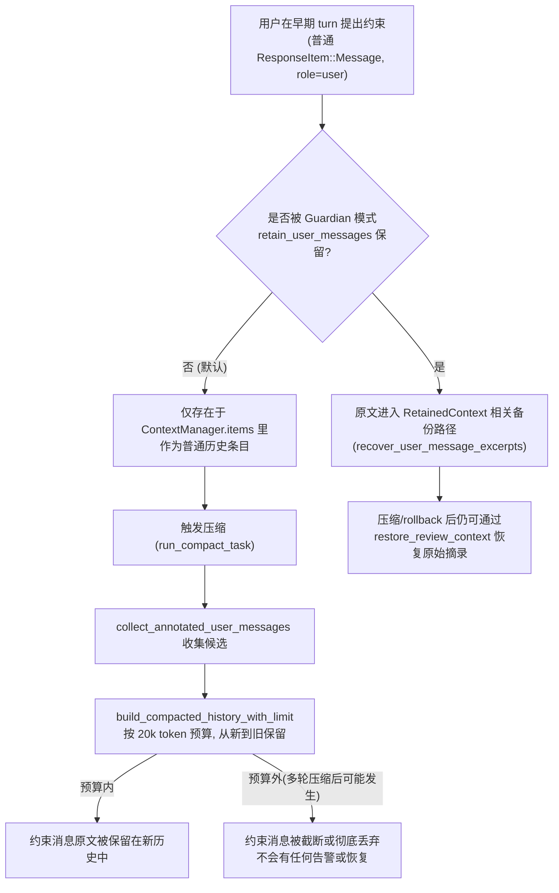

> Source: 用户粘贴的 DeepWiki openai/codex 源码问答；附件 1159bb3a-ea18-4a66-8bca-09d1a4403913/已粘贴的文本.txt（未提供问答 URL 或 commit）
> Collected: 2026-09-22
> Published: Unknown

# DeepWiki Q&A with Code Context for Repository: openai/codex
## Q1
项目是否实现滑动窗口、历史摘要、工具结果截断和按需加载？分别在哪里触发，处理什么信息，依据消息条数、token 数还是其他条件？请追踪一次处理前后的上下文变化，说明原始内容是否仍可重新读取。
### Answer
## 直接回答

是的，代码库中都能找到对应机制，但它们分布在不同模块、由不同条件触发：

| 机制 | 触发位置 | 触发条件 | 处理内容 |
|---|---|---|---|
| 滑动窗口（新建 context window） | `session/turn.rs` `should_roll_over` 判断 + `Session::start_new_context_window` | token 数（`token_limit_reached`/`take_new_context_window_request`） | 用最新 world state + 保留的开发者消息重建历史 |
| 历史摘要（compaction） | `compact.rs::run_compact_task` / `compact_remote.rs::run_remote_compact_task` | token 上限触发（`ContextLimit`）或用户手动请求 | 把旧消息压缩为一条摘要 `SUMMARY_PREFIX` |
| 工具结果截断 | `compact_remote.rs::trim_function_call_history_to_fit_context_window` 及 `TruncationPolicy`（`context_manager/history.rs`） | 估算 token 数超过 `model_context_window()` | 单条 `FunctionCallOutput`/`CustomToolCallOutput`/`ToolSearchOutput` 的内容 |
| 按需加载（分页） | TUI `history_pagination.rs::request_older_history_page` | 用户滚动请求 + 固定分页大小 `HISTORY_ITEM_PAGE_LIMIT`（消息条数） | 从 App Server 拉取历史 turn/item 分页 |

---

## 详细说明

### 1. 滑动窗口（Context Window Rollover）

在一次 turn 结束后，`run_turn` 会计算 `token_status`，如果 `token_limit_reached` 为真或有显式的“新 context window”请求，就把 `should_roll_over` 置真并调用自动压缩流程： codex:505-530 

判定依据是 **token 数**（`token_status.token_limit_reached`），不是消息条数。真正“滑动窗口”式重建由 `Session::start_new_context_window` 完成：它拿到当前 `retained_client_developer_messages`（按 `RETAINED_MESSAGE_TOKEN_BUDGET` token 预算截断），加上 world-state 快照，重新组装历史，再调用 `replace_compacted_history` 整体替换： codex:4207-4258 

### 2. 历史摘要（History Summarization / Compaction）

本地（inline）压缩在 `compact.rs` 中实现：用最近一轮的 assistant 消息生成摘要文本 `summary_text = SUMMARY_PREFIX + summary_suffix`，只保留部分用户消息（按 token 预算截断，`COMPACT_USER_MESSAGE_MAX_TOKENS`），再用 `build_compacted_history` 拼出新的历史并整体替换： codex:355-399 codex:670-760 

远程压缩版本 (`compact_remote.rs`) 逻辑类似，同样最终调用 `sess.replace_compacted_history`： codex:266-295 

触发条件：token 上限被触及（`CompactionReason::ContextLimit`，见上面 `turn.rs` 片段）或者用户手动请求压缩（`CompactionTrigger::Manual`/`CompactionReason::UserRequested`）： codex:96-112 

### 3. 工具结果截断

单独于整体压缩之外，还有一个专门针对“function-call 输出”超限的修剪函数 `trim_function_call_history_to_fit_context_window`：它从历史末尾往前遍历工具调用分组，逐个把超限的 `FunctionCallOutput`/`CustomToolCallOutput`/`ToolSearchOutput` 用截断后的内容替换，直到估算 token 数回落到 `model_context_window()` 之下，然后调用 `history.replace_annotated(items)` 写回： codex:403-459 

具体的“替换成截断版本”逻辑在 `rewritten_output_for_context_window` 里，会对输出字段调用 `truncated_output_payload`： codex:461-514 

此外，`ContextManager` 记录条目时也支持通用的 `TruncationPolicy`（如 `TruncationPolicy::Tokens`）来防止单条工具输出占满整个上下文窗口： codex:118-119 

### 4. 按需加载（On-demand Loading，仅 TUI 层面）

这与前三者不同，属于 UI 层的历史分页加载，不影响送入模型的 prompt。TUI 在用户向上滚动、需要更早的 transcript 时才发起 `ThreadItemsList` 请求，按游标(`cursor`)分页拉取，页大小固定为 `HISTORY_ITEM_PAGE_LIMIT`（条数而非 token）： codex:16-55 

拉取回的数据只是渲染进 transcript overlay，不进入模型上下文： codex:57-93 

### 一次“压缩”前后的上下文变化 & 原始内容是否可恢复

以 inline compaction 为例：

- **压缩前**：`ContextManager.items` 里有完整的历史（用户消息、assistant 消息、工具调用/输出等），可通过 `history.clone_history()` / `annotated_items()` 读取。
- **压缩时**：`run_compact_task` 生成新的 `new_history`（仅摘要 + 少量保留用户消息），调用 `sess.replace_compacted_history(...)`。
- **压缩后**：`ContextManager` 的 `items` 被整体替换，`history_version` 递增；原始完整历史条目**不再存在于内存中的 `ContextManager`**——`clone_history()` 之后返回的是新的、压缩后的历史。

不过，压缩事件本身会被写入 rollout 持久化文件，其中记录了替换前后的历史（如测试所验证的 `replacement_history_from_rollout`）： codex:689-713 

也就是说，**原始的完整历史内容并不在当前活动上下文（in-memory `ContextManager`/发送给模型的 prompt）中保留，但可以从磁盘上的 rollout 日志文件中重新读取**（前提是该 rollout 条目记录了 `replacement_history`/原始 `ResponseItem`）。对于单独的“工具结果截断”（`trim_function_call_history_to_fit_context_window`），原始完整输出同样在 `history.replace_annotated` 后从活动上下文里丢失；根据我看到的代码上下文，我没有确认这个截断动作是否也会单独写入 rollout 保留原文——如果你需要确认这一点，建议开启一个 Devin session 去完整检索 rollout 写入逻辑（`session/rollout*.rs`）来验证。

## Notes

- `compact_tests.rs`、`compact_remote_v2.rs` 等文件中也有和压缩相关的测试/实现，但和你的问题主线一致，未单独展开。 codex:401-427 
- `session/rollout_reconstruction_tests.rs` 展示了从 rollout 重建历史时如何处理 legacy 压缩条目，可作为“原始内容能否恢复”问题的进一步参考。 codex:1477-1527 
- 由于索引大小限制，`context_manager/history.rs` 中 `replace_annotated`/`record_items` 等完整实现未能全部展示；如果需要逐行确认 truncation 是否写回 rollout，建议在 Devin session 中打开完整文件核实。

Wiki pages you might want to explore:
- [Architecture Overview (openai/codex)](/wiki/openai/codex#1.3)
- [Conversation History Management (openai/codex)](/wiki/openai/codex#3.5)
### Citations
**File:** codex-rs/core/src/session/turn.rs (L505-530)
```rust
                let should_roll_over = needs_follow_up
                    && (sess.take_new_context_window_request().await || token_limit_reached);
                let allow_auto_compact_fallback = !should_roll_over && !token_limit_reached;
                super::token_budget::maybe_record(
                    sess.as_ref(),
                    turn_context.as_ref(),
                    token_status.base_window_tokens_remaining,
                    allow_auto_compact_fallback,
                )
                .await;

                // as long as compaction works well in getting us way below the token limit, we shouldn't worry about being in an infinite loop.
                if should_roll_over {
                    if let Err(err) = run_auto_compact(
                        &sess,
                        Arc::clone(&step_context),
                        /*fallback_step_context*/ None,
                        &mut client_session,
                        InitialContextInjection::BeforeLastUserMessage {
                            world_state: Arc::clone(&world_state),
                            step_context: Arc::clone(&step_context),
                        },
                        CompactionReason::ContextLimit,
                        CompactionPhase::MidTurn,
                    )
                    .await
```
**File:** codex-rs/core/src/session/mod.rs (L4207-4258)
```rust
    pub(crate) async fn start_new_context_window(
        &self,
        step_context: &StepContext,
        world_state: Arc<WorldState>,
    ) -> u64 {
        let turn_context = step_context.turn.as_ref();
        let retained_client_developer_messages =
            if self.enabled(Feature::RetainClientDeveloperMessages) {
                let history = self.clone_history().await;
                crate::compact_remote_v2::truncate_retained_messages_for_remote_compaction(
                    history
                        .annotated_items()
                        .iter()
                        .filter(|item| {
                            crate::compact_remote_v2::is_client_authored_developer_message(item)
                        })
                        .cloned()
                        .collect(),
                    crate::compact_remote_v2::RETAINED_MESSAGE_TOKEN_BUDGET,
                )
            } else {
                Vec::new()
            };
        let window = {
            let mut state = self.state.lock().await;
            state.start_new_context_window()
        };
        let (window_number, window_ids) = window;
        let context_items = self
            .build_initial_context_with_world_state(turn_context, world_state.as_ref())
            .await
            .into_iter()
            .map(ResponseItemEnvelope::new)
            .chain(retained_client_developer_messages)
            .collect();
        let turn_context_item = turn_context.to_turn_context_item();
        self.replace_compacted_history(
            context_items,
            Some(turn_context_item),
            Some(world_state),
            CompactedHistoryMetadata {
                message: String::new(),
                window_number,
                window_ids,
                compaction_response_id: None,
                compaction_model_hash: None,
            },
        )
        .await;
        self.recompute_token_usage(turn_context).await;
        window_number
    }
```
**File:** codex-rs/core/src/compact.rs (L355-399)
```rust
    let history_snapshot = sess.clone_history().await;
    let history_items = history_snapshot.annotated_items();
    let summary_suffix =
        get_last_assistant_message_from_turn(history_snapshot.raw_items()).unwrap_or_default();
    let summary_text = format!("{SUMMARY_PREFIX}\n{summary_suffix}");
    let identity = if sess.enabled(Feature::GuardianThreadContext) {
        CompactedMessageIdentity::Preserve
    } else {
        CompactedMessageIdentity::Regenerate
    };
    let user_messages = collect_annotated_user_messages(history_items, identity);

    let mut new_history = build_compacted_history(Vec::new(), &user_messages, &summary_text);
    if let Some(summary_item) = new_history.last_mut() {
        // This replacement history skips `record_conversation_items`; only the appended summary
        // belongs to this compaction turn.
        summary_item.set_turn_id_if_missing(&turn_context.sub_id);
    }
    let (window_number, window_ids) = sess.advance_auto_compact_window().await;

    let (initial_context, world_state_baseline) =
        build_compaction_initial_context(sess.as_ref(), &initial_context_injection).await;
    if !initial_context.is_empty() {
        new_history =
            insert_initial_context_before_last_real_user_or_summary(new_history, initial_context);
    }
    let reference_context_item = match initial_context_injection {
        InitialContextInjection::DoNotInject => None,
        InitialContextInjection::BeforeLastUserMessage { .. } => {
            Some(turn_context.to_turn_context_item())
        }
    };
    sess.replace_compacted_history(
        new_history,
        reference_context_item,
        world_state_baseline,
        CompactedHistoryMetadata {
            message: summary_text,
            window_number,
            window_ids,
            compaction_response_id: Some(compaction_response_id),
            compaction_model_hash: turn_context.model_info().comp_hash.clone(),
        },
    )
    .await;
```
**File:** codex-rs/core/src/compact.rs (L670-760)
```rust
pub(crate) fn build_compacted_history(
    initial_context: Vec<ResponseItemEnvelope>,
    user_messages: &[CompactedUserMessage],
    summary_text: &str,
) -> Vec<ResponseItemEnvelope> {
    build_compacted_history_with_limit(
        initial_context,
        user_messages,
        summary_text,
        COMPACT_USER_MESSAGE_MAX_TOKENS,
    )
}

fn build_compacted_history_with_limit(
    mut history: Vec<ResponseItemEnvelope>,
    user_messages: &[CompactedUserMessage],
    summary_text: &str,
    max_tokens: usize,
) -> Vec<ResponseItemEnvelope> {
    let mut selected_messages: Vec<CompactedUserMessage> = Vec::new();
    if max_tokens > 0 {
        let mut remaining = max_tokens;
        for message in user_messages.iter().rev() {
            if remaining == 0 {
                break;
            }
            let tokens = approx_token_count(&message.message);
            if tokens <= remaining {
                selected_messages.push(message.clone());
                remaining = remaining.saturating_sub(tokens);
            } else {
                let truncated =
                    truncate_text(&message.message, TruncationPolicy::Tokens(remaining));
                selected_messages.push(CompactedUserMessage {
                    id: message.id.clone(),
                    message: truncated,
                    internal_chat_message_metadata_passthrough: message
                        .internal_chat_message_metadata_passthrough
                        .clone(),
                    harness_metadata: message.harness_metadata.clone(),
                });
                break;
            }
        }
        selected_messages.reverse();
    }

    for message in &selected_messages {
        let mut item = ResponseItem::Message {
            id: message.id.clone(),
            role: "user".to_string(),
            content: vec![ContentItem::InputText {
                text: message.message.clone(),
            }],
            phase: None,
            internal_chat_message_metadata_passthrough: message
                .internal_chat_message_metadata_passthrough
                .clone(),
        };
        if message
            .internal_chat_message_metadata_passthrough
            .as_ref()
            .and_then(|metadata| metadata.content_item_kinds.as_ref())
            .is_some()
        {
            let _ = set_annotated_content(
                &mut item,
                vec![AnnotatedContent::input_text(
                    &message.message,
                    ContentItemKind("user.text".to_string()),
                )],
            );
        }
        history.push(ResponseItemEnvelope {
            item,
            metadata: message.harness_metadata.clone(),
        });
    }

    let summary_text = if summary_text.is_empty() {
        "(no summary available)".to_string()
    } else {
        summary_text.to_string()
    };

    history.push(ResponseItemEnvelope::new(ContextualUserFragment::into(
        CompactionSummary::new(summary_text),
    )));

    history
}
```
**File:** codex-rs/core/src/compact_remote.rs (L96-112)
```rust

    let compaction_metadata = CompactionTurnMetadata::new(
        CompactionTrigger::Manual,
        CompactionReason::UserRequested,
        CompactionImplementation::ResponsesCompact,
        CompactionPhase::StandaloneTurn,
    );
    run_remote_compact_task_inner(
        &sess,
        &step_context,
        /*fallback_step_context*/ None,
        /*turn_state*/ None,
        InitialContextInjection::DoNotInject,
        compaction_metadata,
    )
    .await?;
    Ok(())
```
**File:** codex-rs/core/src/compact_remote.rs (L266-295)
```rust
    let RemoteCompactAttempt {
        new_history,
        trace_input_history,
    } = attempt;
    let (new_window_number, new_window_ids) = sess.advance_auto_compact_window().await;
    let (new_history, world_state_baseline) =
        process_compacted_history(sess.as_ref(), new_history, &initial_context_injection).await;

    let reference_context_item = match initial_context_injection {
        InitialContextInjection::DoNotInject => None,
        InitialContextInjection::BeforeLastUserMessage { .. } => {
            Some(compaction_turn_context.to_turn_context_item())
        }
    };
    // Install is the semantic boundary where the compact endpoint's output becomes live
    // thread history. Keep it distinct from the later inference request so the reducer can
    // still represent repeated developer/context prefix items exactly as the model saw them.
    if let Some(trace_input_history) = trace_input_history.as_deref() {
        compaction_trace.record_installed(&CompactionCheckpointTracePayload {
            input_history: trace_input_history,
            replacement_history: &new_history,
        });
    }
    // Legacy `/responses/compact` returns provider-normalized items without a stable link to their
    // original envelopes, so it does not preserve harness metadata. Compaction-trigger/v2 does.
    let new_history = new_history
        .into_iter()
        .map(ResponseItemEnvelope::new)
        .collect();
    sess.replace_compacted_history(
```
**File:** codex-rs/core/src/compact_remote.rs (L403-459)
```rust
pub(crate) fn trim_function_call_history_to_fit_context_window(
    history: &mut ContextManager,
    turn_context: &TurnContext,
    base_instructions: &BaseInstructions,
) -> (usize, i64) {
    let Some(context_window) = turn_context.model_context_window() else {
        return (0, 0);
    };
    // Keep the unclamped total so replacing an item cannot lose an overflow hidden by i64
    // saturation in the normal history estimator.
    let base_tokens =
        i128::try_from(approx_token_count(&base_instructions.text)).unwrap_or(i128::MAX);
    let original_items = history.annotated_items();
    let mut estimated_tokens = history_item_groups(original_items.iter().map(|item| &item.item))
        .map(|group| group.estimated_token_count())
        .fold(base_tokens, i128::saturating_add);
    let initial_estimated_tokens = i64::try_from(estimated_tokens).unwrap_or(i64::MAX);
    let mut rewritten_items = Vec::new();
    let mut consumed_items: usize = 0;

    for group in history_item_groups(original_items.iter().map(|item| &item.item))
        .collect::<Vec<_>>()
        .into_iter()
        .rev()
    {
        if i64::try_from(estimated_tokens).unwrap_or(i64::MAX) <= context_window {
            break;
        }
        let group_item_count = 1 + usize::from(group.attached_notice.is_some());
        let source_index = original_items
            .len()
            .saturating_sub(consumed_items.saturating_add(group_item_count));
        let Some(rewritten_item) = original_items
            .get(source_index)
            .and_then(rewritten_output_for_context_window)
        else {
            break;
        };
        estimated_tokens = estimated_tokens
            .saturating_sub(group.estimated_token_count())
            .saturating_add(i128::from(estimate_item_token_count(&rewritten_item.item)));
        consumed_items += group_item_count;
        rewritten_items.push(rewritten_item);
    }

    let rewritten_outputs = rewritten_items.len();
    if rewritten_outputs > 0 {
        let retained_len = original_items.len() - consumed_items;
        let mut items = original_items[..retained_len].to_vec();
        items.extend(rewritten_items.into_iter().rev());
        history.replace_annotated(items);
    }

    let final_estimated_tokens = i64::try_from(estimated_tokens).unwrap_or(i64::MAX);
    let estimated_deleted_tokens = initial_estimated_tokens.saturating_sub(final_estimated_tokens);
    (rewritten_outputs, estimated_deleted_tokens)
}
```
**File:** codex-rs/core/src/compact_remote.rs (L461-514)
```rust
fn rewritten_output_for_context_window(
    envelope: &ResponseItemEnvelope,
) -> Option<ResponseItemEnvelope> {
    let item = match &envelope.item {
        ResponseItem::FunctionCallOutput {
            id,
            call_id,
            name,
            namespace,
            output,
            internal_chat_message_metadata_passthrough: metadata,
        } => ResponseItem::FunctionCallOutput {
            id: id.clone(),
            call_id: call_id.clone(),
            name: name.clone(),
            namespace: namespace.clone(),
            output: truncated_output_payload(output),
            internal_chat_message_metadata_passthrough: metadata.clone(),
        },
        ResponseItem::CustomToolCallOutput {
            id,
            call_id,
            name,
            output,
            internal_chat_message_metadata_passthrough: metadata,
        } => ResponseItem::CustomToolCallOutput {
            id: id.clone(),
            call_id: call_id.clone(),
            name: name.clone(),
            output: truncated_output_payload(output),
            internal_chat_message_metadata_passthrough: metadata.clone(),
        },
        ResponseItem::ToolSearchOutput {
            id,
            call_id,
            status,
            execution,
            internal_chat_message_metadata_passthrough: metadata,
            ..
        } => ResponseItem::ToolSearchOutput {
            id: id.clone(),
            call_id: call_id.clone(),
            status: status.clone(),
            execution: execution.clone(),
            tools: Vec::new(),
            internal_chat_message_metadata_passthrough: metadata.clone(),
        },
        _ => return None,
    };
    Some(ResponseItemEnvelope {
        item,
        metadata: envelope.metadata.clone(),
    })
}
```
**File:** codex-rs/tui/src/app/history_pagination.rs (L16-55)
```rust
impl App {
    /// Start one bounded page request shared by scrollback refill and the transcript overlay.
    pub(crate) fn request_older_history_page(
        &self,
        app_server: &mut AppServerSession,
        thread_id: ThreadId,
    ) -> bool {
        let Some(cursor) = app_server.begin_older_history_page(thread_id) else {
            return false;
        };
        tracing::debug!(
            %thread_id,
            %cursor,
            overlay = self.overlay.is_some(),
            "loading older transcript history page"
        );
        let request_id = app_server.next_request_id();
        let request_handle = app_server.request_handle();
        let app_event_tx = self.app_event_tx.clone();
        tokio::spawn(async move {
            let result = request_handle
                .request_typed::<ThreadItemsListResponse>(ClientRequest::ThreadItemsList {
                    request_id,
                    params: thread_items_page_params(
                        thread_id,
                        /*turn_id*/ None,
                        Some(cursor.clone()),
                        HISTORY_ITEM_PAGE_LIMIT,
                    ),
                })
                .await
                .map_err(|err| err.to_string());
            app_event_tx.send(AppEvent::OlderThreadHistoryLoaded {
                thread_id,
                cursor,
                result,
            });
        });
        true
    }
```
**File:** codex-rs/tui/src/app/history_pagination.rs (L57-93)
```rust
    pub(super) async fn handle_older_history_page(
        &mut self,
        tui: &mut tui::Tui,
        app_server: &mut AppServerSession,
        thread_id: ThreadId,
        cursor: &str,
        result: Result<ThreadItemsListResponse, String>,
    ) -> Result<()> {
        if self.chat_widget.thread_id() != Some(thread_id) {
            app_server.cancel_older_history_page(thread_id);
            return Ok(());
        }
        let page = result.map_err(|err| color_eyre::eyre::eyre!(err))?;
        let Some(store) = self
            .thread_event_channels
            .get(&thread_id)
            .map(|channel| Arc::clone(&channel.store))
        else {
            app_server.cancel_older_history_page(thread_id);
            return Ok(());
        };
        let (cwd, mut turns) = {
            let store = store.lock().await;
            (
                store
                    .session
                    .as_ref()
                    .map_or_else(|| self.config.cwd.clone(), |session| session.cwd.clone()),
                store.turns.clone(),
            )
        };
        let mut items = app_server
            .apply_older_history_page(thread_id, cursor, page, &mut turns)
            .await?;
        let mut hidden_item_ids = HashSet::new();
        let mut review_mode = false;
        for (index, turn) in turns.iter().enumerate() {
```
**File:** codex-rs/core/tests/suite/compact.rs (L689-713)
```rust
    // Shut down Codex to flush rollout entries before inspecting the file.
    codex.submit(Op::Shutdown).await?;
    wait_for_event(&codex, |ev| matches!(ev, EventMsg::ShutdownComplete)).await;

    let replacement_history = replacement_history_from_rollout(&rollout_path)
        .expect("local compaction should persist replacement history");
    let compacted_user_message = replacement_history
        .iter()
        .find(|item| item["content"][0]["text"] == "hello world second fragment")
        .expect("persisted replacement history should contain the compacted user message");
    assert_eq!(
        json!({
            "type": compacted_user_message["type"],
            "role": compacted_user_message["role"],
            "content": compacted_user_message["content"],
            "content_item_kinds": compacted_user_message
                ["internal_chat_message_metadata_passthrough"]["content_item_kinds"],
        }),
        json!({
            "type": "message",
            "role": "user",
            "content": [{"type": "input_text", "text": "hello world second fragment"}],
            "content_item_kinds": ["user.text"],
        }),
    );
```
**File:** codex-rs/core/src/compact_tests.rs (L401-427)
```rust
#[tokio::test]
async fn process_compacted_history_reinjects_full_initial_context() {
    let compacted_history = vec![ResponseItem::Message {
        id: None,
        role: "user".to_string(),
        content: vec![ContentItem::InputText {
            text: "summary".to_string(),
        }],
        phase: None,
        internal_chat_message_metadata_passthrough: None,
    }];
    let (refreshed, mut expected) = process_compacted_history_with_test_session(
        compacted_history,
        /*previous_turn_settings*/ None,
    )
    .await;
    expected.push(ResponseItem::Message {
        id: None,
        role: "user".to_string(),
        content: vec![ContentItem::InputText {
            text: "summary".to_string(),
        }],
        phase: None,
        internal_chat_message_metadata_passthrough: None,
    });
    assert_eq!(refreshed, expected);
}
```
**File:** codex-rs/core/src/session/rollout_reconstruction_tests.rs (L1477-1527)
```rust
#[tokio::test]
async fn reconstruct_history_legacy_compaction_without_replacement_history_does_not_inject_current_initial_context()
 {
    let (session, turn_context) = make_session_and_context().await;
    let answer = codex_history::RetainedContextEvent::VerifiedAnswer {
        answer: codex_history::VerifiedAnswer {
            turn_id: "legacy-turn".to_owned(),
            call_id: "ask-1".to_owned(),
            questions: vec![codex_history::VerifiedQuestionAnswer {
                question: "Upload?".to_owned(),
                answer: "Only privately.".to_owned(),
            }],
        },
        acceptance_order: None,
    };
    let mut retained = codex_history::RetainedContext::default();
    retained.mark_user_messages_incomplete();
    retained.record(&answer);
    let rollout_items = vec![
        RolloutItem::ResponseItem(user_message("before compact").into()),
        RolloutItem::ResponseItem(assistant_message("assistant reply").into()),
        RolloutItem::RetainedContext(answer),
        RolloutItem::Compacted(CompactedItem {
            message: "legacy summary".to_string(),
            replacement_history: None,
            retained_context: None,
            guardian_history: None,
            mcp_resource_origins: None,
            window_number: None,
            first_window_id: None,
            previous_window_id: None,
            window_id: None,
            compaction_response_id: None,
            latest_token_usage_record: None,
        }),
    ];

    let reconstructed = session
        .reconstruct_history_from_rollout(&turn_context, &rollout_items)
        .await;

    assert_eq!(
        reconstructed.history,
        annotated(vec![
            user_message("before compact"),
            ContextualUserFragment::into(CompactionSummary::new("legacy summary")),
        ])
    );
    assert!(reconstructed.reference_context_item.is_none());
    assert_eq!(reconstructed.retained_context, retained);
}
```
## Q2
项目是否实现滑动窗口、历史摘要、工具结果截断和按需加载？分别在哪里触发，处理什么信息，依据消息条数、token 数还是其他条件？请追踪一次处理前后的上下文变化，说明原始内容是否仍可重新读取。
## 上下文管理机制：滑动窗口、历史摘要、工具结果截断与按需加载
梳理 codex-rs 中四类上下文管理机制的触发条件、处理内容与前后状态变化，涉及 core（session/compact/context_manager）与 tui 两个模块。快速入口：滑动窗口触发 [1b]，本地摘要重建 [2c]，远程摘要落地 [3d]，写入时工具输出截断 [4c]，压缩前工具输出重写 [5c]，TUI 按需分页 [6a]，rollout 落盘保留原文 [7b]。
### 1. 滑动窗口：token 超限时新建 Context Window
core/session 模块：一次 turn 结束后按 token 数判断是否需要整体重建上下文（而非逐条裁剪）。
### 1a. 判断是否需要滚动新窗口 (`turn.rs:505`)
依据 token_limit_reached（token 数）或显式请求，而非消息条数
```text
let should_roll_over = needs_follow_up && (sess.take_new_context_window_request().await || token_limit_reached);
```
### 1b. 触发点 (`turn.rs:517`)
满足条件后进入自动压缩/滑动窗口分支
```text
if should_roll_over {
```
### 1c. 开启新 context window (`mod.rs:4207`)
Session 方法：整体重建当前活跃上下文
```text
pub(crate) async fn start_new_context_window(
```
### 1d. 分配新窗口编号 (`mod.rs:4222`)
window_number/window_ids 用于标记本次滑动窗口边界
```text
let window = { let mut state = self.state.lock().await; state.start_new_context_window() };
```
### 1e. 拼接保留的开发者消息 (`mod.rs:4231`)
按 RETAINED_MESSAGE_TOKEN_BUDGET token 预算截断后保留
```text
.chain(retained_client_developer_messages)
```
### 1f. 整体替换历史 (`mod.rs:4241`)
旧的完整历史从内存 ContextManager 中被替换掉
```text
self.replace_compacted_history(
```
### 2. 历史摘要（本地 inline compaction）
core/compact.rs：token 超限或用户手动请求时，将旧消息压缩为一条摘要文本，仅保留少量用户消息。
### 2a. 读取当前完整历史 (`compact.rs:355`)
压缩前的原始历史快照
```text
let history_snapshot = sess.clone_history().await;
```
### 2b. 生成摘要文本 (`compact.rs:359`)
用最近一轮 assistant 回复作为摘要正文
```text
let summary_text = format!("{SUMMARY_PREFIX}\n{summary_suffix}");
```
### 2c. 构建压缩后历史 (`compact.rs:366`)
仅含保留用户消息 + 摘要，取代原始完整历史
```text
let mut new_history = build_compacted_history(Vec::new(), &user_messages, &summary_text);
```
### 2d. 按 token 预算逆序筛选用户消息 (`compact.rs:682`)
COMPACT_USER_MESSAGE_MAX_TOKENS 限制保留多少用户消息（token 数条件）
```text
let tokens = approx_token_count(&message.message);
```
### 2e. 追加摘要条目 (`compact.rs:744`)
摘要作为一条特殊的 ContextualUserFragment 写入新历史尾部
```text
history.push(ResponseItemEnvelope::new(ContextualUserFragment::into(CompactionSummary::new(summary_text))));
```
### 2f. 落地替换 (`compact.rs:385`)
压缩后历史整体替换活跃 ContextManager 内容
```text
sess.replace_compacted_history(
```
### 3. 历史摘要（远程 compaction）落地与保留
core/compact_remote.rs：远程压缩结果安装为新历史，同时记录压缩前后的 trace 以供审计。
### 3a. 用户手动触发压缩 (`compact_remote.rs:96`)
与本地压缩不同触发路径：手动请求而非仅 token 超限
```text
let compaction_metadata = CompactionTurnMetadata::new(CompactionTrigger::Manual, CompactionReason::UserRequested, ...);
```
### 3b. 处理远程返回的新历史 (`compact_remote.rs:271`)
结合 world_state 基线重新组装
```text
let (new_history, world_state_baseline) = process_compacted_history(sess.as_ref(), new_history, &initial_context_injection).await;
```
### 3c. 记录压缩前后对照 (`compact_remote.rs:281`)
trace 中同时保存原始输入历史与替换后历史
```text
compaction_trace.record_installed(&CompactionCheckpointTracePayload { input_history: trace_input_history, replacement_history: &new_history });
```
### 3d. 整体替换活跃历史 (`compact_remote.rs:295`)
内存中的 ContextManager 不再持有压缩前的完整原始条目
```text
sess.replace_compacted_history(
```
### 3e. 从 rollout 恢复替换历史 (`compact.rs:693`)
验证压缩事件写入 rollout 文件，原始/替换历史可从磁盘重新读取
```text
let replacement_history = replacement_history_from_rollout(&rollout_path)...
```
### 4. 工具结果截断（写入历史时，实时发生）
core/context_manager/history.rs：任何 FunctionCallOutput/CustomToolCallOutput 写入历史前按 token 策略截断，防止单条工具输出占满窗口。
### 4a. 记录历史条目入口 (`history.rs:313`)
每次写入新的 ResponseItem 都会走这里
```text
pub(crate) fn record_items<I>(&mut self, items: I, policy: TruncationPolicy)
```
### 4b. 带元数据的实际写入逻辑 (`history.rs:335`)
遍历每个条目并处理
```text
fn record_items_with_metadata<'a, I, T>(&mut self, items: I, policy: TruncationPolicy)
```
### 4c. 命中工具输出类型 (`history.rs:350`)
只有工具调用输出会被截断，其他消息类型不受影响
```text
if let ResponseItem::FunctionCallOutput { output, .. } | ResponseItem::CustomToolCallOutput { output, .. } = &mut processed.item
```
### 4d. 确定截断 token 预算 (`history.rs:356`)
按 fallback_token_limit_override 或默认 policy*1.2 计算 token 上限
```text
.unwrap_or(policy * 1.2);
```
### 4e. 执行截断 (`history.rs:358`)
超出预算的原始输出内容被就地截断，之后不再保留完整版本
```text
truncate_function_output_payload(output, policy, estimate_audio_token_count);
```
### 5. 工具结果截断（远程压缩前的批量重写）
core/compact_remote.rs：在触发远程压缩之前，为了让 prompt 塞进 context window，对历史尾部的工具输出分组做批量截断替换。
### 5a. 远程压缩前调用截断 (`compact_remote_v2_attempt.rs:42`)
在构造 compaction 请求前先做一次针对性截断
```text
trim_function_call_history_to_fit_context_window(&mut history, turn_context.as_ref(), &base_instructions);
```
### 5b. 估算当前总 token 数 (`compact_remote.rs:415`)
依据 model_context_window() 判断是否超限，token 数为唯一条件
```text
let mut estimated_tokens = history_item_groups(...).fold(base_tokens, i128::saturating_add);
```
### 5c. 从末尾逆序逐组重写超限输出 (`compact_remote.rs:439`)
一直重写直到估算 token 数回落到 context_window 之下
```text
let Some(rewritten_item) = original_items.get(source_index).and_then(rewritten_output_for_context_window)
```
### 5d. 生成截断后的输出 (`compact_remote.rs:469`)
FunctionCallOutput/CustomToolCallOutput/ToolSearchOutput 的 output 字段被替换为截断版本
```text
output: truncated_output_payload(output),
```
### 5e. 写回历史 (`compact_remote.rs:452`)
原始未截断的工具输出内容在内存历史中被覆盖，不再可直接访问
```text
history.replace_annotated(items);
```
### 6. 按需加载（TUI 历史分页，不影响模型上下文）
tui/src/app/history_pagination.rs：用户向上滚动 transcript 时才按固定条数分页拉取更早的历史，仅用于展示。
### 6a. 用户触发更早历史请求 (`history_pagination.rs:18`)
滚动到顶部时调用，条件是用户交互而非 token/消息计数
```text
pub(crate) fn request_older_history_page(
```
### 6b. 获取分页游标 (`history_pagination.rs:22`)
基于 cursor 而非 offset，避免消息条数计算误差
```text
let Some(cursor) = app_server.begin_older_history_page(thread_id) else { return false; };
```
### 6c. 发起分页请求 (`history_pagination.rs:34`)
HISTORY_ITEM_PAGE_LIMIT 按固定条数分页，而非 token 数
```text
ClientRequest::ThreadItemsList { request_id, params: thread_items_page_params(thread_id, None, Some(cursor.clone()), HISTORY_ITEM_PAGE_LIMIT) }
```
### 6d. 处理返回的历史分页 (`history_pagination.rs:57`)
结果只用于渲染 transcript overlay/scrollback
```text
pub(super) async fn handle_older_history_page(
```
### 6e. 拼接到本地缓存 (`history_pagination.rs:87`)
加载的历史合并进 turns，供 UI 展示，不进入发给模型的 prompt
```text
let mut items = app_server.apply_older_history_page(thread_id, cursor, page, &mut turns).await?;
```
### 7. rollout 落盘：压缩/滑动窗口后原始内容的可恢复性
core/session 与 core/compact 测试：验证压缩发生后，原始与替换历史是否被写入 rollout 持久化文件，从而可重新读取。
### 7a. 压缩替换携带元数据 (`compact.rs:385`)
CompactedHistoryMetadata 记录 window_number/window_ids/compaction_response_id，用于回溯
```text
sess.replace_compacted_history(new_history, reference_context_item, world_state_baseline, CompactedHistoryMetadata { ... })
```
### 7b. 刷新 rollout 落盘 (`compact.rs:689`)
关闭会话触发 rollout 条目写入磁盘
```text
codex.submit(Op::Shutdown).await?;
```
### 7c. 从 rollout 文件读回替换历史 (`compact.rs:693`)
证明压缩后的历史被持久化，可在活跃内存历史被替换后重新读取
```text
let replacement_history = replacement_history_from_rollout(&rollout_path).expect("local compaction should persist replacement history");
```
### 7d. 旧版 rollout 无 replacement_history 的边界情况 (`rollout_reconstruction_tests.rs:1479`)
说明并非所有历史版本都保存了可恢复的原始/替换历史（legacy 压缩条目缺失时无法还原）
```text
async fn reconstruct_history_legacy_compaction_without_replacement_history_does_not_inject_current_initial_context()
```
### 7e. 从 rollout 条目重建内存历史 (`rollout_reconstruction_tests.rs:1516`)
会话重启/恢复时，依赖 rollout 中记录的压缩摘要与（若存在）replacement_history 重建活跃上下文
```text
let reconstructed = session.reconstruct_history_from_rollout(&turn_context, &rollout_items).await;
```
## Q3
历史裁剪以单条消息、一轮交互还是完整工具调用链为单位？如何保证 tool call 与对应 result 的关联完整，包括一次多个工具调用、失败重试和结果延迟返回？请展示相关数据结构、关联标识及测试；如果没有保护机制，指出可能出现问题的路径。
### Answer
## 直接回答

历史裁剪存在**多种粒度**，不是单一标准：

- **滑动窗口/压缩**：以"用户轮次"（user turn）为单位整体替换 codex:562-581 
- **工具输出预压缩裁剪**（`trim_function_call_history_to_fit_context_window`）：以**工具调用分组**（`history_item_groups`，call+output 成对）为单位，从尾部逆序整组重写 codex:424-451 
- **单条消息级截断**（`record_items`/`TruncationPolicy`）：只截断单条 `FunctionCallOutput`/`CustomToolCallOutput` 的内容，不涉及配对关系

工具调用与结果的关联完整性由 `ContextManager::normalize_history` 强制保证不变量（call 必须有 output，output 必须有对应 call），并由 `ExecutedToolCallRecorder` 用 `call_id` + `CellId`（Code Mode 场景下多个嵌套调用）显式关联，支持乱序/延迟返回与重试去重。

---

## 详细说明

### 1. 裁剪粒度

**(a) 用户轮次级（Turn-level）**：`drop_last_n_user_turns` 按 `user_message_positions` 定位边界，一次性丢弃从某个用户消息开始的整个尾部历史（包括其间所有工具调用/输出/assistant 回复）： codex:546-581 

**(b) 工具调用分组级（Tool-call-group level）**：`trim_function_call_history_to_fit_context_window` 用 `history_item_groups` 把历史按逻辑分组（call+output 视为一组），从历史**末尾往前**逆序遍历，命中超限的分组就整组重写（替换为截断版本），而不是拆散调用和结果： codex:403-452 

重写函数 `rewritten_output_for_context_window` 只处理 `FunctionCallOutput`/`CustomToolCallOutput`/`ToolSearchOutput` 三种"输出"类型，保留 `call_id` 不变，只替换 `output` 内容——这保证了裁剪后调用和结果的配对关系（同一个 `call_id`）仍然成立： codex:461-514 

**(c) 单条消息级**：`ContextManager` 写入历史时的 `TruncationPolicy` 只截断单条工具输出的文本内容，不改变条目边界。

### 2. 工具调用/结果关联完整性保护机制

#### 数据结构与关联标识

`ContextManager::normalize_history` 是核心不变量保护点，注释明确列出三条规则： codex:732-750 

- **`normalize::ensure_call_outputs_present`**：为缺失 output 的 call 自动补一个 output（debug 模式下会 panic，防止静默产生孤儿 call）
- **`normalize::remove_orphan_outputs`**：删除没有对应 call 的 output（除非是"外部命名工具事件"）

对应测试验证了这个不变量在 debug 下的强制性： codex:2223-2259 

#### 一次多个工具调用 / Code Mode 嵌套调用

在 Code Mode（`exec`/`wait` 工具、V8 隔离执行脚本内并发调用其他工具）场景下，`ExecutedToolCallRecorder` 用两级标识关联：

- **`CellId`**：标识一次 `exec` 执行单元（脚本运行的"细胞"）
- **`call_id`**：标识单个嵌套工具调用

`record_tool_call` 按 `ToolCallSource::Direct` 或 `ToolCallSource::CodeMode { cell_id, .. }` 分流记录： codex:104-182 

结果关联通过 `record_tool_result_sources`（用 `call_id` 找到对应 pending call，写回 `ToolResultSources`），支持"迟到"的结果（`retained_calls` 里按 `runtime_cell_id` + `call_index_by_id` 反查旧记录）： codex:235-272 

`attach_pending_to_prompt` 是把记录的执行结果重新挂载回 `ResponseItem`（`FunctionCallOutput`/`CustomToolCallOutput`/`ToolSearchOutput`）的关键函数：它按 `(discriminant, call_id)` 做 key 匹配，处理 retry_cache（重试后的旧快照）与 retained_calls（跨压缩保留的记录）的覆盖优先级： codex:274-402 

#### 失败重试

测试 `tool_call_completeness_survives_waits_without_changing_deltas` 验证了多次 `wait` 调用（同一个 cell 多轮交互）时，之前记录的调用结果不会因为后续 wait 而改变，且"相同调用是不同的提交"（"Identical calls are distinct submissions")，靠 `nested-{index}` 唯一 `call_id` 区分： codex:280-375 

#### 结果延迟返回 + 压缩交互

`request_truncation_prevents_completion_after_compaction` 和 `source_shedding_preserves_completion_after_compaction` 两个测试专门验证：当参数因为过大被截断、或来源信息因体积超限被"shedding"（丢弃）时，`tool_calls_complete` 标记会相应地设为 `None`（不完整）或保持 `Some(true)`（完整），防止把不完整的调用链错误标记为"完整"发给模型： codex:412-546 

`cell_correlation_uses_originating_exec_across_runtime_restarts` 验证即使运行时重启（`originating_call_id` 变化），`cell_id` 关联仍能通过 `runtime_cell_id` 正确追溯到原始的 `exec` 调用： codex:377-410 

### 3. 无保护机制时可能出现的问题路径

如果没有上述机制，理论上的风险路径：

1. **孤儿调用/输出**：如果压缩或裁剪时只删除了 `FunctionCall` 而未删除对应 `FunctionCallOutput`（或反之），发给模型的历史会出现悬空引用——`normalize::ensure_call_outputs_present`/`remove_orphan_outputs` 正是为此设计的兜底。
2. **多工具调用乱序合并**：如果没有 `call_id`/`CellId` 二级标识，Code Mode 里并发的多个嵌套工具调用结果可能互相覆盖或错配——`record_nested_tool_call` + `pending_calls` 按 `call_id` 索引避免了这个问题。
3. **压缩后延迟结果丢失关联**：如果压缩把某个 `output_cell_id` 对应的 cell 从 `state.cells` 中提前移除，而结果还没到达，`record_tool_result_sources` 的回退查找（`retained_calls` 按 `runtime_cell_id` 反查）就是防止这种"迟到结果找不到家"的情况；如果这段逻辑不存在，迟到的 `ToolResultSources` 就会被静默丢弃（函数返回 `false`，不 panic，但结果确实丢失）。

## Notes

- 由于索引限制，`context_manager/normalize.rs` 具体实现细节（`ensure_call_outputs_present`/`remove_orphan_outputs`）未直接展示；如需逐行核实，建议开启 Devin session 查看该文件全文。
- `rollout-trace` 里的 `tool_call_links_model_call_and_followup_output_items` 测试展示了另一套独立的、用于审计追踪（trace）目的的调用-输出关联机制（`ToolCallStarted`/`ToolCallEnded`），与上文 `ExecutedToolCallRecorder` 是不同系统，仅供参考，不要混淆。 codex:1177-1272 

Wiki pages you might want to explore:
- [Conversation History Management (openai/codex)](/wiki/openai/codex#3.5)
- [Code Mode and JavaScript REPL (openai/codex)](/wiki/openai/codex#5.8)
### Citations
**File:** codex-rs/core/src/context_manager/history.rs (L546-581)
```rust
    /// Drop the last `num_turns` instruction turns from this history.
    ///
    /// Instruction turns are history messages that should behave like a new prompt boundary:
    /// ordinary user messages and structured assistant inter-agent instructions.
    ///
    /// This mirrors thread-rollback semantics:
    /// - `num_turns == 0` is a no-op
    /// - if there are no user turns, this is a no-op
    /// - if `num_turns` exceeds the number of user turns, all user turns are dropped while
    ///   preserving any items that occurred before the first user message.
    ///
    /// If rollback trims a pre-turn developer message that mixes contextual fragments with
    /// persistent developer text from `build_initial_context`, this also clears
    /// `reference_context_item`. The surviving history no longer contains the full bundle that
    /// established the prior baseline, so future turns must fall back to full reinjection instead
    /// of diffing against stale state.
    pub(crate) fn drop_last_n_user_turns(&mut self, num_turns: u32) {
        if num_turns == 0 {
            return;
        }

        let snapshot = self.items.clone();
        let user_positions = user_message_positions(&snapshot);
        let Some(&first_instruction_turn_idx) = user_positions.first() else {
            let retained_context = Arc::clone(&self.retained_context);
            self.replace_annotated(Arc::unwrap_or_clone(snapshot));
            self.retained_context = retained_context;
            return;
        };

        let n_from_end = usize::try_from(num_turns).unwrap_or(usize::MAX);
        let mut cut_idx = if n_from_end >= user_positions.len() {
            first_instruction_turn_idx
        } else {
            user_positions[user_positions.len() - n_from_end]
        };
```
**File:** codex-rs/core/src/context_manager/history.rs (L732-750)
```rust
    /// This function enforces a couple of invariants on the in-memory history:
    /// 1. every call (function/custom) has a corresponding output entry
    /// 2. every output has a corresponding call entry or names an external tool event
    /// 3. unsupported image and audio content is stripped from messages and tool outputs
    fn normalize_history(&mut self, input_modalities: &[InputModality]) {
        let items = Arc::make_mut(&mut self.items);

        // all function/tool calls must have a corresponding output
        normalize::ensure_call_outputs_present(items);

        // Paired outputs must have a corresponding call; named external outputs stand alone.
        normalize::remove_orphan_outputs(items);

        // strip images when model does not support them
        normalize::strip_images_when_unsupported(input_modalities, items);

        // strip audio when model does not support it
        normalize::strip_audio_when_unsupported(input_modalities, items);
    }
```
**File:** codex-rs/core/src/context_manager/history_tests.rs (L2223-2259)
```rust
#[cfg(debug_assertions)]
#[test]
#[should_panic]
fn normalize_adds_missing_output_for_custom_tool_call_panics_in_debug() {
    let items = vec![ResponseItem::CustomToolCall {
        id: None,
        status: None,
        call_id: "tool-x".to_string(),
        name: "custom".to_string(),
        namespace: None,
        input: "{}".to_string(),
        internal_chat_message_metadata_passthrough: None,
    }];
    let mut h = create_history_with_items(items);
    h.normalize_history(&default_input_modalities());
}

#[cfg(debug_assertions)]
#[test]
#[should_panic]
fn normalize_adds_missing_output_for_local_shell_call_with_id_panics_in_debug() {
    let items = vec![ResponseItem::LocalShellCall {
        id: None,
        call_id: Some("shell-1".to_string()),
        status: LocalShellStatus::Completed,
        action: LocalShellAction::Exec(LocalShellExecAction {
            command: vec!["echo".to_string(), "hi".to_string()],
            timeout_ms: None,
            working_directory: None,
            env: None,
            user: None,
        }),
        internal_chat_message_metadata_passthrough: None,
    }];
    let mut h = create_history_with_items(items);
    h.normalize_history(&default_input_modalities());
}
```
**File:** codex-rs/core/src/tools/executed_tool_calls.rs (L104-182)
```rust
impl ExecutedToolCallRecorder {
    pub(crate) fn record_tool_call(
        &self,
        call: &ToolCall,
        source: &ToolCallSource,
        tool_mode: ToolMode,
    ) {
        if matches!(source, ToolCallSource::Direct)
            && matches!(tool_mode, ToolMode::CodeMode | ToolMode::CodeModeOnly)
            && call.tool_name.is_default_namespace()
            && matches!(
                (call.tool_name.name.as_str(), &call.payload),
                (
                    crate::tools::code_mode::PUBLIC_TOOL_NAME,
                    ToolPayload::Custom { .. }
                ) | (
                    crate::tools::code_mode::WAIT_TOOL_NAME,
                    ToolPayload::Function { .. }
                )
            )
        {
            return;
        }

        let original_bytes = match &call.payload {
            ToolPayload::Function { arguments } => arguments.len(),
            ToolPayload::Custom { input } => serialized_json_bytes(input).unwrap_or(usize::MAX),
            ToolPayload::ToolSearch { arguments } => {
                serialized_json_bytes(arguments).unwrap_or(usize::MAX)
            }
        };
        let name = codex_tools::code_mode_name_for_tool_name(&call.tool_name);
        let recorded_call = if original_bytes > MAX_EXECUTED_TOOL_CALL_ARGUMENT_BYTES {
            ExecutedToolCall::truncated(name, original_bytes, MAX_EXECUTED_TOOL_CALL_ARGUMENT_BYTES)
        } else {
            let arguments = match &call.payload {
                ToolPayload::Function { arguments } => serde_json::from_str(arguments)
                    .unwrap_or_else(|_| JsonValue::String(arguments.clone())),
                ToolPayload::Custom { input } => JsonValue::String(input.clone()),
                ToolPayload::ToolSearch { arguments } => {
                    serde_json::to_value(arguments).unwrap_or_default()
                }
            };
            ExecutedToolCall::new(name, arguments)
        };
        match source {
            ToolCallSource::Direct | ToolCallSource::DirectPlaintextMessage => {
                let mut state = self
                    .state
                    .lock()
                    .unwrap_or_else(std::sync::PoisonError::into_inner);
                if state.direct_calls.len() < MAX_PENDING_EXECUTED_TOOL_CALLS {
                    state
                        .direct_calls
                        .entry(call.call_id.clone())
                        .or_insert(recorded_call);
                } else if state.direct_calls.len() == MAX_PENDING_EXECUTED_TOOL_CALLS
                    && !state.direct_calls.contains_key(&call.call_id)
                {
                    state.direct_calls.insert(
                        call.call_id.clone(),
                        ExecutedToolCall::truncated(
                            recorded_call.name,
                            original_bytes,
                            /*max_bytes*/ 0,
                        ),
                    );
                }
            }
            ToolCallSource::CodeMode { cell_id, .. } => {
                self.record_nested_tool_call(
                    CellId::new(cell_id.clone()),
                    call.call_id.clone(),
                    recorded_call,
                    original_bytes,
                );
            }
        }
    }
```
**File:** codex-rs/core/src/tools/executed_tool_calls.rs (L235-272)
```rust
    pub(crate) fn record_tool_result_sources(
        &self,
        source: &ToolCallSource,
        call_id: &str,
        result_sources: codex_protocol::models::ToolResultSources,
    ) -> bool {
        let mut state = self
            .state
            .lock()
            .unwrap_or_else(std::sync::PoisonError::into_inner);
        let call = match source {
            ToolCallSource::Direct | ToolCallSource::DirectPlaintextMessage => {
                state.direct_calls.get_mut(call_id)
            }
            ToolCallSource::CodeMode { cell_id, .. } => state
                .cells
                .get_mut(&CellId::new(cell_id.clone()))
                .and_then(|cell| cell.pending_calls.get_mut(call_id)),
        };
        if let Some(call) = call {
            return call.set_tool_result_sources(result_sources);
        }
        let ToolCallSource::CodeMode { cell_id, .. } = source else {
            return false;
        };
        let Some((retained, index)) = state.retained_calls.values_mut().find_map(|retained| {
            if retained.runtime_cell_id.as_ref()?.as_str() != cell_id.as_str() {
                return None;
            }
            let index = *retained.call_index_by_id.get(call_id)?;
            Some((retained, index))
        }) else {
            return false;
        };
        // Older retry copies must not overwrite this output's accepted result metadata.
        retained.sources_updated = true;
        retained.calls[index].set_tool_result_sources(result_sources)
    }
```
**File:** codex-rs/core/src/tools/executed_tool_calls.rs (L274-402)
```rust
    pub(crate) fn attach_pending_to_prompt(
        &self,
        items: &mut [ResponseItem],
        retry_cache: &mut HashMap<
            (std::mem::Discriminant<ResponseItem>, String),
            Vec<ExecutedToolCall>,
        >,
    ) -> bool {
        let mut state = self
            .state
            .lock()
            .unwrap_or_else(std::sync::PoisonError::into_inner);
        if state.direct_calls.is_empty()
            && state.output_cells.is_empty()
            && state.retained_calls.is_empty()
            && retry_cache.is_empty()
        {
            return false;
        }

        // Updated records supersede older retry snapshots.
        retry_cache.retain(|key, _| {
            !state
                .retained_calls
                .get(key)
                .is_some_and(|retained| retained.sources_updated)
        });
        let mut pending_retry_outputs = retry_cache.keys().cloned().collect::<HashSet<_>>();
        let mut pending_retained_outputs =
            state.retained_calls.keys().cloned().collect::<HashSet<_>>();
        let mut attached = false;
        let mut retained_bytes = 0_usize;
        for item in items.iter_mut().rev() {
            if state.direct_calls.is_empty()
                && state.output_cells.is_empty()
                && pending_retry_outputs.is_empty()
                && pending_retained_outputs.is_empty()
            {
                break;
            }
            let call_id = match &*item {
                ResponseItem::FunctionCallOutput {
                    call_id: Some(call_id),
                    ..
                }
                | ResponseItem::CustomToolCallOutput { call_id, .. }
                | ResponseItem::ToolSearchOutput {
                    call_id: Some(call_id),
                    ..
                } => call_id,
                _ => continue,
            };
            let key = (std::mem::discriminant(&*item), call_id.clone());
            let retained = state.retained_calls.get(&key);
            let mut complete = retained.is_some_and(|retained| retained.complete);
            let mut cell_id = retained.and_then(|retained| retained.cell_id.clone());
            let mut runtime_cell_id =
                retained.and_then(|retained| retained.runtime_cell_id.clone());
            let calls = if let Some(cached) = retry_cache.get(&key) {
                if !pending_retry_outputs.remove(&key) {
                    continue;
                }
                pending_retained_outputs.remove(&key);
                cached.clone()
            } else if let Some(retained) = retained {
                if !pending_retained_outputs.remove(&key) {
                    continue;
                }
                retained.calls.clone()
            } else {
                let mut calls = state
                    .direct_calls
                    .remove(call_id)
                    .into_iter()
                    .collect::<Vec<_>>();
                let mut call_index_by_id = HashMap::new();
                if let Some(output_cell_id) = state.output_cells.remove(call_id)
                    && let Some(cell) = state.cells.get_mut(&output_cell_id)
                {
                    cell_id = cell.originating_call_id.clone();
                    runtime_cell_id = Some(output_cell_id.clone());
                    let pending_calls = cell.pending_calls.len();
                    for (call_id, call) in cell.pending_calls.drain(..) {
                        if matches!(call.arguments(), ExecutedToolCallArguments::Raw(_)) {
                            call_index_by_id.insert(call_id, calls.len());
                        }
                        calls.push(call);
                    }
                    cell.pending_full_argument_bytes = 0;
                    complete = cell.completion == CellCompletion::Complete;
                    if matches!(
                        cell.completion,
                        CellCompletion::Complete | CellCompletion::Incomplete
                    ) {
                        state.cells.remove(&output_cell_id);
                    }
                    state.pending_nested_calls =
                        state.pending_nested_calls.saturating_sub(pending_calls);
                    state
                        .output_cells
                        .retain(|_, registered_cell_id| registered_cell_id != &output_cell_id);
                }
                if calls.is_empty() && !complete {
                    continue;
                }
                retry_cache.insert(key.clone(), calls.clone());
                state.retained_calls.insert(
                    key,
                    RetainedToolCalls {
                        calls: calls.clone(),
                        complete,
                        cell_id: cell_id.clone(),
                        runtime_cell_id,
                        call_index_by_id,
                        sources_updated: false,
                    },
                );
                calls
            };
            item.append_executed_tool_calls(calls);
            if let Some(cell_id) = cell_id {
                item.set_tool_call_cell_id(&cell_id);
            }
            if complete {
                item.mark_tool_calls_complete();
            }
            retained_bytes = retained_bytes.saturating_add(executed_tool_call_metadata_bytes(item));
            attached = true;
        }
```
**File:** codex-rs/core/src/tools/executed_tool_calls_tests.rs (L280-375)
```rust
#[test]
fn tool_call_completeness_survives_waits_without_changing_deltas() {
    let sources = ToolResultSources::new(vec![codex_protocol::models::ToolResultSource {
        r#type: "test_channel".to_string(),
        id: "CLATE".to_string(),
    }]);
    for (truncated, sources) in [
        (false, sources.clone()),
        (true, sources),
        (false, ToolResultSources::parse_failed()),
        (true, ToolResultSources::parse_failed()),
    ] {
        let recorder = ExecutedToolCallRecorder::default();
        let cell_id = CellId::new("multi-wait".to_string());
        recorder.start_cell(&cell_id, "exec");
        let mut history = Vec::new();
        let mut expected = Vec::new();
        let mut retry_cache = HashMap::new();
        for (index, call_id) in ["exec", "wait-1", "wait-2", "wait-3"]
            .into_iter()
            .enumerate()
        {
            recorder.register_cell(&cell_id, call_id);
            let mut expected_output = output(call_id);
            history.push(expected_output.clone());
            if index < 2 {
                // Identical calls are distinct submissions; truncation stays sticky across waits.
                let original_bytes = if truncated && index == 1 { 9_000 } else { 2 };
                let call = if original_bytes > MAX_EXECUTED_TOOL_CALL_ARGUMENT_BYTES {
                    ExecutedToolCall::truncated(
                        "nested_tool".to_string(),
                        original_bytes,
                        MAX_EXECUTED_TOOL_CALL_ARGUMENT_BYTES,
                    )
                } else {
                    ExecutedToolCall::new("nested_tool".to_string(), json!({}))
                };
                recorder.record_nested_tool_call(
                    cell_id.clone(),
                    format!("nested-{index}"),
                    call.clone(),
                    original_bytes,
                );
                let mut call = call;
                if index == 1 {
                    let source = |cell_id: &str| ToolCallSource::CodeMode {
                        cell_id: cell_id.to_string(),
                        runtime_tool_call_id: "runtime-call".to_string(),
                    };
                    assert!(!recorder.record_tool_result_sources(
                        &source("other-cell"),
                        "nested-0",
                        ToolResultSources::new(Vec::new()),
                    ));
                    let source = source(cell_id.as_str());
                    assert!(recorder.record_tool_result_sources(
                        &source,
                        "nested-0",
                        sources.clone(),
                    ));
                    let mut delayed_call =
                        ExecutedToolCall::new("nested_tool".to_string(), json!({}));
                    assert!(delayed_call.set_tool_result_sources(sources.clone()));
                    let mut delayed_output = output("exec");
                    delayed_output.append_executed_tool_calls(vec![delayed_call]);
                    delayed_output.set_tool_call_cell_id("exec");
                    expected[0] = delayed_output;
                    assert!(recorder.record_tool_result_sources(
                        &source,
                        "nested-1",
                        ToolResultSources::new(Vec::new())
                    ));
                    assert!(call.set_tool_result_sources(ToolResultSources::new(Vec::new())));
                }
                expected_output.append_executed_tool_calls(vec![call]);
            } else if index == 3 {
                recorder.finish_cell_recording(&cell_id);
            }
            if index < 2 || index == 3 && !truncated {
                expected_output.set_tool_call_cell_id("exec");
            }
            if index == 3 && !truncated {
                expected_output.mark_tool_calls_complete();
            }
            expected.push(expected_output);
            for _ in 0..2 {
                let mut prompt = history.clone();
                assert!(recorder.attach_pending_to_prompt(&mut prompt, &mut retry_cache));
                assert_eq!(prompt, expected);
            }
        }
        let state = recorder.state.lock().unwrap();
        assert!(state.cells.is_empty());
        assert_eq!(state.pending_nested_calls, 0);
    }
}
```
**File:** codex-rs/core/src/tools/executed_tool_calls_tests.rs (L377-410)
```rust
#[test]
fn cell_correlation_uses_originating_exec_across_runtime_restarts() {
    let runtime_cell_id = CellId::new("1".to_string());

    for originating_call_id in ["first-exec", "resumed-exec"] {
        let recorder = ExecutedToolCallRecorder::default();
        recorder.start_cell(&runtime_cell_id, originating_call_id);
        recorder.record_nested_tool_call(
            runtime_cell_id.clone(),
            "nested-call".to_string(),
            ExecutedToolCall::new("nested_tool".to_string(), json!({})),
            /*original_bytes*/ 2,
        );

        let mut initial = [output(originating_call_id)];
        recorder.attach_pending_to_prompt(&mut initial, &mut HashMap::new());
        assert_eq!(
            initial[0]
                .executed_tool_call_metadata()
                .and_then(|metadata| metadata.cell_id.as_deref()),
            Some(originating_call_id),
        );

        recorder.register_cell(&runtime_cell_id, "wait");
        recorder.finish_cell_recording(&runtime_cell_id);
        let mut final_output = [output("wait")];
        recorder.attach_pending_to_prompt(&mut final_output, &mut HashMap::new());
        let metadata = final_output[0]
            .executed_tool_call_metadata()
            .expect("completed cell must have metadata");
        assert_eq!(metadata.cell_id.as_deref(), Some(originating_call_id));
        assert_eq!(metadata.tool_calls_complete, Some(true));
    }
}
```
**File:** codex-rs/core/src/tools/executed_tool_calls_tests.rs (L412-546)
```rust
#[test]
fn request_truncation_prevents_completion_after_compaction() {
    let recorder = ExecutedToolCallRecorder::default();
    let cell_id = CellId::new("compacted-cell".to_string());
    recorder.start_cell(&cell_id, "exec");

    let arguments = json!({
        "payload": "x".repeat(MAX_EXECUTED_TOOL_CALL_ARGUMENT_BYTES - r#"{"payload":""}"#.len()),
    });
    for index in 0..4 {
        recorder.record_nested_tool_call(
            cell_id.clone(),
            format!("nested-{index}"),
            ExecutedToolCall::new("nested_tool".to_string(), arguments.clone()),
            MAX_EXECUTED_TOOL_CALL_ARGUMENT_BYTES,
        );
    }

    let mut initial = [output("exec")];
    assert!(recorder.attach_pending_to_prompt(&mut initial, &mut HashMap::new()));
    assert!(
        initial[0]
            .executed_tool_call_metadata()
            .and_then(|metadata| metadata.executed_tool_calls.as_ref())
            .is_some_and(|calls| calls.iter().any(|call| matches!(
                call.arguments(),
                ExecutedToolCallArguments::Truncated { .. }
            )))
    );
    let source = ToolCallSource::CodeMode {
        cell_id: cell_id.as_str().to_string(),
        runtime_tool_call_id: "runtime-call".to_string(),
    };
    for index in 0..4 {
        assert!(!recorder.record_tool_result_sources(
            &source,
            &format!("nested-{index}"),
            ToolResultSources::new(Vec::new()),
        ));
    }

    recorder.attach_pending_to_prompt(&mut [], &mut HashMap::new());
    recorder.register_cell(&cell_id, "wait");
    recorder.finish_cell_recording(&cell_id);
    let mut final_output = [output("wait")];
    recorder.attach_pending_to_prompt(&mut final_output, &mut HashMap::new());
    assert_eq!(
        final_output[0]
            .executed_tool_call_metadata()
            .and_then(|metadata| metadata.tool_calls_complete),
        None,
    );
}

#[test]
fn source_shedding_preserves_completion_after_compaction() {
    let recorder = ExecutedToolCallRecorder::default();
    let cell_id = CellId::new("compacted-cell".to_string());
    recorder.start_cell(&cell_id, "exec");

    let argument_bytes = MAX_EXECUTED_TOOL_CALL_ARGUMENT_BYTES - 256;
    let arguments = json!({
        "payload": "x".repeat(argument_bytes - r#"{"payload":""}"#.len()),
    });
    for index in 0..4 {
        recorder.record_nested_tool_call(
            cell_id.clone(),
            format!("nested-{index}"),
            ExecutedToolCall::new("nested_tool".to_string(), arguments.clone()),
            argument_bytes,
        );
    }
    let source = ToolCallSource::CodeMode {
        cell_id: cell_id.as_str().to_string(),
        runtime_tool_call_id: "runtime-call".to_string(),
    };
    let mut retry_cache = HashMap::new();
    recorder.attach_pending_to_prompt(&mut [output("exec")], &mut retry_cache);
    assert!(
        recorder.record_tool_result_sources(
            &source,
            "nested-0",
            ToolResultSources::new(
                (0..32)
                    .map(|index| codex_protocol::models::ToolResultSource {
                        r#type: "test_channel".to_string(),
                        id: format!("C{index:063}"),
                    })
                    .collect()
            ),
        )
    );

    assert!(recorder.record_tool_result_sources(
        &source,
        "nested-1",
        ToolResultSources::parse_failed()
    ));
    let mut initial = [output("exec")];
    assert!(recorder.attach_pending_to_prompt(&mut initial, &mut retry_cache));
    let calls = initial[0]
        .executed_tool_call_metadata()
        .and_then(|metadata| metadata.executed_tool_calls.as_ref())
        .expect("source shedding must preserve recorded calls");
    assert_eq!(
        calls,
        &vec![ExecutedToolCall::new("nested_tool".to_string(), arguments); 4]
    );
    assert!(!recorder.record_tool_result_sources(
        &source,
        "nested-0",
        ToolResultSources::new(Vec::new())
    ));
    let mut retry = [output("exec")];
    assert!(recorder.attach_pending_to_prompt(&mut retry, &mut retry_cache));
    assert_eq!(retry, initial);

    recorder.attach_pending_to_prompt(&mut [], &mut retry_cache);
    assert!(retry_cache.is_empty());
    assert!(!recorder.record_tool_result_sources(
        &source,
        "nested-1",
        ToolResultSources::new(Vec::new())
    ));
    recorder.register_cell(&cell_id, "wait");
    recorder.finish_cell_recording(&cell_id);
    let mut final_output = [output("wait")];
    recorder.attach_pending_to_prompt(&mut final_output, &mut HashMap::new());
    assert_eq!(
        final_output[0]
            .executed_tool_call_metadata()
            .and_then(|metadata| metadata.tool_calls_complete),
        Some(true),
    );
}
```
**File:** codex-rs/rollout-trace/src/reducer/conversation_tests.rs (L1177-1272)
```rust
#[test]
fn tool_call_links_model_call_and_followup_output_items() -> anyhow::Result<()> {
    let temp = TempDir::new()?;
    let writer = create_started_writer(&temp)?;
    start_turn(&writer, "turn-1")?;

    let request = writer.write_json_payload(
        RawPayloadKind::InferenceRequest,
        &json!({
            "input": [message("user", "run tests")]
        }),
    )?;
    append_inference_start(&writer, "inference-1", "turn-1", request)?;

    let response = writer.write_json_payload(
        RawPayloadKind::InferenceResponse,
        &json!({
            "response_id": "resp-1",
            "output_items": [{
                "type": "function_call",
                "name": "exec_command",
                "arguments": "{\"cmd\":\"cargo test\"}",
                "call_id": "call-1"
            }]
        }),
    )?;
    append_inference_completion(&writer, "inference-1", "resp-1", response)?;
    writer.append_with_context(
        trace_context("turn-1"),
        RawTraceEventPayload::ToolCallStarted {
            tool_call_id: "tool-1".to_string(),
            model_visible_call_id: Some("call-1".to_string()),
            code_mode_runtime_tool_id: None,
            requester: crate::raw_event::RawToolCallRequester::Model,
            kind: ToolCallKind::ExecCommand,
            summary: ToolCallSummary::Generic {
                label: "exec_command".to_string(),
                input_preview: Some("cargo test".to_string()),
                output_preview: None,
            },
            invocation_payload: None,
        },
    )?;
    writer.append_with_context(
        trace_context("turn-1"),
        RawTraceEventPayload::ToolCallEnded {
            tool_call_id: "tool-1".to_string(),
            status: ExecutionStatus::Completed,
            result_payload: None,
        },
    )?;

    start_turn(&writer, "turn-2")?;
    let followup = writer.write_json_payload(
        RawPayloadKind::InferenceRequest,
        &json!({
            "previous_response_id": "resp-1",
            "input": [{
                "type": "function_call_output",
                "call_id": "call-1",
                "output": "tests passed"
            }]
        }),
    )?;
    append_inference_start(&writer, "inference-2", "turn-2", followup)?;

    let rollout = replay_bundle(temp.path())?;
    let first_inference = &rollout.inference_calls["inference-1"];
    let second_inference = &rollout.inference_calls["inference-2"];
    let tool_call = &rollout.tool_calls["tool-1"];
    let output_item_id = second_inference
        .request_item_ids
        .last()
        .expect("follow-up output item");

    assert_eq!(
        first_inference.tool_call_ids_started_by_response,
        vec!["tool-1".to_string()],
    );
    assert_eq!(
        tool_call.model_visible_call_item_ids,
        first_inference.response_item_ids,
    );
    assert_eq!(
        tool_call.model_visible_output_item_ids,
        vec![output_item_id.clone()],
    );
    assert_eq!(
        rollout.conversation_items[output_item_id].produced_by,
        vec![ProducerRef::Tool {
            tool_call_id: "tool-1".to_string(),
        }],
    );

    Ok(())
}
```
## Q4
用户早期提出、后续仍然有效的约束存在哪里？例如“只读不修改”“最终输出中文”“预算不超过某个值”。历史被裁剪或摘要后，这些要求如何保留？摘要是否有固定字段、原文引用、校验或恢复机制？请追踪一条约束从提出到多轮压缩后的生命周期
### Answer
## 直接回答

代码库中**没有一个专门为"约束/规则"设计的独立数据结构**（不存在带有校验或语义识别的 "constraint" 字段）。用户提出的早期约束（如"只读""用中文回复""预算限制"）能否在压缩后存活，取决于它以什么形式被记录，主要有以下几条相关但不完全等价的机制：

1. **作为普通用户消息** → 压缩时按 token 预算被保留或截断（`build_compacted_history_with_limit`），**不保证**一定存活，纯粹是"最近优先"的启发式规则，不识别语义重要性。
2. **作为开发者消息**（如系统/权限指令）→ 若开启 `Feature::RetainClientDeveloperMessages`，会在滑动窗口重建时被单独收集并按 token 预算保留。
3. **作为 `RetainedContext`（Guardian 模式）** → 结构化事件（目前只见到 `VerifiedAnswer` 这一种），有专门的持久化/恢复路径，但这是为"已验证的用户问答"设计的，不是通用约束系统。

也就是说，**没有证据表明存在针对"只读""输出语言""预算上限"这类约束的专门追踪、校验或摘要固定字段**；它们的存活完全取决于是否被判定为"最近的用户消息"或"开发者指令"而被规则性保留。

---

## 详细说明

### 1. 普通用户消息路径（最可能的载体，但保护较弱）

压缩时，`collect_annotated_user_messages` 从历史中筛出所有用户消息候选，交给 `build_compacted_history`： codex:355-372 

真正的筛选逻辑在 `build_compacted_history_with_limit` 里：它是**从最新到最旧逆序遍历**，按 `COMPACT_USER_MESSAGE_MAX_TOKENS`（20,000 token）预算保留，一旦超预算就截断或直接丢弃更早的消息： codex:683-716 

这意味着：如果"只读不修改"这条约束是在对话**很早期**提出的一条普通用户消息，且后续对话产生了大量消息，多轮压缩后这条早期消息完全可能被挤出 20,000 token 的窗口而彻底丢失——**没有任何语义重要性识别或校验机制会阻止它被丢弃**。

### 2. 开发者消息路径（`RetainClientDeveloperMessages`）

如果约束是以"开发者消息"形式注入（例如系统层面的固定指令），在滑动窗口重建（`start_new_context_window`）时会被专门筛选、按独立的 token 预算保留： codex:4207-4222 

这里用的是 `is_client_authored_developer_message` 过滤器 + `RETAINED_MESSAGE_TOKEN_BUDGET` 截断（`truncate_retained_messages_for_remote_compaction`），逻辑上与普通用户消息路径类似——**同样是按 token 预算的启发式保留，不是精确的约束追踪**。

### 3. `RetainedContext` / Guardian 模式（结构化但范围有限）

`ContextManager` 里有 `retained_context: Arc<RetainedContext>` 字段，独立于普通历史存在，能跨压缩存活： codex:66-90 

它的恢复逻辑在 `restore_review_context` 中，压缩/rollback 后可以从 checkpoint 或原始历史中"抢救"被裁剪的用户消息摘录（`recover_user_message_excerpts`），甚至处理"legacy 兼容格式"下超大指令被清空后从备份恢复的情况： codex:224-262 

但从测试上看，目前记录的 `RetainedContextEvent` 变体只有 `VerifiedAnswer`（用户对 `request_user_input` 问题的确认回答）： codex:270-301 

也就是说，这套"跨压缩持久化"的机制是**为特定的问答确认场景设计的，不是通用约束系统**——"只读""中文输出"这类隐式全局约束不会自动落入这个通道，除非它恰好是以 `request_user_input` 问答形式被记录的。

同一测试文件还展示了"超大原始指令"跨压缩/恢复时的完整性验证（`retained_instructions_keep_identity_across_compaction_and_resume`），这是离你的问题最接近的场景——早期一条指令消息，历经多轮压缩，仍要求内容一致可追溯： codex:220-248 

但仔细看，这个测试针对的是"指令类用户消息"（`INITIAL`/`STEER` 常量）在 Guardian 模式（`Feature::GuardianThreadContext`）下的**原样保留**，依赖 `retain_user_messages` 开关： codex:195-197 

### 4. 摘要本身没有固定的"约束"字段

`build_compacted_history_with_limit` 生成的摘要文本 `summary_text` 只是一段自由格式文本（`SUMMARY_PREFIX` + 最后一条 assistant 回复），没有结构化字段区分"约束/事实/进度"： codex:749-760 

也就是说，**摘要不会自动提炼、校验或恢复"用户早期约束"**；它依赖 assistant 在生成回复时是否主动把这类约束复述进最后一条消息里（`summary_suffix = get_last_assistant_message_from_turn(...)`），这完全是模型行为层面的"希望"，不是代码层面的保证。

### 5. 一条约束的生命周期追踪（尽力还原）

综合上面机制，一条如"只读不修改"的早期约束在系统中的实际生命周期大致是：



**结论**：只有在 Guardian 模式 (`GuardianThreadContext`) 下并且约束以用户消息形式且触发了 `retain_user_messages` 的路径，才有工程化保证能在多轮压缩后恢复原文；默认路径下，约束是否存活取决于压缩发生时它是否还落在最近 20,000 token 窗口内，没有专门的语义识别、校验或摘要提炼机制。

## Notes

- 我没有在检索到的代码中找到任何显式命名为 "constraint"、"rule" 或类似的约束追踪结构；如果这类机制存在于未被索引到的文件中（例如某些 prompt 模板或 system prompt 构建逻辑），建议开启 Devin session 全文搜索 `constraint`/`must not`/`永久指令` 等关键词以彻底确认。
- `RetainedContext`/Guardian 相关代码分布在 `codex-rs/history` crate 与 `context_manager/history.rs` 之间，本回答仅基于检索到的部分做了推断，未展示 `codex-rs/history/src/retained_context.rs` 全文，如需精确核实 `RetainedContextEvent` 的完整枚举变体，建议进一步查看该文件。

Wiki pages you might want to explore:
- [Conversation History Management (openai/codex)](/wiki/openai/codex#3.5)
- [Rollout Persistence and Replay (openai/codex)](/wiki/openai/codex#3.5.2)
### Citations
**File:** codex-rs/core/src/compact.rs (L355-372)
```rust
    let history_snapshot = sess.clone_history().await;
    let history_items = history_snapshot.annotated_items();
    let summary_suffix =
        get_last_assistant_message_from_turn(history_snapshot.raw_items()).unwrap_or_default();
    let summary_text = format!("{SUMMARY_PREFIX}\n{summary_suffix}");
    let identity = if sess.enabled(Feature::GuardianThreadContext) {
        CompactedMessageIdentity::Preserve
    } else {
        CompactedMessageIdentity::Regenerate
    };
    let user_messages = collect_annotated_user_messages(history_items, identity);

    let mut new_history = build_compacted_history(Vec::new(), &user_messages, &summary_text);
    if let Some(summary_item) = new_history.last_mut() {
        // This replacement history skips `record_conversation_items`; only the appended summary
        // belongs to this compaction turn.
        summary_item.set_turn_id_if_missing(&turn_context.sub_id);
    }
```
**File:** codex-rs/core/src/compact.rs (L683-716)
```rust
fn build_compacted_history_with_limit(
    mut history: Vec<ResponseItemEnvelope>,
    user_messages: &[CompactedUserMessage],
    summary_text: &str,
    max_tokens: usize,
) -> Vec<ResponseItemEnvelope> {
    let mut selected_messages: Vec<CompactedUserMessage> = Vec::new();
    if max_tokens > 0 {
        let mut remaining = max_tokens;
        for message in user_messages.iter().rev() {
            if remaining == 0 {
                break;
            }
            let tokens = approx_token_count(&message.message);
            if tokens <= remaining {
                selected_messages.push(message.clone());
                remaining = remaining.saturating_sub(tokens);
            } else {
                let truncated =
                    truncate_text(&message.message, TruncationPolicy::Tokens(remaining));
                selected_messages.push(CompactedUserMessage {
                    id: message.id.clone(),
                    message: truncated,
                    internal_chat_message_metadata_passthrough: message
                        .internal_chat_message_metadata_passthrough
                        .clone(),
                    harness_metadata: message.harness_metadata.clone(),
                });
                break;
            }
        }
        selected_messages.reverse();
    }

```
**File:** codex-rs/core/src/compact.rs (L749-760)
```rust
    let summary_text = if summary_text.is_empty() {
        "(no summary available)".to_string()
    } else {
        summary_text.to_string()
    };

    history.push(ResponseItemEnvelope::new(ContextualUserFragment::into(
        CompactionSummary::new(summary_text),
    )));

    history
}
```
**File:** codex-rs/core/src/session/mod.rs (L4207-4222)
```rust
    pub(crate) async fn start_new_context_window(
        &self,
        step_context: &StepContext,
        world_state: Arc<WorldState>,
    ) -> u64 {
        let turn_context = step_context.turn.as_ref();
        let retained_client_developer_messages =
            if self.enabled(Feature::RetainClientDeveloperMessages) {
                let history = self.clone_history().await;
                crate::compact_remote_v2::truncate_retained_messages_for_remote_compaction(
                    history
                        .annotated_items()
                        .iter()
                        .filter(|item| {
                            crate::compact_remote_v2::is_client_authored_developer_message(item)
                        })
```
**File:** codex-rs/core/src/context_manager/history.rs (L66-90)
```rust
    /// Legacy-only history, started at first compaction. Thread-owned mode reads parent context.
    review_history: Option<TranscriptHistory>,
    /// Host facts independent of the model window; snapshots share immutable state.
    retained_context: Arc<RetainedContext>,
    /// Live and replay instruction capture are enabled together by the session feature flag.
    retain_user_messages: bool,
    /// Bumped whenever history is rewritten, such as compaction or rollback.
    history_version: u64,
    /// Monotonic user-input/reset revision, independent of compaction's history generation.
    user_message_revision: u64,
    token_info: Option<TokenUsageInfo>,
    /// Reference context snapshot used for diffing and producing model-visible
    /// settings update items.
    ///
    /// This is the baseline for the next regular model turn, and may already
    /// match the current turn after context updates are persisted.
    ///
    /// When this is `None`, settings diffing treats the next turn as having no
    /// baseline and emits a full reinjection of context state. Rollback may
    /// also clear this when it trims a mixed initial-context developer bundle
    /// whose non-diff fragments no longer exist in the surviving history.
    reference_context_item: Option<TurnContextItem>,
    /// World state most recently appended to model-visible history.
    world_state_baseline: Option<WorldStateSnapshot>,
}
```
**File:** codex-rs/core/src/context_manager/history.rs (L195-197)
```rust
    pub(crate) fn enable_user_message_retention(&mut self) {
        self.retain_user_messages = true;
    }
```
**File:** codex-rs/core/src/context_manager/history.rs (L224-262)
```rust
    pub(crate) fn restore_review_context(
        &mut self,
        retained_context: Option<&RetainedContext>,
        checkpoint: Option<&GuardianHistoryCheckpoint>,
    ) {
        self.restore_retained_context(retained_context);
        if self.retain_user_messages {
            // Older retained checkpoints cleared oversized instructions. Recover their
            // bounded root excerpts before discarding the legacy source transcript.
            let items = &self.items;
            Arc::make_mut(&mut self.retained_context).recover_user_message_excerpts(|id| {
                // Prefer the backup over a compacted copy that retains the original ID.
                let original = checkpoint
                    .into_iter()
                    .flat_map(|checkpoint| &checkpoint.0)
                    .chain(items.iter().map(|envelope| &envelope.item))
                    .find(|item| item.id().is_some_and(|item_id| item_id.as_str() == id));
                let Some(TurnItem::UserMessage(original)) = original.and_then(parse_turn_item)
                else {
                    return None;
                };
                Some(
                    guardian_truncate_text(&original.message(), GUARDIAN_MAX_ROOT_MESSAGE_TOKENS).0,
                )
            });
            self.review_history = None;
            return;
        }
        let generation = self
            .review_history
            .as_ref()
            .map_or(self.history_version, TranscriptHistory::generation)
            .saturating_add(1);
        self.review_history = checkpoint.map(|checkpoint| {
            let mut history = TranscriptHistory::new(generation);
            history.reset(checkpoint.0.iter());
            history
        });
    }
```
**File:** codex-rs/core/tests/suite/guardian_retained_context.rs (L220-248)
```rust
#[test_case(ThreadHistoryMode::Legacy, true, InstructionSize::Normal; "enabled legacy rollback")]
#[test_case(ThreadHistoryMode::Paginated, true, InstructionSize::Normal; "enabled paginated resume")]
#[test_case(ThreadHistoryMode::Legacy, false, InstructionSize::Normal; "disabled legacy rollback")]
#[test_case(ThreadHistoryMode::Paginated, false, InstructionSize::Normal; "disabled paginated resume")]
#[test_case(ThreadHistoryMode::Legacy, true, InstructionSize::Oversized; "oversized instruction rollback")]
#[test_case(ThreadHistoryMode::Paginated, true, InstructionSize::Oversized; "oversized instruction resume")]
#[tokio::test(flavor = "multi_thread", worker_threads = 2)]
async fn retained_instructions_keep_identity_across_compaction_and_resume(
    history_mode: ThreadHistoryMode,
    thread_context_enabled: bool,
    instruction_size: InstructionSize,
) -> Result<()> {
    skip_if_no_network!(Ok(()));
    const INITIAL: &str = "Never publish publicly.";
    const STEER: &str = "Also inspect the README.";
    let initial = match instruction_size {
        InstructionSize::Normal => INITIAL.to_owned(),
        InstructionSize::Oversized => format!(
            "{INITIAL}\n{}\nNever upload logs.",
            "Project detail. ".repeat(2_000)
        ),
    };
    // Paginated history supports checkpoint resume, but not the full-history read
    // used by ThreadRollback. Exercise rollback on its supported legacy path.
    let rollback_counts: &[usize] = match history_mode {
        ThreadHistoryMode::Legacy => &[1, 0],
        ThreadHistoryMode::Paginated => &[],
    };
    let server = start_mock_server().await;
```
**File:** codex-rs/core/tests/suite/guardian_retained_context.rs (L270-301)
```rust
    let questions = [
        ("before-steer", "Publish?", "Only privately."),
        ("after-steer", "Publish the README?", "Do not publish it."),
    ];
    let mut responses = questions
        .iter()
        .map(|(call_id, question, _)| {
            sse(vec![
                ev_function_call(
                    call_id,
                    "request_user_input",
                    &json!({"questions": [{
                        "id": "publish", "header": "Publish", "question": question,
                        "options": [
                            {"label": "Yes", "description": "Publish privately."},
                            {"label": "No", "description": "Keep local."}
                        ]
                    }]})
                    .to_string(),
                ),
                ev_completed(call_id),
            ])
        })
        .collect::<Vec<_>>();
    responses.push(sse(vec![ev_completed("done")]));
    responses.extend((0..=rollback_counts.len()).map(|index| {
        sse(vec![
            ev_assistant_message(&format!("summary-{index}"), "Compacted inspection context."),
            ev_completed(&format!("compact-{index}")),
        ])
    }));
    let response_mock = mount_sse_sequence(&server, responses).await;
```
## Q5
请查找上下文相关的日志、追踪、评测或测试。项目是否评估无关检索结果、重复工具输出、过期信息和矛盾指令对回答的影响？如果没有，请基于现有测试入口提出一个最小对照实验：在相同任务下分别保留、移除或替换某段上下文，比较任务成功率和约束遵守情况。请将已有实现与建议实验分开。
### Answer
## 直接回答

现有代码库中**没有**专门评估"无关检索结果""重复工具输出""过期信息""矛盾指令"对回答质量影响的日志/追踪/评测体系。已发现的相关测试都是聚焦于**上下文裁剪机制本身是否正确工作**（token 预算是否遵守、call/output 是否配对、约束是否保留），而不是**裁剪后下游任务成功率/回答质量**的影响评估。

- `guardian-context`/`guardian-v2` 的 transcript 测试验证的是"预算耗尽时保留哪些条目"，属于机制单测，非效果评测 codex:363-408 
- `guardian_v2_history_tests.rs` 里有更接近"内容是否存活"的断言（如 `RESTRICTION`/`EVIDENCE` 关键字检查），但仍是白盒结构断言，不是任务成功率/端到端评测 codex:605-652 

下面分两部分：**已有实现**（现状）与**建议的最小对照实验**（新提案）。

---

## 一、已有实现（现状盘点）

### 1. 上下文组装/裁剪的正确性测试（非效果评测）

`TranscriptConfig::build_context` 相关测试验证的是"预算不够时保留哪些 entry"的规则本身，例如"最近的工具证据优先于旧的 assistant 消息"： codex:363-399 

以及"拒绝写入的消息不能挤占已保留的工具条目"： codex:835-888 

`codex-rs/guardian-context/src/transcript_tests.rs` 中类似的截断测试，验证 `message_tokens`/`tool_tokens` 预算下的截断行为，同样是白盒机制验证： codex:286-359 

### 2. 约束/证据是否存活的结构断言

`guardian_v2_history_tests.rs` 里有针对"约束（`RESTRICTION`）"和"工具证据（`EVIDENCE`）"是否出现在压缩后请求里的断言，这是离你问题最近的现有测试，但它检查的是**字符串是否包含在 prompt 里**，不衡量模型是否因此答对/答错： codex:605-652 

### 3. 压缩/裁剪触发与内容正确性测试

`compact_remote.rs` 的测试套件（如 `remote_compact_trims_function_call_history_to_fit_context_window`）验证裁剪后哪些 call/output 被保留或重写，属于机制正确性，非效果评测： codex:2405-2445 

**结论**：现有测试都回答"裁剪逻辑是否按预期工作"，**没有**任何测试或日志系统去衡量"裁剪/摘要/重复/过期信息如何影响最终任务成功率或指令遵守率"。也没有发现"无关检索结果""矛盾指令"场景的专门处理或评测（这两个概念在检索到的代码中未出现）。

---

## 二、建议的最小对照实验（新提案，非现有实现）

可以复用现有测试基础设施（`TestCodexHarness`、`mount_sse_sequence`、`wait_for_event`、`compact_mock`）搭建一个最小 A/B/C 对照实验，而不需要新造框架：

### 实验设计

| 分组 | 上下文处理 | 实现方式 |
|---|---|---|
| A（基线/保留） | 完整历史，不裁剪 | 正常 `start_or_steer_turn` 多轮对话，不触发 `Op::Compact` |
| B（移除） | 删除某条约束/证据消息 | 用 `drop_last_n_user_turns` 或构造不含该消息的 `rollout_items` 后走 `reconstruct_history_from_rollout` |
| C（替换） | 用矛盾/过期信息替换原消息 | 手动注入一条新 `UserInput::Text`，内容与早期约束冲突，再触发同一任务 |

### 具体接入点

1. **任务与 mock 响应固定**：复用 `mount_sse_sequence` 挂载相同的模型响应序列，确保三组面对相同的"模型侧脚本"，只改变上下文侧的输入,如 `compact.rs` 中 `summarize_context_three_requests_and_instructions` 的搭建方式（构造 sse1/sse2/sse3 并检查最终请求内容）： codex:508-556 

2. **诱发裁剪/压缩**：用 `codex.submit(Op::Compact)` 主动触发压缩（如已有测试 `remote_compact_trims_function_call_history_to_fit_context_window` 里 `codex.submit(Op::Compact).await?`），分别在压缩前/后注入约束、证据或矛盾指令，对比压缩前后 `compact_request` 中是否还包含约束关键字： codex:2463-2480 

3. **度量口径**：
   - **约束遵守率**：断言最终 assistant 回复/工具调用参数是否违反早期约束（比如"只读"约束下是否出现写操作 `FunctionCall`）——可以复用 `compact_request.has_function_call(...)` 这类断言机制作为检测脚手架： codex:2596-2600 

   - **任务成功率**：如果任务本身有明确结束标志（如 assistant 输出关键字、特定工具调用出现），复用 `wait_for_event(&codex, |ev| matches!(ev, EventMsg::TurnComplete(_)))` 收集结束状态，并检查输出文本是否满足预期 codex:558-580 

4. **重复工具输出场景**：可以在 mock 响应里人为重复同一个 `call_id` 的 `FunctionCallOutput`（在测试里注入两次相同内容的工具结果），观察 `normalize::remove_orphan_outputs`/`ensure_call_outputs_present` 是否有去重逻辑介入（目前看没有针对"内容重复"的去重，只有针对"配对缺失"的补齐/清理） codex:732-750 ，可作为你实验中的一个自然对照组（因为代码不主动去重，重复工具输出会原样进入 prompt，可以直接测量它是否稀释了模型对约束的注意力）。

5. **过期信息场景**：结合 `world_state_baseline`/`reference_context_item` 机制，构造"世界状态已变化但历史里仍是旧快照"的场景（如 cwd 变了但历史里还保留旧 cwd 消息），检验 `ContextManager` 是否有主动失效标记（从检索结果看，`reference_context_item` 仅用于 diff 生成，没有针对"内容陈旧但仍在窗口内"的显式失效/告警机制） codex:66-90 。

### 实验产出

对比 A/B/C 三组在相同任务下的：
- 约束违反次数（如做了"只读"约束下的写操作）
- 任务是否达成预期最终状态（`TurnComplete` 时输出是否符合预期）
- 触发压缩后约束关键字是否仍出现在 `compact_request`/后续请求中

## Notes

- 这套实验完全基于现有测试工具函数拼装（`TestCodexHarness`、`mount_sse_sequence`、`compact_mock`），不需要新框架，但目前**没有任何库存代码或 CI 任务实际执行过这类效果对比**，是我基于现状提出的建议，而非已发现的实现。
- "矛盾指令"和"无关检索结果"这两个概念在检索到的代码库范围内未见到专门处理逻辑或术语（如没有找到 "contradiction"、"irrelevant retrieval" 等字样），如果这类机制存在于未被索引到的模块（例如某些 prompt/guardrail 相关 crate），建议开启 Devin session 做全文关键词搜索以确认。

Wiki pages you might want to explore:
- [Conversation History Management (openai/codex)](/wiki/openai/codex#3.5)
- [Rollout Persistence and Replay (openai/codex)](/wiki/openai/codex#3.5.2)
### Citations
**File:** codex-rs/ext/guardian-v2/src/async_scorer/transcript_tests.rs (L363-408)
```rust
#[test]
fn transcript_preserves_recent_tool_evidence_when_protected_messages_fill_entry_limit() {
    let mut items = vec![user_message_item("Inspect the workspace.")];
    items.extend((0..4).map(|index| {
        assistant_message(format!("final answer {index}"), MessagePhase::FinalAnswer)
    }));
    items.push(ResponseItem::FunctionCall {
        id: None,
        name: "exec_command".to_string(),
        namespace: None,
        arguments: "recent evidence".to_string(),
        encrypted_function_args: None,
        call_id: "call-1".to_string(),
        internal_chat_message_metadata_passthrough: None,
    });

    let transcript = TranscriptConfig {
        max_recent_non_user_entries: 4,
        ..TranscriptConfig::default()
    }
    .build_context(
        ContextTarget::Async,
        &TestConversationHistory(&items),
        &[],
        &[],
    )
    .expect("collect transcript");

    assert_eq!(
        transcript.entries,
        vec![
            "[1] user: Inspect the workspace.\n",
            "[4] assistant: final answer 2\n",
            "[5] assistant: final answer 3\n",
            "[6] tool exec_command call: recent evidence\n",
        ]
    );
    assert_eq!(
        transcript
            .truncations
            .iter()
            .map(|observation| (observation.component, observation.retained_bytes))
            .collect::<Vec<_>>(),
        vec![("transcript_message", 0); 2]
    );
}
```
**File:** codex-rs/ext/guardian-v2/src/async_scorer/transcript_tests.rs (L835-888)
```rust
#[test]
fn rejected_message_does_not_evict_retained_tool_entries() {
    let user_text = "Inspect the workspace.";
    let user_entry = format!("[1] user: {user_text}\n");
    let mut items = vec![ResponseItem::Message {
        id: None,
        role: "user".to_string(),
        content: vec![ContentItem::InputText {
            text: user_text.to_string(),
        }],
        phase: None,
        internal_chat_message_metadata_passthrough: None,
    }];
    items.extend((0..40).map(|index| ResponseItem::FunctionCall {
        id: None,
        name: "exec_command".to_string(),
        namespace: None,
        arguments: format!("tool evidence {index}"),
        encrypted_function_args: None,
        call_id: format!("call-{index}"),
        internal_chat_message_metadata_passthrough: None,
    }));
    items.push(ResponseItem::Message {
        id: None,
        role: "assistant".to_string(),
        content: vec![ContentItem::OutputText {
            text: "This message has no remaining budget.".to_string(),
        }],
        phase: None,
        internal_chat_message_metadata_passthrough: None,
    });
    let mut expected = vec![user_entry.clone()];
    expected.extend((0..40).map(|index| {
        format!(
            "[{}] tool exec_command call: tool evidence {index}\n",
            index + 2
        )
    }));

    let transcript = TranscriptConfig {
        max_message_transcript_tokens: TruncationPolicy::Bytes(user_entry.len()).token_budget(),
        ..TranscriptConfig::default()
    }
    .build_context(
        ContextTarget::Async,
        &TestConversationHistory(&items),
        &[],
        &[],
    )
    .expect("collect transcript")
    .entries;

    assert_eq!(transcript, expected);
}
```
**File:** codex-rs/app-server/tests/suite/v2/guardian_v2_history_tests.rs (L605-652)
```rust
            if index == 0 {
                let input = parent[2]["input"].as_array().expect("request input array");
                let output = input
                    .iter()
                    .find(|item| {
                        item["type"] == "function_call_output" && item["call_id"] == "inspect-1"
                    })
                    .expect("the MCP tool must actually execute before compaction");
                let output = output["output"].as_str().expect("tool output text");
                assert!(output.contains(&expected_output), "{output}");
            } else {
                let parent_input = serde_json::to_string(&parent[index * 2 + 1]["input"])?;
                assert!(!parent_input.contains(RESTRICTION));
                assert!(!parent_input.contains(EVIDENCE));
                if index <= 3 {
                    assert!(sync_text.contains(RESTRICTION));
                    if matches!(context_path, ContextPath::ThreadOwned) {
                        assert!(
                            !sync_text.contains(&expected_output),
                            "raw tool result must not survive the parent checkpoint"
                        );
                    } else if tool_traffic == 0 {
                        assert!(sync_text.contains(EVIDENCE));
                        assert!(sync_text.contains(&format!("tool {TEST_TOOL_NAME} result:")));
                        assert!(sync_text.contains(&expected_output));
                    }
                    assert!(sync_text.contains(">>> TRANSCRIPT START"));
                    assert!(!sync_text.contains(">>> TRANSCRIPT DELTA START"));
                    // The endpoint receives the original evidence. The returned checkpoint is
                    // opaque: these tests prove delivery, not what a model can recover from it.
                    let compact_requests = compact_requests.lock().expect("request log lock");
                    let compact_input = serde_json::to_string(&compact_requests[0])?;
                    assert!(compact_input.contains(RESTRICTION));
                    let compact_output = compact_requests[0]["input"]
                        .as_array()
                        .expect("compaction input array")
                        .iter()
                        .find(|item| {
                            item["type"] == "function_call_output" && item["call_id"] == "inspect-1"
                        })
                        .expect("compaction must receive the original MCP result");
                    let compact_output =
                        compact_output["output"].as_str().expect("tool output text");
                    assert!(
                        compact_output.contains(&expected_output),
                        "{compact_output}"
                    );
                    assert!(parent_input.contains(SUMMARY));
```
**File:** codex-rs/guardian-context/src/transcript_tests.rs (L286-359)
```rust
}

#[test]
fn reused_registry_applies_current_history_sources_and_entry_limits() {
    let text = "é🙂".repeat(/*n*/ 10_000);
    let mut history = vec![ResponseItem::Message {
        id: None,
        role: "user".to_string(),
        content: vec![ContentItem::InputText { text: text.clone() }],
        phase: None,
        internal_chat_message_metadata_passthrough: None,
    }];
    let registry = default_registry();
    let mut config = transcript_config();
    for (target, message_tokens) in [(ContextTarget::Async, 80), (ContextTarget::Sync, 120)] {
        config.entry_limits.message_tokens = message_tokens;
        let sections = registry
            .collect(&SectionInput {
                target,
                history: &history,
                transcript: &config,
                root_conversation: &[],
                trusted_user_answers: &[],
            })
            .expect("transcript collection should succeed");
        assert_eq!(
            transcript_items(&sections[0]),
            vec![ConversationTranscriptEntry {
                kind: ConversationTranscriptEntryKind::User,
                text: truncate_text(&text, message_tokens),
                original_bytes: text.len(),
            }]
        );
    }

    history.push(ResponseItem::FunctionCall {
        id: None,
        name: "exec_command".to_string(),
        namespace: None,
        arguments: text.clone(),
        call_id: "call-1".to_string(),
        encrypted_function_args: None,
        internal_chat_message_metadata_passthrough: None,
    });
    config.entry_limits.message_tokens = 60;
    config.entry_limits.tool_tokens = 30;
    for include_tool_calls in [true, false] {
        config.options.include_tool_calls = include_tool_calls;
        let sections = registry
            .collect(&SectionInput {
                target: ContextTarget::Async,
                history: &history,
                transcript: &config,
                root_conversation: &[],
                trusted_user_answers: &[],
            })
            .expect("transcript collection should succeed");
        let mut expected = vec![ConversationTranscriptEntry {
            kind: ConversationTranscriptEntryKind::User,
            text: truncate_text(&text, /*max_tokens*/ 60),
            original_bytes: text.len(),
        }];
        if include_tool_calls {
            expected.push(ConversationTranscriptEntry {
                kind: ConversationTranscriptEntryKind::ToolCall(
                    "tool exec_command call".to_string(),
                ),
                text: truncate_text(&text, /*max_tokens*/ 30),
                original_bytes: text.len(),
            });
        }
        assert_eq!(transcript_items(&sections[0]), expected);
    }
}
```
**File:** codex-rs/core/tests/suite/compact_remote.rs (L2405-2445)
```rust
#[cfg_attr(target_os = "windows", ignore)]
#[tokio::test(flavor = "multi_thread", worker_threads = 2)]
async fn remote_compact_trims_function_call_history_to_fit_context_window() -> Result<()> {
    skip_if_no_network!(Ok(()));

    let first_user_message = "turn with retained shell call";
    let second_user_message = "turn with trimmed shell call";
    let retained_call_id = "retained-call";
    let trimmed_call_id = "trimmed-call";
    let retained_command = "echo retained-shell-output";
    let trimmed_command = "yes x | head -n 3000";

    let harness = TestCodexHarness::with_builder(
        test_codex()
            .with_auth(CodexAuth::create_dummy_chatgpt_auth_for_testing())
            .with_config(|config| {
                config.model_context_window = Some(2_000);
                config.model_auto_compact_token_limit = Some(200_000);
            }),
    )
    .await?;
    let codex = harness.test().codex.clone();

    responses::mount_sse_sequence(
        harness.server(),
        vec![
            sse(vec![
                responses::ev_exec_command_call(retained_call_id, retained_command),
                responses::ev_completed("retained-call-response"),
            ]),
            sse(vec![
                responses::ev_assistant_message("retained-assistant", "retained complete"),
                responses::ev_completed("retained-final-response"),
            ]),
            sse(vec![
                responses::ev_exec_command_call(trimmed_call_id, trimmed_command),
                responses::ev_completed("trimmed-call-response"),
            ]),
        ],
    )
    .await;
```
**File:** codex-rs/core/tests/suite/compact_remote.rs (L2463-2480)
```rust
    let compact_mock = responses::mount_compact_user_history_with_summary_once(
        harness.server(),
        "REMOTE_COMPACT_SUMMARY",
    )
    .await;

    codex.submit(Op::Compact).await?;
    wait_for_event(&codex, |event| matches!(event, EventMsg::TurnComplete(_))).await;

    let compact_request = compact_mock.single_request();
    let user_messages = compact_request.message_input_texts("user");
    assert!(
        user_messages
            .iter()
            .any(|message| message == first_user_message),
        "expected compact request to retain earlier user history"
    );
    assert!(
```
**File:** codex-rs/core/tests/suite/compact_remote.rs (L2596-2600)
```rust
    assert!(
        compact_request.has_function_call(first_trimmed_call_id)
            && compact_request.has_function_call(second_trimmed_call_id),
        "expected compact request to retain both trailing parallel function calls"
    );
```
**File:** codex-rs/core/tests/suite/compact.rs (L508-556)
```rust
#[test_case::test_case(false, false; "checklist disabled")]
#[test_case::test_case(true, false; "checklist enabled")]
#[test_case::test_case(false, true; "custom instructions with checklist disabled")]
#[test_case::test_case(true, true; "custom instructions with checklist enabled")]
#[tokio::test(flavor = "multi_thread", worker_threads = 2)]
async fn summarize_context_three_requests_and_instructions(
    enable_plan: bool,
    custom_instructions: bool,
) -> Result<()> {
    skip_if_no_network!(Ok(()));
    const CUSTOM_INSTRUCTIONS: &str = "## Plan tool\nNever deploy without explicit approval.\n";

    // Set up a mock server that we can inspect after the run.
    let server = start_mock_server().await;

    // SSE 1: assistant replies normally so it is recorded in history.
    let sse1 = sse(vec![
        ev_assistant_message("m1", FIRST_REPLY),
        ev_completed("r1"),
    ]);

    // SSE 2: summarizer returns a summary message.
    let sse2 = sse(vec![
        ev_assistant_message("m2", SUMMARY_TEXT),
        ev_completed("r2"),
    ]);

    // SSE 3: minimal completed; we only need to capture the request body.
    let sse3 = sse(vec![ev_completed("r3")]);

    // Mount the three expected requests in sequence so the assertions below can
    // inspect them without relying on specific prompt markers.
    let request_log = mount_sse_sequence(&server, vec![sse1, sse2, sse3]).await;

    // Build config pointing to the mock server and spawn Codex.
    let model_provider = non_openai_model_provider(&server);
    let mut builder = test_codex().with_config(move |config| {
        config.model = Some("gpt-5.2".to_string());
        config.update_plan_enabled = enable_plan;
        if custom_instructions {
            config.base_instructions = Some(CUSTOM_INSTRUCTIONS.to_string());
        }
        config.model_provider = model_provider;
        set_test_compact_prompt(config);
        config.model_auto_compact_token_limit = Some(200_000);
    });
    let test = builder.build(&server).await?;
    let codex = test.codex.clone();
    let rollout_path = test.session_configured.rollout_path.expect("rollout path");
```
**File:** codex-rs/core/tests/suite/compact.rs (L558-580)
```rust
    // 1) Normal user input – should hit server once.
    codex
        .start_or_steer_turn(TurnInputRequest::user_input(vec![
            UserInput::Text {
                text: "hello world".into(),
                text_elements: Vec::new(),
            },
            UserInput::Text {
                text: " second fragment".into(),
                text_elements: Vec::new(),
            },
        ]))
        .await?;
    wait_for_event(&codex, |ev| matches!(ev, EventMsg::TurnComplete(_))).await;

    // 2) Summarize – second hit should include the summarization prompt.
    codex.submit(Op::Compact).await?;
    let warning_event = wait_for_event(&codex, |ev| matches!(ev, EventMsg::Warning(_))).await;
    let EventMsg::Warning(WarningEvent { message }) = warning_event else {
        panic!("expected warning event after compact");
    };
    assert_eq!(message, COMPACT_WARNING_MESSAGE);
    wait_for_event(&codex, |ev| matches!(ev, EventMsg::TurnComplete(_))).await;
```