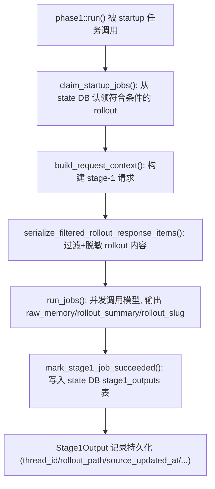
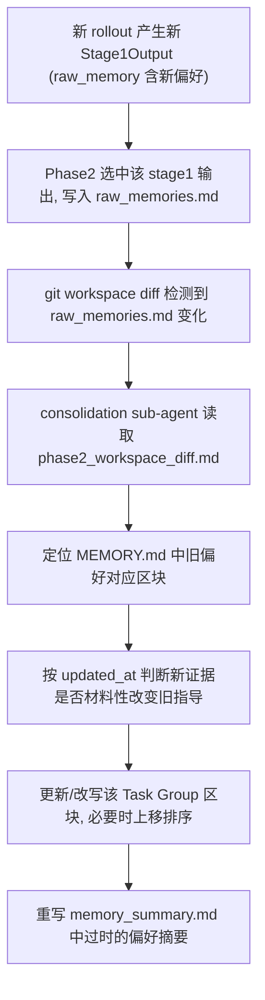

> Source: 用户粘贴的 DeepWiki openai/codex 源码问答；附件 1d9579b2-408f-45c2-8bfe-afbbb21baf05/已粘贴的文本.txt（未提供问答 URL 或 commit）
> Collected: 2026-09-22
> Published: Unknown

# DeepWiki Q&A with Code Context for Repository: openai/codex
## Q1
请分别找出当前模型上下文、会话历史持久化、任务状态和跨会话记忆的实现。如果项目声称支持长期记忆，请追踪一条信息如何被写入、在未来另一个任务中被检索，并实际进入模型请求。只有存储没有读取使用的部分，请单独标明。
### Answer
## 概述

openai/codex 中这四个概念分别对应不同的子系统:当前模型上下文由 `TurnContext`/`ContextManager` 管理;会话历史持久化由 rollout/thread-store 负责;任务状态由 `SessionTask`/`ActiveTurn` 管理;跨会话长期记忆则由独立的 `codex-rs/memories` (Phase 1/Phase 2) 与 `codex-rs/state` 的 SQLite 存储实现,并且**确实存在完整的写入→检索→注入模型请求的闭环**。

---

## 1. 当前模型上下文 (Model Context)

`ContextManager`(位于 `context_manager/history.rs`)维护 `items: Arc<Vec<ResponseItemEnvelope>>` 作为发给模型的对话窗口,并跟踪 `reference_context_item`、`world_state_baseline` 等基线快照 <cite repo="openai/codex" path="codex-rs/core/src/context_manager/history.rs" start="60-90" end="90" />。

`Session::record_context_updates_and_set_reference_context_item` 在每个 turn 决定是否需要注入完整初始上下文,还是只发送与上次基线的 diff,并把结果写入 `context_items` 供模型消费,同时把 `TurnContextItem` 持久化以便 resume 复原 <cite repo="openai/codex" path="codex-rs/core/src/session/mod.rs" start="4279-4346" end="4346" />。

`ModelContextScan`(在独立的 `codex-rs/rollout` crate 中)在 resume 时从 rollout 文件反向扫描,找到最近的 turn 边界或 `WorldState` 快照来重建当前模型上下文 <cite repo="openai/codex" path="codex-rs/rollout/src/model_context.rs" start="49-64" end="64" />。

## 2. 会话历史持久化 (Conversation History Persistence)

`ThreadStore` trait 定义了 `flush_thread`、`shutdown_thread`、`load_history`、`load_latest_model_context` 等接口,是历史持久化的核心抽象 <cite repo="openai/codex" path="codex-rs/thread-store/src/store.rs" start="129-159" end="159" />。

`should_persist_response_item_for_memories` 和 `should_persist_event_msg` 决定哪些 `ResponseItem`/`EventMsg` 会被写入 rollout 文件(注意这里的 "memories" 命名指的是 rollout 持久化策略,而非长期记忆系统本身)<cite repo="openai/codex" path="codex-rs/rollout/src/policy.rs" start="67-90" end="90" /> <cite repo="openai/codex" path="codex-rs/rollout/src/policy.rs" start="92-136" end="136" />。

`Session` 在启动 resume/fork 时调用 `apply_rollout_reconstruction` 并 seed token usage 信息,随后调用 `self.flush_rollout()` 落盘 <cite repo="openai/codex" path="codex-rs/core/src/session/mod.rs" start="1451-1464" end="1464" />。

## 3. 任务状态 (Task State)

据 wiki 说明,`Session` 通过 `active_turn: Mutex<Option<ActiveTurn>>` 追踪当前运行的 turn,`SessionTask::run` 驱动执行循环,`TurnCompleteEvent` 标志任务结束触发状态转移。这部分详见 `codex-rs/core/src/session/session.rs`、`codex-rs/core/src/tasks/mod.rs`(索引未提供具体行号内容,建议启动 Devin session 查看完整实现)。

## 4. 跨会话长期记忆 (Cross-Session Memory) — 完整闭环追踪

这是 `codex-rs/memories` 独立子系统,分两阶段运行:**Phase 1(逐 rollout 抽取)** 和 **Phase 2(全局整合)**。

### 写入路径 (Write)

1. Root session 启动时,`start_memories_startup_task` 检查非 ephemeral、`Feature::MemoryTool` 开启、非 subagent、state DB 可用等条件后,`tokio::spawn` 异步任务依次执行 `phase1::run` 与 `phase2::run` <cite repo="openai/codex" path="codex-rs/memories/write/src/start.rs" start="24-81" end="81" />。
2. Phase 1 从 state DB 认领符合条件的 rollout,把内容发给模型抽取出结构化的 `raw_memory`、`rollout_summary`,并写回 state DB 的 `stage1_outputs` 表(这段流程在 README 中有描述,具体实现代码索引未覆盖)<cite repo="openai/codex" path="codex-rs/memories/README.md" start="40-77" end="77" />。
3. Phase 2 从 `stage1_outputs` 中按 `usage_count`/`last_usage` 选取记录,合并写出 `raw_memories.md`、`rollout_summaries/*.md` 等文件系统制品,再启动一个"consolidation 子 agent",依据 `consolidation.md` 模板把这些制品整合进最终的 `MEMORY.md`、`memory_summary.md`、`skills/*` <cite repo="openai/codex" path="codex-rs/memories/README.md" start="79-121" end="121" /> <cite repo="openai/codex" path="codex-rs/memories/write/templates/memories/consolidation.md" start="179-198" end="198" />。

### 检索使用路径 (Read → Model Request)

- `MemoryStore::record_stage1_output_usage` 是关键的"读取被使用"证据:当某条 stage-1 记忆被模型引用(cited)后,该函数把对应 `thread_id` 的 `usage_count` 加一、`last_usage` 更新为当前时间戳 <cite repo="openai/codex" path="codex-rs/state/src/runtime/memories.rs" start="51-86" end="86" />。这说明系统确实追踪"引用后使用"的信号,而不是只写不读。
- Phase 2 选择哪些 stage-1 输出进入 `MEMORY.md` 时,明确按 `usage_count` 和 `last_usage` 排序,并排除超出 `max_unused_days` 窗口且从未被使用过的记忆 <cite repo="openai/codex" path="codex-rs/memories/README.md" start="87-94" end="94" />。这构成"记忆被检索后影响未来记忆保留"的闭环。
- 在 wiki 的 Event Processing 页面提到,系统在 turn 处理时会对助手输出做"记忆引用"解析,`strip_citations` 用于剥离模型输出中的记忆引用标记,这暗示 `MEMORY.md`(经由 read 路径,如 README 中提及的 `codex-memories-read` crate 的 developer-instruction injection)会作为 developer 指令的一部分注入到模型的实际请求中 <cite repo="openai/codex" path="codex-rs/memories/README.md" start="10-12" end="12" />。

### 只写不读的部分

- Phase 1 的 `rollout_summary`/`raw_memory` 写入 state DB 之后,如果从未被引用(`usage_count` 一直为 0),则只会静静地保留在 `stage1_outputs` 表和 `raw_memories.md` 文件中,直到超过 `max_unused_days` 才被 Phase 2 剔除;在此期间它属于"只存储、未被模型检索使用"的状态 <cite repo="openai/codex" path="codex-rs/state/src/runtime/memories.rs" start="88-131" end="131" />。
- `phase2_workspace_diff.md` 是 Phase 2 内部生成给 consolidation agent 看的临时 diff 文件,运行结束后会被删除,它本身不会进入未来任何最终模型请求的持久上下文,只是流程内部的一次性输入 <cite repo="openai/codex" path="codex-rs/memories/README.md" start="109-119" end="119" />。

---

## Notes

- `codex-memories-read` crate(负责"内存开发者指令注入"和"内存引用解析")的具体源码未包含在本次索引结果中,如需查看该注入逻辑的精确实现,建议启动完整的 Devin session 以获取该文件的全部内容。
- `ThreadStore::load_latest_model_context`(位于 `thread-store/src/store.rs`)的默认实现返回 `Unsupported` 错误 <cite repo="openai/codex" path="codex-rs/thread-store/src/store.rs" start="147-159" end="159" />,说明并非所有后端都实现了针对性的模型上下文加载,部分实现可能退化为"加载全部历史"。
- 任务状态(`SessionTask`/`ActiveTurn`)的具体代码在本次索引中未提供充分片段,若需要精确行号引用,建议进一步查阅 `codex-rs/core/src/session/session.rs` 与 `codex-rs/core/src/tasks/mod.rs` 全文。
- `codex-rs/ext/memories` (`MemoriesBackend` trait)与 `codex-rs/memories`(Phase 1/2 pipeline)是两个不同的记忆相关模块:前者是面向工具调用(add/list/read/search)的存储接口 <cite repo="openai/codex" path="codex-rs/ext/memories/src/backend.rs" start="12-32" end="32" />,后者才是本回答重点讨论的"长期记忆管道"。两者可能存在关联但索引未提供足够代码证明其直接调用关系,请留意区分。

Wiki pages you might want to explore:
- [Event Processing and State Management (openai/codex)](/wiki/openai/codex#3.4)
## Q2
长期记忆由用户显式要求写入、规则提取、模型提取，还是任务结束后总结产生？候选内容如何筛选？能否区分用户明确陈述、工具验证结果和模型推断？是否保存来源、时间、适用范围及不确定性？请追踪一条候选记忆从产生到正式保存的过程。
### Answer
## 直接回答

长期记忆是**纯模型提取**产生的,不是用户显式命令,也不是硬编码规则。Phase 1 在每个符合条件的 rollout 结束后,把过滤后的对话内容发给模型,让模型生成结构化的 `raw_memory`/`rollout_summary`/`rollout_slug` <cite repo="openai/codex" path="codex-rs/memories/write/src/phase1.rs" start="136-148" end="148" />。这不是"任务结束后立即总结",而是异步、批量地在下一次 root session 启动时对已经变冷(idle)的历史 rollout 进行回溯抽取 <cite repo="openai/codex" path="codex-rs/memories/README.md" start="44-51" end="51" />。

系统**能够**在 prompt 层面区分"用户明确陈述 / 工具验证结果 / 模型推断"这三类证据的可信度,但这是通过 Phase 2 consolidation 提示词中的显式指令实现的软性区分,而不是数据库字段级别的强类型标注。保存的元数据包括来源(`thread_id`、`rollout_path`、`cwd`、`git_branch`)、时间(`source_updated_at`、`generated_at`)和适用范围(`applies_to` 字段),但**没有独立的"不确定性"字段**——不确定性只以自然语言文本形式体现在 `MEMORY.md` 正文中。

---

## 1. 写入触发方式:模型提取,非用户显式要求

Phase 1 是纯模型驱动的批处理:`claim_startup_jobs` 从 state DB 认领符合资格的 rollout,然后 `run_jobs` 并发地把每条 rollout 发给模型,期望模型返回结构化 JSON <cite repo="openai/codex" path="codex-rs/memories/write/src/phase1.rs" start="66-97" end="97" />。输出 JSON schema 严格限定为 `rollout_summary`、`rollout_slug`、`raw_memory` 三个字段,都由模型生成,没有任何"用户主动要求记住"这一入口 <cite repo="openai/codex" path="codex-rs/memories/write/src/phase1.rs" start="136-148" end="148" />。

## 2. 候选内容的筛选(Eligibility & Content Filtering)

**Rollout 级筛选**(哪些会话会被抽取):必须来自允许的交互式来源、在配置的时间窗口内、idle 足够长(避免总结仍活跃的会话)、未被其他 worker 占用、且受启动扫描/认领上限约束 <cite repo="openai/codex" path="codex-rs/memories/README.md" start="44-51" end="51" />。

**内容级筛选**(rollout 内哪些条目送进 prompt):`serialize_filtered_rollout_response_items` 只保留 `ResponseItem` 与 `InterAgentCommunication`,其余如 `SessionMeta`、`WorldState`、`TurnContext`、`EventMsg` 等一律排除,并对结果做 `redact_secrets` 脱敏 <cite repo="openai/codex" path="codex-rs/memories/write/src/phase1.rs" start="405-432" end="432" />。更细粒度地,`sanitize_response_item_for_memories` 会剔除 `developer` 角色消息,并从 `user` 消息中过滤掉"记忆排除的上下文片段" <cite repo="openai/codex" path="codex-rs/memories/write/src/phase1.rs" start="434-470" end="470" />。

## 3. 区分用户陈述 / 工具验证 / 模型推断

这个区分**不是数据库结构层面的字段**,而是 consolidation 提示词中给模型的显式分级指令。`consolidation.md` 明确要求保留"epistemic status"(认知可信度等级):

- "validated repo/tool facts may be stated directly"(工具验证事实可直接陈述)
- "explicit user preferences can be promoted when they seem stable"(用户明确陈述的偏好,若看起来稳定可提升)
- "inferred preferences from repeated follow-ups can be promoted cautiously"(反复出现的跟进行为推断出的偏好需谨慎提升)
- "assistant proposals, exploratory discussion, and one-off judgments should stay local, be downgraded, or be omitted"(助手自己的提议/一次性判断应降级或省略)

<cite repo="openai/codex" path="codex-rs/memories/write/templates/memories/consolidation.md" start="438-445" end="445" />

同时提示词也强调 "Overindex on user messages, explicit user adoption, and code/tool evidence. Underindex on assistant-authored recommendations" <cite repo="openai/codex" path="codex-rs/memories/write/templates/memories/consolidation.md" start="374-375" end="375" />,以及在冲突/不清晰时"保留不确定性,明确写出"("If evidence conflicts and validation is unclear, preserve the uncertainty explicitly") <cite repo="openai/codex" path="codex-rs/memories/write/templates/memories/consolidation.md" start="349-349" end="349" />。

## 4. 保存的元数据:来源 / 时间 / 适用范围,但无独立不确定性字段

`Stage1Output` 结构体是 Phase 1 产出并存入 state DB 的记录,字段包括 `thread_id`、`rollout_path`(来源)、`source_updated_at`/`generated_at`(时间)、`cwd`/`git_branch`(适用范围的物理信息)、以及 `raw_memory`/`rollout_summary`/`rollout_slug`(内容本身)<cite repo="openai/codex" path="codex-rs/state/src/model/memories.rs" start="8-20" end="20" />。

在最终 `MEMORY.md` 层面,每个记忆块被要求带 `applies_to`字段,标明 cwd/项目/工作流的适用边界 <cite repo="openai/codex" path="codex-rs/memories/write/templates/memories/consolidation.md" start="211-211" end="211" />。但**没有单独的结构化"不确定性"或"confidence"字段**——不确定性只体现在自然语言正文中(如上面提到的 "preserve the uncertainty explicitly")。

## 5. 追踪一条候选记忆:从产生到正式保存

1. `phase1::run` 依次执行:先认领 job,再并行跑抽取,最后统计上报 <cite repo="openai/codex" path="codex-rs/memories/write/src/phase1.rs" start="71-96" end="96" />。
2. `serialize_filtered_rollout_response_items` 把 rollout 内容过滤、脱敏后准备好送模型 <cite repo="openai/codex" path="codex-rs/memories/write/src/phase1.rs" start="406-432" end="432" />。
3. 模型返回结果后,`mark_stage1_job_succeeded` 把 `raw_memory`/`rollout_summary`/`rollout_slug` 连同 `thread_id`、`source_updated_at` 写入 state DB,这一步在单元测试中也有直接验证——测试里显式调用 `mark_stage1_job_succeeded(thread_id, ownership_token, source_updated_at, "raw", "summary", rollout_slug)` 并断言"stage1 success should persist output" <cite repo="openai/codex" path="codex-rs/state/src/runtime/memories.rs" start="3810-3822" end="3822" />。
4. 这条 stage-1 记录此时算"候选记忆",尚未进入任何模型的实际上下文;它要等到 Phase 2 用 `get_phase2_input_selection`(按 `usage_count`/`last_usage` 排序)选中后 <cite repo="openai/codex" path="codex-rs/memories/write/src/phase2.rs" start="104-122" end="122" />,才会被 `rebuild_raw_memories_file_from_memories` 等函数写进磁盘上的 `raw_memories.md`,再交给 consolidation 子 agent 整合进 `MEMORY.md` <cite repo="openai/codex" path="codex-rs/memories/write/src/phase2.rs" start="214-223" end="223" />。
5. `job::succeed` 最终调用 `mark_global_phase2_job_succeeded` 把这次 Phase 2 消费的候选输出正式标记为"已被选入"(`selected_for_phase2`),完成从"候选"到"正式保存进制品"的转变 <cite repo="openai/codex" path="codex-rs/memories/write/src/phase2.rs" start="292-305" end="305" />。

---

## Notes

- 本回答中提到的"epistemic status"区分和"不确定性保留"完全依赖模型在 consolidation 阶段遵循提示词指令,代码层面没有强制校验或结构化字段兜底,如果模型未严格遵守提示词,这个区分可能会失真。
- `codex-memories-read` crate(负责把 `MEMORY.md` 真正注入到模型请求、以及记忆引用计数的触发点)的具体源码本次索引未覆盖,如果需要验证"记忆被引用后如何精确触发 `usage_count` 更新"的完整闭环,建议启动完整 Devin session 查看该 crate 源码。
- `codex-rs/ext/memories` 中的 `MemoriesBackend` 是另一套面向工具调用(add/list/search)的记忆接口,与本回答讨论的 Phase 1/2 pipeline 是不同的系统,不要混淆。

Wiki pages you might want to explore:
- [Rollout Persistence and Replay (openai/codex)](/wiki/openai/codex#3.5.2)
## Q3
当新信息与旧记忆冲突时，系统如何判断是同一事实更新、不同场景下同时成立，还是证据不足？请找出更新、版本、有效期和删除机制。以“用户偏好发生变化”为例，追踪旧记录、检索索引和缓存如何同步变化；若没有这些机制，请明确指出。
### Answer
## 直接回答

冲突判断和"版本"机制**完全由模型在 Phase 2 consolidation 提示词中依据指令进行判断**,代码层面没有结构化的版本号、TTL 过期字段或独立的检索索引/缓存同步机制。具体来说:

- **同一事实更新 vs 不同场景共存**:由 `applies_to` 字段(cwd/项目/工作流边界)决定是否算不同场景 <cite repo="openai/codex" path="codex-rs/memories/write/templates/memories/consolidation.md" start="211-211" end="211" />,而"是否是同一事实的更新"则依赖 `updated_at` 时间戳作为"一等信号"来判断谁更新更权威 <cite repo="openai/codex" path="codex-rs/memories/write/templates/memories/consolidation.md" start="344-346" end="346" />。
- **证据不足**:提示词要求"若证据冲突且验证不清,明确保留不确定性",这只是自然语言指令,无代码强制校验 <cite repo="openai/codex" path="codex-rs/memories/write/templates/memories/consolidation.md" start="349-349" end="349" />。
- **删除/遗忘机制**:存在,但是基于 git diff 的"workspace diff"检测,而非数据库版本号或 TTL <cite repo="openai/codex" path="codex-rs/memories/write/templates/memories/consolidation.md" start="157-177" end="177" />,配合 Phase 2 对陈旧 `rollout_summaries` 的物理删除 <cite repo="openai/codex" path="codex-rs/memories/README.md" start="101-101" end="101" /> 和基于 `max_unused_days` 的 stage1 记录排除 <cite repo="openai/codex" path="codex-rs/memories/README.md" start="87-94" end="94" />。
- **检索索引与缓存同步**:根据现有索引到的代码,**不存在独立的检索索引或缓存层**——`MEMORY.md` 就是最终制品文件本身,每次 Phase 2 运行都直接读写它;没有证据表明有单独的向量索引或内存缓存需要与其保持同步。这部分**是"未发现实现"的机制**,需要明确指出。

---

## 详细说明

### 1. 冲突判断:同一事实更新 / 场景区分 / 证据不足

`consolidation.md` 的"Ordering and conflict handling"一节是核心逻辑来源:

- `updated_at` 被要求视为"一等信号",更新鲜的已验证证据通常胜出;如果新 rollout 材料性地改变了某任务族的指导,应更新对应任务/区块 <cite repo="openai/codex" path="codex-rs/memories/write/templates/memories/consolidation.md" start="344-346" end="346" />。
- 增量更新模式下,旧区块保持稳定顺序,只有在证据材料性改变可用性/置信度时才重排 <cite repo="openai/codex" path="codex-rs/memories/write/templates/memories/consolidation.md" start="347-348" end="348" />。
- 证据冲突且验证不清时,要求"明确保留不确定性" <cite repo="openai/codex" path="codex-rs/memories/write/templates/memories/consolidation.md" start="349-349" end="349" />,并在合并/去重/解决冲突时引用 `[Task 1]`、`[Task 2]` 等任务引用以保持可追溯性 <cite repo="openai/codex" path="codex-rs/memories/write/templates/memories/consolidation.md" start="350-351" end="351" />。
- "不同场景下同时成立"由 `applies_to`(cwd/项目/工作流范围)字段处理——它明确要求"保留 cwd/checkout 边界,避免未来 agent 混淆不同工作目录下的相似任务" <cite repo="openai/codex" path="codex-rs/memories/write/templates/memories/consolidation.md" start="211-217" end="217" />;同时也建议"当任务措辞相似时,默认在不同 cwd 上下文之间分离记忆" <cite repo="openai/codex" path="codex-rs/memories/write/templates/memories/consolidation.md" start="304-304" end="304" />。

这些都是**给模型的软性指令**,没有代码层面的规则引擎或结构化字段强制执行区分。

### 2. 更新 / 版本 / 有效期 / 删除机制

| 机制 | 是否存在 | 依据 |
|---|---|---|
| 结构化版本号 | ❌ 不存在 | 未在 `Stage1Output` 或 `MEMORY.md` 格式中找到版本字段 <cite repo="openai/codex" path="codex-rs/memories/write/templates/memories/consolidation.md" start="206-217" end="217" /> |
| 有效期/TTL | 部分存在(仅 stage1 层面) | Phase 2 选择时忽略 `last_usage` 超出 `max_unused_days` 窗口的记忆,未使用过的则回退用 `generated_at` <cite repo="openai/codex" path="codex-rs/memories/README.md" start="87-92" end="92" /> |
| 删除/遗忘(文件级) | 存在,基于 git diff | "Incremental update and forgetting mechanism"一节明确用 `phase2_workspace_diff_file` 识别已删除输入,并要求"仅删除由已删输入支撑的记忆" <cite repo="openai/codex" path="codex-rs/memories/write/templates/memories/consolidation.md" start="157-172" end="172" /> |
| 混合区块处理 | 存在 | 若一个 `MEMORY.md` 区块同时含已删除和仍存在的证据,只删除过时引用,保留仍受支持的内容 <cite repo="openai/codex" path="codex-rs/memories/write/templates/memories/consolidation.md" start="173-177" end="177" /> |
| 物理文件剪枝 | 存在 | Phase 2 会"剪枝不再被选中的陈旧 rollout summaries" <cite repo="openai/codex" path="codex-rs/memories/README.md" start="101-101" end="101" /> |

### 3. 追踪示例:"用户偏好发生变化"

- 增量模式下,先用 workspace diff 定位已改变的 `raw_memories.md`/`rollout_summaries` 条目作为路由入口 <cite repo="openai/codex" path="codex-rs/memories/write/templates/memories/consolidation.md" start="785-790" end="790" />。
- 若旧偏好指导被材料性改变,需要更新对应区块,并考虑上移排序反映时效性 <cite repo="openai/codex" path="codex-rs/memories/write/templates/memories/consolidation.md" start="345-346" end="346" />。
- 完成 `MEMORY.md` 更新后,还要求"重新审视 `memory_summary.md`,移除或重写只被已删除文件支撑的过时摘要/索引内容" <cite repo="openai/codex" path="codex-rs/memories/write/templates/memories/consolidation.md" start="176-177" end="177" />,这是对"摘要层缓存"的手动同步,而非自动化缓存失效机制。

### 4. 只写不存在的部分(明确指出缺失)

- **没有独立的检索索引**:整个流程中未发现任何向量索引、倒排索引或独立检索层的代码/描述——检索完全依赖 `codex-memories-read` 把 `MEMORY.md`/`memory_summary.md` 文件内容直接注入模型请求(具体注入代码本次索引未覆盖)。
- **没有缓存同步机制**:`memory_summary.md` 本质上是"手动维护的摘要缓存",其更新依赖 consolidation agent 遵循提示词指令主动重写,**不存在代码层面强制的缓存失效/一致性检查**;如果 agent 未遵循指令,`memory_summary.md` 可能与 `MEMORY.md` 出现不一致而不会被系统自动检测出来。
- **没有数据库级别的版本号或冲突检测算法**:所有"同一事实 vs 不同场景 vs 证据不足"的判断都在自然语言提示词层面完成,而不是结构化代码逻辑,存在模型不遵守指令导致判断失真的风险(此前一轮回答中也提到过这一点)。

## Notes

- `codex-memories-read` crate(负责把 `MEMORY.md` 实际注入模型请求、以及可能存在的读取缓存)源码未被本次索引覆盖,如果需要验证是否存在运行时缓存层,建议启动完整 Devin session 查看该 crate。
- `codex-rs/state/src/runtime/memories.rs` 中的 `stage1_source_needs_update` 函数是唯一发现的"版本/时效性比较"逻辑,但它只用于判断 Phase 1 是否需要重新提取某个 rollout,而非用于解决记忆间的语义冲突 <cite repo="openai/codex" path="codex-rs/state/src/runtime/memories.rs" start="88-131" end="131" />。

Wiki pages you might want to explore:
- [Rollout Persistence and Replay (openai/codex)](/wiki/openai/codex#3.5.2)
## Q4
请根据当前项目的实际读写需求，解释它为什么采用关系数据库、全文检索、向量检索或文件存储。分别分析精确更新、语义召回、关键词匹配、元数据过滤、可审计性和删除一致性。哪些能力可以组合使用？如果更换存储，哪些上层接口和行为需要改变？
### Answer
## 直接回答

当前项目并未采用向量检索,也没有独立的全文检索引擎;实际使用的是**两种存储的组合**:SQLite 关系数据库(`codex-rs/state`,用于结构化元数据、job 队列、usage 计数)+ 纯文件系统(Markdown 文件 + git,用于记忆内容本身与可审计的版本追踪)。检索/关键词匹配靠 `codex-rs/ext/memories` 里的简单文件字符串搜索实现,不是索引化的全文检索 <cite repo="openai/codex" path="codex-rs/ext/memories/src/backend.rs" start="12-32" end="32" />。这个选择直接对应实际读写模式:写少读多、更新是"整篇重写"而非"局部字段更新"、一致性靠 git diff 而非事务。

---

## 逐能力分析

### 1. 精确更新(Exact Update)
- **SQLite 侧**:`stage1_outputs` 表的 `usage_count`/`last_usage` 是典型的精确字段级更新,用标准 `UPDATE ... SET ... WHERE thread_id = ?` 完成 <cite repo="openai/codex" path="codex-rs/state/src/runtime/memories.rs" start="68-81" end="81" />,这是关系数据库的强项——按主键做原子更新。
- **文件侧**:`MEMORY.md`/`raw_memories.md` 没有字段级更新概念,只有"整文件重写"——例如空输入集时"`raw_memories.md` is rewritten to the empty-input placeholder" <cite repo="openai/codex" path="codex-rs/memories/README.md" start="134-137" end="137" />。文件存储不适合做精确的局部更新,项目也确实没有尝试这么做。

### 2. 语义召回(Semantic Recall)
- **不存在**。索引范围内没有任何向量数据库、embedding 生成或相似度检索代码。`LocalMemoriesBackend::search` 只是字符串匹配 <cite repo="openai/codex" path="codex-rs/ext/memories/src/local.rs" start="123-128" end="128" />,测试用例验证的是完全基于文本 needle 的搜索,不涉及语义 <cite repo="openai/codex" path="codex-rs/ext/memories/src/tests.rs" start="384-402" end="402" />。真正的"语义召回"能力实际上外包给了模型本身——Phase 2 consolidation agent 靠 LLM 阅读 `MEMORY.md`/`raw_memories.md` 全文来做语义关联,而不是靠检索系统预先筛选。

### 3. 关键词匹配(Keyword Matching)
- 由 `codex-rs/ext/memories` 的 `search` 工具提供,是简单的大小写敏感/不敏感字符串匹配,支持 `match_mode`(Any/All)、`context_lines` 等参数,但底层就是遍历文件内容做字符串查找,不是倒排索引 <cite repo="openai/codex" path="codex-rs/ext/memories/src/tests.rs" start="384-397" end="397" /> <cite repo="openai/codex" path="codex-rs/ext/memories/src/backend.rs" start="28-31" end="31" />。规模小(单个 codex_home 下的 memory 文件)使得线性扫描完全够用,这也是"文件存储 + grep 式搜索"组合被选中的实际原因——数据量不到需要 FTS 引擎的规模。

### 4. 元数据过滤(Metadata Filtering)
- 这正是 SQLite 的核心用途。`stage1_outputs` 表通过 `thread_id`、`source_updated_at`、`usage_count`、`last_usage` 等字段支持结构化过滤查询,例如 Phase 2 的 `get_phase2_input_selection` 依赖 `last_usage`/`max_unused_days` 窗口过滤 <cite repo="openai/codex" path="codex-rs/state/src/runtime/memories.rs" start="88-131" end="131" />,以及 `threads` 表按 `updated_at_ms`/`memory_mode` 过滤符合抽取条件的会话 <cite repo="openai/codex" path="codex-rs/state/src/runtime/memories.rs" start="220-250" end="250" />。这类多条件范围查询正是关系数据库擅长而文件系统做不到的。

### 5. 可审计性(Auditability)
- 由**文件 + git** 组合承担,不是数据库。Phase 2 把 memory root 维护成 git 仓库,靠 `phase2_workspace_diff.md` 生成"上次成功基线 → 当前工作树"的 diff 供 consolidation agent 与人类审阅 <cite repo="openai/codex" path="codex-rs/memories/README.md" start="104-119" end="119" />,`consolidation.md` 模板也明确要求"每次变更都需在 diff 中体现且被追溯" <cite repo="openai/codex" path="codex-rs/memories/write/templates/memories/consolidation.md" start="157-163" end="163" />。这是文件存储天然适合 git 版本化审计的原因,SQLite 里没有等价的"逐条历史" schema。

### 6. 删除一致性(Deletion Consistency)
- **组合机制**,但不是事务级强一致:
  - SQLite 层:`clear_memory_data`/`prune_stage1_outputs_for_retention` 在单个事务内删除 `stage1_outputs`+`jobs` 行,保证数据库内部一致 <cite repo="openai/codex" path="codex-rs/state/src/runtime/memories.rs" start="42-49" end="49" />,并有集成测试验证清空后计数归零 <cite repo="openai/codex" path="codex-rs/cli/tests/debug_clear_memories.rs" start="118-131" end="131" />。
  - 文件层:靠 git diff 检测"哪些输入被删除",再要求 consolidation agent 手动删除 `MEMORY.md` 中"仅由已删除输入支撑"的内容 <cite repo="openai/codex" path="codex-rs/memories/write/templates/memories/consolidation.md" start="170-177" end="177" />。这一步**没有代码强制保证**,完全依赖模型遵循提示词,数据库删除与文件删除之间也没有跨存储的事务保证——如上一轮回答中提到的,这是明确的一致性缺口。

---

## 能力组合总结

| 能力 | 承担存储 | 组合方式 |
|---|---|---|
| 精确更新 | SQLite | 独立,字段级 UPDATE |
| 语义召回 | 无(委托给 LLM 读全文) | 不属于存储层能力 |
| 关键词匹配 | 文件系统(线性扫描) | 独立,无索引 |
| 元数据过滤 | SQLite | 独立,SQL WHERE/JOIN |
| 可审计性 | 文件系统 + git | 独立,diff 驱动 |
| 删除一致性 | SQLite(事务)+ 文件(git diff,非事务) | 部分组合,跨存储无事务保证 |

SQLite 与文件系统是**互补而非替代**关系:SQLite 管"哪些记忆候选存在、是否该被选中、使用频率如何"这类**结构化元数据**;文件系统管"记忆内容本身长什么样、如何随时间演变"这类**长文本 + 版本历史**。两者通过 `thread_id`、`rollout_summaries/*.md` 文件名等标识符松散关联,例如 Phase 1 输出的 `Stage1Output`(SQLite 行)与 Phase 2 生成的 `rollout_summaries/<slug>.md`(文件)之间通过 `rollout_slug` 对应 <cite repo="openai/codex" path="codex-rs/memories/write/src/phase1.rs" start="140-147" end="147" />。

## 更换存储需要改变的上层接口

若要把 SQLite 换成其他关系库/KV 存储,受影响的主要是 `codex-rs/state` 中的 `MemoryStore`(`claim_stage1_jobs_for_startup`、`record_stage1_output_usage`、`get_phase2_input_selection`、`prune_stage1_outputs_for_retention` 等方法签名和 `StateRuntime` 对外暴露的接口)<cite repo="openai/codex" path="codex-rs/state/src/lib.rs" start="75-91" end="91" />,以及 `codex-rs/memories/write` 中调用这些方法的 Phase1/Phase2 逻辑,但 SQL 查询本身(如 `push_thread_filters` 构建的动态 WHERE 子句)需要重写为新存储的查询语言 <cite repo="openai/codex" path="codex-rs/state/src/runtime/memories.rs" start="220-250" end="250" />。

若要把文件系统换成向量数据库/搜索引擎,受影响的是 `codex-rs/memories/read`(`memory_root` 及注入逻辑,目前是"读文件全文注入 prompt",若换成向量库需要改为"embedding 查询 + top-k 拼接")<cite repo="openai/codex" path="codex-rs/memories/read/src/lib.rs" start="7-15" end="15" />,以及 `codex-rs/memories/write` 里所有直写 `.md` 文件的 storage 助手函数(`rebuild_raw_memories_file_from_memories`、`sync_rollout_summaries_from_memories`)<cite repo="openai/codex" path="codex-rs/memories/write/src/lib.rs" start="27-30" end="30" />,以及 `codex-rs/ext/memories` 的 `MemoriesBackend` trait 实现——目前 `LocalMemoriesBackend` 是基于路径的文件系统操作 <cite repo="openai/codex" path="codex-rs/ext/memories/src/local.rs" start="24-27" end="27" />,换存储需要提供新的 backend 实现但可以保持 trait 契约不变(`add_ad_hoc_note`/`list`/`read`/`search`)<cite repo="openai/codex" path="codex-rs/ext/memories/src/backend.rs" start="12-31" end="31" />,这个 trait 抽象层本身正是为了让上层调用者(工具处理逻辑)不必因换存储而改变。

## Notes

- Phase 2 的 git 化审计机制和 SQLite 的事务化删除是各自独立设计的,两者之间**没有统一的跨存储事务**——之前一轮回答也提到这是明确的一致性缺口。
- `codex-memories-read` 的具体 prompt 注入代码(如何把文件内容转成模型请求的 developer 消息)未被

Wiki pages you might want to explore:
- [Rollout Persistence and Replay (openai/codex)](/wiki/openai/codex#3.5.2)
- [Memories System (openai/codex)](/wiki/openai/codex#3.9)