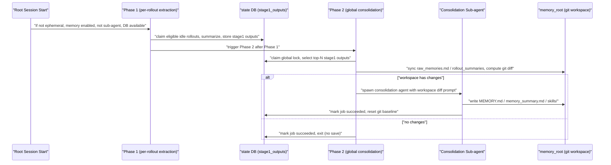

> Source: 用户粘贴的问答，围绕 `codex-rs/memories/README.md`、`codex-rs/memories/write/src/phase2.rs`、`runtime.rs`、`startup_tests.rs`（未提供会话 URL 或 commit）。原文附有指向 `/wiki/openai/codex#3.9` 的站内链接。
> Collected: 2026-09-22
> Published: Unknown

继续补充：# 长期记忆保存的触发时机

记忆流水线在每次根会话启动时触发,但需要满足一系列前置条件,然后异步在后台按 Phase 1 → Phase 2 顺序执行。

---

## 触发条件

Pipeline 仅在以下情况下触发:

- 会话不是 ephemeral(临时)会话
- memory 功能已启用
- 会话不是 sub-agent 会话
- state DB 可用

满足条件后,流水线异步在后台执行,依次运行 Phase 1、再运行 Phase 2 [1](#1-0) 。

## Phase 1:按 rollout 触发的提取

Phase 1 从 state DB 中按"启动认领规则"挑选最近符合条件的 rollout,只考虑:

- 来自被允许的交互式会话来源
- 处于配置的时间窗口内
- 已闲置足够长时间(避免总结还很"新鲜"、仍在活跃的 rollout)
- 未被其它正在运行的 phase-1 worker 占用
- 在启动扫描/认领的数量限制内(每次启动的工作量有上限) [2](#1-1) 

也就是说,Phase 1 的触发时机本质上是"每次启动时扫描一批闲置够久、还没被处理过的历史 rollout"。它会认领一批任务、发模型总结,并把成功的输出写回 `stage1_outputs` [3](#1-2) 。

## Phase 2:全局整合的触发条件

Phase 2 在拿到全局锁之后才会运行,保证同一时刻只有一个整合流程在操作 memories 根目录 [4](#1-3) 。它按规则选取一批 stage-1 输出:

- 忽略 `last_usage` 超出 `max_unused_days` 窗口的记忆
- 对没有 `last_usage` 的记忆,回退用 `generated_at` 判断,保证新鲜但从未被使用的记忆仍可入选
- 按 `usage_count` 优先排序,再按最近的 `last_usage`/`generated_at` 排序 [5](#1-4) 

关键的是,Phase 2 的实际保存(即调用整合 agent 写 `MEMORY.md`/`memory_summary.md`)**不是**每次都触发的:只有当"记忆工作区"(git 仓库形式,位于 `~/.codex/memories/.git`)在同步完 artifacts 后确实检测到变更(即 git diff 非空)时,才会真正 spawn 整合子代理;如果没有变更,直接标记任务成功并退出,不会触发内容更新 [6](#1-5) 。

代码层面,`phase2::run` 在完成 workspace diff 写入后会调用 `spawn_consolidation_agent` 启动整合代理并跑一次 turn [7](#1-6) [8](#1-7) 。之后 `agent::handle` 负责等待代理完成、验证产物有效性、重置 workspace baseline 并把任务标记为 `succeeded`,这才是真正"保存"完成的时刻 [9](#1-8) 。

## 触发规则的"看门狗"机制:Watermark

Phase 2 不依赖数据库水位线判断是否要跑,而是用 git 工作区是否 dirty 来决定是否需要跑整合代理;完成后把新的 watermark(claimed watermark 与已加载 stage-1 输入最新 `source_updated_at` 的最大值)持久化到 DB,作为后续记账用途 [10](#1-9) 。

## 小结时序图



## Notes

- Phase 1 和 Phase 2 的运行时编排代码实际在 `codex-core` 下的 `codex-rs/core/src/memories/`,该目录内容不在我目前检索到的上下文中,如果你需要具体的启动挂钩点(例如哪个函数在会话启动时 spawn 了这个 pipeline),建议开启 Devin session 查看完整代码。
- `startup_tests.rs` 中的测试用例展示了实际触发 phase2::run 并验证整合结果的端到端流程,可作为触发时机的具体示例参考 [11](#1-10) 。

Wiki pages you might want to explore:
- [Memories System (openai/codex)](/wiki/openai/codex#3.9)

### Citations

**File:** codex-rs/memories/README.md (L29-38)
```markdown
## When it runs

The pipeline is triggered when a root session starts, and only if:

- the session is not ephemeral
- the memory feature is enabled
- the session is not a sub-agent session
- the state DB is available

It runs asynchronously in the background and executes two phases in order: Phase 1, then Phase 2.
```

**File:** codex-rs/memories/README.md (L40-51)
```markdown
## Phase 1: Rollout Extraction (per-thread)

Phase 1 finds recent eligible rollouts and extracts a structured memory from each one.

Eligible rollouts are selected from the state DB using startup claim rules. In practice this means
the pipeline only considers rollouts that are:

- from allowed interactive session sources
- within the configured age window
- idle long enough (to avoid summarizing still-active/fresh rollouts)
- not already owned by another in-flight phase-1 worker
- within startup scan/claim limits (bounded work per startup)
```

**File:** codex-rs/memories/README.md (L53-63)
```markdown
What it does:

- claims a bounded set of rollout jobs from the state DB (startup claim)
- filters rollout content down to memory-relevant response items
- sends each rollout to a model (in parallel, with a concurrency cap)
- expects structured output containing:
  - a detailed `raw_memory`
  - a compact `rollout_summary`
  - an optional `rollout_slug`
- redacts secrets from the generated memory fields
- stores successful outputs back into the state DB as stage-1 outputs
```

**File:** codex-rs/memories/README.md (L83-86)
```markdown
What it does:

- claims a single global phase-2 lock before touching the memories root (so only one consolidation
  inspects or mutates the workspace at a time)
```

**File:** codex-rs/memories/README.md (L87-94)
```markdown
- loads a bounded set of stage-1 outputs from the state DB using phase-2
  selection rules:
  - ignores memories whose `last_usage` falls outside the configured
    `max_unused_days` window
  - for memories with no `last_usage`, falls back to `generated_at` so fresh
    never-used memories can still be selected
  - ranks eligible memories by `usage_count` first, then by the most recent
    `last_usage` / `generated_at`
```

**File:** codex-rs/memories/README.md (L105-120)
```markdown
  from the previous successful Phase 2 baseline to the current worktree
- if the memory workspace has no changes after artifact sync/pruning, marks the
  job successful and exits

If the memory workspace has changes, it then:

- spawns an internal consolidation sub-agent
- builds the Phase 2 prompt with the path to the generated workspace diff
- points the agent at `phase2_workspace_diff.md` for the detailed diff context
- runs it with no approvals, no network, and local write access only
- disables collab for that agent (to prevent recursive delegation)
- watches the agent status and heartbeats the global job lease while it runs
- resets the memory git baseline after the agent completes successfully; the
  generated diff file is removed before this reset so deleted content is not
  kept in the prompt artifact or unreachable git objects
- marks the phase-2 job success/failure in the state DB when the agent finishes
```

**File:** codex-rs/memories/README.md (L139-150)
```markdown
Watermark behavior:

- The global phase-2 lock does not use DB watermarks as a dirty check; git
  workspace dirtiness decides whether an agent needs to run.
- The global phase-2 job row still tracks an input watermark as bookkeeping
  for the latest DB input timestamp known when the job was claimed.
- Phase 2 recomputes a `new_watermark` using the max of:
  - the claimed watermark
  - the newest `source_updated_at` timestamp in the stage-1 inputs it actually loaded
- On success, Phase 2 stores that completion watermark in the DB.
- This avoids moving the recorded completion watermark backwards, but does not
  decide whether Phase 2 has work.
```

**File:** codex-rs/memories/write/src/phase2.rs (L161-173)
```rust
    // 8. Spawn the consolidation agent.
    let prompt = agent::get_prompt(&root, config.memories.version);
    let agent = match context
        .spawn_consolidation_agent(agent_config, prompt)
        .await
    {
        Ok(agent) => agent,
        Err(err) => {
            tracing::error!("failed to spawn global memory consolidation agent: {err}");
            job::failed(context.as_ref(), &db, &claim, "failed_spawn_agent").await;
            return;
        }
    };
```

**File:** codex-rs/memories/write/src/phase2.rs (L406-466)
```rust
            let artifacts_valid = if agent_completed {
                match validate_consolidation_artifacts_for_version(&memory_root, version).await {
                    Ok(()) => true,
                    Err(err) => {
                        tracing::error!("memory consolidation artifacts are invalid: {err}");
                        job::failed(context.as_ref(), &db, &claim, "failed_invalid_artifacts")
                            .await;
                        false
                    }
                }
            } else {
                false
            };

            if agent_completed && artifacts_valid {
                // Do not reset the workspace baseline if we lost the lock.
                let still_owns_lock = match db
                    .heartbeat_global_phase2_job(
                        &claim.token,
                        crate::stage_two::JOB_LEASE_SECONDS,
                    )
                    .await
                    .inspect_err(|err| {
                        tracing::error!(
                            "failed confirming global memory consolidation ownership before resetting workspace baseline: {err}"
                        );
                    }) {
                    Ok(true) => true,
                    Ok(false) => {
                        tracing::error!(
                            "lost global memory consolidation ownership before resetting workspace baseline"
                        );
                        false
                    }
                    Err(_) => {
                        job::failed(context.as_ref(), &db, &claim, "failed_confirm_ownership")
                            .await;
                        false
                    }
                };
                if still_owns_lock {
                    if let Err(err) = reset_memory_workspace_baseline(&memory_root).await {
                        tracing::error!("failed resetting memory workspace baseline: {err}");
                        job::failed(context.as_ref(), &db, &claim, "failed_workspace_commit").await;
                    } else if !job::succeed(
                        context.as_ref(),
                        &db,
                        &claim,
                        new_watermark,
                        &selected_outputs,
                        "succeeded",
                    )
                    .await
                    {
                        tracing::error!(
                            "failed marking global memory consolidation job succeeded after resetting workspace baseline"
                        );
                    } else {
                        drop(phase_two_e2e_timer);
                        context.record_storage_size(&memory_root).await;
                    }
```

**File:** codex-rs/memories/write/src/runtime.rs (L397-431)
```rust
    pub(crate) async fn spawn_consolidation_agent(
        &self,
        config: Config,
        prompt: Vec<UserInput>,
    ) -> anyhow::Result<SpawnedConsolidationAgent> {
        let NewThread {
            thread_id, thread, ..
        } = self
            .thread_manager
            .start_thread(StartThreadOptions {
                session_source: Some(SessionSource::Internal(
                    InternalSessionSource::MemoryConsolidation,
                )),
                thread_source: Some(ThreadSource::MemoryConsolidation),
                ..StartThreadOptions::new(config)
            })
            .await?;

        let agent = SpawnedConsolidationAgent { thread_id, thread };
        let submit_result = match agent
            .thread
            .start_turn_if_idle(
                TurnInputRequest::user_input(prompt).on_start(TurnStartOptions {
                    turn_trigger: Some("memory_consolidation".to_owned()),
                    ..Default::default()
                }),
            )
            .await
        {
            Ok(StartIfIdleSubmission::Started { .. }) => Ok(()),
            Ok(submission) => Err(anyhow::anyhow!(
                "memory consolidation input was not started: {submission:?}"
            )),
            Err(err) => Err(err.into()),
        };
```

**File:** codex-rs/memories/write/src/startup_tests.rs (L1019-1057)
```rust
    let (context, config) = memory_startup_context_with_provider(&test, provider).await;
    let root = config.codex_home.join(version.directory_name());
    tokio::fs::create_dir_all(&root).await?;
    seed_extension_instructions(&root).await?;
    match version {
        codex_protocol::MemoryVersion::V1 => seed_required_memory_artifacts(&root).await?,
        codex_protocol::MemoryVersion::V2 => {
            tokio::fs::write(root.join("memory_summary.md"), "v1\n\n## User Profile\nTest user\n\n## User preferences\nTest preference\n\n## General Tips\nTest tip\n\n## What's in Memory\nTest source\n").await?
        }
    }
    let parent_permission_profile = config.permissions.effective_permission_profile();
    phase2::run(context, config, parent_permission_profile).await;
    let request = wait_for_single_request(&response).await;
    let turn_metadata: serde_json::Value = serde_json::from_str(
        request.body_json()["client_metadata"]["x-codex-turn-metadata"]
            .as_str()
            .expect("consolidation turn metadata"),
    )?;
    assert_eq!(turn_metadata["turn_trigger"], "memory_consolidation");
    let consolidation_thread_id = ThreadId::from_string(
        request.body_json()["client_metadata"]["thread_id"]
            .as_str()
            .ok_or_else(|| anyhow::anyhow!("phase-2 request should include the child thread id"))?,
    )?;
    wait_for_phase2_workspace_reset(&store, &root).await?;
    assert!(
        test.thread_manager
            .remove_thread(&consolidation_thread_id)
            .await
            .is_none(),
        "phase-2 consolidation agent should be removed after shutdown"
    );
    if version == codex_protocol::MemoryVersion::V2 {
        assert!(!root.join("raw_memories.md").exists());
        assert!(!root.join("MEMORY.md").exists());
        assert!(!root.join("skills").exists());
        assert_eq!(read_rollout_summary_bodies(&root).await?.len(), 1);
        assert!(request.body_contains_text("Consolidate the supplied rollout summaries"));
    }
```
