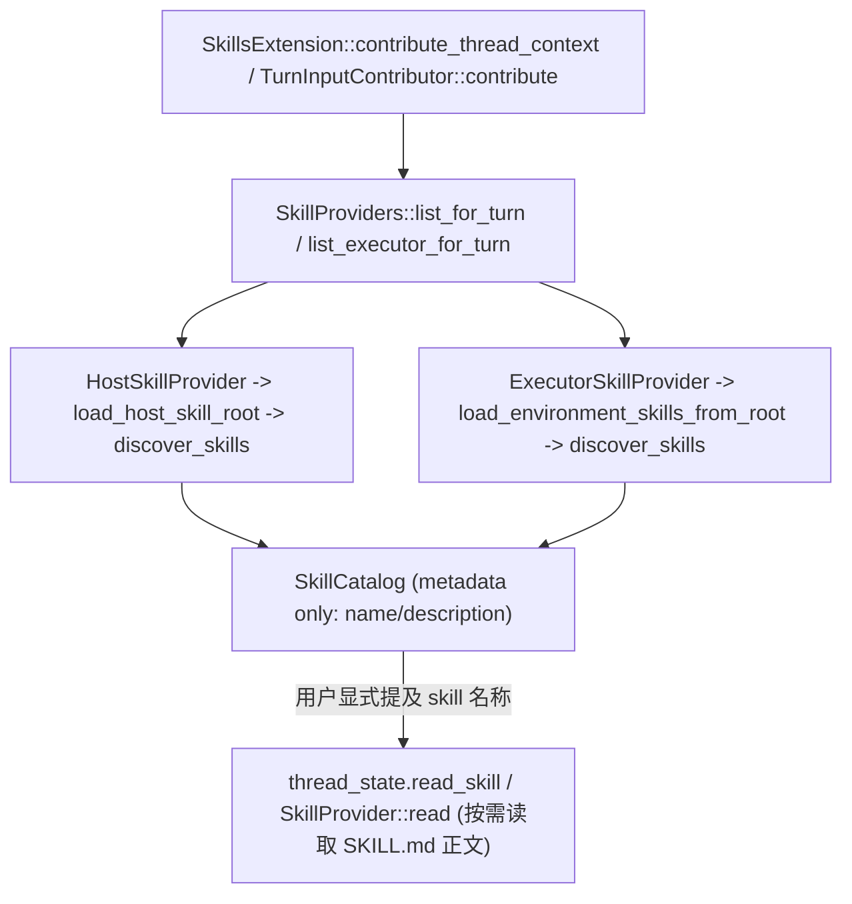
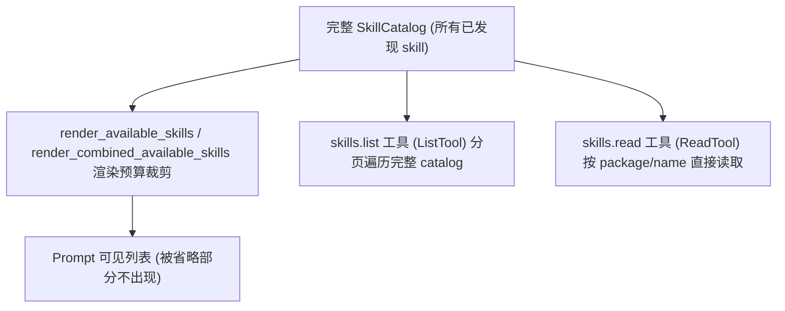

---
tags:
  - openai-codex
  - agent-skills
  - skill-discovery
  - progressive-disclosure
  - context-budget
  - context-compaction
  - deepwiki-qa
  - source-code
---

# DeepWiki Q&A：Skill 的发现、按需加载与渐进披露（openai/codex）

> Source: 用户提供的 DeepWiki Q&A 导出文本（openai/codex；未提供原问答 URL 或源码 commit）
> Collected: 2026-09-22
> Published: Unknown

# DeepWiki Q&A with Code Context for Repository: openai/codex
## Q1
Skill 的发现和按需加载
### Answer
## 回答

Skill 的发现和按需加载主要由 `codex-rs/ext/skills/src/loader` 模块实现，核心流程分为「发现」（discovery）与「加载」（load）两个阶段，分别针对宿主文件系统（Host）和执行器环境（Executor）两类来源。

---

### 1. 发现阶段：`discover_skills`

发现的核心函数是 `discover_skills`，它通过 `EnvironmentAccess::walk` 遍历指定 `root` 目录，按 `SkillDiscoveryOptions`（是否跟随符号链接、是否包含隐藏目录、递归模式）收集所有候选 `SKILL.md` 文件路径 codex:54-96 。

遍历深度受 `MAX_SCAN_DEPTH`、目录数受 `MAX_SKILLS_DIRS_PER_ROOT`、条目数受 `MAX_SKILLS_ENTRIES_PER_ROOT` 限制，避免全量扫描过大目录树 codex:17-18 。

发现过程中还会为每个 skill 判断其元数据文件（`agents/openai.yaml`）是否存在，通过 `discover_skill_metadata` 返回 `Present`/`Absent`/`Probe` 三种状态，用于后续决定是否需要额外探测文件系统 codex:193-219 。

### 2. 两条加载路径

`loader/mod.rs` 中暴露的两个入口函数对应两种来源：

- `load_environment_skills_from_root`：用于 Executor（沙箱执行环境）场景，调用 `discover_skills` 后并发（`buffered(MAX_CONCURRENT_SKILL_LOADS)`）解析每个 skill 的 frontmatter 和依赖，最终生成 `EnvironmentSkillLoadOutcome` codex:113-163 。
- `load_host_skill_root`（在 `loader/host.rs` 中，内部调用 `load_skills_under_root`）：用于宿主文件系统 Skill 根目录（如 `.codex/skills`），同样调用 `discover_skills`，再逐个解析成 `SkillMetadata` codex:146-188 。

两条路径均通过 `SkillNamespaceResolver` 解析插件命名空间前缀（如 `sample:search`），保证同名 skill 在不同插件 / 目录来源之间不冲突 codex:11-28 。

### 3. 「按需」体现在哪里

**按需（懒加载）主要体现在两层：**

1. **元数据 vs 主体内容分离**：发现阶段只读取 `SKILL.md` 的 YAML frontmatter（name/description），完整的 Markdown 正文只有在 skill 被实际调用时才通过 `SkillProvider::read` / `read_main_prompt` 读取 codex:595-619 。这与 `skill-creator` 文档中描述的三阶段披露原则一致（名称/描述 → SKILL.md 正文 → 支持资源） codex:54-58 。

2. **缓存与增量刷新**：`HostSkillsService` 按 cwd/config 维度缓存扫描结果（`cache_by_cwd`、`cache_by_config`），只有配置或路径变化，或显式 `force_reload` 时才重新扫描 codex:177-198 。`SkillsThreadState::refresh_executor_catalog` 对执行器侧同样有缓存判断逻辑（`executor_discovery_catalog_snapshot` 中的 `cached.matches(...)` 判断） codex:183-213 。测试用例 `history_injection_skips_skill_discovery_after_initial_context` 也验证了「首次注入触发发现，后续注入跳过发现」这一按需策略 codex:237-259 。

### 4. 触发调用链

- `SkillsExtension::contribute_thread_context`（`ContextContributor` trait 实现）在每次线程上下文贡献时调用 `list_skills`，进而通过 `self.providers.list_for_turn` / `list_executor_for_turn` 触发发现 codex:201-218 。
- `TurnInputContributor::contribute` 在每一轮对话中根据 `SkillListQuery`（是否已有 `host_snapshot`/`ExecutorSkillsStepState` 缓存）决定是否重新触发 host/executor 发现 codex:376-395 。
- `SkillProviders::list_matching` 是最底层的分发入口，遍历所有已注册的 `SkillProviderSource`（Host/Executor/Cloud）并调用各自的 `provider.list()` codex:154-170 。
- App-server 侧的 `skills_list_response`（用于 IDE/CLI 的 `skills/list` RPC）也复用同一套 `HostSkillsService::for_request().snapshot_for_cwd` 逻辑，支持 `force_reload` 参数手动触发重新发现 codex:515-573 。

### 数据流示意



## Notes

- Discovery（发现）指扫描目录、收集 skill 路径与元数据；Loading（加载）指解析 frontmatter/依赖生成结构化 `SkillMetadata`/`EnvironmentSkillMetadata`；两者都在 `discover_skills` 之上分别针对 Host 和 Executor 场景组合完成 codex:54-58 。
- "按需加载"更准确的说法是 skill 正文内容（main prompt）延迟到调用 `tools/read.rs` 中的 read 工具时才真正读取，而不是发现阶段本身有懒加载开关 codex:224-256 。
- `codex-rs/exec-server/src/capability_discovery.rs` 中的逻辑属于 exec-server 侧对 executor 能力（包括 skills 文件）的底层文件读取支持，是 `load_environment_skills_from_discovery` 的数据来源，与上面讨论的发现流程相连但层级更底层 codex:257-288 。

Wiki pages you might want to explore:
- [Skills System (openai/codex)](/wiki/openai/codex#5.9)
### Citations
**File:** codex-rs/ext/skills/src/loader/discovery.rs (L17-18)
```rust
const MAX_SKILLS_ENTRIES_PER_ROOT: usize = 20_000;
pub(super) const MAX_CONCURRENT_SKILL_LOADS: usize = 64;
```
**File:** codex-rs/ext/skills/src/loader/discovery.rs (L54-96)
```rust
pub(super) async fn discover_skills(
    file_system: &dyn EnvironmentAccess,
    root: &PathUri,
    options: SkillDiscoveryOptions,
) -> SkillDiscovery {
    let empty_discovery = || SkillDiscovery {
        skills: Vec::new(),
        plugin_roots: HashSet::new(),
        namespace_roots: HashSet::new(),
        warnings: Vec::new(),
    };
    let walk = match file_system
        .walk(
            root,
            WalkOptions {
                max_depth: match options.mode {
                    SkillDiscoveryMode::Recursive => MAX_SCAN_DEPTH,
                    SkillDiscoveryMode::DirectChildren => 2,
                },
                max_directories: MAX_SKILLS_DIRS_PER_ROOT,
                max_entries: MAX_SKILLS_ENTRIES_PER_ROOT,
                follow_directory_symlinks: matches!(
                    options.directory_symlinks,
                    DirectorySymlinkPolicy::Follow
                ),
                prune_hidden_directories: matches!(
                    options.hidden_directories,
                    HiddenDirectoryPolicy::Skip
                ),
            },
        )
        .await
    {
        Ok(walk) => walk,
        Err(error) if error.kind() == io::ErrorKind::NotFound => return empty_discovery(),
        Err(error) => {
            let mut discovery = empty_discovery();
            discovery
                .warnings
                .push(format!("failed to walk skills root {root}: {error:#}"));
            return discovery;
        }
    };
```
**File:** codex-rs/ext/skills/src/loader/discovery.rs (L193-219)
```rust
fn discover_skill_metadata(
    skill_path: &PathUri,
    file_paths: &HashSet<PathUri>,
    metadata_directory_parents: &HashSet<PathUri>,
    inventory_complete: bool,
) -> SkillMetadataDiscovery {
    let Some(skill_dir) = skill_path.parent() else {
        return SkillMetadataDiscovery::Absent;
    };
    let Ok(metadata_dir) = skill_dir.join(SKILLS_METADATA_DIR) else {
        return SkillMetadataDiscovery::Absent;
    };
    let Ok(metadata_path) = metadata_dir.join(SKILLS_METADATA_FILENAME) else {
        return SkillMetadataDiscovery::Absent;
    };
    if file_paths.contains(&metadata_path) {
        return SkillMetadataDiscovery::Present(metadata_path);
    }

    if inventory_complete && !metadata_directory_parents.contains(&skill_dir) {
        SkillMetadataDiscovery::Absent
    } else {
        // A complete walk proves ordinary absence, but keep a filesystem probe for case aliases,
        // file symlinks omitted by the walk, and incomplete inventories.
        SkillMetadataDiscovery::Probe(metadata_path)
    }
}
```
**File:** codex-rs/ext/skills/src/loader/environment.rs (L113-163)
```rust
pub async fn load_environment_skills_from_root(
    file_system: &dyn EnvironmentAccess,
    root: &PathUri,
    restriction_product: Option<Product>,
) -> EnvironmentSkillLoadOutcome {
    let mut outcome = EnvironmentSkillLoadOutcome::default();
    // Preserve environment discovery behavior by following directory aliases and including
    // hidden directories exposed by the executor.
    let discovery = discover_skills(
        file_system,
        root,
        SkillDiscoveryOptions {
            directory_symlinks: DirectorySymlinkPolicy::Follow,
            hidden_directories: HiddenDirectoryPolicy::Include,
            mode: SkillDiscoveryMode::Recursive,
        },
    )
    .await;
    tracing::Span::current().record("skill_count", discovery.skills.len());
    outcome.warnings.extend(discovery.warnings);
    if discovery.skills.is_empty() {
        return outcome;
    }

    let skill_paths = discovery
        .skills
        .iter()
        .map(|skill| skill.path.clone())
        .collect::<Vec<_>>();
    let namespace_resolver = SkillNamespaceResolver::discover(
        file_system,
        root,
        &skill_paths,
        discovery.plugin_roots,
        discovery.namespace_roots,
    );

    // Remote executors can multiplex these independent per-skill reads, so polling a bounded
    // number together allows the I/O for each skill and its metadata to happen concurrently.
    let skill_results = futures::stream::iter(discovery.skills)
        .map(|skill| {
            let path = skill.path.clone();
            async move {
                (
                    path,
                    ParsedEnvironmentSkill::load(file_system, &skill).await,
                )
            }
        })
        .buffered(MAX_CONCURRENT_SKILL_LOADS)
        .collect::<Vec<_>>();
```
**File:** codex-rs/ext/skills/src/loader/host.rs (L146-188)
```rust
async fn load_skills_under_root(
    skill_root: &HostSkillRoot,
    root: &AbsolutePathBuf,
) -> (
    Vec<SkillMetadata>,
    Arc<HashMap<AbsolutePathBuf, AbsolutePathBuf>>,
    Vec<SkillError>,
) {
    let file_system = skill_root.file_system.as_ref();
    // TODO(anp): Bind discovery to turn permissions when host skill roots accept an accessor;
    // until then, keep using the same unrestricted filesystem that supplied the root.
    let discovery_access = FileSystemEnvironmentAccessor::unrestricted(&skill_root.file_system);
    let plugin_identity = skill_root.plugin_identity();
    let plugin_root = match skill_root.plugin_root() {
        Some(plugin_root) => Some(canonicalize_for_skill_identity(file_system, plugin_root).await),
        None => None,
    };
    let discovery_mode = skill_root.discovery_mode();
    let directory_symlinks = match skill_root.scope {
        SkillScope::User | SkillScope::Repo | SkillScope::Admin => DirectorySymlinkPolicy::Follow,
        SkillScope::System => DirectorySymlinkPolicy::Ignore,
    };
    let SkillDiscovery {
        skills,
        plugin_roots,
        mut namespace_roots,
        warnings,
    } = discover_skills(
        &discovery_access,
        &PathUri::from_abs_path(root),
        SkillDiscoveryOptions {
            directory_symlinks,
            hidden_directories: HiddenDirectoryPolicy::Skip,
            mode: discovery_mode,
        },
    )
    .await;
    for warning in warnings {
        error!("{warning}");
    }
    if skills.is_empty() {
        return (Vec::new(), Arc::default(), Vec::new());
    }
```
**File:** codex-rs/ext/skills/src/loader/namespace.rs (L11-28)
```rust
/// Resolves the namespace prefix applied to skill names during one skills scan.
///
/// A plugin namespace is the plugin name from the nearest valid plugin manifest
/// above a skill path. For example, a skill named `search` beneath a plugin named
/// `sample` is exposed as `sample:search`.
///
/// Resolving the namespace separately for every `SKILL.md` repeats the same
/// ancestor manifest probes for sibling skills. This resolver resolves relevant
/// roots once per scan, then selects the nearest matching root for each skill.
///
/// Namespace precedence is:
///
/// 1. the deepest matching canonical symlink root or nested plugin root;
/// 2. the namespace inherited from the scanned skills root.
pub(crate) struct SkillNamespaceResolver {
    inherited_namespace: ResolvedSkillNamespace,
    nested_namespaces: Vec<(PathUri, ResolvedSkillNamespace)>,
}
```
**File:** codex-rs/ext/skills/src/extension.rs (L201-218)
```rust
            let catalog = self
                .list_skills(
                    SkillListQuery {
                        turn_id: thread_store.level_id().to_string(),
                        executor_roots: Vec::new(),
                        resolved_executor_roots: Vec::new(),
                        host_snapshot: None,
                        include_host_skills: false,
                        include_bundled_skills: config.bundled_skills_enabled,
                        include_cloud_skills: false,
                        mcp_resources: session_store
                            .get::<SkillsSessionState>()
                            .and_then(|state| state.mcp_resources.clone()),
                        executor_capability_discovery: None,
                    },
                    &thread_state,
                )
                .await;
```
**File:** codex-rs/ext/skills/src/extension.rs (L376-395)
```rust
            let host_snapshot = turn_store.get::<HostSkillsSnapshot>();
            let host_catalog_in_world_state =
                turn_store.get::<HostSkillsCatalogInWorldState>().is_some();
            let host_skills = turn_store.get::<HostSkillsStepState>();
            let query = SkillListQuery {
                turn_id: input.turn_id.clone(),
                executor_roots: Vec::new(),
                resolved_executor_roots: Vec::new(),
                host_snapshot: host_snapshot.clone(),
                include_host_skills: host_skills.is_none() && !host_catalog_in_world_state,
                include_bundled_skills: config.bundled_skills_enabled,
                include_cloud_skills: thread_state.cloud_skill_enabled(),
                mcp_resources: mcp_resources.clone(),
                executor_capability_discovery: None,
            };
            let mut catalog = turn_store
                .get::<ExecutorSkillsStepState>()
                .map(|executor_skills| executor_skills.0.clone())
                .unwrap_or_default();
            catalog.extend(self.list_skills(query, &thread_state).await);
```
**File:** codex-rs/ext/skills/src/extension.rs (L595-619)
```rust
    #[tracing::instrument(level = "trace", skip_all, fields(skill = %entry.name))]
    async fn read_main_prompt(
        &self,
        entry: &SkillCatalogEntry,
        host_snapshot: Option<Arc<HostSkillsSnapshot>>,
        mcp_resources: Option<Arc<McpResourceClient>>,
        thread_state: &SkillsThreadState,
    ) -> Result<SkillReadResult, String> {
        thread_state
            .read_skill(
                &self.providers,
                SkillReadRequest {
                    _lifetime: PhantomData,
                    authority: entry.authority.clone(),
                    package: entry.id.clone(),
                    resource: entry.main_prompt.clone(),
                    resolved_executor_roots: Vec::new(),
                    sandbox: None,
                    host_snapshot,
                    mcp_resources,
                },
            )
            .await
            .map_err(|err| err.message)
    }
```
**File:** codex-rs/skills/src/assets/samples/skill-creator/SKILL.md (L54-58)
```markdown
Skill information is disclosed in three stages:

1. **Name and description:** Available during skill selection, so keep them concise and discriminating.
2. **SKILL.md body:** Loaded when the skill applies, so keep its instructions relevant to that task.
3. **Supporting resources:** Read or execute only when the current task actually needs them.
```
**File:** codex-rs/ext/skills/src/host_service.rs (L177-198)
```rust
    pub async fn snapshot_for_config(
        &self,
        input: &HostSkillsLoadInput,
        fs: Option<Arc<dyn ExecutorFileSystem>>,
    ) -> HostSkillsSnapshot {
        let roots = self.skill_roots_for_config(input, fs).await;
        let skill_config_rules = skill_config_rules_from_stack(&input.config_layer_stack);
        let cache_key = config_skills_cache_key(
            &roots,
            &skill_config_rules,
            input.plugin_skill_snapshots.as_ref(),
        );
        self.snapshot_for_skill_roots(
            input,
            roots,
            &skill_config_rules,
            cache_key,
            /*force_reload*/ false,
            /*request_root_snapshots*/ None,
        )
        .await
    }
```
**File:** codex-rs/ext/skills/src/state.rs (L183-213)
```rust
    async fn executor_discovery_catalog_snapshot(
        &self,
        providers: &SkillProviders,
        query: SkillListQuery,
    ) -> SkillCatalog {
        let discovery = query.executor_capability_discovery.clone();
        let discovery_failed = discovery.as_ref().is_some_and(|discovery| {
            discovery.roots().iter().any(|root| {
                root.result
                    .as_ref()
                    .ok()
                    .is_none_or(|discovered| discovered.error.is_some())
            })
        });
        if !discovery_failed
            && let Some(cached) = self
                .skills_extension_state
                .lock()
                .unwrap_or_else(std::sync::PoisonError::into_inner)
                .executor_discovery_cache
                .as_ref()
                .filter(|cached| {
                    cached.matches(
                        &query.executor_roots,
                        discovery.as_ref(),
                        query.include_bundled_skills,
                    )
                })
        {
            return cached.catalog.clone();
        }
```
**File:** codex-rs/core/tests/suite/skills.rs (L237-259)
```rust
    // A fresh thread still needs full initial context before its first injected item.
    buffer.lock().unwrap().clear();
    test.codex
        .inject_response_items_for_turn(vec![developer_message(FIRST_INSTRUCTIONS)])
        .await?;
    let logs = take_logs()?;
    assert!(
        logs.contains("skills_for_config"),
        "initial injection must discover skills: {logs}"
    );

    test.codex
        .inject_response_items_for_turn(vec![developer_message(SECOND_INSTRUCTIONS)])
        .await?;
    let logs = take_logs()?;
    assert!(
        logs.contains("record_conversation_items"),
        "initialized-history injection must still record the item: {logs}"
    );
    assert!(
        !logs.contains("skills_for_config"),
        "initialized-history injection must skip skill discovery: {logs}"
    );
```
**File:** codex-rs/ext/skills/src/sources.rs (L154-170)
```rust
    async fn list_matching(
        &self,
        query: &SkillListQuery,
        should_list: impl Fn(&SkillProviderSource) -> bool,
    ) -> SkillCatalog {
        let mut catalog = SkillCatalog::default();

        for source in self.sources.iter().filter(|source| should_list(source)) {
            extend_catalog(
                &mut catalog,
                source.provider.list(query.clone()).await,
                source.label.as_str(),
            );
        }

        catalog
    }
```
**File:** codex-rs/app-server/src/request_processors/catalog_processor.rs (L515-573)
```rust
    async fn skills_list_response(
        &self,
        params: SkillsListParams,
    ) -> Result<SkillsListResponse, JSONRPCErrorError> {
        let SkillsListParams { cwds, force_reload } = params;
        let cwds = if cwds.is_empty() {
            vec![self.config.cwd.to_path_buf()]
        } else {
            cwds
        };

        let skills_service = self.thread_manager.skills_service();
        let plugins_manager = self.thread_manager.plugins_manager();
        if force_reload {
            plugins_manager.clear_cache();
            skills_service.clear_cache();
        }
        let fs = self
            .thread_manager
            .environment_manager()
            .default_environment()
            .map(|environment| environment.get_filesystem());
        let skills_request = skills_service.for_request();
        let mut data = futures::stream::iter(cwds.into_iter().enumerate())
            .map(|(index, cwd)| {
                let fs = fs.clone();
                let skills_request = &skills_request;
                let plugins_manager = Arc::clone(&plugins_manager);
                async move {
                    let config = match self.load_latest_config(Some(cwd.clone())).await {
                        Ok(resolved) => resolved,
                        Err(error) => {
                            let error_path = cwd.clone();
                            return (
                                index,
                                codex_app_server_protocol::SkillsListEntry {
                                    cwd,
                                    skills: Vec::new(),
                                    errors: vec![codex_app_server_protocol::SkillErrorInfo {
                                        path: error_path,
                                        message: error.message,
                                    }],
                                },
                            );
                        }
                    };
                    let plugins_input = config.plugins_config_input();
                    let plugins = plugins_manager.plugins_for_config(&plugins_input).await;
                    let plugin_skill_snapshots =
                        plugins_manager.plugin_skill_snapshots_for_config(&plugins_input);
                    let skills_input = codex_skills_extension::HostSkillsLoadInput::new(
                        config.cwd.clone(),
                        plugins.effective_plugin_skill_roots(),
                        config.config_layer_stack,
                    )
                    .with_plugin_skill_snapshots(plugin_skill_snapshots);
                    let snapshot = skills_request
                        .snapshot_for_cwd(&skills_input, force_reload, fs)
                        .await;
```
**File:** codex-rs/ext/skills/src/tools/read.rs (L224-256)
```rust
                        self.context
                            .shadow_selection
                            .record_invocation(&state, main_prompt.as_str());
                    }
                    let start = parse_pagination_cursor(
                        args.cursor.as_deref(),
                        result.contents.as_str(),
                        "skills.read",
                    )?;
                    (Arc::new(result), start)
                }
            };
            if start > result.contents.len() || !result.contents.is_char_boundary(start) {
                return Err(FunctionCallError::RespondToModel(
                    "skills.read cursor is invalid".to_string(),
                ));
            }
            let skill_root = if output_authority == super::SkillToolAuthoritySelector::Executor {
                main_prompt
                    .environment_path()
                    .and_then(|(_, path)| path.parent())
                    .map(|path| path.inferred_native_path_string())
            } else {
                None
            };
            let response = page_response(
                result.resource.as_str(),
                &result.contents,
                skill_root.as_deref(),
                start,
                response_byte_budget,
            )?;
            let output = skill_json_output(&response, output_authority)?;
```
**File:** codex-rs/exec-server/src/capability_discovery.rs (L257-288)
```rust
    for skill_path in skill_paths {
        let Some(instructions) = read_optional_text_file(
            file_system,
            skill_path.clone(),
            sandbox,
            &mut budget,
            &mut discovery.warnings,
        )
        .await
        else {
            continue;
        };
        let metadata = match skill_path
            .parent()
            .and_then(|skill_dir| skill_dir.join(SKILL_METADATA_PATH).ok())
        {
            Some(metadata_path) => {
                read_optional_text_file(
                    file_system,
                    metadata_path,
                    sandbox,
                    &mut budget,
                    &mut discovery.warnings,
                )
                .await
            }
            None => None,
        };
        discovery.skills.push(DiscoveredSkillFiles {
            instructions,
            metadata,
        });
```
## Q2
假设 skill 太多影响上下文，处理方式是什么呢
### Answer
## 回答

当 skill 数量过多导致上下文（prompt）超出预算时，Codex 在 `codex-rs/ext/skills/src/render.rs` 中通过**预算裁剪 + 描述截断 + 条目省略 + 路径别名压缩**四层机制来控制注入到模型上下文的 skill 元数据大小,而不是限制发现/加载阶段。

---

### 1. 先计算预算

`skill_metadata_budget` 根据模型上下文窗口大小或配置的 `max_context_tokens`，返回按 token 或字符数计的预算上限，默认字符预算为 8000，token 预算为上下文窗口的 2%（上限 10000） codex:17-27 。

### 2. 描述按轮询分配字符

`allocate_description_chars` 以 round-robin 方式为每个 skill 的描述分配剩余字符预算,避免单个 skill 描述独占空间 codex:404-443 。

### 3. 超预算时省略部分 skill 条目

`render_available_skills` 按 `SkillCatalogRenderPolicy` 排序后渲染；若预算不足，会先尝试路径别名压缩（`build_aliased_catalog`）来节省字节，只有别名渲染更优时才采用 codex:488-533 。当多来源（executor/cloud/host）组合渲染时，`render_combined_available_skills` 会尝试多种别名组合方案，比较 `included_count`/截断字符数/成本，选出保留 skill 最多、截断最少的方案 codex:536-655 ，比较逻辑在 `combined_render_is_better` 中实现（优先比较三个来源各自 `included_count`，其次比较截断字符总数，最后比较总成本） codex:825-855 。

依然超预算时，会走到"省略"（omission）路径：`reserve_non_host_omission_marker` 在预算不足时逐步把已分配描述字符的条目标记为 `Omitted`，直到能容纳一条"N 个 skill 被省略"的提示行为止 codex:884-918 ，最终由 `render_combined_group` 汇总生成带 `omitted_count` 的 `SkillRenderReport` codex:751-780 。

### 4. 极端压力下：整个来源被省略并产生警告

在核心提取流程 `SkillsExtension` 中（`codex-rs/ext/skills/src/extension.rs`），若渲染结果 `rendered.warning_message` 非空，会通过 `self.emit_warning` 上报给用户/日志，同时把警告文本推入 `warnings` 列表随 turn 状态保存 codex:437-451 。测试 `production_turn_omits_executor_skills_after_host_skills_under_extreme_pressure` 验证了极端预算压力下，host skill 会被整体省略、仅保留部分 executor skill,并附带类似 "Host skills are available but omitted from the model-visible skills list because the skills context budget was exceeded" 的说明性提示 codex:3059-3083 ；另一个测试 `production_turn_omits_host_skills_before_executor_skills_under_extreme_mixed_pressure` 显示当压力更极端时，会先省略 host 侧再省略 executor 侧,并触发"Exceeded skills context budget..."警告 codex:3085-3114 。集成测试 `skills_extension.rs` 中也验证了当描述全部被移除后仍超限时，会明确报出"N 个 additional skills were not included"的警告消息 codex:1552-1585 。

## Notes

- 这套机制作用于**渲染阶段**（即将 catalog 转换为 prompt 文本时），而不是发现/加载阶段——所有 skill 依然会被发现和索引，只是超预算时其元数据（name+description）不会全部进入模型可见的 prompt codex:488-502 。
- 单元测试 `catalog_budget_uses_context_percentage_or_character_fallback` 和 `omission_notice_follows_render_policy_and_is_charged_to_catalog_budget` 直观展示了不同预算下的具体行为差异（`CoreCompatible` 策略不显示"omitted"提示，`ExtensionCompatible` 策略会） codex:874-912 。
- 别名压缩（aliasing）是另一种降低 metadata 体积的方式：把多个 skill 共享的长路径前缀替换为短别名（如 `e0`、`c0`、`r0`），在 `mixed_catalogs_alias_all_skill_sources_under_budget_pressure` 测试中可看到具体效果 codex:624-712 ，这与上一轮讨论的"按需加载正文"是互补机制，但重点不同：别名/截断/省略解决的是**元数据列表**过大的问题,而"按需读取正文"解决的是**单个 skill 内容**过大的问题。

Wiki pages you might want to explore:
- [Skills System (openai/codex)](/wiki/openai/codex#5.9)
### Citations
**File:** codex-rs/ext/skills/src/render.rs (L17-27)
```rust
const DEFAULT_SKILL_METADATA_CHAR_BUDGET: usize = 8_000;
const MAX_CONFIGURED_SKILL_METADATA_TOKEN_BUDGET: usize = 10_000;
const MAX_SKILL_PROMPT_BYTES: usize = 8_000;
const SKILL_METADATA_CONTEXT_WINDOW_PERCENT: usize = 2;
const MAX_CATALOG_SKILL_DESCRIPTION_CHARS: usize = 1_024;
const TRUNCATED_SKILL_DESCRIPTION_SUFFIX: &str = "...";
const APPROX_BYTES_PER_TOKEN: usize = 4;
const SKILL_DESCRIPTIONS_REMOVED_WARNING_PREFIX: &str =
    "Exceeded skills context budget. All skill descriptions were removed and";
pub(crate) const MAX_SKILL_NAME_BYTES: usize = 256;
pub(crate) const MAX_SKILL_PATH_BYTES: usize = 1_024;
```
**File:** codex-rs/ext/skills/src/render.rs (L404-443)
```rust
fn allocate_description_chars(
    budget: SkillMetadataBudget,
    skill_lines: &[SkillLine<'_>],
    limit: usize,
) -> Vec<usize> {
    let budget_lines = skill_lines
        .iter()
        .map(|line| DescriptionBudgetLine::new(line, budget))
        .collect::<Vec<_>>();
    let mut char_allocations = vec![0usize; budget_lines.len()];
    let mut current_extra_costs = vec![0usize; budget_lines.len()];
    let mut remaining = limit;

    // Distribute description space round-robin so no skill monopolizes the
    // remaining budget.
    loop {
        let mut changed = false;
        for (index, line) in budget_lines.iter().enumerate() {
            if char_allocations[index] >= line.description_char_count {
                continue;
            }

            let next_chars = char_allocations[index].saturating_add(1);
            let next_cost = line.extra_costs[next_chars];
            let delta = next_cost.saturating_sub(current_extra_costs[index]);
            if delta <= remaining {
                char_allocations[index] = next_chars;
                current_extra_costs[index] = next_cost;
                remaining = remaining.saturating_sub(delta);
                changed = true;
            }
        }

        if !changed {
            break;
        }
    }

    char_allocations
}
```
**File:** codex-rs/ext/skills/src/render.rs (L488-533)
```rust
pub(crate) fn render_available_skills(
    catalog: &SkillCatalog,
    policy: SkillCatalogRenderPolicy,
    budget: SkillMetadataBudget,
    include_skills_usage_instructions: bool,
) -> Option<AvailableSkillsRender> {
    let mut entries = catalog
        .entries
        .iter()
        .filter(|entry| entry.is_model_visible())
        .collect::<Vec<_>>();
    policy.order_entries(&mut entries);
    if entries.is_empty() {
        return None;
    }

    let absolute = render_catalog(
        entries
            .iter()
            .map(|entry| SkillLine::new(entry, policy))
            .collect(),
        budget,
        Vec::new(),
        SkillPromptKind::Unaliased,
        policy,
    );
    let selected = if let Some(aliased) =
        build_aliased_catalog(&entries, policy, budget, include_skills_usage_instructions)
        && aliased_render_is_better(
            &aliased,
            &absolute,
            budget,
            include_skills_usage_instructions,
        ) {
        aliased
    } else {
        absolute
    };

    Some(AvailableSkillsRender {
        prompt_kind: selected.prompt_kind,
        skill_root_lines: selected.skill_root_lines,
        skill_lines: selected.skill_lines,
        preserve_empty_fragment: policy == SkillCatalogRenderPolicy::CoreCompatible,
        report: selected.report,
    })
```
**File:** codex-rs/ext/skills/src/render.rs (L536-655)
```rust
pub(crate) fn render_combined_available_skills(
    executor_catalog: &SkillCatalog,
    cloud_catalog: &SkillCatalog,
    host_catalog: &SkillCatalog,
    budget: SkillMetadataBudget,
    include_skills_usage_instructions: bool,
) -> RenderedSkillCatalogs {
    let mut executor_entries = executor_catalog
        .entries
        .iter()
        .filter(|entry| entry.is_model_visible())
        .collect::<Vec<_>>();
    let mut cloud_entries = cloud_catalog
        .entries
        .iter()
        .filter(|entry| entry.is_model_visible())
        .collect::<Vec<_>>();
    let mut host_entries = host_catalog
        .entries
        .iter()
        .filter(|entry| entry.is_model_visible())
        .collect::<Vec<_>>();
    SkillCatalogRenderPolicy::ExtensionCompatible.order_entries(&mut executor_entries);
    SkillCatalogRenderPolicy::ExtensionCompatible.order_entries(&mut cloud_entries);
    SkillCatalogRenderPolicy::CoreCompatible.order_entries(&mut host_entries);
    let nonempty_catalog_count = [
        !executor_entries.is_empty(),
        !cloud_entries.is_empty(),
        !host_entries.is_empty(),
    ]
    .into_iter()
    .filter(|nonempty| *nonempty)
    .count();
    if nonempty_catalog_count <= 1 {
        return RenderedSkillCatalogs {
            executor: render_available_skills(
                executor_catalog,
                SkillCatalogRenderPolicy::ExtensionCompatible,
                budget,
                include_skills_usage_instructions,
            ),
            cloud: render_available_skills(
                cloud_catalog,
                SkillCatalogRenderPolicy::ExtensionCompatible,
                budget,
                include_skills_usage_instructions,
            ),
            host: render_available_skills(
                host_catalog,
                SkillCatalogRenderPolicy::CoreCompatible,
                budget,
                include_skills_usage_instructions,
            ),
        };
    }

    let extension_policy = SkillCatalogRenderPolicy::ExtensionCompatible;
    let host_policy = SkillCatalogRenderPolicy::CoreCompatible;
    let absolute = render_combined_lines(
        CatalogLines::unaliased(&executor_entries, extension_policy),
        CatalogLines::unaliased(&cloud_entries, extension_policy),
        CatalogLines::unaliased(&host_entries, host_policy),
        budget,
    );

    let mut selected = absolute;
    let host_only_aliases = build_aliased_combined_catalog(
        CatalogLines::unaliased(&executor_entries, extension_policy),
        CatalogLines::unaliased(&cloud_entries, extension_policy),
        CatalogLines::aliased(&host_entries, host_policy),
        budget,
        include_skills_usage_instructions,
    );
    let executor_only_aliases = build_aliased_combined_catalog(
        CatalogLines::aliased(&executor_entries, extension_policy),
        CatalogLines::unaliased(&cloud_entries, extension_policy),
        CatalogLines::unaliased(&host_entries, host_policy),
        budget,
        include_skills_usage_instructions,
    );
    let cloud_only_aliases = build_aliased_combined_catalog(
        CatalogLines::unaliased(&executor_entries, extension_policy),
        CatalogLines::aliased(&cloud_entries, extension_policy),
        CatalogLines::unaliased(&host_entries, host_policy),
        budget,
        include_skills_usage_instructions,
    );
    let all_source_aliases = build_aliased_combined_catalog(
        CatalogLines::aliased(&executor_entries, extension_policy),
        CatalogLines::aliased(&cloud_entries, extension_policy),
        CatalogLines::aliased(&host_entries, host_policy),
        budget,
        include_skills_usage_instructions,
    );

    for candidate in [
        host_only_aliases,
        executor_only_aliases,
        cloud_only_aliases,
        all_source_aliases,
    ]
    .into_iter()
    .flatten()
    {
        if combined_render_is_better(
            &candidate,
            &selected,
            budget,
            include_skills_usage_instructions,
        ) {
            selected = candidate;
        }
    }

    RenderedSkillCatalogs {
        executor: Some(selected.executor),
        cloud: Some(selected.cloud),
        host: Some(selected.host),
    }
}
```
**File:** codex-rs/ext/skills/src/render.rs (L751-780)
```rust
fn render_combined_group(
    skill_lines: &[SkillLine<'_>],
    allocations: &[SkillLineAllocation],
    prompt_kind: SkillPromptKind,
    skill_root_lines: Vec<String>,
    omission_marker: Option<String>,
) -> AvailableSkillsRender {
    let RenderedSkillLines {
        mut lines,
        omitted_count,
        truncated_description_chars,
        truncated_description_count,
    } = render_allocated_skill_lines(skill_lines, allocations);
    if let Some(marker) = omission_marker {
        lines.push(RenderedSkillLine { line: marker });
    }
    AvailableSkillsRender {
        prompt_kind,
        skill_root_lines,
        skill_lines: lines.into_iter().map(|rendered| rendered.line).collect(),
        preserve_empty_fragment: false,
        report: SkillRenderReport {
            total_count: skill_lines.len(),
            included_count: skill_lines.len().saturating_sub(omitted_count),
            omitted_count,
            truncated_description_chars,
            truncated_description_count,
        },
    }
}
```
**File:** codex-rs/ext/skills/src/render.rs (L825-855)
```rust
fn combined_render_is_better(
    candidate: &CombinedAvailableSkillsRender,
    current: &CombinedAvailableSkillsRender,
    budget: SkillMetadataBudget,
    include_skills_usage_instructions: bool,
) -> bool {
    let priority = |rendered: &CombinedAvailableSkillsRender| {
        (
            rendered.executor.report.included_count,
            rendered.cloud.report.included_count,
            rendered.host.report.included_count,
        )
    };
    if priority(candidate) != priority(current) {
        return priority(candidate) > priority(current);
    }

    let truncated_chars = |rendered: &CombinedAvailableSkillsRender| {
        [&rendered.executor, &rendered.cloud, &rendered.host]
            .into_iter()
            .fold(0usize, |total, catalog| {
                total.saturating_add(catalog.report.truncated_description_chars)
            })
    };
    if truncated_chars(candidate) != truncated_chars(current) {
        return truncated_chars(candidate) < truncated_chars(current);
    }

    combined_available_skills_cost(budget, candidate, include_skills_usage_instructions)
        < combined_available_skills_cost(budget, current, include_skills_usage_instructions)
}
```
**File:** codex-rs/ext/skills/src/render.rs (L884-918)
```rust
fn reserve_non_host_omission_marker(
    skill_lines: &[SkillLine<'_>],
    executor_end: usize,
    cloud_end: usize,
    budget: SkillMetadataBudget,
    allocations: &mut [SkillLineAllocation],
) -> Option<String> {
    loop {
        let omitted_count = allocations[..cloud_end]
            .iter()
            .filter(|allocation| matches!(allocation, SkillLineAllocation::Omitted))
            .count();
        if omitted_count == 0 {
            return None;
        }

        let marker = omission_marker(omitted_count);
        let used = allocated_skill_lines_cost(skill_lines, allocations, budget);
        if used.saturating_add(metadata_line_cost(budget, &marker)) <= budget.limit() {
            return Some(marker);
        }

        let index = (cloud_end..allocations.len())
            .rev()
            .chain((executor_end..cloud_end).rev())
            .chain((0..executor_end).rev())
            .find(|index| {
                matches!(
                    allocations[*index],
                    SkillLineAllocation::DescriptionChars(_)
                )
            })?;
        allocations[index] = SkillLineAllocation::Omitted;
    }
}
```
**File:** codex-rs/ext/skills/src/extension.rs (L437-451)
```rust
                let rendered = render_catalog(
                    extension_metrics.as_deref(),
                    CatalogSurface::TurnInput,
                    &turn_catalog,
                    include_usage,
                    SkillCatalogRenderPolicy::ExtensionCompatible,
                    metadata_budget,
                );
                if let Some(message) = rendered.warning_message {
                    self.emit_warning(thread_store.level_id(), Some(&input.turn_id), message);
                }
                if let Some(fragment) = rendered.fragment {
                    fragments.push(Box::new(fragment));
                }
            }
```
**File:** codex-rs/core/tests/suite/skills_extension.rs (L3059-3083)
```rust
#[tokio::test(flavor = "multi_thread", worker_threads = 2)]
async fn production_turn_omits_executor_skills_after_host_skills_under_extreme_pressure()
-> Result<()> {
    let (developer_texts, _) = rendered_catalogs(
        &HOST_CATALOG,
        &EXECUTOR_CATALOG,
        MIXED_EXECUTOR_OMITTING_CONTEXT_WINDOW,
    )
    .await?;
    let host_lines = developer_texts
        .iter()
        .flat_map(|text| skill_lines(text, "host"))
        .collect::<Vec<_>>();
    let executor_text = executor_omission_text(&developer_texts);
    let executor_lines = skill_lines(executor_text, "exec");

    assert_eq!(skill_names(&host_lines), Vec::<&str>::new());
    assert_eq!(skill_names(&executor_lines), vec!["exec-alpha"]);
    assert!(executor_text.contains("- 5 additional skills omitted from this bounded skills list."));
    assert!(developer_texts.iter().any(|text| text.contains(
        "Host skills are available but omitted from the model-visible skills list because the skills context budget was exceeded."
    )));

    Ok(())
}
```
**File:** codex-rs/core/tests/suite/skills_extension.rs (L3085-3114)
```rust
#[tokio::test(flavor = "multi_thread", worker_threads = 2)]
async fn production_turn_omits_host_skills_before_executor_skills_under_extreme_mixed_pressure()
-> Result<()> {
    let (developer_texts, warning_messages) = rendered_catalogs(
        &HOST_CATALOG,
        &EXECUTOR_CATALOG,
        MIXED_HOST_OMITTING_CONTEXT_WINDOW,
    )
    .await?;
    let host_lines = skill_lines(catalog_text(&developer_texts, "host"), "host");
    let executor_lines = skill_lines(catalog_text(&developer_texts, "exec"), "exec");

    assert_eq!(
        skill_names(&host_lines),
        vec!["host-alpha", "host-beta", "host-delta"]
    );
    assert_eq!(
        skill_names(&executor_lines),
        EXECUTOR_CATALOG
            .iter()
            .map(|(name, _)| *name)
            .collect::<Vec<_>>()
    );
    assert!(warning_messages.contains(
        &"Exceeded skills context budget. All skill descriptions were removed and 1 additional skill was not included in the model-visible skills list."
            .to_string()
    ));

    Ok(())
}
```
**File:** codex-rs/ext/skills/tests/skills_extension.rs (L1552-1585)
```rust
    let included_cloud_count = cloud
        .body()
        .lines()
        .filter(|line| line.starts_with("- cloud-skill-"))
        .count();
    assert_eq!(40, included_executor_count);
    assert!(included_cloud_count > 0);
    assert!(included_cloud_count < 160);
    assert!(
        executor
            .body()
            .contains("- executor-skill-039: (executor package:")
    );
    assert!(cloud.body().contains("- cloud-skill-000: (cloud package:"));
    assert!(!cloud.body().contains("- cloud-skill-159:"));
    for rendered in [executor.body(), cloud.body()] {
        assert!(!rendered.contains("description-"));
    }
    assert!(
        cloud
            .body()
            .contains("additional skills omitted from this bounded skills list")
    );
    let omitted_count = 200 - included_executor_count - included_cloud_count;
    let warning = event_rx.try_recv()?.into_warning();
    assert_eq!(warning.thread_id, "thread");
    assert_eq!(warning.turn_id.as_deref(), Some("turn-1"));
    assert_eq!(
        warning.message,
        format!(
            "Exceeded skills context budget. All skill descriptions were removed and {omitted_count} additional skills were not included in the model-visible skills list."
        )
    );
    assert!(event_rx.try_recv().is_err());
```
**File:** codex-rs/ext/skills/src/render_tests.rs (L624-712)
```rust
#[test]
fn mixed_catalogs_alias_all_skill_sources_under_budget_pressure() {
    let executor_root =
        "skill://executor-environment-with-a-long-shared-root/workspaces/project/.agents/skills";
    let cloud_root = "skill://plugin_connector_1p_2330815c823c8191941e5dc465bb899f";
    let host_root = "/Users/test/.codex/plugins/cache/openai-curated/example/hash1234567890/skills";
    let catalog =
        |source: SkillSourceKind, authority: &str, root: &str, prefix: &str| SkillCatalog {
            entries: (0..3)
                .map(|index| {
                    let name = format!("{prefix}-{index}");
                    let package = format!("{root}/{name}");
                    let locator = match source {
                        SkillSourceKind::Cloud => package.clone(),
                        SkillSourceKind::Host
                        | SkillSourceKind::Executor
                        | SkillSourceKind::Custom(_) => format!("{package}/SKILL.md"),
                    };
                    SkillCatalogEntry::new(
                        SkillPackageId(package),
                        SkillAuthority::new(source.clone(), authority),
                        name,
                        "Description.",
                        SkillResourceId::new(locator.clone()),
                    )
                    .with_display_path(locator)
                    .with_alias_root(root)
                })
                .collect(),
            warnings: Vec::new(),
        };
    let executor_catalog = catalog(
        SkillSourceKind::Executor,
        "executor-environment",
        executor_root,
        "executor",
    );
    let cloud_catalog = catalog(SkillSourceKind::Cloud, "codex_apps", cloud_root, "cloud");
    let host_catalog = catalog(SkillSourceKind::Host, "host", host_root, "host");

    let rendered = render_combined_available_skills(
        &executor_catalog,
        &cloud_catalog,
        &host_catalog,
        SkillMetadataBudget::Characters(900),
        /*include_skills_usage_instructions*/ true,
    );
    let executor = rendered.executor.expect("executor catalog should render");
    let cloud = rendered.cloud.expect("cloud catalog should render");
    let host = rendered.host.expect("host catalog should render");

    assert_eq!(
        executor.skill_root_lines,
        vec![format!("- `e0` = `{executor_root}`")]
    );
    assert_eq!(
        cloud.skill_root_lines,
        vec![format!("- `c0` = `{cloud_root}`")]
    );
    assert_eq!(
        host.skill_root_lines,
        vec![format!("- `r0` = `{host_root}`")]
    );
    assert!(
        executor
            .skill_lines
            .iter()
            .any(|line| line.contains("(executor package: e0/executor-0)"))
    );
    assert!(
        cloud
            .skill_lines
            .iter()
            .any(|line| line.contains("(cloud package: c0/cloud-0)"))
    );
    assert!(
        host.skill_lines
            .iter()
            .any(|line| line.contains("(file: r0/host-0/SKILL.md)"))
    );
    assert_eq!(
        (
            executor.report.included_count,
            cloud.report.included_count,
            host.report.included_count,
        ),
        (3, 3, 3)
    );
}
```
**File:** codex-rs/ext/skills/src/render_tests.rs (L874-912)
```rust
#[test]
fn omission_notice_follows_render_policy_and_is_charged_to_catalog_budget() {
    let catalog = SkillCatalog {
        entries: (0..20)
            .map(|index| {
                entry(
                    &format!("skill-{index:02}"),
                    "A description long enough to put the catalog under budget pressure.",
                    /*short_description*/ None,
                )
            })
            .collect(),
        warnings: Vec::new(),
    };
    let core_fragment = available_skills_fragment(
        &catalog,
        /*include_skills_usage_instructions*/ false,
        SkillCatalogRenderPolicy::CoreCompatible,
        SkillMetadataBudget::Tokens(100),
    )
    .expect("core-compatible catalog should render");
    let fragment = available_skills_fragment(
        &catalog,
        /*include_skills_usage_instructions*/ false,
        SkillCatalogRenderPolicy::ExtensionCompatible,
        SkillMetadataBudget::Tokens(100),
    )
    .expect("catalog should render");
    let rendered_metadata_cost = fragment
        .body()
        .lines()
        .filter(|line| line.starts_with("- "))
        .map(|line| approx_token_count(&format!("{line}\n")))
        .sum::<usize>();

    assert!(!core_fragment.body().contains("additional skills omitted"));
    assert!(fragment.body().contains("additional skills omitted"));
    assert!(rendered_metadata_cost <= 100);
}
```
## Q3
被省略的 skill 条目怎么被发现和使用呢
### Answer
## 回答

被省略的 skill **并没有真正消失**——它们只是没有出现在渲染进模型 system/developer prompt 的「可用 skill 列表」文本里，但完整的 `SkillCatalog`（含所有条目）依然存在于 `SkillsTurnState.catalog` 中 codex:448-454 。模型仍可以通过 `skills.list` / `skills.read` 工具主动查询和调用这些被省略的 skill。

---

## 详细说明

### 1. 渲染省略 ≠ 目录省略

上一轮讨论的 `render_available_skills` / `render_combined_available_skills` 只是从**已发现的完整 catalog** 中过滤出 `is_model_visible()` 的条目来渲染成 prompt 文本，超预算时把部分条目标记为 `Omitted` codex:488-502 。渲染结果只影响放入 prompt 的文字，`SkillsTurnState` 里保存的仍是完整未省略的 `catalog` 和 `selected_entries` codex:543-551 。

### 2. 通过 `skills.list` 工具分页发现

`ListTool`(`tools/list.rs`)是模型可调用的工具，它直接从 `self.context.catalog(&call.turn_id, args.authority)` 拿到完整目录，过滤 `is_model_visible()` 后按 `MAX_SKILLS_PER_PAGE = 20` 分页返回，并支持 `cursor` 继续翻页 codex:31-98 。这意味着即便某个 skill 因为 prompt 预算被省略，模型依然可以调用 `skills.list` 主动列出该 skill 的 `package`/`name`/`description`/`main_resource` codex:215-231 。分页逐条打包响应体，若单页仍超出 `response_byte_budget` 则逐步减小分页大小,甚至丢弃部分 warning，保证响应不会超过字节预算 codex:128-196 。

### 3. 通过 `skills.read` 直接按名调用

即便某个 skill 被 `hidden_from_prompt()`（对模型不可见）或因预算被省略于展示列表之外，只要模型知道其名字（比如用户显式提到 `$skill-name`），`ReadTool`（`tools/read.rs`）仍可以按 package/name 直接查找并读取其 `main_prompt` 内容 codex:104-123 。集成测试 `prompt_hidden_skill_can_still_be_invoked` 直接验证了这一点：一个 `hidden_from_prompt()` 的 skill 不会出现在渲染的 fragment 里，但用户输入 `$hidden-skill` 后依然能触发它的 `<name>hidden-skill</name>` 指令注入及对应的 read 请求 codex:2385-2463 。虽然该测试用的是 `hidden_from_prompt` 而不是预算省略，但两者共享同一条底层机制——catalog 全量保留、仅渲染阶段过滤，因此原理相通。

### 数据流



## Notes

- `skills.list`/`skills.read` 是模型可主动调用的工具（tool call），而不是自动注入的 prompt 文本；这意味着"发现"被省略 skill 依赖模型自己决定去调用这些工具,而不是自动重新出现在 context 里 codex:66-76 。
- `codex-rs/ext/skills/tests/skills_extension.rs` 中 `prompt_hidden_skill_can_still_be_invoked` 测试的是 `hidden_from_prompt` 场景而非预算省略场景，但代码路径相同（catalog 保留 + 按需 read），可作为理解省略条目仍可被使用的参考。

Wiki pages you might want to explore:
- [Skills System (openai/codex)](/wiki/openai/codex#5.9)
### Citations
**File:** codex-rs/ext/skills/src/state.rs (L448-454)
```rust
#[derive(Clone, Debug, Default, PartialEq, Eq)]
pub(crate) struct SkillsTurnState {
    pub(crate) catalog: SkillCatalog,
    pub(crate) selected_entries: Vec<SkillCatalogEntry>,
    pub(crate) warnings: Vec<String>,
    pub(crate) main_prompts_injected: bool,
}
```
**File:** codex-rs/ext/skills/src/render.rs (L488-502)
```rust
pub(crate) fn render_available_skills(
    catalog: &SkillCatalog,
    policy: SkillCatalogRenderPolicy,
    budget: SkillMetadataBudget,
    include_skills_usage_instructions: bool,
) -> Option<AvailableSkillsRender> {
    let mut entries = catalog
        .entries
        .iter()
        .filter(|entry| entry.is_model_visible())
        .collect::<Vec<_>>();
    policy.order_entries(&mut entries);
    if entries.is_empty() {
        return None;
    }
```
**File:** codex-rs/ext/skills/src/extension.rs (L543-551)
```rust
            turn_store.insert(SkillsTurnState {
                catalog,
                selected_entries,
                warnings,
                main_prompts_injected,
            });
            if !injected_host_skill_prompts.is_empty() {
                turn_store.insert(injected_host_skill_prompts);
            }
```
**File:** codex-rs/ext/skills/src/tools/list.rs (L31-98)
```rust
const TOOL_NAME: &str = "list";
const MAX_SKILLS_PER_PAGE: usize = 20;
const OVERSIZED_ENTRY_WARNING: &str =
    "Some skills were omitted because their metadata is too large.";

#[derive(Deserialize, JsonSchema)]
#[serde(deny_unknown_fields)]
struct ListArgs {
    authority: SkillToolAuthoritySelector,
    cursor: Option<String>,
}

#[derive(Clone, Debug, Eq, Hash, JsonSchema, PartialEq, Serialize)]
#[schemars(deny_unknown_fields)]
struct ListedSkill {
    authority: SkillToolAuthority,
    package: String,
    name: String,
    description: String,
    main_resource: String,
}

#[derive(Debug, Eq, JsonSchema, PartialEq, Serialize)]
#[schemars(deny_unknown_fields)]
struct ListResponse {
    skills: Vec<ListedSkill>,
    warnings: Vec<String>,
    next_cursor: Option<String>,
}

#[derive(Clone)]
pub(super) struct ListTool {
    pub(super) context: SkillToolContext,
}

impl<'call> ToolExecutor<ToolCall<'call>> for ListTool {
    fn tool_name(&self) -> ToolName {
        skill_tool_name(TOOL_NAME)
    }

    fn spec(&self) -> ToolSpec {
        skill_function_tool::<ListArgs, ListResponse>(
            TOOL_NAME,
            "List skills owned by the requested authority. Returns each skill's authority, package, and main_resource. Pass the package to skills.read, and pass next_cursor back as cursor to continue.",
        )
    }

    fn handle<'a>(&'a self, call: ToolCall<'call>) -> ToolExecutorFuture<'a>
    where
        'call: 'a,
    {
        Box::pin(async move {
            let args: ListArgs = parse_args(&call)?;
            let response_byte_budget = call.response_byte_budget(MAX_SKILL_RESPONSE_BYTES);
            let catalog = self.context.catalog(&call.turn_id, args.authority).await;
            let mut omitted_oversized_entry = false;
            let canonical_skills = catalog
                .entries
                .into_iter()
                .filter(|entry| {
                    entry.is_model_visible() && args.authority.matches(&entry.authority)
                })
                .filter_map(|entry| {
                    let listed = listed_skill(entry);
                    omitted_oversized_entry |= listed.is_none();
                    listed
                })
                .collect::<Vec<_>>();
```
**File:** codex-rs/ext/skills/src/tools/list.rs (L128-196)
```rust
            let mut skills = Vec::with_capacity(canonical_skills.len().saturating_sub(start));
            // The final retained skill needs no cursor, even if later entries are oversized.
            for (index, skill) in canonical_skills.iter().enumerate().skip(start).rev() {
                let next_cursor = (!skills.is_empty()).then(|| cursor_at(index.saturating_add(1)));
                if single_entry_response_is_bounded(skill, response_byte_budget, next_cursor) {
                    skills.push((index, skill));
                } else {
                    omitted_oversized_entry = true;
                }
            }
            skills.reverse();
            let mut provider_warnings = if args.cursor.is_none() {
                bounded_warnings(&catalog.warnings)
            } else {
                Vec::new()
            };
            let omission_warning = (omitted_oversized_entry
                && previous_byte_budget != Some(response_byte_budget))
            .then_some(OVERSIZED_ENTRY_WARNING);
            let mut end = MAX_SKILLS_PER_PAGE.min(skills.len());
            loop {
                let mut response = ListResponse {
                    skills: skills[..end]
                        .iter()
                        .map(|(_, skill)| (*skill).clone())
                        .collect(),
                    warnings: provider_warnings
                        .iter()
                        .cloned()
                        .chain(omission_warning.map(str::to_string))
                        .collect(),
                    next_cursor: (end < skills.len())
                        .then(|| cursor_at(skills[end.saturating_sub(1)].0.saturating_add(1))),
                };
                if serialized_len(&response)? <= response_byte_budget {
                    return skill_json_output(&response, args.authority);
                }
                if end > 1 {
                    end = end.saturating_sub(1);
                } else if provider_warnings.len() > 1 {
                    provider_warnings.pop();
                } else if !response.warnings.is_empty() {
                    response.skills.clear();
                    // Recording this budget acknowledges the omission warning, even when
                    // the next call resumes at the same canonical skill offset.
                    response.next_cursor = Some(cursor_at(start));
                    if serialized_len(&response)? <= response_byte_budget {
                        return skill_json_output(&response, args.authority);
                    }
                    if omission_warning.is_some() && !provider_warnings.is_empty() {
                        response.warnings = provider_warnings;
                        // Report discovery first without acknowledging an unshown omission.
                        // Reusing this offset lets the next call report it before advancing.
                        response.next_cursor = Some(format!("{cursor_fingerprint:016x}:{start}"));
                        if serialized_len(&response)? <= response_byte_budget {
                            return skill_json_output(&response, args.authority);
                        }
                    }
                    // FunctionCallError cannot carry external-context metadata, so do not
                    // expose provider warnings through this path.
                    return Err(FunctionCallError::RespondToModel(
                        "skills.list response budget leaves no room for discovery warnings"
                            .to_string(),
                    ));
                } else {
                    return Err(FunctionCallError::RespondToModel(
                        "skill metadata is too large to list".to_string(),
                    ));
                }
```
**File:** codex-rs/ext/skills/src/tools/list.rs (L215-231)
```rust
fn listed_skill(entry: SkillCatalogEntry) -> Option<ListedSkill> {
    let authority = SkillToolAuthority::from_authority(&entry.authority)?;
    if !is_bounded_handle(&entry.authority.id, MAX_HANDLE_BYTES)
        || !is_bounded_handle(&entry.id.0, MAX_HANDLE_BYTES)
        || !is_bounded_handle(entry.main_prompt.as_str(), MAX_HANDLE_BYTES)
    {
        return None;
    }

    Some(ListedSkill {
        authority,
        package: entry.id.0,
        name: truncate_utf8_to_bytes(&entry.name, MAX_SKILL_NAME_BYTES).0,
        description: truncate_catalog_skill_description(&entry.description).into_owned(),
        main_resource: entry.main_prompt.as_str().to_string(),
    })
}
```
**File:** codex-rs/ext/skills/src/tools/read.rs (L104-123)
```rust
                }) {
                    selected_skill = Some((entry, selector));
                    break;
                }
            }
            let Some((skill_entry, output_authority)) = selected_skill else {
                return Err(FunctionCallError::RespondToModel(
                    "skill package is not available".to_string(),
                ));
            };
            let authority = skill_entry.authority.clone();
            let package = skill_entry.id.clone();
            let main_prompt = skill_entry.main_prompt.clone();
            let requested_resource = match args.resource {
                None => main_prompt.clone(),
                Some(resource) if resource == main_prompt.as_str() => main_prompt.clone(),
                Some(resource) => main_prompt
                    .bind_environment_package_resource(&package, resource.clone())
                    .unwrap_or_else(|| SkillResourceId::new(resource)),
            };
```
**File:** codex-rs/ext/skills/tests/skills_extension.rs (L2385-2463)
```rust
#[tokio::test]
async fn prompt_hidden_skill_can_still_be_invoked() -> TestResult {
    let read_requests = Arc::new(Mutex::new(Vec::new()));
    let provider = Arc::new(StaticSkillProvider {
        catalog: SkillCatalog {
            entries: vec![
                test_entry(
                    SkillSourceKind::Host,
                    "host",
                    "host/visible-skill",
                    "visible-skill/SKILL.md",
                ),
                test_entry(
                    SkillSourceKind::Host,
                    "host",
                    "host/hidden-skill",
                    "hidden-skill/SKILL.md",
                )
                .hidden_from_prompt(),
            ],
            warnings: Vec::new(),
        },
        read_requests: Arc::clone(&read_requests),
        list_calls: None,
        fail_first_list: false,
    });
    let providers = SkillProviders::new().with_host_provider(provider);
    let mut builder = ExtensionRegistryBuilder::new();
    install_with_providers(&mut builder, providers, skills_extension_config);
    let registry = builder.build();
    let session_store = ExtensionData::new("session");
    let thread_store = ExtensionData::new("thread");
    let session_source = SessionSource::Cli;
    let config = default_config();
    registry.thread_lifecycle_contributors()[0]
        .on_thread_start(ThreadStartInput {
            config: &config,
            session_source: &session_source,
            persistent_thread_state_available: true,
            environments: &[],
            mcp_resource_client: None,
            extension_metrics: None,
            session_store: &session_store,
            thread_store: &thread_store,
        })
        .await;

    let fragments = registry.turn_input_contributors()[0]
        .contribute(
            TurnInputContext {
                turn_id: "turn-1".to_string(),
                user_input: vec![UserInput::Text {
                    text: "$hidden-skill".to_string(),
                    text_elements: Vec::new(),
                }],
                environments: Vec::new(),
            },
            /*extension_metrics*/ None,
            &session_store,
            &thread_store,
            &ExtensionData::new("turn-1"),
        )
        .await;

    assert_eq!(2, fragments.len());
    assert!(fragments[0].render().contains("visible-skill"));
    assert!(!fragments[0].render().contains("hidden-skill"));
    assert!(fragments[1].render().contains("<name>hidden-skill</name>"));
    assert_eq!(
        vec![(
            SkillAuthority::new(SkillSourceKind::Host, "host"),
            SkillPackageId("host/hidden-skill".to_string()),
            SkillResourceId::new("hidden-skill/SKILL.md"),
        )],
        read_request_keys(&read_requests)
    );

    Ok(())
}
```
## Q4
skill 的渐进式披露过程是指程序通过 messages 把 skill 的元数据提供给模型，然后模型调用相关 tool 获取指定 skill 的完整数据吗
### Answer
## 回答

是的，你的理解基本正确，Codex 的渐进式披露（progressive disclosure）正是这两步过程,并且实际上还有第三层（更细粒度的资源读取）。

---

### 第一步：通过 messages 注入元数据

`SkillsExtension` 把渲染后的 skill 列表（仅含 name + description + 定位符）作为 `<skills_instructions>` developer message 注入 prompt，这是 `render_available_skills` 生成的 `AvailableSkillsRender` 片段 codex:488-502 。这条消息本身包含了完整的使用说明文本 `SKILLS_HOW_TO_USE_WITH_SOURCE_LOCATORS`，其中明确规定了模型的行为准则:"决定使用某 skill 后，主 agent 必须先完整读取其 `SKILL.md`，再采取任务行动" codex:7-15 。

### 第二步：模型调用工具获取完整数据

- `skills.list`(`ListTool`):模型主动列出某个 authority 下的 skill,返回 `package`/`name`/`description`/`main_resource`,并支持游标分页 codex:59-97 。
- `skills.read`(`ReadTool`):模型传入 `package`（及可选 `resource`），拿到 skill 的完整 `SKILL.md` 正文，若正文过大还支持 `cursor` 分页续读 codex:104-123 。

这两个工具都注册在 `skill_tools` 函数中,仅当存在 `SkillsThreadState` 且（云端可用或提供了 `executor_query`）时才会暴露给模型 codex:59-97 。

### 第三步（细化）：正文内引用的子资源也按需读取

`SKILL.md` 正文如果引用了其他资源（如 `references/xxx.md`），使用说明中要求模型**用同一套访问机制**（对 executor/cloud 是再次调用 `skills.read` 并带上完整的 resource 标识符）逐步读取,而不是一次性把所有引用文件都塞进 prompt codex:12-13 。`skill-creator` 模板文档中也明确了这套三阶段披露原则:1) 名称/描述在选择阶段可见；2) `SKILL.md` 正文在决定使用后加载；3) 支持性资源仅在任务真正需要时才读取或执行 codex:54-58 。

### 端到端验证

集成测试 `cloud_skill_tests.rs` 展示了完整链路：首个请求里模型看到 `skills.list`/`skills.read` 工具及渲染出的 catalog 行（含别名 `c0` 等） codex:714-753 ；随后模型调用 `skills.read` 拿到 `SKILL_CONTENTS` 正文 codex:761-771 ；又调用 `skills.list` 拿到分页后的完整 skill 清单 codex:773-776 。

---

## Notes

- 三种"别名模式"（`Unaliased`/`HostAliases`/`ResourceAliases`）对应的使用说明文案略有差异,但核心的"先读元数据、再决定调用、再完整读取"流程一致 codex:42-78 。
- 对于 Host（本地文件系统）来源的 skill，"工具调用"这一步实际上被替换为"直接展开短路径别名并用文件系统读取该路径"，而非调用 `skills.read`，这在 `SKILLS_HOW_TO_USE_WITH_HOST_ALIASES` 文案中有明确区分 codex:24-32 ，因此你说的"调用相关 tool"更准确地适用于 executor/cloud 来源的 skill，而 host 来源部分情况下是直接文件路径读取。

Wiki pages you might want to explore:
- [Models Manager (openai/codex)](/wiki/openai/codex#3.8)
- [Skills System (openai/codex)](/wiki/openai/codex#5.9)
### Citations
**File:** codex-rs/ext/skills/src/catalog_prompt.rs (L7-15)
```rust
const SKILLS_HOW_TO_USE_WITH_SOURCE_LOCATORS: &str = r###"- Discovery: The list above is the skills available in this session (name + description + source locator). `file` entries live on the host filesystem, `executor package` and `cloud package` entries are accessed directly through `skills.read`, and `custom resource` entries use their provider's access mechanism.
- Trigger rules: If the user names a skill (with `$SkillName` or plain text) OR the task clearly matches a skill's description shown above, you must use that skill for that turn. Multiple mentions mean use them all. Do not carry skills across turns unless re-mentioned.
- Missing/blocked: If a named skill isn't in the list or its source can't be read, say so briefly and continue with the best fallback.
- How to use a skill (progressive disclosure):
  1) After deciding to use a skill, the main agent must read its `SKILL.md` completely before taking task actions. For a `file` entry, open the listed path. For an `executor package` or `cloud package`, pass the listed locator directly to `skills.read` as `package`; root aliases are resolved automatically. Omit `resource` to read `SKILL.md` directly without calling `skills.list`. If a read is paginated, follow `next_cursor` until EOF.
  2) When `SKILL.md` references another resource, use the same access mechanism. For executor and cloud skills, pass the complete package-contained resource identifier with the same package to `skills.read`; do not treat `skill://` identifiers as filesystem paths.
  3) If `SKILL.md` points to extra folders such as `references/`, use its routing instructions to identify the resources required for the task. The main agent must read each required instruction or reference file itself before acting on it. Do not delegate reading, summarizing, or interpreting skill instructions to a subagent. Subagents may still perform task work when the selected skill allows it.
  4) For filesystem-backed skills, prefer running or patching provided scripts instead of retyping large code blocks. For executor and cloud skills, use `skills.read` and the available tools; do not invent a local path.
  5) Reuse provided assets or templates through the same source access mechanism instead of recreating them.
```
**File:** codex-rs/ext/skills/src/catalog_prompt.rs (L24-32)
```rust
const SKILLS_HOW_TO_USE_WITH_HOST_ALIASES: &str = r###"- Discovery: The list above is the skills available in this session (name + description + short path). Skill bodies live on disk at the listed paths after expanding the matching alias from `### Skill roots`.
- Trigger rules: If the user names a skill (with `$SkillName` or plain text) OR the task clearly matches a skill's description shown above, you must use that skill for that turn. Multiple mentions mean use them all. Do not carry skills across turns unless re-mentioned.
- Missing/blocked: If a named skill isn't in the list or its source can't be read, say so briefly and continue with the best fallback.
- How to use a skill (progressive disclosure):
  1) After deciding to use a skill, the main agent must expand the listed short `path` with the matching alias from `### Skill roots`, then open and read its `SKILL.md` completely before taking task actions. If a read is truncated or paginated, continue until EOF.
  2) When `SKILL.md` references relative paths (e.g., `scripts/foo.py`), resolve them relative to the directory containing that expanded `SKILL.md` first, and only consider other paths if needed.
  3) If `SKILL.md` points to extra folders such as `references/`, use its routing instructions to identify the files required for the task. The main agent must read each required instruction or reference file itself before acting on it. Do not delegate reading, summarizing, or interpreting skill instructions to a subagent. Subagents may still perform task work when the selected skill allows it.
  4) If `scripts/` exist, prefer running or patching them instead of retyping large code blocks.
  5) If `assets/` or templates exist, reuse them instead of recreating from scratch.
```
**File:** codex-rs/ext/skills/src/catalog_prompt.rs (L42-78)
```rust
#[derive(Clone, Copy, Debug, Eq, PartialEq)]
pub(crate) enum SkillPromptKind {
    Unaliased,
    HostAliases,
    ResourceAliases,
}

impl SkillPromptKind {
    pub(crate) fn for_aliased_source(source: &SkillSourceKind) -> Self {
        match source {
            SkillSourceKind::Host => Self::HostAliases,
            SkillSourceKind::Executor | SkillSourceKind::Cloud => Self::ResourceAliases,
            SkillSourceKind::Custom(_) => Self::Unaliased,
        }
    }

    fn intro(self) -> &'static str {
        match self {
            Self::Unaliased => SKILLS_INTRO_WITH_SOURCE_LOCATORS,
            Self::HostAliases => SKILLS_INTRO_WITH_HOST_ALIASES,
            Self::ResourceAliases => SKILLS_INTRO_WITH_RESOURCE_ALIASES,
        }
    }

    pub(crate) fn usage_instructions(self) -> &'static str {
        match self {
            Self::Unaliased | Self::ResourceAliases => SKILLS_HOW_TO_USE_WITH_SOURCE_LOCATORS,
            Self::HostAliases => SKILLS_HOW_TO_USE_WITH_HOST_ALIASES,
        }
    }

    pub(crate) fn alias_instructions(self) -> Option<&'static str> {
        match self {
            Self::ResourceAliases => Some(RESOURCE_ALIAS_INSTRUCTIONS),
            Self::Unaliased | Self::HostAliases => None,
        }
    }
}
```
**File:** codex-rs/ext/skills/src/tools/mod.rs (L59-97)
```rust
pub(crate) fn skill_tools(
    providers: SkillProviders,
    session_store: &ExtensionData,
    thread_store: &ExtensionData,
    executor_query: Option<SkillListQuery>,
    selected_plugins: Option<Arc<SelectedPluginSnapshot>>,
    sandbox_contexts: Option<Arc<HashMap<String, FileSystemSandboxContext>>>,
    shadow_selection: Arc<ShadowSelectionExperiment>,
) -> Vec<Arc<dyn for<'call> ToolExecutor<ToolCall<'call>>>> {
    let Some(thread_state) = thread_store.get::<SkillsThreadState>() else {
        return Vec::new();
    };
    let cloud_available = providers.has_cloud_provider() && thread_state.cloud_skill_enabled();
    if !cloud_available && executor_query.is_none() {
        return Vec::new();
    }
    let mcp_resources = session_store
        .get::<SkillsSessionState>()
        .and_then(|state| state.mcp_resources.clone());
    let analytics = SkillAnalytics::from_stores(session_store, thread_store);
    let context = SkillToolContext {
        providers,
        mcp_resources,
        thread_state,
        analytics,
        cloud_available,
        executor_query,
        selected_plugins,
        sandbox_contexts,
        executor_catalog: Arc::new(OnceCell::new()),
        shadow_selection,
    };
    vec![
        Arc::new(list::ListTool {
            context: context.clone(),
        }),
        Arc::new(read::ReadTool { context }),
    ]
}
```
**File:** codex-rs/skills/src/assets/samples/skill-creator/SKILL.md (L54-58)
```markdown
Skill information is disclosed in three stages:

1. **Name and description:** Available during skill selection, so keep them concise and discriminating.
2. **SKILL.md body:** Loaded when the skill applies, so keep its instructions relevant to that task.
3. **Supporting resources:** Read or execute only when the current task actually needs them.
```
**File:** codex-rs/core/tests/suite/skills_extension/cloud_skill_tests.rs (L714-753)
```rust
    test.submit_turn("Use the deployment capability.").await?;
    let requests = response_mock.requests();
    assert_eq!(requests.len(), 5);
    let first_request = &requests[0];
    assert!(first_request.tool_by_name("skills", "list").is_some());
    let read_tool = first_request
        .tool_by_name("skills", "read")
        .ok_or_else(|| anyhow::anyhow!("skills.read should be available"))?;
    assert_eq!(read_tool["parameters"]["required"], json!(["package"]));
    assert!(
        read_tool["parameters"]["properties"]
            .get("authority")
            .is_none()
    );
    assert!(first_request.tool_by_name("skills", "search").is_none());

    let developer_messages = first_request.message_input_texts("developer");
    let catalog_line = format!("- {SKILL_NAME}: {SKILL_DESCRIPTION} (cloud package: c0/deploy)");
    assert!(
        developer_messages
            .iter()
            .any(|text| text.contains("- `c0` = `skill://plugin_demo`"))
    );
    assert_eq!(
        1,
        developer_messages
            .iter()
            .filter(|text| text.contains(&catalog_line))
            .count()
    );
    assert!(
        developer_messages
            .iter()
            .all(|text| !text.contains("ignored-plugin:ignored"))
    );
    assert!(
        developer_messages
            .iter()
            .any(|text| text.contains("do not treat `skill://` identifiers as filesystem paths"))
    );
```
**File:** codex-rs/core/tests/suite/skills_extension/cloud_skill_tests.rs (L761-771)
```rust
    let main_read_output = requests[1]
        .function_call_output_text(SKILLS_READ_MAIN_CALL_ID)
        .ok_or_else(|| anyhow::anyhow!("skills.read output should be sent to the model"))?;
    assert_eq!(
        serde_json::from_str::<serde_json::Value>(&main_read_output)?,
        json!({
            "resource": SKILL_MAIN_PROMPT_URI,
            "contents": SKILL_CONTENTS,
            "next_cursor": null,
        })
    );
```
**File:** codex-rs/core/tests/suite/skills_extension/cloud_skill_tests.rs (L773-776)
```rust
    let list_output = requests[2]
        .function_call_output_text(SKILLS_LIST_CALL_ID)
        .ok_or_else(|| anyhow::anyhow!("skills.list output should be sent to the model"))?;
    assert_eq!(
```
## Q5
对于元数据的披露，后续 agent loop 或者对话过程中，会一直存在一直传输给模型吗
### Answer
## 回答

是的。Skill 元数据（`<skills_instructions>` 片段）**不是只发送一次然后被模型"记住"**，而是每一轮对话（turn）都会通过 `TurnInputContributor::contribute` 重新渲染并作为新的 developer message 片段注入,也就是说它会在整个 agent loop 中持续、重复地传给模型。

---

## 详细说明

### 1. 每个 turn 都会重新执行 `contribute`

`SkillsExtension` 实现的 `TurnInputContributor::contribute` 方法接收带有当前 `turn_id` 的 `TurnInputContext`,这个方法在**每一次新的 turn 开始时**都会被调用一次 codex:359-395 。

方法内部逻辑是:
1. 拿到当前配置和 `SkillListQuery`（判断是否需要触发新一轮 host/executor 发现，或复用缓存的 `ExecutorSkillsStepState`） codex:380-395 ；
2. 若 `config.include_instructions` 为真，就调用 `render_catalog` 重新渲染整个 skill 目录，生成新的 `AvailableSkillsInstructions` fragment,并 `push` 进本轮返回的 `fragments` 列表 codex:437-451 。

由于这是每次调用 `contribute` 都会执行的逻辑（不是只在线程/会话第一次时执行一次），意味着**每一轮对话都会重新生成并注入这段 skill 元数据文本**。

### 2. 缓存只影响"是否重新扫描"，不影响"是否重新发送"

之前讨论过的发现缓存（`HostSkillsService` 的 `cache_by_cwd`/`cache_by_config`，`SkillsThreadState` 的 `executor_discovery_catalog_snapshot` 判断）只是避免每轮重复扫描文件系统 codex:312-349 ；但即便 catalog 数据来自缓存,`render_catalog` 依然会在每个 `contribute` 调用里重新执行渲染并生成 fragment 推送给模型——缓存节省的是发现/加载的 IO 开销，而不是"减少注入次数"。

### 3. 测试佐证：真实 turn 会重新触发发现与注入

`history_injection_skips_skill_discovery_after_initial_context` 测试区分了两种情况：
- 对纯粹的历史注入（`inject_response_items_for_turn`），第二次注入会跳过 `skills_for_config`（即跳过发现） codex:248-259 ；
- 但对真正的一轮对话（`start_or_steer_turn`），日志再次出现 `skills_for_config`,说明真实 turn 依旧会重新走一遍 skill 发现/渲染流程 codex:269-289 。

这与 `contribute` 每 turn 执行一次的结构相符：只要是"真正的模型交互轮次"，skill 元数据 fragment 就会被重新计算并加入该轮的 prompt 输入。

### 4. 快照证据

集成测试快照中可以看到 `<skills_instructions>` 块作为某一轮 developer message 的一部分被完整渲染出来（包含 `### Skill roots` 和 `### Available skills` 列表） codex:52-64 ，这印证了该内容是作为**当轮 prompt 输入**的一部分而非历史消息里"已经存在、无需重复"的内容。

## Notes

- 「每轮重新注入」并不等价于「每轮都重新扫描磁盘」——发现层的缓存机制（`cache_by_cwd`/executor catalog 缓存）依然会减少 I/O 和计算成本，但 prompt 渲染与注入的动作本身是逐轮执行的 codex:312-349 。
- 至于底层模型 API 是否对这类重复内容做了服务端级别的 prompt caching（如 OpenAI 的自动前缀缓存）以降低实际计费/延迟成本，这属于模型提供方（Model Provider）侧的优化，不在 `codex-rs/ext/skills` 代码可见范围内，无法从当前上下文确认。

Wiki pages you might want to explore:
- [Architecture Overview (openai/codex)](/wiki/openai/codex#1.3)
- [Skills System (openai/codex)](/wiki/openai/codex#5.9)
### Citations
**File:** codex-rs/ext/skills/src/extension.rs (L359-395)
```rust
    fn contribute<'a>(
        &'a self,
        input: TurnInputContext<'a>,
        extension_metrics: Option<Arc<dyn ExtensionMetrics>>,
        session_store: &'a ExtensionData,
        thread_store: &'a ExtensionData,
        turn_store: &'a ExtensionData,
    ) -> ExtensionFuture<'a, Vec<Box<dyn ContextualUserFragment + Send>>> {
        Box::pin(async move {
            let Some(thread_state) = thread_store.get::<SkillsThreadState>() else {
                return Vec::new();
            };

            let config = thread_state.config();
            let mcp_resources = session_store
                .get::<SkillsSessionState>()
                .and_then(|state| state.mcp_resources.clone());
            let host_snapshot = turn_store.get::<HostSkillsSnapshot>();
            let host_catalog_in_world_state =
                turn_store.get::<HostSkillsCatalogInWorldState>().is_some();
            let host_skills = turn_store.get::<HostSkillsStepState>();
            let query = SkillListQuery {
                turn_id: input.turn_id.clone(),
                executor_roots: Vec::new(),
                resolved_executor_roots: Vec::new(),
                host_snapshot: host_snapshot.clone(),
                include_host_skills: host_skills.is_none() && !host_catalog_in_world_state,
                include_bundled_skills: config.bundled_skills_enabled,
                include_cloud_skills: thread_state.cloud_skill_enabled(),
                mcp_resources: mcp_resources.clone(),
                executor_capability_discovery: None,
            };
            let mut catalog = turn_store
                .get::<ExecutorSkillsStepState>()
                .map(|executor_skills| executor_skills.0.clone())
                .unwrap_or_default();
            catalog.extend(self.list_skills(query, &thread_state).await);
```
**File:** codex-rs/ext/skills/src/extension.rs (L437-451)
```rust
                let rendered = render_catalog(
                    extension_metrics.as_deref(),
                    CatalogSurface::TurnInput,
                    &turn_catalog,
                    include_usage,
                    SkillCatalogRenderPolicy::ExtensionCompatible,
                    metadata_budget,
                );
                if let Some(message) = rendered.warning_message {
                    self.emit_warning(thread_store.level_id(), Some(&input.turn_id), message);
                }
                if let Some(fragment) = rendered.fragment {
                    fragments.push(Box::new(fragment));
                }
            }
```
**File:** codex-rs/ext/skills/src/state.rs (L312-349)
```rust
    /// The serialized turn-start lifecycle is the only discovery writer.
    /// Attempt once per turn; readers never retry, including after a failed refresh.
    #[tracing::instrument(name = "skills.cloud.refresh_cloud_catalog", level = "info", skip_all)]
    pub(crate) async fn refresh_cloud_catalog(
        &self,
        providers: &SkillProviders,
        query: SkillListQuery,
    ) -> SkillProviderResult<()> {
        if !self.cloud_skill_enabled() {
            return Ok(());
        }
        // Switch generations before the fallible lookup; only same-auth-scope failures
        // may retain previously authorized metadata and contents.
        let cache = self.cloud_cache(query.mcp_resources.as_deref());
        let mut catalog = providers.list_cloud_for_turn(query).await?;
        catalog.entries.sort_by(|a, b| a.id.0.cmp(&b.id.0));
        let mut catalogs = self
            .skills_extension_state
            .lock()
            .unwrap_or_else(std::sync::PoisonError::into_inner);
        if !cache.is_current()
            || !catalogs
                .cloud_cache
                .as_ref()
                .is_some_and(|current| Arc::ptr_eq(current, &cache))
        {
            return Err(SkillProviderError::new(
                "cloud skill cache changed during discovery",
            ));
        }
        catalogs.cloud_cache = Some(Arc::new(CloudSkillGeneration {
            auth_cache_key: cache.auth_cache_key.clone(),
            mcp_resources: cache.mcp_resources.clone(),
            catalog: Some(catalog),
            resources: Mutex::new(CloudResourceCache::default()),
        }));
        Ok(())
    }
```
**File:** codex-rs/core/tests/suite/skills.rs (L248-259)
```rust
    test.codex
        .inject_response_items_for_turn(vec![developer_message(SECOND_INSTRUCTIONS)])
        .await?;
    let logs = take_logs()?;
    assert!(
        logs.contains("record_conversation_items"),
        "initialized-history injection must still record the item: {logs}"
    );
    assert!(
        !logs.contains("skills_for_config"),
        "initialized-history injection must skip skill discovery: {logs}"
    );
```
**File:** codex-rs/core/tests/suite/skills.rs (L269-289)
```rust
    test.codex
        .start_or_steer_turn(TurnInputRequest::user_input(vec![
            UserInput::Text {
                text: "please use $demo".to_string(),
                text_elements: Vec::new(),
            },
            UserInput::Skill {
                name: "demo".to_string(),
                path: skill_path,
            },
        ]))
        .await?;
    core_test_support::wait_for_event(test.codex.as_ref(), |event| {
        matches!(event, EventMsg::TurnComplete(_))
    })
    .await;
    let logs = take_logs()?;
    assert!(
        logs.contains("skills_for_config"),
        "the real turn must still discover skills: {logs}"
    );
```
**File:** codex-rs/core/tests/suite/snapshots/all__suite__scenarios__astra_kickoff_remote_compaction_windows.snap (L52-64)
```text
02:message/developer[3]:
    [01] <skills_instructions>
        ## Skills
        A skill is a set of local instructions to follow that is stored in a `SKILL.md` file. Below is the list ...ed into an absolute path using the skill roots table. [hash=ca27c3957f42502b]
        ### Skill roots
        - `r0` = `<SKILLS_ROOT>`
        - `r1` = `<PLUGINS_CACHE>/test`
        ### Available skills
        - calendar:agenda: Plan a team agenda (file: r1/calendar/local/skills/agenda/SKILL.md)
        - final-check: Review a final brief (file: r0/final-check/SKILL.md)
        - outline: Draft a project outline (file: r0/outline/SKILL.md)
        - notes:summarize: Summarize team notes (file: r1/notes/local/skills/summarize/SKILL.md)
        </skills_instructions>
```
## Q6
如果上下文内容多到需要压缩，对于 skill 元数据的处理方式是什么，必须保留还是也可能被裁剪
### Answer
## 回答

Skill 元数据（`<skills_instructions>` 片段）**不是被强制保留的特殊内容**，历史记录中的 skill 元数据文本在上下文压缩/重写时会被和其他"harness 生成的指令性文本"一样处理——被折叠成一个占位标签，而不是原样保留。同时因为它每轮都会被重新生成注入（如上一轮讨论），所以丢失历史副本并不影响功能。

---

## 详细说明

### 1. 压缩/重写会把 `skills_instructions` 折叠成占位标签

在 `context_snapshot_tests.rs` 的测试 `known_harness_text_stays_literal_unless_rewriting_is_enabled` 中，构造了一条 `developer` 角色、`skills_instructions` 标签的消息（内容为 "Plugin-specific skill inventory"），与 `collaboration_mode`、`multi_agent_role`、`permissions instructions` 等其他 harness 指令消息放在一起测试 codex:501-521 。

测试断言在 `detailed`（未重写）模式下，这些内容原样保留（"Plugin-specific skill inventory" 可见）；但在 `rewritten`（重写，即压缩场景下使用的形态）模式下，`skills_instructions` 会被替换为占位标签 `<SKILLS_INSTRUCTIONS>`,与其他系统指令一样收缩成标签，不再保留原文 codex:591-609 。

### 2. 更细化的测试：截断和规范化逻辑

`detailed_skills_use_the_same_truncation_and_dynamic_normalization_as_other_text` 测试进一步显示：`skills_instructions` 消息内容里的路径会被规范化（例如 `/home/test/skills` 被替换成占位 `<SKILLS_ROOT>`），并且当行数过多时,超出部分的行会被折叠成 `<OMITTED N LINES; ...>` codex:611-645 。这说明该文本被当作**普通的、可裁剪的文本**对待，遵循和其它 developer 消息相同的截断/规范化规则,而不是被特殊保护。

### 3. 为什么可以安全裁剪：每轮重新生成

正如上一轮讨论的，`skills_instructions` fragment 并非只注入一次然后长期保留在历史里靠"记忆"起作用，而是 `TurnInputContributor::contribute` 在**每一轮**都重新调用 `render_catalog` 生成新的片段并注入当轮输入 codex:437-451 。因此，即便历史中较早一轮的 `skills_instructions` 消息在压缩过程中被折叠/裁剪掉，它也会在下一轮对话中被完整地重新生成并注入,不会造成 skill 元数据永久丢失。

## Notes

- 我没有在检索到的上下文中直接看到 `compact.rs`/`compact_remote_v2.rs` 里专门针对 `skills_instructions` 的处理代码；上面的结论基于 `context_snapshot_tests.rs` 测试所展示的"重写（rewritten）"表示形式，这套重写逻辑通常用于压缩/快照场景下生成的展示文本，但具体压缩管线（`codex-rs/core/src/compact.rs`）与这套 rewriting 工具之间的直接调用关系未在检索结果中完全呈现，建议在需要精确追踪时进一步查看 `compact.rs` 源码确认。
- 需要区分两个不同层次的"裁剪"：(1) 本轮渲染时因预算超限而省略部分 skill 条目（上几轮讨论过的 `render.rs` 逐条省略机制）；(2) 历史压缩/重写时把整条 `skills_instructions` 消息折叠成占位标签——这两者机制不同，但结果都是"skill 元数据可能不会完整地出现在最终发给模型的内容里"，且都不会造成永久性数据丢失，因为下一轮会重新生成。

Wiki pages you might want to explore:
- [Architecture Overview (openai/codex)](/wiki/openai/codex#1.3)
- [Skills System (openai/codex)](/wiki/openai/codex#5.9)
### Citations
**File:** codex-rs/core/tests/common/context_snapshot/context_snapshot_tests.rs (L501-521)
```rust
#[test]
fn known_harness_text_stays_literal_unless_rewriting_is_enabled() {
    let developer = |tag, body| tagged_message("developer", tag, body);
    let items = [
        developer(
            "collaboration_mode",
            "# Collaboration Mode: Plan\nHidden rule",
        ),
        developer("multi_agent_role", "You are `/root`\nHidden rule"),
        developer("multi_agent_mode", "Delegation is enabled.\nHidden rule"),
        developer(
            "permissions instructions",
            "Sandbox policy\nApproval policy is currently never.\nHidden rule",
        ),
        tagged_message(
            "user",
            "environment_context",
            "\n<cwd>/tmp/fixture</cwd>\n<shell>zsh</shell>\n<subagents>\n- running\n</subagents>\n",
        ),
        developer("skills_instructions", "Plugin-specific skill inventory"),
        tagged_message("user", "skill", "Scenario-specific skill"),
```
**File:** codex-rs/core/tests/common/context_snapshot/context_snapshot_tests.rs (L591-609)
```rust
    let shape = rewritten(&items);
    assert!(shape.contains("<COLLABORATION_MODE>"));
    assert!(shape.contains("<MULTI_AGENT_ROLE>"));
    assert!(shape.contains("<MULTI_AGENT_MODE>"));
    assert!(shape.contains("<PERMISSIONS_INSTRUCTIONS>"));
    assert!(shape.contains("<SKILLS_INSTRUCTIONS>"));
    assert!(shape.contains("<ENVIRONMENT_CONTEXT>"));
    assert!(!shape.contains("Sandbox policy"));
    assert!(!shape.contains("Hidden rule"));
    for lookalike in [
        "Scenario-specific skill",
        "unclosed developer instruction",
        "user-supplied tags",
        "tool-supplied tags",
        "Independent instruction",
    ] {
        assert!(shape.contains(lookalike));
    }
}
```
**File:** codex-rs/core/tests/common/context_snapshot/context_snapshot_tests.rs (L611-645)
```rust
#[test]
fn detailed_skills_use_the_same_truncation_and_dynamic_normalization_as_other_text() {
    let catalog = "## Skills\nRead the skill before using it.\n### Skill roots\n- `r0` = `/home/test/skills`\n### Available skills\n- notes:summarize: Find owners. (file: r0/summarize/SKILL.md)";
    let render = |body: &str| detailed(&[tagged_message("developer", "skills_instructions", body)]);
    let rendered = render(catalog);
    assert_eq!(
        rendered,
        "00:message/developer:\n    <skills_instructions>## Skills\n    Read the skill before using it.\n    ### Skill roots\n    - `r0` = `<SKILLS_ROOT>`\n    ### Available skills\n    - notes:summarize: Find owners. (file: r0/summarize/SKILL.md)</skills_instructions>"
    );
    assert_eq!(rendered, render(&catalog.replace("/home/test", "/other")));
    assert_eq!(
        rewritten(&[tagged_message("developer", "skills_instructions", catalog)]),
        "00:message/developer:\n    <SKILLS_INSTRUCTIONS>"
    );
    assert_eq!(
        rewritten(&[tagged_message("user", "skills_instructions", catalog)]),
        rendered.replace("message/developer", "message/user")
    );

    let large = (0..30)
        .map(|index| format!("- skill-{index}: Description"))
        .collect::<Vec<_>>()
        .join("\n");
    let large_text =
        format!("<skills_instructions>### Available skills\n{large}</skills_instructions>");
    let large = render(&format!("### Available skills\n{large}"));
    assert_eq!(
        large,
        detailed(&[message("user", &large_text)]).replace("message/user", "message/developer")
    );
    assert!(large.contains("skill-0"));
    assert!(large.contains("skill-29"));
    assert!(large.contains("<OMITTED 15 LINES;"));
    assert!(!large.contains("skill-15"));
}
```
**File:** codex-rs/ext/skills/src/extension.rs (L437-451)
```rust
                let rendered = render_catalog(
                    extension_metrics.as_deref(),
                    CatalogSurface::TurnInput,
                    &turn_catalog,
                    include_usage,
                    SkillCatalogRenderPolicy::ExtensionCompatible,
                    metadata_budget,
                );
                if let Some(message) = rendered.warning_message {
                    self.emit_warning(thread_store.level_id(), Some(&input.turn_id), message);
                }
                if let Some(fragment) = rendered.fragment {
                    fragments.push(Box::new(fragment));
                }
            }
```
