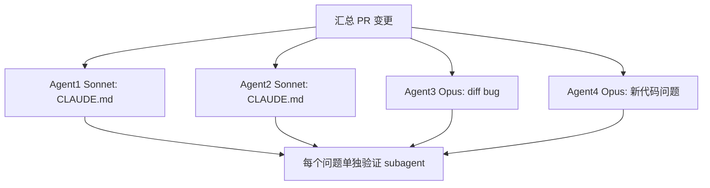

---
tags:
  - anthropics-claude-code
  - multi-agent
  - sub-agent
  - deepwiki-qa
  - source-code
  - tool-call
---

# DeepWiki Q&A：什么时候使用多 Agent（anthropics/claude-code）

> Source: 用户提供的 DeepWiki Q&A 导出文本（anthropics/claude-code；未提供原问答 URL 或源码 commit）
> Collected: 2026-09-23
> Published: Unknown

# DeepWiki Q&A with Code Context for Repository: anthropics/claude-code
## Q1
什么情况下会使用多 agent
### Answer
## 回答

在 Claude Code 中，多 agent（多智能体并行）主要用于**需要从多个独立视角审查或处理同一份内容,并通过并行执行提高速度或通过交叉验证降低误报**的场景。最典型的例子是 `code-review` 插件和 `pr-review-toolkit` 插件。

---

### 1. Code Review 插件：并行审查 + 独立验证

`/code-review` 命令在第 4 步会同时启动 **4 个并行 agent**，从不同角度审查同一份 PR 改动: claude-code:30-39 

- Agent 1 + 2（Sonnet）：分别独立核查 `CLAUDE.md` 合规性
- Agent 3（Opus）：只看 diff，扫描明显 bug
- Agent 4（Opus）：分析新引入代码中的安全/逻辑问题

之后在第 5 步，对每一个发现的问题都会**再启动一个新的验证 subagent**（Opus 验证 bug、Sonnet 验证 CLAUDE.md 违规），用来确认该问题是否真实存在： claude-code:55-55 

这种"多 agent 并行审查 + 独立验证 subagent 复核"的模式,目的是过滤假阳性,只保留高置信度（评分 ≥80）问题 claude-code:19-24 。



### 2. pr-review-toolkit 插件：可按需并行或串行

该插件文档明确说明,你可以让多个专用 agent（如 `pr-test-analyzer` 与 `comment-analyzer`）**并行运行**（更快）,也可以在需要一个结果作为另一个输入时**串行运行**: claude-code:241-253 

推荐工作流也展示了何时依次调用不同 agent（写代码 → code-reviewer → silent-failure-hunter → pr-test-analyzer → comment-analyzer → code-simplifier）: claude-code:289-295 

### 3. 引擎层面的通用多 agent 机制

从底层类型定义看,任何 agent 都可以通过 `AgentSpec` 声明一个子 agent 类型（拥有独立的 prompt、tools、model 等）,并可设为 `background: true` 使其在后台运行,也可设置 `isolation: 'worktree' | 'remote'` 让其在隔离环境中运行: claude-code:354-436 。这是主 agent 通过 `Task` 工具动态派生 subagent 的通用机制,`code-review`、`pr-review-toolkit` 等插件的多 agent 行为都是基于这套机制实现的。

此外,CHANGELOG 中也记录了通用的多 agent 相关能力演进,例如:
- 后台 subagent 默认后台运行,主线程可继续工作,完成后通知 claude-code:2479-2479 
- "Agent Teams"研究预览功能,支持多 agent 协作（需设置 `CLAUDE_CODE_EXPERIMENTAL_AGENT_TEAMS=1`） claude-code:5541-5541 
- 新增 `TeammateIdle`、`TaskCompleted` 等多 agent 工作流专用 hook 事件,以及通过 `Task(agent_type)` 语法限制可派生哪些子 agent claude-code:5523-5524 
- "动态工作流"功能可让 Claude 在后台协同调度数十到数百个 agent 完成更大规模任务 claude-code:3091-3091 

## Notes

- 多 agent 的核心动机总结为两类：**(a) 并行加速**（同时跑多个独立检查节省时间）和 **(b) 交叉验证降低误报**（一个 agent 提出问题,另一个独立 agent 复核）。`code-review` 插件是两者结合的典范。
- Agent Teams、动态工作流等属于更实验性/高级功能,面向大规模任务协同,不同于插件里"审查 PR"这种轻量多 agent 用法。
- `mods/types/claude-code.d.ts` 中的 `AgentSpec`、`AgentLoop` 等类型是引擎层的通用抽象,具体到某个场景（何时该用多 agent）主要还是取决于插件/命令的设计（如 `code-review.md` 的第 4、5 步），而非引擎强制规定。

Wiki pages you might want to explore:
- [System Architecture (anthropics/claude-code)](/wiki/anthropics/claude-code#1.1)
- [Code Review Plugin (anthropics/claude-code)](/wiki/anthropics/claude-code#5.2)
### Citations
**File:** plugins/code-review/commands/code-review.md (L30-39)
```markdown
4. Launch 4 agents in parallel to independently review the changes. Each agent should return the list of issues, where each issue includes a description and the reason it was flagged (e.g. "CLAUDE.md adherence", "bug"). The agents should do the following:

   Agents 1 + 2: CLAUDE.md compliance sonnet agents
   Audit changes for CLAUDE.md compliance in parallel. Note: When evaluating CLAUDE.md compliance for a file, you should only consider CLAUDE.md files that share a file path with the file or parents.

   Agent 3: Opus bug agent (parallel subagent with agent 4)
   Scan for obvious bugs. Focus only on the diff itself without reading extra context. Flag only significant bugs; ignore nitpicks and likely false positives. Do not flag issues that you cannot validate without looking at context outside of the git diff.

   Agent 4: Opus bug agent (parallel subagent with agent 3)
   Look for problems that exist in the introduced code. This could be security issues, incorrect logic, etc. Only look for issues that fall within the changed code.
```
**File:** plugins/code-review/commands/code-review.md (L55-55)
```markdown
5. For each issue found in the previous step by agents 3 and 4, launch parallel subagents to validate the issue. These subagents should get the PR title and description along with a description of the issue. The agent's job is to review the issue to validate that the stated issue is truly an issue with high confidence. For example, if an issue such as "variable is not defined" was flagged, the subagent's job would be to validate that is actually true in the code. Another example would be CLAUDE.md issues. The agent should validate that the CLAUDE.md rule that was violated is scoped for this file and is actually violated. Use Opus subagents for bugs and logic issues, and sonnet agents for CLAUDE.md violations.
```
**File:** plugins/code-review/README.md (L19-24)
```markdown
4. Launches 4 parallel agents to independently review:
   - **Agents #1 & #2**: Audit for CLAUDE.md compliance
   - **Agent #3**: Scan for obvious bugs in changes
   - **Agent #4**: Analyze git blame/history for context-based issues
5. Scores each issue 0-100 for confidence level
6. Filters out issues below 80 confidence threshold
```
**File:** plugins/pr-review-toolkit/README.md (L241-253)
````markdown
### Running Multiple Agents

You can request multiple agents to run in parallel or sequentially:

**Parallel** (faster):
```
"Run pr-test-analyzer and comment-analyzer in parallel"
```

**Sequential** (when one informs the other):
```
"First review test coverage, then check code quality"
```
````
**File:** plugins/pr-review-toolkit/README.md (L289-295)
```markdown
**Recommended workflow:**
1. Write code → **code-reviewer**
2. Fix issues → **silent-failure-hunter** (if error handling)
3. Add tests → **pr-test-analyzer**
4. Document → **comment-analyzer**
5. Review passes → **code-simplifier** (polish)
6. Create PR
```
**File:** mods/types/claude-code.d.ts (L354-436)
```typescript
  type AgentSpec = {
      /**
       * The type's short name (letters, digits, `_`, `-`; up to 64); the type is
       * `<plugin>:<name>`, as a plugin's agent file `agents/<name>.md` names one.
       */
      name: string;
      /**
       * When to delegate to this agent: the line the model reads in its listing
       * of agent types, and `agent.offer`'s `description`.
       */
      description: string;
      /**
       * The agent's system prompt, whole: it replaces the session's.
       */
      prompt: string;
      /**
       * What the agent may call, by tool name (`Read`, `Bash`, `mcp__x__y`); a
       * call to any other is refused. Left out: every tool the parent has.
       */
      tools?: readonly string[];
      /**
       * Tools withheld from the agent, by name, out of whatever `tools` allows.
       */
      disallowedTools?: readonly string[];
      /**
       * The agent's model: an alias (`haiku`, `sonnet`, `opus`), a full id, or
       * `inherit` for the parent's. Left out: the session's subagent default.
       */
      model?: string;
      /**
       * The agent's effort: a level (`low`, `medium`, `high`, `xhigh`, `max`)
       * or an integer budget.
       */
      effort?: string | number;
      /**
       * How the agent's permission asks are decided, a mode: `default`,
       * `acceptEdits`, `plan`, `auto`, `dontAsk` or `bypassPermissions`.
       *
       * Left out: the parent's.
       */
      permissionMode?: string;
      /**
       * Servers connected over MCP for the agent's run: a configured server's
       * name, or `{ "<name>": { command, args } }`, one server's config inline.
       */
      mcpServers?: readonly (string | Record<string, unknown>)[];
      /**
       * Settings hooks in force while the agent runs, in settings.json's `hooks`
       * shape (`{ PreToolUse: [{ matcher, hooks: [...] }] }`).
       */
      hooks?: Record<string, unknown>;
      /**
       * The most turns the agent takes before it stops.
       */
      maxTurns?: number;
      /**
       * Preloaded into the agent's context before its first turn: skill names.
       */
      skills?: readonly string[];
      /**
       * The agent's first user turn; `{{intent}}` in it takes the spawn's prompt.
       * Left out: the spawn's prompt is the first turn.
       */
      initialPrompt?: string;
      /**
       * A persistent memory the agent keeps between runs, and where: `user`,
       * `project` or `local`.
       */
      memory?: 'user' | 'project' | 'local';
      /**
       * Set so that every spawn of the agent runs in the background.
       */
      background?: true;
      /**
       * Set so that the agent's context carries no CLAUDE.md block (the person's,
       * the project's, the rules): it takes what it needs from its prompt.
       */
      omitClaudeMd?: true;
      /**
       * Where the agent runs apart from the session: `worktree`, a git worktree
       * of its own; `remote`, a cloud session where the build allows one.
       */
      isolation?: 'worktree' | 'remote';
```
**File:** CHANGELOG.md (L2479-2479)
```markdown
- Subagents now run in the background by default, so Claude keeps working while they run and is notified when they finish (previously a gradual rollout)
```
**File:** CHANGELOG.md (L3091-3091)
```markdown
- Introducing dynamic workflows: ask Claude to create a workflow and it orchestrates work across tens to hundreds of agents in the background, so you can take on larger, more complex tasks. Run `/workflows` to view your runs
```
**File:** CHANGELOG.md (L5523-5524)
```markdown
- Added `TeammateIdle` and `TaskCompleted` hook events for multi-agent workflows
- Added support for restricting which sub-agents can be spawned via `Task(agent_type)` syntax in agent "tools" frontmatter
```
**File:** CHANGELOG.md (L5541-5541)
```markdown
- Added research preview agent teams feature for multi-agent collaboration (token-intensive feature, requires setting CLAUDE_CODE_EXPERIMENTAL_AGENT_TEAMS=1)
```
## Q2
具体的触发条件是什么，什么情况下会认为需要多 agent，是程序提前编排好的，还是模型可以动态决定
### Answer
## 回答

两种机制都存在，具体取决于层级：

1. **插件/命令层：程序预先编排（静态脚本化）** — 例如 `/code-review` 命令本身就是一份写死的 Markdown 指令文件，第 4、5 步明确规定"启动 4 个并行 agent"、"对每个问题启动验证 subagent"，这是命令作者在 prompt 中硬编码的流程，不是模型临场判断是否需要多 agent claude-code:30-55 。触发条件就是"用户调用了 `/code-review` 命令"这一件事，一旦调用就必然执行这套固定的多 agent 流程。

2. **引擎层：模型可以动态决定** — Claude Code 引擎本身支持模型按需派生 subagent（`Task`/`Agent` 工具），而不是被强制。每个可派生的 agent 类型都有一段 `description`，专门写给模型看，用来判断"何时该委派给这个 agent"： claude-code:360-364 。引擎通过 `agent.offer` 事件把这些 agent 类型呈现给模型（在 agent 列表里，以及在 dispatch 时），模型基于任务上下文自行判断是否调用： claude-code:176-204 ，对应的 hook 事件定义在 claude-code:3313-3323 。

3. **"动态工作流"（Dynamic Workflows）** 是模型自主决定 agent 数量的典型例子——用户只需说"创建一个工作流"，模型会根据任务规模自行编排"数十到数百个" agent，而非固定数量： claude-code:3091-3091 。系统甚至提供了一个"建议性"的 workflow 规模设置（small/medium/large），仅作为引导而非硬性上限，进一步说明数量是模型自行权衡的： claude-code:2407-2407 。

---

## 详细说明

### 静态编排 vs 动态决定 对比

| 层级 | 触发条件 | 决策者 | 例子 |
|---|---|---|---|
| 插件命令（如 `/code-review`） | 命令被调用即执行固定步骤 | 命令作者（写死在 `.md` 文件里） | 4 个并行审查 agent + N 个验证 subagent claude-code:30-39  |
| `pr-review-toolkit` 插件 | 用户在自然语言中明确要求（"并行运行" / "先...再..."） | 半动态——用户显式指定并行或串行 | claude-code:241-253  |
| 引擎 `Task`/`Agent` 工具 | 模型判断任务需要委派 | 模型自主决定，依据 agent 的 `description` | claude-code:184-204  |
| 动态工作流 | 用户要求"创建 workflow"，模型自行拆解任务规模 | 模型自主决定并行 agent 数量 | claude-code:3091-3091  |

### 补充：Auto 模式下的把关

CHANGELOG 中还提到，在 "auto" 权限模式下，subagent 的派生本身要先经过安全分类器审核，这说明即便模型"决定"要派生多个 agent，工程上也有一层拦截，不是完全自由放任： claude-code:2751-2751 。

## Notes

- `code-review`、`pr-review-toolkit` 这类插件的多 agent 行为是**通过 prompt 工程写死的固定步骤**，本质上是"程序（命令文件）提前编排"，模型只是忠实执行指令，并不"判断"是否需要多 agent。
- 引擎层的 `AgentSpec.description`、`agent.offer` hook、动态工作流 才是真正让**模型自主判断**是否/何时派生 subagent 的机制。
- 我没有找到专门描述"分类器如何权衡是否该用多 agent"的具体阈值或算法代码，只能确认存在这层审核（"auto-mode classifier"），如果你需要更底层的判定逻辑，建议开启 Devin session 直接搜索该分类器实现。

Wiki pages you might want to explore:
- [System Architecture (anthropics/claude-code)](/wiki/anthropics/claude-code#1.1)
- [Code Review Plugin (anthropics/claude-code)](/wiki/anthropics/claude-code#5.2)
### Citations
**File:** plugins/code-review/commands/code-review.md (L30-55)
```markdown
4. Launch 4 agents in parallel to independently review the changes. Each agent should return the list of issues, where each issue includes a description and the reason it was flagged (e.g. "CLAUDE.md adherence", "bug"). The agents should do the following:

   Agents 1 + 2: CLAUDE.md compliance sonnet agents
   Audit changes for CLAUDE.md compliance in parallel. Note: When evaluating CLAUDE.md compliance for a file, you should only consider CLAUDE.md files that share a file path with the file or parents.

   Agent 3: Opus bug agent (parallel subagent with agent 4)
   Scan for obvious bugs. Focus only on the diff itself without reading extra context. Flag only significant bugs; ignore nitpicks and likely false positives. Do not flag issues that you cannot validate without looking at context outside of the git diff.

   Agent 4: Opus bug agent (parallel subagent with agent 3)
   Look for problems that exist in the introduced code. This could be security issues, incorrect logic, etc. Only look for issues that fall within the changed code.

   **CRITICAL: We only want HIGH SIGNAL issues.** Flag issues where:
   - The code will fail to compile or parse (syntax errors, type errors, missing imports, unresolved references)
   - The code will definitely produce wrong results regardless of inputs (clear logic errors)
   - Clear, unambiguous CLAUDE.md violations where you can quote the exact rule being broken

   Do NOT flag:
   - Code style or quality concerns
   - Potential issues that depend on specific inputs or state
   - Subjective suggestions or improvements

   If you are not certain an issue is real, do not flag it. False positives erode trust and waste reviewer time.

   In addition to the above, each subagent should be told the PR title and description. This will help provide context regarding the author's intent.

5. For each issue found in the previous step by agents 3 and 4, launch parallel subagents to validate the issue. These subagents should get the PR title and description along with a description of the issue. The agent's job is to review the issue to validate that the stated issue is truly an issue with high confidence. For example, if an issue such as "variable is not defined" was flagged, the subagent's job would be to validate that is actually true in the code. Another example would be CLAUDE.md issues. The agent should validate that the CLAUDE.md rule that was violated is scoped for this file and is actually violated. Use Opus subagents for bugs and logic issues, and sonnet agents for CLAUDE.md violations.
```
**File:** mods/types/claude-code.d.ts (L176-204)
```typescript
  /**
   * The input of `agent.offer`: one agent type, at the moment the engine
   * offers it to the model.
   *
   * Listed for the model (the agent listing) or named by it at dispatch
   * (`subagent_type`): the same event at each. Model-facing only: a plugin's
   * own `$.agent.spawn` of a type is no offer, and `agent.spawn` governs it.
   */
  export type AgentOfferInput = {
      /**
       * Which type (`Explore`, `Plan`, a plugin's agent); the key a matcher
       * narrows on.
       */
      agent: string;
      /**
       * Its listing line's text as the definition states it (`whenToUse`).
       */
      description: string;
      /**
       * Where the definition came from (`built-in`, `plugin`, a settings
       * source), so a matcher tells a built-in from a user's agent of its name.
       */
      source: string;
      /**
       * Who provides this agent: the plugin and its tier; `{ plugin: "engine",
       * tier: "core" }` for a built-in. Pinned: a rewrite is refused.
       */
      provider: Origin;
  };
```
**File:** mods/types/claude-code.d.ts (L360-364)
```typescript
      /**
       * When to delegate to this agent: the line the model reads in its listing
       * of agent types, and `agent.offer`'s `description`.
       */
      description: string;
```
**File:** mods/types/claude-code.d.ts (L3313-3323)
```typescript
      /**
       * Fires when the engine offers an agent type to the model, in the agent
       * listing and again at dispatch; `next(e)` resolves to `{ isOffered: true }`.
       *
       * Return `{ isOffered: false }` to keep the type out of the listing and
       * refuse its dispatch. A hook that fails passes it through.
       *
       * @example
       * on("agent.offer", { agent: "Plan" }, () => ({ isOffered: false }))
       */
      'agent.offer': AgentOfferInput;
```
**File:** CHANGELOG.md (L2407-2407)
```markdown
- Added a "Dynamic workflow size" setting in `/config` for controlling how large Claude generally makes dynamic workflows (small/medium/large agent counts) — an advisory guideline, not an enforced cap
```
**File:** CHANGELOG.md (L2751-2751)
```markdown
- Improved auto mode: subagent spawns are now evaluated by the classifier before launch, closing a gap where a subagent could request a blocked action without review
```
**File:** CHANGELOG.md (L3091-3091)
```markdown
- Introducing dynamic workflows: ask Claude to create a workflow and it orchestrates work across tens to hundreds of agents in the background, so you can take on larger, more complex tasks. Run `/workflows` to view your runs
```
## Q3
对于模型动态决定的场景，决定派生多 agent 的因素条件是什么
### Answer
## 直接回答

代码库中没有可见的"决策算法"源码——模型是否派生多 agent 本质上是 LLM 根据 system prompt 和上下文做的判断，Claude Code 引擎本身只提供**结构性的引导因素**，而不是硬编码的规则表。可确认的因素包括：

---

## 可见的结构性因素

### 1. Agent 的 `description`（供模型匹配任务）

每个可派生的 agent 类型都带有一段 `description`，专门写给模型看，用来描述"何时该委派"： claude-code:360-364 ，这是模型判断"当前任务是否匹配某个 agent 职责"的主要输入，对应 `AgentOfferInput.description`： claude-code:184-198 。

### 2. 任务规模引导（Dynamic Workflow Size）

对于"动态工作流"场景，系统提供一个**建议性**（非强制）的规模设置,引导模型在 small/medium/large 之间权衡要派生多少个 agent： claude-code:2407-2407 。CHANGELOG 记录了默认值是 medium（目标少于 15 个 agent）： claude-code:1931-1931 。这说明"任务复杂度/规模"是模型考量是否多开 agent 的因素之一，但没有强制上限。

### 3. 嵌套深度限制（结构性约束而非决策因素）

子 agent 能否再派生子 agent 受深度限制约束，默认最多嵌套 3 层： claude-code:1937-1937 。这是一条硬性工程约束，用于防止模型无限递归派生 agent，而不是"决定是否该多 agent"的判断依据。

### 4. Auto 模式下的分类器审核

在 auto 权限模式下，subagent 的每一次派生请求都要先经过安全分类器评估： claude-code:2751-2751 。这一层是"批准/拒绝"关卡，同样不是"该不该用多 agent"的正向决策逻辑，只是风险把关。

### 5. 行为改进：减少不必要的再委派

CHANGELOG 也记录了对模型行为的调优——减少模型把整个任务再次委派给另一个 subagent 的倾向： claude-code:2397-2397 ，这暗示了官方在训练/引导模型时试图让它更节制地使用多 agent，而不是滥用。

## Notes

- 以上都是**结构性引导或约束**（description 文本、规模建议、深度上限、分类器审核），而非公开可见的"决策公式"。真正让模型"判断该不该多开 agent"的推理逻辑存在于模型的系统提示词（system prompt）和训练权重中，这部分内容不在此代码库索引范围内。
- 如果你想深入了解模型侧的具体提示词逻辑，建议开启 Devin session 直接搜索内置系统提示相关文件（如有）；但根据目前索引，我没有找到该层的源码。

Wiki pages you might want to explore:
- [System Architecture (anthropics/claude-code)](/wiki/anthropics/claude-code#1.1)
### Citations
**File:** mods/types/claude-code.d.ts (L184-198)
```typescript
  export type AgentOfferInput = {
      /**
       * Which type (`Explore`, `Plan`, a plugin's agent); the key a matcher
       * narrows on.
       */
      agent: string;
      /**
       * Its listing line's text as the definition states it (`whenToUse`).
       */
      description: string;
      /**
       * Where the definition came from (`built-in`, `plugin`, a settings
       * source), so a matcher tells a built-in from a user's agent of its name.
       */
      source: string;
```
**File:** mods/types/claude-code.d.ts (L360-364)
```typescript
      /**
       * When to delegate to this agent: the line the model reads in its listing
       * of agent types, and `agent.offer`'s `description`.
       */
      description: string;
```
**File:** CHANGELOG.md (L1931-1931)
```markdown
- Changed dynamic workflows to default to a medium size guideline (aim for fewer than 15 agents); pick another size or unrestricted with Dynamic workflow size in `/config`
```
**File:** CHANGELOG.md (L1937-1937)
```markdown
- Subagents can now spawn nested subagents up to depth 3 by default (was 1); set CLAUDE_CODE_MAX_SUBAGENT_SPAWN_DEPTH=1 to disable nesting
```
**File:** CHANGELOG.md (L2397-2397)
```markdown
- Improved subagent behavior: agents are now less likely to re-delegate their entire task to another subagent
```
**File:** CHANGELOG.md (L2407-2407)
```markdown
- Added a "Dynamic workflow size" setting in `/config` for controlling how large Claude generally makes dynamic workflows (small/medium/large agent counts) — an advisory guideline, not an enforced cap
```
**File:** CHANGELOG.md (L2751-2751)
```markdown
- Improved auto mode: subagent spawns are now evaluated by the classifier before launch, closing a gap where a subagent could request a blocked action without review
```
## Q4
提示词的引导内容是什么，预提供的 agent 有什么
### Answer
## 直接回答

代码库中没有暴露 Claude 内置系统提示词的完整文本，但可以看到两类"引导内容"：(1) 每个 agent 类型自带的 `description` 字段，用于告诉模型"何时该委派给它"；(2) 各插件预先定义好的具体 agent 列表（预提供的 agent）。下面分别列出。

---

## 1. 提示词引导内容的结构

`AgentSpec` 类型定义了一个 agent 类型必须携带的信息，其中 `description` 字段就是**模型在选择是否委派时读取的引导文字**： claude-code:360-368 。

引擎通过 `agent.offer` 事件把这些 `description` 呈现给模型（在 agent 列表里，以及在实际 dispatch 时）： claude-code:176-204 ，对应 hook 事件定义在 claude-code:3313-3323 。

除 `description` 外，`AgentSpec` 还包含 `prompt`（替换整个会话系统提示词的完整 prompt 文本）、`initialPrompt`（agent 的第一轮用户输入）等字段，这些才是真正塑造 agent 行为的"提示词内容"： claude-code:366-417 。但具体每个内置 agent（如 `Explore`、`Plan`）的 `prompt` 全文，索引中没有暴露——只在类型注释里以举例形式提到它们的名字。

插件可以通过 `$.agent.register` 动态注册一个新 agent 类型，其中 `description`（何时委派）和 `prompt`（系统提示词）是必填项： claude-code:2673-2698 。

对于"动态工作流"场景，引导内容还包括规模设置（small/medium/large，advisory 而非硬性上限） claude-code:2407-2407 ，默认目标少于 15 个 agent claude-code:1931-1931 。

## 2. 预提供（built-in / 插件自带）的 agent

### 引擎内置

从类型注释可见，引擎内置至少有 `Explore`、`Plan` 两个 agent 类型（作为示例出现在 `agent.offer` 相关注释中）： claude-code:3313-3323 。

### 各插件预先定义的 agent

从 `plugins/README.md` 的插件列表中可以看到各插件"预提供"的具体 agent：

| 插件 | 预提供 agent |
|---|---|
| `agent-sdk-dev` | `agent-sdk-verifier-py`, `agent-sdk-verifier-ts`（校验 SDK 应用是否符合最佳实践） |
| `code-review` | 5 个并行 Sonnet agent，分别负责 CLAUDE.md 合规、bug 检测、历史上下文、PR 历史、代码注释 |
| `feature-dev` | `code-explorer`, `code-architect`, `code-reviewer` |
| `hookify` | `conversation-analyzer` |
| `plugin-dev` | `agent-creator`, `plugin-validator`, `skill-reviewer` |
| `pr-review-toolkit` | `comment-analyzer`, `pr-test-analyzer`, `silent-failure-hunter`, `type-design-analyzer`, `code-reviewer`, `code-simplifier` |

来源： claude-code:15-25 

这些插件也在 marketplace 元数据中注册，附带各自的描述文本（即模型看到的"何时使用该插件"引导）： claude-code:10-149 。

## Notes

- 你在上一轮问到的"决策因素"（description、规模引导、深度限制、分类器审核）本质上就是这里 `AgentSpec.description`、`AgentSpec.prompt` 及动态工作流规模设置的具体体现。
- 代码库索引中**没有**暴露内置 agent（`Explore`、`Plan` 等）的完整 `prompt` 文本或 Claude 主模型的系统提示词全文，这些属于模型/产品侧未公开的内容，如果需要进一步深挖，建议开启 Devin session 全文搜索仓库看是否有相关 `prompt` 常量定义。
- `pr-review-toolkit` 的具体每个 agent（如 `pr-test-analyzer`）各自的 `description` 引导文本，索引中未直接给出其 agent 定义文件（`agents/*.md`）内容，如需查看请开启完整会话检索该插件目录。

Wiki pages you might want to explore:
- [Code Review Plugin (anthropics/claude-code)](/wiki/anthropics/claude-code#5.2)
- [Glossary (anthropics/claude-code)](/wiki/anthropics/claude-code#9)
### Citations
**File:** mods/types/claude-code.d.ts (L176-204)
```typescript
  /**
   * The input of `agent.offer`: one agent type, at the moment the engine
   * offers it to the model.
   *
   * Listed for the model (the agent listing) or named by it at dispatch
   * (`subagent_type`): the same event at each. Model-facing only: a plugin's
   * own `$.agent.spawn` of a type is no offer, and `agent.spawn` governs it.
   */
  export type AgentOfferInput = {
      /**
       * Which type (`Explore`, `Plan`, a plugin's agent); the key a matcher
       * narrows on.
       */
      agent: string;
      /**
       * Its listing line's text as the definition states it (`whenToUse`).
       */
      description: string;
      /**
       * Where the definition came from (`built-in`, `plugin`, a settings
       * source), so a matcher tells a built-in from a user's agent of its name.
       */
      source: string;
      /**
       * Who provides this agent: the plugin and its tier; `{ plugin: "engine",
       * tier: "core" }` for a built-in. Pinned: a rewrite is refused.
       */
      provider: Origin;
  };
```
**File:** mods/types/claude-code.d.ts (L360-417)
```typescript
      /**
       * When to delegate to this agent: the line the model reads in its listing
       * of agent types, and `agent.offer`'s `description`.
       */
      description: string;
      /**
       * The agent's system prompt, whole: it replaces the session's.
       */
      prompt: string;
      /**
       * What the agent may call, by tool name (`Read`, `Bash`, `mcp__x__y`); a
       * call to any other is refused. Left out: every tool the parent has.
       */
      tools?: readonly string[];
      /**
       * Tools withheld from the agent, by name, out of whatever `tools` allows.
       */
      disallowedTools?: readonly string[];
      /**
       * The agent's model: an alias (`haiku`, `sonnet`, `opus`), a full id, or
       * `inherit` for the parent's. Left out: the session's subagent default.
       */
      model?: string;
      /**
       * The agent's effort: a level (`low`, `medium`, `high`, `xhigh`, `max`)
       * or an integer budget.
       */
      effort?: string | number;
      /**
       * How the agent's permission asks are decided, a mode: `default`,
       * `acceptEdits`, `plan`, `auto`, `dontAsk` or `bypassPermissions`.
       *
       * Left out: the parent's.
       */
      permissionMode?: string;
      /**
       * Servers connected over MCP for the agent's run: a configured server's
       * name, or `{ "<name>": { command, args } }`, one server's config inline.
       */
      mcpServers?: readonly (string | Record<string, unknown>)[];
      /**
       * Settings hooks in force while the agent runs, in settings.json's `hooks`
       * shape (`{ PreToolUse: [{ matcher, hooks: [...] }] }`).
       */
      hooks?: Record<string, unknown>;
      /**
       * The most turns the agent takes before it stops.
       */
      maxTurns?: number;
      /**
       * Preloaded into the agent's context before its first turn: skill names.
       */
      skills?: readonly string[];
      /**
       * The agent's first user turn; `{{intent}}` in it takes the spawn's prompt.
       * Left out: the spawn's prompt is the first turn.
       */
      initialPrompt?: string;
```
**File:** mods/types/claude-code.d.ts (L2673-2698)
```typescript
          /**
           * Defines an agent type the Agent tool dispatches from the next turn on,
           * named `<plugin>:<name>`: the event `agent.register`.
           *
           * Every field takes effect as in an agent file; re-registered, a name is
           * replaced; unloaded, a plugin's types go. `agent.offer` hides it from
           * the model alone; any plugin's `$.agent.spawn` answers to `agent.spawn`.
           *
           * @param spec `name`, `description` (when to delegate), `prompt` (its
           *             system prompt), and any other field of an agent definition
           * @returns `{ agent }`, the full name; rejects until the session binds,
           *          on a spec the schema refuses (its reason), on a hook's deny
           * @example
           * await $.agent.register({ name: "runner", description: "Runs a spec",
           *   prompt: RUNNER_PROMPT, tools: ["Read", "Bash"], omitClaudeMd: true })
           * @example
           * // runner-only: hidden from the model, spawned by this plugin's tool,
           * // answered by the subagent's turn.complete (matched by agentId)
           * on("agent.offer", { agent: "lab:runner" }, () => ({ isOffered: false }))
           * on("tool.call", { tool: "mcp__lab__run" }, async ($, e) => {
           *   const { agentId, deny } = await $.agent.spawn({
           *     subagentType: "lab:runner", prompt: e.spec, description: "run" })
           *   return { result: deny ?? (await answerOf(agentId)) }
           * })
           */
          register: (spec: AgentSpec) => Promise<OpValueOf['agent.register']>;
```
**File:** mods/types/claude-code.d.ts (L3313-3323)
```typescript
      /**
       * Fires when the engine offers an agent type to the model, in the agent
       * listing and again at dispatch; `next(e)` resolves to `{ isOffered: true }`.
       *
       * Return `{ isOffered: false }` to keep the type out of the listing and
       * refuse its dispatch. A hook that fails passes it through.
       *
       * @example
       * on("agent.offer", { agent: "Plan" }, () => ({ isOffered: false }))
       */
      'agent.offer': AgentOfferInput;
```
**File:** plugins/README.md (L15-25)
```markdown
| [agent-sdk-dev](./agent-sdk-dev/) | Development kit for working with the Claude Agent SDK | **Command:** `/new-sdk-app` - Interactive setup for new Agent SDK projects<br>**Agents:** `agent-sdk-verifier-py`, `agent-sdk-verifier-ts` - Validate SDK applications against best practices |
| [claude-opus-4-5-migration](./claude-opus-4-5-migration/) | Migrate code and prompts from Sonnet 4.x and Opus 4.1 to Opus 4.5 | **Skill:** `claude-opus-4-5-migration` - Automated migration of model strings, beta headers, and prompt adjustments |
| [code-review](./code-review/) | Automated PR code review using multiple specialized agents with confidence-based scoring to filter false positives | **Command:** `/code-review` - Automated PR review workflow<br>**Agents:** 5 parallel Sonnet agents for CLAUDE.md compliance, bug detection, historical context, PR history, and code comments |
| [commit-commands](./commit-commands/) | Git workflow automation for committing, pushing, and creating pull requests | **Commands:** `/commit`, `/commit-push-pr`, `/clean_gone` - Streamlined git operations |
| [explanatory-output-style](./explanatory-output-style/) | Adds educational insights about implementation choices and codebase patterns (mimics the deprecated Explanatory output style) | **Hook:** SessionStart - Injects educational context at the start of each session |
| [feature-dev](./feature-dev/) | Comprehensive feature development workflow with a structured 7-phase approach | **Command:** `/feature-dev` - Guided feature development workflow<br>**Agents:** `code-explorer`, `code-architect`, `code-reviewer` - For codebase analysis, architecture design, and quality review |
| [frontend-design](./frontend-design/) | Create distinctive, production-grade frontend interfaces that avoid generic AI aesthetics | **Skill:** `frontend-design` - Auto-invoked for frontend work, providing guidance on bold design choices, typography, animations, and visual details |
| [hookify](./hookify/) | Easily create custom hooks to prevent unwanted behaviors by analyzing conversation patterns or explicit instructions | **Commands:** `/hookify`, `/hookify:list`, `/hookify:configure`, `/hookify:help`<br>**Agent:** `conversation-analyzer` - Analyzes conversations for problematic behaviors<br>**Skill:** `writing-rules` - Guidance on hookify rule syntax |
| [learning-output-style](./learning-output-style/) | Interactive learning mode that requests meaningful code contributions at decision points (mimics the unshipped Learning output style) | **Hook:** SessionStart - Encourages users to write meaningful code (5-10 lines) at decision points while receiving educational insights |
| [plugin-dev](./plugin-dev/) | Comprehensive toolkit for developing Claude Code plugins with 7 expert skills and AI-assisted creation | **Command:** `/plugin-dev:create-plugin` - 8-phase guided workflow for building plugins<br>**Agents:** `agent-creator`, `plugin-validator`, `skill-reviewer`<br>**Skills:** Hook development, MCP integration, plugin structure, settings, commands, agents, and skill development |
| [pr-review-toolkit](./pr-review-toolkit/) | Comprehensive PR review agents specializing in comments, tests, error handling, type design, code quality, and code simplification | **Command:** `/pr-review-toolkit:review-pr` - Run with optional review aspects (comments, tests, errors, types, code, simplify, all)<br>**Agents:** `comment-analyzer`, `pr-test-analyzer`, `silent-failure-hunter`, `type-design-analyzer`, `code-reviewer`, `code-simplifier` |
```
**File:** .claude-plugin/marketplace.json (L10-149)
```json
  "plugins": [
    {
      "name": "agent-sdk-dev",
      "description": "Development kit for working with the Claude Agent SDK",
      "source": "./plugins/agent-sdk-dev",
      "category": "development"
    },
    {
      "name": "claude-opus-4-5-migration",
      "description": "Migrate your code and prompts from Sonnet 4.x and Opus 4.1 to Opus 4.5.",
      "version": "1.0.0",
      "author": {
        "name": "William Hu",
        "email": "whu@anthropic.com"
      },
      "source": "./plugins/claude-opus-4-5-migration",
      "category": "development"
    },
    {
      "name": "code-review",
      "description": "Automated code review for pull requests using multiple specialized agents with confidence-based scoring to filter false positives",
      "version": "1.0.0",
      "author": {
        "name": "Boris Cherny",
        "email": "boris@anthropic.com"
      },
      "source": "./plugins/code-review",
      "category": "productivity"
    },
    {
      "name": "commit-commands",
      "description": "Commands for git commit workflows including commit, push, and PR creation",
      "version": "1.0.0",
      "author": {
        "name": "Anthropic",
        "email": "support@anthropic.com"
      },
      "source": "./plugins/commit-commands",
      "category": "productivity"
    },
    {
      "name": "explanatory-output-style",
      "description": "Adds educational insights about implementation choices and codebase patterns (mimics the deprecated Explanatory output style)",
      "version": "1.0.0",
      "author": {
        "name": "Dickson Tsai",
        "email": "dickson@anthropic.com"
      },
      "source": "./plugins/explanatory-output-style",
      "category": "learning"
    },
    {
      "name": "feature-dev",
      "description": "Comprehensive feature development workflow with specialized agents for codebase exploration, architecture design, and quality review",
      "version": "1.0.0",
      "author": {
        "name": "Siddharth Bidasaria",
        "email": "sbidasaria@anthropic.com"
      },
      "source": "./plugins/feature-dev",
      "category": "development"
    },
    {
      "name": "frontend-design",
      "description": "Create distinctive, production-grade frontend interfaces with high design quality. Generates creative, polished code that avoids generic AI aesthetics.",
      "version": "1.1.0",
      "author": {
        "name": "Prithvi Rajasekaran & Alexander Bricken",
        "email": "prithvi@anthropic.com"
      },
      "source": "./plugins/frontend-design",
      "category": "development"
    },
    {
      "name": "hookify",
      "description": "Easily create custom hooks to prevent unwanted behaviors by analyzing conversation patterns or from explicit instructions. Define rules via simple markdown files.",
      "version": "0.1.0",
      "author": {
        "name": "Daisy Hollman",
        "email": "daisy@anthropic.com"
      },
      "source": "./plugins/hookify",
      "category": "productivity"
    },
    {
      "name": "learning-output-style",
      "description": "Interactive learning mode that requests meaningful code contributions at decision points (mimics the unshipped Learning output style)",
      "version": "1.0.0",
      "author": {
        "name": "Boris Cherny",
        "email": "boris@anthropic.com"
      },
      "source": "./plugins/learning-output-style",
      "category": "learning"
    },
    {
      "name": "plugin-dev",
      "description": "Comprehensive toolkit for developing Claude Code plugins. Includes 7 expert skills covering hooks, MCP integration, commands, agents, and best practices. AI-assisted plugin creation and validation.",
      "version": "0.1.0",
      "author": {
        "name": "Daisy Hollman",
        "email": "daisy@anthropic.com"
      },
      "source": "./plugins/plugin-dev",
      "category": "development"
    },
    {
      "name": "pr-review-toolkit",
      "description": "Comprehensive PR review agents specializing in comments, tests, error handling, type design, code quality, and code simplification",
      "version": "1.0.0",
      "author": {
        "name": "Anthropic",
        "email": "support@anthropic.com"
      },
      "source": "./plugins/pr-review-toolkit",
      "category": "productivity"
    },
    {
      "name": "ralph-wiggum",
      "description": "Interactive self-referential AI loops for iterative development. Claude works on the same task repeatedly, seeing its previous work, until completion.",
      "version": "1.0.0",
      "author": {
        "name": "Daisy Hollman",
        "email": "daisy@anthropic.com"
      },
      "source": "./plugins/ralph-wiggum",
      "category": "development"
    },
    {
      "name": "security-guidance",
      "description": "Security reminder hook that warns about potential security issues when editing files, including command injection, XSS, and unsafe code patterns",
      "version": "1.0.0",
      "author": {
        "name": "David Dworken",
        "email": "dworken@anthropic.com"
      },
      "source": "./plugins/security-guidance",
      "category": "security"
    }
  ]
```
