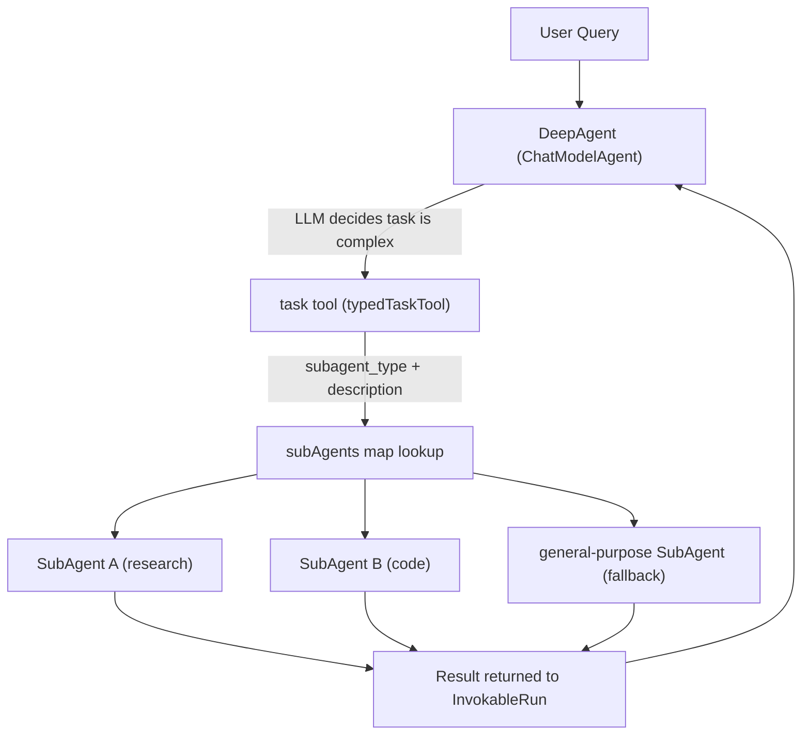

---
tags:
  - cloudwego-eino
  - multi-agent
  - sub-agent
  - deepwiki-qa
  - source-code
  - tool-call
---

# DeepWiki Q&A with Code Context for Repository: cloudwego/eino

> Source: 用户提供的 DeepWiki Q&A（cloudwego/eino 子 agent）
> Collected: 2026-09-20
> Published: Unknown

## Q1

有没有创建子 agent 的功能

### Answer

## 答案

有的,eino 提供了多种创建/组合子 agent(sub-agent)的机制:

---

### 1. `SetSubAgents` — 直接设置子 agent 并支持 transfer

`adk.SetSubAgents(ctx, agent, subAgents)` 可以将若干 `Agent` 设置为某个 agent 的子 agent,内部会包装成 `flowAgent` 并建立父子关系,支持子 agent 之间通过 `TransferToAgent` 工具互相转移 (adk/flow.go:70-77),具体实现在 `setSubAgents` 中,会为每个子 agent 设置 `parentAgent` 指针 (adk/flow.go:132-171)。不过文档中明确标注"NOT RECOMMENDED",建议改用 `ChatModelAgent` + `AgentTool` 或 `DeepAgent` (adk/flow.go:70-77)。

### 2. `DeepAgent` — 通过 `SubAgents` 配置 + `task` 工具委派

`deep.TypedConfig` 中的 `SubAgents` 字段可以配置一组专门化的子 agent,供协调 agent 通过内置的 `task` 工具动态调用 (adk/prebuilt/deep/deep.go:58-60)。创建流程 `NewTyped` 会调用 `typedTaskToolMiddleware` 将这些子 agent 包装成工具 (adk/prebuilt/deep/deep.go:130-149),具体是通过 `typedNewTaskTool` 遍历 `subAgents`,对每个都调用 `adk.NewTypedAgentTool` 包装成可调用工具 (adk/prebuilt/deep/task_tool.go:114-121)。运行时 `InvokableRun` 根据 `subagent_type` 参数找到对应子 agent 并执行 (adk/prebuilt/deep/task_tool.go:156-175)。

README 中的示例也展示了这种用法:

```go
deepAgent, _ := deep.New(ctx, &deep.Config{
    ChatModel: chatModel,
    SubAgents: []adk.Agent{researchAgent, codeAgent},
    ...
})
```
(README.md:76-84)

### 3. 工作流类 agent(`NewSequentialAgent` / `NewParallelAgent` / `NewLoopAgent`)

这些函数接收 `SubAgents []Agent` 配置,内部通过 `newWorkflowAgent` → `setSubAgents` 建立子 agent 关系,按顺序、并行或循环方式执行 (adk/workflow.go:655-679),对外暴露的构造函数如下:

- `NewSequentialAgent` (adk/workflow.go:686-688)
- `NewParallelAgent` (adk/workflow.go:695-697)
- `NewLoopAgent` (adk/workflow.go:704-706)

同样在注释中被标注为 "NOT RECOMMENDED",建议优先用 `ChatModelAgent` + `AgentTool` 或 `DeepAgent` (adk/workflow.go:620-629)。

### 4. `supervisor` 预制包 — 监督者模式

`adk/prebuilt/supervisor` 提供 `Config{Supervisor, SubAgents}`,通过 `New` 函数将每个子 agent 用 `AgentWithDeterministicTransferTo` 包装(强制转回 supervisor),再调用 `adk.SetSubAgents` 建立层级 (adk/prebuilt/supervisor/supervisor.go:101-119)。该包同样注明不推荐,建议用 `ChatModelAgent` + `AgentTool` 或 `DeepAgent` (adk/prebuilt/supervisor/supervisor.go:40-51)。

---

## Notes

- 官方目前推荐的做法是 **`ChatModelAgent` + `AgentTool`** 或 **`DeepAgent`**,而不是 `SetSubAgents`/workflow agent/`supervisor` 这几种基于"完整上下文共享的 agent transfer"机制,因为后者在实践中被证明效果不一定更好 (adk/flow.go:70-77)。
- `flow/agent/multiagent/host/compose.go` 中的 `host` 多智能体系统是 eino 较早期(基于 `compose.Graph`)的多智能体实现,与上述基于 `adk` 包的子 agent 机制相似但属于不同子系统,如果你是问 `adk` 包内的功能,可以忽略此文件 (flow/agent/multiagent/host/compose.go:44-52)。

Wiki pages you might want to explore:
- [Overview (cloudwego/eino)](/wiki/cloudwego/eino#1)
- [DeepAgent Multi-Agent Orchestration (cloudwego/eino)](/wiki/cloudwego/eino#6.4)
- [Agent Runner and Options (cloudwego/eino)](/wiki/cloudwego/eino#6.7)

## Q2

我的需求是根据用户的问题动态分析，当需求复杂时进行子任务拆分，然后下发给子agent完成。所以我想知道动态创建子agent怎么写

### Answer

## 答案

你的需求(根据问题动态拆分子任务、下发给子 agent)正好对应 eino 的 **`DeepAgent`** + `task` 工具机制,而不是"运行时凭空创建全新 Agent 实例"。具体来说:

1. 你事先在 `deep.Config.SubAgents` 里注册好一批"专业化"的子 agent(比如研究、编码、搜索等) (adk/prebuilt/deep/deep.go:58-60)。
2. 协调 agent(即 DeepAgent 本身,底层是一个 `ChatModelAgent`)在推理时,会**动态判断**当前任务是否复杂、是否需要委派,并通过调用内置的 `task` 工具、传入 `subagent_type` 和 `description` 参数来"动态选择并派发"给对应子 agent (adk/prebuilt/deep/task_tool.go:151-154)。这个决策逻辑完全由 LLM 在运行时根据 prompt 里对各子 agent 的描述做出,不是硬编码的 if/else (adk/prebuilt/deep/prompt.go:28-56)。
3. 运行时的实际分发在 `typedTaskTool.InvokableRun` 里完成:解析 `subagent_type` → 在 `t.subAgents` map 中查找对应工具化的子 agent → 执行 (adk/prebuilt/deep/task_tool.go:156-175)。

---

## 详细说明

### 子 agent 是如何被"包装成可动态调用的工具"的

`typedNewTaskTool` 在创建 DeepAgent 时,会遍历 `SubAgents` 列表,把每一个都通过 `adk.NewTypedAgentTool` 包装成 `tool.InvokableTool`,存进 `t.subAgents` map(key 是 agent 的 `Name`) (adk/prebuilt/deep/task_tool.go:114-121)。这个 map 和 `descGen` 一起构成了 `typedTaskTool` 结构体 (adk/prebuilt/deep/task_tool.go:126-130)。

### "动态分析复杂度、决定是否拆分"从哪里来

- `task` 工具的描述(`taskPrompt`)里明确告诉模型"何时使用 task 工具":任务复杂多步骤、可独立并行、需要专注推理等 (adk/prebuilt/deep/prompt.go:28-56)(中文版同样内容见 adk/prebuilt/deep/prompt.go:357-386)。
- LLM 根据这个 prompt 和每个子 agent 的 `Description`(由 `typedDefaultTaskToolDescription` 拼装进工具描述里)自主判断是否需要拆分、调用哪个子 agent (adk/prebuilt/deep/task_tool.go:177-191)。
- 如果没有匹配的专业子 agent,还可以用内置的 `general-purpose` 子 agent 兜底(除非设置 `WithoutGeneralSubAgent`)(adk/prebuilt/deep/task_tool.go:85-112)。

### 完整数据流



### 代码示例(来自 README)

```go
deepAgent, _ := deep.New(ctx, &deep.Config{
    ChatModel: chatModel,
    SubAgents: []adk.Agent{researchAgent, codeAgent},
    ToolsConfig: adk.ToolsConfig{
        ToolsNodeConfig: compose.ToolsNodeConfig{
            Tools: []tool.BaseTool{shellTool, pythonTool, webSearchTool},
        },
    },
})
```
(README.md:76-84)

之后模型在推理时,一旦判断问题复杂,就会自主生成一次 `ToolCall`(`Function.Name == taskToolName`, `Arguments` 里带 `subagent_type` 和拆解后的子任务描述),测试代码里可以看到这个调用模式的模拟 (adk/prebuilt/deep/deep_test.go:164-174)。

### 如果你想要的是"真正凭空 new 出一个全新 Agent 实例"

以上机制是"从预先注册好的一批候选子 agent 里动态选择并派发",而不是在运行时用代码创建一个全新的、结构未知的 `Agent` 对象。如果你需要后者(比如根据任务描述自动生成一个新的 `ChatModelAgent` 配置),eino 本身没有现成的"自动生成 Agent 配置"的功能;你需要自己在业务代码里,根据 LLM 输出的拆分结果,调用 `adk.NewTypedChatModelAgent` 或 `adk.NewChatModelAgent` 构造新实例 (adk/prebuilt/deep/task_tool.go:90-100),再把这些实例整合进 `SubAgents` 列表或直接以 `AgentTool` 形式提供给协调 agent。

## Notes

- `write_todos` 工具可以配合你的"任务拆分"需求,用于协调 agent 记录拆解出的子任务列表并跟踪状态,存储在 session 的 `deep_agent_session_key_todos` 键下 (adk/prebuilt/deep/deep.go:79-80)。
- Session 值(如父任务的上下文变量)会自动在父子 agent 之间共享,便于子 agent 感知父任务状态 (adk/prebuilt/deep/deep_test.go:153-198)。
- 若子 agent 数量/类型是可枚举、可预先定义的,`DeepAgent` 的这套机制已经完全满足"动态分析 + 动态派发"的需求;若确实需要运行时生成全新 agent 结构,则需要自行在业务层实现,eino 未提供开箱即用的支持。

Wiki pages you might want to explore:
- [Quick Start Guide (cloudwego/eino)](/wiki/cloudwego/eino#1.3)
- [DeepAgent Multi-Agent Orchestration (cloudwego/eino)](/wiki/cloudwego/eino#6.4)

## Q3

我希望是动态的，不是预先编排好的。是看其他的项目对于这种功能都是提供一个所谓 agent tool，eino 支持这种写法吗

### Answer

## 答案

是的,eino 完全支持这种"agent as a tool"的写法,就是 `adk.NewAgentTool`(或泛型版本 `adk.NewTypedAgentTool`) (adk/agent_tool.go:69-104)。它把任意一个 `Agent` 包装成 `tool.BaseTool`,可以直接塞进另一个 `ChatModelAgent` 的 `ToolsConfig.Tools` 列表里,和其他普通工具一视同仁,由 LLM 在推理时自主决定要不要调用 (adk/agent_tool.go:69-93)。

---

### 工作原理

- 包装时要求内层 agent 有非空 `Name` 和 `Description`,这两者会分别成为工具的 `Name` 和 `Desc`,供上层模型判断"这个工具是干什么的、要不要调" (adk/agent_tool.go:133-152)。
- `InvokableRun` 是实际调用逻辑:接收到 JSON 参数后构造内层 agent 的输入,启动一个内部 `runner` 去执行内层 agent,收集其所有事件、拼出最终文本结果返回给外层工具调用方 (adk/agent_tool.go:154-198)。
- Action 作用域是隔离的:内层 agent 的 `Exit`/`TransferToAgent`/`BreakLoop` 不会影响外层父 agent,只有 `Interrupted` 会通过 `CompositeInterrupt` 向上传播以支持跨边界的人机交互中断/恢复 (adk/agent_tool.go:85-92)。
- 如果开启 `EmitInternalEvents`,内层 agent 的执行事件会实时转发给外层的事件流,便于流式展示子 agent 的中间过程,但这些事件不计入父 agent 的 session/checkpoint 状态 (adk/agent_tool.go:75-83)。

### 这正是"动态"的体现

跟 `SetSubAgents`/`SequentialAgent` 等提前编排好父子关系的机制不同,`AgentTool` 就是一个普通的 `tool.BaseTool`,LLM 在 ReAct 循环里像调用任何其他函数一样"按需调用"它,决策权完全在运行时的模型推理阶段,不需要提前固定父子拓扑。README 中给出了这种组合思路(虽然举例是 `graphtool`,但原理相同——把可执行单元包装成 tool 供 agent 自主决策调用):

```go
tool, _ := graphtool.NewInvokableGraphTool(graph, "data_pipeline", "Process and validate data")
agent, _ := adk.NewChatModelAgent(ctx, &adk.ChatModelAgentConfig{
    Model: chatModel,
    ToolsConfig: adk.ToolsConfig{ToolsNodeConfig: compose.ToolsNodeConfig{Tools: []tool.BaseTool{tool}}},
})
```
(README.md:113-126)

对于 agent 场景,直接换成 `adk.NewAgentTool(ctx, someSubAgent)` 放进 `Tools` 列表即可,测试代码里也验证了这种基本用法:创建一个 mock agent → `NewAgentTool` 包装 → 直接 `InvokableRun` (adk/agent_tool_test.go:279-296)。多层嵌套(`outer` 调用 `inner` 工具,`inner` 内部又把 `inner2` 包成工具)也是被支持且测过的,`RunPath` 会正确记录调用链 (adk/agent_tool_test.go:679-706)。

`DeepAgent` 的 `task` 工具本质上就是在此基础上批量做的:对每个 `SubAgent` 调用 `adk.NewTypedAgentTool` 包装,再统一收进一个 `subAgents` map,由一个"路由工具"按 `subagent_type` 参数分发 (adk/prebuilt/deep/task_tool.go:114-121),`InvokableRun` 里实际调用的还是 `a.InvokableRun`(`a` 即包装好的 `AgentTool`)(adk/prebuilt/deep/task_tool.go:156-174)。所以如果你想要"更原生"、无需预注册路由参数的写法,直接用 `NewAgentTool` 把子 agent 挂到父 agent 的 `Tools` 列表就是你要的模式;`task` 工具那种是加了一层"按名称分发"的便利封装,底层机制一致。

## Notes

- `NewAgentTool` 包装的子 agent 数量在代码层面仍需要"提前列出并放进 `Tools` 切片",但这跟 `SetSubAgents` 建立强父子拓扑关系不同——本质上任何 `[]tool.BaseTool` 都可以在初始化时动态构造(比如根据配置遍历生成一批 `AgentTool` 再传入),所以你可以在业务层实现"看起来动态"的注册逻辑,只是 Go 语言本身仍需要在 `ChatModelAgent` 初始化调用时把这批工具准备好。
- Session 共享:被包装为工具的子 agent 会与父 agent 共享 session values(`withSharedParentSession`),便于状态传递 (adk/agent_tool.go:196-198),这与 `adk/agent_tool_test.go` 的多个测试用例(如 `sessionValuesAgent`)一致 (adk/agent_tool_test.go:201-201)。

Wiki pages you might want to explore:
- [Overview (cloudwego/eino)](/wiki/cloudwego/eino#1)
- [Agent Runner and Options (cloudwego/eino)](/wiki/cloudwego/eino#6.7)
