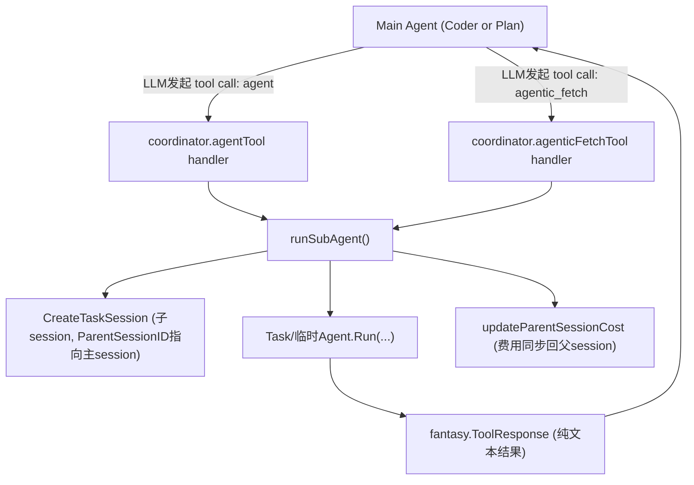

# DeepWiki Q&A with Code Context for Repository: charmbracelet/crush

> Source: https://deepwiki.com/search/-agent_01d1c057-d47e-42f9-9f0a-5a684aea418b?mode=codemap
> Collected: 2026-09-20
> Published: Unknown

## Q1

有哪些预先定义好的 agent

## Crush 预定义 Agent（Coder / Task / Plan）

梳理 Crush 中三个内置 agent（Coder、Task、Plan）的定义、工具集解析、系统提示词加载、Task 作为子代理被调用的流程，以及 UI 层在 Coder/Plan 间切换主 agent 的完整链路。关键位置：常量定义 [1a]，默认配置生成 [1e]，工具集过滤 [2b][2c]，子代理调用 [3d]，UI 切换 [5c]。

### 1. 三个内置 Agent 常量与默认配置的生成

config 服务：定义 AgentCoder/AgentTask/AgentPlan 三个 ID，并在 SetupAgents 中构造它们的默认 Agent 结构体（名称、描述、模型、工具集）

### 1a. 定义三个 Agent ID 常量 (`config.go:60`)

AgentCoder、AgentPlan、AgentTask 三个字符串常量，是全局唯一标识内置 agent 的 ID

```text
AgentCoder string = "coder"
```

### 1b. SetupAgents 入口 (`config.go:1003`)

配置加载后调用，负责构造并写入 c.Agents 这个 map[string]Agent

```text
func (c *Config) SetupAgents() {
```

### 1c. Coder agent 默认配置 (`config.go:1007`)

拥有全部（未被禁用的）工具，是主编码 agent

```text
AgentCoder: { ID: AgentCoder, Name: "Coder", ... AllowedTools: allowedTools },
```

### 1d. Task agent 默认配置 (`config.go:1016`)

只读工具集，默认不带任何 MCP/LSP，专用于上下文检索的子任务代理

```text
AgentTask: { ID: AgentTask, ... AllowedTools: resolveReadOnlyTools(allowedTools), AllowedMCP: map[string][]string{} },
```

### 1e. Plan agent 默认配置 (`config.go:1027`)

只读+agent 工具，用于深度分析并制定实现计划，不修改文件

```text
AgentPlan: { ID: AgentPlan, ... AllowedTools: resolvePlanTools(allowedTools), AllowedMCP: map[string][]string{} },
```

### 1f. 写回配置 (`config.go:1038`)

将三个 agent 的定义保存到 Config.Agents，供后续 coordinator/UI/client-server 查询

```text
c.Agents = agents
```

### 2. 每个 Agent 工具集的过滤逻辑

config 服务：说明 Coder/Task/Plan 各自 AllowedTools 的具体计算方式，展示三者工具权限差异的来源

### 2a. Coder 工具集：排除模式 (`config.go:959`)

从全部工具中排除用户禁用的工具，得到 Coder agent 的 AllowedTools

```text
func resolveAllowedTools(allTools []string, disabledTools []string) []string {
```

### 2b. Task 工具集：只读白名单 (`config.go:967`)

在 Coder 已过滤工具基础上，仅保留 glob/grep/ls/lsp_*/sourcegraph/view 等只读工具

```text
func resolveReadOnlyTools(tools []string) []string {
```

### 2c. Plan 工具集：只读+agent 白名单 (`config.go:973`)

在 Task 只读工具基础上额外允许 agent 工具，使 Plan 可以委派 Task 子代理做调研

```text
func resolvePlanTools(tools []string) []string {
```

### 2d. 白名单/黑名单通用过滤函数 (`config.go:991`)

被上面三个 resolve* 函数复用，include=true 时取交集，false 时取差集

```text
func filterSlice(data []string, mask []string, include bool) []string {
```

### 3. Task Agent 作为子代理被 agent 工具调用

agent 服务：Coder/Plan 主 agent 在运行时通过内置 agent 工具动态创建 Task 子代理并派发子任务

### 3a. agent 工具构造函数 (`agent_tool.go:26`)

构造供 Coder/Plan 调用的 "agent" 工具，内部固定使用 Task agent 配置

```text
func (c *coordinator) agentTool(ctx context.Context) (fantasy.AgentTool, error) {
```

### 3b. 查找 Task agent 配置 (`agent_tool.go:27`)

从全局 Config.Agents 中取出预定义的 Task agent 配置（工具、模型等）

```text
agentCfg, ok := c.cfg.Config().Agents[config.AgentTask]
```

### 3c. 构建 Task agent 实例 (`agent_tool.go:36`)

根据 Task 的 prompt 与配置，实例化一个可运行的 agent 对象

```text
agent, err := c.buildAgent(ctx, prompt, agentCfg, true)
```

### 3d. 派发子任务给 Task agent (`agent_tool.go:58`)

在工具被调用（LLM 触发 tool call）时，实际运行 Task 子代理去完成检索/调研任务并返回结果

```text
return c.runSubAgent(ctx, subAgentParams{ Agent: agent, ... Prompt: params.Prompt, ... })
```

### 4. 各 Agent 系统提示词模板的加载

agent 服务：Coder/Task/Plan 各自拥有独立的 system prompt 模板文件，在构建 agent 时被嵌入并渲染

### 4a. 嵌入 Coder 提示词模板 (`prompts.go:11`)

编译期通过 go:embed 将 coder.md.tpl 打包进二进制

```text
//go:embed templates/coder.md.tpl
```

### 4b. 构造 Coder Prompt (`prompts.go:23`)

调用 prompt.NewPrompt 渲染 Coder 的系统提示词

```text
func coderPrompt(opts ...prompt.Option) (*prompt.Prompt, error) {
```

### 4c. 构造 Task Prompt (`prompts.go:31`)

在 [3a] agentTool 构造函数中被调用，生成 Task 子代理的系统提示词

```text
func taskPrompt(opts ...prompt.Option) (*prompt.Prompt, error) {
```

### 4d. 构造 Plan Prompt (`prompts.go:39`)

渲染 Plan 的系统提示词，用于生成无需修改文件的实现计划

```text
func planPrompt(opts ...prompt.Option) (*prompt.Prompt, error) {
```

### 5. UI 层在 Coder 与 Plan 两种输入模式间切换主 Agent

UI 服务：用户切换输入模式（code/plan）时，通过 client/server 协议将当前会话的主 agent 设置为对应的预定义 agent

### 5a. 触发进入 Plan 模式 (`ui.go:4277`)

用户操作（如 Shift+Tab 循环）请求切换到 Plan 输入模式

```text
return m.setInputMode(uiInputModePlan)
```

### 5b. 统一的模式切换函数 (`ui.go:4304`)

根据目标模式决定要激活的 agent ID（Plan 或 Coder）

```text
func (m *UI) setInputMode(target uiInputMode) tea.Cmd {
```

### 5c. 选定目标 Agent ID (`ui.go:4305`)

在 config.AgentPlan 与 config.AgentCoder 之间二选一（Task 不作为可切换的主模式）

```text
agentID := config.AgentPlan\nif target == uiInputModeCode { agentID = config.AgentCoder }
```

### 5d. 通过 Workspace 接口设置主 Agent (`ui.go:4321`)

在 client/server 模式下这是一次 HTTP 往返（对应 internal/client/proto.go、internal/server/proto.go 中的 AgentSetMain 处理逻辑）

```text
err := m.com.Workspace.AgentSetMain(agentID)
```

### 5e. 切换成功后刷新模型信息 (`ui.go:4323`)

确保 UI 展示的模型/agent 状态与服务端实际生效的 agent 一致

```text
err = m.com.Workspace.UpdateAgentModel(context.Background())
```

## Q2

每个 agent 分别会在什么条件被下被触发或使用

## 三个内置 Agent（Coder/Task/Plan）的触发与使用条件

梳理 Coder、Plan、Task 三个内置 agent 各自在什么条件下被创建、激活或调用：Coder 在应用启动时默认成为主 agent [1c]，用户按 Shift+Tab 时切换到 Plan [2a-2d]，而 Task 只在主 agent 的 LLM 决定调用 "agent" 工具时才被临时拉起执行子任务 [3c-3d]。

### 1. 应用启动时 Coder 成为默认主 Agent

app/agent 服务：应用初始化调用 InitCoderAgent，Coordinator 构造函数同时预建 Coder 与 Plan 两个 agent 实例，但把 Coder 设为初始 mainAgent

### 1a. 应用初始化取出 Coder 配置 (`app.go:754`)

InitCoderAgent/InitCoderAgentNonInteractive 启动时读取预定义 Coder agent 配置

```text
coderAgentCfg := app.config.Config().Agents[config.AgentCoder]
```

### 1b. 构造 Coordinator (`app.go:760`)

把配置、会话、权限等依赖传入，构造统一管理三个 agent 的 coordinator

```text
app.AgentCoordinator, err = agent.NewCoordinator(ctx, agent.CoordinatorOptions{...})
```

### 1c. 构建 Coder agent 实例 (`coordinator.go:232`)

用 Coder 的系统提示词与配置构建可运行的 agent，存入 c.agents[config.AgentCoder]

```text
agent, err := c.buildAgent(ctx, coderPrompt, agentCfg, false)
```

### 1d. 同时预构建 Plan agent 实例 (`coordinator.go:248`)

Plan agent 也在启动时构建好并缓存，但此刻还不是 main agent

```text
planAgent, err := c.buildAgent(ctx, planSystemPrompt, planCfg, false)
```

### 1e. 默认把 Coder 设为主 Agent (`coordinator.go:254`)

构造完成后，只要用户正常发消息，命中的就是这个默认 mainAgent（Coder）

```text
c.mainAgent = agent\nc.mainAgentName = config.AgentCoder
```

### 2. 用户按 Shift+Tab 触发 Plan / Coder 模式切换

UI 服务：编辑器按键 Shift+Tab 或 Ctrl+Y(YOLO) 驱动 setInputMode，通过 client/server 协议远程切换 coordinator 的 mainAgent

### 2a. 捕获 Shift+Tab 按键 (`ui.go:2829`)

编辑器聚焦状态下监听到快捷键，调用 toggleInputMode

```text
case key.Matches(msg, m.keyMap.ShiftTab):
```

### 2b. 从 Code 切到 Plan (`ui.go:4277`)

toggleInputMode 中若当前非 plan，则请求进入 Plan 模式（Ctrl+Y+plan模式时反而会切回Code+YOLO）

```text
return m.setInputMode(uiInputModePlan)
```

### 2c. 确定目标 Agent ID (`ui.go:4305`)

只在 AgentPlan 与 AgentCoder 之间二选一，Task 从不作为可切换的主模式

```text
agentID := config.AgentPlan\nif target == uiInputModeCode { agentID = config.AgentCoder }
```

### 2d. 发起切换请求 (`ui.go:4321`)

client/server 模式下是一次 HTTP 往返，通知服务端切换当前会话的主 agent

```text
err := m.com.Workspace.AgentSetMain(agentID)
```

### 2e. 服务端处理切换请求 (`proto.go:557`)

handlePostWorkspaceAgentMain 解析请求后调用 backend.SetMainAgent

```text
if err := c.backend.SetMainAgent(id, req.AgentID); err != nil {
```

### 2f. Coordinator 真正切换 mainAgent (`coordinator.go:275`)

在 agentMu 锁保护下，把 c.mainAgent 换成 agents[agentName] 对应实例（Coder 或 Plan）

```text
func (c *coordinator) SetMainAgent(agentName string) error {
```

### 3. Task Agent 仅在主 Agent 调用 "agent" 工具时被临时拉起

agent 服务：Task agent 不是用户可切换的主模式，而是 Coder/Plan 在对话中让 LLM 决定调用 agent 工具时，动态构建并运行的一次性子代理

### 3a. 工具注册阶段取出 Task 配置 (`agent_tool.go:27`)

coordinator.agentTool() 构造"agent"工具时，取出 Task agent 的只读工具配置

```text
agentCfg, ok := c.cfg.Config().Agents[config.AgentTask]
```

### 3b. 构建 Task agent 实例（工具内嵌） (`agent_tool.go:36`)

用 taskPrompt 与 Task 配置构建可运行的子 agent，闭包捕获供工具调用时使用

```text
agent, err := c.buildAgent(ctx, prompt, agentCfg, true)
```

### 3c. 工具调用处理函数（触发点） (`agent_tool.go:43`)

只有当主 agent 的 LLM 在响应中生成 tool call 请求调用 "agent" 工具时，此函数体才会被执行

```text
func(ctx context.Context, params AgentParams, call fantasy.ToolCall) (fantasy.ToolResponse, error) {
```

### 3d. 实际运行 Task 子任务 (`agent_tool.go:58`)

把 LLM 提供的 prompt 交给 Task agent 执行检索/调研，跑完后把结果作为工具响应返回主 agent

```text
return c.runSubAgent(ctx, subAgentParams{ Agent: agent, ... Prompt: params.Prompt })
```

## Q3

Crush 有没有根据问题内容动态生成新种类 agent 的机制？

没有。Crush 目前**没有**根据问题内容动态"生成"新种类 agent 的机制——`config.Agent` 结构体上 `Agents map[string]Agent` 字段的 json tag 是 `"-"`，意味着它完全由代码内 `SetupAgents()` 硬编码生成 Coder/Task/Plan 三个固定条目，用户无法在 `crush.json` 里自定义第四个具名 agent。

不过有一个**非注册制、临时构造**的例外值得注意：

### `agentic_fetch` 工具：临时构造的检索型子 agent

`coordinator.agenticFetchTool()` 在被 LLM 调用时，不走 `config.Agents` 查表流程，而是**直接内联构造**一个 `SessionAgent` 实例。它的特点：

- 使用小模型（`small`）而非大模型
- 工具集是硬编码的固定列表：`web_fetch`、`web_search`、`glob`、`grep`、`sourcegraph`、`view`
- 系统提示词根据调用场景（是否带 URL、是否需要搜索）动态拼接不同的 `fullPrompt` 文案
- 每次工具调用都会重新构建一次这个 agent 实例，不进入 `c.agents` 缓存

这跟 Task agent（`agentTool()`）的模式类似——都是主 agent 通过工具调用"委派"给一个专用子 agent，但 `agentic_fetch` 的子 agent 身份不来自 `config.Agents[AgentTask]` 查表，而是每次现造，角色是"网页抓取/搜索分析"，不是"代码库检索"。

### 与"动态生成"相近但本质不同的机制：Skills

`internal/skills` 支持的 Agent Skills 会根据项目/全局目录下的 `SKILL.md` 文件动态发现和激活，但 Skill 只是往当前 agent 的上下文里注入一段指令文本，**不是独立的 agent 实体**，不拥有自己的工具权限或模型配置，因此不能算作"动态生成的 agent"。

### 结论

- **可切换的具名 agent** 严格限定为 Coder / Task / Plan 三个，由 `SetupAgents()` 一次性生成，用户无法通过配置增加新的 agent 类型。
- 若要说"根据场景生成的 agent 实例"，目前唯一的例子是 `agentic_fetch` 工具内联构造的临时检索型子 agent，但它的角色定位（网页抓取分析）是代码里写死的，并非依据任意问题内容自由生成的通用 agent。

### Citations

**File:** internal/config/config.go (L775-780)
```go
	Hooks map[string][]HookConfig `json:"hooks,omitempty" jsonschema:"description=User-defined shell commands that fire on hook events (e.g. PreToolUse)"`

	// Env is a map of environment variables set on startup.
	Env map[string]string `json:"env,omitempty" jsonschema:"description=Environment variables to set on startup"`

	Agents map[string]Agent `json:"-"`
```

**File:** internal/config/config.go (L1003-1038)
```go
func (c *Config) SetupAgents() {
	allowedTools := resolveAllowedTools(allToolNames(), c.Options.DisabledTools)

	agents := map[string]Agent{
		AgentCoder: {
			ID:           AgentCoder,
			Name:         "Coder",
			Description:  "An agent that helps with executing coding tasks.",
			Model:        SelectedModelTypeLarge,
			ContextPaths: c.Options.ContextPaths,
			AllowedTools: allowedTools,
		},

		AgentTask: {
			ID:           AgentTask,
			Name:         "Task",
			Description:  "An agent that helps with searching for context and finding implementation details.",
			Model:        SelectedModelTypeLarge,
			ContextPaths: c.Options.ContextPaths,
			AllowedTools: resolveReadOnlyTools(allowedTools),
			// NO MCPs or LSPs by default
			AllowedMCP: map[string][]string{},
		},

		AgentPlan: {
			ID:           AgentPlan,
			Name:         "Plan",
			Description:  "An agent that performs deep analysis and prepares implementation plans without modifying files.",
			Model:        SelectedModelTypeLarge,
			ContextPaths: c.Options.ContextPaths,
			AllowedTools: resolvePlanTools(allowedTools),
			// NO MCPs or LSPs by default
			AllowedMCP: map[string][]string{},
		},
	}
	c.Agents = agents
```

**File:** internal/agent/agentic_fetch_tool.go (L129-139)
```go
					}
					tempFile.Close()

					fullPrompt = fmt.Sprintf("%s\n\nThe web page from %s has been saved to: %s\n\nUse the view and grep tools to analyze this file and extract the requested information.", params.Prompt, params.URL, tempFilePath)
				} else {
					fullPrompt = fmt.Sprintf("%s\n\nWeb page URL: %s\n\n<webpage_content>\n%s\n</webpage_content>", params.Prompt, params.URL, content)
				}
			} else {
				// Search mode: let the sub-agent search and fetch as needed.
				fullPrompt = fmt.Sprintf("%s\n\nUse the web_search tool to find relevant information. Break down the question into smaller, focused searches if needed. After searching, use web_fetch to get detailed content from the most relevant results.", params.Prompt)
			}
```

**File:** internal/agent/agentic_fetch_tool.go (L150-153)
```go
			_, small, err := c.buildAgentModels(ctx, true)
			if err != nil {
				return fantasy.ToolResponse{}, fmt.Errorf("error building models: %s", err)
			}
```

**File:** internal/agent/agentic_fetch_tool.go (L165-174)
```go
			webFetchTool := tools.NewWebFetchTool(tmpDir, client)
			webSearchTool := tools.NewWebSearchTool(client)
			fetchTools := []fantasy.AgentTool{
				webFetchTool,
				webSearchTool,
				tools.NewGlobTool(tmpDir, c.cfg.Config().Tools.Glob),
				tools.NewGrepTool(tmpDir, c.cfg.Config().Tools.Grep),
				tools.NewSourcegraphTool(client),
				tools.NewViewTool(c.lspManager, c.permissions, c.filetracker, nil, tmpDir),
			}
```

**File:** internal/agent/agentic_fetch_tool.go (L181-191)
```go
			agent := NewSessionAgent(SessionAgentOptions{
				LargeModel:           small, // Use small model for both (fetch doesn't need large)
				SmallModel:           small,
				SystemPromptPrefix:   smallProviderCfg.SystemPromptPrefix,
				SystemPrompt:         systemPrompt,
				DisableAutoSummarize: c.cfg.Config().Options.DisableAutoSummarize,
				IsYolo:               c.permissions.SkipRequests(),
				Sessions:             c.sessions,
				Messages:             c.messages,
				Tools:                fetchTools,
			})
```

**File:** internal/agent/coordinator.go (L805-822)
```go
func (c *coordinator) buildTools(ctx context.Context, agent config.Agent, isSubAgent bool) ([]fantasy.AgentTool, error) {
	var allTools []fantasy.AgentTool
	if slices.Contains(agent.AllowedTools, AgentToolName) {
		agentTool, err := c.agentTool(ctx)
		if err != nil {
			return nil, err
		}
		allTools = append(allTools, agentTool)
	}

	if slices.Contains(agent.AllowedTools, tools.AgenticFetchToolName) {
		agenticFetchTool, err := c.agenticFetchTool(ctx, nil)
		if err != nil {
			return nil, err
		}
		allTools = append(allTools, agenticFetchTool)
	}

```

**File:** internal/skills/skills.go (L213-216)
```go
func Discover(paths []string) []*Skill {
	skills, _ := DiscoverWithStates(paths)
	return skills
}
```

## Q4

Crush 中 agent 之间是如何交互的？

## 直接回答

Agent 之间的交互本质上是**主 agent 通过"工具调用"委派子任务给子 agent**，而非 agent 之间直接对话。核心流程是：主 agent（Coder/Plan）的 LLM 发起 `agent` 或 `agentic_fetch` 工具调用 → `coordinator` 拦截该调用 → 创建独立的子 session → 运行子 agent → 把结果作为工具响应文本返回给主 agent，同时把子 session 的花费累加回父 session。

## 交互的两种形式

### 1. `agent` 工具 → Task 子 agent

主 agent 的工具集中若包含 `agent`（仅 Coder / Plan 拥有，见 `resolveAllowedTools` / `resolvePlanTools`），`buildTools` 会调用 `coordinator.agentTool()` 注册这个工具。

`agentTool()` 预先从 `Config.Agents[config.AgentTask]` 取出 Task 的只读工具配置，构建好子 agent 实例并闭包捕获；当 LLM 真正发起该工具调用时，处理函数从上下文取出 `sessionID`/`agentMessageID`，再调用 `runSubAgent` 执行。

### 2. `agentic_fetch` 工具 → 临时检索子 agent

同样在 `buildTools` 中，若工具集包含 `agentic_fetch`，则调用 `agenticFetchTool()`。这个工具每次调用时才**现造**一个 `SessionAgent`（用小模型 + 固定的网页检索工具集），然后同样交给 `runSubAgent` 执行。

## `runSubAgent`：真正的交互执行点

两种委派方式最终都汇聚到 `coordinator.runSubAgent`，它负责：

1. **创建隔离的子 session**：用 `CreateAgentToolSessionID` 生成确定性 ID，再 `CreateTaskSession` 建立带 `ParentSessionID` 的子会话。
2. **运行子 agent**：调用 `params.Agent.Run(...)`，传入子 session 的 ID 与 LLM 相关配置（模型、温度、TopP 等）。
3. **把子 session 花费同步回父 session**（`updateParentSessionCost`），失败也不影响已产出的结果。
4. **把子 agent 的最终文本输出包装成 `fantasy.ToolResponse` 返回给主 agent**，让主 agent 的 LLM 把它当作一次普通工具调用的结果继续对话。

## 交互的边界与隔离设计

- **子 agent 不共享主 agent 的消息历史**——它运行在独立的子 session 里，只拿到委派时传入的 `prompt` 文本，输出也只以纯文本形式"总结后"返回，而不是把子 agent 内部的中间工具调用结果暴露给主 agent 上下文，从而避免污染主对话。
- **Hook 拦截只作用于顶层 agent**：`PreToolUse` hooks 只会在主 agent 发起的工具调用上触发一次（包括 `agent`/`agentic_fetch` 这次调用本身），子 agent 内部的工具调用（如 `grep`、`view`、`web_search`）不会重复触发用户的 hook 脚本。
- **Coder ↔ Plan 之间没有直接交互**：它们是"同一时刻只有一个生效"的互斥主 agent，通过 `SetMainAgent` 切换指针，彼此不调用对方，也不共享对话状态。

## 交互关系图



## Notes

- 目前没有代码支持子 agent 反向调用主 agent，或两个平级 agent 相互调用——所有委派都是单向的"主 agent → 子 agent → 返回文本结果"。
- Task 和 `agentic_fetch` 的子 agent 之间也互不感知，它们分别是独立的一次性实例。

Wiki pages you might want to explore:
- [Agent Tool (charmbracelet/crush)](/wiki/charmbracelet/crush#6.7)
- [Glossary (charmbracelet/crush)](/wiki/charmbracelet/crush#9)

### Citations

**File:** internal/agent/coordinator.go (L805-813)
```go
func (c *coordinator) buildTools(ctx context.Context, agent config.Agent, isSubAgent bool) ([]fantasy.AgentTool, error) {
	var allTools []fantasy.AgentTool
	if slices.Contains(agent.AllowedTools, AgentToolName) {
		agentTool, err := c.agentTool(ctx)
		if err != nil {
			return nil, err
		}
		allTools = append(allTools, agentTool)
	}
```

**File:** internal/agent/coordinator.go (L815-821)
```go
	if slices.Contains(agent.AllowedTools, tools.AgenticFetchToolName) {
		agenticFetchTool, err := c.agenticFetchTool(ctx, nil)
		if err != nil {
			return nil, err
		}
		allTools = append(allTools, agenticFetchTool)
	}
```

**File:** internal/agent/coordinator.go (L1608-1619)
```go
func (c *coordinator) runSubAgent(ctx context.Context, params subAgentParams) (fantasy.ToolResponse, error) {
	// Create sub-session
	agentToolSessionID := c.sessions.CreateAgentToolSessionID(params.AgentMessageID, params.ToolCallID)
	session, err := c.sessions.CreateTaskSession(ctx, agentToolSessionID, params.SessionID, params.SessionTitle)
	if err != nil {
		return fantasy.ToolResponse{}, fmt.Errorf("create session: %w", err)
	}

	// Call session setup function if provided
	if params.SessionSetup != nil {
		params.SessionSetup(session.ID)
	}
```

**File:** internal/agent/coordinator.go (L1633-1648)
```go
	// Run the agent
	run := func() (*fantasy.AgentResult, error) {
		return params.Agent.Run(ctx, SessionAgentCall{
			SessionID:        session.ID,
			Prompt:           params.Prompt,
			MaxOutputTokens:  maxTokens,
			ProviderOptions:  getProviderOptions(model, providerCfg),
			Temperature:      model.ModelCfg.Temperature,
			TopP:             model.ModelCfg.TopP,
			TopK:             callTopK(providerCfg, model.ModelCfg.TopK),
			FrequencyPenalty: model.ModelCfg.FrequencyPenalty,
			PresencePenalty:  model.ModelCfg.PresencePenalty,
			NonInteractive:   true,
			OnAuthRefresh:    c.makeAuthRefreshCallback(providerCfg),
		})
	}
```

**File:** internal/agent/coordinator.go (L1662-1671)
```go
	// Update parent session cost on a best-effort basis. A failure here must
	// not discard the sub-agent output that was already produced.
	if err := c.updateParentSessionCost(ctx, session.ID, params.SessionID); err != nil {
		slog.Warn(
			"Failed to update parent session cost",
			"child_session", session.ID,
			"parent_session", params.SessionID,
			"error", err,
		)
	}
```

**File:** internal/agent/coordinator.go (L1673-1677)
```go
	output := subAgentOutput(result)
	if output == "" {
		return fantasy.NewTextErrorResponse("Sub-agent completed but produced no text output."), nil
	}
	return fantasy.NewTextResponse(output), nil
```

**File:** internal/agent/agent_tool.go (L26-67)
```go
func (c *coordinator) agentTool(ctx context.Context) (fantasy.AgentTool, error) {
	agentCfg, ok := c.cfg.Config().Agents[config.AgentTask]
	if !ok {
		return nil, errors.New("task agent not configured")
	}
	prompt, err := taskPrompt(prompt.WithWorkingDir(c.cfg.WorkingDir()))
	if err != nil {
		return nil, err
	}

	agent, err := c.buildAgent(ctx, prompt, agentCfg, true)
	if err != nil {
		return nil, err
	}
	return fantasy.NewParallelAgentTool(
		AgentToolName,
		agentToolDescription,
		func(ctx context.Context, params AgentParams, call fantasy.ToolCall) (fantasy.ToolResponse, error) {
			if params.Prompt == "" {
				return fantasy.NewTextErrorResponse("prompt is required"), nil
			}

			sessionID := tools.GetSessionFromContext(ctx)
			if sessionID == "" {
				return fantasy.ToolResponse{}, errors.New("session id missing from context")
			}

			agentMessageID := tools.GetMessageFromContext(ctx)
			if agentMessageID == "" {
				return fantasy.ToolResponse{}, errors.New("agent message id missing from context")
			}

			return c.runSubAgent(ctx, subAgentParams{
				Agent:          agent,
				SessionID:      sessionID,
				AgentMessageID: agentMessageID,
				ToolCallID:     call.ID,
				Prompt:         params.Prompt,
				SessionTitle:   "New Agent Session",
			})
		},
	), nil
```

**File:** internal/agent/agentic_fetch_tool.go (L181-203)
```go
			agent := NewSessionAgent(SessionAgentOptions{
				LargeModel:           small, // Use small model for both (fetch doesn't need large)
				SmallModel:           small,
				SystemPromptPrefix:   smallProviderCfg.SystemPromptPrefix,
				SystemPrompt:         systemPrompt,
				DisableAutoSummarize: c.cfg.Config().Options.DisableAutoSummarize,
				IsYolo:               c.permissions.SkipRequests(),
				Sessions:             c.sessions,
				Messages:             c.messages,
				Tools:                fetchTools,
			})

			return c.runSubAgent(ctx, subAgentParams{
				Agent:          agent,
				SessionID:      validationResult.SessionID,
				AgentMessageID: validationResult.AgentMessageID,
				ToolCallID:     call.ID,
				Prompt:         fullPrompt,
				SessionTitle:   "Fetch Analysis",
				SessionSetup: func(sessionID string) {
					c.permissions.AutoApproveSession(sessionID)
				},
			})
```

**File:** docs/hooks/README.md (L194-198)
```markdown
**Scope**: `PreToolUse` only fires on the **top-level agent's** tool calls.
Sub-agents (the `agent` task tool, `agentic_fetch`, etc.) run without hook
interception so a single delegated turn doesn't trigger your hook N times. The
outer sub-agent tool call itself _is_ hooked, so policy like "never let the
agent spawn sub-agents" still works.
```
