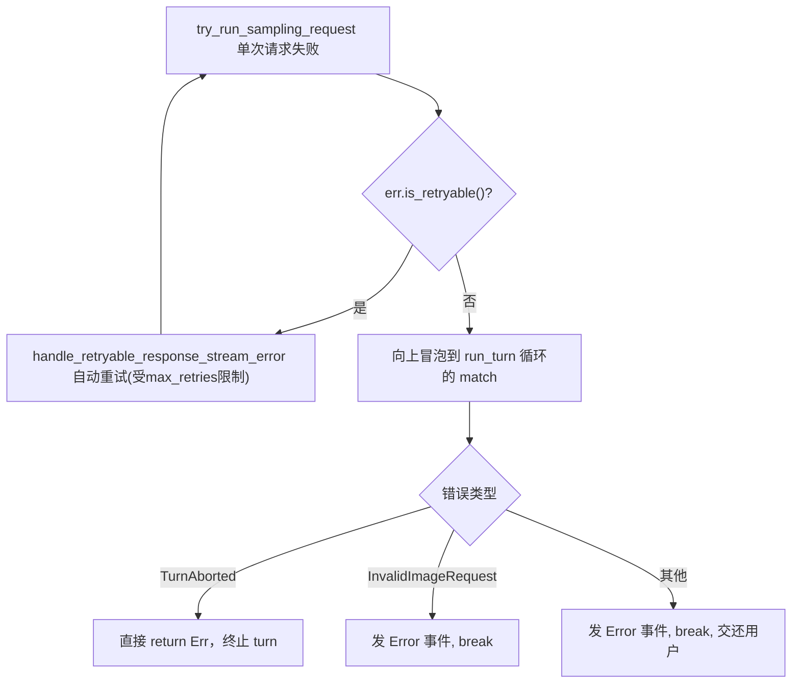

# DeepWiki Q&A: 多步骤任务出错后的处理（局部重试 / 替换步骤 / 重新规划）

> Source: DeepWiki Q&A with Code Context（charmbracelet/crush; anthropics/claude-code; openai/codex）
> Collected: 2026-09-20
> Published: Unknown

## Crush

### Q1 执行中发现某一步不可行时，如何决定局部重试、替换步骤还是重新规划？

## 答案

在 Crush 的架构里，并没有一个显式的"决策树"代码模块专门判断"局部重试 / 替换步骤 / 重新规划"——这个判断实际上是交给 LLM（模型）在系统提示词的指导下自主完成的，而代码层只提供了少数机制性的"护栏"（如循环检测、Hook 中断）来约束或纠正这一行为。

---

## 详细说明

### 1. 决策逻辑主要来自系统提示词 (Prompt)

Crush 的 Agent 提示词模板 `coder.md.tpl` 中的 `<error_handling>` 段落明确规定了出错时的处理流程：先读懂错误信息、定位根因，然后**尝试不同的方法**（而不是重复同样的动作），并要求"对每个错误，至少尝试两三种不同的修复策略"后才能判定为外部阻塞 crush:240-248 。这是模型进行"局部重试"（换一种方式再试同一步）的指导依据。

`<decision_making>` 段落则规定了何时应该自主决定、何时应该真正停下来问用户：只有在遇到"真正模糊的业务需求"、"多个方案都有重大取舍"、"可能造成数据丢失"或"用尽所有尝试且遇到真正阻塞性错误"时才应该停止 crush:108-120 。这可以理解为触发"重新规划"（向用户求助或调整整体方案）的边界条件。

而 `<workflow>` 段落中的"若卡住则尝试不同方法（不要重复失败）"以及"追踪原始需求"要求，隐含地规定了"替换步骤"（换一种工具/命令继续完成同一子任务）应发生在局部重试失效之后 crush:90-96 。

### 2. 代码层的机制性护栏

虽然决策本身交由模型完成，但 `sessionAgent` 在执行循环中设置了检测重复工具调用的 `StopWhen` 条件，一旦检测到同一签名的工具调用在窗口内重复次数超过阈值（`hasRepeatedToolCalls`），会强制停止当前 turn，防止模型陷入无意义的局部重试死循环 crush:1062-1064 。这个函数的具体行为在 `loop_detection_test.go` 中有详细单测覆盖，验证了何时判定为"循环检测到" crush:95-108 。

另外，在 Hook 系统中，退出码 `2` 表示仅"阻塞当前工具调用"，模型可以看到错误并尝试别的方式（对应"局部重试/替换步骤"）；而退出码 `49` 表示"中断整个 turn"，模型不再有机会自行响应，控制权直接交还用户（对应必须"重新规划"或人工介入的情形） crush:303-318 。

### 3. 总结对照表

| 情形 | 触发条件 | 机制 |
|---|---|---|
| 局部重试 | 单次工具调用失败，模型认为可换参数/方式再试 | Prompt `<error_handling>` 指导，无强制代码逻辑 |
| 替换步骤 | 多次同类失败，模型判断需换工具/命令完成同一子任务 | Prompt `<workflow>`/`<decision_making>` 指导；`hasRepeatedToolCalls` 防止死循环 crush:1062-1064  |
| 重新规划/请求用户介入 | 遇到真正阻塞性错误、需求歧义、Hook 触发 `halt`（exit 49） | Prompt `<decision_making>` 边界条件；Hook `halt` 机制 crush:310-318  |

## Notes

- 该决策过程本质上是**由 LLM 在提示词约束下自主判断**的，代码库中没有单独的"重新规划器 (re-planner)"模块或状态机来形式化这三种选择。
- 与之表面相似但不相关的内容：`internal/ui/model/ui.go` 中的 "Plan Mode"（`resetPlanModeState`、`openPlanHandoff`）是 UI 层面的"计划模式 ↔ 代码模式"切换功能，与执行中失败后的决策逻辑无关，只是用户交互流程的一部分 crush:5185-5202 。
- `internal/cmd/root.go` 中的 `createWorkspaceOnLiveServer` 重试逻辑是针对服务器基础设施层面（工作区创建失败重试），与 Agent 执行步骤失败的决策无关 crush:464-482 ，仅提及以避免混淆。

Wiki pages you might want to explore:
- [Streaming and Summarization (charmbracelet/crush)](/wiki/charmbracelet/crush#4.5)
- [Glossary (charmbracelet/crush)](/wiki/charmbracelet/crush#9)

### Citations

**File:** internal/agent/templates/coder.md.tpl (L90-96)
```text
**Key behaviors**:
- Use find_references before changing shared code
- Follow existing patterns (check similar files)
- If stuck, try different approach (don't repeat failures)
- Make decisions yourself (search first, don't ask)
- Fix problems at root cause, not surface-level patches
- Don't fix unrelated bugs or broken tests (mention them in final message if relevant)
```

**File:** internal/agent/templates/coder.md.tpl (L108-120)
```text
**Only stop/ask user if**:
- Truly ambiguous business requirement
- Multiple valid approaches with big tradeoffs
- Could cause data loss
- Exhausted all attempts and hit actual blocking errors

**When requesting information/access**:
- Exhaust all available tools, searches, and reasonable assumptions first.
- Never say "Need more info" without detail.
- In the same message, list each missing item, why it is required, acceptable substitutes, and what you already attempted.
- State exactly what you will do once the information arrives so the user knows the next step.

When you must stop, first finish all unblocked parts of the request, then clearly report: (a) what you tried, (b) exactly why you are blocked, and (c) the minimal external action required. Don't stop just because one path failed—exhaust multiple plausible approaches first.
```

**File:** internal/agent/templates/coder.md.tpl (L240-248)
```text
<error_handling>
When errors occur:
1. Read complete error message
2. Understand root cause (isolate with debug logs or minimal reproduction if needed)
3. Try different approach (don't repeat same action)
4. Search for similar code that works
5. Make targeted fix
6. Test to verify
7. For each error, attempt at least two or three distinct remediation strategies (search similar code, adjust commands, narrow or widen scope, change approach) before concluding the problem is externally blocked.
```

**File:** internal/agent/agent.go (L1062-1064)
```go
			func(steps []fantasy.StepResult) bool {
				return hasRepeatedToolCalls(steps, loopDetectionWindowSize, loopDetectionMaxRepeats)
			},
```

**File:** internal/agent/loop_detection_test.go (L95-108)
```go
	t.Run("loop detected", func(t *testing.T) {
		// 6 identical steps in a window of 10 with maxRepeats=5 → detected
		steps := make([]fantasy.StepResult, 10)
		for i := range 6 {
			steps[i] = makeToolStep("read", `{"file":"a.go"}`, "content")
		}
		for i := 6; i < 10; i++ {
			steps[i] = makeToolStep("tool", fmt.Sprintf(`{"i":%d}`, i), fmt.Sprintf("result-%d", i))
		}
		result := hasRepeatedToolCalls(steps, 10, 5)
		if !result {
			t.Error("expected true when same signature appears more than maxRepeats times")
		}
	})
```

**File:** docs/hooks/README.md (L303-318)
```markdown
| Exit Code | Meaning                                                          |
| --------- | ---------------------------------------------------------------- |
| 0         | Success. Stdout is parsed as JSON (see fields below).            |
| 2         | **Block the tool.** Stderr is used as the deny reason (no JSON). |
| 49        | **Halt the turn.** Stderr is used as the halt reason (no JSON).  |
| Other     | Non-blocking error. Logged and ignored — the tool call proceeds. |

The difference between exit 2 and exit 49:

- **Exit 2** blocks the current tool call. The agent sees the error and can try
  something else.
- **Exit 49** halts the whole turn. The agent doesn't get to respond further;
  the user takes over. Use this when something is wrong enough that the agent
  shouldn't keep trying. 49 sits in an empty slice of the exit-code space —
  between the generic-error range (1-30), the BSD `sysexits.h` range (64-78),
  and the killed-by-signal range (128+) — so it can't be hit by accident.
```

**File:** internal/ui/model/ui.go (L5185-5202)
```go
func (m *UI) resetPlanModeState() tea.Cmd {
	m.setPlanReadyPending("")
	if _, ok := m.activeInline.(*dialog.PlanHandoffInline); ok {
		m.activeInline = nil
		m.textarea.Focus()
	}
	if m.mode != uiInputModePlan {
		return nil
	}
	// The backend rejects agent switches while a run is active (409). When
	// one is, keep the mode as-is: the server's active agent still matches
	// what the editor shows, and the next Shift+Tab lands back in code mode
	// once the run finishes.
	if m.isAgentBusy() {
		return nil
	}
	return m.setInputMode(uiInputModeCode)
}
```

**File:** internal/cmd/root.go (L464-482)
```go
func createWorkspaceOnLiveServer(
	ctx context.Context, c *client.Client, req proto.Workspace, replace func() error,
) (*proto.Workspace, error) {
	for attempt := range maxStaleServerRetries {
		ws, err := c.CreateWorkspace(ctx, req)
		if err == nil {
			return ws, nil
		}
		if !errors.Is(err, client.ErrServerShuttingDown) || attempt == maxStaleServerRetries-1 {
			return nil, fmt.Errorf("failed to create workspace: %v", err)
		}
		slog.Warn("Server is shutting down; retrying against a replacement",
			"attempt", attempt+1, "error", err)
		if err := replace(); err != nil {
			return nil, err
		}
	}
	return nil, fmt.Errorf("failed to create workspace: server kept shutting down")
}
```

### Q2 没有所谓 plan and execute 的部分吗，然后过程中走不通就需要 replan

## 答案

是的，Crush 确实有明确的 "Plan → Execute" 两阶段流程，但**回退到重新规划（replan）是通过用户在 UI 上手动确认/请求修改来完成的，而不是执行中自动触发的机制**。

---

## 详细说明

### 1. Plan 与 Coder 是两个独立的 Agent/Prompt

Crush 内置了 `planPrompt` 和 `coderPrompt` 两套系统提示词模板，分别对应 "计划" 和 "编码执行" 两种模式 crush:1-45 。UI 层通过 `uiInputMode`（`uiInputModePlan` / `uiInputModeCode`）在这两个 Agent 间切换，`setInputMode` 负责实际发起切换请求 crush:4304-4331 。

### 2. Plan 完成后的 "Handoff" 流程

当计划 Agent 在回复末尾输出 `PlanReadyMarker`（`<!-- CRUSH_PLAN_READY -->`）时，说明它认为计划已经完备 crush:39-47 。`handlePlanHandoff` 检测到这个标记后会打开一个 "Plan Handoff" 内联对话框，等待用户确认 crush:5158-5180 。

这个对话框有两个出口，在 `openPlanHandoff` 中定义：

- `OnConfirm`：用户认可计划，切换到 Code 模式并自动发送 "Implement the plan." 隐藏消息，交给 Coder Agent 执行 crush:5213-5230 。
- `OnRequestChanges`：用户认为计划不行，直接把反馈文字送回给（仍处于 Plan 模式的）Agent，让其**重新规划** crush:5231-5233 ，测试用例也验证了这个路径下模式仍停留在 `uiInputModePlan` crush:352-368 。

### 3. 执行阶段（Coder 模式）中途走不通时，并不会自动 replan

一旦进入 Code 模式开始执行，Coder Agent 遵循的是之前提到的 `coder.md.tpl` 里的错误处理准则（局部重试 → 换方法 → 实在不行再停下汇报） crush:240-248 ，代码里也只有循环检测（`hasRepeatedToolCalls`）这种护栏 crush:1062-1064 ，**没有代码逻辑会在执行失败时自动把 Agent 切回 Plan 模式重新生成计划**。想要重新规划，需要用户主动通过 `Shift+Tab` 等方式切回 Plan 模式，或者在新一轮对话中要求 Agent 重新审视方案。

值得一提的是 `resetPlanModeState` 只在切换 Session 时把 UI 从 Plan 模式复位回 Code 模式，与执行失败无关，纯粹是会话生命周期管理 crush:5182-5202 。

## Notes

- "Plan and Execute" 在 Crush 里体现为两个显式、用户可切换的 Agent/模式，而不是同一个执行循环内部的隐式子步骤划分 crush:17-18 。
- Replan 的触发点是 **计划评审阶段的人工反馈**（`OnRequestChanges`），而非**执行阶段的自动失败检测**；执行阶段的失败处理仍完全依赖 Coder 提示词里描述的"重试/换方法/上报阻塞"逻辑。
- 如果你想了解 `internal/agent/templates/plan.md.tpl` 的具体提示词内容（例如它是否指导模型主动请求用户确认），当前索引未包含该文件全文，建议开启一个 Devin session 以获取完整内容。

Wiki pages you might want to explore:
- [TUI Architecture (charmbracelet/crush)](/wiki/charmbracelet/crush#5.1)

### Citations

**File:** internal/agent/prompts.go (L1-45)
```go
package agent

import (
	"context"
	_ "embed"

	"github.com/charmbracelet/crush/internal/agent/prompt"
	"github.com/charmbracelet/crush/internal/config"
)

//go:embed templates/coder.md.tpl
var coderPromptTmpl []byte

//go:embed templates/task.md.tpl
var taskPromptTmpl []byte

//go:embed templates/plan.md.tpl
var planPromptTmpl []byte

//go:embed templates/initialize.md.tpl
var initializePromptTmpl []byte

func coderPrompt(opts ...prompt.Option) (*prompt.Prompt, error) {
	systemPrompt, err := prompt.NewPrompt("coder", string(coderPromptTmpl), opts...)
	if err != nil {
		return nil, err
	}
	return systemPrompt, nil
}

func taskPrompt(opts ...prompt.Option) (*prompt.Prompt, error) {
	systemPrompt, err := prompt.NewPrompt("task", string(taskPromptTmpl), opts...)
	if err != nil {
		return nil, err
	}
	return systemPrompt, nil
}

func planPrompt(opts ...prompt.Option) (*prompt.Prompt, error) {
	systemPrompt, err := prompt.NewPrompt("plan", string(planPromptTmpl), opts...)
	if err != nil {
		return nil, err
	}
	return systemPrompt, nil
}
```

**File:** internal/ui/model/ui.go (L4304-4331)
```go
func (m *UI) setInputMode(target uiInputMode) tea.Cmd {
	agentID := config.AgentPlan
	if target == uiInputModeCode {
		agentID = config.AgentCoder
	}

	// YOLO is orthogonal to the input mode, so report it alongside the mode
	// instead of treating a YOLO-enabled coder as plain "code".
	yolo := target == uiInputModeCode && m.com.Workspace.PermissionSkipRequests()

	// The agent switch is an HTTP round-trip in client/server mode, so it
	// runs off the update loop together with the model update. The mode and
	// editor prompt only change once the switch succeeds (applyModeSwitch),
	// so a failed switch never leaves the editor claiming a mode the
	// server's active agent does not match.
	m.modeSwitching = true
	return func() tea.Msg {
		err := m.com.Workspace.AgentSetMain(agentID)
		if err == nil {
			err = m.com.Workspace.UpdateAgentModel(context.Background())
		}
		return modeSwitchedMsg{
			mode: target,
			yolo: yolo,
			err:  err,
		}
	}
}
```

**File:** internal/ui/model/ui.go (L5158-5180)
```go
// handlePlanHandoff checks whether a completed run in plan mode contained the
// plan-ready sentinel marker and, if so, opens the plan handoff dialog.
func (m *UI) handlePlanHandoff(rc notify.RunComplete) tea.Cmd {
	if m.mode != uiInputModePlan {
		return nil
	}
	if rc.Error != "" || rc.Cancelled {
		return nil
	}
	if m.session == nil || rc.SessionID != m.session.ID {
		return nil
	}
	if !common.PlanReadyMarkerPresent(rc.Text) {
		slog.Debug("Plan run completed without ready marker", "session_id", rc.SessionID)
		return nil
	}
	m.setPlanReadyPending(rc.SessionID)
	if _, ok := m.activeInline.(*dialog.PlanHandoffInline); ok {
		return nil
	}
	m.openPlanHandoff()
	return nil
}
```

**File:** internal/ui/model/ui.go (L5182-5202)
```go
// resetPlanModeState drops any pending plan handoff and, when plan mode is
// active, switches back to code mode. Used when the UI moves to a different
// session, since plan mode is scoped to the session it was enabled in.
func (m *UI) resetPlanModeState() tea.Cmd {
	m.setPlanReadyPending("")
	if _, ok := m.activeInline.(*dialog.PlanHandoffInline); ok {
		m.activeInline = nil
		m.textarea.Focus()
	}
	if m.mode != uiInputModePlan {
		return nil
	}
	// The backend rejects agent switches while a run is active (409). When
	// one is, keep the mode as-is: the server's active agent still matches
	// what the editor shows, and the next Shift+Tab lands back in code mode
	// once the run finishes.
	if m.isAgentBusy() {
		return nil
	}
	return m.setInputMode(uiInputModeCode)
}
```

**File:** internal/ui/model/ui.go (L5213-5230)
```go
func (m *UI) openPlanHandoff() {
	inline := dialog.NewPlanHandoffInline(m.com)
	inline.OnConfirm = func(yolo bool) tea.Cmd {
		if m.com.Workspace.PermissionSkipRequests() != yolo {
			m.toggleYoloMode()
		}
		m.setPlanReadyPending("")
		sessionID := m.session.ID
		cmd := m.setInputMode(uiInputModeCode)
		return func() tea.Msg {
			result := cmd()
			if switched, ok := result.(modeSwitchedMsg); ok {
				switched.continueSessionID = sessionID
				return switched
			}
			return result
		}
	}
```

**File:** internal/ui/model/ui.go (L5231-5233)
```go
	inline.OnRequestChanges = func(feedback string) tea.Cmd {
		return m.sendMessage(feedback)
	}
```

**File:** internal/ui/common/common.go (L39-47)
```go
// PlanReadyMarkerPresent reports whether text contains the plan-ready sentinel
// on a line by itself. An own-line check (rather than a substring match) avoids
// a false positive when the agent merely mentions the marker inside explanatory
// prose, while still tolerating trailing whitespace or notes after it. Inline
// code backticks around the marker count as a marker line too: some models wrap
// the marker despite the prompt asking for plain text.
func PlanReadyMarkerPresent(text string) bool {
	return planMarkerPresent(text, PlanReadyMarker)
}
```

**File:** internal/ui/model/ui_test.go (L352-368)
```go
func TestHandlePlanHandoff_RequestChangesSendsFeedbackInPlanMode(t *testing.T) {
	t.Parallel()
	u, ws := newPlanUI(t, "sess-1")
	ws.agentReady = true
	u.handlePlanHandoff(notify.RunComplete{
		SessionID: "sess-1",
		Text:      "Here is the plan.\n<!-- CRUSH_PLAN_READY -->",
	})

	inline, ok := u.activeInline.(*dialog.PlanHandoffInline)
	require.True(t, ok)
	require.NotNil(t, inline.OnRequestChanges)
	require.NotNil(t, inline.OnConfirm)

	cmd := inline.OnRequestChanges("Revise the scope")
	require.NotNil(t, cmd)
	require.Equal(t, uiInputModePlan, u.mode)
```

### Q3 从出错到回到用户手动确认是一个怎么样的过程和逻辑呢

## 答案

严格来说，Crush 代码库里"出错→回到用户手动确认"并不是单一统一的流程，而是分成几条互不相同的具体路径，分别对应不同的错误类型。下面按实际代码路径列出。

---

## 详细说明

### 路径一：Plan 模式下运行出错 → 不弹出确认框，直接留给用户

`handlePlanHandoff` 在 Plan 模式下检查一次 run 是否完成、是否带有计划就绪标记；如果 `rc.Error != ""`（运行报错）或 `rc.Cancelled`，函数直接 `return nil`，**不会**打开 `PlanHandoffInline` 对话框 crush:5158-5169 。测试 `TestHandlePlanHandoff_ErrorRunNoInline` 验证了这一点：即使文本里带有 ready marker，只要 `Error` 字段非空，`activeInline` 仍为 `nil` crush:295-304 。

这意味着：**出错时系统不会自动进入"确认/修改计划"的 UI 流程**，而是让报错直接展示给用户，用户需要手动决定下一步（重新输入 prompt、切换模式等），没有专门的错误恢复状态机。

### 路径二：Hook 触发 `halt`（exit 49）→ 强制交还用户

在工具执行前的 `PreToolUse` Hook 体系中，如果某个 Hook 脚本以退出码 `49` 结束（或在 JSON 输出中设置 `halt: true`），`hooks.Runner.runOne` 会把这个决策标记为 `Halt: true`，同时把 `Decision` 设为 `DecisionDeny` crush:233-243 。

按照文档说明，这与普通的 `exit 2`（仅阻塞当前工具调用，模型还能继续尝试别的方法）不同：`halt` 会**结束整个 turn**，模型不再有机会自行响应，控制权直接交还给用户 crush:310-318 。也就是说，一旦触发 halt，不存在"局部重试"的空间，代码层面直接把执行权收回，等待用户在 TUI 里输入新的指令。

### 路径三：普通工具/代码错误 → 完全由 Prompt 指导模型自行判断，无需用户确认

对于最常见的情况——工具调用失败、测试失败、编辑不匹配等——处理逻辑完全写在 `coder.md.tpl` 的 `<error_handling>` 里：模型被要求理解错误、换方法重试、至少尝试两三种策略后才能判定为"外部阻塞" crush:240-248 。只有当 `<decision_making>` 中列出的边界条件被触发（真正模糊需求、大分歧方案、可能数据丢失、或已经"用尽所有尝试且遇到真正阻塞错误"）时，模型才会主动停下向用户汇报 crush:108-120 。

**这一停止行为完全依赖模型自我约束，代码层没有强制把状态切换到"等待用户确认"的 UI 组件**。用户看到的只是模型在聊天里正常输出一段说明文字，随后由用户手动在编辑框里回复。

### 路径四：Plan 计划确认（区别于"出错"）

值得强调的是，之前讨论过的 `PlanHandoffInline` 弹窗（`OnConfirm` / `OnRequestChanges`） crush:5213-5233  是**计划评审通过后**触发的确认流程，而不是"出错后"的流程——只有 Plan 模式下**成功**生成计划（无错误、带 ready marker）才会走到这里，这与本问题所问的"出错处理"是两条完全不同的路径，容易被字面相似性混淆。

---

## 总结对照

| 场景 | 触发点 | 是否弹出确认框 | 后续控制权 |
|---|---|---|---|
| Plan 模式运行本身报错 | `rc.Error != ""` | 否，`handlePlanHandoff` 直接 return nil | 用户需手动重试/编辑 |
| Hook halt (exit 49) | `hooks.Runner.runOne` 检测 exitCode 49 | 否，无 UI 对话框，只是终止 turn | 用户接管，输入新消息 |
| 普通代码/工具错误 | Prompt 内部决策逻辑 | 否，纯文本汇报 | 用户阅读后手动回复 |
| Plan 计划就绪（非错误） | `PlanReadyMarkerPresent` 检测通过 | 是，`PlanHandoffInline` | 用户点击确认/请求修改 |

## Notes

- 代码库里没有统一的"错误恢复对话框"或状态机；不同错误来源（Plan 运行本身 vs Hook vs 工具执行）走的是完全独立的代码路径。
- 如果你想了解更细致的 Hook `aggregate()` 逻辑（多个 hook 同时匹配时如何组合出 halt/deny 决策），可以进一步查看 `internal/hooks/runner.go` 中的聚合函数，但目前索引未展示其完整实现。

Wiki pages you might want to explore:
- [Streaming and Summarization (charmbracelet/crush)](/wiki/charmbracelet/crush#4.5)
- [Hooks System (charmbracelet/crush)](/wiki/charmbracelet/crush#7.5)
- [Glossary (charmbracelet/crush)](/wiki/charmbracelet/crush#9)

### Citations

**File:** internal/ui/model/ui.go (L5158-5169)
```go
// handlePlanHandoff checks whether a completed run in plan mode contained the
// plan-ready sentinel marker and, if so, opens the plan handoff dialog.
func (m *UI) handlePlanHandoff(rc notify.RunComplete) tea.Cmd {
	if m.mode != uiInputModePlan {
		return nil
	}
	if rc.Error != "" || rc.Cancelled {
		return nil
	}
	if m.session == nil || rc.SessionID != m.session.ID {
		return nil
	}
```

**File:** internal/ui/model/ui.go (L5213-5233)
```go
func (m *UI) openPlanHandoff() {
	inline := dialog.NewPlanHandoffInline(m.com)
	inline.OnConfirm = func(yolo bool) tea.Cmd {
		if m.com.Workspace.PermissionSkipRequests() != yolo {
			m.toggleYoloMode()
		}
		m.setPlanReadyPending("")
		sessionID := m.session.ID
		cmd := m.setInputMode(uiInputModeCode)
		return func() tea.Msg {
			result := cmd()
			if switched, ok := result.(modeSwitchedMsg); ok {
				switched.continueSessionID = sessionID
				return switched
			}
			return result
		}
	}
	inline.OnRequestChanges = func(feedback string) tea.Cmd {
		return m.sendMessage(feedback)
	}
}
```

**File:** internal/ui/model/ui_test.go (L295-304)
```go
func TestHandlePlanHandoff_ErrorRunNoInline(t *testing.T) {
	t.Parallel()
	u, _ := newPlanUI(t, "sess-1")
	u.handlePlanHandoff(notify.RunComplete{
		SessionID: "sess-1",
		Text:      "plan\n<!-- CRUSH_PLAN_READY -->",
		Error:     "something went wrong",
	})
	require.Nil(t, u.activeInline)
}
```

**File:** internal/hooks/runner.go (L233-243)
```go
		case HaltExitCode:
			// Exit code 49 = halt the whole turn. Stderr is the reason.
			reason := strings.TrimSpace(stderr.String())
			if reason == "" {
				reason = "turn halted by hook"
			}
			return HookResult{
				Decision: DecisionDeny,
				Halt:     true,
				Reason:   reason,
			}
```

**File:** docs/hooks/README.md (L310-318)
```markdown
The difference between exit 2 and exit 49:

- **Exit 2** blocks the current tool call. The agent sees the error and can try
  something else.
- **Exit 49** halts the whole turn. The agent doesn't get to respond further;
  the user takes over. Use this when something is wrong enough that the agent
  shouldn't keep trying. 49 sits in an empty slice of the exit-code space —
  between the generic-error range (1-30), the BSD `sysexits.h` range (64-78),
  and the killed-by-signal range (128+) — so it can't be hit by accident.
```

**File:** internal/agent/templates/coder.md.tpl (L108-120)
```text
**Only stop/ask user if**:
- Truly ambiguous business requirement
- Multiple valid approaches with big tradeoffs
- Could cause data loss
- Exhausted all attempts and hit actual blocking errors

**When requesting information/access**:
- Exhaust all available tools, searches, and reasonable assumptions first.
- Never say "Need more info" without detail.
- In the same message, list each missing item, why it is required, acceptable substitutes, and what you already attempted.
- State exactly what you will do once the information arrives so the user knows the next step.

When you must stop, first finish all unblocked parts of the request, then clearly report: (a) what you tried, (b) exactly why you are blocked, and (c) the minimal external action required. Don't stop just because one path failed—exhaust multiple plausible approaches first.
```

**File:** internal/agent/templates/coder.md.tpl (L240-248)
```text
<error_handling>
When errors occur:
1. Read complete error message
2. Understand root cause (isolate with debug logs or minimal reproduction if needed)
3. Try different approach (don't repeat same action)
4. Search for similar code that works
5. Make targeted fix
6. Test to verify
7. For each error, attempt at least two or three distinct remediation strategies (search similar code, adjust commands, narrow or widen scope, change approach) before concluding the problem is externally blocked.
```

## Claude Code

### Q1 执行中发现某一步不可行时，如何决定局部重试、替换步骤还是重新规划？

## Answer

我在当前提供的代码上下文中没有找到关于"执行中某一步不可行时如何决定局部重试、替换步骤还是重新规划"的具体机制或文档。提供的片段主要涉及 Claude Code 的 subagent/Task 工具体系（如 `Task` 工具的调用流程、`agent_type`/`isolation`/`background` 等参数） claude-code:439-441 ，以及 `code-review` 插件的多步骤审查流程 claude-code:12-20 ，但都没有描述失败步骤后"重试 vs 替换 vs 重新规划"的决策逻辑。

---

### 说明

- Agent 系统的相关文档聚焦在如何创建、隔离和监控 subagent（如 worktree 隔离、后台执行、生命周期钩子如 `SubagentStop`、`TaskCompleted` 等） claude-code:211-211 ，属于执行框架层面，而非任务规划/重规划的决策算法。
- `code-review.md` 中的步骤（如 Agent 1-4 并行审查、失败条件判断等）是针对代码审查这一特定工作流的固定步骤序列，并没有涉及"步骤失败后如何决策"的通用逻辑 claude-code:14-20 。
- `code-explorer` agent 的定义描述的是分析代码库的方法论，同样不涉及执行失败后的决策机制 claude-code:14-37 。

## Notes

如果你想了解的是 Claude Code 这个产品/模型在实际使用中对失败步骤的通用行为准则（例如提示工程层面的策略），这类信息可能存在于系统提示词、模型训练文档或未被索引到当前代码库的其他资料中，而不是当前代码库能够体现的内容。

Wiki pages you might want to explore:
- [Agent System & Subagents (anthropics/claude-code)](/wiki/anthropics/claude-code#3.1)

### Citations

**File:** CHANGELOG.md (L211-211)
```markdown
- Fixed hook-driven sessions (such as an active `/goal`) ending with "Prompt is too long" instead of compacting when the context overflowed again after a reactive compaction
```

**File:** CHANGELOG.md (L439-441)
```markdown
- Improved the Artifact tool's error when a page declares a capability its contract version lacks: it now lists every supported capability and notes when a newer contract version has it
- Improved artifact watching: a session can now watch up to 10 published artifacts at once for republishes made elsewhere, up from 5
- Improved PDF @-mentions to say "page count unknown" instead of a page count guessed from the file size when pdfinfo cannot count the pages
```

**File:** plugins/code-review/commands/code-review.md (L12-20)
```markdown
To do this, follow these steps precisely:

1. Launch a haiku agent to check if any of the following are true:
   - The pull request is closed
   - The pull request is a draft
   - The pull request does not need code review (e.g. automated PR, trivial change that is obviously correct)
   - Claude has already commented on this PR (check `gh pr view <PR> --comments` for comments left by claude)

   If any condition is true, stop and do not proceed.
```

**File:** plugins/feature-dev/agents/code-explorer.md (L14-37)
```markdown
## Analysis Approach

**1. Feature Discovery**
- Find entry points (APIs, UI components, CLI commands)
- Locate core implementation files
- Map feature boundaries and configuration

**2. Code Flow Tracing**
- Follow call chains from entry to output
- Trace data transformations at each step
- Identify all dependencies and integrations
- Document state changes and side effects

**3. Architecture Analysis**
- Map abstraction layers (presentation → business logic → data)
- Identify design patterns and architectural decisions
- Document interfaces between components
- Note cross-cutting concerns (auth, logging, caching)

**4. Implementation Details**
- Key algorithms and data structures
- Error handling and edge cases
- Performance considerations
- Technical debt or improvement areas
```

### Q2 没有所谓 plan and execute 的部分吗，然后过程中走不通就需要 replan

## Answer

在已索引的代码库中，没有找到一个实现"plan and execute + 失败后 replan"的具体系统或调度器代码。最接近的是两处文档性质的内容，但它们都不是可执行的决策逻辑：

1. `/plan` 是一个进入"plan mode"的斜杠命令快捷方式，仅用于切换到规划模式，并不包含步骤失败后重试/替换/重规划的处理逻辑 claude-code:5888-5888 。

2. 在 `plugin-dev` 插件的 Agent 开发指南中，有一段**编写 Agent 系统提示词的模板**（Pattern 4: Orchestration Agents），其中确实提到了"Phase failure: Attempt retry, then report and stop"作为编写提示词时的建议措辞 claude-code:196-230 。但这只是**教开发者如何写 orchestration 类 agent 的提示词范例**，本身不是 Claude Code 内部真正的规划/重规划引擎，也没有区分"局部重试 / 替换步骤 / 重新规划"三种策略——它给出的默认策略只是"重试一次，然后报告并停止"，并不涉及"重新规划(replan)"这个分支。

---

### 结论
- 没有找到实现"plan → execute → 若某步不可行则 replan"这种带分支决策（重试 vs 替换 vs 重新规划）的具体代码或算法。
- 已有的 `/plan` 命令只是 UI/模式开关 claude-code:5888-5888 ；`system-prompt-design.md` 里的"Orchestration Agents"模式只是写给插件开发者参考的通用 prompt 编写建议，且仅给出"重试→报告停止"两级策略，未涉及重规划 claude-code:184-230 。
- 如果这种"局部重试/替换步骤/重新规划"三分支决策逻辑存在于 Claude 模型本身的系统提示词或推理策略中（而非仓库代码），那部分内容不在当前索引范围内，我无法确认。

## Notes
如果你怀疑某个具体的 orchestrator/planner 实现文件（例如 dynamic workflows 相关代码）包含这部分逻辑，但因索引大小限制未被检索到，建议开启一个完整的 Devin session 来直接查看该文件全文，以获得确定性答案。

Wiki pages you might want to explore:
- [Agent System & Subagents (anthropics/claude-code)](/wiki/anthropics/claude-code#3.1)
- [Other Marketplace Plugins (anthropics/claude-code)](/wiki/anthropics/claude-code#5.8)

### Citations

**File:** CHANGELOG.md (L5888-5888)
```markdown
- Added `/plan` command shortcut to enable plan mode directly from the prompt
```

**File:** plugins/plugin-dev/skills/agent-development/references/system-prompt-design.md (L184-230)
```markdown
## Pattern 4: Orchestration Agents

For agents that coordinate multiple tools or steps:

```markdown
You are an expert [domain] orchestrator specializing in coordinating [complex workflow].

**Your Core Responsibilities:**
1. Coordinate [multi-step process]
2. Manage [resources/tools/dependencies]
3. Ensure [successful completion/integration]

**Orchestration Process:**
1. **Plan**: Understand full workflow and dependencies
2. **Prepare**: Set up prerequisites
3. **Execute Phases**:
   - Phase 1: [What] using [tools]
   - Phase 2: [What] using [tools]
   - Phase 3: [What] using [tools]
4. **Monitor**: Track progress and handle failures
5. **Verify**: Confirm successful completion
6. **Report**: Provide comprehensive summary

**Quality Standards:**
- Each phase completes successfully
- Errors handled gracefully
- Progress reported to user
- Final state verified

**Output Format:**
## Workflow Execution Report

### Completed Phases
- [Phase]: [Result]

### Results
- [Output 1]
- [Output 2]

### Next Steps
[If applicable]

**Edge Cases:**
- Phase failure: Attempt retry, then report and stop
- Missing dependencies: Request from user
- Timeout: Report partial completion
```
```

### Q3 那对于有 plan 的执行，出错了怎么办呢

## Answer

在已索引的代码库中，我没有找到 plan mode 执行出错时的具体处理逻辑（例如失败后如何重规划）的实现代码。

---

### 现有可见信息

代码库中能确认的是，`PermissionMode` 类型定义里存在 `'plan'` 这个模式值，注释说明它是"Planning mode, no actual tool execution"，即在 plan 模式下工具调用不会真正执行 claude-code:6017-6020 。这说明 plan mode 本身的定位是"只生成计划、不执行"，而"执行"发生在退出 plan mode（用户批准计划）之后，这两个阶段的边界在这份类型定义中是清楚的，但具体切换后的执行引擎、以及执行中出错如何处理，并未包含在已索引的文件中。

CHANGELOG 中也只出现了 plan mode 相关的 bug 修复记录，例如"Fixed plan mode auto-running file-modifying Bash commands...without a permission prompt"（修复 plan 模式下某些命令绕过权限提示直接执行的问题） claude-code:2106-2106 ，以及`/plan` 命令的引入历史 claude-code:5888-5888  和支持直接带描述进入 plan 并开始执行 claude-code:4974-4974 。这些都属于 UI/权限层面的修复记录，而不是"计划执行出错后如何决策（重试/替换/重规划）"这类调度算法的说明。

### 结论

无法在当前索引到的代码中确认"有 plan 的执行过程中出错"后系统采取的具体策略（重试 / 修改步骤 / 重新规划）。这类决策逻辑更可能存在于模型自身的推理/系统提示词层面，而不是可被静态检索到的调度器代码，或者存在于本次索引未覆盖到的源文件里。

## Notes

如果你确定存在专门的 planner/orchestrator 源文件（而不是文档或 CHANGELOG），建议启动 Devin session 直接搜索代码库源码目录（而非本 wiki 索引，其覆盖面有限且偏重于变更日志与插件文档），以确认是否有显式的 replan 分支逻辑。

Wiki pages you might want to explore:
- [System Architecture (anthropics/claude-code)](/wiki/anthropics/claude-code#1.1)

### Citations

**File:** mods/types/claude-code.d.ts (L6017-6020)
```typescript
  /**
   * Permission mode for controlling how tool executions are handled. 'default' - Standard behavior, prompts for dangerous operations. 'acceptEdits' - Auto-accept file edit operations. 'bypassPermissions' - Bypass all permission checks (requires allowDangerouslySkipPermissions). 'plan' - Planning mode, no actual tool execution. 'dontAsk' - Don't prompt for permissions, deny if not pre-approved. 'auto' - Use a model classifier to approve/deny permission prompts.
   */
  type PermissionMode = 'default' | 'acceptEdits' | 'bypassPermissions' | 'plan' | 'dontAsk' | 'auto';
```

**File:** CHANGELOG.md (L2106-2106)
```markdown
- Fixed plan mode auto-running file-modifying Bash commands (e.g. `touch`, `rm`) without a permission prompt or SDK `canUseTool` callback
```

**File:** CHANGELOG.md (L4974-4974)
```markdown
- Added optional description argument to `/plan` (e.g., `/plan fix the auth bug`) that enters plan mode and immediately starts
```

**File:** CHANGELOG.md (L5888-5888)
```markdown
- Added `/plan` command shortcut to enable plan mode directly from the prompt
```

### Q4 那换个问题，对于多步骤的任务，中间一个环节出错以后，处理的方式是什么

## Answer

在已索引的代码库中，仍然没有找到一个统一的"多步骤任务中间环节出错"的通用决策引擎源码。但可以看到的是，Claude Code 里不同的多步骤系统（`/goal`、dynamic workflows、agent 编排提示词模板）各自采用的是**局部的、针对性的容错策略**，而不是一个统一的"重试/替换/重规划"三分支调度器。

---

## 具体证据

### 1. `/goal`：带退避的自动重试 + 暂停等待
`/goal` 这个多步骤任务在遇到 API 错误、网络中断或 token 限制时，会自动带退避重试，或暂停并说明原因（包括等待用量限制重置） claude-code:553-553 。这是一种"原地重试直到恢复"的策略，而不是替换步骤或重新规划。

### 2. Dynamic Workflows：命中用量限制时暂停并自动续跑
对于编排多个 agent 的 dynamic workflows，当命中 usage limit 时会暂停，并在限制重置后自动继续，而不是直接丢弃受影响的 agent claude-code:460-460 。这同样是"暂停-恢复"而非重新规划整个工作流。

### 3. 通用 transient error 重试机制
针对瞬时性错误（如 429、ECONNRESET），CHANGELOG 中多处记录显示系统会自动带退避重试整个 turn，而不是终止或重规划 claude-code:2473-2474 claude-code:2487-2487 。

### 4. Agent Teams：teammate 失败上报机制
在多 agent 协作（agent teams）场景中，一个因 API 错误"死掉"的 teammate 会向 lead 汇报"failed"，而卡住的 teammate 可以被消息唤醒重试 claude-code:2490-2490 。这里的处理方式是"上报失败给协调者"，具体后续（重试/替换/重规划）取决于 lead（也就是发起任务的模型本身）如何应对，但这个决策逻辑不在可检索的调度器代码里，而是在模型的对话推理里。

### 5. Prompt 模板层面的建议（仅供插件开发者参考）
`plugin-dev` 的 agent 开发文档里给出的 Orchestration Agent 提示词模板，将"Phase failure"的默认处理写作"Attempt retry, then report and stop" claude-code:226-229 ，同样只是重试一次后终止，不涉及替换步骤或重新规划分支。

### 6. Slash Command Workflow 文档中的错误处理范式
`plugin-dev` 的 command-development 文档展示了三种手写 workflow 里常见的错误处理范式：**Graceful Failure**（失败后询问用户是修复重试/跳过/中止） claude-code:519-544 ，**Rollback on Failure**（失败后自动回滚到之前状态） claude-code:550-577 ，以及 **Checkpoint Recovery**（每步成功后记录 checkpoint，失败后可以从最近的 checkpoint 恢复） claude-code:579-600 。这些是文档中教开发者如何**自己在 slash command workflow 里手写**错误处理逻辑的范式，而不是 Claude Code 内建的、对所有多步骤任务通用的处理机制。

---

## 结论

现有索引中能看到的是**各个具体子系统（`/goal`、dynamic workflows、agent teams）针对自身场景各自实现的容错策略**（多为"带退避重试"或"暂停恢复"），而没有一个跨系统统一的"步骤失败 → 局部重试 / 替换 / 重新规划"决策引擎的源码。若要判断某一步失败后是重试、替换步骤还是重新规划，这个判断更可能是由发起任务的 Claude 模型在对话推理中动态做出的，而不是由代码库中某个可检索的调度算法硬编码决定的。

## Notes
如果你想确认某个具体子系统（比如 dynamic workflows 的调度器）内部是否有更细粒度的重试/替换/重规划分支代码，建议开启 Devin session 直接搜索该子系统的源代码目录，因为当前 wiki 索引偏重 CHANGELOG 与插件文档，覆盖面有限。

Wiki pages you might want to explore:
- [Feature Evolution & Release History (anthropics/claude-code)](/wiki/anthropics/claude-code#1.2)

### Citations

**File:** feed.xml (L460-460)
```text
&lt;p&gt;• Improved dynamic workflows to pause when you hit your usage limit and continue automatically when it resets, instead of dropping the affected agents&lt;/p&gt;
```

**File:** feed.xml (L553-553)
```text
&lt;p&gt;• Fixed /goal runs silently stalling after API errors, network drops, or token limits: the goal now retries with backoff, or pauses and says why, including until a usage limit resets&lt;/p&gt;
```

**File:** CHANGELOG.md (L2473-2474)
```markdown
- Transient server rate-limit errors (429s unrelated to your usage limit) are now retried automatically with backoff for subscribers instead of failing the turn
- `CLAUDE_CODE_RETRY_WATCHDOG` now raises the default retry count for non-capacity transient errors to 300 and lifts the cap of 15 on `CLAUDE_CODE_MAX_RETRIES`
```

**File:** CHANGELOG.md (L2487-2487)
```markdown
- Fixed brief network drops mid-response aborting the turn — transient errors like ECONNRESET now retry with backoff instead of failing
```

**File:** CHANGELOG.md (L2490-2490)
```markdown
- Fixed agent teams: a teammate that dies on an API error now reports "failed" to the lead, and messaging a stuck teammate wakes it to retry immediately
```

**File:** plugins/plugin-dev/skills/agent-development/references/system-prompt-design.md (L226-229)
```markdown
**Edge Cases:**
- Phase failure: Attempt retry, then report and stop
- Missing dependencies: Request from user
- Timeout: Report partial completion
```

**File:** plugins/plugin-dev/skills/command-development/references/advanced-workflows.md (L519-544)
```markdown
### Graceful Failure

```markdown
---
description: Resilient deployment workflow
---

# Deployment Workflow

Running steps with error handling...

## Step 1: Tests
!`npm test`

if [ $? -ne 0 ]; then
  ERROR: Tests failed

  Options:
  1. Fix tests and retry
  2. Skip tests (NOT recommended)
  3. Abort deployment

  What would you like to do?

  [Wait for user input before continuing]
fi
```
```

**File:** plugins/plugin-dev/skills/command-development/references/advanced-workflows.md (L550-577)
```markdown
### Rollback on Failure

```markdown
---
description: Deployment with rollback
---

# Deploy with Rollback

Saving current state for rollback...
Previous version: !`current-version.sh`

Deploying new version...

!`deploy.sh`

if [ $? -ne 0 ]; then
  DEPLOYMENT FAILED

  Initiating automatic rollback...
  !`rollback.sh`

  Rolled back to previous version.
  Check logs for failure details.
fi

Deployment complete.
```
```

**File:** plugins/plugin-dev/skills/command-development/references/advanced-workflows.md (L579-600)
```markdown
### Checkpoint Recovery

```markdown
---
description: Workflow with checkpoints
---

# Multi-Stage Deployment

## Checkpoint 1: Validation
!`validate.sh`
echo "checkpoint:validation" >> .claude/deployment-checkpoints.log

## Checkpoint 2: Build
!`build.sh`
echo "checkpoint:build" >> .claude/deployment-checkpoints.log

## Checkpoint 3: Deploy
!`deploy.sh`
echo "checkpoint:deploy" >> .claude/deployment-checkpoints.log

If any step fails, resume with:
```
```

## Codex

### Q1 执行中发现某一步不可行时，如何决定局部重试、替换步骤还是重新规划？

## 答案

在提供的代码上下文中，没有找到一个明确定义"局部重试 / 替换步骤 / 重新规划"三者之间选择逻辑的具体代码或规则。可以看到的相关内容仅限于 Codex CLI 的系统提示文件中关于 `update_plan` 工具的一般性指导原则，并未包含判定何时选择哪种策略的具体算法或代码实现。

---

## 详细说明

### 已知的规划相关指导

在 `gpt_5_1_prompt.md` 与 `gpt_5_2_prompt.md`（两者内容几乎一致，分别对应 GPT-5.1 与 GPT-5.2 版本的系统提示）中，"Planning" 部分说明了 agent 应使用 `update_plan` 工具来跟踪步骤和进度 codex:63-65 。

其中提到当中途需要变更计划时，应调用 `update_plan` 并提供 `explanation` 以说明变更理由 codex:71-71 。同时要求维护步骤状态（同一时刻只有一项 in_progress），并在理解发生变化时（拆分/合并/重排步骤）及时更新计划，不要让计划过时 codex:73-73 。

### Task execution 中关于持续推进的原则

"Task execution" 部分强调 agent 应持续推进直至任务完全解决，即使 function call 失败也要坚持（persevere even when function calls fail），只有确信问题已解决才终止 codex:138-138 。这体现了一种"遇阻不轻易放弃、优先尝试解决"的整体倾向，但没有给出具体的重试次数、替换步骤条件或触发重新规划的判定标准。

### 结论

- 上述文档只是**提示词层面**的通用行为准则，而非可执行的决策代码（例如没有 if/else 判断"重试 N 次后转为替换步骤"这类逻辑）。
- 由于索引大小限制，仓库中可能存在其他与执行失败处理、重试策略相关的实际实现代码（例如 Rust 核心执行循环）未被索引到，无法在此确认。

## Notes

- 若你想了解 Codex CLI 在真正执行代码/命令失败时的重试或回退机制（例如在 `codex-rs/core` 的执行循环、`apply_patch` 失败处理等），当前索引未覆盖到具体实现代码，建议启动一个 Devin session 以获取完整的仓库内容进行进一步排查。
- 两个 prompt 文件（`gpt_5_1_prompt.md` 与 `gpt_5_2_prompt.md`）内容高度重合，仅版本号和部分细节（如 Responsiveness 小节内容多寡）不同 codex:34-36 ，可作为版本差异参考，但都不涉及你所问的具体决策逻辑。

### Citations

**File:** codex-rs/core/gpt_5_1_prompt.md (L63-65)
```markdown
## Planning

You have access to an `update_plan` tool which tracks steps and progress and renders them to the user. Using the tool helps demonstrate that you've understood the task and convey how you're approaching it. Plans can help to make complex, ambiguous, or multi-phase work clearer and more collaborative for the user. A good plan should break the task into meaningful, logically ordered steps that are easy to verify as you go.
```

**File:** codex-rs/core/gpt_5_1_prompt.md (L71-71)
```markdown
Before running a command, consider whether or not you have completed the previous step, and make sure to mark it as completed before moving on to the next step. It may be the case that you complete all steps in your plan after a single pass of implementation. If this is the case, you can simply mark all the planned steps as completed. Sometimes, you may need to change plans in the middle of a task: call `update_plan` with the updated plan and make sure to provide an `explanation` of the rationale when doing so.
```

**File:** codex-rs/core/gpt_5_1_prompt.md (L73-73)
```markdown
Maintain statuses in the tool: exactly one item in_progress at a time; mark items complete when done; post timely status transitions. Do not jump an item from pending to completed: always set it to in_progress first. Do not batch-complete multiple items after the fact. Finish with all items completed or explicitly canceled/deferred before ending the turn. Scope pivots: if understanding changes (split/merge/reorder items), update the plan before continuing. Do not let the plan go stale while coding.
```

**File:** codex-rs/core/gpt_5_1_prompt.md (L138-138)
```markdown
You are a coding agent. You must keep going until the query or task is completely resolved, before ending your turn and yielding back to the user. Persist until the task is fully handled end-to-end within the current turn whenever feasible and persevere even when function calls fail. Only terminate your turn when you are sure that the problem is solved. Autonomously resolve the query to the best of your ability, using the tools available to you, before coming back to the user. Do NOT guess or make up an answer.
```

**File:** codex-rs/core/gpt_5_2_prompt.md (L34-36)
```markdown
## Responsiveness

## Planning
```

### Q2 没有所谓 plan and exctue 的部分吗，然后过程中走不通就需要 replan

## 答案

没有找到独立的、代码层面的 "plan → execute → replan" 控制循环。Codex 的架构是：LLM 在每个 turn 内自主决定何时调用 `update_plan` 工具来修改计划，这是**提示词驱动**的行为，而不是像传统 planner-executor 系统那样有硬编码的失败检测 + 重新规划逻辑 codex:71-71 。

---

## 详细说明

### 执行侧：Session / Task 循环

真正的执行循环在 `codex-rs/core/src/tasks/mod.rs` 与 `codex-rs/core/src/session/turn.rs` 中，由 `RegularTask` 驱动 `run_turn`，通过 `ModelClient` 与模型交互、流式处理响应并记录完成的 item，但这个循环本身只是"发请求 → 处理事件 → 完成 turn"，并不包含判断"某步骤失败 → 触发 replan"的硬编码分支。

### "Plan" 只是一种工具调用，不是独立的执行引擎

`update_plan` 是模型可调用的一个工具，它的 payload 会被解析为 plan 步骤列表并渐进渲染为 `PlanUpdate` 事件。测试文件里可以看到这个工具的解析和事件流转 codex:230-301 ，说明 plan 更新完全由模型主动决定何时发出，而非由某个失败检测器自动触发。

在 Plan 协作模式（`ModeKind::Plan`）下，模型输出中的 `<proposed_plan>` 块会被解析为 `TurnItem::Plan`，并通过 `PlanDelta`/`ItemCompleted` 事件呈现，但这依然只是渲染/展示机制，不涉及失败重试逻辑 codex:482-502 。

### 提示词层面的指导（唯一相关的"decision"依据）

系统提示明确要求模型在计划的某一步不再适用或理解发生变化时，**自己**调用 `update_plan` 更新计划，并给出理由 codex:71-73 。也要求模型持续推进任务，即便某次 function call 失败也要坚持，直到确认任务完成才停止 codex:138-138 。

`gpt_5_codex_prompt.md` 中另有针对 "Plan tool" 的补充指导，要求对简单任务跳过计划工具，且不要做单步计划 codex:21-26 。

### 结论

- "局部重试 vs 替换步骤 vs 重新规划"的决策**完全交由模型自身的推理**来完成，Codex 代码库本身不包含判定该走哪条路径的显式算法。
- 代码层面提供的是：(1) 执行 turn 的通用循环、(2) `update_plan` 工具的解析与事件渲染管道。这两者是"载体"，而"决策"发生在模型推理内部，由 system prompt 引导，不在可检索的代码逻辑中。

## Notes

- 若仓库中存在专门的失败检测/自动重试子系统（如工具调用失败后的退避重试），当前索引未覆盖到相关实现文件，无法确认其存在与否；建议启动 Devin session 以完整搜索代码库（如 `codex-rs/core/src/tasks/` 目录下其他文件）确认。
- `plan_mode.rs` 中的 TUI 测试仅验证 UI 层"计划弹窗"的显示逻辑 codex:1041-1086 ，与你所问的执行失败决策无关，仅供参考。

Wiki pages you might want to explore:
- [Event Processing and State Management (openai/codex)](/wiki/openai/codex#3.4)

### Citations

**File:** codex-rs/core/gpt_5_1_prompt.md (L71-73)
```markdown
Before running a command, consider whether or not you have completed the previous step, and make sure to mark it as completed before moving on to the next step. It may be the case that you complete all steps in your plan after a single pass of implementation. If this is the case, you can simply mark all the planned steps as completed. Sometimes, you may need to change plans in the middle of a task: call `update_plan` with the updated plan and make sure to provide an `explanation` of the rationale when doing so.

Maintain statuses in the tool: exactly one item in_progress at a time; mark items complete when done; post timely status transitions. Do not jump an item from pending to completed: always set it to in_progress first. Do not batch-complete multiple items after the fact. Finish with all items completed or explicitly canceled/deferred before ending the turn. Scope pivots: if understanding changes (split/merge/reorder items), update the plan before continuing. Do not let the plan go stale while coding.
```

**File:** codex-rs/core/gpt_5_1_prompt.md (L138-138)
```markdown
You are a coding agent. You must keep going until the query or task is completely resolved, before ending your turn and yielding back to the user. Persist until the task is fully handled end-to-end within the current turn whenever feasible and persevere even when function calls fail. Only terminate your turn when you are sure that the problem is solved. Autonomously resolve the query to the best of your ability, using the tools available to you, before coming back to the user. Do NOT guess or make up an answer.
```

**File:** codex-rs/core/tests/suite/tool_harness.rs (L230-301)
```rust
#[tokio::test(flavor = "multi_thread", worker_threads = 2)]
async fn update_plan_tool_rejects_malformed_payload() -> anyhow::Result<()> {
    skip_if_no_network!(Ok(()));

    let server = start_mock_server().await;

    let mut builder = test_codex().with_config(|config| config.update_plan_enabled = true);
    let TestCodex {
        codex,
        cwd,
        session_configured,
        ..
    } = builder.build(&server).await?;

    let call_id = "plan-tool-invalid";
    let invalid_args = json!({
        "explanation": "Missing plan data"
    })
    .to_string();

    let first_response = sse(vec![
        ev_response_created("resp-1"),
        ev_function_call(call_id, "update_plan", &invalid_args),
        ev_completed("resp-1"),
    ]);
    responses::mount_sse_once(&server, first_response).await;

    let second_response = sse(vec![
        ev_assistant_message("msg-1", "malformed plan payload"),
        ev_completed("resp-2"),
    ]);
    let second_mock = responses::mount_sse_once(&server, second_response).await;

    let session_model = session_configured.model.clone();
    let cwd_path = cwd.abs();
    let (sandbox_policy, permission_profile) =
        turn_permission_fields(PermissionProfile::Disabled, cwd_path.as_path());

    codex
        .start_or_steer_turn(
            TurnInputRequest::user_input(vec![UserInput::Text {
                text: "please update the plan".into(),
                text_elements: Vec::new(),
            }])
            .with_thread_settings(ThreadSettingsOverrides {
                environments: Some(local_selections(cwd_path)),
                approval_policy: Some(AskForApproval::Never),
                sandbox_policy: Some(sandbox_policy),
                permission_profile,
                collaboration_mode: Some(CollaborationMode {
                    mode: ModeKind::Default,
                    settings: Settings {
                        model: session_model,
                        reasoning_effort: None,
                        developer_instructions: None,
                    },
                }),
                ..Default::default()
            }),
        )
        .await?;

    let mut saw_plan_update = false;
    wait_for_event(&codex, |event| match event {
        EventMsg::PlanUpdate(_) => {
            saw_plan_update = true;
            false
        }
        EventMsg::TurnComplete(_) => true,
        _ => false,
    })
    .await;
```

**File:** codex-rs/core/tests/suite/items.rs (L482-502)
```rust
    let plan_delta = wait_for_event_match(&codex, |ev| match ev {
        EventMsg::PlanDelta(event) => Some(event.clone()),
        _ => None,
    })
    .await;

    let plan_completed = wait_for_event_match(&codex, |ev| match ev {
        EventMsg::ItemCompleted(ItemCompletedEvent {
            item: TurnItem::Plan(item),
            ..
        }) => Some(item.clone()),
        _ => None,
    })
    .await;

    assert_eq!(
        plan_delta.thread_id,
        session_configured.thread_id.to_string()
    );
    assert_eq!(plan_delta.delta, "- Step 1\n- Step 2\n");
    assert_eq!(plan_completed.text, "- Step 1\n- Step 2\n");
```

**File:** codex-rs/core/gpt_5_codex_prompt.md (L21-26)
```markdown
## Plan tool

When using the planning tool:
- Skip using the planning tool for straightforward tasks (roughly the easiest 25%).
- Do not make single-step plans.
- When you made a plan, update it after having performed one of the sub-tasks that you shared on the plan.
```

**File:** codex-rs/tui/src/chatwidget/tests/plan_mode.rs (L1041-1086)
```rust
#[tokio::test]
async fn plan_implementation_popup_shows_after_new_plan_follows_steer() {
    let (mut chat, _rx, mut op_rx) = make_chatwidget_manual(Some("gpt-5")).await;
    chat.set_feature_enabled(Feature::CollaborationModes, /*enabled*/ true);
    let plan_mask = collaboration_modes::mask_for_kind(chat.model_catalog.as_ref(), ModeKind::Plan)
        .expect("expected plan collaboration mask");
    chat.set_collaboration_mask(plan_mask);
    chat.thread_id = Some(ThreadId::new());

    chat.on_task_started();
    chat.on_plan_item_completed(
        "- Initial plan
"
        .to_string(),
    );
    chat.bottom_pane
        .set_composer_text("Please revise.".to_string(), Vec::new(), Vec::new());
    chat.handle_key_event(KeyEvent::new(KeyCode::Enter, KeyModifiers::NONE));

    match next_submit_op(&mut op_rx) {
        Op::UserTurn { items, .. } => assert_eq!(
            items,
            vec![UserInput::Text {
                text: "Please revise.".to_string(),
                text_elements: Vec::new(),
            }]
        ),
        other => panic!("expected Op::UserTurn, got {other:?}"),
    }

    complete_user_message(&mut chat, "user-1", "Please revise.");
    chat.on_plan_item_completed(
        "- Revised plan
"
        .to_string(),
    );
    chat.on_task_complete(
        /*last_agent_message*/ None, /*duration_ms*/ None, /*from_replay*/ false,
    );

    let popup = render_bottom_popup(&chat, /*width*/ 80);
    assert!(
        popup.contains(PLAN_IMPLEMENTATION_TITLE),
        "expected plan popup after a newer plan follows the steer, got {popup:?}"
    );
}
```

### Q3 那对于有 plan 的执行，出错了怎么办呢

## Answer

代码库中没有针对"有 plan 时执行出错"的专门处理逻辑；错误处理是**与 plan 无关的通用机制**——当一次工具调用/模型请求出错时，事件流会发出 `ServerNotification::Error`，TUI 侧根据 `will_retry` 标志区分是否会自动重试，以及是否命中 `MisalignmentPolicyViolation`，但这套机制并不会主动触发"替换步骤"或"重新规划" codex:130-152 。

---

## 详细说明

### Plan mode 下 `update_plan` 工具被禁用

值得注意的是，如果处于 Plan 协作模式（`ModeKind::Plan`），`update_plan`（TODO/checklist 工具）本身会被显式拒绝调用：`PlanHandler::handle_call` 在检测到 `turn.mode() == ModeKind::Plan` 时直接返回错误，提示该工具在 Plan 模式下不可用 codex:86-91 。这意味着 Plan 模式下的"计划"其实是通过模型输出中的 `<proposed_plan>` 结构渲染为 `TurnItem::Plan`（如 `PlanDelta`/`ItemCompleted` 事件），而非 `update_plan` 工具调用；而在非 Plan 模式（Default 模式）下，`update_plan` 才是模型主动维护 TODO 列表的工具 codex:65-99 。

### 通用错误事件处理

真正与"出错"相关的代码是 TUI 对 `ServerNotification::Error` 的处理：

- 若 `will_retry` 为 `true`，且不是回放场景，则调用 `on_stream_error` 显示一个流式错误提示，暗示底层会自动重试该请求 codex:130-137 。
- 若不会重试（`will_retry == false`），则记录 `last_non_retry_error`；如果错误类型是 `MisalignmentPolicyViolation`，触发 `on_misalignment_error`（专门用于展示"目标偏离"类错误的 UI）；否则走通用的 `handle_non_retry_error` 路径 codex:138-152 。

这个错误处理管道是**turn 级别、跨所有模式通用的**（无论 Default 还是 Plan 协作模式），它只负责"是否自动重试底层请求 / 如何展示错误"，并不会区分"某个 plan 步骤失败"这一语义，也不会自动调用 `update_plan` 或触发重新规划。

### 结论：决策仍在模型侧

综合来看：

1. 底层请求失败（网络/API 错误）由通用的 retry-or-surface-error 机制处理，与 plan 内容无关 codex:130-152 。
2. 若某个计划步骤在语义上"走不通"（例如某种实现方式失败），这类判断和应对（局部重试 / 替换步骤 / 重新规划）依然完全依赖模型在下一轮推理时的自主决定，Plan 模式下体现为模型重新输出 `<proposed_plan>`（产生新的 `PlanDelta`/新的 `TurnItem::Plan`），Default 模式下体现为模型调用 `update_plan` 更新 TODO 状态并给出 `explanation` codex:71-73 。
3. 代码库里没有一个"步骤失败次数达到阈值 → 自动转为 replan"这样的硬编码状态机。

## Notes

- 由于索引限制，`codex-rs/core/src/tasks/` 和 `codex-rs/core/src/responses_retry.rs` 等文件中可能存在更底层的请求级重试策略（如 `handle_retryable_response_stream_error`，在 `codex-rs/core/src/session/turn.rs` 的 import 中可见其存在 codex:33-35 ），但其具体重试条件/次数未在检索到的内容中展开，如需确认建议启动 Devin session 查看完整实现。
- `on_misalignment_error` 和 `handle_non_retry_error` 的具体 UI 行为未在此次检索范围内展开，仅能确认其被调用的触发条件。

Wiki pages you might want to explore:
- [Architecture Overview (openai/codex)](/wiki/openai/codex#1.3)

### Citations

**File:** codex-rs/tui/src/chatwidget/protocol.rs (L130-152)
```rust
            ServerNotification::Error(notification) => {
                if notification.will_retry {
                    if !from_replay {
                        self.on_stream_error(
                            notification.error.message,
                            notification.error.additional_details,
                        );
                    }
                } else {
                    self.last_non_retry_error = Some((
                        notification.turn_id.clone(),
                        notification.error.message.clone(),
                    ));
                    if !from_replay
                        && notification.error.codex_error_info
                            == Some(AppServerCodexErrorInfo::MisalignmentPolicyViolation)
                    {
                        self.on_misalignment_error(
                            Some(notification.turn_id),
                            notification.error.misalignment,
                        );
                    } else {
                        self.handle_non_retry_error(
```

**File:** codex-rs/core/src/tools/handlers/plan.rs (L65-99)
```rust
impl PlanHandler {
    async fn handle_call(
        &self,
        invocation: ToolInvocation,
    ) -> Result<Box<dyn crate::tools::context::ToolOutput>, FunctionCallError> {
        let ToolInvocation {
            session,
            turn,
            call_id: _,
            payload,
            ..
        } = invocation;

        let arguments = match payload {
            ToolPayload::Function { arguments } => arguments,
            _ => {
                return Err(FunctionCallError::RespondToModel(
                    "update_plan handler received unsupported payload".to_string(),
                ));
            }
        };

        if turn.mode() == ModeKind::Plan {
            return Err(FunctionCallError::RespondToModel(
                "update_plan is a TODO/checklist tool and is not allowed in Plan mode".to_string(),
            ));
        }

        let args = parse_update_plan_arguments(&arguments)?;
        session
            .send_event(turn.as_ref(), EventMsg::PlanUpdate(args))
            .await;

        Ok(boxed_tool_output(PlanToolOutput))
    }
}
```

**File:** codex-rs/core/gpt_5_1_prompt.md (L71-73)
```markdown
Before running a command, consider whether or not you have completed the previous step, and make sure to mark it as completed before moving on to the next step. It may be the case that you complete all steps in your plan after a single pass of implementation. If this is the case, you can simply mark all the planned steps as completed. Sometimes, you may need to change plans in the middle of a task: call `update_plan` with the updated plan and make sure to provide an `explanation` of the rationale when doing so.

Maintain statuses in the tool: exactly one item in_progress at a time; mark items complete when done; post timely status transitions. Do not jump an item from pending to completed: always set it to in_progress first. Do not batch-complete multiple items after the fact. Finish with all items completed or explicitly canceled/deferred before ending the turn. Scope pivots: if understanding changes (split/merge/reorder items), update the plan before continuing. Do not let the plan go stale while coding.
```

**File:** codex-rs/core/src/session/turn.rs (L33-35)
```rust
use crate::responses_retry::ResponsesStreamRequest;
use crate::responses_retry::ResponsesStreamRetryState;
use crate::responses_retry::handle_retryable_response_stream_error;
```

### Q4 那换一个问题，对于多步骤的任务，中间一个环节出错以后的处理方式是什么

## Answer

在 `run_turn` 的执行循环中（`codex-rs/core/src/session/turn.rs`），每一轮采样请求（可以理解为"一个环节"）出错后，处理方式是**按错误类型分支处理，然后跳出循环、把错误展示给用户，交由用户/模型在下一轮决定是否继续**——并不存在自动重试同一步骤或自动重新规划的机制。

---

## 详细说明

### 循环内的错误匹配分支

`run_turn` 中对 `sampling_request_result` 做 `match`，按错误类型分为几类处理：

```
Err(err) if matches!(err.details(), CodexErrorDetails::TurnAborted) => { return Err(err); }
Err(codex_error) if matches!(codex_error.details(), CodexErrorDetails::InvalidImageRequest()) => { ... }
Err(e) => { ... break; }
``` codex:610-643

具体分支：

| 错误类型 | 处理方式 |
|---|---|
| `TurnAborted`（用户取消/中断） | 直接 `return Err(err)`，整个 turn 终止 codex:610-612  |
| `InvalidImageRequest` | 记录分析数据，发出 `EventMsg::Error`（BadRequest），提示用户移除图片后重试，`break` 跳出循环 codex:613-631  |
| 其他任意错误 `Err(e)` | 记录日志、`emit_turn_error_lifecycle`、`track_turn_codex_error`，发出通用 `EventMsg::Error` 事件，然后 `break`（注释明确写着 "let the user continue the conversation"） codex:632-642  |

可以看到，无论哪种非 `TurnAborted` 错误，最终都是 **`break` 跳出 `run_turn` 的主循环**，而不是自动重试当前步骤或自动重新规划。

### 底层可重试错误在更早的地方被拦截

需要注意的是，`Err(e)` 落到上面这个 `match` 之前，实际上已经经过了一层"是否可重试"的过滤：在 `run_sampling_request` 内部（更底层），如果错误是 `err.is_retryable()`，会调用 `handle_retryable_response_stream_error` 自动做流级别重试，重试次数由 `max_retries`（来自 provider 配置）控制 codex:1495-1513 。只有不可重试的错误，或 `ContextWindowExceeded` / `UsageLimitReached` 这类特殊错误，才会一路冒泡传到上面 `run_turn` 循环里的 `match`，最终被展示为错误事件并 `break`。

### 与 TUI 侧的对应关系

这个 `EventMsg::Error` 事件最终会作为 `ServerNotification::Error` 传到 TUI，TUI 根据 `will_retry` 标志决定是展示"流式重试中"提示还是"最终错误"提示 codex:130-152 ——这与前面回答中提到的机制是同一套。

### 总结：分层来看



即：流级别的瞬时错误（网络抖动等）由底层自动重试兜底；一旦判定不可重试或达到重试上限，就直接把错误暴露给用户，由用户或模型在下一轮决定怎么办。

## Notes

- `max_retries` 的具体数值取决于 provider 配置（`stream_max_retries()`），未在检索范围内展开细节。
- `emit_turn_error_lifecycle` 和 `track_turn_codex_error` 的具体实现（可能涉及埋点/分析）未在此次检索到，如需深入建议启动 Devin session 查看完整实现。

Wiki pages you might want to explore:
- [Core Agent System (codex-core) (openai/codex)](/wiki/openai/codex#3)

### Citations

**File:** codex-rs/core/src/session/turn.rs (L610-643)
```rust
            Err(err) if matches!(err.details(), CodexErrorDetails::TurnAborted) => {
                return Err(err);
            }
            Err(codex_error)
                if matches!(
                    codex_error.details(),
                    CodexErrorDetails::InvalidImageRequest()
                ) =>
            {
                sess.track_turn_codex_error(turn_context.as_ref(), &codex_error);
                let error = CodexErrorInfo::BadRequest;
                sess.emit_turn_error_lifecycle(turn_context.as_ref(), error.clone())
                    .await;
                let event = EventMsg::Error(ErrorEvent {
                    misalignment: None,
                    message: "Invalid image in your last message. Please remove it and try again."
                        .to_string(),
                    codex_error_info: Some(error),
                });
                sess.send_event(&turn_context, event).await;
                break;
            }
            Err(e) => {
                info!("Turn error: {e:#}");
                let error = e.to_codex_protocol_error();
                sess.emit_turn_error_lifecycle(turn_context.as_ref(), error.clone())
                    .await;
                sess.track_turn_codex_error(turn_context.as_ref(), &e);
                let event = EventMsg::Error(e.to_error_event(/*message_prefix*/ None));
                sess.send_event(&turn_context, event).await;
                // let the user continue the conversation
                break;
            }
        }
```

**File:** codex-rs/core/src/session/turn.rs (L1479-1513)
```rust
            Err(err) => match err.details() {
                CodexErrorDetails::ContextWindowExceeded => {
                    sess.set_total_tokens_full(&turn_context).await;
                    return Err(err);
                }
                CodexErrorDetails::UsageLimitReached(e) => {
                    let rate_limits = e.rate_limits.clone();
                    if let Some(rate_limits) = rate_limits {
                        sess.update_rate_limits(&turn_context, *rate_limits).await;
                    }
                    return Err(err);
                }
                _ => err,
            },
        };

        if original_input.is_none() {
            original_input = Some(prompt.input);
        }

        if !err.is_retryable() {
            return Err(err);
        }

        handle_retryable_response_stream_error(
            &mut retry_state,
            max_retries,
            err,
            client_session,
            &sess,
            &turn_context,
            ResponsesStreamRequest::Sampling,
        )
        .await?;
        turn_context.turn_timing_state.record_sampling_retry();
```

**File:** codex-rs/tui/src/chatwidget/protocol.rs (L130-152)
```rust
            ServerNotification::Error(notification) => {
                if notification.will_retry {
                    if !from_replay {
                        self.on_stream_error(
                            notification.error.message,
                            notification.error.additional_details,
                        );
                    }
                } else {
                    self.last_non_retry_error = Some((
                        notification.turn_id.clone(),
                        notification.error.message.clone(),
                    ));
                    if !from_replay
                        && notification.error.codex_error_info
                            == Some(AppServerCodexErrorInfo::MisalignmentPolicyViolation)
                    {
                        self.on_misalignment_error(
                            Some(notification.turn_id),
                            notification.error.misalignment,
                        );
                    } else {
                        self.handle_non_retry_error(
```
