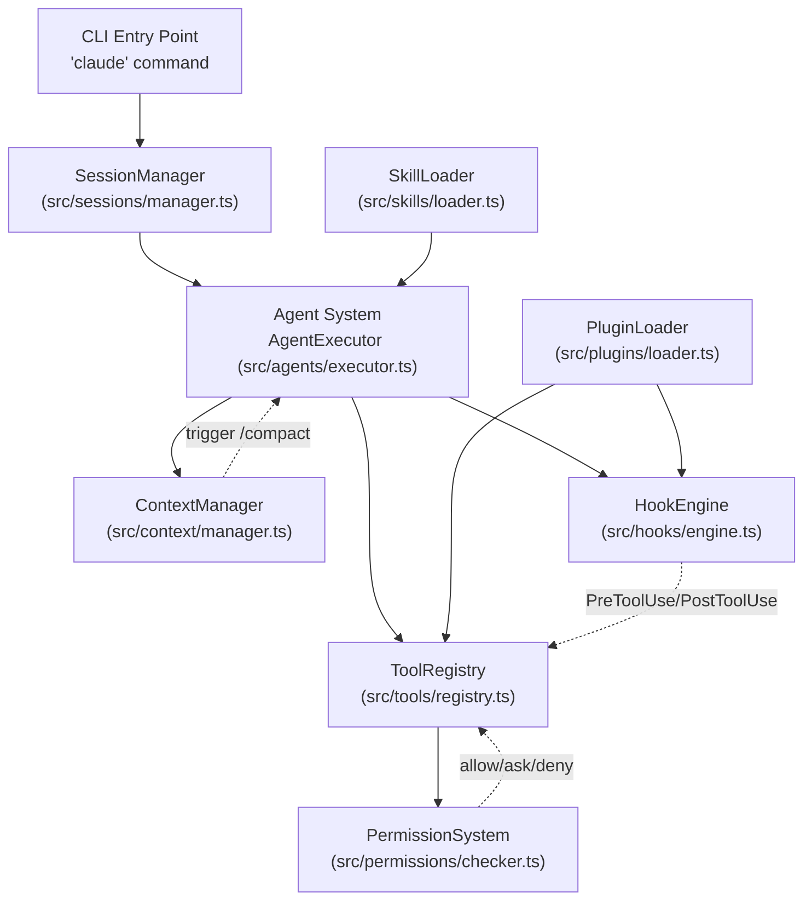
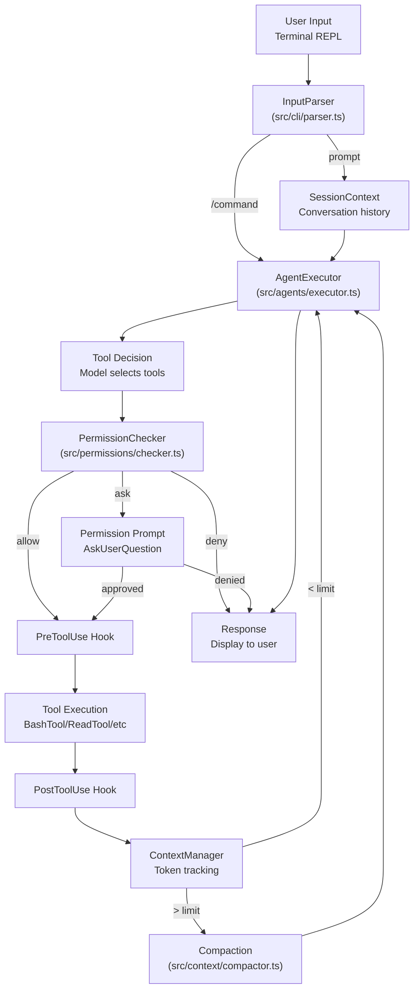

# Core Systems

> Source: https://deepwiki.com/anthropics/claude-code/3-core-systems
> Collected: 2026-09-21
> Published: 2026-09-18

> Last indexed: 18 September 2026 (commit [6ce37e9f](https://github.com/anthropics/claude-code/commits/6ce37e9f))

## Relevant source files

- [.devcontainer/Dockerfile](https://github.com/anthropics/claude-code/blob/6ce37e9f/.devcontainer/Dockerfile)
- [.devcontainer/devcontainer.json](https://github.com/anthropics/claude-code/blob/6ce37e9f/.devcontainer/devcontainer.json)
- [.devcontainer/init-firewall.sh](https://github.com/anthropics/claude-code/blob/6ce37e9f/.devcontainer/init-firewall.sh)
- [.gitattributes](https://github.com/anthropics/claude-code/blob/6ce37e9f/.gitattributes)
- [.vscode/extensions.json](https://github.com/anthropics/claude-code/blob/6ce37e9f/.vscode/extensions.json)
- [CHANGELOG.md](https://github.com/anthropics/claude-code/blob/6ce37e9f/CHANGELOG.md?plain=1)
- [LICENSE.md](https://github.com/anthropics/claude-code/blob/6ce37e9f/LICENSE.md?plain=1)
- [README.md](https://github.com/anthropics/claude-code/blob/6ce37e9f/README.md?plain=1)
- [SECURITY.md](https://github.com/anthropics/claude-code/blob/6ce37e9f/SECURITY.md?plain=1)
- [demo.gif](https://github.com/anthropics/claude-code/blob/6ce37e9f/demo.gif)
- [feed.xml](https://github.com/anthropics/claude-code/blob/6ce37e9f/feed.xml)

This page provides technical documentation of Claude Code's internal architecture and the subsystems that power its functionality. It covers the fundamental building blocks that enable agentic coding, multi-agent orchestration, permission management, and plugin extensibility.

For user-facing documentation on configuration and usage, see [Configuration Management](https://deepwiki.com/anthropics/claude-code/2.2-configuration-management) and [CLI Commands & Interaction Modes](https://deepwiki.com/anthropics/claude-code/2.3-cli-commands-and-interaction-modes). For details on specific subsystems, refer to the child pages listed in each section below.

## Architecture Overview

Claude Code's architecture is organized around several core subsystems that work together to provide an agentic coding experience. The system follows a layered approach where the CLI interface routes user input through session management to the agent system, which orchestrates tool execution under permission controls while managing context windows and triggering lifecycle hooks.

### System Architecture Diagram

The following diagram bridges the "Natural Language Space" of user intent to the "Code Entity Space" by showing how core components interact.

**Sources:** [CHANGELOG.md:16-17](https://github.com/anthropics/claude-code/blob/6ce37e9f/CHANGELOG.md?plain=1#L16-L17), [CHANGELOG.md:28-30](https://github.com/anthropics/claude-code/blob/6ce37e9f/CHANGELOG.md?plain=1#L28-L30)

### Core System Responsibilities

| System | Primary Responsibility | Key Configuration |
|--------|----------------------|-------------------|
| Agent System | Execute user requests, spawn subagents, manage task lifecycle | `settings.json` `agent` field |
| Tool System | Provide capabilities (bash, file ops, MCP) | `settings.json` `disallowedTools` |
| Permission System | Control tool execution with allow/ask/deny rules | `settings.json` permission rules |
| Context Manager | Track token usage, trigger auto-compaction | Context window limits |
| Hook System | Inject custom behavior at lifecycle events | `.claude/hooks/*.py`, plugin hooks |
| Plugin System | Discover and load extensions | `marketplace.json`, `plugin.json` |
| Skill System | Load custom slash commands | `.claude/skills/` |
| MCP Integration | Connect to external tool servers | `.mcp.json` |

**Sources:** [CHANGELOG.md:28-30](https://github.com/anthropics/claude-code/blob/6ce37e9f/CHANGELOG.md?plain=1#L28-L30), [CHANGELOG.md:39-41](https://github.com/anthropics/claude-code/blob/6ce37e9f/CHANGELOG.md?plain=1#L39-L41), [CHANGELOG.md:52-53](https://github.com/anthropics/claude-code/blob/6ce37e9f/CHANGELOG.md?plain=1#L52-L53)

## Request Processing Flow

This diagram shows how a user message flows through Claude Code's core systems, from input to execution. It maps natural language concepts to the actual execution path.

**Sources:** [CHANGELOG.md:13-14](https://github.com/anthropics/claude-code/blob/6ce37e9f/CHANGELOG.md?plain=1#L13-L14), [CHANGELOG.md:19-22](https://github.com/anthropics/claude-code/blob/6ce37e9f/CHANGELOG.md?plain=1#L19-L22), [CHANGELOG.md:40-44](https://github.com/anthropics/claude-code/blob/6ce37e9f/CHANGELOG.md?plain=1#L40-L44)

## System Component Details

### Agent System

The agent system orchestrates all AI-powered operations, including spawning subagents for parallel work and managing background tasks.

**Key Features:**

- **Subagents:** Managed through the `Task` tool. Subagents can be staggered to optimize prompt caching via `CLAUDE_CODE_WORKFLOW_PREFIX_STAGGER_MS` [CHANGELOG.md:28-28](https://github.com/anthropics/claude-code/blob/6ce37e9f/CHANGELOG.md?plain=1#L28-L28)
- **Remote Control:** Supports `claude remote-control --continue` for resuming sessions and marks disconnected sessions as `offline` in `ListAgents` [CHANGELOG.md:5-9](https://github.com/anthropics/claude-code/blob/6ce37e9f/CHANGELOG.md?plain=1#L5-L9)
- **Cloud Sessions:** Distinguishes between local and cloud-hosted sessions in agent listings [CHANGELOG.md:9-9](https://github.com/anthropics/claude-code/blob/6ce37e9f/CHANGELOG.md?plain=1#L9-L9)
- **Resumed Subagents:** Fixed an issue where resumed subagents and teammates would re-render their MCP tool definitions, breaking prompt caching [CHANGELOG.md:52-52](https://github.com/anthropics/claude-code/blob/6ce37e9f/CHANGELOG.md?plain=1#L52-L52)

For detailed documentation, see [Agent System & Subagents](https://deepwiki.com/anthropics/claude-code/3.1-agent-system-and-subagents).

**Sources:** [CHANGELOG.md:5-9](https://github.com/anthropics/claude-code/blob/6ce37e9f/CHANGELOG.md?plain=1#L5-L9), [CHANGELOG.md:28-28](https://github.com/anthropics/claude-code/blob/6ce37e9f/CHANGELOG.md?plain=1#L28-L28), [CHANGELOG.md:52-52](https://github.com/anthropics/claude-code/blob/6ce37e9f/CHANGELOG.md?plain=1#L52-L52)

### Tool System

Tools provide Claude with capabilities to interact with the environment. The system includes built-in tools and supports external tools via MCP.

**Built-in Tools:**

- **Bash:** Hardened to handle IPv6 literals in network domain lists [CHANGELOG.md:30-30](https://github.com/anthropics/claude-code/blob/6ce37e9f/CHANGELOG.md?plain=1#L30-L30). Dangerous flags like `--force` or `--amend` in git/gh commands are no longer auto-approved [CHANGELOG.md:32-32](https://github.com/anthropics/claude-code/blob/6ce37e9f/CHANGELOG.md?plain=1#L32-L32)
- **File Operations:** The `Write` tool allows newer models to overwrite files without a prior read, matching `Edit` tool rules [CHANGELOG.md:56-56](https://github.com/anthropics/claude-code/blob/6ce37e9f/CHANGELOG.md?plain=1#L56-L56). Fixed the `Write` tool silently ending a turn as a declined permission when the target path is an existing directory; it now reports a clear error [CHANGELOG.md:17-17](https://github.com/anthropics/claude-code/blob/6ce37e9f/CHANGELOG.md?plain=1#L17-L17)
- **Path Handling:** Fixed crashes related to non-string `glob` or `file_path` values and extended-length/UNC paths on Windows [CHANGELOG.md:11-13](https://github.com/anthropics/claude-code/blob/6ce37e9f/CHANGELOG.md?plain=1#L11-L13). Fixed a turn ending early with "Path contains null bytes" when a tool call's file path contained `\u0000` written as an escape sequence; escaped control characters now stay as literal text [CHANGELOG.md:20-20](https://github.com/anthropics/claude-code/blob/6ce37e9f/CHANGELOG.md?plain=1#L20-L20)
- **Edit Tool:** Fixed the `Edit` tool treating an escaped backslash followed by `uXXXX` text as a `\uXXXX` escape [CHANGELOG.md:18-18](https://github.com/anthropics/claude-code/blob/6ce37e9f/CHANGELOG.md?plain=1#L18-L18). Fixed it reporting "Invalid regular expression: regular expression too large" instead of "String not found in file" for large non-matching edits [CHANGELOG.md:19-19](https://github.com/anthropics/claude-code/blob/6ce37e9f/CHANGELOG.md?plain=1#L19-L19)
- **Grep and Glob:** Fixed these tools reporting no matches when the search could not start due to system resource exhaustion; they now return an error [CHANGELOG.md:16-16](https://github.com/anthropics/claude-code/blob/6ce37e9f/CHANGELOG.md?plain=1#L16-L16)

For detailed documentation, see [Tool System & Permissions](https://deepwiki.com/anthropics/claude-code/3.2-tool-system-and-permissions).

**Sources:** [CHANGELOG.md:11-13](https://github.com/anthropics/claude-code/blob/6ce37e9f/CHANGELOG.md?plain=1#L11-L13), [CHANGELOG.md:16-20](https://github.com/anthropics/claude-code/blob/6ce37e9f/CHANGELOG.md?plain=1#L16-L20), [CHANGELOG.md:30-32](https://github.com/anthropics/claude-code/blob/6ce37e9f/CHANGELOG.md?plain=1#L30-L32), [CHANGELOG.md:56-56](https://github.com/anthropics/claude-code/blob/6ce37e9f/CHANGELOG.md?plain=1#L56-L56)

### Permission System

The permission system controls tool execution through rules that match tool invocations against allow/ask/deny actions.

**Rule Enforcement:**

- **Auto-Approval:** Restricted for dangerous git/gh operations [CHANGELOG.md:32-32](https://github.com/anthropics/claude-code/blob/6ce37e9f/CHANGELOG.md?plain=1#L32-L32)
- **Attribution Headers:** Fixed issues where disabling headers via `CLAUDE_CODE_ATTRIBUTION_HEADER` caused tool failures in auto mode [CHANGELOG.md:14-14](https://github.com/anthropics/claude-code/blob/6ce37e9f/CHANGELOG.md?plain=1#L14-L14)
- **Fail-Closed:** Sandbox network domain ambiguities are enforced fail-closed and flagged by `/doctor` [CHANGELOG.md:30-30](https://github.com/anthropics/claude-code/blob/6ce37e9f/CHANGELOG.md?plain=1#L30-L30)

For detailed documentation, see [Tool System & Permissions](https://deepwiki.com/anthropics/claude-code/3.2-tool-system-and-permissions).

**Sources:** [CHANGELOG.md:14-14](https://github.com/anthropics/claude-code/blob/6ce37e9f/CHANGELOG.md?plain=1#L14-L14), [CHANGELOG.md:30-30](https://github.com/anthropics/claude-code/blob/6ce37e9f/CHANGELOG.md?plain=1#L30-L30), [CHANGELOG.md:32-32](https://github.com/anthropics/claude-code/blob/6ce37e9f/CHANGELOG.md?plain=1#L32-L32)

### Context Window Management

The context manager tracks token usage and triggers automatic compaction.

**Context Optimization:**

- **Compaction Retries:** Fixed issues where conversations exceeding 32 MB request limits would retry compaction indefinitely when no images/docs could be stripped [CHANGELOG.md:24-24](https://github.com/anthropics/claude-code/blob/6ce37e9f/CHANGELOG.md?plain=1#L24-L24)
- **User Guidance:** Improved error messages to explain why automatic compaction failed instead of just suggesting `/compact` [CHANGELOG.md:29-29](https://github.com/anthropics/claude-code/blob/6ce37e9f/CHANGELOG.md?plain=1#L29-L29)
- **Progress Tracking:** Added retry countdowns and stall hints during the compaction process [CHANGELOG.md:54-54](https://github.com/anthropics/claude-code/blob/6ce37e9f/CHANGELOG.md?plain=1#L54-L54)
- **Attachment Re-rendering:** Fixed attachments recorded earlier in a conversation being re-rendered after a resume or relaunch, which dropped extended thinking and missed the prompt cache [CHANGELOG.md:54-54](https://github.com/anthropics/claude-code/blob/6ce37e9f/CHANGELOG.md?plain=1#L54-L54)

For detailed documentation, see [Context Window & Compaction](https://deepwiki.com/anthropics/claude-code/3.3-context-window-and-compaction).

**Sources:** [CHANGELOG.md:24-24](https://github.com/anthropics/claude-code/blob/6ce37e9f/CHANGELOG.md?plain=1#L24-L24), [CHANGELOG.md:29-29](https://github.com/anthropics/claude-code/blob/6ce37e9f/CHANGELOG.md?plain=1#L29-L29), [CHANGELOG.md:54-54](https://github.com/anthropics/claude-code/blob/6ce37e9f/CHANGELOG.md?plain=1#L54-L54)

### Hook System

Hooks provide lifecycle event interception points. They can be implemented as scripts or via plugins.

**Key Features:**

- **Server-Supplied Hooks:** Added support for server-supplied hooks in self-hosted runner sessions [CHANGELOG.md:6-6](https://github.com/anthropics/claude-code/blob/6ce37e9f/CHANGELOG.md?plain=1#L6-L6), [CHANGELOG.md:16-16](https://github.com/anthropics/claude-code/blob/6ce37e9f/CHANGELOG.md?plain=1#L16-L16)
- **Execution Lifecycle:** Hooks are used by plugins like `hookify` to modify agent behavior based on session events.
- **SessionStart Hook:** Fixed sessions continued after `/clear` missing part of their first message when a `SessionStart` hook printed output, causing a full prompt-cache miss [CHANGELOG.md:39-39](https://github.com/anthropics/claude-code/blob/6ce37e9f/CHANGELOG.md?plain=1#L39-L39)

For detailed documentation, see [Hook System](https://deepwiki.com/anthropics/claude-code/3.4-hook-system).

**Sources:** [CHANGELOG.md:6-6](https://github.com/anthropics/claude-code/blob/6ce37e9f/CHANGELOG.md?plain=1#L6-L6), [CHANGELOG.md:16-16](https://github.com/anthropics/claude-code/blob/6ce37e9f/CHANGELOG.md?plain=1#L16-L16), [CHANGELOG.md:39-39](https://github.com/anthropics/claude-code/blob/6ce37e9f/CHANGELOG.md?plain=1#L39-L39)

### MCP Server Integration

Claude Code supports the Model Context Protocol (MCP) to connect to external tool servers.

**Features:**

- **OAuth:** Fixed strict authorization server issues by using `127.0.0.1` instead of `localhost` in redirect URIs [CHANGELOG.md:16-16](https://github.com/anthropics/claude-code/blob/6ce37e9f/CHANGELOG.md?plain=1#L16-L16)
- **Managed MCP:** Fixed startup crashes in remote sessions when `managed-mcp.json` delivers servers to self-hosted runners [CHANGELOG.md:26-26](https://github.com/anthropics/claude-code/blob/6ce37e9f/CHANGELOG.md?plain=1#L26-L26)
- **Discovery:** Integration with claude.ai allows for seamless tool registration.
- **Crash Fix:** Fixed a crash ("Type error") when opening `/mcp` or `/plugin manage` with a malformed `claudeAiMcpEverConnected` value in `~/.claude.json` [CHANGELOG.md:32-32](https://github.com/anthropics/claude-code/blob/6ce37e9f/CHANGELOG.md?plain=1#L32-L32)

For detailed documentation, see [MCP Server Integration](https://deepwiki.com/anthropics/claude-code/3.5-mcp-server-integration).

**Sources:** [CHANGELOG.md:16-16](https://github.com/anthropics/claude-code/blob/6ce37e9f/CHANGELOG.md?plain=1#L16-L16), [CHANGELOG.md:26-26](https://github.com/anthropics/claude-code/blob/6ce37e9f/CHANGELOG.md?plain=1#L26-L26), [CHANGELOG.md:32-32](https://github.com/anthropics/claude-code/blob/6ce37e9f/CHANGELOG.md?plain=1#L32-L32)

### Plugin System

The plugin system enables extensibility through packages containing commands, agents, and hooks.

**Plugin Lifecycle:**

- **Marketplace Sources:** Supports `command` sources where a local command prints the plugin directory, re-resolved each session [CHANGELOG.md:8-8](https://github.com/anthropics/claude-code/blob/6ce37e9f/CHANGELOG.md?plain=1#L8-L8)
- **Cleanup:** Fixed issues with one-shot `claude plugin` commands leaving stray liveness files that blocked cleanup [CHANGELOG.md:20-20](https://github.com/anthropics/claude-code/blob/6ce37e9f/CHANGELOG.md?plain=1#L20-L20)
- **Cache Management:** Fixed background cleanup deleting development checkouts (symlinked versions) [CHANGELOG.md:48-48](https://github.com/anthropics/claude-code/blob/6ce37e9f/CHANGELOG.md?plain=1#L48-L48). Fixed plugin reload previews keeping every previewed copy of a plugin archive unpacked until exit, and overwriting the cached `--plugin-url` archive [CHANGELOG.md:52-52](https://github.com/anthropics/claude-code/blob/6ce37e9f/CHANGELOG.md?plain=1#L52-L52)
- **Installation:** Fixed `claude plugin install` sometimes failing and breaking the installed copy when reinstalling a plugin version that a session or another program was using [CHANGELOG.md:15-15](https://github.com/anthropics/claude-code/blob/6ce37e9f/CHANGELOG.md?plain=1#L15-L15)
- **UI Fixes:** Fixed `/plugin` not stripping terminal control characters from messages [CHANGELOG.md:38-38](https://github.com/anthropics/claude-code/blob/6ce37e9f/CHANGELOG.md?plain=1#L38-L38). Fixed `/plugin` and `/skills` crashing when a skill or legacy command is named like a built-in Object property [CHANGELOG.md:38-38](https://github.com/anthropics/claude-code/blob/6ce37e9f/CHANGELOG.md?plain=1#L38-L38). Fixed `/plugin` closing with no message when every install in a multi-select failed [CHANGELOG.md:39-39](https://github.com/anthropics/claude-code/blob/6ce37e9f/CHANGELOG.md?plain=1#L39-L39). Fixed uninstalled plugins reappearing as "failed to load" rows [CHANGELOG.md:40-40](https://github.com/anthropics/claude-code/blob/6ce37e9f/CHANGELOG.md?plain=1#L40-L40)
- **Metadata:** Fixed plugins from the official marketplace being recorded without their commit in `installed_plugins.json`, and `installed_plugins.json` keeping the old commit after updating a pinned-commit plugin [CHANGELOG.md:41-41](https://github.com/anthropics/claude-code/blob/6ce37e9f/CHANGELOG.md?plain=1#L41-L41)
- **Background Sessions:** Fixed background sessions (`claude --bg`) exiting when a plugin's LSP server exited or closed its stdin [CHANGELOG.md:31-31](https://github.com/anthropics/claude-code/blob/6ce37e9f/CHANGELOG.md?plain=1#L31-L31)

For detailed documentation, see [Plugin System](https://deepwiki.com/anthropics/claude-code/3.6-plugin-system).

**Sources:** [CHANGELOG.md:8-8](https://github.com/anthropics/claude-code/blob/6ce37e9f/CHANGELOG.md?plain=1#L8-L8), [CHANGELOG.md:15-15](https://github.com/anthropics/claude-code/blob/6ce37e9f/CHANGELOG.md?plain=1#L15-L15), [CHANGELOG.md:20-20](https://github.com/anthropics/claude-code/blob/6ce37e9f/CHANGELOG.md?plain=1#L20-L20), [CHANGELOG.md:31-31](https://github.com/anthropics/claude-code/blob/6ce37e9f/CHANGELOG.md?plain=1#L31-L31), [CHANGELOG.md:38-41](https://github.com/anthropics/claude-code/blob/6ce37e9f/CHANGELOG.md?plain=1#L38-L41), [CHANGELOG.md:48-48](https://github.com/anthropics/claude-code/blob/6ce37e9f/CHANGELOG.md?plain=1#L48-L48), [CHANGELOG.md:52-52](https://github.com/anthropics/claude-code/blob/6ce37e9f/CHANGELOG.md?plain=1#L52-L52)

### Skill System

Skills provide custom slash commands and guidance for the agent, often declared via `SKILL.md` files.

**Skill Mechanics:**

- **Security:** Skills synced from claude.ai are hardened to prevent shadowing local commands or running dangerous `!` commands [CHANGELOG.md:51-51](https://github.com/anthropics/claude-code/blob/6ce37e9f/CHANGELOG.md?plain=1#L51-L51)
- **Tool Reminders:** Fixed duplicate deferred-tools reminders being sent after skill invocations [CHANGELOG.md:50-50](https://github.com/anthropics/claude-code/blob/6ce37e9f/CHANGELOG.md?plain=1#L50-L50)
- **Project Skills:** Fixed project skills from the main repository not loading in `--worktree` sessions when `.claude/skills` is untracked [CHANGELOG.md:50-50](https://github.com/anthropics/claude-code/blob/6ce37e9f/CHANGELOG.md?plain=1#L50-L50)
- **Crash Fix:** Fixed `/plugin` and `/skills` crashing when a skill or legacy command is named like a built-in Object property such as `constructor` or `toString` [CHANGELOG.md:38-38](https://github.com/anthropics/claude-code/blob/6ce37e9f/CHANGELOG.md?plain=1#L38-L38)

For detailed documentation, see [Skill System](https://deepwiki.com/anthropics/claude-code/3.7-skill-system).

**Sources:** [CHANGELOG.md:38-38](https://github.com/anthropics/claude-code/blob/6ce37e9f/CHANGELOG.md?plain=1#L38-L38), [CHANGELOG.md:50-51](https://github.com/anthropics/claude-code/blob/6ce37e9f/CHANGELOG.md?plain=1#L50-L51)

### Sandbox Environment

The sandbox provides isolated execution for bash commands.

**Configuration:**

- **Network Isolation:** IPv6 literals in network domain lists are now bracketed (`[::1]:443`) for strict enforcement [CHANGELOG.md:30-30](https://github.com/anthropics/claude-code/blob/6ce37e9f/CHANGELOG.md?plain=1#L30-L30). The `.devcontainer/init-firewall.sh` script sets up `iptables` and `ipset` rules to restrict outbound network access to a whitelist of domains like `api.github.com`, `api.anthropic.com`, and `statsig.com` [init-firewall.sh:44-74](https://github.com/anthropics/claude-code/blob/6ce37e9f/.devcontainer/init-firewall.sh#L44-L74)
- **Resource Limits:** Dynamic workflows inside CPU-limited containers now correctly use the container's CPU limit rather than the host's [CHANGELOG.md:21-21](https://github.com/anthropics/claude-code/blob/6ce37e9f/CHANGELOG.md?plain=1#L21-L21)
- **Excluded Commands:** Fixed a `sandbox.excludedCommands` glob exempting an entire compound Bash command from the sandbox when only one part matched; every part must now match [CHANGELOG.md:51-51](https://github.com/anthropics/claude-code/blob/6ce37e9f/CHANGELOG.md?plain=1#L51-L51)
- **`$TMPDIR` Expansion:** Fixed `$TMPDIR` expanding empty in Bash commands that run outside the sandbox while sandboxing is enabled [CHANGELOG.md:42-42](https://github.com/anthropics/claude-code/blob/6ce37e9f/CHANGELOG.md?plain=1#L42-L42)

For detailed documentation, see [Sandbox Environment](https://deepwiki.com/anthropics/claude-code/3.8-sandbox-environment).

**Sources:** [CHANGELOG.md:21-21](https://github.com/anthropics/claude-code/blob/6ce37e9f/CHANGELOG.md?plain=1#L21-L21), [CHANGELOG.md:30-30](https://github.com/anthropics/claude-code/blob/6ce37e9f/CHANGELOG.md?plain=1#L30-L30), [CHANGELOG.md:42-42](https://github.com/anthropics/claude-code/blob/6ce37e9f/CHANGELOG.md?plain=1#L42-L42), [CHANGELOG.md:51-51](https://github.com/anthropics/claude-code/blob/6ce37e9f/CHANGELOG.md?plain=1#L51-L51), [.devcontainer/init-firewall.sh:44-74](https://github.com/anthropics/claude-code/blob/6ce37e9f/.devcontainer/init-firewall.sh#L44-L74)

### UI/UX & Terminal Integration

Claude Code provides a rich interactive experience within the terminal and IDEs.

**Features:**

- **Rendering:** Fixed `RangeError` crashes when progress bars or markdown tables render in narrow terminal windows [CHANGELOG.md:12-12](https://github.com/anthropics/claude-code/blob/6ce37e9f/CHANGELOG.md?plain=1#L12-L12). Fixed a rare case where the screen could stop updating for the rest of the session after an internal rendering error [CHANGELOG.md:27-27](https://github.com/anthropics/claude-code/blob/6ce37e9f/CHANGELOG.md?plain=1#L27-L27)
- **Visuals:** Improved slash-command menu with bolded matches and blue selection bars [CHANGELOG.md:64-64](https://github.com/anthropics/claude-code/blob/6ce37e9f/CHANGELOG.md?plain=1#L64-L64). Fixed the "copied" notice not appearing after drag-selecting text in the fullscreen `/resume` picker and other panels [CHANGELOG.md:41-41](https://github.com/anthropics/claude-code/blob/6ce37e9f/CHANGELOG.md?plain=1#L41-L41)
- **VS Code:** Resizable side-question panels and session grouping in the sidebar [CHANGELOG.md:35-36](https://github.com/anthropics/claude-code/blob/6ce37e9f/CHANGELOG.md?plain=1#L35-L36). The `.devcontainer/devcontainer.json` specifies recommended VS Code extensions like `anthropic.claude-code`, `dbaeumer.vscode-eslint`, and `esbenp.prettier-vscode` [devcontainer.json:18-23](https://github.com/anthropics/claude-code/blob/6ce37e9f/.devcontainer/devcontainer.json#L18-L23)
- **Crash Fixes:** Fixed a crash ("unrecoverable interface error") when the prompt held text containing terminal color codes [CHANGELOG.md:34-34](https://github.com/anthropics/claude-code/blob/6ce37e9f/CHANGELOG.md?plain=1#L34-L34). Fixed sessions on slow or heavily loaded machines sometimes exiting with "Claude Code exited after an unrecoverable interface error" when the first spinner appeared [CHANGELOG.md:26-26](https://github.com/anthropics/claude-code/blob/6ce37e9f/CHANGELOG.md?plain=1#L26-L26)
- **Messages from Subagents:** Fixed messages from other agents (such as a subagent's `SendMessage`) that arrived mid-turn showing up below the "Ran N shell commands" row instead of where they arrived [CHANGELOG.md:40-40](https://github.com/anthropics/claude-code/blob/6ce37e9f/CHANGELOG.md?plain=1#L40-L40)

For detailed documentation, see [UI/UX & Terminal Integration](https://deepwiki.com/anthropics/claude-code/3.9-uiux-and-terminal-integration).

**Sources:** [CHANGELOG.md:12-12](https://github.com/anthropics/claude-code/blob/6ce37e9f/CHANGELOG.md?plain=1#L12-L12), [CHANGELOG.md:26-27](https://github.com/anthropics/claude-code/blob/6ce37e9f/CHANGELOG.md?plain=1#L26-L27), [CHANGELOG.md:34-36](https://github.com/anthropics/claude-code/blob/6ce37e9f/CHANGELOG.md?plain=1#L34-L36), [CHANGELOG.md:40-41](https://github.com/anthropics/claude-code/blob/6ce37e9f/CHANGELOG.md?plain=1#L40-L41), [CHANGELOG.md:64-64](https://github.com/anthropics/claude-code/blob/6ce37e9f/CHANGELOG.md?plain=1#L64-L64), [.devcontainer/devcontainer.json:18-23](https://github.com/anthropics/claude-code/blob/6ce37e9f/.devcontainer/devcontainer.json#L18-L23)
