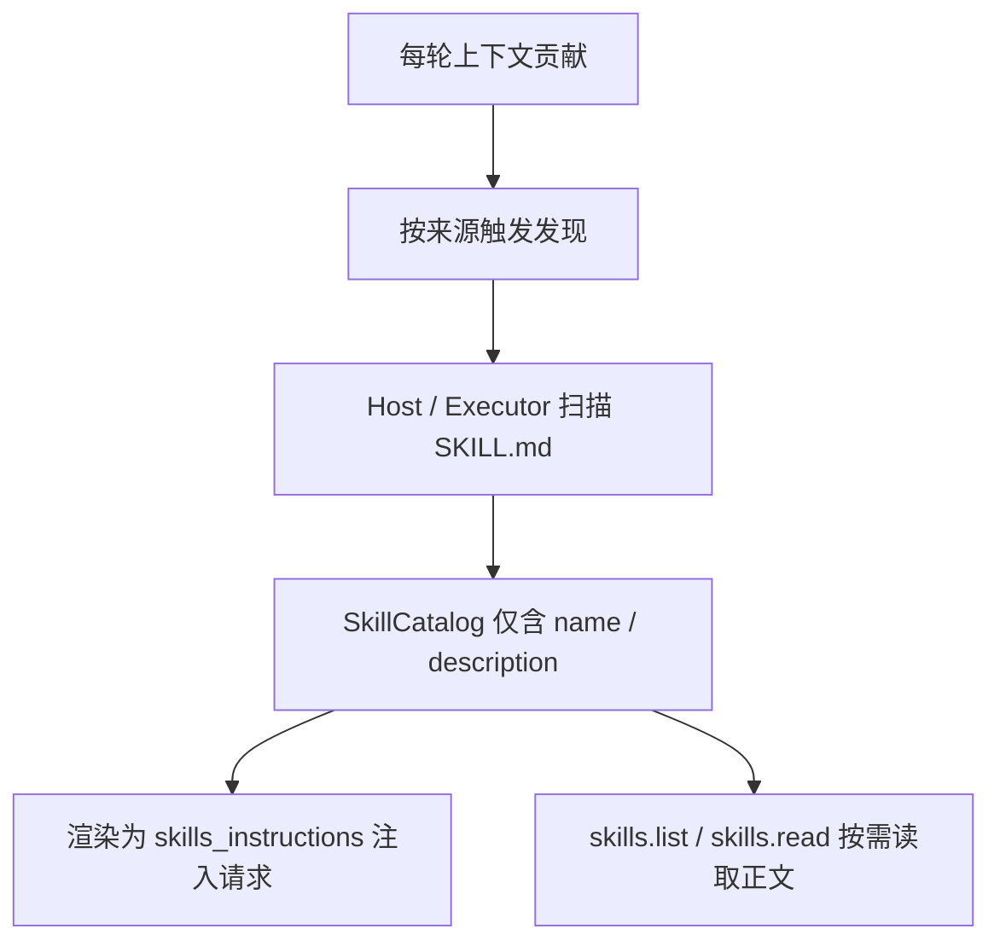

> 本文根据 DeepWiki 的 [Codex Skill 发现与加载问答](../raw/2026-09-22-231527.md)整理，沿着「skill 怎样被发现 → 正文为什么留到调用时读 → 元数据怎样进入上下文 → 太多时怎样减量 → 压缩时为什么可以丢」这条链路，看 Codex 的 Skills 机制。

## 一次 skill 怎样从磁盘进入上下文

**Agent 需要一批可复用的指令包，Codex 把它们做成 `SKILL.md` 文件，再按需披露给模型。** 流程分成两段：发现阶段扫描 skill 根目录、收集候选 `SKILL.md`；加载阶段解析 frontmatter 与依赖，生成结构化元数据。两者都针对宿主文件系统（Host）和执行器环境（Executor）两类来源，共用同一套发现逻辑，差别在权限和来源。

**发现会限制扫描规模。** 是否跟随目录符号链接、是否包含隐藏目录、递归还是只取直接子目录，由扫描选项决定；深度、目录数和条目数各设上限，避免扫过大的目录树。插件命名空间会把来源区分开：插件 `sample` 下的 `search` 暴露成 `sample:search`，同名 skill 不会互相覆盖。

## 按需加载：发现只取元数据，正文留到调用时

**发现阶段读到的只是 `SKILL.md` 的 YAML frontmatter，正文不在这一步进入上下文。** 完整 Markdown 正文要等 skill 被实际使用时才读取。这与 `skill-creator` 文档写的三阶段披露一致：名称与描述用于选择，`SKILL.md` 正文在决定使用后加载，支持性资源只在任务真正需要时读取或执行。

**发现结果会缓存，省的是扫描而不是披露。** 扫描结果按 cwd / config 维度缓存，只有配置或路径变化、或显式要求重扫时才重新扫描；纯历史条目注入会跳过发现，而真正的一轮对话仍会走一遍。每轮的上下文贡献按缓存状态决定是否重新发现，最终遍历 Host / Executor / Cloud 各来源；IDE / CLI 的 `skills/list` 复用同一套服务，并支持手动触发重扫。

## 元数据怎样进入模型：渐进披露三步

**渲染后的 skill 列表以 `<skills_instructions>` 开发者消息注入请求，内容只有名称、描述与定位符。** 这段文本自带使用说明，规定触发条件（用户点名 `$SkillName` 或任务匹配描述时必须使用），以及关键行为准则：决定使用某 skill 后，主 agent 必须先完整读取它的 `SKILL.md`，再采取行动。

**模型拿到正文靠两个工具。** 二者只在云端可用或存在执行器查询时才暴露：

| 工具 | 作用 | 关键约束 |
| --- | --- | --- |
| `skills.list` | 列出某来源下的 skill，返回 package / name / description / main_resource | 每页 20 条，用 `cursor` 翻页；响应受字节预算限制 |
| `skills.read` | 传入 package（可选 resource）读取 `SKILL.md` 正文 | 正文过大时同样支持 `cursor` 分页续读 |

**来源不同，读正文的方式也不同。** executor / cloud 来源走 `skills.read`；Host 来源则展开短路径别名后直接用文件系统读取。正文里引用的子资源（如 `references/xxx.md`）也按同一套机制按需读取，而不是一次性全部塞进 prompt。

## skill 太多时：先在渲染阶段压缩元数据

**发现和加载不会因为 skill 多而停下，被控制的是渲染进 prompt 的元数据体积。** 渲染预算默认 8 000 字符，或按模型上下文窗口的 2% 折算，上限 10 000。描述空间按轮询分配，避免单个 skill 独占。

**预算不足时依次退让。** 先尝试路径别名压缩——把多个 skill 共享的长路径前缀换成短别名（如 `e0`、`c0`、`r0`）；多来源组合时比较多种别名方案，优先保留更多 skill，其次少截断描述，最后比成本。仍然超预算就逐条省略，直到能容纳一条「N 个 skill 被省略」的提示行。压力更大时整段省略某个来源，并给出警告，例如「Host skills are available but omitted from the model-visible skills list because the skills context budget was exceeded」，或描述全部移除后的「Exceeded skills context budget. All skill descriptions were removed and N additional skills were not included in the model-visible skills list.」。

## 被省略的条目并没有消失

**渲染省略不等于目录省略。** 渲染只从已发现的完整目录里筛出对模型可见的条目转成 prompt 文本，保存的仍是完整目录。

**因此被省略的 skill 仍可被主动发现和读取。** `skills.list` 从完整目录分页返回，`skills.read` 能按 package / name 直接读取正文。集成测试展示：一个对 prompt 隐藏的 skill 不出现在渲染片段里，但用户输入 `$hidden-skill` 后仍会触发它的指令注入与读取请求。这条路依赖模型主动调用工具，被省略的条目不会自己重新出现。

## 每轮重新注入，压缩时可以被折叠

**`<skills_instructions>` 不是只发一次就靠模型记住，而是每个新 turn 都重新渲染并注入。** 发现层的缓存只减少重复扫描，不会减少注入次数。

**正因为每轮重建，历史里的旧副本可以被当作普通指令文本处理。** 快照测试显示，在压缩使用的重写形态下，`skills_instructions` 会和 `collaboration_mode`、`permissions instructions` 等指令一样折叠成占位标签 `<SKILLS_INSTRUCTIONS>`；未重写时则遵循同样的截断与规范化规则，例如把具体路径替换为 `<SKILLS_ROOT>`、把过多行折叠成 `<OMITTED N LINES; ...>`。

**所以压缩丢掉历史中的 skill 元数据不会造成永久丢失**：下一轮会重新生成并注入。要分清两种「裁剪」——渲染时因预算超限省略条目，和压缩时把整条消息折叠成占位标签，机制不同，但都不改变完整目录仍然存在。

## 边界

**材料没有 commit 或会话原始 URL。** 代码结论以所附片段为准；只出现在问答转述中、没有片段支撑的环节不再展开。

**压缩与 skill 元数据的关系仍需谨慎。** 材料没有展示压缩管线直接处理 `skills_instructions` 的代码，折叠结论来自快照测试中的重写形态，两者之间的调用关系未在片段中呈现。

**两个层次的减量要分开看。** 别名、描述截断、逐条省略解决的是「元数据列表过大」；`skills.read` 按需读取解决的是「单个 skill 正文过大」。

**这里讨论的 skill 与长期记忆产出的 `skills/` 是两个入口。** 记忆系统会在 `codex_home/memories/skills/<skill-name>/SKILL.md` 写入可复用流程，格式同为 frontmatter 加指令，可能与 Skills 扫描的根目录衔接；本文材料没有展开这条关系，具体见 [长期记忆](context-engineering/long-term-memory.md)。

相关：[上下文组装](context-engineering/context-assembly.md)解释指令与工具怎样进入请求；[上下文预算与压缩](context-engineering/budget-and-compaction.md)解释整窗预算与压缩；[工具发现与调用](tool-call/tool-discovery-and-dispatch.md)解释工具怎样注册与分发——skill 的按需披露与之思路相通。本文对应面试题第 069 题。
