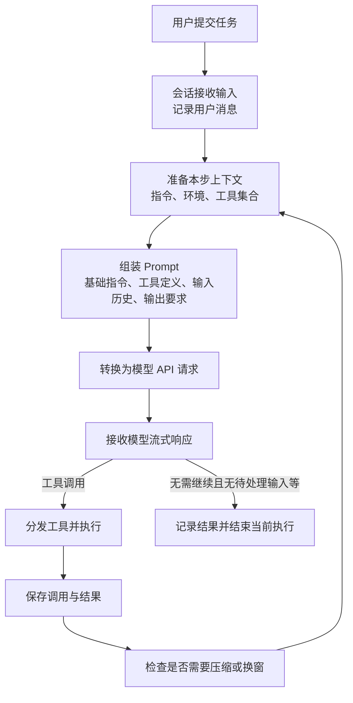

> 本文根据 DeepWiki 的 [Codex 主链路源码问答](../../raw/2026-09-22-153917.md)与 [请求组装追问](../../raw/2026-09-22-153918.md)整理，从完整运行过程、Prompt 构成及信息存储三个角度理解上下文组装。

## 从用户消息到最终回答，整体怎样运行

**Agent 每次调用模型前，都要把任务要求、当前环境、已有证据和可用能力整理成一次请求。** 模型据此回答，或选择工具收集信息、执行操作；工具结果被保存后，又成为下一次决策的输入。因此，一条用户消息可能驱动多次模型请求，每次请求看到的上下文也会变化。

以“检查这个仓库的测试为什么失败，只读，不修改”为例：首次请求要让模型知道任务、只读要求、工作目录以及可用工具；模型读取测试代码后，第二次请求还要包含读取结果；进一步检查得到失败证据后，后续请求才有足够信息生成解释。



**会话负责保留信息，组装器负责提供本次输入，执行器负责把模型选择变成实际操作。** 在所附默认路径中，这几个环节通过下面的顺序衔接；取消、错误和 hooks 等分支在图中省略。

| 阶段 | 发生什么 | 主要对象或入口 |
| --- | --- | --- |
| 接收任务 | 用户输入以 `Op::UserTurn` 等操作进入会话，转成历史条目 | `Session`、`record_conversation_items` |
| 准备本步环境 | 处理待输入内容，捕获或复用设置与可见工具，记录环境变化 | `run_turn`、`StepContext`、`WorldState` |
| 准备模型输入 | 读取当前活动历史，整理工具配对和模型支持的输入模态 | `ContextManager`、`for_prompt` |
| 组装请求 | 汇合输入历史、基础指令、工具定义及输出要求 | `build_prompt` → `Prompt` |
| 调用模型 | 补充模型和推理等参数，转换线上格式，发起流式请求 | `build_responses_request`、模型客户端 |
| 处理响应 | 记录消息；遇到工具调用时路由执行，并保存结果 | `handle_output_item_done`、工具运行时 |
| 继续或结束 | 需要后续处理就检查预算并再次组装，否则在满足结束条件后返回 | `run_turn` |

**最终回答与工具结果都属于这段过程的产物，但用途不同。** 最终回答用于向用户交付，工具结果通常用于让模型继续判断；流中出现助手文字也不必然代表结束，模型仍可能发出工具调用，或会话仍有待处理输入。[主链路及组装源码 Q1、Q2](../../raw/2026-09-22-153917.md#q1)。

## Prompt 包含哪些内容

**这里的 Prompt 是一次模型请求所需内容的组合，不只是通常所说的“系统提示词”。** 从语义上看，它需要说明行为规则、当前任务、已有经历、外部证据、可用工具和输出要求；在 Codex 的内部结构里，这些内容主要汇入 `base_instructions`、`tools`、`input` 与输出格式字段。

下面按 `build_prompt` 的赋值关系画出结构，属于字段关系示意，省略外围控制字段，不是完整 Rust 定义：

```text
Prompt
├─ base_instructions       基础行为指令
├─ tools                   本步向模型展示的工具定义
├─ input                   本次可见的输入条目序列
│  ├─ 用户任务与后续补充
│  ├─ 环境、权限等上下文片段
│  ├─ 助手历史输出
│  ├─ 工具调用及对应结果
│  └─ 按相应路径加入的任务状态、记忆或压缩摘要
├─ output_schema           可选的最终输出结构
└─ output_schema_strict    输出结构的严格模式设置
```

**语义上的分类不一定对应一个独立字段。** 例如“检索结果”通常是某次工具调用的输出，“只读”可能来自用户消息，也可能由宿主权限配置表达；不能因为它们概念不同，就假设请求中存在 `retrieval` 或 `constraints` 字段。`input` 上图展示的是可能包含的内容类别，*不是固定排列顺序*。[Prompt 与 API 请求源码 Q2](../../raw/2026-09-22-153917.md#q2)。

### 基础指令：Agent 应该怎样工作

**基础指令表达跨具体操作复用的行为要求。** 例如角色定位、沟通方式、执行习惯和工具使用规则。用户当前要解决的测试失败问题可以变化，但这些工作约定通常相对稳定。

| 项目 | 对应关系 |
| --- | --- |
| 内部字段 | `Prompt.base_instructions`，其中 `text` 承载文本 |
| 来源 | `session_configuration.base_instructions` |
| 组装前存放位置 | `Session` 持有的会话配置 |
| 进入普通 API 请求 | `instructions` 字段 |
| 更新方式 | `get_prompt_base_instructions` 生成请求用版本，可能按功能开关调整内容 |

**保存的指令与本次发送的指令可以不同。** 材料里的例子是在没有启用计划工具时，按条件移除模型默认指令中相关的工具指导，避免提示模型使用当前不存在的能力。一次 `run_sampling_request` 内部的重试循环会复用已取得的指令副本，并非每次重试重新读取配置。[指令来源与渲染追问 Q3、Q4](../../raw/2026-09-22-153918.md#q3)。

### 工具定义：Agent 当前能做什么

**工具定义向模型描述可调用的能力，工具实现则负责真正执行。** 模型看到工具名称、用途和参数结构后，可以选择发出调用；工具代码本身不需要放进 Prompt。

| 项目 | 对应关系 |
| --- | --- |
| 内部字段 | `Prompt.tools` |
| 来源 | `step_context.tool_router.model_visible_specs()` |
| 组装前存放位置 | 本步 `StepContext` 的工具路由器及其可见定义 |
| 进入普通 API 请求 | 序列化后的 `tools` 字段 |
| 执行位置 | 模型返回调用后，由工具路由器和运行时分发到具体处理器 |

**准备工具集合与准备环境应使用同一本步视图。** `run_turn` 的源码注释明确要求上下文、展示给模型的工具和实际工具调用共享一次捕获的请求视图，以减少“模型被告知有某个工具，执行时却对应另一套配置”的不一致。[本步捕获源码 Q1](../../raw/2026-09-22-153917.md#q1)。

### 输入历史：这次要做什么，已经知道什么

**`Prompt.input` 是一个输入条目序列，既记录对话，也承载行动和证据。** `build_prompt` 接收 `Vec<ResponseItem>`；此前信息保存在 `ContextManager.items` 的 `ResponseItemEnvelope` 序列中，组装时经 `clone_history().for_prompt(...)` 转成模型可用输入。

| 内容 | 条目或载体 | 含义与功能 | 进入上下文前的来源 |
| --- | --- | --- | --- |
| 当前用户任务 | 用户消息 | 说明要完成什么，以及本次要求 | 用户提交的输入 |
| 用户后续补充 | 新的用户输入条目 | 补充信息、调整范围或修改要求 | 会话待处理输入，在允许的步骤边界接收 |
| 助手历史输出 | 助手消息 | 保留前面的解释、判断与交付内容 | 已接收的模型响应 |
| 工具调用 | 如 `FunctionCall` | 记录选了什么工具、传入什么参数 | 模型响应中的调用项 |
| 工具结果 | 如 `FunctionCallOutput` | 提供操作结果、外部证据或失败信息，以 `call_id` 对应调用 | 工具执行器 |
| 检索、文件读取结果 | 对应工具的结果条目 | 为当前任务补充资料 | 文件系统、搜索或其他工具可访问的数据源 |
| 压缩摘要 | 压缩流程生成的上下文条目 | 在旧历史被替换后保留继续工作所需信息 | 摘要请求及历史重建流程 |

**当前输入与历史输入在请求里不是两个必须分开的容器。** 当前用户消息先被记录，随后随活动历史进入 `input`；工具结果也是先写回，再被下一次请求读到。读取和搜索工具因此成为外部知识进入模型的重要入口。[输入准备与客户端代码 Q2](../../raw/2026-09-22-153917.md#q2)。

**这里保存的是当前模型窗口，不是全部历史的无损副本。** `for_prompt` 会整理调用关系及输入模态，压缩还可能替换旧条目；需要区分当前可见内容与磁盘上保留的会话记录，后文再看它们的位置。

### 环境、权限与状态：这次决策处于什么条件下

**模型除了要知道任务，还需要知道当前工作条件。** 工作目录、权限设置、协作模式等由宿主掌握，必须转成模型能读取的描述后，才会参与决策。

| 内容 | 主要保存位置或对象 | 如何进入模型输入 | 作用 |
| --- | --- | --- | --- |
| 环境与权限等状态 | 会话与本步设置；组装为 `WorldState` | 初始上下文或变化片段写入历史，再进入 `input` | 告诉模型当前环境和操作边界 |
| 状态注入基线 | `ContextManager.world_state_baseline`、`reference_context_item` | 用于比较和生成更新，本身不等于一条用户消息 | 决定本次需要说明哪些变化 |
| 持久任务目标与预算 | Goal 的 `thread_goals` 表 | 问答描述通过 steering 内容影响后续执行 | 在普通历史变化后继续维护目标与预算 |
| 计划步骤 | Plan 工具参数及相关通知、历史 | 计划可作为历史事件保存；模型回注路径未完整展示 | 表达已完成与待办步骤 |
| 跨任务经验 | SQLite 中的候选及记忆目录内的 Markdown 制品 | 模板规定摘要常驻、详细手册按需查阅；完整读取链未附 | 复用以往验证过的经验 |

**环境信息可以按变化追加，避免每一步都重复一份完整描述。** `record_step_world_state_if_changed` 构建快照，与此前基线比较，将变化片段加入历史，再更新基线。开启新窗口时则需要重新建立初始上下文，因为增量必须有此前状态作为参照。[状态组装追问 Q3、Q4](../../raw/2026-09-22-153918.md#q3)。

**Goal、Plan 和记忆有自己的来源，不能统一视为 WorldState 的字段。** 表中 Goal 的 steering 路径、记忆的读取方式有问答与模板支持，但附件没有展开全部调用代码；存储与恢复细节分别见 [任务状态](task-state.md)和 [长期记忆](long-term-memory.md)。

### 输出要求：这次结果应该以什么形式返回

**输出要求约束模型交付的形式，与用户任务的内容共同生效。** 普通自然语言要求可以写在指令或消息中；要求结构化输出时，Codex 还可以使用专门的 schema 字段。

| 项目 | 对应关系 |
| --- | --- |
| 内部字段 | `Prompt.output_schema`、`Prompt.output_schema_strict` |
| schema 来源 | `turn_context.final_output_json_schema` |
| 组装前存放位置 | 本次执行的 `TurnContext` |
| 进入 API 请求 | `create_text_param_for_request(...)` 将 schema、严格模式与详细程度设置组织成 `text` 参数 |
| 功能 | 指定期望的输出结构；格式符合要求并不证明内容正确 |

**Prompt 还带有少量控制字段，最终 API 请求则补充更多调用配置。** 所附 `build_prompt` 包含 `parallel_tool_calls`，控制允许的并行工具调用行为；另有 `cyber_access_program` 从 `TurnContext` 传入，但材料未展开其完整作用，不把它解释为通用权限机制。[字段赋值及请求转换 Q2](../../raw/2026-09-22-153917.md#q2)。

## 这些内容保存在哪里，为什么要分开

**这一节先给出存储地图。** 各层的记录内容、rollout 文件格式、写入与恢复路径，以及为什么不能只用一份聊天记录，见下一篇 [上下文存储：历史、当前窗口与任务状态怎样分工](context-storage.md)。

**Prompt 是一次请求的产物，长期存在的是生成它所依赖的配置、状态和记录。** 如果只找最终 `Prompt`，会看到字段怎样拼接，却看不到内容怎样跨步骤、换窗和进程重启延续。

| 层次 | 保存对象 | 生命周期与职责 |
| --- | --- | --- |
| 会话配置 | `Session` 内的配置，如基础指令 | 在会话运行中作为请求的稳定来源 |
| 执行与本步视图 | `TurnContext`、`StepContext` | 保存本次执行及本步使用的设置、输出要求和工具视图 |
| 当前模型上下文 | `ContextManager.items` 及相关基线 | 随消息和结果更新；压缩时可以整体替换 |
| 会话持久化记录 | rollout / thread-store | 保存策略允许的条目和恢复信息，供重建与回溯 |
| 独立业务状态 | 如 SQLite 的 `thread_goals` | 保存不宜只依赖历史推断的目标、预算和状态 |
| 记忆制品与外部资料 | 记忆目录、工作区文件等 | 内容留在请求之外，需要时再读取和注入 |
| 本次请求 | `Prompt` → `ResponsesApiRequest` | 汇合当前需要发送的内容，不充当完整会话数据库 |

**分开保存，是因为“现在存在什么”与“本次让模型看什么”不是同一个问题。** 原始资料可以很大，当前请求只需相关部分；磁盘里可以保存旧经历，模型窗口只保留继续工作需要的内容；任务预算又必须独立累计，不能因为历史压缩就被清零。[历史结构源码 Q6](../../raw/2026-09-22-153917.md#q6)、[持久化与记忆问答 Q1](../../raw/2026-09-22-153921.md#q1)。

**持久化也不代表所有原文都能完整恢复。** 哪些条目落盘、落盘前是否已经截断、恢复采用哪些 checkpoint，都影响最终能读回的内容。本文只确定各层职责，具体保留规则见 [预算与压缩](budget-and-compaction.md)。

## Prompt 怎样变成真正的模型请求

**内部 Prompt 负责组织决策材料，模型客户端再将它转换成服务端协议。** 普通 Responses 路径的主要映射如下，模型、推理强度等调用配置来自 Prompt 之外的模型信息与运行配置。

| 最终请求字段 | 来源与作用 |
| --- | --- |
| `instructions` | 基础指令文本 |
| `input` | 本次可见的消息、调用、结果和上下文条目 |
| `tools` | 序列化后的可见工具定义 |
| `text` | 输出 schema、严格模式及详细程度等要求 |
| `model`、`reasoning` | 指定模型及推理相关设置 |
| `tool_choice`、`parallel_tool_calls` | 指定工具选择与并行调用行为 |
| `stream` 等 | 控制响应传输方式等请求行为 |

**相同的逻辑内容可以有不同的线上编码。** 附件中的 Responses lite 分支将工具定义和基础指令编码成 `input` 前缀，而非沿用普通路径的独立字段。因此，“系统指令一定是数组第一条”或“工具一定只存在于顶层 tools”都不能作为跨路径假设。[客户端转换代码 Q2](../../raw/2026-09-22-153917.md#q2)。

> **Status: Disputed** — 原问答曾把 `x-codex-turn-state` 路由 token 归为任务状态。它用于请求续接与路由，不等同于模型需要理解的目标、步骤和预算。将 Goal 等信息保存或放进请求头，也不能替代将其渲染为模型实际可见的内容。

**从这张整体图看，Prompt Engineering 主要调整信息怎样表达，Context Engineering 还决定信息从哪里来、何时更新、保存在哪里，以及这次选择哪些内容。** 两者在环境片段、摘要和记忆处共同工作：文本说明保留什么，程序负责收集、存储、加载并送入下一次请求。理解这个整体过程之后，先读 [上下文存储](context-storage.md)，明确每份数据怎样保存与使用，再进入预算、压缩和完整性策略。
