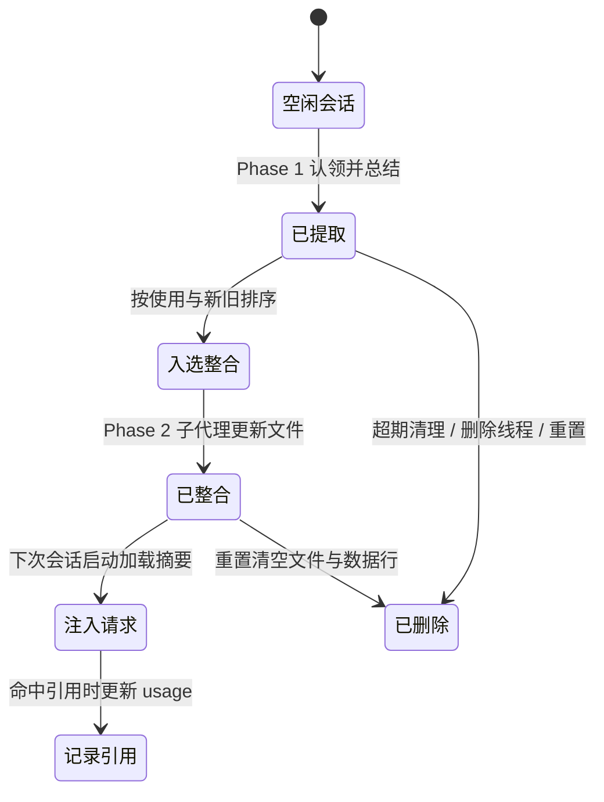

> 本文根据 Codex 记忆系统的多轮问答整理：[长期记忆与存储](../../raw/2026-09-22-153921.md)、[记忆源码与模板](../../raw/2026-09-22-153917.md#q6)、[什么算高信号记忆](../../raw/2026-09-22-202834.md)、[保存触发时机](../../raw/2026-09-22-202951.md)、[位置与格式](../../raw/2026-09-22-203150.md)、[更新与过期](../../raw/2026-09-22-203726.md)、[生命周期总结](../../raw/2026-09-22-204002.md)。

**任务状态帮同一个任务继续，长期记忆让后来的任务少走弯路。** 但把一次会话的经验留给未来，并不只是存下一份聊天记录：难的是决定什么值得记、它怎样被后来的任务读到、新旧经验冲突时听谁的，以及没人再用的怎样退场。这几个判断连在一起，才构成一套能运转的长期记忆。

## 经验只活在一次会话里

**同一个人、同一个项目，往往要在很多个会话里反复打同样的交道。** 你可能每次都要提醒「提交信息写中文」「测试用 `pnpm test`」，遇到构建报错又要重新翻一遍上次是怎么修的。Goal 和 Plan 只服务当前任务，会话一结束，这些经验就随上下文一起消失。

**要把一次会话里学到的东西留给下一次，就需要一种跨任务、可积累、可查阅的记忆。** 这里要解决的是让未来的 agent 少问一次、少查一遍、少踩一个坑，所以记忆必须有选择、可复用，不能只是聊天记录的原样备份。

## 该记住什么

**既然不能全留，第一件事就是决定什么值得留下。** 判断标准是有没有依据、能不能复用，以及能不能让未来的 agent 更了解用户、更高效工作。高信号内容大致是这几类：[高信号标准](../../raw/2026-09-22-202834.md)

- 稳定的用户偏好、反复出现的厌恶点与重复的指导模式
- 能避免无谓探索的决策触发条件
- 失败防护：症状 → 原因 → 修复 + 验证 + 停止规则
- 仓库或任务地图：入口、配置、命令在哪里
- 工具技巧与可靠捷径，以及已验证的复现方案

**什么不该留也要划清。** 泛泛的建议（「小心一点」）、密钥凭证、原样复制的大段输出，以及把探索性讨论、一次性印象或助手自己的提议当成结论，都明确排除。优先级上，**减少未来用户的干预比降低搜索成本更重要**，所以用户偏好信号优先于常规流程回顾。

**类别之外还要标出可信度。** 用户明确陈述、实际采纳、工具验证过的内容才可靠：模型提过一个建议，不等于用户接受了它；一次尝试成功，也不代表任何环境都适用。记录要带上适用范围、来源时间和验证情况，并按「认知状态」分级：已验证的仓库或工具事实可以直接陈述，稳定的用户偏好可以提升，从反复跟进推断出的偏好要谨慎并写明出处，探索性讨论则保持局部或省略。这套分级靠整合提示词约束，代码里没有结构化的可信度字段兜底。[证据与认知状态](../../raw/2026-09-22-203726.md)

类别和可信度都定了，可积累起来的内容不可能每次会话都整份注入。于是有了下一个问题：它放在哪里，未来的任务又怎样读到它？

## 写下来之后，未来任务怎样读到

**记忆一多，全量注入就不成立，于是按「渐进披露」分层，让常驻的只有导航信息。** 会话启动时注入的只有摘要，手册和技能只在需要时按需读取。[文件分工](../../raw/2026-09-22-153917.md#q6)

```text
memories/                  # 记忆根目录，一个 git 工作区
├── memory_summary.md      # 常驻 system prompt 的导航摘要；首行必须严格是 v1
├── MEMORY.md              # 按关键词 grep 的手册；聚合洞见并指向相关会话摘要
├── raw_memories.md        # 中间产物；Phase 1 合并的原始记忆，Phase 2 的输入
├── rollout_summaries/     # 单次会话的摘要；含教训、可复用知识与精简证据
│   └── <rollout_slug>.md  # 一次会话一个文件
└── skills/                # 可选；把反复出现且可靠的流程写成技能
    └── <skill-name>/      # 一个技能一个目录
        ├── SKILL.md       # 入口：YAML frontmatter + 指令
        └── scripts/       # 可选附件；另有 templates/、examples/
```

**这些文件位于 `codex_home/memories/`，模板对摘要密度、手册分块和技能触发条件都有格式要求。** 保存前还要校验产物合法，例如没有残留符号链接、摘要首行确实是 `v1`。[位置、格式与校验](../../raw/2026-09-22-203150.md)

分层解决了读到什么。但流水线每次启动都可能把新证据整合进来，新旧经验一旦并存，就会互相冲突。

## 新证据和旧经验冲突时怎么办

**更新是把新证据整合进已有结构的过程。** 缺少已有产物时从零构建（INIT），否则读 git 风格的 `phase2_workspace_diff.md` 做增量：新增或修改的输入进入待摄入队列，被删除的输入进入待遗忘队列。设计上要求最小化改动，现有块仍然成立就保持措辞和顺序，只在过时、歧义或证据明显变化时才动。[更新模式与最小改动](../../raw/2026-09-22-203726.md)

**冲突的取舍原则是：更新鲜且已验证的证据优先。** 新证据实质改变某个任务族的指导时就更新，并把它上移；验证不明时显式保留不确定，不强行合并；范围不同的要求可以并存，只有同一范围被明确更改时才需要覆盖。

更新处理了新旧的取舍。可一条经验长期没人用，继续留着只会稀释信号，怎样让它退场？

## 没人再用的旧经验怎么淘汰

**淘汰要有依据，于是引入「使用」这个信号。** 模型回复里引用某条记忆时，对应记录的 `usage_count` 加一、`last_usage` 更新；`last_usage` 超出 `max_unused_days` 的记忆会掉出整合候选，长期不用还会被清理。这里要分清两类计数：`usage_count` 统计的是记忆被引用，而 `codex-memories-read` 里按命令路径统计的另一套（`MemoriesUsageKind`）属于读取遥测，并不决定过期。[使用与过期](../../raw/2026-09-22-203726.md)

**删除分自动和手动两类。** 自动的是启动时清理超期原始记忆，以及按线程删除（若该输出已入选整合，会重新排队一次）；手动的是全量重置，可由 `memory/reset`、`debug clear-memories` 或 TUI 的 `Reset all memories` 触发，它清空记忆数据但保留线程的 `memory_mode`。[删除与重置](../../raw/2026-09-22-204002.md)

`max_unused_days` 只影响哪些候选进入整合，实际删除动作由整合代理按 workspace diff 执行。选择、读取、更新、淘汰都发生在同一次整合里，把它们放回时间轴，就是一条记忆的完整生命周期。

## 完整的生命周期

**一条记忆经历：会话闲置 → 被认领提取 → 入选整合 → 注入请求 → 被引用记录 → 过期或被删除。** 流水线在根会话启动时触发（非临时会话、已启用 `MemoryTool`、非子 Agent、状态数据库可用）：Phase 1 认领闲置够久的会话逐个提取，Phase 2 取全局锁做整合。**是否写文件，由 git 工作区有没有 diff 决定**：没有变化就标记成功退出，保存前再校验产物合法。[触发与保存条件](../../raw/2026-09-22-202951.md)



**理解这条链路的关键，是把「保存」拆成两个判断：值不值得记，以及现在还要不要留。** 前者靠提取与整合的提示词约束（该记住什么），后者靠使用计数和证据是否仍然存在（冲突、过期、删除）。候选先进入 state DB，再由整合阶段更新文件，所以 **生成了候选，不等于后续模型已经读到它**。[两阶段流程](../../raw/2026-09-22-153917.md#q6)

长期记忆的价值，在于让后续任务拿到相关、可信、仍然有效的经验；存得更多，本身并不代表记得更好。

> **Status: Disputed** — 原问答称 `MEMORY.md` 全文直接注入、读写链路已经验证；现有材料显示 `memory_summary.md` 常驻 system prompt，`MEMORY.md` 靠 grep / 读取按需使用。使用计数来自模型回复中的记忆引用（`usage_count` / `last_usage`），命令级文件读取另有 `MemoriesUsageKind` 遥测一套；两者都只能说明某条记忆被引用或被读取，仍不足以证明整条注入链。
