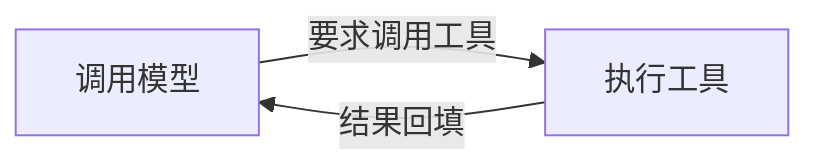

> [!tip] Agent 通过「观察 → 分析 → 执行」的循环，持续朝目标行动。
> 模型根据环境与执行结果决定下一步，执行层调用工具，再把结果交回模型。

```go
for {
    reply := model.Invoke(messages, tools) // 调用模型
    messages = append(messages, reply)
    if len(reply.ToolCalls) == 0 { // 没有工具调用就结束
        break
    }
    for _, call := range reply.ToolCalls { // 执行工具
        messages = append(messages, execute(call))
    }
}
```

上面是最小循环的示意：**模型做判断，工具执行动作，结果写回上下文。** 这个循环在模型不再请求工具时结束。



> 模型怎么知道调用什么工具？

**[工具调用](tool-call/index.md)**：把工具的用途与参数告诉模型，由模型选择、执行层调用，结果再回填。工具多时按需发现，结果过大时截断或落盘，控制上下文占用。

> 能调工具之后，何时动手、做到什么程度、怎样算完成？

**[系统提示词设计](system-prompt-design/index.md)**：把「做好任务」展开成可遵循的规则，明确环境与项目约定、行动边界，以及计划、验证和交付要求。

> 只在特定任务里用到的指令，也要一直带着吗？

**[Agent Skills](agent-skills.md)**：把文档写法、系统操作步骤等任务专属指令按需加载。平时只提供名称与描述，用到时再读取 `SKILL.md` 及相关资源。

> 任务步骤多了，怎样避免遗漏、跟踪进度？

**[任务拆分与规划](task-planning.md)**：把任务拆成可检查的阶段，用计划记录待办与状态；遇到不可行的步骤或目标变化时，及时调整。

> 拆出的独立子任务，能否同时推进？

**[多 Agent](multi-agent/index.md)**：主 Agent 将可安全并行的任务委派给子 Agent，让它们在独立上下文中工作，再汇总结果。需要明确角色、权限与交付要求，避免重复劳动和修改冲突。

> 工具结果、指令和任务记录不断累积，上下文装不下怎么办？

**[上下文工程](context-engineering/index.md)**：决定信息怎样组装、存储和压缩，在有限窗口内保留目标、进度与有效约束；需要跨会话复用的经验，再提取为长期记忆。

> 模型调用失败，循环怎样继续？

**[模型调用错误处理](model-call-retry-and-fallback.md)**：按原因选择重试、切换模型、修正输入或停止，并用次数、时间与总预算限制恢复成本。

> 如果任务被取消，或进程退出，怎样接着做？

**[中断与恢复](interrupt-resume/index.md)**：控制执行停止，保存历史与任务状态，恢复时重建上下文与进度，让任务能够从已有结果继续。

可通过 [AI Agent 面试题清单（120 题）](interview-question-checklist.md) 按模块自测。
