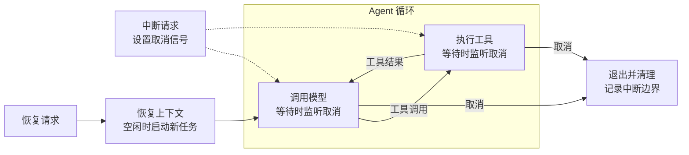

> 本文摘编自 [DeepWiki 关于 openai/codex 中断恢复的源码问答原文](../../raw/2026-09-21-221655.md)，从整体设计到关键边界，学习如何实现中断恢复。

## 一、整体设计：保留进度，停止执行，重新驱动

**中断恢复的核心，是让任务的进度独立于当前执行它的进程。** 对一次 Agent 执行（turn），需要回答三个问题：运行时如何控制它停下，停下后留下什么，重新启动时如何接着推进。

Codex 将这三件事分别交给 **运行时任务、持久化历史和历史重建器**。运行中不断记录消息、工具结果和生命周期事件；中断时取消任务并记录结束边界；如果运行时已经丢失，就从历史重建上下文，再申请继续原 turn。

**图中只保留两条控制路径：中断让循环退出，恢复让新任务进入循环。** 取消信号在等待模型或工具结果时被感知；退出、清理和恢复均位于循环外。

**持久化贯穿这个过程：运行时记录输入输出，中断时记录边界，重建上下文时读取历史。** 这些数据读写关系不再单独连线，正常完成和超时兜底也在图中省略。

**这里恢复的是任务身份和已有上下文，执行载体是新任务。** `recover_turn_if_idle` 保留原 `turn_id`，不增加一条新用户输入，再启动 `RegularTask`。这并不意味着恢复旧调用栈，也不能单凭已有工具结果就保证精确续执行到某个动作。

理解整体结构，只需先区分下面三份状态：

| 状态 | Codex 中的对应物 | 用途 |
| --- | --- | --- |
| 当前谁在执行 | `active_turn` | 持有任务和取消句柄，协调启动与中断 |
| 已经发生过什么 | rollout JSONL | 持久化输入输出、执行边界与设置 |
| 模型接下来能看到什么 | `ContextManager` | 保存当前可用的对话和工具结果 |

**设计自己的实现时，也应先确定恢复粒度。** 如果目标是让模型基于历史继续工作，可以学习这套结构；如果要求确定地跳过已完成动作、从指定步骤继续，还需要额外保存动作状态和下一执行位置。以下先看 Codex 如何处理几个关键边界。

## 二、关键边界：这套流程怎样落地

### 1. 存储边界：保存什么，怎样表达状态变化

**恢复需要的历史应同时包含执行内容与控制事件。** Codex 用 `RolloutItem` 将它们写入同一份 JSONL，主要包括以下几类。见原文 [Q7–Q9](../../raw/2026-09-21-221655.md#q7)。

| 类型 | 保存的内容 |
| --- | --- |
| `ResponseItem` | 消息、工具调用与结果、模型可见的中断提示 |
| `EventMsg` | `TurnStarted`、`TurnAborted`、`TurnComplete` 等事件 |
| `TurnContext` | turn 身份、模型、权限和沙箱等上下文 |
| `Compacted` | 压缩后的历史基线 `replacement_history` |

**日志通过追加事件表达变化，当前状态由读取端计算。** 例如，先记录 `TurnStarted`，运行中追加工具结果，中断时再追加 `TurnAborted`；无需回头修改开始记录。`ThreadHistoryBuilder` 按 `turn_id` 关联这些事件，判断一段执行是否已经收尾。

**写入历史与发送模型上下文，是两套筛选。** 持久化策略会排除部分流式增量、审批请求等瞬时事件；模型上下文也不会直接使用全部日志。不过，已进入模型历史的工具结果通常跨 turn 保留，直到压缩、回滚或截断改变它们。见原文 [Q10–Q11](../../raw/2026-09-21-221655.md#q10)。

### 2. 停止边界：什么时候才算中断完成

**中断是一段收尾流程：认领任务 → 取消 → 等待与清理 → 记录边界 → 通知。** Codex 先在 `active_turn` 锁内核对目标 ID，用 `take()` 取走任务，再在锁外执行取消与等待，避免重复认领，也避免长时间持锁。见原文 [Q3](../../raw/2026-09-21-221655.md#q3)、[Q18](../../raw/2026-09-21-221655.md#q18)。

**执行侧在等待结果时监听取消，控制侧等待任务退出后收尾。** 模型流通过 `or_cancel`、工具调度通过 `select!` 同时等待结果与取消信号；超出宽限期则由控制侧调用 `abort()` 兜底。取消不会回滚已经产生的外部副作用。接收点见[模型流](https://github.com/openai/codex/blob/main/codex-rs/core/src/session/turn.rs)、[工具调度](https://github.com/openai/codex/blob/main/codex-rs/core/src/tools/parallel.rs)及 [or_cancel 实现](https://github.com/openai/codex/blob/main/codex-rs/async-utils/src/lib.rs)。

**通知前要考虑读写顺序。** Codex 在启用中断提示时，先记录模型可见的 marker 并尝试 `flush`，再发送 `TurnAborted`，因为客户端收到事件后可能立即重读历史。前者告诉模型执行曾被打断，后者告诉程序该 turn 已中断。所附代码在 flush 失败时记录 warning 后继续，因此自实现时仍须明确：写失败是否允许对外确认中断。见原文 [Q5–Q6](../../raw/2026-09-21-221655.md#q5)。

### 3. 恢复边界：从哪份历史开始，何时允许继续

**重建历史是有界扫描，不必从头回放。** rollout 只能追加，重建时 `reconstruct_history_from_rollout` 逆序扫描 `RolloutItem`，一旦同时找到最新的压缩检查点（带 `replacement_history` 的 `Compacted`）和必要的 resume 元数据就停止，以该检查点的 `replacement_history` 为起点，再重放检查点之后的 suffix。因此检查点之前的中间结果不会重新载入内存，回滚（丢弃最近 N 个用户 turn）也在这套扫描里被跳过。见原文 [Q11](../../raw/2026-09-21-221655.md#q11)、[Q12](../../raw/2026-09-21-221655.md#q12)、[Q19](../../raw/2026-09-21-221655.md#q19)。

**恢复保留 turn 身份，并挂回原 turn 树。** `recover_turn_if_idle` 不提交新的用户输入，复用原 `turn_id` 作为提交 ID，对存储和模型而言都是同一个 turn 在继续。提交前它会读取持久化的 `reference_context_item`，按 `turn_id` 过滤取出 `root_turn_id` 写进 `TurnStartOptions`，还原父子关系，使恢复出的 turn 仍处在原 turn 树的位置。见原文 [Q2](../../raw/2026-09-21-221655.md#q2)、[Q5](../../raw/2026-09-21-221655.md#q5)、[Q6](../../raw/2026-09-21-221655.md#q6)。

**只有空闲才允许继续，拒绝时不留下痕迹。** `handle_recovery` 先检查 `active_turn`，若已有活跃任务则返回 `NotIdle`，既不注入输入也不应用请求携带的设置。所附测试分别验证了忙碌时拒绝不产生副作用，以及恢复能用请求里的 `thread_settings` 切回 Plan 模式、并以 `turn_trigger: "retry"` 发起模型请求。见原文 [Q2](../../raw/2026-09-21-221655.md#q2)。

### 4. 并发边界：状态认领、日志写入和生命周期分别保护

**每种竞争都应有明确的保护范围。** Codex 的相关机制可归纳为下表。见原文 [Q20](../../raw/2026-09-21-221655.md#q20)。

| 竞争 | 保护方式 |
| --- | --- |
| 同一任务被重复中断 | `active_turn` 锁内核对并取走任务 |
| 活跃期间再次恢复 | idle 检查，忙碌则拒绝 |
| 同一线程并发追加 / flush | 每线程 writer 锁，串行处理写入 |
| fork 与删除 / 归档冲突 | lifecycle 读写锁，区分共享与独占操作 |
| 重复安装 live writer | `live_recorders` 检查并拒绝重复插入 |

**短锁只保护认领，收尾窗口仍需协调。** 取走 `active_turn` 后，取消和清理尚未完成；自己的调度器应保证此时不会让旧任务的清理影响新任务，可以通过统一串行控制或显式的“正在停止”状态实现。同时需要两类存储锁时，Codex 规定先取 lifecycle，再取 writer，固定顺序避免相互等待。

### 5. 副作用边界：互斥不能代替幂等

**线程空闲检查、恢复请求去重和工具幂等，是不同问题。** `NotIdle` 能阻止忙碌时重复启动，但第一次恢复结束后，迟到的请求仍可能遇到 idle；工具结果留在历史里，也不能证明远程操作不会被再次执行。见原文 [Q18](../../raw/2026-09-21-221655.md#q18)。

**如果业务要求精确恢复，需要在上述结构上补充动作记录。** 以下是自实现建议，所附片段未证明 Codex 已提供这些完整保证：

- **请求去重**：记录恢复请求 ID，识别迟到的重复请求。
- **动作幂等**：同一逻辑动作使用稳定幂等键，复用已确认结果。
- **不确定结果核实**：外部操作可能成功但结果未落盘时，先查询再决定是否重试。
- **跨进程执行权**：用单写者、租约或执行代次约束旧执行器。

**实现后优先测试边界交错。** 尤其是取消尚未收尾就恢复、工具成功后写盘前崩溃、恢复完成后重复请求到达。这些场景能检验“进度独立于进程”是否真正成立。

## See Also

- [中断与恢复子专题](ai-agent/interrupt-resume/index.md) — turn / thread 与挂起交接。
- [内部中断实现](internal-interrupt.md) — 工具等待输入与业务状态机。
- [外部中断实现](external-interrupt.md) — 从外部停止循环与安全点。
- [多 Agent 中断实现](multi-agent-interrupt.md) — 中断传播和恢复寻址。
