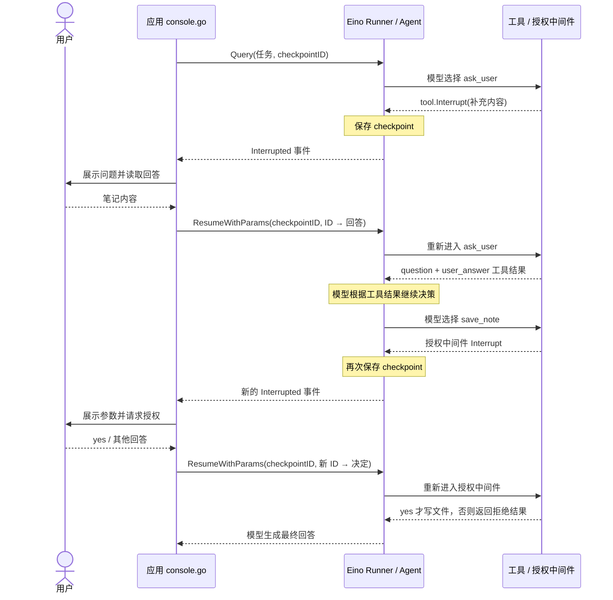

> 本文基于 [03：Eino 单 Agent 与用户交互](https://github.com/code-practice-archives/agent-practice/tree/main/03-eino-human-in-the-loop)与 [05：手写中断与用户交互](https://github.com/code-practice-archives/agent-practice/tree/main/05-native-human-in-the-loop)的源码，说明两种内部中断实现。

**内部中断，是工具或工具中间件主动把执行权交还应用，等应用补充输入后再继续。** 两个项目都实现笔记保存助手：不知道保存什么时调用 `ask_user` 追问；准备调用 `save_note` 时先请求授权；收到同意后才写文件。下文先看 Eino 如何接入这套流程，再拆开手写版的实现。

**两种实现都把“等待用户”放在最外层应用。** 模型负责选择工具，工具声明需要输入，应用读取回答并恢复执行。模型只输出一句“请输入内容”，不会自动触发中断；工具也不直接读取终端。

## 一、Eino：用框架连接工具、事件与恢复

### 1. Checkpoint：中断后仍能恢复的核心

**Checkpoint 是 Eino 实现中断恢复的核心：当前执行退出后，框架依靠保存的执行状态继续推进任务。** 工具返回 `tool.Interrupt` 只是在声明“这里需要外部输入”；要让用户稍后回答时还能接着执行，框架还必须记住已有上下文、未完成的工具调用及其中断位置。恢复时，Eino 从 checkpoint 还原执行状态，再把回答交给对应的调用。

**接入这套机制，需要配置存储，并为本次运行指定 checkpoint ID。** [main.go](https://github.com/code-practice-archives/agent-practice/blob/main/03-eino-human-in-the-loop/main.go) 将 `memoryStore` 传给 Runner；[console.go](https://github.com/code-practice-archives/agent-practice/blob/main/03-eino-human-in-the-loop/console.go) 在启动执行时绑定 ID：

```go
store := &memoryStore{}
runner := adk.NewRunner(ctx, adk.RunnerConfig{
    Agent:           agent,
    CheckPointStore: store,
})

iter := runner.Query(ctx, question, adk.WithCheckPointID(checkpointID))
```

**框架负责组织和恢复执行快照，应用提供快照的存储位置与标识。** 本例的 [memoryStore](https://github.com/code-practice-archives/agent-practice/blob/main/03-eino-human-in-the-loop/checkpoint.go) 只需存取框架生成的字节，不需要自己拼接消息历史或记录工具执行进度。后续调用 `ResumeWithParams` 时，仍使用同一个 `checkpointID` 找回状态，再用 interrupt ID 指定回答的目标。

**有 checkpoint 不等于已经持久化。** 03 项目使用内存存储，只支持当前进程存活期间的恢复；进程重启后继续执行需要可持久保存快照的存储实现。项目使用 [go.mod](https://github.com/code-practice-archives/agent-practice/blob/main/go.mod) 锁定的 Eino `v0.9.13`，下面的 API 以项目代码为准。

### 2. 使用 tool.Interrupt 主动触发中断

**工具或中间件需要用户介入时，返回 `tool.Interrupt(ctx, info)`，就能把中断信号交给 Eino。** `ctx` 使用框架传入的当前调用上下文，`info` 携带展示给用户的问题或操作说明。03 项目有两处调用：

```go
// askUser 内：需要用户补充笔记内容。
return nil, tool.Interrupt(ctx, "[补充信息] "+input.Question)

// save_note 的授权中间件内：写文件前请求用户确认。
return "", tool.Interrupt(ctx, prompt)
```

[tools.go](https://github.com/code-practice-archives/agent-practice/blob/main/03-eino-human-in-the-loop/tools.go) 在没有有效回答时发起追问；[approval.go](https://github.com/code-practice-archives/agent-practice/blob/main/03-eino-human-in-the-loop/approval.go) 在尚未取得授权时拦截保存。**两者都必须把 `Interrupt` 的返回值沿调用链返回，框架才会保存状态并向应用报告中断。**

恢复后，工具或中间件通过 `tool.GetResumeContext[string](ctx)` 读取对应回答：追问拿到非空内容就返回工具结果，授权收到 `yes` 才执行保存；否则再次追问或返回拒绝结果。

**追问由模型选择工具发起，保存授权则由应用规则强制检查。** 授权决定来自本次中断的用户回答，工具参数中没有供模型自行填写的 `approved` 字段；同意一次也不代表后续保存全部放行。

### 3. 应用：消费中断事件，再带回答恢复

**应用判断事件是否携带中断，完成用户交互后，再把回答交回 Runner。** 下面将 [console.go](https://github.com/code-practice-archives/agent-practice/blob/main/03-eino-human-in-the-loop/console.go) 中分散在多个函数里的核心代码拼接展示，省略外围事件循环、错误和输入结束处理：

```go
// 消费事件：发现中断，收集需要用户回答的位置。
if event.Action != nil && event.Action.Interrupted != nil {
    for _, point := range event.Action.Interrupted.InterruptContexts {
        if point.IsRootCause {
            interrupts = append(interrupts, point)
        }
    }
}

// 当前事件流结束后：展示问题、收集回答，再恢复执行。
if len(interrupts) > 0 {
    answers := map[string]any{}
    for _, point := range interrupts {
        fmt.Printf("%v\n> ", point.Info)
        input.Scan()
        answers[point.ID] = input.Text()
    }
    iter, err = runner.ResumeWithParams(ctx, checkpointID,
        &adk.ResumeParams{Targets: answers})
}
```

**`IsRootCause` 筛选真正发起中断的位置，`point.Info` 是展示给用户的提示，`point.ID` 将回答绑定到对应中断。** 事件流结束后才进入交互与恢复阶段；上述片段中的 `input.Scan()` 在原项目中会检查输入结束与读取错误，读取失败不会继续恢复。

**恢复需要同时指定“哪份执行状态”和“回答交给哪个中断”。** `checkpointID` 选择整次运行的快照；`Targets` 的键是事件返回的 interrupt ID，值是用户输入。恢复使用 `ResumeWithParams`，无需重新 `Query` 或手工补消息。恢复后可能再次追问或申请授权，因此仍要继续消费新的事件。

**换成网页时，只需把终端读入替换为表单展示与提交，交互仍由应用层统一处理。** 后端保留执行状态，前端展示中断提示；用户提交后，后端找到原 checkpoint，并按对应中断 ID 传回回答。多个等待位置分别收集回答，子 Agent 也共用这个外层交互入口。

### 4. 一次任务的完整运行流程

下面以“请帮我保存一条学习笔记”为例，展示两次中断。模型具体选择哪些工具仍取决于其输出；如果用户一开始已给出笔记内容，就可以跳过追问。



**Eino 用 checkpoint 保存进度，应用通过中断事件接手交互，再调用 Resume 交回回答。** 恢复时会重新进入工具或中间件，由它读取回答并继续执行。

## 二、手写：自己实现状态保存与恢复

### 1. Session：保存下一步继续执行所需的状态

**手写版的核心是让执行状态独立于函数调用：`Run` 可以返回，应用持有的 `Session` 仍然保留任务进度。** [runner.go](https://github.com/code-practice-archives/agent-practice/blob/main/05-native-human-in-the-loop/runner.go) 用以下结构承担 Eino checkpoint 在这个单会话示例中的作用：

```go
type Session struct {
    Messages   []openai.ChatCompletionMessage // 已有消息，包括模型发出的工具调用
    Pending    []openai.ToolCall              // 未完成的调用，保留 ID、工具名和原参数
    Waiting    *Interrupt                    // 当前等待用户回答的中断
    ModelCalls int                           // 跨恢复累计模型调用次数
    Done       bool                          // 是否完成
}

type Interrupt struct {
    ID     string
    Kind   string
    Prompt string
}
```

**消息历史记录“已经发生什么”，工具队列记录“接下来还要做什么”。** 请求模型后，[`callModel`](https://github.com/code-practice-archives/agent-practice/blob/main/05-native-human-in-the-loop/runner.go) 将返回的 assistant 消息与工具调用一起保存；下面省略模型请求、响应校验等外围代码：

```go
message := response.Choices[0].Message
session.Messages = append(session.Messages, message)
session.Pending = append([]openai.ToolCall{}, message.ToolCalls...)
session.Done = len(session.Pending) == 0
```

模型没有发起工具调用就完成任务，否则进入工具执行。本例只处理队首调用，因此直接用它的 tool call ID 作为中断 ID；状态仅保存在内存中。

### 2. 中断：工具返回信号，循环保存状态并退出

**手写的 `interrupt` 只构造数据，真正停止执行的是 `Run` 中的判断与返回。** [tools.go](https://github.com/code-practice-archives/agent-practice/blob/main/05-native-human-in-the-loop/tools.go) 用 `toolOutcome` 区分正常结果与中断，`error` 则用于报告参数错误等执行失败：

```go
type toolOutcome struct {
    Content   string
    Interrupt *Interrupt
}

func interrupt(call openai.ToolCall, kind, prompt string) toolOutcome {
    return toolOutcome{
        Interrupt: &Interrupt{ID: call.ID, Kind: kind, Prompt: prompt},
    }
}

// askUser 内：首次调用或回答为空时，返回中断。
if answer == nil || strings.TrimSpace(*answer) == "" {
    return interrupt(call, "补充信息", question), nil
}
```

**`Run` 必须保留中断的工具调用，不能把它当成已完成结果移出队列。** 以下截取主循环核心，省略上下文取消与错误处理；`callModel` 请求模型并保存上一节的状态，`finishTool` 完成消息追加与出队：

```go
if session.Waiting != nil || session.Done {
    return session.Waiting, nil
}
for !session.Done {
    if len(session.Pending) == 0 {
        r.callModel(ctx, session)
        continue
    }
    outcome, _ := invokeTool(session.Pending[0], nil)
    if outcome.Interrupt != nil {
        session.Waiting = outcome.Interrupt
        return session.Waiting, nil // Pending 不变，控制权交回应用
    }
    session.finishTool(outcome.Content)
}
```

**`Waiting` 防止等待期间重复执行，`Pending` 防止工具结果补齐前再次请求模型。** 首次调用工具传入 `nil`，表示尚无用户回答；保存授权也使用同一协议，由 `approveNote` 在写文件前返回中断。

### 3. 恢复：带回答重入工具，再补消息、出队、继续循环

**应用收到中断后读取回答，再将原 `Session`、中断 ID 和回答传给 `Resume`。** [main.go](https://github.com/code-practice-archives/agent-practice/blob/main/05-native-human-in-the-loop/main.go) 的交互核心如下，省略错误与输入结束处理：

```go
pause, err := runner.Run(ctx, session)
for err == nil && pause != nil {
    fmt.Printf("%s\n> ", pause.Prompt)
    input.Scan()
    pause, err = runner.Resume(ctx, session, pause.ID, input.Text())
}
```

**`Resume` 的具体工作是完成原来的工具调用，再回到 `Run`。** 下面将 [runner.go](https://github.com/code-practice-archives/agent-practice/blob/main/05-native-human-in-the-loop/runner.go) 的 `Resume` 与 `finishTool` 拼接，展示连续的状态变化，省略函数声明和上下文取消检查：

```go
// 确认回答属于当前等待的中断。
if session.Waiting == nil || session.Waiting.ID != id {
    return nil, fmt.Errorf("no pending interrupt with ID %q", id)
}

// 保留原工具名、参数与 call ID，只额外传入用户回答。
outcome, err := invokeTool(session.Pending[0], &answer)
if err != nil {
    return nil, err
}
if outcome.Interrupt != nil {
    session.Waiting = outcome.Interrupt
    return session.Waiting, nil // 回答仍不足，继续保留队首调用
}

// 工具完成：补齐结果消息，再移除调用并清除等待状态。
session.Messages = append(session.Messages, openai.ChatCompletionMessage{
    Role:       openai.ChatMessageRoleTool,
    ToolCallID: session.Pending[0].ID,
    Content:    outcome.Content,
})
session.Pending = session.Pending[1:]
session.Waiting = nil
return r.Run(ctx, session)
```

**回答通过 `answer *string` 进入工具，通过 `role=tool` 消息进入模型上下文。** `askUser` 将非空回答编码为 `question`、`user_answer`；`approveNote` 只有收到去掉首尾空白后的小写 `yes` 才写文件，其他回答返回拒绝结果。`nil` 与空字符串也因此有区别：前者表示还没回答，后者在追问中触发再次中断，在授权中表示拒绝。

**`ToolCallID` 把结果对应到原调用，出队则标记这项工作已经完成。** 如果模型一次发起多个工具调用，恢复后继续处理剩余队列，全部完成后才再次请求模型。这里不能只追加一条 user 消息就直接调用模型，否则原工具调用仍缺少结果。

### 4. 一次中断如何改变执行状态

**以队首 `ask_user` 为例，中断与恢复只改变几项明确的状态。** 下表展示每个阶段处理后的结果：

| 阶段 | `Pending` | `Waiting` | `Messages` |
| --- | --- | --- | --- |
| 模型发起追问 | 加入 `ask_user` 调用 | `nil` | 追加含工具调用的 assistant 消息 |
| 工具中断，等待用户 | 保留原调用 | 记录当前中断 | 不变 |
| 提交空回答，再次中断 | 保留原调用 | 更新为返回的中断 | 不变 |
| 提交有效回答，工具完成 | 移除队首调用 | 清为 `nil` | 追加匹配原 call ID 的 tool 结果 |

**等待时保留调用，完成时才补消息并出队。** 随后继续执行剩余工具；队列为空时，再请求模型。

**手写中断靠“保存状态并返回”，恢复靠“重入工具并推进状态”。** `Session` 保留进度，`Run` 决定何时停，`Resume` 补齐未完成工作后继续循环。

## 三、中断与恢复的实现机制

**这两个项目的内部中断，本质上是把一次连续执行拆成可以重新进入的阶段。** 工具声明尚缺输入，执行器保留未完成工作并返回；输入到达后，再根据保存的状态推进任务。

### 1. 将执行进度保存在调用栈之外

**函数返回后仍能继续，前提是下一步所需的信息没有随调用栈消失。** 已有消息、未完成的工具调用及其参数、中断位置，都必须保留在执行状态中。checkpoint 或 `Session` 承担的就是这个职责；它们保存的是恢复所需的数据，而不是停在某一行的 Go 调用栈。

### 2. 用显式信号让执行器交出控制权

**工具返回中断信号，执行器识别信号后停止推进，并把等待信息交给应用。** 声明中断和停止执行是两个环节：仅构造一个 `Interrupt` 不会自动暂停，调用链必须将它向上传递，执行器也必须保留原调用而非将其标为完成。用户交互发生在应用层，等待期间不再推进模型循环。

### 3. 将恢复输入送回原来的调用

**恢复先找到原执行状态，再将回答绑定到其中等待的工具调用。** 原工具名称、参数和 call ID 保持不变，用户回答作为额外输入传入。工具从入口重新执行，通过恢复上下文或显式参数判断是否已有回答；输入仍不足就再次中断，授权通过后才执行受保护的操作。

### 4. 完成工具结果后再推进循环

**恢复完成的标志是原工具调用得到结果，而不仅是用户提交了回答。** 执行器追加匹配原 call ID 的 tool 消息，移除已完成调用并清除等待状态，然后处理剩余工具；全部结果补齐后，才再次请求模型。授权拒绝也可以形成正常工具结果，让模型据此结束任务。

> **Status: Outdated（2026-09-21）**：旧版“副作用必须放在中断点之后”的说法不够准确。工具会重新进入，副作用应受恢复后的有效输入或授权判断保护，而不能仅靠源码行号的先后保证。

**可恢复不等于崩溃后不会重复执行。** 两个示例都只保存内存状态；若写文件成功后、完成状态保存前发生故障，重试仍可能重复写入。跨进程恢复需要持久化状态，副作用的重复执行则需要另外做幂等控制。

## 延伸阅读

- [外部中断实现](external-interrupt.md) — 应用主动暂停正在运行的 Agent。
- [多 Agent 中断实现](multi-agent-interrupt.md) — 中断传播与恢复寻址。

## 参考文档

- [Eino 官方第七章：Interrupt/Resume（中断与恢复）](https://www.cloudwego.io/zh/docs/eino/quick_start/chapter_07_interrupt_resume/)
