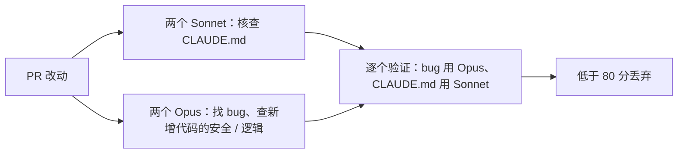
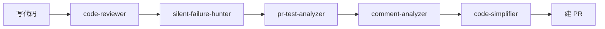

> 本文根据 DeepWiki 的 [Claude Code 多 Agent 触发问答](../../raw/2026-09-23-000951.md)整理，沿着「为什么要开多个 agent → 谁决定开几个 → 模型自己决定时引擎给了什么引导 → 模型实际看到什么」这条线索，看 Claude Code 里多 agent 的触发方式。

**Claude Code 的多 agent 有两条路线：插件和命令把流程写死，引擎则让模型按各 agent 的 `description` 在运行时派生。** 两者都用同一个 Agent 工具派发，但决策者不同。

## 从一次 PR 审查看多 agent 的两类动机

Claude Code 的多 agent 集中在 **同一份内容需要多个独立视角处理** 的场合，典型是 `/code-review`：第 4 步并行开 4 个 agent 审同一份 PR，第 5 步逐个验证发现的问题，只留 80 分以上的。

**动机有两类：并行加速，以及交叉验证（一个 agent 提问、另一个独立复核，用来过滤假阳性）。** README 的理由很直接——假阳性会消耗审查者的信任，所以宁可少报。

`pr-review-toolkit` 则是一条可并行的串行链：

## 谁决定开几个：两层不同的触发机制

上半部分的流程看起来像模型在临场判断，拆开看却分两层，**决策者并不相同**。

**第一层在插件/命令层，是写死的静态编排。** `/code-review` 是一份 Markdown 指令文件，触发条件只有一条：用户调用它；一旦调用，上面的固定流程必然执行，模型只是执行命令作者编排好的步骤。

**第二层在引擎层，是模型动态决定。** `Task`/`Agent` 工具让模型按任务上下文决定是否派生 subagent，`subagentType` 必须命中已注册定义，否则拒绝派生。`pr-review-toolkit` 介于两者之间，由用户显式指定并行或串行。

| 层级 | 触发条件 | 决策者 |
|---|---|---|
| 插件命令（如 `/code-review`） | 命令被调用即执行固定步骤 | 命令作者，写死在 `.md` 里 |
| `pr-review-toolkit` 插件 | 用户明确要求并行或串行 | 用户显式指定 |
| 引擎 `Task`/`Agent` 工具 | 模型判断任务需要委派 | 模型，依据 agent 的 `description` |
| 动态工作流 | 用户要求「创建工作流」，模型自行拆解规模 | 模型决定并行 agent 数量 |

**动态工作流是「模型决定数量」最彻底的例子。** 用户说一句「创建一个工作流」，模型就在后台编排数十到数百个 agent。

## 模型自己决定时，引擎给了哪些引导

第二层交给模型判断，引擎靠的是一组 **结构性引导，而不是决策规则表**：

1. **agent 的 `description`。** 专门写给模型看，说明「何时该委派」，是它匹配任务与 agent 职责的主要输入。
2. **任务规模建议。** 动态工作流的规模档位（small/medium/large）默认 medium、目标少于 15 个 agent，只作引导。
3. **嵌套深度上限。** 子 agent 默认最多再派生到第 3 层（此前 1 层），`CLAUDE_CODE_MAX_SUBAGENT_SPAWN_DEPTH=1` 可关闭；这是防无限递归的工程约束，不是判断依据。
4. **auto 模式分类器审核。** 每次派生 subagent 前先过安全分类器；这是风险把关，不是正向决策逻辑。

## 模型实际看到什么

模型看到的是 agent 定义随带的 `description`（何时委派）和 `prompt`（整段替换会话的系统提示词）；插件还能注册新类型，或把某类型从模型列表里隐藏。**预提供 agent 分两类**：引擎内置的至少有 `Explore`、`Plan`；插件各按工作流自带一组，例如 `code-review` 的一组并行 Sonnet agent、`pr-review-toolkit` 的 `comment-analyzer` / `pr-test-analyzer` / `code-simplifier`、`feature-dev` 的 `code-explorer` / `code-reviewer`。

## 相关文档

- [多 Agent](index.md) — 总览 agent 产品与框架各自的做法
- [用 Eino 动态创建与调度子 Agent](eino.md) — 框架侧的做法
- [任务拆分与规划](../task-planning.md) — 子任务的契约与校验
- [AI Agent 面试题清单](../interview-question-checklist.md) — 本文对应第 071 题
