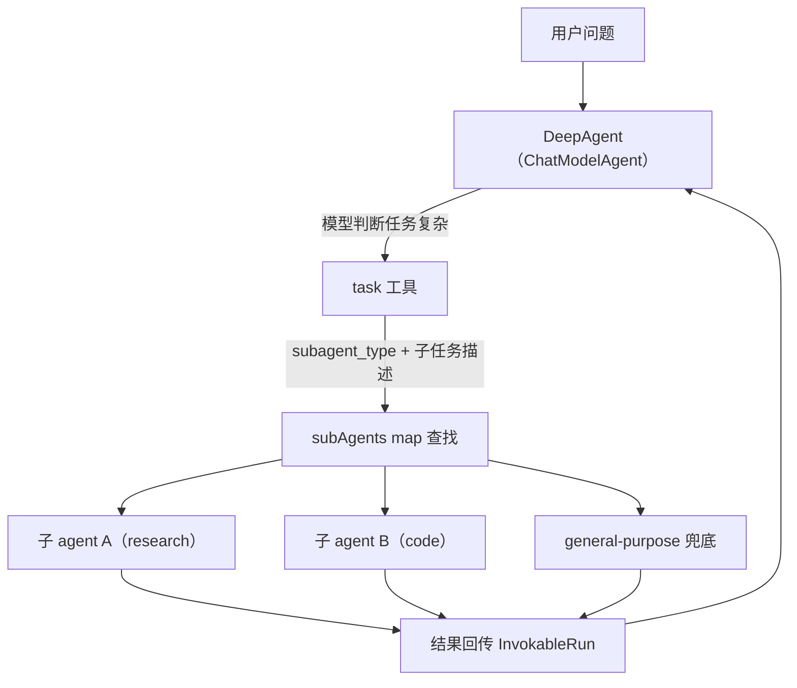

> 本文根据 Eino 子 agent 的 [机制问答](../../raw/2026-09-23-001441.md)与两个可运行示例（[AgentTool 版](../../raw/2026-09-23-001442.md)、[DeepAgent 版](../../raw/2026-09-23-001443.md)）整理。

**Eino 是用 Go 开发 agent 的框架，多 agent 是它交给开发者的一组能力。** 常见需求是让主 agent 先判断问题是否复杂，再拆成子任务下发。也许你会先想到「在运行时凭空造一个结构未知的新 agent」；Eino 的答案是「预先注册一批候选子 agent，由模型在运行时动态选型并派发」——角色在初始化阶段定义好，模型负责选和调。

## Eino 的子 agent 机制

官方推荐两套做法，其余几套都标注 NOT RECOMMENDED：

| 做法 | 形态 |
|---|---|
| `ChatModelAgent` + `AgentTool` | 把子 agent 包成普通工具，由模型按需调用 |
| `DeepAgent` | 配置 `SubAgents`，通过内置 `task` 工具按名路由 |
| `adk.SetSubAgents` / workflow agent / `supervisor`（不推荐） | 基于「共享完整上下文的 agent transfer」，建立固定父子拓扑 |

**不推荐的那几套靠固定父子拓扑触发，官方认为实践中效果不一定更好。** 推荐的两套把子 agent 包装成工具，让模型自己决定要不要调。

## agent-as-tool：把子 agent 包成普通工具

`adk.NewAgentTool`（泛型版 `adk.NewTypedAgentTool`）把任意 `Agent` 包装成 `tool.BaseTool`，塞进另一个 `ChatModelAgent` 的 `Tools` 列表，和其他工具一视同仁：

```go
agentTool := adk.NewAgentTool(ctx, subAgent) // 工具名 = subAgent.Name
parent, _ := adk.NewChatModelAgent(ctx, &adk.ChatModelAgentConfig{
    Model: cm,
    ToolsConfig: adk.ToolsConfig{
        ToolsNodeConfig: compose.ToolsNodeConfig{Tools: []tool.BaseTool{agentTool}},
    },
})
```

内层 agent 的 `name` 和 `description` 会成为工具的名字与说明，供上层模型判断何时调用。运行上还有几点约定：子 agent 的生命周期动作不会影响父 agent，只有中断会向上传播，用来支持跨边界的中断恢复；内层事件可以选择透传到外层事件流做流式展示，但不计入父 agent 的会话状态；子 agent 与父 agent 共享会话数据；也允许多层嵌套，调用链记录在 `RunPath` 里。

**这就是「动态」的落点。** `AgentTool` 只是一个普通的 `tool.BaseTool`，模型在 ReAct 循环里按需调用它，决策权在运行时，不需要提前写死谁调谁。

## DeepAgent 的 task 工具：批量封装 + 按名路由

候选有一批时，逐个包工具比较啰嗦，`DeepAgent` 把它们收进一个 `task` 工具统一路由。在 `deep.Config.SubAgents` 注册候选后，`deep.New` 会遍历列表把每个子 agent 包装好，存进一张以 `Name` 为键的 map；运行时模型只看到 `task` 一个工具，通过 `subagent_type` 指定派给谁。

```go
deepAgent, _ := deep.New(ctx, &deep.Config{
    Name:        "supervisor",
    ChatModel:   cm,
    Instruction: "Delegate each request to the right subagent via the task tool.",
    SubAgents:   []adk.Agent{researchAgent, codeAgent},
})
```

**「判断任务是否复杂」的引导写在 `task` 工具的描述里。** `taskPrompt` 告诉模型何时该用它（任务复杂、多步骤、可独立并行、需要专注推理），模型结合各子 agent 的 `Description` 自主决定要不要拆、派给谁，不是硬编码的 `if/else`。没有匹配的专业子 agent 时有内置 `general-purpose` 兜底；还可配 `write_todos` 记录拆出的子任务，示例里用 `WithoutWriteTodos` 关掉了。



## 两种写法怎么选

两个示例都先把角色（`name` / `desc` / `instruction` / `tools`）定义好，运行时按角色 `new` 出 `ChatModelAgent`；差别只在最后一步。

```go
for _, r := range roles {
    sub, _ := adk.NewChatModelAgent(ctx, &adk.ChatModelAgentConfig{
        Name: r.name, Description: r.desc, Instruction: r.instruction, Model: cm,
        ToolsConfig: adk.ToolsConfig{ToolsNodeConfig: compose.ToolsNodeConfig{Tools: r.tools}},
    })
    tools = append(tools, adk.NewAgentTool(ctx, sub)) // 或收集成 subAgents 交给 deep.New
}
```

**手动包 tool 与交给 `deep` 对模型效果等价，`deep` 只是让代码更简洁。** 前者让模型看到 N 个工具、按名直选，控制粒度最高；后者把路由、拆解引导、兜底子 agent 和待办记录一并交给框架，代价是这些能力由框架固定。

两者做的其实是同一件事：**从预先注册的候选里选型并派发，而不是在运行时造一个结构未知的全新 agent。** 子 agent 都在初始化阶段建好，模型调用工具只是触发它运行；工具数量也仍需在初始化时确定，只是可以在业务层按配置遍历构造。**真的需要在运行时生成全新 agent 结构，Eino 没有开箱支持**，得由业务层自己构造后再接入。问答与示例未附 commit 或原始 URL，文中行号以三份存档为准。

## 相关文档

- [多 Agent](index.md) — 总览 agent 产品与框架各自的做法
- [Claude Code 多 Agent：设计与使用](claude-code.md) — 产品侧的做法，其中「模型按 `description` 选型」与 Eino 的派发思路一致
- [AI Agent 面试题清单](../interview-question-checklist.md) — 本文对应第 072、076 题
