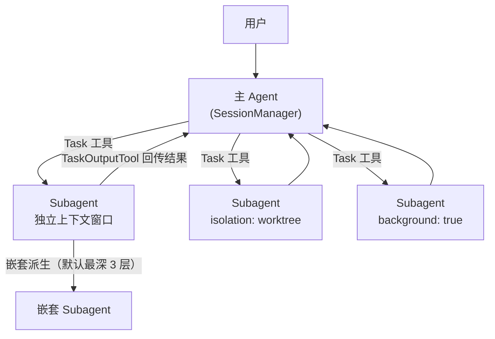
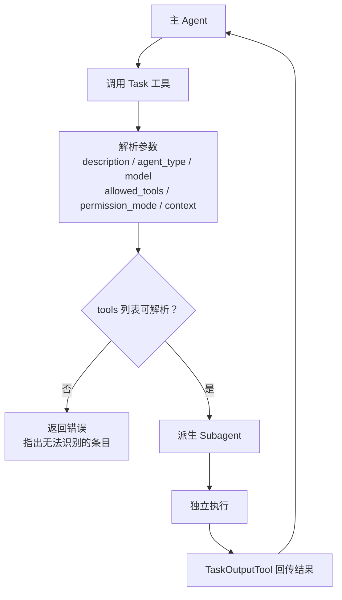
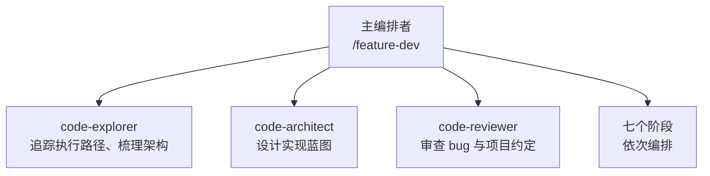
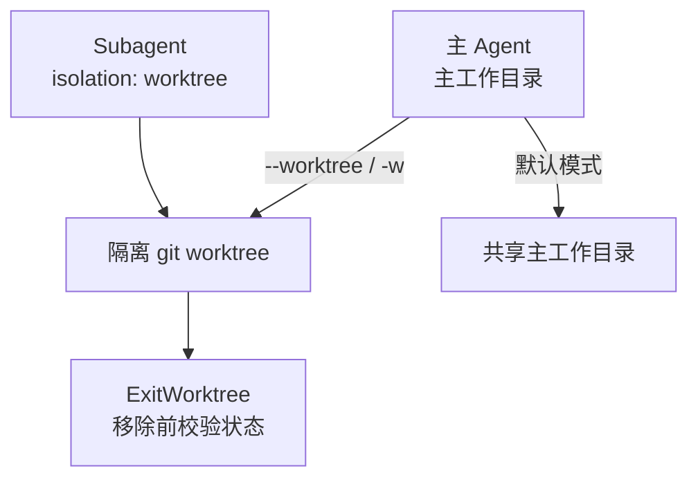

> 本文是 [DeepWiki | anthropics/claude-code/3.1-agent-system-and-subagents](https://deepwiki.com/anthropics/claude-code/3.1-agent-system-and-subagents) 一章的中文译文。

## 目的与范围

Claude Code 的 Agent 系统实现 **层级化的任务拆分**：主 agent 可以派生独立的 subagent 实例，让它们并行执行子任务，或运行在隔离的 [git worktree](../annotations/git-worktree.md) 中。每个 subagent 各自维护独立的上下文窗口、模型配置与权限范围，从而支撑复杂的多步骤工作流，同时避免主线程撞上 token 上限。

关键架构组件：

- **Task 工具：** 用于派生 subagent 的内置工具，隔离模式可配置 [CHANGELOG.md:211](https://github.com/anthropics/claude-code/blob/6ce37e9f/CHANGELOG.md?plain=1#L211-L211)
- **Worktree 隔离：** subagent 可在临时 git worktree 中运行（`isolation: worktree`）[CHANGELOG.md:218-219](https://github.com/anthropics/claude-code/blob/6ce37e9f/CHANGELOG.md?plain=1#L218-L219)
- **后台执行：** 通过 agent 定义中的 `background: true` 异步运行 [CHANGELOG.md:239-243](https://github.com/anthropics/claude-code/blob/6ce37e9f/CHANGELOG.md?plain=1#L239-L243)
- **动态工作流：** 面向数十到数百个后台 agent 的大规模编排。用户可配置 `workflowSizeGuideline`（默认 medium，即 15 个 agent）来控制编排规模 [CHANGELOG.md:13](https://github.com/anthropics/claude-code/blob/6ce37e9f/CHANGELOG.md?plain=1#L13-L13) [CHANGELOG.md:26](https://github.com/anthropics/claude-code/blob/6ce37e9f/CHANGELOG.md?plain=1#L26-L26) [CHANGELOG.md:46](https://github.com/anthropics/claude-code/blob/6ce37e9f/CHANGELOG.md?plain=1#L46-L46)
- **Agent 团队：** 实验性的多 agent 协作（需 `CLAUDE_CODE_EXPERIMENTAL_AGENT_TEAMS=1`）[CHANGELOG.md:457](https://github.com/anthropics/claude-code/blob/6ce37e9f/CHANGELOG.md?plain=1#L457-L457)

**来源：** [CHANGELOG.md:13](https://github.com/anthropics/claude-code/blob/6ce37e9f/CHANGELOG.md?plain=1#L13-L13)、[CHANGELOG.md:26](https://github.com/anthropics/claude-code/blob/6ce37e9f/CHANGELOG.md?plain=1#L26-L26)、[CHANGELOG.md:46](https://github.com/anthropics/claude-code/blob/6ce37e9f/CHANGELOG.md?plain=1#L46-L46)、[CHANGELOG.md:211](https://github.com/anthropics/claude-code/blob/6ce37e9f/CHANGELOG.md?plain=1#L211-L211)、[CHANGELOG.md:218-219](https://github.com/anthropics/claude-code/blob/6ce37e9f/CHANGELOG.md?plain=1#L218-L219)、[CHANGELOG.md:239-243](https://github.com/anthropics/claude-code/blob/6ce37e9f/CHANGELOG.md?plain=1#L239-L243)、[CHANGELOG.md:457](https://github.com/anthropics/claude-code/blob/6ce37e9f/CHANGELOG.md?plain=1#L457-L457)

## 架构总览

### Agent 层级与执行模式

主 agent（由 `SessionManager` 管理）维护与用户的主对话，subagent 则独立执行被委派的任务。每个 agent 都有自己的上下文窗口，因此一个任务的上下文占用不会影响其他任务。subagent 还能继续派生嵌套 subagent，默认最深 3 层，可用 `CLAUDE_CODE_MAX_SUBAGENT_SPAWN_DEPTH` 加以收紧 [CHANGELOG.md:32](https://github.com/anthropics/claude-code/blob/6ce37e9f/CHANGELOG.md?plain=1#L32-L32)。

**来源：** [CHANGELOG.md:32](https://github.com/anthropics/claude-code/blob/6ce37e9f/CHANGELOG.md?plain=1#L32-L32)、[CHANGELOG.md:211](https://github.com/anthropics/claude-code/blob/6ce37e9f/CHANGELOG.md?plain=1#L211-L211)、[CHANGELOG.md:218-219](https://github.com/anthropics/claude-code/blob/6ce37e9f/CHANGELOG.md?plain=1#L218-L219)、[CHANGELOG.md:239-243](https://github.com/anthropics/claude-code/blob/6ce37e9f/CHANGELOG.md?plain=1#L239-L243)、[CHANGELOG.md:547](https://github.com/anthropics/claude-code/blob/6ce37e9f/CHANGELOG.md?plain=1#L547-L547)

### 执行模式

| 模式 | 工作目录 | 适用场景 |
|------|----------|----------|
| 默认 | 与主 agent 共享 | 简单的并行任务 |
| `isolation: worktree` | 临时 git worktree | 需要文件隔离、并行分支的任务 |
| `background: true` | 以上任一模式 | 非阻塞执行、长时间运行的任务 |

**来源：** [CHANGELOG.md:218-219](https://github.com/anthropics/claude-code/blob/6ce37e9f/CHANGELOG.md?plain=1#L218-L219)、[CHANGELOG.md:239-243](https://github.com/anthropics/claude-code/blob/6ce37e9f/CHANGELOG.md?plain=1#L239-L243)

## 用 Task 工具创建 Subagent

### 基本调用

主 agent 通过调用 `Task` 工具并传入任务参数来创建 subagent。subagent 独立执行，并经 `TaskOutputTool` 回传结果 [CHANGELOG.md:211](https://github.com/anthropics/claude-code/blob/6ce37e9f/CHANGELOG.md?plain=1#L211-L211)。如果 subagent 的 `tools` 列表解析后为空，`Task` 工具会返回一个明确的错误，指出那些无法识别的条目 [CHANGELOG.md:30](https://github.com/anthropics/claude-code/blob/6ce37e9f/CHANGELOG.md?plain=1#L30-L30)。

**来源：** [CHANGELOG.md:30](https://github.com/anthropics/claude-code/blob/6ce37e9f/CHANGELOG.md?plain=1#L30-L30)、[CHANGELOG.md:211](https://github.com/anthropics/claude-code/blob/6ce37e9f/CHANGELOG.md?plain=1#L211-L211)、[CHANGELOG.md:218-219](https://github.com/anthropics/claude-code/blob/6ce37e9f/CHANGELOG.md?plain=1#L218-L219)、[CHANGELOG.md:439-441](https://github.com/anthropics/claude-code/blob/6ce37e9f/CHANGELOG.md?plain=1#L439-L441)

### Task 工具参数

主 agent 调用 `Task` 工具时，可在工具调用中指定以下参数：

| 参数 | 说明 |
|------|------|
| `description` | 自然语言的任务描述 [CHANGELOG.md:439](https://github.com/anthropics/claude-code/blob/6ce37e9f/CHANGELOG.md?plain=1#L439-L439) |
| `agent_type` | 要使用的具体 agent 档案。解析时不区分大小写（例如 `"Code Reviewer"` 解析为 `code-reviewer`）[CHANGELOG.md:5](https://github.com/anthropics/claude-code/blob/6ce37e9f/CHANGELOG.md?plain=1#L5-L5) [CHANGELOG.md:439](https://github.com/anthropics/claude-code/blob/6ce37e9f/CHANGELOG.md?plain=1#L439-L439) |
| `model` | 覆盖 subagent 使用的模型 [CHANGELOG.md:439](https://github.com/anthropics/claude-code/blob/6ce37e9f/CHANGELOG.md?plain=1#L439-L439) |
| `allowed_tools` | 允许使用的工具子集 [CHANGELOG.md:439](https://github.com/anthropics/claude-code/blob/6ce37e9f/CHANGELOG.md?plain=1#L439-L439) |
| `permission_mode` | 覆盖权限行为 [CHANGELOG.md:439](https://github.com/anthropics/claude-code/blob/6ce37e9f/CHANGELOG.md?plain=1#L439-L439) |
| `context` | 上下文继承模式（例如 `fork`）[CHANGELOG.md:439](https://github.com/anthropics/claude-code/blob/6ce37e9f/CHANGELOG.md?plain=1#L439-L439) |

**来源：** [CHANGELOG.md:5](https://github.com/anthropics/claude-code/blob/6ce37e9f/CHANGELOG.md?plain=1#L5-L5)、[CHANGELOG.md:439-441](https://github.com/anthropics/claude-code/blob/6ce37e9f/CHANGELOG.md?plain=1#L439-L441)

### Agent 类型限制

可以用 `Task(agent_type)` 语法，在配置中或 agent 定义内限制特定的 agent 类型，从而约束哪些 subagent 可被派生 [CHANGELOG.md:439-441](https://github.com/anthropics/claude-code/blob/6ce37e9f/CHANGELOG.md?plain=1#L439-L441)。经 `SendMessage` 恢复的 subagent 会正确恢复其最初派生时显式指定的 `cwd` [CHANGELOG.md:38](https://github.com/anthropics/claude-code/blob/6ce37e9f/CHANGELOG.md?plain=1#L38-L38)。

**来源：** [CHANGELOG.md:38](https://github.com/anthropics/claude-code/blob/6ce37e9f/CHANGELOG.md?plain=1#L38-L38)、[CHANGELOG.md:439-441](https://github.com/anthropics/claude-code/blob/6ce37e9f/CHANGELOG.md?plain=1#L439-L441)

## Agent 配置

### Agent 定义文件

Agent 定义存放在带 frontmatter 的 `.claude/agents/*.md` 文件中，可以位于用户级（`~/.claude/agents/`）、项目级（`.claude/agents/`），或经插件分发 [CHANGELOG.md:28](https://github.com/anthropics/claude-code/blob/6ce37e9f/CHANGELOG.md?plain=1#L28-L28) [CHANGELOG.md:280-281](https://github.com/anthropics/claude-code/blob/6ce37e9f/CHANGELOG.md?plain=1#L280-L281)。

**Agent 定义示例（Code Explorer）：** [plugins/feature-dev/agents/code-explorer.md:1-7](https://github.com/anthropics/claude-code/blob/6ce37e9f/plugins/feature-dev/agents/code-explorer.md?plain=1#L1-L7)

**Agent frontmatter 字段：**

| 字段 | 说明 |
|------|------|
| `name` | Agent 标识符 [CHANGELOG.md:439](https://github.com/anthropics/claude-code/blob/6ce37e9f/CHANGELOG.md?plain=1#L439-L439) |
| `description` | 人类可读的描述 [CHANGELOG.md:439](https://github.com/anthropics/claude-code/blob/6ce37e9f/CHANGELOG.md?plain=1#L439-L439) |
| `model` | 该 agent 的默认模型 [CHANGELOG.md:439](https://github.com/anthropics/claude-code/blob/6ce37e9f/CHANGELOG.md?plain=1#L439-L439) |
| `tools` | 受限的允许工具集合 [CHANGELOG.md:439](https://github.com/anthropics/claude-code/blob/6ce37e9f/CHANGELOG.md?plain=1#L439-L439) |
| `memory` | 持久记忆范围（`user`、`project`、`local`）[CHANGELOG.md:439](https://github.com/anthropics/claude-code/blob/6ce37e9f/CHANGELOG.md?plain=1#L439-L439) |
| `isolation` | 执行隔离模式（`worktree`）[CHANGELOG.md:218](https://github.com/anthropics/claude-code/blob/6ce37e9f/CHANGELOG.md?plain=1#L218-L218) |
| `background` | 始终作为后台任务运行 [CHANGELOG.md:239](https://github.com/anthropics/claude-code/blob/6ce37e9f/CHANGELOG.md?plain=1#L239-L239) |
| `effort` | 对支持的模型设置推理投入等级 [CHANGELOG.md:28](https://github.com/anthropics/claude-code/blob/6ce37e9f/CHANGELOG.md?plain=1#L28-L28) |
| `maxTurns` | 允许的最大对话轮数 [CHANGELOG.md:28](https://github.com/anthropics/claude-code/blob/6ce37e9f/CHANGELOG.md?plain=1#L28-L28) |
| `disallowedTools` | 明确禁止该 agent 使用的工具 [CHANGELOG.md:28](https://github.com/anthropics/claude-code/blob/6ce37e9f/CHANGELOG.md?plain=1#L28-L28) |
| `mcpServers` | 为该 agent 加载的 MCP 服务器 [CHANGELOG.md:43](https://github.com/anthropics/claude-code/blob/6ce37e9f/CHANGELOG.md?plain=1#L43-L43) |

**来源：** [CHANGELOG.md:28](https://github.com/anthropics/claude-code/blob/6ce37e9f/CHANGELOG.md?plain=1#L28-L28)、[CHANGELOG.md:43](https://github.com/anthropics/claude-code/blob/6ce37e9f/CHANGELOG.md?plain=1#L43-L43)、[CHANGELOG.md:218](https://github.com/anthropics/claude-code/blob/6ce37e9f/CHANGELOG.md?plain=1#L218-L218)、[CHANGELOG.md:239](https://github.com/anthropics/claude-code/blob/6ce37e9f/CHANGELOG.md?plain=1#L239-L239)、[CHANGELOG.md:280-281](https://github.com/anthropics/claude-code/blob/6ce37e9f/CHANGELOG.md?plain=1#L280-L281)、[CHANGELOG.md:439-441](https://github.com/anthropics/claude-code/blob/6ce37e9f/CHANGELOG.md?plain=1#L439-L441)、[plugins/feature-dev/agents/code-explorer.md:1-7](https://github.com/anthropics/claude-code/blob/6ce37e9f/plugins/feature-dev/agents/code-explorer.md?plain=1#L1-L7)

## Subagent 生命周期

### 后台执行

Subagent 可以在后台运行，让主 agent 继续接收用户输入。

- **自动转后台：** 当 subagent 不需要用户输入时发生 [CHANGELOG.md:284](https://github.com/anthropics/claude-code/blob/6ce37e9f/CHANGELOG.md?plain=1#L284-L284)
- **手动转后台：** 用户可以用 `Ctrl+B`（原为 `Ctrl+F`）把活跃 agent 转入后台 [CHANGELOG.md:56](https://github.com/anthropics/claude-code/blob/6ce37e9f/CHANGELOG.md?plain=1#L56-L56) [CHANGELOG.md:245](https://github.com/anthropics/claude-code/blob/6ce37e9f/CHANGELOG.md?plain=1#L245-L245)
- **监控：** 可通过 agent 视图监控后台任务，它列出运行中、阻塞或已完成的会话 [CHANGELOG.md:21](https://github.com/anthropics/claude-code/blob/6ce37e9f/CHANGELOG.md?plain=1#L21-L21)。已完成的会话会一直保留在 `/tasks` 中直到被清理 [CHANGELOG.md:45](https://github.com/anthropics/claude-code/blob/6ce37e9f/CHANGELOG.md?plain=1#L45-L45)
- **持久化：** 后台会话数据在守护进程重启与更新后仍被保留 [CHANGELOG.md:29-30](https://github.com/anthropics/claude-code/blob/6ce37e9f/CHANGELOG.md?plain=1#L29-L30) [CHANGELOG.md:42-43](https://github.com/anthropics/claude-code/blob/6ce37e9f/CHANGELOG.md?plain=1#L42-L43)。因重启而被杀掉的 worker，会在下次打开 agent 视图时自动恢复 [CHANGELOG.md:30](https://github.com/anthropics/claude-code/blob/6ce37e9f/CHANGELOG.md?plain=1#L30-L30)
- **追踪：** subagent 发出的 API 请求带有 `x-claude-code-agent-id` 与 `x-claude-code-parent-agent-id` 头 [CHANGELOG.md:36](https://github.com/anthropics/claude-code/blob/6ce37e9f/CHANGELOG.md?plain=1#L36-L36)。当设置 `--forward-subagent-text` 时，深度 2 及更深派生的 subagent 会出现在 `stream-json` 中 [CHANGELOG.md:14](https://github.com/anthropics/claude-code/blob/6ce37e9f/CHANGELOG.md?plain=1#L14-L14)
- **清理：** `.claude/worktrees/` 下的后台会话 worktree 会在 30 天作业保留清理后自动删除 [CHANGELOG.md:26](https://github.com/anthropics/claude-code/blob/6ce37e9f/CHANGELOG.md?plain=1#L26-L26)
- **错峰：** 工作流的 fan-out 会让同前缀的兄弟 agent 错峰启动，以优化 prompt 缓存（`CLAUDE_CODE_WORKFLOW_PREFIX_STAGGER_MS`）[CHANGELOG.md:28](https://github.com/anthropics/claude-code/blob/6ce37e9f/CHANGELOG.md?plain=1#L28-L28)
- **恢复的 subagent：** 恢复 subagent 与 teammate 时，不再重新渲染它们已加载的 MCP 工具定义，从而修复了该 agent 的 prompt 缓存 [CHANGELOG.md:52](https://github.com/anthropics/claude-code/blob/6ce37e9f/CHANGELOG.md?plain=1#L52-L52)

**来源：** [CHANGELOG.md:14](https://github.com/anthropics/claude-code/blob/6ce37e9f/CHANGELOG.md?plain=1#L14-L14)、[CHANGELOG.md:21](https://github.com/anthropics/claude-code/blob/6ce37e9f/CHANGELOG.md?plain=1#L21-L21)、[CHANGELOG.md:26-30](https://github.com/anthropics/claude-code/blob/6ce37e9f/CHANGELOG.md?plain=1#L26-L30)、[CHANGELOG.md:36](https://github.com/anthropics/claude-code/blob/6ce37e9f/CHANGELOG.md?plain=1#L36-L36)、[CHANGELOG.md:42-43](https://github.com/anthropics/claude-code/blob/6ce37e9f/CHANGELOG.md?plain=1#L42-L43)、[CHANGELOG.md:45](https://github.com/anthropics/claude-code/blob/6ce37e9f/CHANGELOG.md?plain=1#L45-L45)、[CHANGELOG.md:52](https://github.com/anthropics/claude-code/blob/6ce37e9f/CHANGELOG.md?plain=1#L52-L52)、[CHANGELOG.md:56](https://github.com/anthropics/claude-code/blob/6ce37e9f/CHANGELOG.md?plain=1#L56-L56)、[CHANGELOG.md:245](https://github.com/anthropics/claude-code/blob/6ce37e9f/CHANGELOG.md?plain=1#L245-L245)、[CHANGELOG.md:284](https://github.com/anthropics/claude-code/blob/6ce37e9f/CHANGELOG.md?plain=1#L284-L284)

### 生命周期 Hook

有若干 Hook 会在 subagent 生命周期的不同时点触发：

| Hook 事件 | 触发时机 |
|-----------|----------|
| `SessionStart` | Subagent 初始化 [CHANGELOG.md:15](https://github.com/anthropics/claude-code/blob/6ce37e9f/CHANGELOG.md?plain=1#L15-L15) |
| `WorktreeCreate` | worktree 创建之后 [CHANGELOG.md:71](https://github.com/anthropics/claude-code/blob/6ce37e9f/CHANGELOG.md?plain=1#L71-L71) |
| `DirectoryAdded` | 会话中途执行 `/add-dir` 或 SDK 的 `register_repo_root` 之后 [CHANGELOG.md:11](https://github.com/anthropics/claude-code/blob/6ce37e9f/CHANGELOG.md?plain=1#L11-L11) |
| `PreToolUse` | 工具调用之前 [CHANGELOG.md:60](https://github.com/anthropics/claude-code/blob/6ce37e9f/CHANGELOG.md?plain=1#L60-L60) |
| `PostToolUse` | 工具执行之后 [CHANGELOG.md:60](https://github.com/anthropics/claude-code/blob/6ce37e9f/CHANGELOG.md?plain=1#L60-L60) |
| `TeammateIdle` | teammate 等待工作 [CHANGELOG.md:288](https://github.com/anthropics/claude-code/blob/6ce37e9f/CHANGELOG.md?plain=1#L288-L288) |
| `TaskCompleted` | 任务完成 [CHANGELOG.md:211](https://github.com/anthropics/claude-code/blob/6ce37e9f/CHANGELOG.md?plain=1#L211-L211) |
| `SubagentStop` | subagent 停止执行时触发 [CHANGELOG.md:29-30](https://github.com/anthropics/claude-code/blob/6ce37e9f/CHANGELOG.md?plain=1#L29-L30) |
| `SessionEnd` | 会话终止 [CHANGELOG.md:15](https://github.com/anthropics/claude-code/blob/6ce37e9f/CHANGELOG.md?plain=1#L15-L15) |

**来源：** [CHANGELOG.md:11](https://github.com/anthropics/claude-code/blob/6ce37e9f/CHANGELOG.md?plain=1#L11-L11)、[CHANGELOG.md:15](https://github.com/anthropics/claude-code/blob/6ce37e9f/CHANGELOG.md?plain=1#L15-L15)、[CHANGELOG.md:29-30](https://github.com/anthropics/claude-code/blob/6ce37e9f/CHANGELOG.md?plain=1#L29-L30)、[CHANGELOG.md:60](https://github.com/anthropics/claude-code/blob/6ce37e9f/CHANGELOG.md?plain=1#L60-L60)、[CHANGELOG.md:71](https://github.com/anthropics/claude-code/blob/6ce37e9f/CHANGELOG.md?plain=1#L71-L71)、[CHANGELOG.md:211](https://github.com/anthropics/claude-code/blob/6ce37e9f/CHANGELOG.md?plain=1#L211-L211)、[CHANGELOG.md:288](https://github.com/anthropics/claude-code/blob/6ce37e9f/CHANGELOG.md?plain=1#L288-L288)

## 多 Agent 工作流（Feature Development）

Feature Development 插件给出了 agent 团队执行模型的一个具体例子：它用一个主编排者（orchestrator）通过七个不同阶段管理各专用 subagent [plugins/feature-dev/commands/feature-dev.md:20-124](https://github.com/anthropics/claude-code/blob/6ce37e9f/plugins/feature-dev/commands/feature-dev.md?plain=1#L20-L124)。

**来源：** [plugins/feature-dev/commands/feature-dev.md:41-51](https://github.com/anthropics/claude-code/blob/6ce37e9f/plugins/feature-dev/commands/feature-dev.md?plain=1#L41-L51)、[plugins/feature-dev/commands/feature-dev.md:78-80](https://github.com/anthropics/claude-code/blob/6ce37e9f/plugins/feature-dev/commands/feature-dev.md?plain=1#L78-L80)、[plugins/feature-dev/commands/feature-dev.md:106-107](https://github.com/anthropics/claude-code/blob/6ce37e9f/plugins/feature-dev/commands/feature-dev.md?plain=1#L106-L107)

### 专用 Agent 角色

| Agent 类型 | 角色 | 关键工具 |
|------------|------|----------|
| `code-explorer` | 追踪执行路径并梳理架构 [plugins/feature-dev/agents/code-explorer.md:3](https://github.com/anthropics/claude-code/blob/6ce37e9f/plugins/feature-dev/agents/code-explorer.md?plain=1#L3-L3) | Glob、Grep、LS、Read、NotebookRead [plugins/feature-dev/agents/code-explorer.md:4](https://github.com/anthropics/claude-code/blob/6ce37e9f/plugins/feature-dev/agents/code-explorer.md?plain=1#L4-L4) |
| `code-architect` | 设计功能实现蓝图 [plugins/feature-dev/agents/code-architect.md:3](https://github.com/anthropics/claude-code/blob/6ce37e9f/plugins/feature-dev/agents/code-architect.md?plain=1#L3-L3) | Glob、Grep、LS、Read、NotebookRead [plugins/feature-dev/agents/code-architect.md:4](https://github.com/anthropics/claude-code/blob/6ce37e9f/plugins/feature-dev/agents/code-architect.md?plain=1#L4-L4) |
| `code-reviewer` | 审查代码的 bug 与项目约定 [plugins/feature-dev/agents/code-reviewer.md:3](https://github.com/anthropics/claude-code/blob/6ce37e9f/plugins/feature-dev/agents/code-reviewer.md?plain=1#L3-L3) | Glob、Grep、LS、Read、NotebookRead [plugins/feature-dev/agents/code-reviewer.md:4](https://github.com/anthropics/claude-code/blob/6ce37e9f/plugins/feature-dev/agents/code-reviewer.md?plain=1#L4-L4) |

**来源：** [plugins/feature-dev/agents/code-explorer.md:3-4](https://github.com/anthropics/claude-code/blob/6ce37e9f/plugins/feature-dev/agents/code-explorer.md?plain=1#L3-L4)、[plugins/feature-dev/agents/code-architect.md:3-4](https://github.com/anthropics/claude-code/blob/6ce37e9f/plugins/feature-dev/agents/code-architect.md?plain=1#L3-L4)、[plugins/feature-dev/agents/code-reviewer.md:3-4](https://github.com/anthropics/claude-code/blob/6ce37e9f/plugins/feature-dev/agents/code-reviewer.md?plain=1#L3-L4)

## Worktree 隔离

Subagent 可以在隔离的 [git worktree](../annotations/git-worktree.md) 中运行，以免对主工作目录产生副作用。

**来源：** [CHANGELOG.md:211](https://github.com/anthropics/claude-code/blob/6ce37e9f/CHANGELOG.md?plain=1#L211-L211)、[CHANGELOG.md:218-219](https://github.com/anthropics/claude-code/blob/6ce37e9f/CHANGELOG.md?plain=1#L218-L219)、[CHANGELOG.md:239-240](https://github.com/anthropics/claude-code/blob/6ce37e9f/CHANGELOG.md?plain=1#L239-L240)

### Worktree 配置与用法

- **开关：** 用 `--worktree` 或 `-w` 在隔离 worktree 中启动 Claude [CHANGELOG.md:239-240](https://github.com/anthropics/claude-code/blob/6ce37e9f/CHANGELOG.md?plain=1#L239-L240)
- **状态：** 状态行会显示 worktree 的名称与路径 [CHANGELOG.md:19](https://github.com/anthropics/claude-code/blob/6ce37e9f/CHANGELOG.md?plain=1#L19-L19)
- **安全：** `ExitWorktree` 在移除前会校验 worktree 状态 [CHANGELOG.md:55](https://github.com/anthropics/claude-code/blob/6ce37e9f/CHANGELOG.md?plain=1#L55-L55)
- **管理：** 在 Agent View 中，`Ctrl+X` 会删除重命名分支的 worktree，但保留未推送的提交 [CHANGELOG.md:48](https://github.com/anthropics/claude-code/blob/6ce37e9f/CHANGELOG.md?plain=1#L48-L48)
- **未跟踪的 Skill：** 即使 `.claude/skills` 未被版本控制，主仓库的项目 skill 现在也能在 `--worktree` 会话中正确加载 [CHANGELOG.md:50](https://github.com/anthropics/claude-code/blob/6ce37e9f/CHANGELOG.md?plain=1#L50-L50)

**来源：** [CHANGELOG.md:19](https://github.com/anthropics/claude-code/blob/6ce37e9f/CHANGELOG.md?plain=1#L19-L19)、[CHANGELOG.md:48](https://github.com/anthropics/claude-code/blob/6ce37e9f/CHANGELOG.md?plain=1#L48-L48)、[CHANGELOG.md:50](https://github.com/anthropics/claude-code/blob/6ce37e9f/CHANGELOG.md?plain=1#L50-L50)、[CHANGELOG.md:55](https://github.com/anthropics/claude-code/blob/6ce37e9f/CHANGELOG.md?plain=1#L55-L55)、[CHANGELOG.md:239-240](https://github.com/anthropics/claude-code/blob/6ce37e9f/CHANGELOG.md?plain=1#L239-L240)

## 上下文与记忆管理

### 独立上下文窗口

每个 subagent 维护一个完全独立的上下文窗口。自动压缩在上下文窗口达到 98% 时触发 [CHANGELOG.md:547](https://github.com/anthropics/claude-code/blob/6ce37e9f/CHANGELOG.md?plain=1#L547-L547)。subagent 可以用 `_meta["anthropic/maxResultSizeChars"]` 覆盖结果持久化的上限 [CHANGELOG.md:29](https://github.com/anthropics/claude-code/blob/6ce37e9f/CHANGELOG.md?plain=1#L29-L29)。

### 上下文继承

主 agent 可以用 `Task` 工具的 `context` 参数把特定上下文传给 subagent。使用 `context: fork` 的 skill 允许 subagent 继承父级当前上下文 [CHANGELOG.md:42](https://github.com/anthropics/claude-code/blob/6ce37e9f/CHANGELOG.md?plain=1#L42-L42)。当恢复那些从大对话中派生过后台 agent 的会话时，内存占用会降低 [CHANGELOG.md:44](https://github.com/anthropics/claude-code/blob/6ce37e9f/CHANGELOG.md?plain=1#L44-L44)。

**来源：** [CHANGELOG.md:29](https://github.com/anthropics/claude-code/blob/6ce37e9f/CHANGELOG.md?plain=1#L29-L29)、[CHANGELOG.md:42](https://github.com/anthropics/claude-code/blob/6ce37e9f/CHANGELOG.md?plain=1#L42-L42)、[CHANGELOG.md:44](https://github.com/anthropics/claude-code/blob/6ce37e9f/CHANGELOG.md?plain=1#L44-L44)、[CHANGELOG.md:547](https://github.com/anthropics/claude-code/blob/6ce37e9f/CHANGELOG.md?plain=1#L547-L547)、[plugins/feature-dev/commands/feature-dev.md:14-15](https://github.com/anthropics/claude-code/blob/6ce37e9f/plugins/feature-dev/commands/feature-dev.md?plain=1#L14-L15)

## See Also

- [Claude Code 核心系统](index.md)
- [多 Agent 设计对比：Crush / Codex / Claude Code / Eino](../ai-agent/multi-agent-design.md)
- [任务拆分与规划](../ai-agent/task-planning.md)
