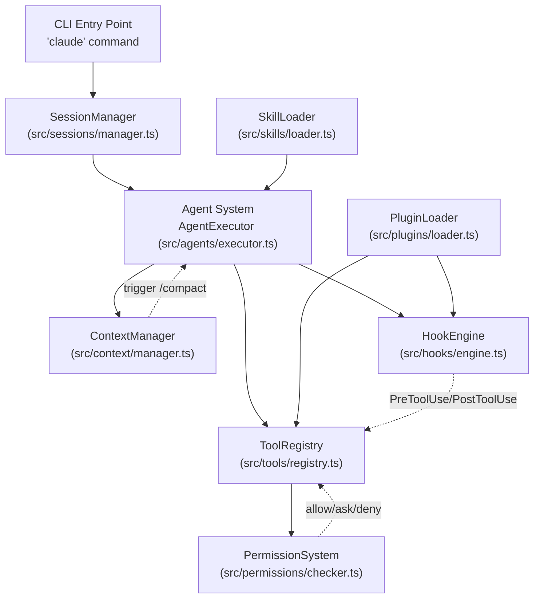
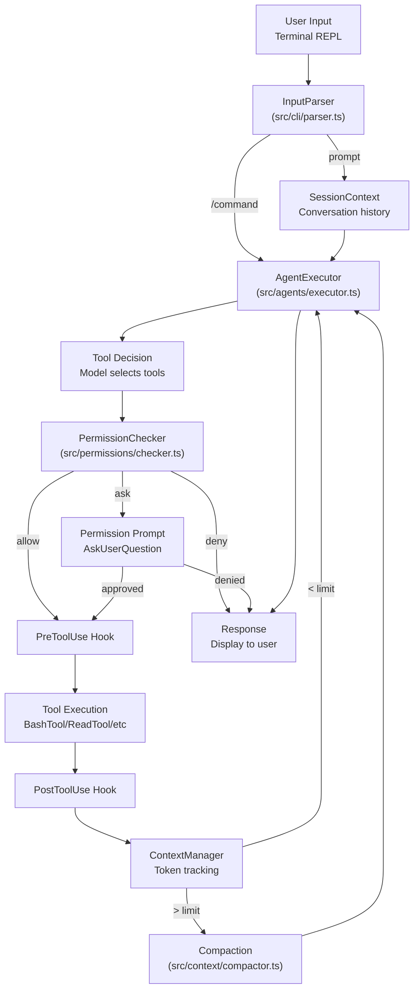

## 概述

本文是 DeepWiki 对 `anthropics/claude-code` 仓库《Core Systems》一章的中文译文。原文基于 `CHANGELOG.md` 等源码文件，介绍 Claude Code 的内部架构及其各核心子系统：Agent 系统、工具系统、权限系统、上下文窗口管理、Hook 系统、MCP 集成、插件系统、Skill 系统、沙箱环境，以及 UI/终端集成。文章先给出整体架构与请求处理流程，再逐一说明每个子系统的职责、关键配置与近期变更。

面向用户的使用与配置文档见 [Configuration Management](https://deepwiki.com/anthropics/claude-code/2.2-configuration-management) 与 [CLI Commands & Interaction Modes](https://deepwiki.com/anthropics/claude-code/2.3-cli-commands-and-interaction-modes)；各子系统的细节见下文各节列出的子页面。

## 架构总览

Claude Code 的架构围绕若干核心子系统组织，它们协同工作以提供 agentic 编程体验。系统采用分层方式：CLI 界面把用户输入经由会话管理路由到 Agent 系统，后者在权限控制下编排工具执行，同时管理上下文窗口并触发生命周期 Hook。

### 系统架构图

下图把用户意图所在的「自然语言空间」（Natural Language Space）与「代码实体空间」（Code Entity Space）对应起来，展示各核心组件如何交互。

**来源：** [CHANGELOG.md:16-17](https://github.com/anthropics/claude-code/blob/6ce37e9f/CHANGELOG.md?plain=1#L16-L17)、[CHANGELOG.md:28-30](https://github.com/anthropics/claude-code/blob/6ce37e9f/CHANGELOG.md?plain=1#L28-L30)

### 核心系统职责

| 系统 | 主要职责 | 关键配置 |
|--------|----------------------|-------------------|
| Agent 系统 | 执行用户请求、派生 subagent、管理任务生命周期 | `settings.json` 的 `agent` 字段 |
| 工具系统 | 提供能力（bash、文件操作、MCP） | `settings.json` 的 `disallowedTools` |
| 权限系统 | 用 allow/ask/deny 规则控制工具执行 | `settings.json` 权限规则 |
| 上下文管理器 | 跟踪 token 用量、触发自动压缩 | 上下文窗口上限 |
| Hook 系统 | 在生命周期事件注入自定义行为 | `.claude/hooks/*.py`、插件 Hook |
| 插件系统 | 发现并加载扩展 | `marketplace.json`、`plugin.json` |
| Skill 系统 | 加载自定义斜杠命令 | `.claude/skills/` |
| MCP 集成 | 连接外部工具服务器 | `.mcp.json` |

**来源：** [CHANGELOG.md:28-30](https://github.com/anthropics/claude-code/blob/6ce37e9f/CHANGELOG.md?plain=1#L28-L30)、[CHANGELOG.md:39-41](https://github.com/anthropics/claude-code/blob/6ce37e9f/CHANGELOG.md?plain=1#L39-L41)、[CHANGELOG.md:52-53](https://github.com/anthropics/claude-code/blob/6ce37e9f/CHANGELOG.md?plain=1#L52-L53)

## 请求处理流程

下图展示一条用户消息如何流经 Claude Code 的核心系统，从输入到执行。它把自然语言概念映射到实际执行路径。

**来源：** [CHANGELOG.md:13-14](https://github.com/anthropics/claude-code/blob/6ce37e9f/CHANGELOG.md?plain=1#L13-L14)、[CHANGELOG.md:19-22](https://github.com/anthropics/claude-code/blob/6ce37e9f/CHANGELOG.md?plain=1#L19-L22)、[CHANGELOG.md:40-44](https://github.com/anthropics/claude-code/blob/6ce37e9f/CHANGELOG.md?plain=1#L40-L44)

## 系统组件详解

### Agent 系统

Agent 系统编排所有由 AI 驱动的操作，包括为并行工作派生 subagent，以及管理后台任务。

**关键特性：**

- **Subagents（子 agent）：** 通过 `Task` 工具管理。subagent 可以错峰启动，以通过 `CLAUDE_CODE_WORKFLOW_PREFIX_STAGGER_MS` 优化 prompt 缓存 [CHANGELOG.md:28-28](https://github.com/anthropics/claude-code/blob/6ce37e9f/CHANGELOG.md?plain=1#L28-L28)
- **远程控制：** 支持 `claude remote-control --continue` 恢复会话，并在 `ListAgents` 中把断开的会话标记为 `offline` [CHANGELOG.md:5-9](https://github.com/anthropics/claude-code/blob/6ce37e9f/CHANGELOG.md?plain=1#L5-L9)
- **云端会话：** 在 agent 列表中区分本地会话与云端托管的会话 [CHANGELOG.md:9-9](https://github.com/anthropics/claude-code/blob/6ce37e9f/CHANGELOG.md?plain=1#L9-L9)
- **恢复的 subagent：** 修复了恢复 subagent 和 teammate 时会重新渲染其 MCP 工具定义、破坏 prompt 缓存的问题 [CHANGELOG.md:52-52](https://github.com/anthropics/claude-code/blob/6ce37e9f/CHANGELOG.md?plain=1#L52-L52)

详见 [Agent System & Subagents](https://deepwiki.com/anthropics/claude-code/3.1-agent-system-and-subagents)。

**来源：** [CHANGELOG.md:5-9](https://github.com/anthropics/claude-code/blob/6ce37e9f/CHANGELOG.md?plain=1#L5-L9)、[CHANGELOG.md:28-28](https://github.com/anthropics/claude-code/blob/6ce37e9f/CHANGELOG.md?plain=1#L28-L28)、[CHANGELOG.md:52-52](https://github.com/anthropics/claude-code/blob/6ce37e9f/CHANGELOG.md?plain=1#L52-L52)

### 工具系统

工具为 Claude 提供与环境交互的能力。系统包含内置工具，并通过 MCP 支持外部工具。

**内置工具：**

- **Bash：** 已加固以处理网络域名列表中的 IPv6 字面量 [CHANGELOG.md:30-30](https://github.com/anthropics/claude-code/blob/6ce37e9f/CHANGELOG.md?plain=1#L30-L30)。git/gh 命令中的 `--force`、`--amend` 等危险 flag 不再被自动批准 [CHANGELOG.md:32-32](https://github.com/anthropics/claude-code/blob/6ce37e9f/CHANGELOG.md?plain=1#L32-L32)
- **文件操作：** `Write` 工具允许较新的模型在未事先读取的情况下覆盖文件，与 `Edit` 工具规则一致 [CHANGELOG.md:56-56](https://github.com/anthropics/claude-code/blob/6ce37e9f/CHANGELOG.md?plain=1#L56-L56)。修复了目标路径是已存在目录时 `Write` 工具静默地把该轮当作「权限被拒绝」结束的问题；现在会报出清晰错误 [CHANGELOG.md:17-17](https://github.com/anthropics/claude-code/blob/6ce37e9f/CHANGELOG.md?plain=1#L17-L17)
- **路径处理：** 修复了非字符串 `glob`/`file_path` 值以及 Windows 上扩展长度/UNC 路径导致的崩溃 [CHANGELOG.md:11-13](https://github.com/anthropics/claude-code/blob/6ce37e9f/CHANGELOG.md?plain=1#L11-L13)。修复了工具调用的文件路径含以转义序列写成的 `\u0000` 时，该轮提前以 "Path contains null bytes" 结束的问题；转义的控制字符现在保持为字面文本 [CHANGELOG.md:20-20](https://github.com/anthropics/claude-code/blob/6ce37e9f/CHANGELOG.md?plain=1#L20-L20)
- **Edit 工具：** 修复了 `Edit` 工具把「转义反斜杠 + `uXXXX` 文本」误当作 `\uXXXX` 转义的问题 [CHANGELOG.md:18-18](https://github.com/anthropics/claude-code/blob/6ce37e9f/CHANGELOG.md?plain=1#L18-L18)。修复了大型不匹配编辑时报 "Invalid regular expression: regular expression too large" 而非 "String not found in file" 的问题 [CHANGELOG.md:19-19](https://github.com/anthropics/claude-code/blob/6ce37e9f/CHANGELOG.md?plain=1#L19-L19)
- **Grep 与 Glob：** 修复了因系统资源耗尽而无法启动搜索时这两个工具报告「无匹配」的问题；现在会返回错误 [CHANGELOG.md:16-16](https://github.com/anthropics/claude-code/blob/6ce37e9f/CHANGELOG.md?plain=1#L16-L16)

详见 [Tool System & Permissions](https://deepwiki.com/anthropics/claude-code/3.2-tool-system-and-permissions)。

**来源：** [CHANGELOG.md:11-13](https://github.com/anthropics/claude-code/blob/6ce37e9f/CHANGELOG.md?plain=1#L11-L13)、[CHANGELOG.md:16-20](https://github.com/anthropics/claude-code/blob/6ce37e9f/CHANGELOG.md?plain=1#L16-L20)、[CHANGELOG.md:30-32](https://github.com/anthropics/claude-code/blob/6ce37e9f/CHANGELOG.md?plain=1#L30-L32)、[CHANGELOG.md:56-56](https://github.com/anthropics/claude-code/blob/6ce37e9f/CHANGELOG.md?plain=1#L56-L56)

### 权限系统

权限系统通过把工具调用与 allow/ask/deny 动作匹配的规则来控制工具执行。

**规则执行：**

- **自动批准：** 对危险的 git/gh 操作加以限制 [CHANGELOG.md:32-32](https://github.com/anthropics/claude-code/blob/6ce37e9f/CHANGELOG.md?plain=1#L32-L32)
- **归属头：** 修复了通过 `CLAUDE_CODE_ATTRIBUTION_HEADER` 禁用头信息后，auto 模式下工具失败的问题 [CHANGELOG.md:14-14](https://github.com/anthropics/claude-code/blob/6ce37e9f/CHANGELOG.md?plain=1#L14-L14)
- **Fail-Closed：** 沙箱网络域名的歧义按 fail-closed 强制执行，并由 `/doctor` 标记 [CHANGELOG.md:30-30](https://github.com/anthropics/claude-code/blob/6ce37e9f/CHANGELOG.md?plain=1#L30-L30)

详见 [Tool System & Permissions](https://deepwiki.com/anthropics/claude-code/3.2-tool-system-and-permissions)。

**来源：** [CHANGELOG.md:14-14](https://github.com/anthropics/claude-code/blob/6ce37e9f/CHANGELOG.md?plain=1#L14-L14)、[CHANGELOG.md:30-30](https://github.com/anthropics/claude-code/blob/6ce37e9f/CHANGELOG.md?plain=1#L30-L30)、[CHANGELOG.md:32-32](https://github.com/anthropics/claude-code/blob/6ce37e9f/CHANGELOG.md?plain=1#L32-L32)

### 上下文窗口管理

上下文管理器跟踪 token 用量并触发自动压缩。

**上下文优化：**

- **压缩重试：** 修复了当会话超过 32 MB 请求上限、且没有图片/文档可剥离时，压缩无限重试的问题 [CHANGELOG.md:24-24](https://github.com/anthropics/claude-code/blob/6ce37e9f/CHANGELOG.md?plain=1#L24-L24)
- **用户引导：** 改进错误信息，解释自动压缩失败的原因，而不只是建议 `/compact` [CHANGELOG.md:29-29](https://github.com/anthropics/claude-code/blob/6ce37e9f/CHANGELOG.md?plain=1#L29-L29)
- **进度跟踪：** 在压缩过程中加入重试倒计时与卡顿提示 [CHANGELOG.md:54-54](https://github.com/anthropics/claude-code/blob/6ce37e9f/CHANGELOG.md?plain=1#L54-L54)
- **附件重渲染：** 修复了会话早期记录的附件在恢复或重启后被重新渲染的问题，这会导致扩展思考（extended thinking）丢失并错过 prompt 缓存 [CHANGELOG.md:54-54](https://github.com/anthropics/claude-code/blob/6ce37e9f/CHANGELOG.md?plain=1#L54-L54)

详见 [Context Window & Compaction](https://deepwiki.com/anthropics/claude-code/3.3-context-window-and-compaction)。

**来源：** [CHANGELOG.md:24-24](https://github.com/anthropics/claude-code/blob/6ce37e9f/CHANGELOG.md?plain=1#L24-L24)、[CHANGELOG.md:29-29](https://github.com/anthropics/claude-code/blob/6ce37e9f/CHANGELOG.md?plain=1#L29-L29)、[CHANGELOG.md:54-54](https://github.com/anthropics/claude-code/blob/6ce37e9f/CHANGELOG.md?plain=1#L54-L54)

### Hook 系统

Hook 提供生命周期事件的拦截点，可用脚本或插件实现。

**关键特性：**

- **服务端提供的 Hook：** 在自托管 runner 会话中新增对服务端提供 Hook 的支持 [CHANGELOG.md:6-6](https://github.com/anthropics/claude-code/blob/6ce37e9f/CHANGELOG.md?plain=1#L6-L6)、[CHANGELOG.md:16-16](https://github.com/anthropics/claude-code/blob/6ce37e9f/CHANGELOG.md?plain=1#L16-L16)
- **执行生命周期：** `hookify` 等插件利用 Hook 根据会话事件修改 agent 行为
- **SessionStart Hook：** 修复了 `/clear` 后继续的会话在 `SessionStart` Hook 打印输出时丢失首条消息一部分的问题，该问题会导致完整的 prompt 缓存未命中 [CHANGELOG.md:39-39](https://github.com/anthropics/claude-code/blob/6ce37e9f/CHANGELOG.md?plain=1#L39-L39)

详见 [Hook System](https://deepwiki.com/anthropics/claude-code/3.4-hook-system)。

**来源：** [CHANGELOG.md:6-6](https://github.com/anthropics/claude-code/blob/6ce37e9f/CHANGELOG.md?plain=1#L6-L6)、[CHANGELOG.md:16-16](https://github.com/anthropics/claude-code/blob/6ce37e9f/CHANGELOG.md?plain=1#L16-L16)、[CHANGELOG.md:39-39](https://github.com/anthropics/claude-code/blob/6ce37e9f/CHANGELOG.md?plain=1#L39-L39)

### MCP 服务器集成

Claude Code 支持 Model Context Protocol（MCP）以连接外部工具服务器。

**特性：**

- **OAuth：** 通过在重定向 URI 中使用 `127.0.0.1` 而非 `localhost`，修复了严格授权服务器的问题 [CHANGELOG.md:16-16](https://github.com/anthropics/claude-code/blob/6ce37e9f/CHANGELOG.md?plain=1#L16-L16)
- **托管 MCP：** 修复了 `managed-mcp.json` 向自托管 runner 下发服务器时，远程会话的启动崩溃 [CHANGELOG.md:26-26](https://github.com/anthropics/claude-code/blob/6ce37e9f/CHANGELOG.md?plain=1#L26-L26)
- **发现：** 与 claude.ai 的集成实现无缝的工具注册
- **崩溃修复：** 修复了 `~/.claude.json` 中 `claudeAiMcpEverConnected` 值格式错误时，打开 `/mcp` 或 `/plugin manage` 崩溃（"Type error"）的问题 [CHANGELOG.md:32-32](https://github.com/anthropics/claude-code/blob/6ce37e9f/CHANGELOG.md?plain=1#L32-L32)

详见 [MCP Server Integration](https://deepwiki.com/anthropics/claude-code/3.5-mcp-server-integration)。

**来源：** [CHANGELOG.md:16-16](https://github.com/anthropics/claude-code/blob/6ce37e9f/CHANGELOG.md?plain=1#L16-L16)、[CHANGELOG.md:26-26](https://github.com/anthropics/claude-code/blob/6ce37e9f/CHANGELOG.md?plain=1#L26-L26)、[CHANGELOG.md:32-32](https://github.com/anthropics/claude-code/blob/6ce37e9f/CHANGELOG.md?plain=1#L32-L32)

### 插件系统

插件系统通过包含命令、agent 和 Hook 的包来实现扩展性。

**插件生命周期：**

- **市场来源：** 支持 `command` 来源，即由本地命令打印插件目录，每个会话重新解析 [CHANGELOG.md:8-8](https://github.com/anthropics/claude-code/blob/6ce37e9f/CHANGELOG.md?plain=1#L8-L8)
- **清理：** 修复了一次性 `claude plugin` 命令留下妨碍清理的游离 liveness 文件的问题 [CHANGELOG.md:20-20](https://github.com/anthropics/claude-code/blob/6ce37e9f/CHANGELOG.md?plain=1#L20-L20)
- **缓存管理：** 修复了后台清理误删开发检出（符号链接版本）的问题 [CHANGELOG.md:48-48](https://github.com/anthropics/claude-code/blob/6ce37e9f/CHANGELOG.md?plain=1#L48-L48)。修复了插件重载预览会把每个预览副本一直解包到退出、并覆盖缓存 `--plugin-url` 归档的问题 [CHANGELOG.md:52-52](https://github.com/anthropics/claude-code/blob/6ce37e9f/CHANGELOG.md?plain=1#L52-L52)
- **安装：** 修复了重新安装某个正被会话或其他程序使用的插件版本时，`claude plugin install` 有时失败并破坏已安装副本的问题 [CHANGELOG.md:15-15](https://github.com/anthropics/claude-code/blob/6ce37e9f/CHANGELOG.md?plain=1#L15-L15)
- **UI 修复：** 修复了 `/plugin` 未从消息中剥离终端控制字符的问题 [CHANGELOG.md:38-38](https://github.com/anthropics/claude-code/blob/6ce37e9f/CHANGELOG.md?plain=1#L38-L38)。修复了当 skill 或旧式命令名称与内置 Object 属性同名时 `/plugin` 和 `/skills` 崩溃的问题 [CHANGELOG.md:38-38](https://github.com/anthropics/claude-code/blob/6ce37e9f/CHANGELOG.md?plain=1#L38-L38)。修复了多选中每次安装都失败时 `/plugin` 无消息关闭的问题 [CHANGELOG.md:39-39](https://github.com/anthropics/claude-code/blob/6ce37e9f/CHANGELOG.md?plain=1#L39-L39)。修复了已卸载插件重新以 "failed to load" 行出现的问题 [CHANGELOG.md:40-40](https://github.com/anthropics/claude-code/blob/6ce37e9f/CHANGELOG.md?plain=1#L40-L40)
- **元数据：** 修复了官方市场的插件在 `installed_plugins.json` 中未记录其 commit，以及更新固定 commit 的插件后 `installed_plugins.json` 仍保留旧 commit 的问题 [CHANGELOG.md:41-41](https://github.com/anthropics/claude-code/blob/6ce37e9f/CHANGELOG.md?plain=1#L41-L41)
- **后台会话：** 修复了插件的 LSP 服务器退出或关闭 stdin 时，后台会话（`claude --bg`）退出的问题 [CHANGELOG.md:31-31](https://github.com/anthropics/claude-code/blob/6ce37e9f/CHANGELOG.md?plain=1#L31-L31)

详见 [Plugin System](https://deepwiki.com/anthropics/claude-code/3.6-plugin-system)。

**来源：** [CHANGELOG.md:8-8](https://github.com/anthropics/claude-code/blob/6ce37e9f/CHANGELOG.md?plain=1#L8-L8)、[CHANGELOG.md:15-15](https://github.com/anthropics/claude-code/blob/6ce37e9f/CHANGELOG.md?plain=1#L15-L15)、[CHANGELOG.md:20-20](https://github.com/anthropics/claude-code/blob/6ce37e9f/CHANGELOG.md?plain=1#L20-L20)、[CHANGELOG.md:31-31](https://github.com/anthropics/claude-code/blob/6ce37e9f/CHANGELOG.md?plain=1#L31-L31)、[CHANGELOG.md:38-41](https://github.com/anthropics/claude-code/blob/6ce37e9f/CHANGELOG.md?plain=1#L38-L41)、[CHANGELOG.md:48-48](https://github.com/anthropics/claude-code/blob/6ce37e9f/CHANGELOG.md?plain=1#L48-L48)、[CHANGELOG.md:52-52](https://github.com/anthropics/claude-code/blob/6ce37e9f/CHANGELOG.md?plain=1#L52-L52)

### Skill 系统

Skill 为 agent 提供自定义斜杠命令与指引，通常通过 `SKILL.md` 文件声明。

**Skill 机制：**

- **安全：** 从 claude.ai 同步的 skill 已加固，防止遮蔽本地命令或运行危险的 `!` 命令 [CHANGELOG.md:51-51](https://github.com/anthropics/claude-code/blob/6ce37e9f/CHANGELOG.md?plain=1#L51-L51)
- **工具提醒：** 修复了 skill 调用后重复发送 deferred-tools 提醒的问题 [CHANGELOG.md:50-50](https://github.com/anthropics/claude-code/blob/6ce37e9f/CHANGELOG.md?plain=1#L50-L50)
- **项目 skill：** 修复了 `.claude/skills` 未纳入版本控制时，`--worktree` 会话不加载主仓库项目 skill 的问题 [CHANGELOG.md:50-50](https://github.com/anthropics/claude-code/blob/6ce37e9f/CHANGELOG.md?plain=1#L50-L50)
- **崩溃修复：** 修复了 skill 或旧式命令名称与 `constructor`、`toString` 等内置 Object 属性同名时 `/plugin` 和 `/skills` 崩溃的问题 [CHANGELOG.md:38-38](https://github.com/anthropics/claude-code/blob/6ce37e9f/CHANGELOG.md?plain=1#L38-L38)

详见 [Skill System](https://deepwiki.com/anthropics/claude-code/3.7-skill-system)。

**来源：** [CHANGELOG.md:38-38](https://github.com/anthropics/claude-code/blob/6ce37e9f/CHANGELOG.md?plain=1#L38-L38)、[CHANGELOG.md:50-51](https://github.com/anthropics/claude-code/blob/6ce37e9f/CHANGELOG.md?plain=1#L50-L51)

### 沙箱环境

沙箱为 bash 命令提供隔离执行。

**配置：**

- **网络隔离：** 网络域名列表中的 IPv6 字面量现在用方括号包裹（`[::1]:443`）以严格强制执行 [CHANGELOG.md:30-30](https://github.com/anthropics/claude-code/blob/6ce37e9f/CHANGELOG.md?plain=1#L30-L30)。`.devcontainer/init-firewall.sh` 脚本设置 `iptables` 与 `ipset` 规则，把出站网络访问限制在 `api.github.com`、`api.anthropic.com`、`statsig.com` 等域名白名单内 [init-firewall.sh:44-74](https://github.com/anthropics/claude-code/blob/6ce37e9f/.devcontainer/init-firewall.sh#L44-L74)
- **资源限制：** CPU 受限容器内的动态 workflow 现在正确使用容器自身的 CPU 上限，而非宿主机的 [CHANGELOG.md:21-21](https://github.com/anthropics/claude-code/blob/6ce37e9f/CHANGELOG.md?plain=1#L21-L21)
- **排除命令：** 修复了 `sandbox.excludedCommands` glob 在复合 Bash 命令只有一部分匹配时，就把整条命令豁免出沙箱的问题；现在要求每个部分都匹配 [CHANGELOG.md:51-51](https://github.com/anthropics/claude-code/blob/6ce37e9f/CHANGELOG.md?plain=1#L51-L51)
- **`$TMPDIR` 展开：** 修复了在启用沙箱时，于沙箱外运行的 Bash 命令中 `$TMPDIR` 展开为空的问题 [CHANGELOG.md:42-42](https://github.com/anthropics/claude-code/blob/6ce37e9f/CHANGELOG.md?plain=1#L42-L42)

详见 [Sandbox Environment](https://deepwiki.com/anthropics/claude-code/3.8-sandbox-environment)。

**来源：** [CHANGELOG.md:21-21](https://github.com/anthropics/claude-code/blob/6ce37e9f/CHANGELOG.md?plain=1#L21-L21)、[CHANGELOG.md:30-30](https://github.com/anthropics/claude-code/blob/6ce37e9f/CHANGELOG.md?plain=1#L30-L30)、[CHANGELOG.md:42-42](https://github.com/anthropics/claude-code/blob/6ce37e9f/CHANGELOG.md?plain=1#L42-L42)、[CHANGELOG.md:51-51](https://github.com/anthropics/claude-code/blob/6ce37e9f/CHANGELOG.md?plain=1#L51-L51)、[.devcontainer/init-firewall.sh:44-74](https://github.com/anthropics/claude-code/blob/6ce37e9f/.devcontainer/init-firewall.sh#L44-L74)

### UI/UX 与终端集成

Claude Code 在终端和 IDE 中提供丰富的交互体验。

**特性：**

- **渲染：** 修复了在窄终端窗口中渲染进度条或 markdown 表格时的 `RangeError` 崩溃 [CHANGELOG.md:12-12](https://github.com/anthropics/claude-code/blob/6ce37e9f/CHANGELOG.md?plain=1#L12-L12)。修复了内部渲染错误后屏幕可能在本次会话剩余时间内停止更新的罕见情况 [CHANGELOG.md:27-27](https://github.com/anthropics/claude-code/blob/6ce37e9f/CHANGELOG.md?plain=1#L27-L27)
- **视觉：** 改进斜杠命令菜单，匹配项加粗并带蓝色选择条 [CHANGELOG.md:64-64](https://github.com/anthropics/claude-code/blob/6ce37e9f/CHANGELOG.md?plain=1#L64-L64)。修复了在全屏 `/resume` 选择器和其他面板中拖选文本后 "copied" 提示不出现的问题 [CHANGELOG.md:41-41](https://github.com/anthropics/claude-code/blob/6ce37e9f/CHANGELOG.md?plain=1#L41-L41)
- **VS Code：** 侧边问题面板可调整大小，侧栏支持会话分组 [CHANGELOG.md:35-36](https://github.com/anthropics/claude-code/blob/6ce37e9f/CHANGELOG.md?plain=1#L35-L36)。`.devcontainer/devcontainer.json` 指定推荐的 VS Code 扩展，如 `anthropic.claude-code`、`dbaeumer.vscode-eslint`、`esbenp.prettier-vscode` [devcontainer.json:18-23](https://github.com/anthropics/claude-code/blob/6ce37e9f/.devcontainer/devcontainer.json#L18-L23)
- **崩溃修复：** 修复了提示词包含终端颜色代码时崩溃（"unrecoverable interface error"）的问题 [CHANGELOG.md:34-34](https://github.com/anthropics/claude-code/blob/6ce37e9f/CHANGELOG.md?plain=1#L34-L34)。修复了在缓慢或高负载机器上，首个 spinner 出现时会话有时以 "Claude Code exited after an unrecoverable interface error" 退出的问题 [CHANGELOG.md:26-26](https://github.com/anthropics/claude-code/blob/6ce37e9f/CHANGELOG.md?plain=1#L26-L26)
- **来自 subagent 的消息：** 修复了其他 agent（如 subagent 的 `SendMessage`）在轮次中途到达的消息显示在 "Ran N shell commands" 行下方、而非其到达位置的问题 [CHANGELOG.md:40-40](https://github.com/anthropics/claude-code/blob/6ce37e9f/CHANGELOG.md?plain=1#L40-L40)

详见 [UI/UX & Terminal Integration](https://deepwiki.com/anthropics/claude-code/3.9-uiux-and-terminal-integration)。

**来源：** [CHANGELOG.md:12-12](https://github.com/anthropics/claude-code/blob/6ce37e9f/CHANGELOG.md?plain=1#L12-L12)、[CHANGELOG.md:26-27](https://github.com/anthropics/claude-code/blob/6ce37e9f/CHANGELOG.md?plain=1#L26-L27)、[CHANGELOG.md:34-36](https://github.com/anthropics/claude-code/blob/6ce37e9f/CHANGELOG.md?plain=1#L34-L36)、[CHANGELOG.md:40-41](https://github.com/anthropics/claude-code/blob/6ce37e9f/CHANGELOG.md?plain=1#L40-L41)、[CHANGELOG.md:64-64](https://github.com/anthropics/claude-code/blob/6ce37e9f/CHANGELOG.md?plain=1#L64-L64)、[.devcontainer/devcontainer.json:18-23](https://github.com/anthropics/claude-code/blob/6ce37e9f/.devcontainer/devcontainer.json#L18-L23)

