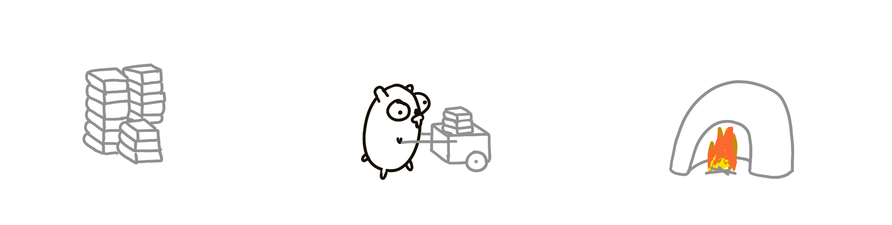
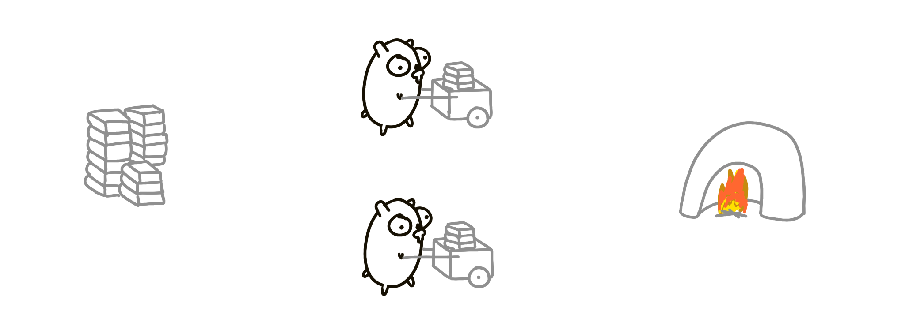
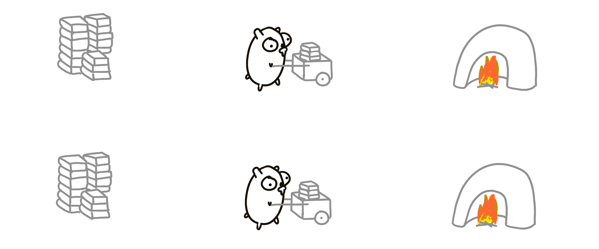
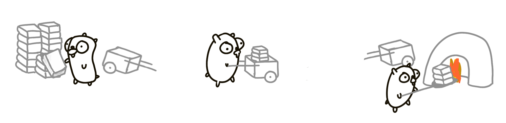
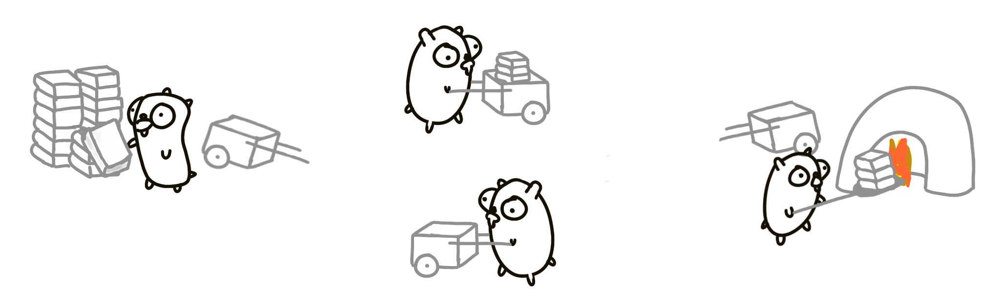
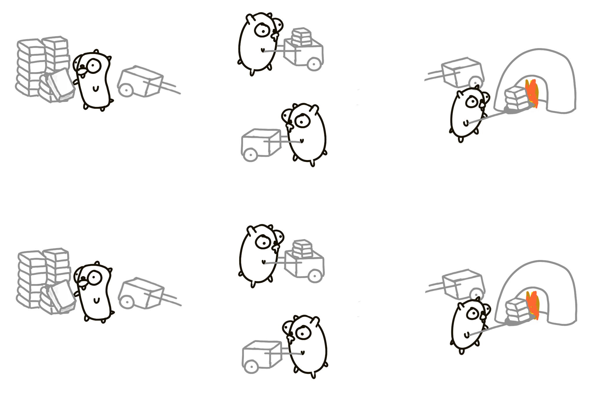
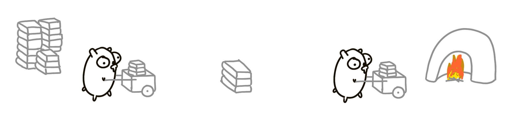
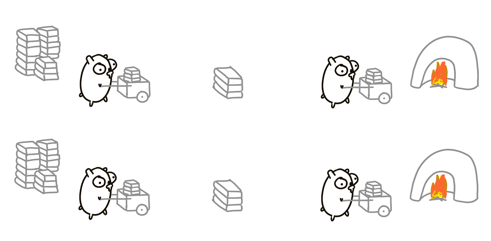
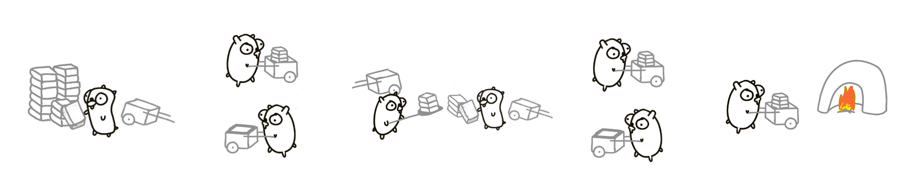
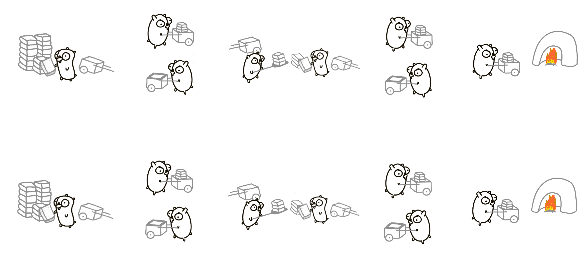

> 本文整理自 [Concurrency is not parallelism](https://go.dev/blog/waza-talk)。

关于 Go 语言和并发处理，存在一个常见的误解：许多程序员认为并发和并行是同一概念。但实际上并非如此，本次演讲将试图解释为什么会有这种误解。

## 并发与并行

> **Concurrency is composition of independently executing things**

- 并发（Concurrency）：把一个大任务拆成 **多个独立的、可分别执行的小部分**，核心是「同时应对多件事」。它描述的是程序的 **组织结构**，和物理上有没有同时运行无关。

> **Parallelism is simultaneous execution of multiple things**

- 并行（Parallelism）：多个任务在 **物理时间上真的同时执行**，核心是「同时做多件事」。它描述的是程序的 **实际运行状态**，依赖多核等硬件条件。

换个更直白的说法：

- 并发：你规划了 "要同时处理 A、B、C 三件事"
- 并行：你真的在同一时刻把 A、B、C 三件事都跑起来了

并发通过组织结构，**有可能** 让任务真正同时执行；但并行并不是并发的目的。**并发的目的在于良好的结构。**

## 并发组合

有一堆书籍需要烧毁。我们派了一只地鼠，把书从书堆搬到焚化炉。

一只地鼠行动缓慢，所以再增加一只吧。不过现在我们需要让它们互相协调，因为它们可能会互相碰撞，或者卡在路线的某一端。解决这个问题的方法之一是让它们通过发送消息来互相沟通，比如"我现在在书堆那里"或者"我正在前往焚化炉的路上"。

如何能更快一些？把所有东西都加倍！两堆书，两个焚化炉！消耗和焚烧的速度可以快一倍。这就是 **并行**。

不过，试着将其视为两个并发过程的组合。我们首先启动一个过程，然后再引入另一个相同过程的实例。这就是所谓的 **并发组合**。

虽然并不容易察觉，但并发组合并不自动等于并行！有可能一次只有一只地鼠在移动。这种设计仍然是并发的，但不是并行的。这类似于单核处理器上的操作系统：由于硬件限制，两个并发任务可能不会真正并行运行。

不过，并发组合本质上是 **可并行化的**。

## 不同的设计

让我们尝试另一种方法。总共有三只地鼠：

1. 一只负责把书装上手推车。
2. 另一只负责将手推车推到焚化炉，再拉回来。
3. 第三只负责把书从手推车上卸下来。

每只地鼠都是一个独立执行的过程。

这种方法可能更快一些，不过差距并不明显。当然还是会有阻塞、装书和卸书时不必要的等待，以及第二只地鼠空跑回程等问题。让我们再增加一只地鼠吧！

## 更细粒度的并发

现在有了第四只地鼠，负责把空手推车送回来。

这个版本比之前的更好，尽管我们增加了更多环节。对管理更精细的组件做 **并发组合**，可以跑得更快。在所有条件都最优的理想情况下（书籍数量、时间安排、距离等），这种方法可以是原始版本的 4 倍速。

这非常重要！我们通过在现有设计中添加了一个 **并发过程**，提升了程序的性能——增加了更多环节，反而跑得更快。之所以能够更快，是因为设计 **可以** 并行；而之所以可以并行，是因为 **并发设计** 更合理。

可以将它们视为各自独立运行的过程，并发组合起来构成完整方案；再进一步并行化，就能提高吞吐：

请注意我们做的事情：先有一个结构良好的系统，再在另一个维度上 **并行化**，希望提高吞吐量。我们理解系统的组合方式，并能控制各个组成部分。

如果地鼠们无法同时运行（回到单核的世界），那也没关系。每次只有一只地鼠在运行，其余七只空闲。整体速度与 **最初单只地鼠的方案** 相同——但设计仍是并发的，且是正确的。这意味着并发设计做对了，就不必强求并行；**并行是可选的。**

## 又一个设计

两只地鼠，中间有一个暂存区。

两个结构相似的地鼠过程并发运行。理论上，速度可以翻倍。像之前一样，我们可以进一步并行化：两个书堆，各自配一个暂存区。

或者再试一种设计：4 只地鼠配合中间一个暂存区。

然后再加倍！16 只地鼠，极高的吞吐量。

虽然这个例子简化得有些夸张，但概念上解决问题的方式应该是：**不要从并行执行出发思考，而是将问题分解为独立的组成部分，再以并发的方式组合在一起。**

## 摘要

有多种方式可以分解这个流程，很容易就能设计出十几种不同的结构。这就是 **并发设计**。一旦完成了分解，并行化就水到渠成，正确性也更容易保证。这种设计本质上是安全的。

- 并发非常强大。
- 并发并不等于并行。
- 并发使并行成为可能。
- 并发让并行（以及扩展等）变得容易。
